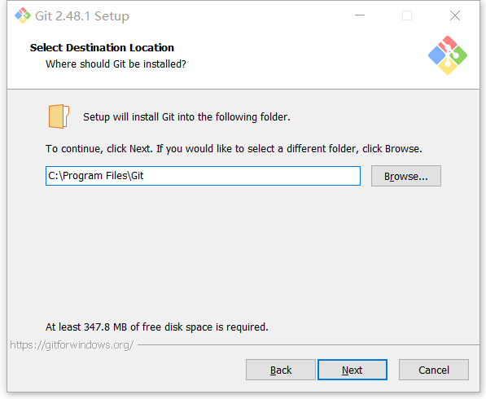
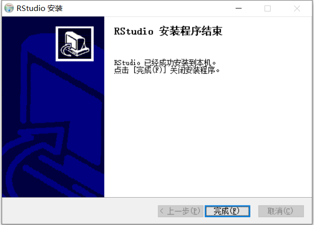
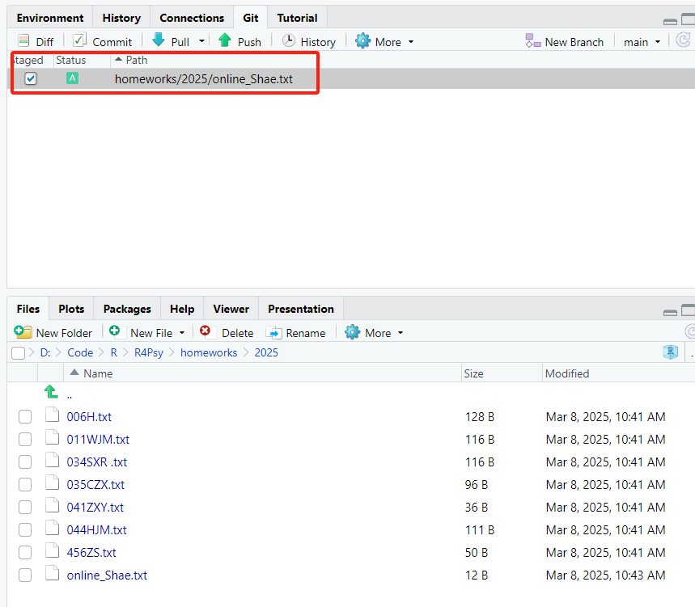
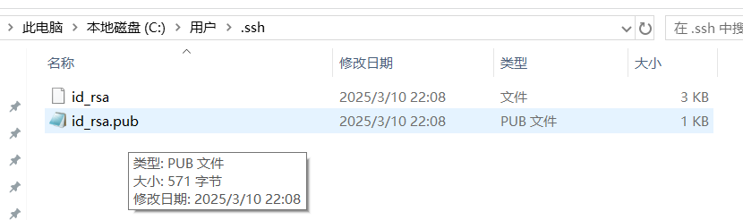

# 环境准备

> 最后修改时间：**2025年3月8日11点07分**
>
> 贡献者：[ShaeRay](https://github.com/ShaeRay)

## Git

### 1. 安装包下载

> 以win10为例

https://git-scm.com/downloads/win

选择 64-bit Git for Windows Setup


### 2. 安装


👇安装位置默认即可，路径中不要含有中文



一路按下Next，不需要修改任何配置

出现下面这个界面，不需要修改，按下【Finish】就安装完成


### 3. 验证

如图所示。出现git version 2.48.1.windows.1 就是安装成功了


### 4. 配置

- 在windows自带的搜索框中打开【Git Bash】


- 配置用户名（Your Name替换成自己的）

  ```bash
  git config --global user.name "Your Name"
  ```

- 配置邮箱（email@example .com替换成自己的）

  ```bash
  git config --global user.email "email@example.com"
  ```

  > Git中无法使用【CTRL+V】粘贴
  >
  > 粘贴单击右键，点【Paste】

  

- 验证是否配置成功

  ```bash
  git config --global --list
  ```

  > name和邮箱出来就可以，其他配置不一样不用管


- 生成SSH key

  ```bash
  ssh-keygen -t rsa -C “上面的邮箱”
  ```

  > 输入后一直回车


- 现在去获取公钥，依次执行下面两个命令，复制得到的结果（ssh开头，邮箱结尾）

  > git里右键点击【copy】才可以复制

```bash
cd ~/.ssh
```

```bash
cat id_rsa.pub
```


- 打开Github。依次点击【头像】、【Settings】、【SSH and GPG  keys】


- New SSH key


- Tille随便写一个，Key里粘贴上面得到的结果，【Add SSH key】


- 下面这样就是成功了


- 验证

  ```bash
  ssh -T git@github.com
  ```

  > 输入yes


- 这样就是成功了（南师大本校的同学如果失败，把校园网关了切热点）

  

## R

https://mirrors.tuna.tsinghua.edu.cn/CRAN/

### 1. 安装


- 所有配置全部默认，不做任何修改，一路下一步


### 2. 验证

- Windows默认搜索，R


- 能打开就是成功了


## R Studio

### 1. 安装

- 安装路径不要有中文就行，没有什么配置项，直接安装




- 打开RStudio


- 用前面装好的64位R即可


## R4psy

- fork老师的仓库

  > https://github.com/hcp4715/R4Psy


- 默认即可，【Create Fork】


- 左上角【File】、【New Project】、【Version Control】


- 选【Git】


- 去github复制自己的仓库SSH地址


- 回来粘贴到【URL】里，注意文件夹不要包含中文


- 下载完成后右侧会出现老师仓库的文件夹和一个【GIT】


- 在【/homeworks/2025】文件夹下创建自己的文件后，会出现在【Git】下，勾选




- 在【Commit message】区域随便填，然后【commit】


- 没什么问题就【close】


- 点击【push】，没什么问题就push成功了


- 回到github，会显示有commit，点击


- 创建pull request


- 填完信息，大功告成

## 常见问题

### 1. 电脑中文用户名无法创建SSH密钥

- ① 在C盘用户文件夹下新建一个 .ssh 文件夹

  

- ② 以管理员权限打开git bash


- ③ 添加参数-f 指定文件夹

  ```bash
  ssh-keygen -t rsa -C "邮箱" -f "C:/Users/.ssh/id_rsa"
  ```

- 在C盘/用户/.ssh文件夹下找到【id_rsa.pub】文件，以txt格式打开并复制

  

- 接上续教程👉打开Github。依次点击【头像】、【Settings】、【SSH and GPG  keys】