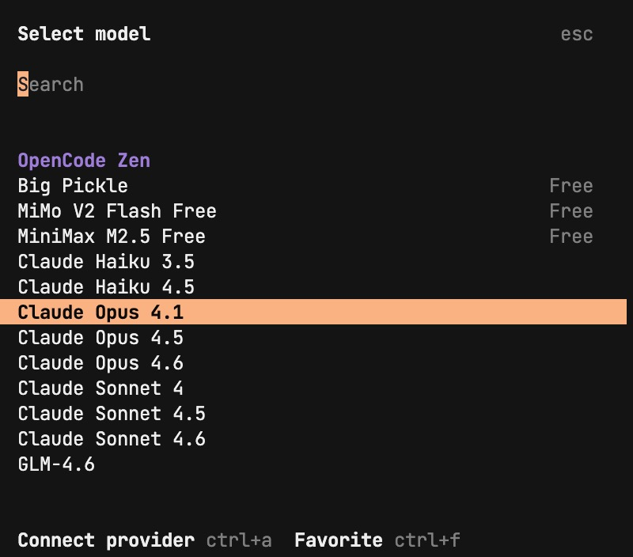

# Git 与 GitHub 学习指南

> 本指南基于 R4Psy 课程第三讲内容编写，帮助学生理解和使用版本控制系统。

---

## 📚 目录

1. [版本控制基础概念](#一版本控制基础概念)
2. [Git 基础](#二git-基础)
3. [GitHub 基础](#三github-基础)
4. [本地版本控制操作](#四本地版本控制操作)
5. [远程版本控制操作](#五远程版本控制操作)
6. [常用 Git 命令速查](#六常用-git-命令速查)
7. [常见问题与解决](#七常见问题与解决)
8. [如何使用 AI 辅助学习](#八如何使用-ai-辅助学习)

---

## 一、版本控制基础概念

### 什么是版本控制？

**版本控制(Version Control)** 是一种管理文件修改历史的系统，特别是用于源代码管理。通常可以分为**本地版本控制**与**远程版本控制**两大类。

#### 本地版本控制 (Local Version Control)

- 在用户的个人计算机上运行，管理和跟踪文件或项目的历史版本
- 允许用户在自己的设备上回退到旧版本、比较文件改动、恢复丢失的文件等
- **不依赖于网络连接**

#### 远程版本控制 (Remote Version Control)

- 侧重于团队协作和共享资源，通常依托于服务器或云服务
- 允许多个用户或团队成员在共同的项目上工作
- 管理和合并彼此的贡献，同时保持项目的同步和一致性

---

## 二、Git 基础

### 什么是 Git？

Git 是目前最常用的免费开源的版本控制工具。

### 安装 Git

1. 访问 https://git-scm.com/downloads 下载安装包
2. Mac 用户可能需要先安装 homebrew，再通过 homebrew 安装 git

### Git 的两种运行模式

#### 1. 终端（Terminal）

- 提供全面的功能访问权限
- 适用于各种命令行界面，包括 Git Bash、CMD、R Terminal 等
- 允许执行复杂的 Git 命令和操作
- 适合需要深度控制和定制 Git 工作流的场景

#### 2. 图形用户界面（GUI Panel）

- 提供更为直观的操作方式，用户只需通过点击即可完成操作
- 可能不支持某些高级功能
- 包括 R Studio 中的 Git 面板和 GitHub Desktop 等
- 适合偏好图形界面或不需要执行复杂 Git 命令的用户

---

## 三、GitHub 基础

### 什么是 GitHub？

- GitHub 是全球最大的开源的在线软件源代码托管服务平台
- 使用 Git 作为版本控制软件
- 在 2018 年被微软公司收购

### 替代平台

Gitee, GitLab, Bitbucket

### 注册账号

访问 https://github.com 注册账号

### 基本操作

#### 创建仓库

1. 在自己的用户界面找到 repository，点击 new
2. 设定一个 repository 的名字
3. 创建 README 文件（可选）
4. 点击 create repository

#### README 文件

- 位于项目根目录中的文本文件（通常为 README.md、README.txt 等）
- 提供了关于项目的基本信息
- 基于 Markdown 语法

#### 常用功能

- **Commit**: 向 GitHub 提交更改
- **History**: 查看历史版本
- **Fork**: 复制一个已存在的代码仓库到自己的账户下，允许在不影响原始仓库的情况下自由地开发和修改代码
- **Pull request**: 通知机制，告诉项目的维护者你已经完成了一段代码的修改并推送到了一个仓库

---

## 四、本地版本控制操作

### 4.1 在 R Studio 中创建 Git 仓库

1. 在 R Studio 中创建一个本地的新项目
2. 创建时勾选 "Create a git repository" 选项

### 4.2 添加文件到 Git

1. 默认情况下，R Studio 中 Git 位于右上角的子窗口
2. 点击 commit，会跳出 Git 面板
3. 勾选更新的文件，向 Git repository 提交更改
4. **重要**：提交更改时不要忘记填写 commit message，否则会报错

### 4.3 跟踪文件改动

- 修改文件并提交后，Git 面板中会出现前后内容的比较
- 可以清楚地看到每次修改的具体内容

### 4.4 查看历史版本

1. 点击 Git 面板中的 History 按钮
2. 会弹出一个列出了所有的提交历史的窗口
3. 点击任何一个提交，查看该提交的详细信息，包括具体的更改内容

### 4.5 配置 Git 忽略文件 (.gitignore)

#### 什么是 .gitignore？

- 告诉 Git 哪些文件或文件夹不应该被跟踪
- 通常用于忽略临时文件、敏感信息、大型数据文件等

#### 常用语法

```gitignore
# 忽略整个文件夹
test1/

# 忽略特定类型的文件
*.txt

# 忽略特定文件
secret.txt

# 不忽略特定文件（例外规则）
!important.txt
```

#### 在 R Studio 中编辑 .gitignore

1. 在 R Studio 右下角的子窗口 Files 处点击 '.gitignore'
2. 修改 .gitignore 文件内容
3. 向 Git repository 提交修改

#### 常见问题：.gitignore 不生效

**原因 1：文件已被 Git 跟踪**

如果先添加的文件后修改的 gitignore，文件可能已被 Git 跟踪，存在缓存，仅修改 gitignore 是不够的。

**解决方法**：

在 Terminal 下输入以下命令移除缓存：

```bash
# 移除整个目录的缓存
git rm --cached -r <目录名>

# 移除单个文件的缓存
git rm --cached <文件名>
```

**原因 2：语法错误**

请检查 .gitignore 中是否存在语法错误。

**原因 3：.gitignore 文件本身被忽略**

在 Terminal 输入以下命令检查：

```bash
git check-ignore -v .gitignore
```

如果命令没有任何输出，这意味着 .gitignore 是有效的并被 Git 正确处理。

---

## 五、远程版本控制操作

### 5.1 连接本地仓库与远程仓库

有两种方法：

#### 方法 1：将现有本地 Git 仓库连接到新创建的远程 GitHub 仓库

1. 在 GitHub 创建一个新的仓库（不要创建 README、.gitignore 和许可证文件）
2. 在 R Studio 中创建新的版本控制项目
3. 粘贴 GitHub 仓库的 URL
4. 选择本地 Git 仓库创建的位置
5. 创建后连接成功建立
6. 复制旧文件夹的内容并粘贴到新的本地仓库中（注意：请先复制 .gitignore 文件）

#### 方法 2：从远程 GitHub 仓库创建新的本地 Git 仓库（Clone）

1. 从已有的 GitHub 仓库中获取 URL
2. 在 R Studio 中创建新的版本控制仓库
3. 选择合适的储存路径
4. 创建后连接成功建立，已将已有的仓库克隆到本地

### 5.2 Fork 仓库

**推荐做法**：合作时先将中央仓库 fork 到自己的仓库，最终通过 pull request 推送到中央仓库。

### 5.3 推送更改到 GitHub (Push)

1. 在 R Studio 的 Git 面板中点击 Push 按钮
2. **注意**：push 前不要忘记先 commit 你的修改！

### 5.4 从 GitHub 拉取更新 (Pull)

1. 在 R Studio 的 Git 面板中点击 Pull 按钮
2. **注意**：fork 的仓库需要与中央远端 GitHub repository 保持一致

### 5.5 提交 Pull Request

1. 在自己的 GitHub 仓库页面点击 "Contribute" → "Open pull request"
2. 填写 pull request 的标题和描述
3. 提交 pull request 等待审核

---

## 六、常用 Git 命令速查

### 初始设置

```bash
# 配置用户名
git config --global user.name "你的名字"

# 配置邮箱
git config --global user.email "你的邮箱@example.com"

# 查看配置
git config --list
```

### 仓库操作

```bash
# 初始化新仓库
git init

# 克隆远程仓库
git clone <仓库地址>

# 查看远程仓库地址
git remote -v

# 添加远程仓库
git remote add origin <仓库地址>
```

### 日常操作

```bash
# 查看仓库状态
git status

# 添加文件到暂存区
git add <文件名>        # 添加特定文件
git add .               # 添加所有更改

# 提交更改
git commit -m "提交信息"

# 查看提交历史
git log
git log --oneline       # 简洁模式
git log --graph         # 图形化显示
```

### 分支操作

```bash
# 查看分支
git branch

# 创建新分支
git branch <分支名>

# 切换分支
git checkout <分支名>
git switch <分支名>     # 新语法

# 创建并切换分支
git checkout -b <分支名>
git switch -c <分支名>  # 新语法

# 合并分支
git merge <分支名>

# 删除分支
git branch -d <分支名>  # 安全删除
git branch -D <分支名>  # 强制删除
```

### 远程操作

```bash
# 推送到远程
git push origin <分支名>
git push -u origin <分支名>  # 设置上游分支

# 从远程拉取
git pull origin <分支名>

# 获取远程更新（不合并）
git fetch origin
```

### 撤销操作

```bash
# 取消暂存
git reset HEAD <文件名>
git restore --staged <文件名>  # 新语法

# 丢弃本地更改
git checkout -- <文件名>
git restore <文件名>           # 新语法

# 修改最后一次提交
git commit --amend

# 回退到指定版本
git reset --soft HEAD~1    # 保留更改（已暂存）
git reset --mixed HEAD~1   # 保留更改（未暂存）
git reset --hard HEAD~1    # 丢弃更改（危险！）

# 暂存更改
git stash                  # 暂存当前更改
git stash list            # 查看暂存列表
git stash pop             # 恢复最近暂存
git stash drop            # 删除最近暂存
```

---

## 七、常见问题与解决

### 问题 1：Merge Conflict（合并冲突）

**现象**：合并分支时出现冲突，提示 "CONFLICT"

**解决步骤**：

1. 查看冲突文件：`git status`
2. 打开冲突文件，找到冲突标记（`<<<<<<< HEAD` 到 `>>>>>>> branch-name` 之间的内容）
3. 手动编辑文件，保留需要的代码，删除冲突标记
4. 添加解决后的文件：`git add <文件名>`
5. 提交更改：`git commit -m "解决合并冲突"`

### 问题 2：Permission Denied（权限错误）

**可能原因**：
- SSH key 未配置或配置错误
- Personal Access Token 过期或权限不足
- 没有仓库的写入权限

**解决方法**：
- 检查 SSH key 配置
- 重新生成 Personal Access Token
- 确认对仓库有写入权限

### 问题 3：Detached HEAD State（分离头指针状态）

**现象**：提示 "You are in 'detached HEAD' state"

**解决方法**：

```bash
# 方法 1：创建新分支保存当前更改
git checkout -b <新分支名>

# 方法 2：返回之前的分支（放弃当前更改）
git checkout <分支名>
```

### 问题 4：第一次推送需要认证

**现象**：提示输入用户名密码，或认证失败

**解决方法**：

GitHub 已不支持密码认证，需要使用 Personal Access Token：

1. 登录 GitHub
2. 进入 Settings → Developer settings → Personal access tokens
3. 点击 Generate new token (classic)
4. 选择需要的权限（至少勾选 repo）
5. 生成后复制 token
6. 在提示输入密码时，粘贴 token 而不是密码

---

## 八、如何使用 AI 辅助学习

### 使用 OpenCode 里的模型

OpenCode 提供了多种 AI 模型，你可以用**自然语言**向它们提问，获得即时帮助：

#### OpenCode Zen 免费模型

OpenCode Zen 提供了一系列**免费**的 AI 模型供你使用：



**免费模型包括**：
- **Nemotron 3 Super Free** - OpenCode Zen
- **GLM-5 Z.AI** 
- **MiniMax M2.5** - OpenCode Zen
- **Big Pickle** - Free
- **MiMo V2 Flash Free** - Free
- **MiniMax M2.5 Free** - Free
- **Claude Haiku 3.5/4.5** - Free
- **Claude Opus 4.1/4.5/4.6** - Free
- **Claude Sonnet 4** - Free

> 💡 **提示**：在 OpenCode 中按 `Ctrl+Shift+L`（或点击模型选择按钮）可以打开模型选择面板，选择带有 "Free" 标签的模型即可免费使用。

#### 概念性问题

- "什么是版本控制？"
- "本地版本控制和远程版本控制有什么区别？"
- "解释 Git 和 GitHub 的关系"

#### 操作指导

- "如何在 R Studio 中创建 Git 仓库？"
- "如何配置 git 用户名和邮箱？"
- "如何忽略某些文件不让 Git 跟踪？"

#### 命令执行

- "帮我初始化一个 git 仓库"
- "帮我克隆这个仓库 https://github.com/example/repo.git"
- "查看当前仓库状态"

#### 错误排查

- "为什么我的 .gitignore 没有生效？"
- "解决这个合并冲突：[粘贴错误信息]"
- "Permission denied 是什么意思？"

### 提问技巧

1. **具体描述问题**：提供足够的上下文信息
2. **提供错误信息**：如果遇到错误，复制完整的错误信息
3. **说明你的目标**：告诉 AI 你想达成什么目的
4. **提供环境信息**：说明你使用的操作系统、软件版本等

### 示例对话

**你**：我在 R Studio 中创建了项目，但是 Git 面板没有显示

**AI**：可能的原因有：
1. 创建项目时没有勾选 "Create a git repository"
2. 项目文件夹不是一个 git 仓库

**解决方法**：
1. 在 Terminal 中运行 `git init` 初始化仓库
2. 或者重新创建项目，确保勾选 git 选项

---

## 参考资源

- 课程视频（B站网友推荐）：https://www.youtube.com/watch?v=bUoN85QvC10
- Git 官方文档：https://git-scm.com/doc
- GitHub 官方指南：https://docs.github.com/cn
- Git Cheat Sheet：搜索 "git cheatsheet" 可找到多种版本

---

## 作业任务

### 任务 1：创建 GitHub 仓库并进行一次本地提交

- 创建一个 GitHub 账号
- 创建一个新的仓库
- 将本地的一个文件夹与远程仓库连接
- 在本地的文件夹中创建/更新 README.md 并推送到远程仓库

### 任务 2：完成一次 fork、更新并 pull request

- Fork 一个 hcp4715/R4Psy 的仓库
- 在本地克隆该仓库
- 在本地的文件夹的 `homeworks` 子文件夹中创建特定命名的 txt 文件
  - 命名规则：学号后三位 + 姓名首字母（例如，张三 123456 的 txt 文件应为 `456ZS.txt`）
- 将该文件推送到远程仓库
- 向 hcp4715/R4Psy 提交 pull request

---

**祝学习愉快！遇到问题记得查看本指南或使用 AI 工具寻求帮助。**
