class: center, middle
<span style="font-size: 50px;">**第十章**</span> <br>
<span style="font-size: 50px;">回归模型(三)：广义线性模型</span> <br>
<span style="font-size: 30px;">胡传鹏</span> <br>
<span style="font-size: 20px;"> </span> <br>
<span style="font-size: 30px;">`r Sys.Date()`</span> <br>
<span style="font-size: 20px;"> Made with Rmarkdown</span> <br>

---
```{r setup, include=FALSE}
knitr::opts_chunk$set(
  message = FALSE,
  warning = FALSE,
  fig.align = 'center',
  fig.height=6, fig.width=7.5,
  fig.retina=2
)
```

```{css extra.css, echo=FALSE}
.bigfont {
  font-size: 30px;
}
.size5{
font-size: 24px;
}
.tit_font{
font-size: 60px;
}

```

```{r, echo = FALSE}
## 准备工作
# Packages
if (!requireNamespace('pacman', quietly = TRUE)) {
    install.packages('pacman')
}

pacman::p_load(
  # 本节课需要用到的 packages
  here, tidyverse, ggplot2,
  # ANOVA & HLM
  bruceR, lmerTest, lme4, broom, afex, interactions, easystats, caret, 
  # 生成课件
  xaringan, xaringanthemer, xaringanExtra, knitr)

options(scipen=99999,digits = 5)
```

```{r, echo = FALSE}
#读取数据
df.match <- bruceR::import(here::here('data','match','match_raw.csv')) %>% 
  tidyr::extract(Shape, 
                 into = c('Valence', 'Identity'),
                 regex = '(moral|immoral)(Self|Other)',
                 remove = FALSE) %>% #将Shape列分为两列
  dplyr::mutate(Valence = factor(Valence, levels = c('moral','immoral'), labels = c('moral','immoral')),
                Identity = factor(Identity, levels = c('Self','Other'), labels = c('Self','Other'))) %>%
  dplyr::filter(ACC == 0 | ACC == 1, 
                RT >= 0.2 & RT <= 1.5,
                Match == 'match',
                (!Sub %in% c(7302,7303,7338))
                )#筛选
```

```{r, echo = FALSE}
df.match.aov <- df.match %>%
  dplyr::group_by(Sub, Valence, Identity) %>%
  dplyr::summarise(mean_ACC = mean(ACC)) %>%
  dplyr::ungroup()
```

```{r xaringan-panelset, echo=FALSE}
xaringanExtra::use_panelset()
```

# 补充内容: easystats系统包的简介
```{r echo=FALSE, out.width='60%'}
knitr::include_graphics('./picture/chp10/bilibili.png')
```

<br>
<br>
<center>
https://www.bilibili.com/video/BV1rz421D7iJ/?spm_id_from=333.337.search-card.all.click
</center>
---
class: center, middle
.tit_font[
当因变量不服从正态分布(如正确率)时如何处理？
]
---
.panelset[
.panel[.panel-name[df.match]
```{r}
head(df.match[c(3,11:17)],5) %>% DT::datatable()
```

.panel[.panel-name[df.match.aov]
```{r}
df.match.aov %>%
  dplyr::select(1:4) %>%
  head(5) %>% 
  DT::datatable()
```

]]]
---
.tit_font[  Contents</h1>]
<br>
<br>
.bigfont[
    10.1 广义线性模型<br>
<br>
    10.2 二项分布<br>
<br>
    10.3 其他分布<br>
<br>
    10.4 代码实操<br>
<br>
    10.5 方法比较<br>
]
---
#10.1 广义线性模型(Generalized Linear Model, GLM)
##多元线性回归（Multiple Linear Regression）
<br>
.normal[
$$Y = b_0 + b_{1}X_{1} + b_{2}X_{2} +... + b_{p}X_{p} + \epsilon$$
- $Y$ : 因变量，Dependent variable
- $X_i$ : 自变量，Independent (explanatory) variable
- $b_0$ : 截距，Intercept
- $b_i$ : 斜率，Slope
- $\epsilon$ : 残差，Residual (error)
]
---
#10.1 广义线性模型(Generalized Linear Model, GLM)
##线性模型的组成部分
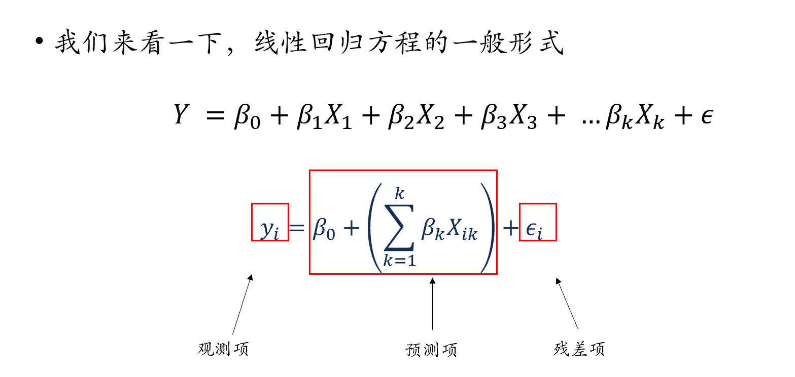
---
#10.1 广义线性模型(Generalized Linear Model, GLM)
##线性模型的组成部分
```{r echo=FALSE, out.width='60%'}
knitr::include_graphics('./picture/chp10/plot.png')
```

---
#10.1 广义线性模型(Generalized Linear Model, GLM)
##回归方程的多种形式<br>
.bigfont[
- 简单线性回归：
$$Y = b_0+b_1 X_1+ b_2 X_2+…+b_p X_p + \epsilon$$ 
- 线性代数表达：
$$y_i = b_0 + b_1 X_{i1} + b_2 X_{i2} + … + b_p X_{ip} + \epsilon$$ 
- 矩阵表达：
$$Y= X\beta + \epsilon$$
- 代码表达(r)：
$$Y \sim X_1 + X_2 + ... + X_n$$
]
---
#10.1 广义线性模型(Generalized Linear Model, GLM)
##回归方程的多种表达形式<br>
<br>
.bigfont[
- 回归模型形式：观测项 = 预测项 + 误差项 <br>
- 假定观测项是正态分布，上述公式可以重新表达为： <br>
$$y \sim N(\mu, \epsilon)$$ 
  - 其中，$\mu$为预测值，即
  $$μ = \beta_0 + \beta_1 x$$
- 观测值服从以预测项为均值的**正态分布**，观测值与预测值之间的差值就是残差。<br>
]
--

.bigfont[
如果因变量不服从正态分布，如何构建回归模型？
]
---
#10.1 广义线性模型(Generalized Linear Model, GLM)

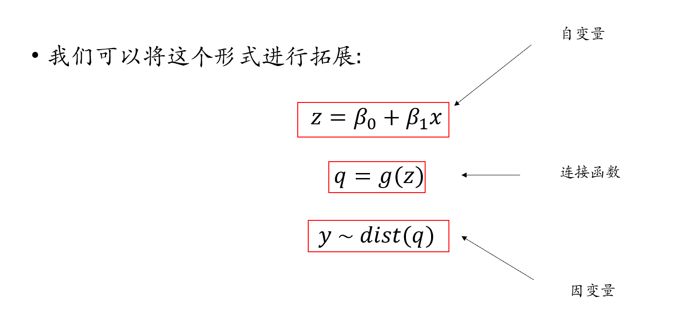
---
#10.1 广义线性模型(Generalized Linear Model, GLM)
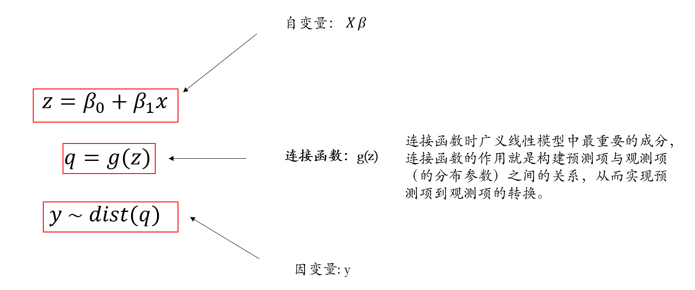

---
#10.1 广义线性模型(Generalized Linear Model, GLM)
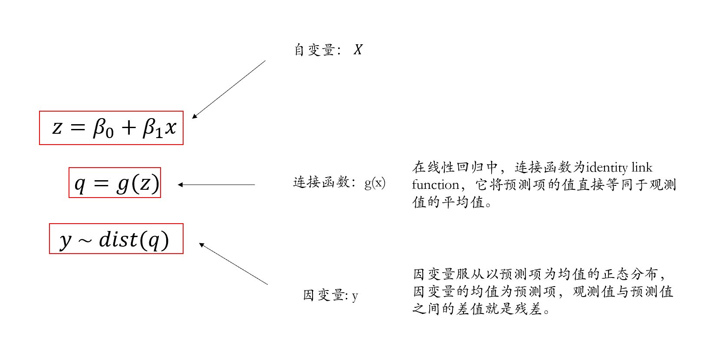

---
#10.1 广义线性模型(Generalized Linear Model, GLM)
##Generalized Linear Model, GLM
###在简单线性回归中，预测项的连接函数等于它本身

---
#10.1 广义线性模型(Generalized Linear Model, GLM)
.bigfont[
- 简单线性模型可视为GLM的特殊形式，预测项的连接函数等于它本身，观测项为正态分布。
- 在广义线性模型中：
  - 观测项不一定是正态分布（残差不一定是正态分布）
  - 连接函数不等于其自身

- 广义线性模型，能够对非正态分布的因变量进行建模
]
---
#10.2 二项分布(Binomial Distribution)
##伯努利试验
<br>
.bigfont[
- 同样的条件下重复地、相互独立地进行的一种随机试验。
<br>
<br>
- 该随机试验只有两种可能结果：发生或者不发生。
<br>
<br>
- 假设该项试验独立重复地进行了n次，那么就称这一系列重复独立的随机试验为n重伯努利试验(n-fold bernoulli trials)。
<br>
<br>
- n次独立重复的伯努利试验的概率分布服从二项分布
]
---
#10.2 二项分布(Binomial Distribution)
.bigfont[
- 每次试验中事件A发生的概率为p
<br><br>
- X表示n重伯努利试验中事件A发生的次数，X的可能取值为0，1，…，n
<br><br>
- 对每一个k（0 ≤ k ≤ n）,事件{X = k} 指”n次试验中事件A恰好发生k次”
<br><br>
- 随机变量X服从以n, p为参数的二项分布，写作 $X \sim B(n, p)$ 
<br><br>
- $p \in [0,1]$, $n \in N$ 

$$P(X=k )=𝐶_𝑛^𝑘 𝑝^𝑘 𝑞^{𝑛−𝑘}= 𝐶_𝑛^𝑘 𝑝^𝑘 (1−𝑝)^{𝑛−𝑘}$$
$$𝐶_𝑛^𝑘= 𝑛!/𝑘!(𝑛−𝑘)! $$
]
---
#10.2 二项分布(Binomial Distribution)
##抛硬币
```{r, echo=FALSE}
simulate_coin_toss <- function(prob_head, num_people, num_tosses) {
  # 初始化一个向量来存储每个人正面朝上的总次数
  total_heads <- rep(0, num_people)
  # 模拟每个人抛硬币的次数，并计算正面朝上的总次数
  for (i in 1:num_people) {
    tosses <- rbinom(num_tosses, size = 1, prob = prob_head)
    total_heads[i] <- sum(tosses)
  }
  
  # 绘制直方图
  hist(total_heads, main = "Coin Toss Results for All People", xlab = "硬币正面朝上的次数", ylab = "人数", col = 'white', border = 'black', breaks = seq(min(total_heads), max(total_heads) + 1, by = 1), xlim = c(0,max(total_heads) + 1))
  
  # 返回每个人正面朝上的总次数
}
```

.panelset[
.panel[.panel-name[5人，每人10次]
```{r}
simulate_coin_toss(prob_head = 0.5,num_people = 5, num_tosses = 10)
```

.panel[.panel-name[10人，每人10次]

```{r}
simulate_coin_toss(prob_head = 0.5,num_people = 10, num_tosses = 10)
```

.panel[.panel-name[1000人，每人10次]

```{r}
simulate_coin_toss(prob_head = 0.5,num_people = 1000, num_tosses = 10)
```

]]]]

---
#10.2 二项分布(Binomial Distribution)
.bigfont[
- 已知一次试验中的每次尝试中事件A发生的概率$p$，共进行$n$次独立重复的伯努利试验
- 事件A在一次试验中出现k次，事件A在n次试验中出现次数的平均数
$$（𝑘_1+𝑘_2+𝑘_3+...+𝑘_𝑛/𝑛)$$
- 当n → ∞，$p$ ≠ q，$np$ ≥ 5且$nq$ ≥ 5，事件A在$n$次试验中出现次数的平均数：
$$\mu = np$$
- 事件A出现次数所属分布的标准差：
$$ \sigma = \sqrt{𝑛𝑝𝑞}$$
]
---
#10.2 二项分布(Binomial Distribution)
## 如何将$z$与二分变量进行连接？
### (1)将预测项映射到(0,1)之间，例如，使用
$$\frac{1}{1+exp(-z)}$$
### (2)找到一个分布，能根据(0,1)之间的值转成二分变量，例如，伯努利分布。
.pull-left[

]
.pull-right[
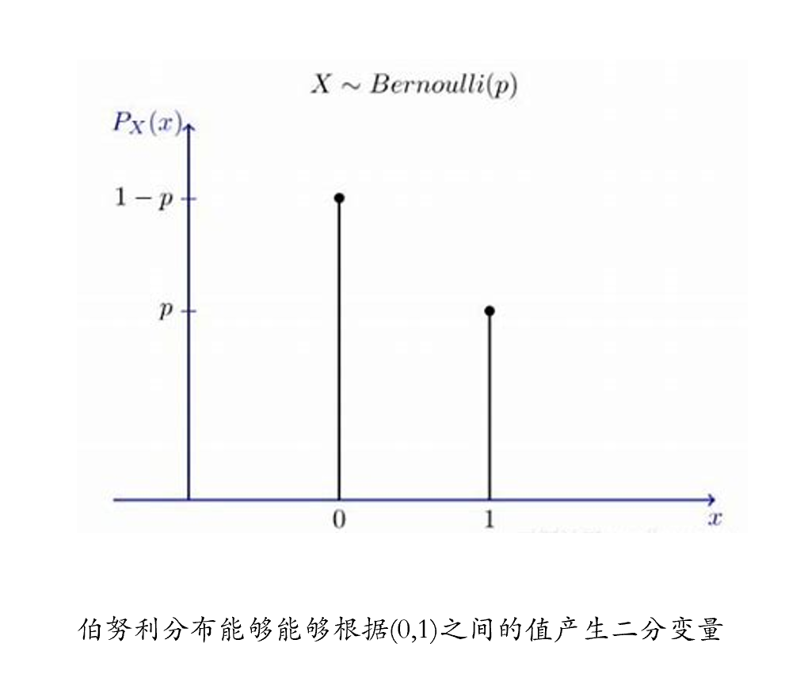
]
---
#10.2 二项分布(Binomial Distribution)
```{r echo=FALSE, out.width='80%'}
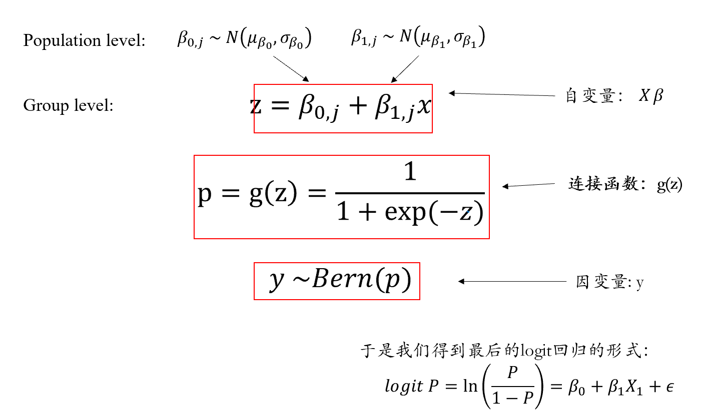
```

---
#10.2 二项分布(Binomial Distribution)
##参数求解
.bigfont[
- 对于logit回归，我们可以使用极大似然估计对其进行求解
- 该求解过程比较复杂，一般由计算机自动完成
]
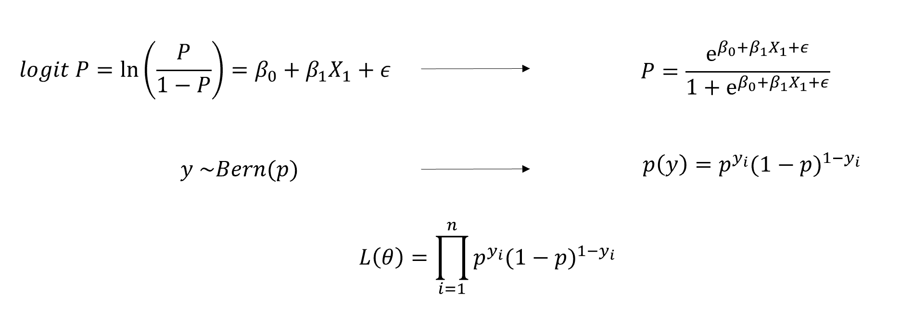
---
#10.3 其他分布
##泊松分布(Poisson distribution)
.bigfont[
- 在固定时间间隔或空间区域内发生某种事件的次数的概率。
- 适用于事件以恒定平均速率独立发生的情况
- 例如电话呼叫、网站访问、机器故障等。
$$P(X = k) = \frac{e^{-\lambda} \lambda^k}{k!}$$
- λ:事件在给定时间或空间内的平均发生率（或平均数量）。
- k:可能的事件发生次数，可以是0, 1, 2, …
]
---
#10.3 其他分布
##泊松分布(Poisson distribution)

```{r}
set.seed(123) # 设置随机种子以获得可重复的结果
random_samples <- rpois(1000, lambda = 5)
hist(random_samples,col = 'white', border = 'black',)
```

---
#10.3 其他分布
##泊松分布(Poisson distribution)
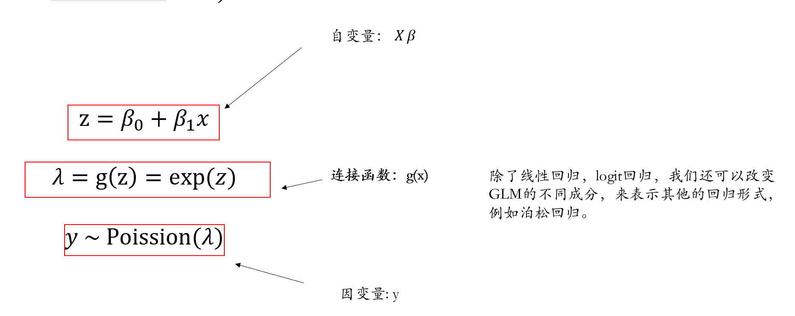
---
#10.3 其他分布
##伽马分布(Gamma distribution)
<br>
.bigfont[
- 伽马分布（Gamma Distribution）是统计学的一种连续概率函数，是概率统计中一种非常重要的分布。
- “指数分布”和“卡方分布”都是伽马分布的特例。
$$f(x | \alpha, \beta) = \frac{\beta^\alpha x^{\alpha-1} e^{-\beta x}}{\Gamma(\alpha)}$$
- α:形状参数（shape parameter），决定了分布的曲线形态，尤其是峰值的位置和曲线的尖峭程度。
- β:尺度参数（scale parameter），影响分布的宽度；当尺度参数增大时，分布会变得更宽且矮平；尺度参数减小时，分布会变得更窄且高耸。
]
---
#10.3 其他分布
##伽马分布(Gamma distribution)
```{r echo=FALSE, out.width='60%'}
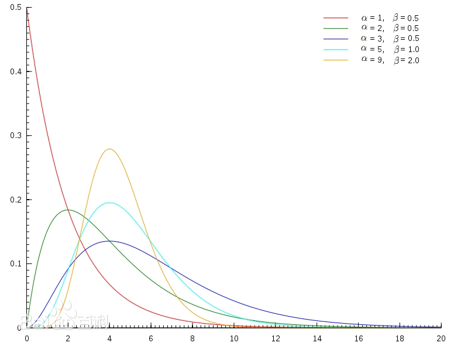
```


---
#10.4 代码实操
##首先分析一个被试的数据
```{r}
df.match.7304 <- df.match %>%
  dplyr::filter(Sub == 7304)
mod_7304_full <- stats::glm(data = df.match.7304,
                          formula = ACC ~ 1 + Identity * Valence,
                          family = binomial)
summary(mod_7304_full) %>%
  capture.output() %>% .[c(6:11,15:19)]
```

---
#10.4 代码实操

.panelset[
.panel[.panel-name[mod_null]
```{r}
#无固定效应
mod_null <- lme4::glmer(data = df.match,
                   formula = ACC ~ (1 + Identity * Valence|Sub),
                   family = binomial)
#performance::model_performance(mod_null)
summary(mod_null) %>%
  capture.output()%>% .[c(7:8,14:24)]
```

.panel[.panel-name[mod]
```{r}
#随机截距，固定斜率
mod <- lme4::glmer(data = df.match,
                     formula = ACC ~ 1 + Identity * Valence + (1|Sub), 
                     family = binomial)
#performance::model_performance(mod)
summary(mod) %>%
  capture.output() %>% .[c(7:8,14:24,28:32)]
```

.panel[.panel-name[model_full]
```{r}
#随机截距，随机斜率
mod_full <- lme4::glmer(data = df.match,
                          formula = ACC ~ 1 + Identity * Valence + (1 + Identity * Valence|Sub), 
                          family = binomial)
##performance::model_performance(mod_full)
summary(mod_full) %>%
  capture.output() %>% .[c(6:7,13:18,21:26,30:34)]
```

.panel[.panel-name[模型比较anova]
```{r}
stats::anova(mod_null, mod, mod_full)
```

.panel[.panel-name[模型比较compare_performance]
```{r,results='hide'}
performance::compare_performance(mod_null, mod, mod_full, rank = TRUE, verbose = FALSE)
```

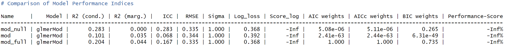
]]]]]]

---
#10.4 代码实操
##结果解读
```{r}
summary(mod_full) %>% capture.output() %>% .[c(21:26)]
```

```{r echo=FALSE, out.width='60%'}
knitr::include_graphics('./picture/chp10/logit2.png')
```
.pull-left[
- MoralSelf:
$P=\frac{e^{2.73}}{1+e^{2.73}} = 0.939$
<br>
- ImmoralSelf:
$P=\frac{e^{2.73-1.10 }}{1+e^{2.73-1.10}} = 0.836$
]
.pull-right[
- MoralOther:
$P=\frac{e^{2.73-0.76 }}{1+e^{2.73-0.76 }} = 0.878$
<br>
- ImmoralOther:
$P=\frac{e^{2.73-0.76-1.10+0.89}}{1+e^{2.73-0.76-1.10+0.89}} = 0.853$
]
---
#10.4 代码实操

```{r}
#交互作用
interactions::cat_plot(model = mod_full,
                       pred = Identity,
                       modx = Valence)
```


---
#10.5 方法比较

.panelset[
.panel[.panel-name[anova]
```{r, results = 'hide'}
res <- bruceR::MANOVA(data = df.match.aov,
       subID = 'Sub', # 被试编号
       dv= 'mean_ACC', # dependent variable
       within = c('Identity', 'Valence')) 
```

```{r}
capture.output(res) %>% .[3:8]
```


.panel[.panel-name[EMMAMNS]
```{r}
res %>%
  bruceR::EMMEANS(effect = 'Valence', by = 'Identity') %>%
  capture.output()
```

.panel[.panel-name[GLM]
```{r}
stats::anova(mod_full)
```

.panel[.panel-name[HLM]


```{r}
mod_anova <- lme4::lmer(data = df.match,
                        formula = ACC ~ 1 + Identity * Valence + (1 + Identity * Valence|Sub))
stats::anova(mod_anova)
```

.panel[.panel-name[HLM_mean]
```{r}
mod_mean <- lme4::lmer(data = df.match.aov,
                          formula = mean_ACC ~ 1 + Identity * Valence + (1|Sub) + (1|Identity:Sub) + (1|Valence:Sub))
stats::anova(mod_mean)

```

.panel[.panel-name[compare]
```{r, results='hide'}
performance::compare_performance(mod_full, mod_anova, rank = TRUE, verbose = FALSE)
```

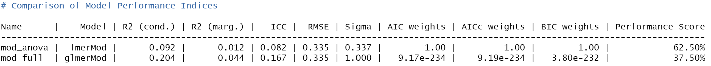

```{r}
stats::anova(mod_full, mod_anova)
```


]]]]]]]

---
#10.5 方法比较
## 留出法
```{r model prediction}
# 设置种子以确保结果的可重复性
set.seed(456)

# 随机选择70%的数据作为训练集，剩余的30%作为测试集
train_index <- caret::createDataPartition(df.match$Sub, p = 0.7, list = FALSE)
train_data <- df.match[train_index, ]
test_data <- df.match[-train_index, ]

# 根据训练集生成模型
model_full <- lme4::glmer(data = train_data,
                          formula = ACC ~ 1 + Identity * Valence + (1 + Identity * Valence|Sub), 
                          family = binomial)
model_anova <- lme4::lmer(data = train_data,
                          formula = ACC ~ 1 + Identity * Valence + (1 + Identity * Valence|Sub))

# 使用留出法评估模型性能
pre_mod_full <- predict(model_full, newdata = test_data)
pre_mod_anova <- predict(model_anova, newdata = test_data)

```

---
#10.5 方法比较
## 留出法
.pull-left[
```{r}
# 计算模型的性能指标
performance_mod_full <- c(RMSE = sqrt(mean((test_data$ACC - pre_mod_full)^2)),
                R2 = cor(test_data$ACC, pre_mod_full)^2)
# 打印性能指标
print(performance_mod_full)
```
]
.pull-right[
```{r}
# 计算模型的性能指标
performance_mod_anova <- c(RMSE = sqrt(mean((test_data$ACC - pre_mod_anova)^2)),
                R2 = cor(test_data$ACC, pre_mod_anova)^2)

# 打印性能指标
print(performance_mod_anova)
```

]

---
#10.5 方法比较
## 重复测量分析的不足
.bigfont[
- 会产生难以解释的结果
  - 假设在10个回答中，正确回答8次，错误回答2次
  - 此时95%CI为[0.52,1.08] ( = 0.8 ± 0.275)
- 方差不齐，不满足方差分析基本假设

$$\mu = np$$
$$𝜎 = √(𝑛𝑝𝑞 )$$
$$𝜎_p^2 = \frac{p(1-p)}{n}$$
]
Jaeger, T. F. (2008). Categorical data analysis: Away from ANOVAs (transformation or not) and towards logit mixed models. *Journal of Memory and Language, 59*(4), 434-446. doi:http://dx.doi.org/10.1016/j.jml.2007.11.007


---
class: center, middle
.tit_font[
思考
]
<br>
<span style="font-size: 50px;">信号检测论是否可以用广义线性模型分析？</span> <br>

