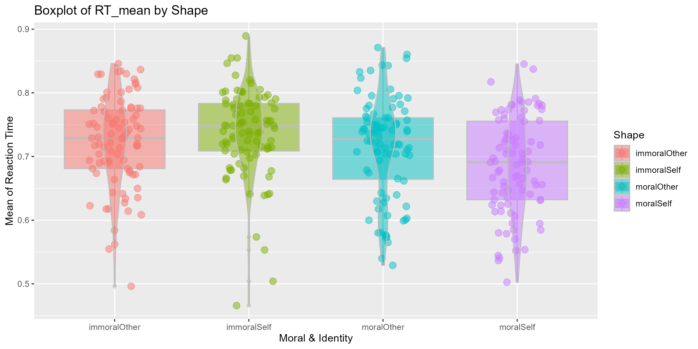
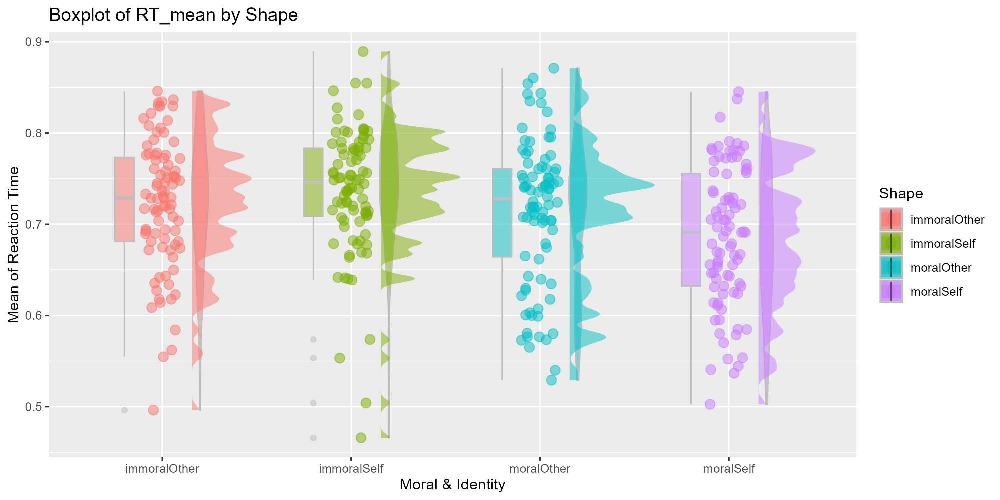
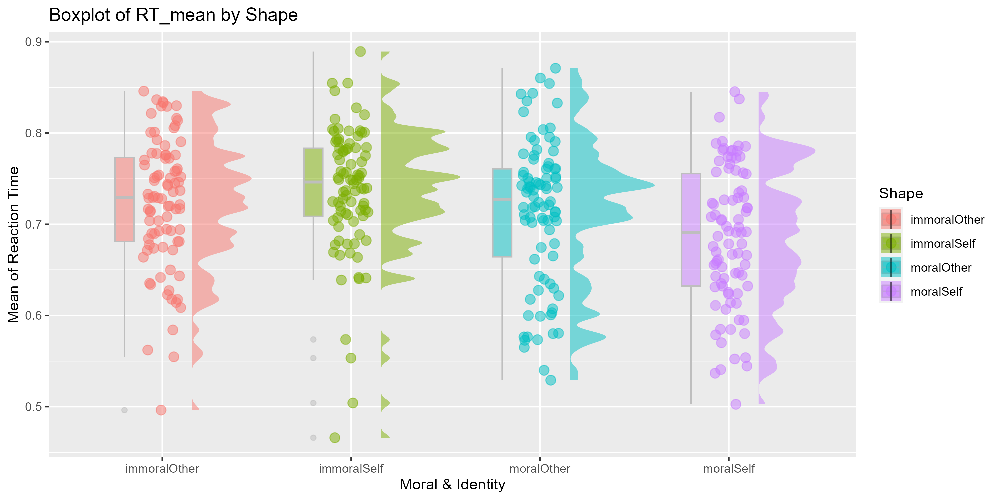
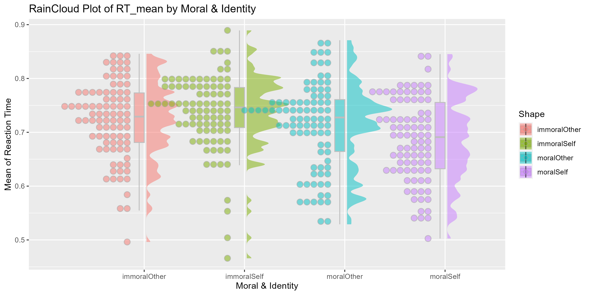
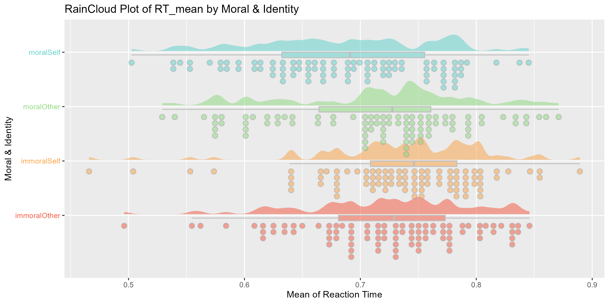

class: center, middle
<span style="font-size: 60px;">第十一章</span> <br>
<span style="font-size: 50px;">如何得到可发表的图像</span> <br>
<span style="font-size: 50px;">数据可视化进阶</span> <br>
<span style="font-size: 30px;">ggplot2</span> <br>
<br>
<br>
<span style="font-size: 30px;">胡传鹏</span> <br>
<span style="font-size: 30px;">2023/05/08</span> <br>

---
class: center, middle
<span style="font-size: 60px;">11.1 Layers and Facets</span> <br>
---
<br>
<div style="display:flex; align-items:center; justify-content:center;">
  
  
</div>
---
# <h1 lang="en">Layers</h1>
# <h4 lang="en"> </h4>
<div style="display:flex; align-items:center;">
  
</div>
<br>
_<h4 lang="zh-CN">相信大家都用过PhotoShop，对图层这个概念一定已经非常熟悉了 </h4>_

---
# <h1 lang="en">Layers</h1>
# <h4 lang="en"> </h4>
<div style="display:flex; align-items:center; justify-content:center;">
  
</div>
<br>
_<h4 lang="zh-CN">在ggplot2中，用 + 加号来表示一个个图层 </h4>_

---
# <h1 lang="en">Layers</h1>

<div style="display:flex; align-items:center; justify-content:center;">
  
</div>
<br>
_<h4 lang="zh-CN">和PS类似，ggplot2也是通过修改每个图层的信息来美化图片 </h4>_

---
# <h1 lang="en">Facets</h1>

<div style="display:flex; align-items:center; justify-content:center;">
  
</div>
<br>
_<h4 lang="zh-CN">Facet 也可以被认为是图层的一种，也是通过"+"加号叠加在原始图片上 </h4>_

---
# <h1 lang="zh-CN">载入包</h1>
```{r Import Packages}
library(tidyverse)
library(ggplot2)
library(ggdist) # 可以叠加在ggplot2的图层上，但是比ggplot2更漂亮
```

---
# <h1 lang="zh-CN">读取数据</h1>
```{r }
# 创建一个空list用于存放数据集
df <- list()
# 创建一个空list用于存放图片
p <- list()
# 保护全球环境(global environment)， 人人有责
# 希望大家以后写代码都把变量分类放在不同的list中
```

```{r Raw Data}
df[[1]] <-  read.csv('./data/match/match_raw.csv',
                       header = T, sep=",", stringsAsFactors = FALSE)
names(df)[1] <- "Raw"
```
# <h1 lang="zh-CN">清洗数据</h1>
```{r Clean Data}
df[[2]] <- df[[1]] %>%
  dplyr::group_by(Sub, Shape, Match) %>%
  dplyr::summarise(RT_mean = mean(RT)) %>%
  dplyr::ungroup()
names(df)[2] <- "Clean"
```

---
## <h1 lang="en">ggplot2::geom_boxplot</h1> 
```{r plot 1, eval=FALSE}
# 最简单的箱线图
# 看看不同Shape情况下 平均反应时的分布情况
p[[1]] <- ggplot2::ggplot(df[[2]], aes(x = Shape, y = RT_mean, fill = Shape)) +
  ggplot2::geom_boxplot(color = "grey", alpha = 0.5) 
names(p)[1] <- "Box Plot"; p[[1]]
ggsave(filename = "./picture/chp11/plot1.png", plot = p[[1]], height = 5, width = 10, dpi = 300)
```


---
## <h1 lang="en">ggplot2::labs</h1> 
```{r plot 2, eval=FALSE}
# 增加横纵坐标标题
p[[2]] <- p[[1]] +
  ggplot2::labs(x = "Moral & Identity", y = "Mean of Reaction Time", title = "Boxplot of RT_mean by Shape") 
names(p)[2] <- "Plot Labels"; p[[2]]
ggsave(filename = "./picture/chp11/plot2.png", plot = p[[2]], height = 5, width = 10, dpi = 300)
```


---
## <h1 lang="en">ggplot2::geom_point</h1> 
```{r plot 3, eval=FALSE}
# 叠加点图
p[[3]] <- p[[2]] +
  ggplot2::geom_point(aes(colour = Shape), position = position_jitter(width = 0.2), size = 3, alpha = 0.5) 
names(p)[3] <- "Point Plot"; p[[3]]
ggsave(filename = "./picture/chp11/plot3.png", plot = p[[3]], height = 5, width = 10, dpi = 300)
```


---
## <h1 lang="en">ggplot2::geom_violin</h1> 
```{r plot 4, eval=FALSE}
# 叠加小提琴图
p[[4]] <- p[[3]] +
  ggplot2::geom_violin(aes(colour = Shape), color = "grey", width = 0.2, alpha = 0.5) 
names(p)[4] <- "Violin Plot"; p[[4]]
ggsave(filename = "./picture/chp11/plot4.png", plot = p[[4]], height = 5, width = 10, dpi = 300)
```


---
## <h1 lang="en">argument(position = position_nudge)</h1> 
```{r plot 5, eval=FALSE}
# 太拥挤了，三种图应该错开一定的距离, 以及调整每个图形的宽度
p[[5]] <- ggplot2::ggplot(df[[2]], aes(x = Shape, y = RT_mean, fill = Shape)) +
  ggplot2::geom_boxplot(width = 0.1, position = position_nudge(x = -0.2), color = "grey", alpha = 0.5) + # 箱线图左移0.2个单位，宽度0.1
  ggplot2::geom_point(aes(colour = Shape), position = position_jitter(width = 0.1), size = 3, alpha = 0.5) + # 点图处于中间，但是调整宽度
  ggplot2::geom_violin(aes(colour = Shape), width = 0.1, position = position_nudge(x = 0.2), color = "grey", alpha = 0.5) + # 小提琴图右移0.2各单位，宽度0.1
  ggplot2::labs(x = "Moral & Identity", y = "Mean of Reaction Time", title = "Boxplot of RT_mean by Shape")
names(p)[5] <- "Plot Position"; p[[5]]
ggsave(filename = "./picture/chp11/plot5.png", plot = p[[5]], height = 5, width = 10, dpi = 300)
```


---
## <h1 lang="en">ggdist::stat_halfeye</h1> 
```{r plot 6, eval=FALSE}
# 叠加云图 raincloud plot
p[[6]] <- p[[5]] +
  ggdist::stat_halfeye(adjust = 0.2,justification = -0.35, alpha = 0.5, width = 0.5,   # adjust 拟合的锐度(平滑度), justification位置(与ggplot方向相反), alpha 透明度
                       .width = 0, point_colour = NA) # 如果没有 .width = 0, point_colour = NA, halfeye也会画出一些黑点
names(p)[6] <- "Cloud Plot"; p[[6]]
ggsave(filename = "./picture/chp11/plot6.png", plot = p[[6]], height = 5, width = 10, dpi = 300)
```


---
## <h1 lang="en">Delete a layer</h1> 
```{r plot 7, eval=FALSE}
# violin图被halfeye遮挡了，可以删掉它
p[[7]] <- p[[6]] # 把p[[6]]传递给p[[7]]
p[[7]]$layers[3] <- NULL # 然后把第三个图层--violin赋值为空
# 这样就删除了violin这个图层
names(p)[7] <- "Delete Layers"; p[[7]]
ggsave(filename = "./picture/chp11/plot7.png", plot = p[[7]], height = 5, width = 10, dpi = 300)
```


---
## <h1 lang="en">ggdist::stat_dots</h1> 
```{r plot 8, eval=FALSE}
# ggdist的点图比ggplot2的更好看
p[[8]] <- ggplot2::ggplot(df[[2]], aes(x = Shape, y = RT_mean, fill = Shape,)) +
  ggplot2::geom_boxplot(width = 0.1, position = position_nudge(x = -0.05), color = "grey", alpha = 0.5, outlier.color = NA,) + # 箱线图左移0.2个单位
  ggdist::stat_halfeye(adjust = 0.2,justification = -0.05, alpha = 0.5, width = 0.5, .width = 0, point_colour = NA) +
  ggdist::stat_dots(side = "left",justification = 1.15, alpha = 0.5) + 
  ggplot2::labs(x = "Moral & Identity", y = "Mean of Reaction Time", title = "RainCloud Plot of RT_mean by Moral & Identity")
names(p)[8] <- "RainCloud Plot"; p[[8]]
ggsave(filename = "./picture/chp11/plot8.png", plot = p[[8]], height = 5, width = 10, dpi = 300)
```


---
## <h1 lang="en">ggplot2::coor_flip</h1> 
```{r plot 9, eval=FALSE}
# 旋转图片，现在终于明白为什么叫raincloud了
p[[9]] <- p[[8]] +
  ggplot2::coord_flip()
names(p)[9] <- "Plot Flip"; p[[9]]
ggsave(filename = "./picture/chp11/plot9.png", plot = p[[9]], height = 5, width = 10, dpi = 300)
```


---
## <h1 lang="en">ggplot2::theme(legend.position)</h1> 
```{r plot 10, eval=FALSE}
# 在这张图里，图例和横坐标表达的信息重复了，可以隐藏图例
p[[10]] <- p[[9]] +
  ggplot2::theme(legend.position = "none")
names(p)[10] <- "Legend Hidden"; p[[10]]
ggsave(filename = "./picture/chp11/plot10.png", plot = p[[10]], height = 5, width = 10, dpi = 300)
```


---
## <h1 lang="en">Palette</h1> 
```{r Color Palette}
popsicle <- c("#F3533A", "#FA9F42", "#8AD879", "#5ACFC9")
sunset <- c("#C848B9", "#F962A7", "#FD836D", "#FFBA69")
glassdoor <- c("#3D9A8B", "#2EB19F", "#63C2D2", "#B7EDFF")
palette <- list(popsicle = popsicle, sunset = sunset, glassdoor = glassdoor)
rm(popsicle, sunset, glassdoor)
```
<div style="display:flex; align-items:center; justify-content:center;">
  
</div>
<br>
<div style="display:flex; align-items:center; justify-content:center; ">


</div>
---
## <h1 lang="en">ggplot2::scale_fill_manual</h1> 
```{r plot 11, eval=FALSE, warning=FALSE}
# 更改图片的填充颜色
p[[11]] <- p[[10]] +
  ggplot2::scale_fill_manual(values = palette$popsicle)  # 用什么颜色，体现了你的审美！
names(p)[11] <- "Fill Color"; p[[11]]
ggsave(filename = "./picture/chp11/plot11.png", plot = p[[11]], height = 5, width = 10, dpi = 300)
```


---
## <h1 lang="en">ggplot2::theme(element_text)</h1> 
```{r plot 12, eval=FALSE, warning=FALSE}
# 坐标轴颜色
p[[12]] <- p[[11]] +
  ggplot2::theme(axis.text.y = element_text(color = palette$popsicle))
names(p)[12] <- "Axis Text Color"; p[[12]]
ggsave(filename = "./picture/chp11/plot12.png", plot = p[[12]], height = 5, width = 10, dpi = 300)
```


---
## <h1 lang="en">ggplot2::theme(element_text)</h1> 
```{r plot 13, eval=FALSE, warning=FALSE}
# 图上文字的大小
p[[13]] <- p[[12]] +
  ggplot2::theme(axis.text = element_text(size = 12),
                 axis.title = element_text(size = 14),
                 plot.title = element_text(size = 16),)
names(p)[13] <- "Axis Text Size"; p[[13]]
ggsave(filename = "./picture/chp11/plot13.png", plot = p[[13]], height = 5, width = 10, dpi = 300)
```


---
## <h1 lang="en">ggplot2::facet_wrap</h1> 
```{r plot 14, eval=FALSE, warning=FALSE}
# 按照Match拆分为两个Facet
p[[14]] <- p[[13]] +
  ggplot2::facet_wrap(~Match)
names(p)[14] <- "Facet"; p[[14]]
ggsave(filename = "./picture/chp11/plot14.png", plot = p[[14]], height = 5, width = 10, dpi = 300)
```


---
## <h1 lang="en">ggplot2::theme(element_text)</h1> 
```{r plot 15, eval=FALSE, warning=FALSE}
# Facet文字的大小
p[[15]] <- p[[14]] +
  ggplot2::theme(strip.text = element_text(size = 14)) 
names(p)[15] <- "Facet Text Size"; p[[15]]
ggsave(filename = "./picture/chp11/plot15.png", plot = p[[15]], height = 5, width = 10, dpi = 300)
```


---
## <h1 lang="en">Layers and Facets Full Codes</h1> 
```{r Layers Full Codes, eval=FALSE, warning=FALSE}
ggplot2::ggplot(df[[2]], aes(x = Shape, y = RT_mean, fill = interaction(Shape, Match),)) + # fill的颜色基于Shape和Match
  ggplot2::geom_boxplot(width = 0.1, position = position_nudge(x = -0.05), alpha = 0.5, outlier.color = NA, color = "grey") + # 箱线图左移0.2个单位
  ggdist::stat_halfeye(adjust = 0.2,justification = -0.05, alpha = 0.5, width = 0.5, .width = 0, point_colour = NA,) +
  ggdist::stat_dots(side = "left",justification = 1.15, alpha = 0.5,) + 
  ggplot2::labs(x = "Moral & Identity", y = "Mean of Reaction Time", title = "RainCloud Plot of RT_mean by Moral & Identity") +
  ggplot2::coord_flip() +
  ggplot2::theme(legend.position = "none",
                 axis.text = element_text(size = 12),
                 axis.title = element_text(size = 14),
                 strip.text = element_text(size = 14),
                 plot.title = element_text(size = 16),) +
  ggplot2::scale_fill_manual(values = c(palette$sunset, palette$glassdoor)) + # 需要八种颜色来填充图片
  ggplot2::facet_wrap(~Match, ncol = 1) 

ggsave(filename = "./picture/chp11/plot.png",plot = last_plot(), height = 7, width = 10, dpi = 300)
```

---
## <h1 lang="en">Layers and Facets Final Plot</h1> 

