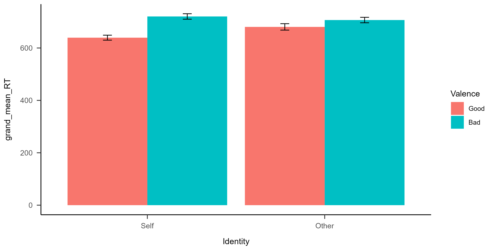
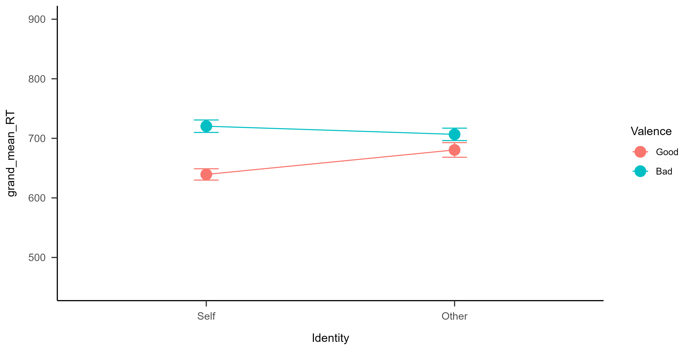
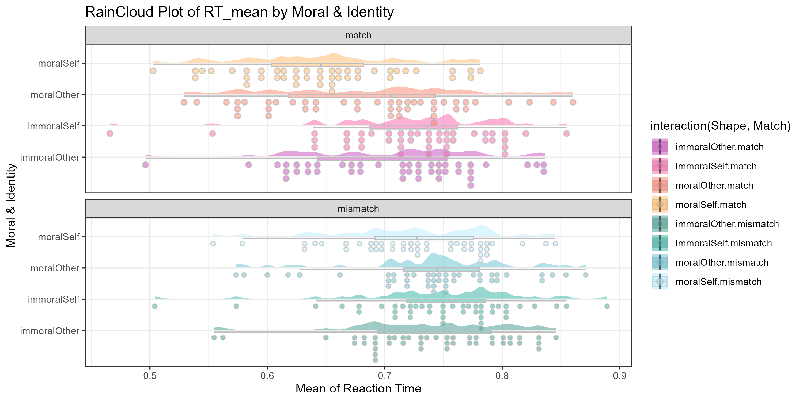

class: center, middle
<span style="font-size: 60px;">第十一章</span> <br>
<span style="font-size: 50px;">如何得到可发表的图像</span> <br>
<span style="font-size: 50px;">数据可视化进阶</span> <br>
<span style="font-size: 45px;">ggplot2</span> <br>
<br>
<br>
<span style="font-size: 30px;">胡传鹏</span> <br>
<span style="font-size: 30px;">2023/05/15</span> <br>

---
# 为什么要作图？

- “一图胜千言”

- 直觉地传达信息

- “信达雅”
  - 信息量
  - 逻辑性
  - 美观（简洁、对称、和谐）

---
# 用什么做图？
- ggplot 2

---
class: center, middle
<span style="font-size: 60px;">11.1 Layers and Facets</span> <br>
---
<br>
<div style="display:flex; align-items:center; justify-content:center;">
  
  
</div>
---
# <h1 lang="en">Layers</h1>
# <h4 lang="en"> </h4>
<div style="display:flex; align-items:center;">
  
</div>
<br>
_<h4 lang="zh-CN">相信大家都用过PhotoShop，对图层这个概念一定已经非常熟悉了 </h4>_

---
# <h1 lang="en">Layers</h1>
# <h4 lang="en"> </h4>
<div style="display:flex; align-items:center; justify-content:center;">
  
</div>
<br>
_<h4 lang="zh-CN">在ggplot2中，用 + 加号来表示一个个图层 </h4>_

---
# <h1 lang="en">Layers</h1>

<div style="display:flex; align-items:center; justify-content:center;">
  
</div>
<br>
_<h4 lang="zh-CN">和PS类似，ggplot2也是通过修改每个图层的信息来美化图片 </h4>_

---
# <h1 lang="en">Facets</h1>

<div style="display:flex; align-items:center; justify-content:center;">
  
</div>
<br>
_<h4 lang="zh-CN">Facet 也可以被认为是图层的一种，也是通过"+"加号叠加在原始图片上 </h4>_

---
# <h1 lang="zh-CN">载入包</h1>

```{r Import Packages}

# 检查是否已安装 pacman
if (!requireNamespace("pacman", quietly = TRUE)) {
  install.packages("pacman") }   # 如果未安装，则安装包

# 使用p_load来载入需要的包
pacman::p_load("tidyverse", "ggplot2", "ggdist", "patchwork", "papaja")

# ggdist:   plot distribution
# patchwork: 拼接图片
# papaja:    APA的主题
```

---

# 传统的图
- 条形图
- 点图 + 折线图

---
# <h1 lang="zh-CN">读取数据</h1>

```{r, eval=FALSE}
df.mt.raw <-  read.csv('./data/match/match_raw.csv',
                       header = T, sep=",", stringsAsFactors = FALSE)
```
---

# <h1 lang="zh-CN">清洗数据</h1>

```{r Clean Data RT, eval=FALSE}
# get the mean RT of correct trials for each participants for each condition
df.mt.rt.subj <- df.mt.raw %>%
  dplyr::filter(ACC == 1 & RT > 0.2) %>%
  tidyr::extract(Shape, into = c("Valence", "Identity"),
                        regex = "(moral|immoral)(Self|Other)", remove = FALSE) %>%
  dplyr::mutate(Valence = case_when(Valence == "moral" ~ "Good",
                                    Valence == "immoral" ~ "Bad"),
                RT_ms = RT * 1000) %>%
  dplyr::mutate(Valence = factor(Valence, levels = c("Good", "Bad")),
                Identity = factor(Identity, levels = c("Self", "Other"))) %>%
  dplyr::group_by(Sub, Match, Identity, Valence) %>%
  dplyr::summarise(RT_mean = mean(RT_ms)) %>%
  dplyr::ungroup()

# get the overall mean RT
df.mt.rt.sum  <- df.mt.rt.subj %>% 
  dplyr::group_by(Match, Identity, Valence) %>%
  dplyr::summarise(grand_mean_RT = mean(RT_mean),
                   SD_RT = sd(RT_mean),
                   SE_RT = SD_RT/sqrt(n()-1),
                   n = n()) %>%
  dplyr::ungroup()
```

---
# <h1 lang="zh-CN">清洗数据</h1>
```{r Clean Data ACC, eval=FALSE}
# get the accuracy for each participants for each condition
df.mt.acc.subj <- df.mt.raw %>%
  tidyr::extract(Shape, into = c("Valence", "Identity"),
                        regex = "(moral|immoral)(Self|Other)", remove = FALSE) %>%
  dplyr::mutate(Valence = case_when(Valence == "moral" ~ "Good",
                                    Valence == "immoral" ~ "Bad"),
                ) %>%
  dplyr::mutate(Valence = factor(Valence, levels = c("Good", "Bad")),
                Identity = factor(Identity, levels = c("Self", "Other"))) %>%
  dplyr::group_by(Sub, Match, Identity, Valence) %>%
  dplyr::summarise(ACC_mean = mean(ACC)) %>%
  dplyr::ungroup()

# get the overall mean acc
df.mt.acc.sum <- df.mt.acc.subj %>% 
  dplyr::group_by(Match, Identity, Valence) %>%
  dplyr::summarise(grand_mean_ACC = mean(ACC_mean),
                   SD_ACC = sd(ACC_mean),
                   SE_ACC = SD_ACC/sqrt(n()-1),
                   n = n()) %>%
  dplyr::ungroup()


df.mt.acc.sum.tmp <- df.mt.acc.sum %>%
  dplyr::rename(grand_mean = grand_mean_ACC,
                SD = SD_ACC,
                SE = SE_ACC) %>%
  dplyr::mutate(DV = "ACC")

df.mt.rt.sum.tmp <- df.mt.rt.sum  %>%
  dplyr::rename(grand_mean = grand_mean_RT,
                SD = SD_RT,
                SE = SE_RT) %>%
  dplyr::mutate(DV = "RT")

df.mt.sum.tmp <- rbind(df.mt.acc.sum.tmp, df.mt.rt.sum.tmp)
```

---
# <h1 lang="zh-CN">查看数据</h1>
```{r check summary data, eval=FALSE}
df.mt.sum <- df.mt.rt.sum %>%
  dplyr::left_join(., df.mt.acc.sum)
df.mt.sum
```


---
## First plot (old-fashion)
```{r first plot, eval=FALSE}
p1 <- df.mt.sum %>%
  dplyr::filter(Match == "match") %>%
  ggplot2::ggplot(., 
                  aes(x = Identity,
                      y = grand_mean_RT,
                      fill = Valence)) + 
  ggplot2::geom_bar(stat = "identity",
                    position=position_dodge(),
                    ) +
  ggplot2::geom_errorbar(aes(ymin=grand_mean_RT-SE_RT,
                             ymax=grand_mean_RT+SE_RT),
                         width=.1,
                         position = position_dodge(.9)) +
  papaja::theme_apa()
ggsave(filename = "./picture/chp11/p1.png", plot = p1, height = 5, width = 10, dpi = 300)
```


---
## <h1 lang="en">修改图题</h1> 

```{r title of p1, eval=FALSE}
# 修改标题和坐标的题目
p2 <- p1 +
  labs(title="Mean RT for different conditions",
      x="Identity",
      y="Reaction times (ms)")

ggsave(filename = "./picture/chp11/p2.png", plot = p2, height = 5, width = 10, dpi = 300)
```


---
## <h1 lang="en">定义y轴的range</h1> 
```{r p3, eval=FALSE}
p3 <- p2 + 
  coord_cartesian(ylim = c(500, 800)) # +
  # scale_y_continuous(limits = c(500,800))
ggsave(filename = "./picture/chp11/p3.png", plot = p3, height = 5, width = 10, dpi = 300)
```


---
## <h1 lang="en">定义y轴的range</h1> 
```{r, eval=FALSE}
df.mt.sum %>%
  dplyr::filter(Match == "match") %>%
  ggplot2::ggplot(., 
                  aes(x = Identity,
                      y = grand_mean_ACC,
                      fill = Valence)) + 
  ggplot2::geom_bar(stat = "identity",
                    position=position_dodge(),
                    ) +
  ggplot2::geom_errorbar(aes(ymin=grand_mean_ACC-1.96*SE_ACC,
                             ymax=grand_mean_ACC+1.96*SE_ACC),
                         width=.1,
                         position = position_dodge(.9)) +
  papaja::theme_apa()+
  labs(title="Mean ACC for different conditions",
      x="Identity",
      y="Accuracy")+ 
  coord_cartesian(ylim = c(0.5, 1)) 
ggsave(filename = "./picture/chp11/p3.1.png", plot = last_plot(), height = 5, width = 10, dpi = 300)
```

---
## <h1 lang="en">定义y轴的range</h1> 


---
## <h1 lang="en">定义y轴的range</h1> 
```{r, eval=FALSE}
df.mt.sum.tmp %>%
  dplyr::filter(Match == "match") %>%
  ggplot2::ggplot(., 
                  aes(x = Identity,
                      y = grand_mean,
                      fill = Valence)) + 
  ggplot2::geom_bar(stat = "identity",
                    position=position_dodge(),
                    ) +
  ggplot2::geom_errorbar(aes(ymin=grand_mean-1.96*SE,
                             ymax=grand_mean+1.96*SE),
                         width=.1,
                         position = position_dodge(.9)) +
  papaja::theme_apa()+
  facet_wrap(~DV, scales = "free_y")
  # labs(title="Mean ACC for different conditions",
  #     x="Identity",
  #     y="Accuracy")+ 
  # coord_cartesian(ylim = c(0.5, 1)) 
ggsave(filename = "./picture/chp11/p3.2.png",plot = last_plot(), height = 5, width = 10, dpi = 300)
```

---
## <h1 lang="en">定义y轴的range</h1> 


---
## <h1 lang="en">点加上error bars</h1> 
```{r, eval=FALSE}
p4 <- df.mt.sum %>%
  dplyr::filter(Match == "match") %>%
  ggplot2::ggplot(., 
                  aes(x = Identity,
                      y = grand_mean_RT,
                      group = Valence,
                      color = Valence)) +
  ggplot2::geom_line() +
  ggplot2::geom_point(size = 5) + 
  ggplot2::geom_errorbar(aes(ymin=grand_mean_RT-SE_RT,
                             ymax=grand_mean_RT+SE_RT),
                         width=.1,
                         ) +
  ggplot2::scale_y_continuous(limits = c(450, 900)) +
  papaja::theme_apa()
ggsave(filename = "./picture/chp11/p4.png", plot = p4, height = 5, width = 10, dpi = 300)
```

---
## <h1 lang="en">点加上error bars</h1> 


---
## <h1 lang="en">加入个体的数据</h1> 
```{r p5, eval=FALSE}
p5 <- p4 +
  ggplot2::geom_point(data = df.mt.rt.subj,
                       aes(x=Identity,
                           y=RT_mean,
                           group = Valence))
ggsave(filename = "./picture/chp11/p5.png", plot = p5, height = 5, width = 10, dpi = 300)
```


---
## <h1 lang="en">jitter points' position</h1> 
```{r p6 jitter, eval=FALSE}
# 太拥挤了，三种图应该错开一定的距离, 以及调整每个图形的宽度
p6 <-  p4 +
  ggplot2::geom_point(data = df.mt.rt.subj,
                       aes(x=Identity,
                           y=RT_mean,
                           group = Valence),
                      position = position_jitter(width = 0.1),
                      alpha = 0.5)
ggsave(filename = "./picture/chp11/p6.png", plot = p6, height = 5, width = 10, dpi = 300)
```


---
## <h1 lang="en">jitter points' position</h1> 
```{r p7 jitter, eval=FALSE}
p7 <- df.mt.sum %>%
  dplyr::filter(Match == "match") %>%
  ggplot2::ggplot(., 
                  aes(x = Identity,
                      y = grand_mean_RT,
                      group = Valence,
                      color = Valence)) +
  ggplot2::geom_line(position = position_dodge(0.5)) +
  ggplot2::geom_point(size = 5,
                      position = position_dodge(0.5)) + 
  ggplot2::geom_errorbar(aes(ymin=grand_mean_RT-SE_RT,
                             ymax=grand_mean_RT+SE_RT),
                         width=.1,
                         position = position_dodge(0.5),
                         ) +
  ggplot2::scale_y_continuous(limits = c(450, 900)) +
  papaja::theme_apa()
ggsave(filename = "./picture/chp11/p7.png", plot = p7, height = 5, width = 10, dpi = 300)
```

---
## <h1 lang="en">jitter points' position</h1> 


---
## <h1 lang="en">jitter points' position</h1> 
```{r df p8 jitter both, eval=FALSE}
df.mt.rt.subj.m.plot <- df.mt.rt.subj %>%
  dplyr::mutate(conds = case_when(Identity == "Self" & Valence == "Good" ~ "0.88",
                                  Identity == "Self" & Valence == "Bad" ~ "1.12",
                                  Identity == "Other" & Valence == "Good" ~ "1.88",
                                  Identity == "Other" & Valence == "Bad" ~ "2.12"),
                conds = as.numeric(conds)) %>%
  dplyr::filter(Match == "match")
```

---
## <h1 lang="en">jitter points' position</h1> 
```{r p8 jitter both, eval=FALSE}
p8 <- p7 + 
  ggplot2::geom_point(data = df.mt.rt.subj.m.plot,
                       aes(x=conds,
                           y=RT_mean,
                           group = Valence),
                      position = position_jitter(width = 0.08),
                      alpha = 0.5)
ggsave(filename = "./picture/chp11/p8.png", plot = p8, height = 5, width = 10, dpi = 300)
```


---
## <h1 lang="en">显示个体趋势</h1> 
```{r p9 connecting subj data, eval=FALSE}
p9 <- p8 + 
  ggplot2::geom_line(data = df.mt.rt.subj.m.plot,
                     aes(x=conds,
                         y=RT_mean,
                         group=Sub),
                     linetype = 1,
                     size=0.8,
                     color="#000000",
                     alpha=0.1)
ggsave(filename = "./picture/chp11/p9.png", plot = p9, height = 5, width = 10, dpi = 300)
```


---
## <h1 lang="en">显示个体趋势</h1> 
```{r p10 connecting subj data, eval=FALSE}
pd <- position_dodge(0.08)
p10 <- p7 + 
  ggplot2::geom_point(data = df.mt.rt.subj.m.plot,
                       aes(x=conds,
                           y=RT_mean,
                           group=as.factor(Sub)),
                      position = pd,
                      color="#000000",
                      alpha = 0.05) +
  ggplot2::geom_line(data = df.mt.rt.subj.m.plot,
                     aes(x=conds,
                         y=RT_mean,
                         group=as.factor(Sub)),
                     position = pd,
                     linetype = 1,
                     size=0.8,
                     color="#000000",
                     alpha=0.05)
ggsave(filename = "./picture/chp11/p10.png", plot = p10, height = 5, width = 10, dpi = 300)
```

---
## <h1 lang="en">显示个体趋势</h1> 


---
## <h1 lang="en">显示个体趋势</h1> 
```{r, eval=FALSE}
library(patchwork)
p11 <- p9 + p10 +
  plot_layout(guides = 'collect')
ggsave(filename = "./picture/chp11/p11.png", plot = p11, height = 5, width = 10, dpi = 300)
```


```{r 云雨图将不在PPT中出现，感兴趣的自行运行chunk, include=FALSE}
# 创建一个空list用于存放数据集
df <- list()
# 创建一个空list用于存放图片
p <- list()
# 保护全球环境(global environment)， 人人有责
# 希望大家以后写代码都把变量分类放在不同的list中
```

```{r Raw Data, include=FALSE}
df[[1]] <-  read.csv('./data/match/match_raw.csv',
                       header = T, sep=",", stringsAsFactors = FALSE)
names(df)[1] <- "Raw"
```

```{r Clean Data, include=FALSE}
df[[2]] <- df[[1]] %>%
  dplyr::group_by(Sub, Shape, Match) %>%
  dplyr::summarise(RT_mean = mean(RT)) %>%
  dplyr::ungroup()
names(df)[2] <- "Clean"
```

```{r plot 1, eval=FALSE, include=FALSE}
# 最简单的箱线图
# 看看不同Shape情况下 平均反应时的分布情况
p[[1]] <- ggplot2::ggplot(df[[2]], aes(x = Shape, y = RT_mean, fill = Shape)) +
  ggplot2::geom_boxplot(color = "grey", alpha = 0.5) 
names(p)[1] <- "Basic: Box Plot"; p[[1]]
ggsave(filename = "./picture/chp11/plot1.png", plot = p[[1]], height = 5, width = 10, dpi = 300)
```

```{r plot 2, eval=FALSE, include=FALSE}
# 增加横纵坐标标题
p[[2]] <- p[[1]] +
  ggplot2::labs(x = "Moral & Identity", y = "Mean of Reaction Time", title = "Boxplot of RT_mean by Shape") 
names(p)[2] <- "Basic: Plot Labels"; p[[2]]
ggsave(filename = "./picture/chp11/plot2.png", plot = p[[2]], height = 5, width = 10, dpi = 300)
```

```{r plot 3, eval=FALSE, include=FALSE}
# 叠加点图
p[[3]] <- p[[2]] +
  ggplot2::geom_point(aes(colour = Shape), position = position_jitter(width = 0.2), size = 3, alpha = 0.5) 
names(p)[3] <- "Basic: Point Plot"; p[[3]]
ggsave(filename = "./picture/chp11/plot3.png", plot = p[[3]], height = 5, width = 10, dpi = 300)
```

```{r plot 4, eval=FALSE, include=FALSE}
# 叠加小提琴图
p[[4]] <- p[[3]] +
  ggplot2::geom_violin(aes(colour = Shape), color = "grey", width = 0.2, alpha = 0.5) 
names(p)[4] <- "Basic: Violin Plot"; p[[4]]
ggsave(filename = "./picture/chp11/plot4.png", plot = p[[4]], height = 5, width = 10, dpi = 300)
```

```{r plot 5, eval=FALSE, include=FALSE}
# 太拥挤了，三种图应该错开一定的距离, 以及调整每个图形的宽度
p[[5]] <- ggplot2::ggplot(df[[2]], aes(x = Shape, y = RT_mean, fill = Shape)) +
  ggplot2::geom_boxplot(width = 0.1, position = position_nudge(x = -0.2), color = "grey", alpha = 0.5) + # 箱线图左移0.2个单位，宽度0.1
  ggplot2::geom_point(aes(colour = Shape), position = position_jitter(width = 0.1), size = 3, alpha = 0.5) + # 点图处于中间，但是调整宽度
  ggplot2::geom_violin(aes(colour = Shape), width = 0.1, position = position_nudge(x = 0.2), color = "grey", alpha = 0.5) + # 小提琴图右移0.2各单位，宽度0.1
  ggplot2::labs(x = "Moral & Identity", y = "Mean of Reaction Time", title = "Boxplot of RT_mean by Shape")
names(p)[5] <- "Basic: Plot Position"; p[[5]]
ggsave(filename = "./picture/chp11/plot5.png", plot = p[[5]], height = 5, width = 10, dpi = 300)
```

```{r plot 6, eval=FALSE, include=FALSE}
# 叠加云图 raincloud plot
p[[6]] <- p[[5]] +
  ggdist::stat_halfeye(adjust = 0.2,justification = -0.35, alpha = 0.5, width = 0.5,   # adjust 拟合的锐度(平滑度), justification位置(与ggplot方向相反), alpha 透明度
                       .width = 0, point_colour = NA) # 如果没有 .width = 0, point_colour = NA, halfeye也会画出一些黑点
names(p)[6] <- "Basic: Cloud Plot"; p[[6]]
ggsave(filename = "./picture/chp11/plot6.png", plot = p[[6]], height = 5, width = 10, dpi = 300)
```

```{r plot 7, eval=FALSE, include=FALSE}
# violin图被halfeye遮挡了，可以删掉它
p[[7]] <- p[[6]] # 把p[[6]]传递给p[[7]]
p[[7]]$layers[3] <- NULL # 然后把第三个图层--violin赋值为空
# 这样就删除了violin这个图层
names(p)[7] <- "Basic: Delete Layers"; p[[7]]
ggsave(filename = "./picture/chp11/plot7.png", plot = p[[7]], height = 5, width = 10, dpi = 300)
```

```{r plot 8, eval=FALSE, include=FALSE}
# ggdist的点图比ggplot2的更好看
p[[8]] <- ggplot2::ggplot(df[[2]], aes(x = Shape, y = RT_mean, fill = Shape,)) +
  ggplot2::geom_boxplot(width = 0.1, position = position_nudge(x = -0.05), color = "grey", alpha = 0.5, outlier.color = NA,) + # 箱线图左移0.2个单位
  ggdist::stat_halfeye(adjust = 0.2,justification = -0.05, alpha = 0.5, width = 0.5, .width = 0, point_colour = NA) +
  ggdist::stat_dots(side = "left",justification = 1.15, alpha = 0.5) + 
  ggplot2::labs(x = "Moral & Identity", y = "Mean of Reaction Time", title = "RainCloud Plot of RT_mean by Moral & Identity")
names(p)[8] <- "Basic: RainCloud Plot"; p[[8]]
ggsave(filename = "./picture/chp11/plot8.png", plot = p[[8]], height = 5, width = 10, dpi = 300)
```

```{r plot 9, eval=FALSE, include=FALSE}
# 旋转图片，现在终于明白为什么叫raincloud了
p[[9]] <- p[[8]] +
  ggplot2::coord_flip()
names(p)[9] <- "Basic: Plot Flip"; p[[9]]
ggsave(filename = "./picture/chp11/plot9.png", plot = p[[9]], height = 5, width = 10, dpi = 300)
```

```{r plot 10, eval=FALSE, include=FALSE}
# 在这张图里，图例和横坐标表达的信息重复了，可以隐藏图例
p[[10]] <- p[[9]] +
  ggplot2::theme(legend.position = "none")
names(p)[10] <- "Basic: Legend Hidden"; p[[10]]
ggsave(filename = "./picture/chp11/plot10.png", plot = p[[10]], height = 5, width = 10, dpi = 300)
```

```{r Color Palette, include=FALSE}
popsicle <- c("#F3533A", "#FA9F42", "#8AD879", "#5ACFC9")
sunset <- c("#C848B9", "#F962A7", "#FD836D", "#FFBA69")
glassdoor <- c("#3D9A8B", "#2EB19F", "#63C2D2", "#B7EDFF")
palette <- list(popsicle = popsicle, sunset = sunset, glassdoor = glassdoor)
rm(popsicle, sunset, glassdoor)
```

```{r plot 11, eval=FALSE, warning=FALSE, include=FALSE}
# 更改图片的填充颜色
p[[11]] <- p[[10]] +
  ggplot2::scale_fill_manual(values = palette$popsicle)  # 用什么颜色，体现了你的审美！
names(p)[11] <- "Basic: Fill Color"; p[[11]]
ggsave(filename = "./picture/chp11/plot11.png", plot = p[[11]], height = 5, width = 10, dpi = 300)
```

```{r plot 12, eval=FALSE, warning=FALSE, include=FALSE}
# 坐标轴颜色
p[[12]] <- p[[11]] +
  ggplot2::theme(axis.text.y = element_text(color = palette$popsicle))
names(p)[12] <- "Basic: Axis Text Color"; p[[12]]
ggsave(filename = "./picture/chp11/plot12.png", plot = p[[12]], height = 5, width = 10, dpi = 300)
```

```{r plot 13, eval=FALSE, warning=FALSE, include=FALSE}
# 图上文字的大小
p[[13]] <- p[[12]] +
  ggplot2::theme(axis.text = element_text(size = 12),
                 axis.title = element_text(size = 14),
                 plot.title = element_text(size = 16),)
names(p)[13] <- "Basic: Axis Text Size"; p[[13]]
ggsave(filename = "./picture/chp11/plot13.png", plot = p[[13]], height = 5, width = 10, dpi = 300)
```

```{r plot 14, eval=FALSE, warning=FALSE, include=FALSE}
# 按照Match拆分为两个Facet
p[[14]] <- p[[13]] +
  ggplot2::facet_wrap(~Match)
names(p)[14] <- "Basic: Facet"; p[[14]]
ggsave(filename = "./picture/chp11/plot14.png", plot = p[[14]], height = 5, width = 10, dpi = 300)
```

```{r plot 15, eval=FALSE, warning=FALSE, include=FALSE}
# Facet文字的大小
p[[15]] <- p[[14]] +
  ggplot2::theme(strip.text = element_text(size = 14)) 
names(p)[15] <- "Basic: Facet Text Size"; p[[15]]
ggsave(filename = "./picture/chp11/plot15.png", plot = p[[15]], height = 5, width = 10, dpi = 300)
```

```{r plot16, eval=FALSE, warning=FALSE, include=FALSE}
p[[16]] <- ggplot2::ggplot(df[[2]], 
                           aes(x = Shape, y = RT_mean, 
                               fill = interaction(Shape, Match),)) + # fill的颜色基于Shape和Match
  ggplot2::geom_boxplot(width = 0.1, position = position_nudge(x = -0.05), alpha = 0.5, outlier.color = NA, color = "grey") + 
  ggdist::stat_halfeye(adjust = 0.2,justification = -0.05, alpha = 0.5, width = 0.5, .width = 0, point_colour = NA,) +
  ggdist::stat_dots(side = "left",justification = 1.15, alpha = 0.5,) + 
  ggplot2::labs(x = "Moral & Identity", y = "Mean of Reaction Time", title = "RainCloud Plot of RT_mean by Moral & Identity") +
  ggplot2::coord_flip() +
  ggplot2::scale_fill_manual(values = c(palette$sunset, palette$glassdoor)) + # 需要八种颜色来填充图片
  ggplot2::facet_wrap(~Match, ncol = 1) 

names(p)[16] <- "Basic: Interactional Fill"; p[[16]]
ggsave(filename = "./picture/chp11/plot16.png",plot = p[[16]], height = 5, width = 10, dpi = 300)
```

---
class: center, middle
<span style="font-size: 60px;">11.2 APA theme</span> <br>

---
## <h1 lang="en">APA theme: theme_bw()</h1> 
```{r plot 17, eval=FALSE, warning=FALSE}
# theme_bw() 会改变很多地方的颜色，让主题变成黑白，方便接下来的细节修改
p[[17]] <- p[[16]] +
  ggplot2::theme_bw()  
names(p)[17] <- "APA theme: theme_bw"; p[[17]]
ggsave(filename = "./picture/chp11/plot17.png", plot = p[[17]], height = 5, width = 10, dpi = 300)
```


---
## <h1 lang="en">APA theme: legend.position</h1> 
```{r plot 18, eval=FALSE, warning=FALSE}
# APA默认图例局右
p[[18]] <- p[[17]] +
  ggplot2::theme(legend.position = "right",)  # 也可以去掉图例
names(p)[18] <- "APA theme: legend.position"; p[[18]]
ggsave(filename = "./picture/chp11/plot18.png", plot = p[[18]], height = 5, width = 10, dpi = 300)
```


---
## <h1 lang="en">APA theme: font_size</h1> 
```{r plot 19, eval=FALSE, warning=FALSE}
# 除了字体大小，标题粗体居中
p[[19]] <- p[[18]] +
  ggplot2::theme(axis.text = element_text(size = 12), # 坐标轴字体大小
                 axis.title = element_text(size = 12), # 坐标轴标题字体大小
                 strip.text = element_text(size = 12), # facet标题字体大小
                 plot.title = element_text(size = 12, face = "bold", hjust = 0.5)) # 图片整体标题字体大小 title粗体，居中
names(p)[19] <- "APA theme: font_size"; p[[19]]
ggsave(filename = "./picture/chp11/plot19.png", plot = p[[19]], height = 5, width = 10, dpi = 300)
```


---
## <h1 lang="en">APA theme: strip.background()</h1> 
```{r plot 20, eval=FALSE, warning=FALSE}
# 去掉facet标题底色  
p[[20]] <- p[[19]] +
  ggplot2::theme(strip.background = element_blank()) 
names(p)[20] <- "APA theme: facet_title_background"; p[[20]]
ggsave(filename = "./picture/chp11/plot20.png", plot = p[[20]], height = 5, width = 10, dpi = 300)
```


---
## <h1 lang="en">APA theme: panel.grid.major</h1> 
```{r plot 21, eval=FALSE, warning=FALSE}
# 隐藏水平网格线
p[[21]] <- p[[20]] +
  ggplot2::theme(panel.grid.major=element_blank()) 
names(p)[21] <- "APA theme: panel.grid.major"; p[[21]]
ggsave(filename = "./picture/chp11/plot21.png", plot = p[[21]], height = 5, width = 10, dpi = 300)
```


---
## <h1 lang="en">APA theme: panel.grid.minor</h1> 
```{r plot 22, eval=FALSE, warning=FALSE}
# 隐藏垂直网格线
p[[22]] <- p[[21]] +
  ggplot2::theme(panel.grid.minor=element_blank()) 
names(p)[22] <- "APA theme: panel.grid.minor"; p[[22]]
ggsave(filename = "./picture/chp11/plot22.png", plot = p[[22]], height = 5, width = 10, dpi = 300)
```


---
## <h1 lang="en">APA theme: panel.border</h1> 
```{r plot 23, eval=FALSE, warning=FALSE}
# 隐藏边框
p[[23]] <- p[[22]] +
  ggplot2::theme(panel.border=element_blank()) # 也可以不去除边框，保留坐标轴
names(p)[23] <- "APA theme: panel.border"; p[[23]]
ggsave(filename = "./picture/chp11/plot23.png", plot = p[[23]], height = 5, width = 10, dpi = 300)
```


---
## <h1 lang="en">APA theme: font_family</h1> 
```{r plot 24, eval=FALSE, warning=FALSE}
# 改变图上字体family
p[[24]] <- p[[23]] +
  ggplot2::theme(text=element_text(family='Times New Roman')) 
names(p)[24] <- "APA theme: font_family"; p[[24]]
ggsave(filename = "./picture/chp11/plot24.png", plot = p[[24]], height = 5, width = 10, dpi = 300)
```


---
## <h1 lang="en">APA theme: font_family</h1> 
```{r import font family, eval=FALSE, warning=FALSE}
 # 使用windowsFonts()查看字体对应的名字是什么, 运气好，里面就有times new roman
windowsFonts()
 # 如果没有，可以library(extrafont)
library(extrafont)
 # 这个包很笨，只能添加一个文件夹内的字体，
 # 默认添加"C:/WINDOWS/FONT/"，这里面有你电脑里所有的字体
 # 因此建议你把需要的字体放到桌面，
 # 然后设置导入路径font_import(path = "C:/user/desktop/")
font_import(path = "C:/user/desktop/")
 # 最后使用 fonttable()，查看字体是否被导入了，
 # 记住times new roman对应的FamilyName
fonttable()
 # 填在上面的text=element_text(family='Times New Roman')
```

---
## <h1 lang="en">Save APA theme</h1> 
```{r Save APA theme, eval=FALSE, warning=FALSE}
# 将刚刚制作的apa格式保存
theme_apa <- ggplot2::theme_bw() +
             ggplot2::theme(#legend.position = "none",
                            axis.text = element_text(size = 12), # 坐标轴字体大小
                            axis.title = element_text(size = 12), # 坐标轴标题字体大小
                            strip.text = element_text(size = 12), # facet标题字体大小
                            plot.title = element_text(size = 12, face = "bold", hjust = 0.5), # 图片整体标题字体大小
                            strip.background = element_blank(), # facet标题的背景
                            panel.grid.major=element_blank(), # 水平参考线
                            panel.grid.minor=element_blank(), # 垂直参考线
                            panel.border=element_blank(), # 边框
                            text=element_text(family='Times New Roman'), #字体family,       
                            # papaja::theme_apa()会warning找不到Windows中字体，但其实如果你载入了，就可以在R中找到
                            )
# 你可以在载入了papaja(jtools)包之后，在画完图后加入 theme_apa()，获得一样的效果
```

---
## <h1 lang="en">APA theme: font_family</h1> 
```{r plot 24_apa, eval=FALSE, warning=FALSE}
# 和直接用papaja::theme_apa()制作的对比一下,坐标轴更好看了，其他几乎一样
p[[24]] <- p[[16]] +
  papaja::theme_apa(base_family = "Times New Roman")
names(p)[24] <- "APA theme: font_family"; p[[24]]
ggsave(filename = "./picture/chp11/plot24_apa.png", plot = p[[24]], height = 5, width = 10, dpi = 300)
```


