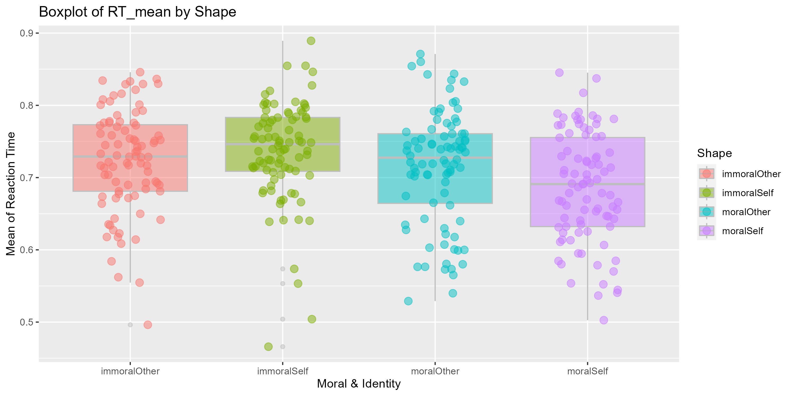
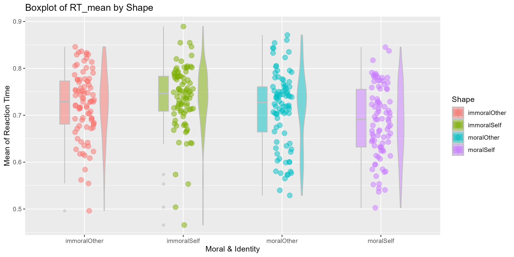
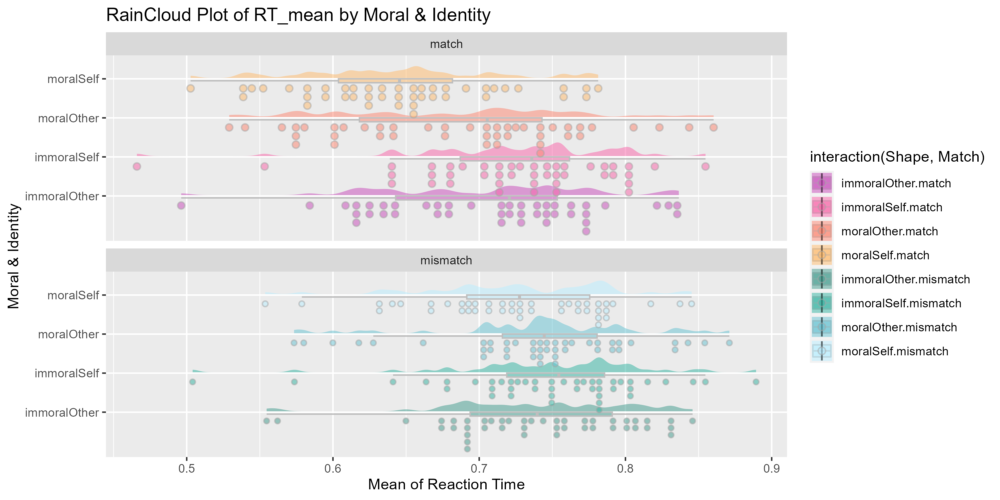

class: center, middle
<span style="font-size: 60px;">第十一章</span> <br>
<span style="font-size: 50px;">如何得到可发表的图像</span> <br>
<span style="font-size: 50px;">数据可视化进阶</span> <br>
<span style="font-size: 30px;">ggplot2</span> <br>
<br>
<br>
<span style="font-size: 30px;">胡传鹏</span> <br>
<span style="font-size: 30px;">2023/05/15</span> <br>

---
class: center, middle
<span style="font-size: 60px;">11.1 Layers and Facets</span> <br>
---
<br>
<div style="display:flex; align-items:center; justify-content:center;">
  
  
</div>
---
# <h1 lang="en">Layers</h1>
# <h4 lang="en"> </h4>
<div style="display:flex; align-items:center;">
  
</div>
<br>
_<h4 lang="zh-CN">相信大家都用过PhotoShop，对图层这个概念一定已经非常熟悉了 </h4>_

---
# <h1 lang="en">Layers</h1>
# <h4 lang="en"> </h4>
<div style="display:flex; align-items:center; justify-content:center;">
  
</div>
<br>
_<h4 lang="zh-CN">在ggplot2中，用 + 加号来表示一个个图层 </h4>_

---
# <h1 lang="en">Layers</h1>

<div style="display:flex; align-items:center; justify-content:center;">
  
</div>
<br>
_<h4 lang="zh-CN">和PS类似，ggplot2也是通过修改每个图层的信息来美化图片 </h4>_

---
# <h1 lang="en">Facets</h1>

<div style="display:flex; align-items:center; justify-content:center;">
  
</div>
<br>
_<h4 lang="zh-CN">Facet 也可以被认为是图层的一种，也是通过"+"加号叠加在原始图片上 </h4>_

---
# <h1 lang="zh-CN">载入包</h1>
```{r Import Packages}
library(tidyverse)
library(ggplot2)
library(ggdist) # 可以叠加在ggplot2的图层上，但是比ggplot2更漂亮
library(patchwork) # 拼接多个图片
#library(jtools) # jtools::theme_apa()
library(papaja) # papaja::theme_apa() 对比之后发现，papaja的坐标轴更好看
```

---
# <h1 lang="zh-CN">读取数据</h1>
```{r }
# 创建一个空list用于存放数据集
df <- list()
# 创建一个空list用于存放图片
p <- list()
# 保护全球环境(global environment)， 人人有责
# 希望大家以后写代码都把变量分类放在不同的list中
```

```{r Raw Data}
df[[1]] <-  read.csv('./data/match/match_raw.csv',
                       header = T, sep=",", stringsAsFactors = FALSE)
names(df)[1] <- "Raw"
```
# <h1 lang="zh-CN">清洗数据</h1>
```{r Clean Data}
df[[2]] <- df[[1]] %>%
  dplyr::group_by(Sub, Shape, Match) %>%
  dplyr::summarise(RT_mean = mean(RT)) %>%
  dplyr::ungroup()
names(df)[2] <- "Clean"
```

---
## <h1 lang="en">ggplot2::geom_boxplot</h1> 
```{r plot 1, eval=FALSE}
# 最简单的箱线图
# 看看不同Shape情况下 平均反应时的分布情况
p[[1]] <- ggplot2::ggplot(df[[2]], aes(x = Shape, y = RT_mean, fill = Shape)) +
  ggplot2::geom_boxplot(color = "grey", alpha = 0.5) 
names(p)[1] <- "Basic: Box Plot"; p[[1]]
ggsave(filename = "./picture/chp11/plot1.png", plot = p[[1]], height = 5, width = 10, dpi = 300)
```


---
## <h1 lang="en">ggplot2::labs</h1> 
```{r plot 2, eval=FALSE}
# 增加横纵坐标标题
p[[2]] <- p[[1]] +
  ggplot2::labs(x = "Moral & Identity", y = "Mean of Reaction Time", title = "Boxplot of RT_mean by Shape") 
names(p)[2] <- "Basic: Plot Labels"; p[[2]]
ggsave(filename = "./picture/chp11/plot2.png", plot = p[[2]], height = 5, width = 10, dpi = 300)
```


---
## <h1 lang="en">ggplot2::geom_point</h1> 
```{r plot 3, eval=FALSE}
# 叠加点图
p[[3]] <- p[[2]] +
  ggplot2::geom_point(aes(colour = Shape), position = position_jitter(width = 0.2), size = 3, alpha = 0.5) 
names(p)[3] <- "Basic: Point Plot"; p[[3]]
ggsave(filename = "./picture/chp11/plot3.png", plot = p[[3]], height = 5, width = 10, dpi = 300)
```


---
## <h1 lang="en">ggplot2::geom_violin</h1> 
```{r plot 4, eval=FALSE}
# 叠加小提琴图
p[[4]] <- p[[3]] +
  ggplot2::geom_violin(aes(colour = Shape), color = "grey", width = 0.2, alpha = 0.5) 
names(p)[4] <- "Basic: Violin Plot"; p[[4]]
ggsave(filename = "./picture/chp11/plot4.png", plot = p[[4]], height = 5, width = 10, dpi = 300)
```


---
## <h1 lang="en">argument(position = position_nudge)</h1> 
```{r plot 5, eval=FALSE}
# 太拥挤了，三种图应该错开一定的距离, 以及调整每个图形的宽度
p[[5]] <- ggplot2::ggplot(df[[2]], aes(x = Shape, y = RT_mean, fill = Shape)) +
  ggplot2::geom_boxplot(width = 0.1, position = position_nudge(x = -0.2), color = "grey", alpha = 0.5) + # 箱线图左移0.2个单位，宽度0.1
  ggplot2::geom_point(aes(colour = Shape), position = position_jitter(width = 0.1), size = 3, alpha = 0.5) + # 点图处于中间，但是调整宽度
  ggplot2::geom_violin(aes(colour = Shape), width = 0.1, position = position_nudge(x = 0.2), color = "grey", alpha = 0.5) + # 小提琴图右移0.2各单位，宽度0.1
  ggplot2::labs(x = "Moral & Identity", y = "Mean of Reaction Time", title = "Boxplot of RT_mean by Shape")
names(p)[5] <- "Basic: Plot Position"; p[[5]]
ggsave(filename = "./picture/chp11/plot5.png", plot = p[[5]], height = 5, width = 10, dpi = 300)
```


---
## <h1 lang="en">ggdist::stat_halfeye</h1> 
```{r plot 6, eval=FALSE}
# 叠加云图 raincloud plot
p[[6]] <- p[[5]] +
  ggdist::stat_halfeye(adjust = 0.2,justification = -0.35, alpha = 0.5, width = 0.5,   # adjust 拟合的锐度(平滑度), justification位置(与ggplot方向相反), alpha 透明度
                       .width = 0, point_colour = NA) # 如果没有 .width = 0, point_colour = NA, halfeye也会画出一些黑点
names(p)[6] <- "Basic: Cloud Plot"; p[[6]]
ggsave(filename = "./picture/chp11/plot6.png", plot = p[[6]], height = 5, width = 10, dpi = 300)
```


---
## <h1 lang="en">Delete a layer</h1> 
```{r plot 7, eval=FALSE}
# violin图被halfeye遮挡了，可以删掉它
p[[7]] <- p[[6]] # 把p[[6]]传递给p[[7]]
p[[7]]$layers[3] <- NULL # 然后把第三个图层--violin赋值为空
# 这样就删除了violin这个图层
names(p)[7] <- "Basic: Delete Layers"; p[[7]]
ggsave(filename = "./picture/chp11/plot7.png", plot = p[[7]], height = 5, width = 10, dpi = 300)
```


---
## <h1 lang="en">ggdist::stat_dots</h1> 
```{r plot 8, eval=FALSE}
# ggdist的点图比ggplot2的更好看
p[[8]] <- ggplot2::ggplot(df[[2]], aes(x = Shape, y = RT_mean, fill = Shape,)) +
  ggplot2::geom_boxplot(width = 0.1, position = position_nudge(x = -0.05), color = "grey", alpha = 0.5, outlier.color = NA,) + # 箱线图左移0.2个单位
  ggdist::stat_halfeye(adjust = 0.2,justification = -0.05, alpha = 0.5, width = 0.5, .width = 0, point_colour = NA) +
  ggdist::stat_dots(side = "left",justification = 1.15, alpha = 0.5) + 
  ggplot2::labs(x = "Moral & Identity", y = "Mean of Reaction Time", title = "RainCloud Plot of RT_mean by Moral & Identity")
names(p)[8] <- "Basic: RainCloud Plot"; p[[8]]
ggsave(filename = "./picture/chp11/plot8.png", plot = p[[8]], height = 5, width = 10, dpi = 300)
```


---
## <h1 lang="en">ggplot2::coor_flip</h1> 
```{r plot 9, eval=FALSE}
# 旋转图片，现在终于明白为什么叫raincloud了
p[[9]] <- p[[8]] +
  ggplot2::coord_flip()
names(p)[9] <- "Basic: Plot Flip"; p[[9]]
ggsave(filename = "./picture/chp11/plot9.png", plot = p[[9]], height = 5, width = 10, dpi = 300)
```


---
## <h1 lang="en">ggplot2::theme(legend.position)</h1> 
```{r plot 10, eval=FALSE}
# 在这张图里，图例和横坐标表达的信息重复了，可以隐藏图例
p[[10]] <- p[[9]] +
  ggplot2::theme(legend.position = "none")
names(p)[10] <- "Basic: Legend Hidden"; p[[10]]
ggsave(filename = "./picture/chp11/plot10.png", plot = p[[10]], height = 5, width = 10, dpi = 300)
```


---
## <h1 lang="en">Palette</h1> 
```{r Color Palette}
popsicle <- c("#F3533A", "#FA9F42", "#8AD879", "#5ACFC9")
sunset <- c("#C848B9", "#F962A7", "#FD836D", "#FFBA69")
glassdoor <- c("#3D9A8B", "#2EB19F", "#63C2D2", "#B7EDFF")
palette <- list(popsicle = popsicle, sunset = sunset, glassdoor = glassdoor)
rm(popsicle, sunset, glassdoor)
```
<div style="display:flex; align-items:center; justify-content:center;">
  
</div>
<br>
<div style="display:flex; align-items:center; justify-content:center; ">


</div>
---
## <h1 lang="en">ggplot2::scale_fill_manual</h1> 
```{r plot 11, eval=FALSE, warning=FALSE}
# 更改图片的填充颜色
p[[11]] <- p[[10]] +
  ggplot2::scale_fill_manual(values = palette$popsicle)  # 用什么颜色，体现了你的审美！
names(p)[11] <- "Basic: Fill Color"; p[[11]]
ggsave(filename = "./picture/chp11/plot11.png", plot = p[[11]], height = 5, width = 10, dpi = 300)
```


---
## <h1 lang="en">ggplot2::theme(element_text)</h1> 
```{r plot 12, eval=FALSE, warning=FALSE}
# 坐标轴颜色
p[[12]] <- p[[11]] +
  ggplot2::theme(axis.text.y = element_text(color = palette$popsicle))
names(p)[12] <- "Basic: Axis Text Color"; p[[12]]
ggsave(filename = "./picture/chp11/plot12.png", plot = p[[12]], height = 5, width = 10, dpi = 300)
```


---
## <h1 lang="en">ggplot2::theme(element_text)</h1> 
```{r plot 13, eval=FALSE, warning=FALSE}
# 图上文字的大小
p[[13]] <- p[[12]] +
  ggplot2::theme(axis.text = element_text(size = 12),
                 axis.title = element_text(size = 14),
                 plot.title = element_text(size = 16),)
names(p)[13] <- "Basic: Axis Text Size"; p[[13]]
ggsave(filename = "./picture/chp11/plot13.png", plot = p[[13]], height = 5, width = 10, dpi = 300)
```


---
## <h1 lang="en">ggplot2::facet_wrap</h1> 
```{r plot 14, eval=FALSE, warning=FALSE}
# 按照Match拆分为两个Facet
p[[14]] <- p[[13]] +
  ggplot2::facet_wrap(~Match)
names(p)[14] <- "Basic: Facet"; p[[14]]
ggsave(filename = "./picture/chp11/plot14.png", plot = p[[14]], height = 5, width = 10, dpi = 300)
```


---
## <h1 lang="en">ggplot2::theme(element_text)</h1> 
```{r plot 15, eval=FALSE, warning=FALSE}
# Facet文字的大小
p[[15]] <- p[[14]] +
  ggplot2::theme(strip.text = element_text(size = 14)) 
names(p)[15] <- "Basic: Facet Text Size"; p[[15]]
ggsave(filename = "./picture/chp11/plot15.png", plot = p[[15]], height = 5, width = 10, dpi = 300)
```


---
## <h1 lang="en">ggplot2: fill = interaction()</h1> 
```{r plot16, eval=FALSE, warning=FALSE}
p[[16]] <- ggplot2::ggplot(df[[2]], 
                           aes(x = Shape, y = RT_mean, 
                               fill = interaction(Shape, Match),)) + # fill的颜色基于Shape和Match
  ggplot2::geom_boxplot(width = 0.1, position = position_nudge(x = -0.05), alpha = 0.5, outlier.color = NA, color = "grey") + 
  ggdist::stat_halfeye(adjust = 0.2,justification = -0.05, alpha = 0.5, width = 0.5, .width = 0, point_colour = NA,) +
  ggdist::stat_dots(side = "left",justification = 1.15, alpha = 0.5,) + 
  ggplot2::labs(x = "Moral & Identity", y = "Mean of Reaction Time", title = "RainCloud Plot of RT_mean by Moral & Identity") +
  ggplot2::coord_flip() +
  ggplot2::scale_fill_manual(values = c(palette$sunset, palette$glassdoor)) + # 需要八种颜色来填充图片
  ggplot2::facet_wrap(~Match, ncol = 1) 

names(p)[16] <- "Basic: Interactional Fill"; p[[16]]
ggsave(filename = "./picture/chp11/plot16.png",plot = p[[16]], height = 5, width = 10, dpi = 300)
```


---
class: center, middle
<span style="font-size: 60px;">11.2 APA theme</span> <br>

---
## <h1 lang="en">APA theme: theme_bw()</h1> 
```{r plot 17, eval=FALSE, warning=FALSE}
# theme_bw() 会改变很多地方的颜色，让主题变成黑白，方便接下来的细节修改
p[[17]] <- p[[16]] +
  ggplot2::theme_bw()  
names(p)[17] <- "APA theme: theme_bw"; p[[17]]
ggsave(filename = "./picture/chp11/plot17.png", plot = p[[17]], height = 5, width = 10, dpi = 300)
```


---
## <h1 lang="en">APA theme: legend.position</h1> 
```{r plot 18, eval=FALSE, warning=FALSE}
# APA默认图例局右
p[[18]] <- p[[17]] +
  ggplot2::theme(legend.position = "right",)  # 也可以去掉图例
names(p)[18] <- "APA theme: legend.position"; p[[18]]
ggsave(filename = "./picture/chp11/plot18.png", plot = p[[18]], height = 5, width = 10, dpi = 300)
```


---
## <h1 lang="en">APA theme: font_size</h1> 
```{r plot 19, eval=FALSE, warning=FALSE}
# 除了字体大小，标题粗体居中
p[[19]] <- p[[18]] +
  ggplot2::theme(axis.text = element_text(size = 12), # 坐标轴字体大小
                 axis.title = element_text(size = 12), # 坐标轴标题字体大小
                 strip.text = element_text(size = 12), # facet标题字体大小
                 plot.title = element_text(size = 12, face = "bold", hjust = 0.5)) # 图片整体标题字体大小 title粗体，居中
names(p)[19] <- "APA theme: font_size"; p[[19]]
ggsave(filename = "./picture/chp11/plot19.png", plot = p[[19]], height = 5, width = 10, dpi = 300)
```


---
## <h1 lang="en">APA theme: strip.background()</h1> 
```{r plot 20, eval=FALSE, warning=FALSE}
# 去掉facet标题底色  
p[[20]] <- p[[19]] +
  ggplot2::theme(strip.background = element_blank()) 
names(p)[20] <- "APA theme: facet_title_background"; p[[20]]
ggsave(filename = "./picture/chp11/plot20.png", plot = p[[20]], height = 5, width = 10, dpi = 300)
```


---
## <h1 lang="en">APA theme: panel.grid.major</h1> 
```{r plot 21, eval=FALSE, warning=FALSE}
# 隐藏水平网格线
p[[21]] <- p[[20]] +
  ggplot2::theme(panel.grid.major=element_blank()) 
names(p)[21] <- "APA theme: panel.grid.major"; p[[21]]
ggsave(filename = "./picture/chp11/plot21.png", plot = p[[21]], height = 5, width = 10, dpi = 300)
```


---
## <h1 lang="en">APA theme: panel.grid.minor</h1> 
```{r plot 22, eval=FALSE, warning=FALSE}
# 隐藏垂直网格线
p[[22]] <- p[[21]] +
  ggplot2::theme(panel.grid.minor=element_blank()) 
names(p)[22] <- "APA theme: panel.grid.minor"; p[[22]]
ggsave(filename = "./picture/chp11/plot22.png", plot = p[[22]], height = 5, width = 10, dpi = 300)
```


---
## <h1 lang="en">APA theme: panel.border</h1> 
```{r plot 23, eval=FALSE, warning=FALSE}
# 隐藏边框
p[[23]] <- p[[22]] +
  ggplot2::theme(panel.border=element_blank()) # 也可以不去除边框，保留坐标轴
names(p)[23] <- "APA theme: panel.border"; p[[23]]
ggsave(filename = "./picture/chp11/plot23.png", plot = p[[23]], height = 5, width = 10, dpi = 300)
```


---
## <h1 lang="en">APA theme: font_family</h1> 
```{r plot 24, eval=FALSE, warning=FALSE}
# 改变图上字体family
p[[24]] <- p[[23]] +
  ggplot2::theme(text=element_text(family='Times New Roman')) 
names(p)[24] <- "APA theme: font_family"; p[[24]]
ggsave(filename = "./picture/chp11/plot24.png", plot = p[[24]], height = 5, width = 10, dpi = 300)
```


---
## <h1 lang="en">APA theme: font_family</h1> 
```{r import font family, eval=FALSE, warning=FALSE}
 # 使用windowsFonts()查看字体对应的名字是什么, 运气好，里面就有times new roman
windowsFonts()
 # 如果没有，可以library(extrafont)
library(extrafont)
 # 这个包很笨，只能添加一个文件夹内的字体，
 # 默认添加"C:/WINDOWS/FONT/"，这里面有你电脑里所有的字体
 # 因此建议你把需要的字体放到桌面，
 # 然后设置导入路径font_import(path = "C:/user/desktop/")
font_import(path = "C:/user/desktop/")
 # 最后使用 fonttable()，查看字体是否被导入了，
 # 记住times new roman对应的FamilyName
fonttable()
 # 填在上面的text=element_text(family='Times New Roman')
```

---
## <h1 lang="en">Save APA theme</h1> 
```{r Save APA theme, eval=FALSE, warning=FALSE}
# 将刚刚制作的apa格式保存
theme_apa <- ggplot2::theme_bw() +
             ggplot2::theme(#legend.position = "none",
                            axis.text = element_text(size = 12), # 坐标轴字体大小
                            axis.title = element_text(size = 12), # 坐标轴标题字体大小
                            strip.text = element_text(size = 12), # facet标题字体大小
                            plot.title = element_text(size = 12, face = "bold", hjust = 0.5), # 图片整体标题字体大小
                            strip.background = element_blank(), # facet标题的背景
                            panel.grid.major=element_blank(), # 水平参考线
                            panel.grid.minor=element_blank(), # 垂直参考线
                            panel.border=element_blank(), # 边框
                            text=element_text(family='Times New Roman'), #字体family,       
                            # papaja::theme_apa()会warning找不到Windows中字体，但其实如果你载入了，就可以在R中找到
                            )
# 你可以在载入了papaja(jtools)包之后，在画完图后加入 theme_apa()，获得一样的效果
```

---
## <h1 lang="en">APA theme: font_family</h1> 
```{r plot 24_apa, eval=FALSE, warning=FALSE}
# 和直接用papaja::theme_apa()制作的对比一下,坐标轴更好看了，其他几乎一样
p[[24]] <- p[[16]] +
  papaja::theme_apa(base_family = "Times New Roman")
names(p)[24] <- "APA theme: font_family"; p[[24]]
ggsave(filename = "./picture/chp11/plot24_apa.png", plot = p[[24]], height = 5, width = 10, dpi = 300)
```


---
class: center, middle
<span style="font-size: 60px;">11.3 Reproduce a Plot</span> <br>

---
## <h1 lang="en">Reproduce this Plot</h1> 
<br>

<br>
尽力来重现这张图。[由于数据本身和数据清洗的不同，无法完全100%复现]

---
## <h1 lang="en">df for Reproduce</h1> 
```{r df3, eval=FALSE, warning=FALSE}
df[[3]] <- df[[1]] %>%
  tidyr::extract(Shape, into = c("Valence", "Identity"),
                        regex = "(moral|immoral)(Self|Other)", remove = FALSE) %>%
  dplyr::mutate(Valence = case_when(Valence == "moral" ~ "Good",
                                    Valence == "immoral" ~ "Bad"),
                RT_ms = RT * 1000) %>%
  dplyr::mutate(Valence = factor(Valence, levels = c("Good", "Bad")),
                Identity = factor(Identity, levels = c("Self", "Other"))) %>%
  dplyr::filter(ACC == 0 | ACC == 1) %>%
  dplyr::group_by(Sub, Valence, Match, Identity) %>%
  dplyr::summarise(RT_mean = mean(RT_ms),
                   ACC_mean = mean(ACC),
                   RT_sd = sd(RT_ms),
                   ACC_sd = sd(ACC)) %>%
  dplyr::ungroup()
names(df)[3] <- "Reproduce RT"
```

---
## <h1 lang="en">Reproduce: RT = Identity * Valencey</h1> 
```{r plot 25, eval=FALSE, warning=FALSE}
# 复现x = Identity, y = RT_mean, group = Valence的stat_halfeye
p[[25]] <- ggplot2::ggplot(data = df[[3]], aes(x = Identity, y = RT_mean, group = Valence, fill = Valence, color = Valence)) +
  tidybayes::stat_halfeye(alpha = 0.7) + 
  ggplot2::geom_line(size = 1) +
  ggplot2::scale_color_manual(values = c("#009F75", "#DF5A00")) +
  ggplot2::scale_fill_manual(values = c("#009F75", "#DF5A00")) +
  papaja::theme_apa(base_family = "Times New Roman") +
  xlab("Self-Referential") + ylab("Posteior of reaction times")
names(p)[25] <- "Reproduce: RT = Identity * Valencey"; p[[25]]
ggsave(filename = "./picture/chp11/plot25.png", plot = p[[25]], height = 6, width = 8, dpi = 300)
```


---
## <h1 lang="en">Reproduce: RT = Valencey * Identity</h1> 
```{r plot 26, eval=FALSE, warning=FALSE}
# 复现x = Valence, y = RT_mean, group = Identity的stat_halfeye
p[[26]] <- ggplot2::ggplot(data = df[[3]], aes(x = Valence, y = RT_mean, group = Identity, fill = Identity, color = Identity)) +
  tidybayes::stat_halfeye(alpha = 0.7) + 
  ggplot2::geom_line(size = 1) +
  ggplot2::scale_color_manual(values = c("#FF7168", "#00C3C6")) +
  ggplot2::scale_fill_manual(values = c("#FF7168", "#00C3C6")) +
  papaja::theme_apa(base_family = "Times New Roman") +
  xlab("Valence") + ylab("Posteior of reaction times")
names(p)[26] <- "Reproduce: RT = Valencey * Identity"; p[[26]]
ggsave(filename = "./picture/chp11/plot26.png", plot = p[[26]], height = 6, width = 8, dpi = 300)
```


---
## <h1 lang="en">df for Reproduce RT_diff</h1> 
```{r df4 5, eval=FALSE, warning=FALSE}
# 比较Good 和 Bad之间的差异
df[[4]] <- df[[3]] %>%
  dplyr::filter(Match == "match") %>%
  dplyr::select(-Match, -ACC_mean, -RT_sd, -ACC_sd) %>%
  tidyr::pivot_wider(names_from = Valence, values_from = RT_mean) %>%
  dplyr::mutate(diff_Good_Bad = Good - Bad) 
names(df)[4] <- "Reproduce RT Good vs Bad"

# 比较Self 和 Other之间的差异
df[[5]] <- df[[3]] %>%
  dplyr::filter(Match == "match") %>%
  dplyr::select(-Match, -ACC_mean, -RT_sd, -ACC_sd) %>%
  tidyr::pivot_wider(names_from = Identity, values_from = RT_mean) %>%
  dplyr::mutate(diff_Self_Other = Self - Other) 
names(df)[5] <- "Reproduce RT Self vs Other"
```

---
## <h1 lang="en">Reproduce: RT, Good vs Bad</h1> 
```{r plot 27, eval=FALSE, warning=FALSE}
# 复现Good vs Bad之间的反应时差异
p[[27]] <- ggplot2::ggplot(data = df[[4]], aes(x = diff_Good_Bad, fill = after_stat(x > 0))) +
  tidybayes::stat_halfeye() + 
  geom_vline(xintercept = 0, linetype = "dashed") +
  ggplot2::scale_fill_manual(values = c('skyblue', 'gray80'),
                             breaks = c(TRUE, FALSE),
                             name = "Effect" , labels = c("Yes", "No")) +
  facet_wrap(~ Identity) +
  papaja::theme_apa(base_family = "Times New Roman") +
  xlab("Valence effect on RTs") + ylab("Good vs Bad")
names(p)[27] <- "Reproduce: RT_diff (Good vs Bad)"; p[[27]]
ggsave(filename = "./picture/chp11/plot27.png", plot = p[[27]], height = 6, width = 8, dpi = 300)
```


---
## <h1 lang="en">Reproduce: RT, Self vs Other</h1> 
```{r plot 28, eval=FALSE, warning=FALSE}
# 复现Self vs Other之间的反应时差异
p[[28]] <- ggplot2::ggplot(data = df[[5]], aes(x = diff_Self_Other, fill = after_stat(x > 0))) +
  tidybayes::stat_halfeye() + 
  geom_vline(xintercept = 0, linetype = "dashed") +
  ggplot2::scale_fill_manual(values = c('skyblue', 'gray80'),
                             breaks = c(TRUE, FALSE),
                             name = "Effect" , labels = c("Yes", "No")) +
  facet_wrap(~ Valence) +
  papaja::theme_apa(base_family = "Times New Roman") +
  xlab("Self-referential effect on RTs") + ylab("Self vs Other")
names(p)[28] <- "Reproduce: RT_diff (Good vs Bad)"; p[[28]]
ggsave(filename = "./picture/chp11/plot28.png", plot = p[[28]], height = 6, width = 8, dpi = 300)
```


---
## <h1 lang="en">df for Reproduce Dprime</h1> 
```{r df6, eval=FALSE, warning=FALSE}
df[[6]] <- df[[3]] %>%
  dplyr::select(-RT_mean, -RT_sd) %>%
  pivot_wider(., names_from = c(Match, Identity), values_from = c(ACC_mean, ACC_sd), names_glue = "{Identity}_{Match}_{.value}") %>%
  dplyr::mutate( # 计算Self情况下的d prime
    hit = Self_match_ACC_mean,
    miss = 1 - Self_match_ACC_mean,
    fa = 1 - Self_mismatch_ACC_mean,
    cr = Self_mismatch_ACC_mean,
    Self_dprime = qnorm(hit) - qnorm(fa),
    Self_dprime_sd = sqrt((Self_match_ACC_sd^2 / hit^2 + Self_mismatch_ACC_sd^2 / fa^2))
  ) %>%
  dplyr::select(.,-hit, -miss, -fa, -cr) %>%
  dplyr::mutate( # 计算Other情况下的d prime
    hit = Other_match_ACC_mean,
    miss = 1 - Other_match_ACC_mean,
    fa = 1 - Other_mismatch_ACC_mean,
    cr = Other_mismatch_ACC_mean,
    Other_dprime = qnorm(hit) - qnorm(fa),
    Other_dprime_sd = sqrt((Other_match_ACC_sd^2 / hit^2 + Other_mismatch_ACC_sd^2 / fa^2))
  ) %>%
  dplyr::select(.,-hit, -miss, -fa, -cr) %>%
  dplyr::select(-Self_match_ACC_mean, -Self_mismatch_ACC_mean, -Self_match_ACC_sd, -Self_mismatch_ACC_sd,
                -Other_match_ACC_mean, -Other_mismatch_ACC_mean, -Other_match_ACC_sd, -Other_mismatch_ACC_sd,) %>%
  tidyr::pivot_longer(., cols = c(Self_dprime, Self_dprime_sd, Other_dprime, Other_dprime_sd),
                      names_to = c("Identity", ".value"), names_pattern = "(.*?)_(.*)") %>%
  dplyr::filter(dprime != Inf) %>% # 有些dprime是无限大，需要过滤掉
  dplyr::mutate(Valence = factor(Valence, levels = c("Good", "Bad")),
                Identity = factor(Identity, levels = c("Self", "Other"))) 
names(df)[6] <- "Reproduce Dprime"
```

---
## <h1 lang="en">Reproduce: Dprime = Valencey * Identity</h1> 
```{r plot 29, eval=FALSE, warning=FALSE}
# 复现x = Identity, y = RT_mean, group = Valence的stat_halfeye
p[[29]] <- ggplot2::ggplot(data = df[[6]], aes(x = Identity, y = dprime, group = Valence, fill = Valence, color = Valence)) +
  tidybayes::stat_halfeye(alpha = 0.7) + 
  ggplot2::geom_line(size = 1) +
  ggplot2::scale_color_manual(values = c("#009F75", "#DF5A00")) +
  ggplot2::scale_fill_manual(values = c("#009F75", "#DF5A00")) +
  papaja::theme_apa(base_family = "Times New Roman") +
  xlab("Self-Referential") + ylab("Posteior of sensitivity d'")
names(p)[29] <- "Reproduce: Dprime = Identity * Valencey"; p[[29]]
ggsave(filename = "./picture/chp11/plot29.png", plot = p[[29]], height = 6, width = 8, dpi = 300)
```


---
## <h1 lang="en">Reproduce: Dprime = Valencey * Identity</h1> 
```{r plot 30, eval=FALSE, warning=FALSE}
# 复现x = Identity, y = RT_mean, group = Valence的stat_halfeye
p[[30]] <- ggplot2::ggplot(data = df[[6]], aes(x = Valence, y = dprime, group = Identity, fill = Identity, color = Identity)) +
  tidybayes::stat_halfeye(alpha = 0.7) + 
  ggplot2::geom_line(size = 1) +
  ggplot2::scale_color_manual(values = c("#FF7168", "#00C3C6")) +
  ggplot2::scale_fill_manual(values = c("#FF7168", "#00C3C6")) +
  papaja::theme_apa(base_family = "Times New Roman") +
  xlab("Valence") + ylab("Posteior of sensitivity d'")  
names(p)[30] <- "Reproduce: Dprime = Valencey * Identity"; p[[30]]
ggsave(filename = "./picture/chp11/plot30.png", plot = p[[30]], height = 6, width = 8, dpi = 300)
```


---
## <h1 lang="en">df for Reproduce Dprime_diff</h1> 
```{r df7 8, eval=FALSE, warning=FALSE}
# 比较Good 和 Bad之间的差异
df[[7]] <- df[[6]] %>%
  dplyr::select(-dprime_sd) %>%
  tidyr::pivot_wider(names_from = Valence, values_from = dprime) %>%
  dplyr::mutate(diff_Good_Bad = Good - Bad) 
names(df)[7] <- "Reproduce Dprime Good vs Bad"

# 比较Self 和 Other之间的差异
df[[8]] <- df[[6]] %>%
  dplyr::select(-dprime_sd) %>%
  tidyr::pivot_wider(names_from = Identity, values_from = dprime) %>%
  dplyr::mutate(diff_Self_Other = Self - Other) 
names(df)[8] <- "Reproduce Dprime Self vs Other"
```

---
## <h1 lang="en">Reproduce: Dprime, Good vs Bad</h1> 
```{r plot 31, eval=FALSE, warning=FALSE}
# 复现Good vs Bad之间的反应时差异
p[[31]] <- ggplot2::ggplot(data = df[[7]], aes(x = diff_Good_Bad, fill = after_stat(x > 0))) +
  tidybayes::stat_halfeye() + 
  geom_vline(xintercept = 0, linetype = "dashed") +
  ggplot2::scale_fill_manual(values = c('skyblue', 'gray80'),
                             breaks = c(TRUE, FALSE),
                             name = "Effect" , labels = c("Yes", "No")) +
  facet_wrap(~ Identity) +
  papaja::theme_apa(base_family = "Times New Roman") +
  xlab("Valence effect on d prime") + ylab("Good vs Bad")
names(p)[31] <- "Reproduce: Dprime_diff (Good vs Bad)"; p[[31]]
ggsave(filename = "./picture/chp11/plot31.png", plot = p[[31]], height = 6, width = 8, dpi = 300)
```


---
## <h1 lang="en">Reproduce: Dprime, Self vs Other</h1> 
```{r plot 32, eval=FALSE, warning=FALSE}
# 复现Self vs Other之间的反应时差异
p[[32]] <- ggplot2::ggplot(data = df[[8]], aes(x = diff_Self_Other, fill = after_stat(x > 0))) +
  tidybayes::stat_halfeye() + 
  geom_vline(xintercept = 0, linetype = "dashed") +
  ggplot2::scale_fill_manual(values = c('skyblue', 'gray80'),
                             breaks = c(TRUE, FALSE),
                             name = "Effect" , labels = c("Yes", "No")) +
  facet_wrap(~ Valence) +
  papaja::theme_apa(base_family = "Times New Roman") +
  xlab("Self-referential effect on d prime") + ylab("Self vs Other")
names(p)[32] <- "Reproduce: Dprime_diff (Good vs Bad)"; p[[32]]
ggsave(filename = "./picture/chp11/plot32.png", plot = p[[32]], height = 6, width = 8, dpi = 300)
```


---
## <h1 lang="en">Reproduce: patchwork 8 plot</h1> 
```{r patchwork 8 plot, eval=FALSE, warning=FALSE}
p[[33]] <- p[[25]] + p[[29]] + p[[26]] + p[[30]] + # 这里调整每个图的顺序
           p[[27]] + p[[28]] + p[[31]] + p[[32]] + # 这里调整每个图的顺序
           # 在组合所有图片后，使用patchwork进行修饰(换句话说，如果不使用下两行的命令，多个图片无法直接组合)
           patchwork::plot_annotation(tag_levels = 'A') + # 给每个图表上A B C D
           patchwork::plot_layout(nrow = 2, byrow = TRUE, # 设定图片按照什么循序排列，有几行几列
                       guides = 'collect') # 一样的图例统一放在右侧
names(p)[33] <- "Reproduce: patchwork 8 plot"; p[[33]]
ggsave(filename = "./picture/chp11/plot33.png", plot = p[[33]], height = 10, width = 20, dpi = 300)
```


