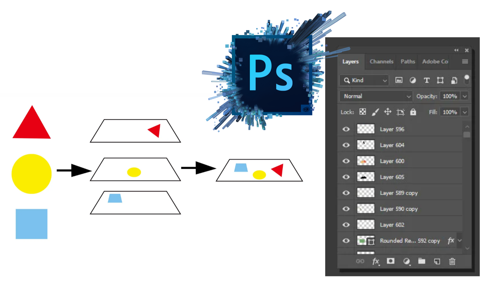
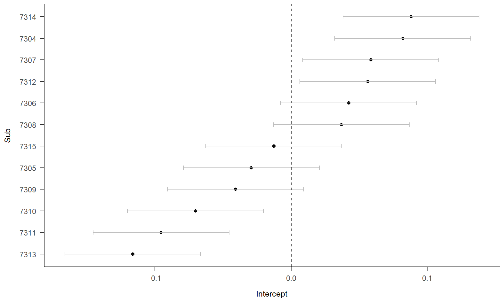

class: center, middle
<span style="font-size: 60px;">**第十二章**</span> <br>
<span style="font-size: 50px;">如何得到可发表的图像</span> <br>
<span style="font-size: 50px;">数据可视化进阶</span> <br>
<span style="font-size: 30px;">胡传鹏</span> <br>
<span style="font-size: 20px;"> </span> <br>
<span style="font-size: 30px;">`r Sys.Date()`</span> <br>
<span style="font-size: 20px;"> Made with Rmarkdown</span> <br>

```{r setup, include=FALSE}
knitr::opts_chunk$set(
  fig.width=9, fig.height=4, fig.retina=2, 
  out.width="100%",
  message = FALSE,
  warning = F
)
```

```{css extra.css, echo=FALSE}
/* ---- extra.css ---- */
.bigfont {
  font-size: 30px;
}
.size5{
font-size: 20px;
}
.tit_font{
font-size: 60px;
}

```

```{r xaringan-panelset, echo=FALSE}
xaringanExtra::use_panelset()
```

---

<br>
<br>
<br>
<br>
.pull-left[

# 为什么要作图？

- “一图胜千言”

- 信息传递的直观性


# 用什么做图？

- ggplot 2

]

.pull-right[

# 怎么画好一张图？

- 明确想要得到的图像

- “信达雅”
  - 信息量
  - 逻辑性
  - 美观（简洁、对称、和谐）

]

---
.panelset[
.panel[.panel-name[Packages]
```{r}
if (!requireNamespace('pacman', quietly = TRUE)) {
    install.packages('pacman')
}


pacman::p_load(
  # 本节课需要用到的 packages
  here, tidyverse, reshape, bruceR, ggplot2, patchwork, magick,
  # 生成课件
  xaringan, xaringanthemer, xaringanExtra, knitr)

options(scipen=99999,digits = 5)
```

.panel[.panel-name[trial data]
```{r}
df.match.trial <- bruceR::import(here::here('data','match','match_raw.csv')) %>% 
  tidyr::extract(Shape, 
                 into = c('Valence', 'Identity'),
                 regex = '(moral|immoral)(Self|Other)',
                 remove = FALSE) %>% #将Shape列分为两列
  dplyr::mutate(Valence = factor(Valence, levels = c('moral','immoral'), labels = c('moral','immoral')),
                Identity = factor(Identity, levels = c('Self','Other'), labels = c('Self','Other'))) %>%
  dplyr::filter(ACC == 0 | ACC == 1, 
                RT >= 0.2 & RT <= 1.5,
                Match == 'match',
                (!Sub %in% c(7302,7303,7338))) 
```
```{r echo=FALSE}
head(df.match.trial, 4) %>% DT::datatable()
```

.panel[.panel-name[subj data]
```{r}
df.match.subj <- df.match.trial %>%
  dplyr::group_by(Sub, Identity, Valence) %>%
  dplyr::summarise(RT_mean = mean(RT), 
                   ACC_mean = mean(ACC)) %>%
  dplyr::ungroup()
```

```{r echo=FALSE}
head(df.match.subj, 4) %>% DT::datatable()
```

.panel[.panel-name[sum data]
```{r}
df.match.sum <- df.match.subj %>% 
  dplyr::group_by(Identity, Valence) %>%
  dplyr::summarise(grand_mean_RT = mean(RT_mean),
                   SD_RT = sd(RT_mean),
                   SE_RT = SD_RT/sqrt(n()-1),
                   grand_mean_ACC = mean(ACC_mean),
                   SD_ACC = sd(ACC_mean),
                   SE_ACC = SD_ACC/sqrt(n()-1),
                   n = n()) %>%
  dplyr::ungroup()
```

```{r echo=FALSE}
head(df.match.sum, 4) %>% DT::datatable()
```

]]]]]

---

<br>
<br>
<h1 lang="en" style="font-size: 60px;">Contents</h1>
<br>
<br>
<br>
<span style="font-size: 45px;">12.1 ggplot2基础</span></center> <br>
<br>
<span style="font-size: 45px;">12.2 进阶——细节调整</span></center> <br>
<br>
<span style="font-size: 45px;">12.3 高级图片处理——magick</span></center> <br>
<br>

---
class: center, middle
<span style="font-size: 60px;">12.1 ggplot2基础</span> <br>

---
# 12.1 ggplot2基础
## 什么是ggplot

```{r echo=FALSE, out.width='70%', fig.align='center'}
knitr::include_graphics('./picture/chp12/ggplot.png')
```

---
# 12.1 ggplot2基础
## 图层叠加
```{r echo=FALSE, out.width='65%', fig.align='center'}

```
- 和PS类似，采用图层的设计方式；
- 图层之间的叠加是靠 “+” 实现的，越往后，其图层越在上方；
- 有明确的起始（ggplot()开始）与终止；
- 有必须的图层

---
# 12.1 ggplot2基础
## 必须图层


```{r}
# 以柱状图为例
p1 <- ggplot2::ggplot(data = df.match.sum, aes(x = Identity, y = grand_mean_RT, fill = Valence)) +
  ggplot2::geom_bar(stat = "Identity",
                    position = "dodge") +
  ggplot2::geom_errorbar(data = df.match.sum,
                         aes(ymin = grand_mean_RT - SE_RT, ymax = grand_mean_RT + SE_RT),
                         width=.1,
                         position = position_dodge(.9))
```

---
# 12.1 ggplot2基础
## 必须图层
```{r}
p1
```

---
# 12.1 ggplot2基础
## 可选图层
```{r echo=FALSE, out.width='70%', fig.align='center'}
knitr::include_graphics('./picture/chp12/adjust.png')
```

```{r}
# 以柱状图为例
p2 <- p1 +
  ggplot2::scale_y_continuous(expand=c(0, 0), breaks = seq(0, 0.75, 0.25), limits = c(0, 0.75)) +
  ggplot2::labs(title = "Mean RT for match trials", y = "RT") +
  papaja::theme_apa()
```

---
# 12.1 ggplot2基础
## 可选图层
```{r}
p2
```

---
# 12.1 ggplot2基础
## 可选图层
## 同理可以得到ACC的图
```{r echo=FALSE}
p3 <- ggplot2::ggplot(data = df.match.sum, aes(x = Identity, y = grand_mean_ACC, fill = Valence)) +
  ggplot2::geom_bar(stat = "Identity",
                    position = "dodge") +
  ggplot2::geom_errorbar(data = df.match.sum,
                         aes(ymin = grand_mean_ACC - SE_ACC,
                             ymax = grand_mean_ACC + SE_ACC),
                         width=.1,
                         position = position_dodge(.9)) +
  ggplot2::scale_y_continuous(expand=c(0, 0), breaks = seq(0, 1, 0.25), limits = c(0, 1)) +
  ggplot2::labs(title = "Mean ACC for match trials", y = "ACC") +
  papaja::theme_apa()

p3
```

---
# 12.1 ggplot2基础
## 可选图层
## 同时呈现两张图——方法一：分面(Facet)
.panelset[
.panel[.panel-name[Facet]
- Facet 也可以被认为是图层的一种，也是通过"+"加号叠加在原始图片上
- 可以分为一维(facet_wrap)和二维(facet_grid)两种，图示为二维
```{r echo=FALSE, out.width='40%', fig.align='center'}
knitr::include_graphics('./picture/chp12/facet.png')
```

.panel[.panel-name[Data preprocessing]
```{r}
df1 <- df.match.sum[,-c(6, 7, 8)]%>%
  dplyr::rename(grand_mean = grand_mean_RT,
                SD = SD_RT,
                SE = SE_RT)
df1$DV = "RT"

df2 <- df.match.sum[,-c(3, 4, 5)] %>%
  dplyr::rename(grand_mean = grand_mean_ACC,
                SD = SD_ACC,
                SE = SE_ACC)
df2$DV = "ACC"

df.match.sum.long <- rbind(df1, df2)
rm(df1, df2)
```

```{r echo=FALSE}
head(df.match.sum.long, 3) %>% DT::datatable()
```

.panel[.panel-name[figure code]
```{r}
p4 <- df.match.sum.long %>%
  ggplot2::ggplot(., 
                  aes(x = Identity,
                      y = grand_mean,
                      fill = Valence)) + 
  ggplot2::geom_bar(stat = "identity",
                    position=position_dodge(),
                    ) +
  ggplot2::geom_errorbar(aes(ymin = grand_mean-1.96*SE,
                             ymax = grand_mean+1.96*SE),
                         width = .1,
                         position = position_dodge(.9)) +
  papaja::theme_apa() +
  ggplot2::facet_wrap(~DV, scales = "free_y") +
  ggplot2::labs(title = "Mean for match trials",
                x="Identity",
                y="mean")
```

.panel[.panel-name[figure]
```{r echo=FALSE, out.width='85%'}
p4
```


]]]]]

---
# 12.1 ggplot2基础
## 可选图层
## 同时呈现两张图——方法二：patchwork
```{r out.width='85%'}
p2 + p3 + plot_layout(guides = "collect")
```


---
# 12.1 ggplot2基础
## 总结

```{r echo=FALSE, out.width='80%', fig.align='center'}
knitr::include_graphics('./picture/chp12/basic.png')
```

---
# 12.1 ggplot2基础
## 总结

```{r echo=FALSE, out.width='80%', fig.align='center'}
knitr::include_graphics('./picture/chp12/summary.png')
```

.footnote[
----------------
.footfont[
注：本图来自《R语言数据可视化之美：专业图表绘制指南》
]]

---
class: center, middle
<span style="font-size: 60px;">12.2 进阶——细节调整</span> <br>

---
# 12.2 进阶——细节调整
## 问题1：可视化RT, ACC的总体趋势与个体趋势
## 目标图片1
```{r echo=FALSE, out.width='70%', fig.align='center'}
knitr::include_graphics('./picture/chp12/target1.png')
```

---
# 12.2 进阶——细节调整(目标图片1)
## 画出总体均值
.panelset[
.panel[.panel-name[code]
```{r}
s1 <- df.match.sum %>%
  ggplot2::ggplot(., 
                  aes(x = Identity,
                      y = grand_mean_RT,
                      group = Valence,
                      color = Valence)) +
  ggplot2::geom_line(position = position_dodge(0.5)) +
  ggplot2::geom_point(size = 3,
                      position = position_dodge(0.5)) + 
  ggplot2::geom_errorbar(aes(ymin=grand_mean_RT-SE_RT,
                             ymax=grand_mean_RT+SE_RT),
                         width=.1,
                         position = position_dodge(0.5)) +
  ggplot2::scale_y_continuous(limits = c(0.4, 0.9)) + #选取能纳入全部散点的范围
  papaja::theme_apa()
```

.panel[.panel-name[figure]
```{r echo=FALSE, out.width='80%', fig.align='center'}
s1
```

]]]

---
# 12.2 进阶——细节调整(目标图片1)
## 加入个体数据
.panelset[
.panel[.panel-name[直接加入——拥挤]
```{r}
s2 <- s1 +
  ggplot2::geom_point(data = df.match.subj,
                      aes(x = Identity,
                          y = RT_mean,
                          group = Valence))
```

```{r echo=FALSE, out.width='70%', fig.align='center'}
s2
```

.panel[.panel-name[加入抖动——混乱]
```{r}
s3 <- s1 +
  ggplot2::geom_point(data = df.match.subj,
                      aes(x = Identity, y = RT_mean, group = Valence),
                      position = position_jitter(width = 0.1),
                      alpha = 0.5)
```

```{r echo=FALSE, out.width='70%', fig.align='center'}
s3
```

]]]

---
# 12.2 进阶——细节调整(目标图片1)
## 加入个体数据——如何得到规则的抖动？
.panelset[
.panel[.panel-name[将不同条件点的位置作为新变量]
```{r}
df.match.plot <- df.match.subj %>%
  dplyr::mutate(conds = case_when(Identity == "Self" & Valence == "moral" ~ "0.88",
                                  Identity == "Self" & Valence == "immoral" ~ "1.12",
                                  Identity == "Other" & Valence == "moral" ~ "1.88",
                                  Identity == "Other" & Valence == "immoral" ~ "2.12"),
                conds = as.numeric(conds))
```

.panel[.panel-name[以conds为基础抖动]
```{r}
s4 <- s1 +
    ggplot2::geom_point(data = df.match.plot,
                       aes(x = conds, y = RT_mean, group = Valence),
                       position = position_jitter(width = 0.08),
                       alpha = 0.5)
```

```{r echo=FALSE, out.width='70%', fig.align='center'}
s4
```

]]]

---
# 12.2 进阶——细节调整(目标图片1)
## 显示个体趋势
```{r}
s5 <- s4 +
  ggplot2::geom_line(data = df.match.plot,
                     aes(x = conds, y = RT_mean, group = Sub),
                     linetype = 1,
                     size=0.8,
                     color="#000000",
                     alpha=0.1)
```

```{r echo=FALSE, out.width='70%', fig.align='center'}
s5
```

---
# 12.2 进阶——细节调整(目标图片1)
## 显示个体趋势——如何使点和线正确连接？
.panelset[
.panel[.panel-name[code]
```{r}
s6 <- s1 +
  ggplot2::geom_point(data = df.match.plot,
                       aes(x = conds,
                           y = RT_mean,
                           group = as.factor(Sub)),
                      position = position_dodge(0.08),
                      color="#000000",
                      alpha = 0.05) +
  ggplot2::geom_line(data = df.match.plot,
                     aes(x = conds,
                         y = RT_mean,
                         group = as.factor(Sub)),
                     position = position_dodge(0.08),
                     linetype = 1,
                     size=0.8,
                     color="#000000",
                     alpha=0.05) +
  ggplot2::labs(y = "RT")
```

.panel[.panel-name[figure]
```{r echo=FALSE, out.width='80%', fig.align='center'}
s6
```

]]]

---
# 12.2 进阶——细节调整(目标图片1)
## 同理可得ACC的图

<br>
<br>
```{r echo=FALSE, out.width='80%', fig.align='center'}
s7 <- df.match.sum %>%
  ggplot2::ggplot(., 
                  aes(x = Identity,
                      y = grand_mean_ACC,
                      group = Valence,
                      color = Valence)) +
  ggplot2::geom_line(position = position_dodge(0.5)) +
  ggplot2::geom_point(size = 3,
                      position = position_dodge(0.5)) + 
  ggplot2::geom_errorbar(aes(ymin = grand_mean_ACC - SE_ACC,
                             ymax = grand_mean_ACC + SE_ACC),
                         width=.1,
                         position = position_dodge(0.5)) +
  ggplot2::scale_y_continuous(breaks = seq(0.4, 1.0, 0.2), limits = c(0.3, 1.0)) + #选取能纳入全部散点的范围
  papaja::theme_apa()
  
s8 <- s7 +
  ggplot2::geom_point(data = df.match.plot,
                       aes(x = conds,
                           y = ACC_mean,
                           group = as.factor(Sub)),
                      position = position_dodge(0.08),
                      color="#000000",
                      alpha = 0.05) +
  ggplot2::geom_line(data = df.match.plot,
                     aes(x = conds,
                         y = ACC_mean,
                         group = as.factor(Sub)),
                     position = position_dodge(0.08),
                     linetype = 1,
                     size=0.8,
                     color="#000000",
                     alpha=0.05) +
  ggplot2::labs(y = "ACC")

s8
```

---
# 12.2 进阶——细节调整(目标图片1)
## 合并图片
```{r}
s9 <- s6 + s8 + plot_layout(guides = "collect")
s9
```

---
# 12.2 进阶——细节调整(目标图片1)
## 保存图片
```{r}
# 保存为pdf更加清晰
ggplot2::ggsave(filename = "./picture/chp12/p1.pdf", 
                plot = s9, 
                width = 5, 
                height = 4)
```

---
# 12.2 进阶——细节调整
## 问题2：可视化层级模型的random effect
## 目标图片2
```{r echo = F,out.width="100%", fig.align='center'}

```


---
# 12.2 进阶——细节调整(目标图片2)
## 预测
.panelset[
.panel[.panel-name[data preprocessing]
```{r}
#此处选择12个被试是为了在展示的时候更清晰
sublist <- unique(df.match.trial$Sub)
target2 <- df.match.trial %>% 
  dplyr::filter(Sub == sublist[1:12]) %>%
  dplyr::mutate(Label = factor(Label, levels = c("moralSelf", "moralOther", "immoralSelf", "immoralOther")),
                Sub = factor(Sub))

model <- lme4::lmer(data = target2,
                    RT ~ Identity * Valence + (1 + Identity * Valence|Sub)) 

target2.subj <- target2 %>%
  dplyr::group_by(Sub, Identity, Valence) %>%
  dplyr::summarise(RT_mean = mean(RT)) %>%
  dplyr::ungroup()

target2.subj$pred <- stats::predict(model, newdata = target2.subj)
```

.panel[.panel-name[data visualization]
```{r out.width="65%"}
# 观察数据和预测数据一起画出
ggplot2::ggplot(data = target2.subj, aes(x = Identity, y = RT_mean, color = Valence)) +
  ggplot2::geom_point() + # 实际的观察数据
  ggplot2::geom_line(aes(y = pred, group = interaction(Sub,Valence))) + # 预测的数据线
  ggplot2::labs(y = "RT") +
  ggplot2::facet_wrap(~ Sub) + # 按照对象分面
  papaja::theme_apa()
```


]]]


---
# 12.2 进阶——细节调整(目标图片2)
## 随机效应森林图
.panelset[
.panel[.panel-name[data preprocessing]
```{r}
# 提取随机效应
ranef_df <- as.data.frame(ranef(model)$Sub)
ranef_df$Sub <- row.names(ranef_df)

# 将数据重新塑造为长格式,添加置信区间
ranef_melt <- reshape::melt(ranef_df, id.vars = 'Sub')
ranef_melt$se <- sqrt(diag(vcov(model)))
ranef_melt$upper <- ranef_melt$value + (1.96 * ranef_melt$se)
ranef_melt$lower <- ranef_melt$value - (1.96 * ranef_melt$se)
```

.panel[.panel-name[forest]
```{r out.width="65%"}
# 绘制森林图
ggplot2::ggplot(ranef_melt, aes(x=value, y=Sub)) +
  ggplot2::geom_point(aes(color = variable), size = 2) +
  ggplot2::geom_errorbarh(aes(xmax = upper, xmin = lower), height = .2, color = 'grey') +
  ggplot2::geom_vline(xintercept = 0, linetype = 2) +
  ggplot2::facet_wrap(~ variable, nrow = 1) + # 按照对象分面
  papaja::theme_apa()
```

.panel[.panel-name[forest-certain]
```{r out.width="65%"}
# 某个特定随机效应的森林图
ranef_melt %>%
  dplyr::filter(Sub == "7305" & variable == "IdentityOther") %>%
  ggplot2::ggplot(., aes(x=value, y=Sub)) +
  ggplot2::geom_point(aes(color = variable), size = 5) +
  ggplot2::geom_errorbarh(aes(xmax = upper, xmin = lower), height = .2, color = 'grey') +
  ggplot2::geom_vline(xintercept = 0, linetype = 2) +
  ggplot2::theme_bw()
```


]]]]

---
# 12.2 进阶——细节调整
## 问题3：使用雨云图(Raincloud plot)呈现数据的分布
## 雨云图将不在PPT中出现，感兴趣的同学可以自行回到rmd文件运行chunk
## 目标图片3
```{r echo = F,out.width="80%", fig.align='center'}
knitr::include_graphics('picture/chp12/target3.png')
```

```{r, include=FALSE}
# 创建一个空list用于存放数据集
df <- list()
# 创建一个空list用于存放图片
p <- list()
# 保护全球环境(global environment)， 人人有责
# 希望大家以后写代码都把变量分类放在不同的list中
```

```{r Raw Data, include=FALSE}
df[[1]] <-  read.csv('./data/match/match_raw.csv',
                       header = T, sep=",", stringsAsFactors = FALSE)
names(df)[1] <- "Raw"
```

```{r Clean Data, include=FALSE}
df[[2]] <- df[[1]] %>%
  dplyr::group_by(Sub, Shape, Match) %>%
  dplyr::summarise(RT_mean = mean(RT)) %>%
  dplyr::ungroup()
names(df)[2] <- "Clean"
```

```{r plot 1, eval=FALSE, include=FALSE}
# 最简单的箱线图
# 看看不同Shape情况下 平均反应时的分布情况
p[[1]] <- ggplot2::ggplot(df[[2]], aes(x = Shape, y = RT_mean, fill = Shape)) +
  ggplot2::geom_boxplot(color = "grey", alpha = 0.5) 
names(p)[1] <- "Basic: Box Plot"; p[[1]]
ggsave(filename = "./picture/chp12/plot1.png", plot = p[[1]], height = 5, width = 10, dpi = 300)
```

```{r plot 2, eval=FALSE, include=FALSE}
# 增加横纵坐标标题
p[[2]] <- p[[1]] +
  ggplot2::labs(x = "Moral & Identity", y = "Mean of Reaction Time", title = "Boxplot of RT_mean by Shape") 
names(p)[2] <- "Basic: Plot Labels"; p[[2]]
ggsave(filename = "./picture/chp12/plot2.png", plot = p[[2]], height = 5, width = 10, dpi = 300)
```

```{r plot 3, eval=FALSE, include=FALSE}
# 叠加点图
p[[3]] <- p[[2]] +
  ggplot2::geom_point(aes(colour = Shape), position = position_jitter(width = 0.2), size = 3, alpha = 0.5) 
names(p)[3] <- "Basic: Point Plot"; p[[3]]
ggsave(filename = "./picture/chp12/plot3.png", plot = p[[3]], height = 5, width = 10, dpi = 300)
```

```{r plot 4, eval=FALSE, include=FALSE}
# 叠加小提琴图
p[[4]] <- p[[3]] +
  ggplot2::geom_violin(aes(colour = Shape), color = "grey", width = 0.2, alpha = 0.5) 
names(p)[4] <- "Basic: Violin Plot"; p[[4]]
ggsave(filename = "./picture/chp12/plot4.png", plot = p[[4]], height = 5, width = 10, dpi = 300)
```

```{r plot 5, eval=FALSE, include=FALSE}
# 太拥挤了，三种图应该错开一定的距离, 以及调整每个图形的宽度
p[[5]] <- ggplot2::ggplot(df[[2]], aes(x = Shape, y = RT_mean, fill = Shape)) +
  ggplot2::geom_boxplot(width = 0.1, position = position_nudge(x = -0.2), color = "grey", alpha = 0.5) + # 箱线图左移0.2个单位，宽度0.1
  ggplot2::geom_point(aes(colour = Shape), position = position_jitter(width = 0.1), size = 3, alpha = 0.5) + # 点图处于中间，但是调整宽度
  ggplot2::geom_violin(aes(colour = Shape), width = 0.1, position = position_nudge(x = 0.2), color = "grey", alpha = 0.5) + # 小提琴图右移0.2各单位，宽度0.1
  ggplot2::labs(x = "Moral & Identity", y = "Mean of Reaction Time", title = "Boxplot of RT_mean by Shape")
names(p)[5] <- "Basic: Plot Position"; p[[5]]
ggsave(filename = "./picture/chp12/plot5.png", plot = p[[5]], height = 5, width = 10, dpi = 300)
```

```{r plot 6, eval=FALSE, include=FALSE}
# 叠加云图 raincloud plot
p[[6]] <- p[[5]] +
  ggdist::stat_halfeye(adjust = 0.2,justification = -0.35, alpha = 0.5, width = 0.5,   # adjust 拟合的锐度(平滑度), justification位置(与ggplot方向相反), alpha 透明度
                       .width = 0, point_colour = NA) # 如果没有 .width = 0, point_colour = NA, halfeye也会画出一些黑点
names(p)[6] <- "Basic: Cloud Plot"; p[[6]]
ggsave(filename = "./picture/chp12/plot6.png", plot = p[[6]], height = 5, width = 10, dpi = 300)
```

```{r plot 7, eval=FALSE, include=FALSE}
# violin图被halfeye遮挡了，可以删掉它
p[[7]] <- p[[6]] # 把p[[6]]传递给p[[7]]
p[[7]]$layers[3] <- NULL # 然后把第三个图层--violin赋值为空
# 这样就删除了violin这个图层
names(p)[7] <- "Basic: Delete Layers"; p[[7]]
ggsave(filename = "./picture/chp12/plot7.png", plot = p[[7]], height = 5, width = 10, dpi = 300)
```

```{r plot 8, eval=FALSE, include=FALSE}
# ggdist的点图比ggplot2的更好看
p[[8]] <- ggplot2::ggplot(df[[2]], aes(x = Shape, y = RT_mean, fill = Shape,)) +
  ggplot2::geom_boxplot(width = 0.1, position = position_nudge(x = -0.05), color = "grey", alpha = 0.5, outlier.color = NA,) + # 箱线图左移0.2个单位
  ggdist::stat_halfeye(adjust = 0.2,justification = -0.05, alpha = 0.5, width = 0.5, .width = 0, point_colour = NA) +
  ggdist::stat_dots(side = "left",justification = 1.15, alpha = 0.5) + 
  ggplot2::labs(x = "Moral & Identity", y = "Mean of Reaction Time", title = "RainCloud Plot of RT_mean by Moral & Identity")
names(p)[8] <- "Basic: RainCloud Plot"; p[[8]]
ggsave(filename = "./picture/chp12/plot8.png", plot = p[[8]], height = 5, width = 10, dpi = 300)
```

```{r plot 9, eval=FALSE, include=FALSE}
# 旋转图片，现在终于明白为什么叫raincloud了
p[[9]] <- p[[8]] +
  ggplot2::coord_flip()
names(p)[9] <- "Basic: Plot Flip"; p[[9]]
ggsave(filename = "./picture/chp12/plot9.png", plot = p[[9]], height = 5, width = 10, dpi = 300)
```

```{r plot 10, eval=FALSE, include=FALSE}
# 在这张图里，图例和横坐标表达的信息重复了，可以隐藏图例
p[[10]] <- p[[9]] +
  ggplot2::theme(legend.position = "none")
names(p)[10] <- "Basic: Legend Hidden"; p[[10]]
ggsave(filename = "./picture/chp12/plot10.png", plot = p[[10]], height = 5, width = 10, dpi = 300)
```

```{r Color Palette, include=FALSE}
popsicle <- c("#F3533A", "#FA9F42", "#8AD879", "#5ACFC9")
sunset <- c("#C848B9", "#F962A7", "#FD836D", "#FFBA69")
glassdoor <- c("#3D9A8B", "#2EB19F", "#63C2D2", "#B7EDFF")
palette <- list(popsicle = popsicle, sunset = sunset, glassdoor = glassdoor)
rm(popsicle, sunset, glassdoor)
```

```{r plot 11, eval=FALSE, warning=FALSE, include=FALSE}
# 更改图片的填充颜色
p[[11]] <- p[[10]] +
  ggplot2::scale_fill_manual(values = palette$popsicle)  # 用什么颜色，体现了你的审美！
names(p)[11] <- "Basic: Fill Color"; p[[11]]
ggsave(filename = "./picture/chp12/plot11.png", plot = p[[11]], height = 5, width = 10, dpi = 300)
```

```{r plot 12, eval=FALSE, warning=FALSE, include=FALSE}
# 坐标轴颜色
p[[12]] <- p[[11]] +
  ggplot2::theme(axis.text.y = element_text(color = palette$popsicle))
names(p)[12] <- "Basic: Axis Text Color"; p[[12]]
ggsave(filename = "./picture/chp12/plot12.png", plot = p[[12]], height = 5, width = 10, dpi = 300)
```

```{r plot 13, eval=FALSE, warning=FALSE, include=FALSE}
# 图上文字的大小
p[[13]] <- p[[12]] +
  ggplot2::theme(axis.text = element_text(size = 12),
                 axis.title = element_text(size = 14),
                 plot.title = element_text(size = 16),)
names(p)[13] <- "Basic: Axis Text Size"; p[[13]]
ggsave(filename = "./picture/chp12/plot13.png", plot = p[[13]], height = 5, width = 10, dpi = 300)
```

```{r plot 14, eval=FALSE, warning=FALSE, include=FALSE}
# 按照Match拆分为两个Facet
p[[14]] <- p[[13]] +
  ggplot2::facet_wrap(~Match)
names(p)[14] <- "Basic: Facet"; p[[14]]
ggsave(filename = "./picture/chp12/plot14.png", plot = p[[14]], height = 5, width = 10, dpi = 300)
```

```{r plot 15, eval=FALSE, warning=FALSE, include=FALSE}
# Facet文字的大小
p[[15]] <- p[[14]] +
  ggplot2::theme(strip.text = element_text(size = 14)) 
names(p)[15] <- "Basic: Facet Text Size"; p[[15]]
ggsave(filename = "./picture/chp12/plot15.png", plot = p[[15]], height = 5, width = 10, dpi = 300)
```

```{r plot16, eval=FALSE, warning=FALSE, include=FALSE}
p[[16]] <- ggplot2::ggplot(df[[2]], 
                           aes(x = Shape, y = RT_mean, 
                               fill = interaction(Shape, Match),)) + # fill的颜色基于Shape和Match
  ggplot2::geom_boxplot(width = 0.1, position = position_nudge(x = -0.05), alpha = 0.5, outlier.color = NA, color = "grey") + 
  ggdist::stat_halfeye(adjust = 0.2,justification = -0.05, alpha = 0.5, width = 0.5, .width = 0, point_colour = NA,) +
  ggdist::stat_dots(side = "left",justification = 1.15, alpha = 0.5,) + 
  ggplot2::labs(x = "Moral & Identity", y = "Mean of Reaction Time", title = "RainCloud Plot of RT_mean by Moral & Identity") +
  ggplot2::coord_flip() +
  ggplot2::scale_fill_manual(values = c(palette$sunset, palette$glassdoor)) + # 需要八种颜色来填充图片
  ggplot2::facet_wrap(~Match, ncol = 1) 

names(p)[16] <- "Basic: Interactional Fill"; p[[16]]
ggsave(filename = "./picture/chp12/plot16.png",plot = p[[16]], height = 5, width = 10, dpi = 300)
```

```{r plot 17, eval=FALSE, warning=FALSE, include=FALSE}
# theme_bw() 会改变很多地方的颜色，让主题变成黑白，方便接下来的细节修改
p[[17]] <- p[[16]] +
  ggplot2::theme_bw()  
names(p)[17] <- "APA theme: theme_bw"; p[[17]]
ggsave(filename = "./picture/chp12/plot17.png", plot = p[[17]], height = 5, width = 10, dpi = 300)
```

```{r plot 18, eval=FALSE, warning=FALSE, include=FALSE}
# APA默认图例局右
p[[18]] <- p[[17]] +
  ggplot2::theme(legend.position = "right",)  # 也可以去掉图例
names(p)[18] <- "APA theme: legend.position"; p[[18]]
ggsave(filename = "./picture/chp12/plot18.png", plot = p[[18]], height = 5, width = 10, dpi = 300)
```

```{r plot 19, eval=FALSE, warning=FALSE, include=FALSE}
# 除了字体大小，标题粗体居中
p[[19]] <- p[[18]] +
  ggplot2::theme(axis.text = element_text(size = 12), # 坐标轴字体大小
                 axis.title = element_text(size = 12), # 坐标轴标题字体大小
                 strip.text = element_text(size = 12), # facet标题字体大小
                 plot.title = element_text(size = 12, face = "bold", hjust = 0.5)) # 图片整体标题字体大小 title粗体，居中
names(p)[19] <- "APA theme: font_size"; p[[19]]
ggsave(filename = "./picture/chp12/plot19.png", plot = p[[19]], height = 5, width = 10, dpi = 300)
```

```{r plot 20, eval=FALSE, warning=FALSE, include=FALSE}
# 去掉facet标题底色  
p[[20]] <- p[[19]] +
  ggplot2::theme(strip.background = element_blank()) 
names(p)[20] <- "APA theme: facet_title_background"; p[[20]]
ggsave(filename = "./picture/chp12/plot20.png", plot = p[[20]], height = 5, width = 10, dpi = 300)
```

```{r plot 21, eval=FALSE, warning=FALSE, include=FALSE}
# 隐藏水平网格线
p[[21]] <- p[[20]] +
  ggplot2::theme(panel.grid.major=element_blank()) 
names(p)[21] <- "APA theme: panel.grid.major"; p[[21]]
ggsave(filename = "./picture/chp12/plot21.png", plot = p[[21]], height = 5, width = 10, dpi = 300)
```

```{r plot 22, eval=FALSE, warning=FALSE, include=FALSE}
# 隐藏垂直网格线
p[[22]] <- p[[21]] +
  ggplot2::theme(panel.grid.minor=element_blank()) 
names(p)[22] <- "APA theme: panel.grid.minor"; p[[22]]
ggsave(filename = "./picture/chp12/plot22.png", plot = p[[22]], height = 5, width = 10, dpi = 300)
```

```{r plot 23, eval=FALSE, warning=FALSE, include=FALSE}
# 隐藏边框
p[[23]] <- p[[22]] +
  ggplot2::theme(panel.border=element_blank()) # 也可以不去除边框，保留坐标轴
names(p)[23] <- "APA theme: panel.border"; p[[23]]
ggsave(filename = "./picture/chp12/plot23.png", plot = p[[23]], height = 5, width = 10, dpi = 300)
```

```{r plot 24, eval=FALSE, warning=FALSE, include=FALSE}
# 改变图上字体family
p[[24]] <- p[[23]] +
  ggplot2::theme(text=element_text(family='Times New Roman')) 
names(p)[24] <- "APA theme: font_family"; p[[24]]
ggsave(filename = "./picture/chp12/plot24.png", plot = p[[24]], height = 5, width = 10, dpi = 300)
```

```{r import font family, echo=FALSE, eval=FALSE, warning=FALSE, include=FALSE}
 # 使用windowsFonts()查看字体对应的名字是什么, 运气好，里面就有times new roman
windowsFonts()
 # 如果没有，可以library(extrafont)
library(extrafont)
 # 这个包很笨，只能添加一个文件夹内的字体，
 # 默认添加"C:/WINDOWS/FONT/"，这里面有你电脑里所有的字体
 # 因此建议你把需要的字体放到桌面，
 # 然后设置导入路径font_import(path = "C:/user/desktop/")
font_import(path = "C:/user/desktop/")
 # 最后使用 fonttable()，查看字体是否被导入了，
 # 记住times new roman对应的FamilyName
fonttable()
 # 填在上面的text=element_text(family='Times New Roman')
```

```{r Save APA theme, eval=FALSE, warning=FALSE, include=FALSE}
# 将刚刚制作的apa格式保存
theme_apa <- ggplot2::theme_bw() +
             ggplot2::theme(#legend.position = "none",
                            axis.text = element_text(size = 12), # 坐标轴字体大小
                            axis.title = element_text(size = 12), # 坐标轴标题字体大小
                            strip.text = element_text(size = 12), # facet标题字体大小
                            plot.title = element_text(size = 12, face = "bold", hjust = 0.5), # 图片整体标题字体大小
                            strip.background = element_blank(), # facet标题的背景
                            panel.grid.major=element_blank(), # 水平参考线
                            panel.grid.minor=element_blank(), # 垂直参考线
                            panel.border=element_blank(), # 边框
                            text=element_text(family='Times New Roman'), #字体family,       
                            # papaja::theme_apa()会warning找不到Windows中字体，但其实如果你载入了，就可以在R中找到
                            )
# 你可以在载入了papaja(jtools)包之后，在画完图后加入 theme_apa()，获得一样的效果
```

```{r plot 24_apa, eval=FALSE, warning=FALSE, include=FALSE}
# 和直接用papaja::theme_apa()制作的对比一下,坐标轴更好看了，其他几乎一样
p[[24]] <- p[[16]] +
  papaja::theme_apa(base_family = "Times New Roman")
names(p)[24] <- "APA theme: font_family"; p[[24]]
ggsave(filename = "./picture/chp12/plot24_apa.png", plot = p[[24]], height = 5, width = 10, dpi = 300)
```


---
class: center, middle
<span style="font-size: 60px;">12.3 高级图片处理——magick</span> <br>

---
# 12.3 高级图片处理——magick

.pull-left[

.size6[

<br>
<br>
<br>
ggplot生成的图像有时需要使用PPT或者PS等软件进行进一步修改（如调整分辨率、修改图片格式(jpg转png)、图片拼接与剪裁等），也有可能会遇到对于图像进行批量修改的情况，这时，我们仍然可以考虑使用R来处理。

magick包可以应用于所有常见图片操作(甚至包括PDF)，具体功能可以参考相关文档 $^*$，在这里我们仅以图片剪裁与拼接为例。
]]

.pull-right[

<br>
<br>
<br>
```{r echo = F,out.width="80%"}
knitr::include_graphics('picture/chp12/r.jpg')
```
]

.footnote[
----------------
.footfont[
注：[https://search.r-project.org/CRAN/refmans/magick/html/magick.html](https://search.r-project.org/CRAN/refmans/magick/html/magick.html)
]]

---
# 12.3 高级图片处理——magick
## 图片剪裁与拼接

.panelset[

.panel[.panel-name[查看图片]

假设我们希望这两张图变为横向排版，那么首先需要对图片进行剪裁，然后进行横向拼接。

```{r echo = F,out.width="40%"}
knitr::include_graphics('picture/chp6/pr1.png')
```


.panel[.panel-name[读取图片]
```{r}
## 读取图片；图片可以是本地，也可以是图片的网址链接
img = magick::image_read('picture/chp6/pr1.png')

## 查看图片相关信息
img %>% magick::image_info()

```


.panel[.panel-name[图片剪裁--语法]

.pull-left[

下面需要根据图片的width 和 height ，使用`magick::image_crop()`进行裁剪，geometry参数接受一个字符串，来对剪裁区域进行定位，比如`"850x480+10+10"`。

这个字符串包含两个部分:

-   第一部分：包含图片剪裁的长和宽（单位可以是百分比，但下面会使用像素），即`"850x480"`（注意：其中连接符为小写字母x），大概指右图中红色线条;

-   第二部分：包含起始点位置，即`"+10+10"`，意思是从左上角顶点向右10个像素，向下10个像素，大概对应右图中灰色点的位置，如果不写默认使用`+0+0`（即左上角顶点）。
]

.pull-right[

```{r echo = F}
knitr::include_graphics('picture/chp12/crop_gram.jpg')
```

]

.panel[.panel-name[图片剪裁--结果]

```{r out.width="80%"}
img %>% magick::image_crop('850x480+10+10')
```

.panel[.panel-name[图片剪裁与合并]

```{r highlight=TRUE, out.width="80%"}
img1 = img %>% magick::image_crop('870x488')
img2 = img %>% magick::image_crop('870x488+0+485')
## 使用image_append进行拼接，令stack = F进行横向拼接（T为竖向）
img3 = image_append(c(img1,img2),stack = F) #<<
img3 %>% print()
```

.panel[.panel-name[其他]

```{r eval=FALSE}
#### NOT RUN ####
# 保存图片到本地
image_write(image = img3,path = 'your path')
# 修改尺寸(可以以像素为单位，这里以百分比为例)
image_scale(img1,'40%')
# 旋转
image_rotate(img1,90)
# OCR(这里以英文为例，中文的识别率经测验确实不太行😢)
image_read("http://jeroen.github.io/images/testocr.png") %>% 
  image_ocr() %>% 
  cat()
```

]]]]]]]

---
# 网络资源

- ggplot2常用参数与函数汇总：https://zhuanlan.zhihu.com/p/637483028
- ggplot2位置调整参数：https://zhuanlan.zhihu.com/p/409489632
- ggplot2主题总结：https://zhuanlan.zhihu.com/p/463041897
- ggplot2分面总结：https://zhuanlan.zhihu.com/p/225852640
- patchwork常用功能：https://zhuanlan.zhihu.com/p/384456335
