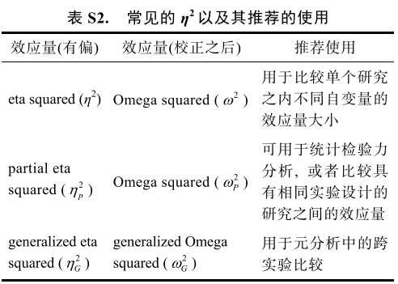
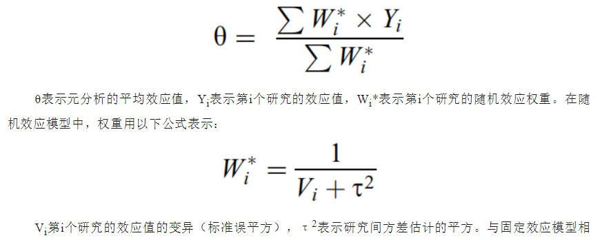
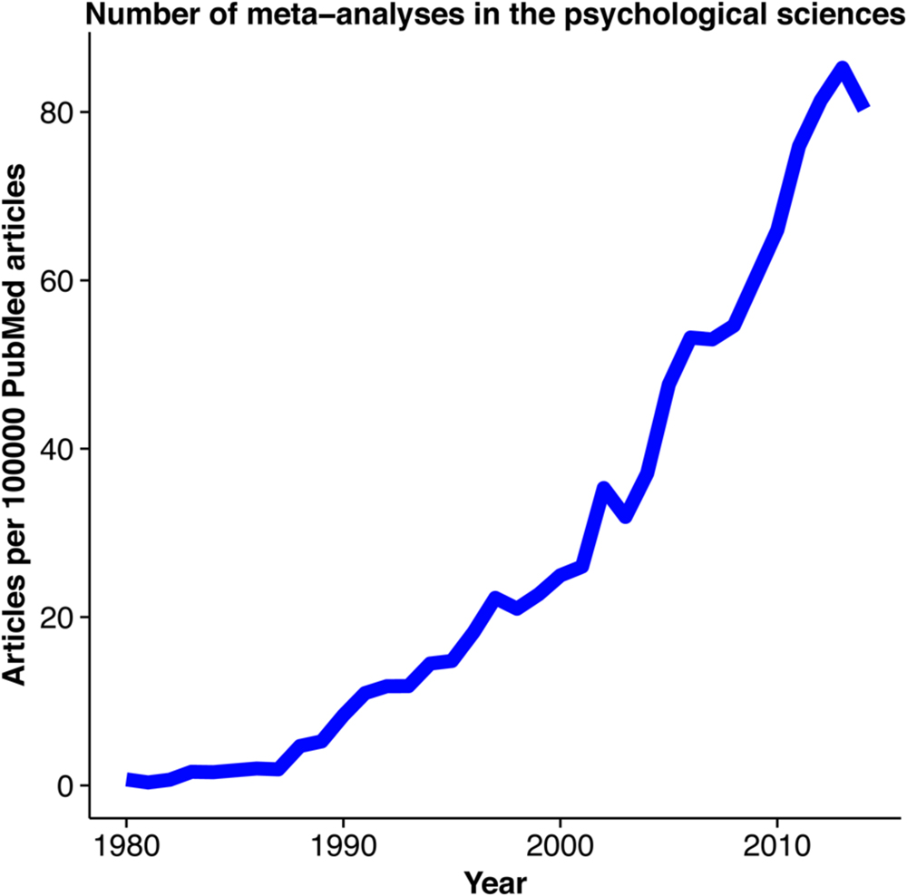

class: center, middle
<span style="font-size: 60px;">第十三章</span> <br>
<span style="font-size: 50px;">效应量和元分析 <br>

<br>
<br>
<span style="font-size: 30px;">胡传鹏</span> <br>
<span style="font-size: 30px;">2023/05/29</span> <br>

---

# <h1 lang="zh-CN">什么是效应量</h1>
**效应量**: 研究者感兴趣的任何效应的量(Cumming, 2012, *Psych Sci*)。<br>
<br>

标准化的效应量可以分为三大家族：<br>

- *d*-family（difference family）：如Cohen's *d*, Hedges' *g*
- *r*-family（correlation family）：如Pearson r, $R^2$, $\eta^2$, $\omega^2$, & *f*
- *OR*-family（categorical family）：如odds ratio (OR), risk ratio (RR)

---
# <h1 lang="zh-CN">什么是效应量</h1>

.center[]

- Lakens, D. (2013). Calculating and reporting effect sizes to facilitate cumulative science: A practical primer for t-tests and ANOVAs. *Frontiers in Psychology, 4*, 863.
---
# <h1 lang="zh-CN">什么是效应量</h1>

.center[]

- Lakens, D. (2013). Calculating and reporting effect sizes to facilitate cumulative science: A practical primer for t-tests and ANOVAs. *Frontiers in Psychology, 4*, 863.

---
# <h1 lang="zh-CN">效应量与置信区间</h1>

SPSS: 偏eta squared ( $\eta^{2}_{p}$ ) 
<br>

JASP: Cohen's *d*, $\eta^{2}_{p}$, $\eta^{2}_{G}$
<br>

Lakens (2013): 基于 excel 的计算程序 <br>

G\*power (Faul, et al., 2009) 可用于计算效应量, 但与SPSS输出的偏eta squared不相同, 使用时需要转换 (Lakens, 2013)
<br>

- Faul, F., Erdfelder, E., Buchner, A., & Lang, A.-G. (2009). Statistical power analyses using G\*Power 3.1: Tests for correlation and regression analyses. *Behavior Research Methods, 41*(4), 1149–1160.
- Lakens, D. (2013). Calculating and reporting effect sizes to facilitate cumulative science: A practical primer for t-tests and ANOVAs. *Frontiers in Psychology, 4*, 863.
---
# <h1 lang="zh-CN">效应量与置信区间</h1>
<br>
## 点估计与区间估计
<br>
**基于估计的统计**被认为是一种对虚无假设的补充, 但实际上反映了推断统计的不同取向, 最重要的是从二分的思维方式转向量化的思维方式 (Cumming, 2012) <br>

在效应量的解读中, 没有固定的标准来判断一个效应量是大还是小。<br>

Richard, Bond, & Stokes-Zoota (2003) 对100多年来社会心理学研究中的元分析进行分析, 发现社会心理学研究中的平均效应量大约为*r* = 0.21, Cohen's *d* = 0.45。<br>

总的来说, 对效应量以及其置信区间的解读需要根据自己研究的实际情况来进行, 没有像NHST 中那样简单的二分标准(Cumming, 2012)。<br>

- Cumming, G. (2012). Understanding the new statistics: Effect sizes, confidence intervals, and meta-analysis. New York: Routledge.
- Richard, F. D., Bond, C. F., Jr., & Stokes-Zoota, J. J. (2003). One hundred years of social psychology quantitatively described. *Review of General Psychology, 7*(4), 331–363.

---
# <h1 lang="zh-CN">效应量与置信区间</h1>
<br>
## 如何解读效应量
<br>
.center[]

https://www.cell.com/trends/cognitive-sciences/fulltext/S1364-6613(19)30297-9

---
# <h1 lang="zh-CN">效应量与置信区间</h1>
.center[]

<br>
https://rpsychologist.com/d3/ci/

---

# <h1 lang="zh-CN">*t*检验中的*d*</h1>
<br>
## 基本公式: 独立样本*t*-test [Cohen's *d* for *sample*]
<br>

$$Cohen's \  d_s = \frac{X_1 - X_2}{\sqrt{SD_{pool}}} = \frac{X_1 - X_2}{\sqrt{\frac{(n_1 -1)SD_1^2 + (n_2-1)SD_2^2)}{n_1+n2-2}}}$$
## Hedges's *g*:

$$Hedges's \  g_s = Cohen's \ d_s \times (1 - \frac{3}{4(n_1 + n_2) - 9}) $$

---
# <h1 lang="zh-CN">*t*检验中的*d*</h1>
<br>

## 配对样本*t*-test: Cohen's $d_{rm}$

<br>

$$Cohen's \  d_{rm} = \frac{M_{diff}}{\sqrt{SD_1^2 + SD_2^2 -2 \times r \times SD_1 \times SD_2}} \times \sqrt{2(1-r)} $$

## 配对样本*t*-test: Cohen's $d_{av}$

$$Cohen's \  d_{av} = \sqrt{ \frac {M_{diff}} {(SD_1 + SD_2)/2}} $$
---
# <h1 lang="zh-CN">计算Cohen's *d* </h1>
<br>
载入数据
```{r setup}
rm(list = ls())
if (!requireNamespace("pacman", quietly = TRUE)) {
  install.packages("pacman") }   # # 检查是否已安装 pacman, 如果未安装，则安装包

pacman::p_load("tidyverse", "easystats") # 使用p_load来载入需要的包

df.mt.raw <-  read.csv('./data/match/match_raw.csv', # load data:
                       header = T, sep=",", stringsAsFactors = FALSE)
```

---
# <h1 lang="zh-CN">计算Cohen's *d* </h1>
<br>
清理数据
```{r clean the data}
# from chapter 11, Chunk 3
df.mt.rt.subj <- df.mt.raw %>%
  dplyr::filter(ACC == 1 & RT > 0.2) %>%
  tidyr::extract(Shape, into = c("Valence", "Identity"),
                        regex = "(moral|immoral)(Self|Other)", remove = FALSE) %>%
  dplyr::mutate(Valence = case_when(Valence == "moral" ~ "Good",
                                    Valence == "immoral" ~ "Bad"),
                RT_ms = RT * 1000) %>%
  dplyr::mutate(Valence = factor(Valence, levels = c("Good", "Bad")),
                Identity = factor(Identity, levels = c("Self", "Other"))) %>%
  dplyr::group_by(Sub, Match, Identity, Valence) %>%
  dplyr::summarise(RT_mean = mean(RT_ms)) %>%
  dplyr::ungroup()

head(df.mt.rt.subj, 5)
```

---
# <h1 lang="zh-CN">计算Cohen's *d* </h1>
<br>
## 感兴趣的效应量: `Match`条件下`好我`与`好人`的平均反应时间差异
<br>

## 计算所需要的统计量：
- 每种条件下的组水平平均反应时间
- 每种条件下的组水平反应时间的SD
- 两种条件下个体水平平均反应时间的相关系数

---
# <h1 lang="zh-CN">计算Cohen's *d* </h1>

$$Cohen's \  d_{rm} = \frac{M_{diff}}{\sqrt{SD_1^2 + SD_2^2 -2 \times r \times SD_1 \times SD_2}} \times \sqrt{2(1-r)} $$

```{r prepare the data}
# from chapter 11, Chunk 3
df.mt.rt.subj.effect <- df.mt.rt.subj %>%
  dplyr::filter(Match == "match" & Valence == "Good") %>%
  dplyr::group_by(Identity) %>%
  dplyr::summarise(mean = mean(RT_mean),
                   sd = sd(RT_mean))

df.mt.rt.subj.effect.wide <- df.mt.rt.subj %>%
  dplyr::filter(Match == "match" & Valence == "Good") %>%
  tidyr::pivot_wider(names_from = "Identity", values_from = "RT_mean")

corr_est <- cor(df.mt.rt.subj.effect.wide$Self, df.mt.rt.subj.effect.wide$Other)

```

```{r calculate manually}
Cohens_d_manu <- ((df.mt.rt.subj.effect$mean[1] - df.mt.rt.subj.effect$mean[2])/sqrt(df.mt.rt.subj.effect$sd[1]**2 + df.mt.rt.subj.effect$sd[2]**2 - 2*corr_est*df.mt.rt.subj.effect$sd[1]*df.mt.rt.subj.effect$sd[2]))*sqrt(2*(1-corr_est))

```

Cohen's *d* = `r round(Cohens_d_manu, 3)`

---
# <h1 lang="zh-CN">计算Cohen's *d* </h1>
<br>

## Calculate using an existing package:

```{r using effectsize}
SelfOther_diff <- t.test(df.mt.rt.subj.effect.wide$Self, df.mt.rt.subj.effect.wide$Other, paired = TRUE)

effectsize::effectsize(SelfOther_diff, paired = TRUE)

```

## Be cautious about the underlying formula!!!
---
# <h1 lang="zh-CN">元分析(meta-analysis)</h1>
<br>
## 一个研究的效应是一次采样而做出的估计
 <br>
## 理论上，对多次采样的估计量进行综合，可以得到更加准确地估计
 <br>
## 元分析是对效应量进行综合的统计方法 <br>

## 元分析需要： <br>
 - 效应量，例如相关系数*r*
 - 效应量的估计误差，其计算需要样本量*n*。
 - 样本量越大，取样误差越小，得到的效应量置信区间（95% CI）也就越精确。

---
# <h1 lang="zh-CN">元分析</h1>
传统的元分析模型通过效应值大小的变异的倒数对效应值进行加权(例如，标准误平方)来估计平均效应值。<br> 

固定效应模型： 不考虑研究间变异，其结果在理论上不能推广到包括在模型中的研究。
随机效应模型： 考虑研究间变异，其结果在理论上可以推广到包括在模型中的研究。



---
# <h1 lang="zh-CN">元分析</h1>
元分析作为一种文章类型 <br>
 <br>
- Quintana, D. S. (2015). From pre-registration to publication: a non-technical primer for conducting a meta-analysis to synthesize correlational data. *Frontiers in psychology*, 1549.
---
# <h1 lang="zh-CN">元分析是层级模型的特例</h1>

H(L)M: Hierarchical (Linear) Modeling (Linear mixed model, multi-level model) <br>

元分析是只有level2的HLM <br>


---
# <h1 lang="zh-CN">元分析是层级模型的特例</h1>

HLM: Hierarchical Linear Modeling <br>

Level 1: 效应量及其误差代替 <br>


---
# <h1 lang="zh-CN">元分析作为一种研究类型</h1>

- 问题驱动（即元分析用于回答什么问题）；
- 流程相对清楚，有“套路”可循；
- 可以回答重要的问题；
- 细节繁琐，耗时耗力，可重复性和规范性值得注意(刘宇等, 2021, doi: 10.1360/SSV-2021-0009)；
- 口碑可能不佳 (Ioannidis, 2016, doi: 10.1111/1468-0009.12210)；
- 国内一些领域的重要评选中不纳入考虑；

---
# <h1 lang="zh-CN">元分析与R</h1>

- 生态丰富
- 工具完善: http://cran.nexr.com/web/views/MetaAnalysis.html
- 见 Polanin, Hennessy, & Tanner-Smith. (2017)的综述 (doi: 10.3102/1076998616674)
- 心理学研究中最常用包: metafor, meta
- SEM与元分析结合：[metaSEM](https://cran.r-project.org/web/packages/metaSEM/index.html)
- 公开的电子书：https://bookdown.org/MathiasHarrer/Doing_Meta_Analysis_in_R/
---
# <h1 lang="zh-CN">元分析：核心过程演示</h1>
<br>

*注意：本演示代码可以进一步优化*

## 将44人数据分成两部分
```{r random sample participants}

subjs <- unique(df.mt.rt.subj$Sub)

set.seed(1234)

subj_ls1 <- sample(subjs, 21)

df.mt.rt.subj.ls1 <- df.mt.rt.subj %>%
  dplyr::filter(Sub %in% subj_ls1) 

df.mt.rt.subj.ls2 <- df.mt.rt.subj %>%
  dplyr::filter(!(Sub %in% subj_ls1))
```
---

# <h1 lang="zh-CN">元分析：核心过程演示</h1>
<br>

*注意：本演示代码可以进一步优化*

## 整理第一组的数据
```{r prep data for group 1}
## effect size of group 1
df.mt.rt.subj.effect.ls1 <- df.mt.rt.subj.ls1 %>%
  dplyr::filter(Match == "match" & Valence == "Good") %>%
  dplyr::group_by(Identity) %>%
  dplyr::summarise(mean = mean(RT_mean),
                   sd = sd(RT_mean)) %>%
  dplyr::ungroup() %>%
  tidyr::pivot_wider(names_from = Identity,
                     values_from = c(mean, sd))


colnames(df.mt.rt.subj.effect.ls1) <- c("Self_RT_M_mean","Other_RT_M_mean",
                                        "Self_RT_M_sd", "Other_RT_M_sd")

df.mt.rt.subj.effect.ls1.wide <- df.mt.rt.subj.ls1  %>%
  dplyr::filter(Match == "match" & Valence == "Good") %>%
  tidyr::pivot_wider(names_from = "Identity", values_from = "RT_mean")

corr_est.ls1 <- cor(df.mt.rt.subj.effect.ls1.wide$Self, df.mt.rt.subj.effect.ls1.wide$Other)

df.mt.rt.subj.effect.ls1$Sample_size <- length(unique(df.mt.rt.subj.ls1$Sub))
df.mt.rt.subj.effect.ls1$ri <- corr_est.ls1
```

---

# <h1 lang="zh-CN">元分析：核心过程演示</h1>
<br>

*注意：本演示代码可以进一步优化*

## 整理第二组的数据
```{r prep data for group 2}
## effect size of group 2
df.mt.rt.subj.effect.ls2 <- df.mt.rt.subj.ls2 %>%
  dplyr::filter(Match == "match" & Valence == "Good") %>%
  dplyr::group_by(Identity) %>%
  dplyr::summarise(mean = mean(RT_mean),
                   sd = sd(RT_mean)) %>%
  dplyr::ungroup() %>%
  tidyr::pivot_wider(names_from = Identity,
                     values_from = c(mean, sd))

colnames(df.mt.rt.subj.effect.ls2) <- c("Self_RT_M_mean","Other_RT_M_mean",
                                        "Self_RT_M_sd", "Other_RT_M_sd")

df.mt.rt.subj.effect.ls2.wide <- df.mt.rt.subj.ls2  %>%
  dplyr::filter(Match == "match" & Valence == "Good") %>%
  tidyr::pivot_wider(names_from = "Identity", values_from = "RT_mean")

corr_est.ls2 <- cor(df.mt.rt.subj.effect.ls2.wide$Self, df.mt.rt.subj.effect.ls2.wide$Other)
df.mt.rt.subj.effect.ls2$Sample_size <- length(unique(df.mt.rt.subj.ls2$Sub))
df.mt.rt.subj.effect.ls2$ri <- corr_est.ls2
```

---

# <h1 lang="zh-CN">元分析：核心过程演示</h1>
<br>

## 合并数据，计算效应量和效应量的误差
```{r create df for meta}
# and nrow with 1
df.mt.meta <- rbind(df.mt.rt.subj.effect.ls1, df.mt.rt.subj.effect.ls2)

df.es <- metafor::escalc(
  measure = "SMCRH",
  #standardized mean change using raw score standardization with heteroscedastic population variances at the two measurement occasions (Bonett, 2008)
  m1i = Self_RT_M_mean,
  m2i = Other_RT_M_mean,
  sd1i = Self_RT_M_sd,
  sd2i = Other_RT_M_sd,
  ni = Sample_size,
  ri = ri,
  data = df.mt.meta
  )  %>%
  dplyr::mutate(unique_ID = c("study1a", "study1b"))
```

---
# <h1 lang="zh-CN">使用随机效应模型进行效应量综合</h1>


```{r a simple meta}
# 随机效果模型
rma1 <- metafor::rma(yi, vi, data = df.es)

```

---
# <h1 lang="zh-CN">森林图表格</h1>

```{r plot forest}

metafor::forest(rma1)

```

---
# <h1 lang="zh-CN">元分析小结</h1>

- 本质上是一种效应量综述的**统计方法**
- 不同领域的看法/地位不一定，心理学相对规范性不足（与医学相比）
- 用途广泛，不仅是进行大规模的元分析进行发表论文
- mini-meta-analysis or single-paper meta-analysis在实证研究中非常有用
---