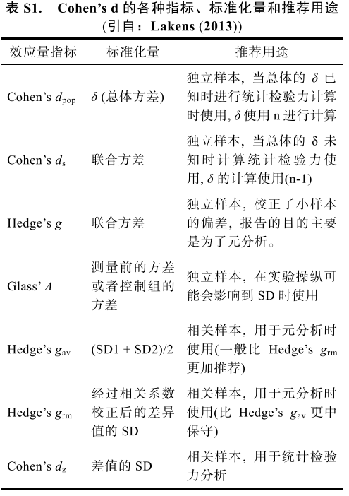
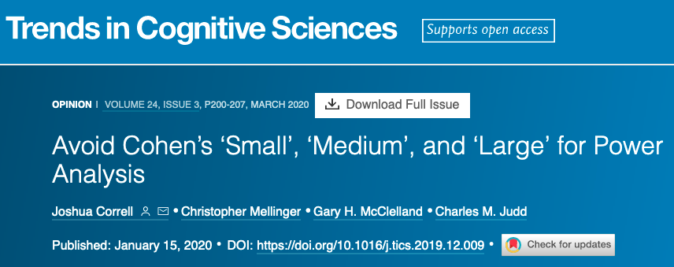
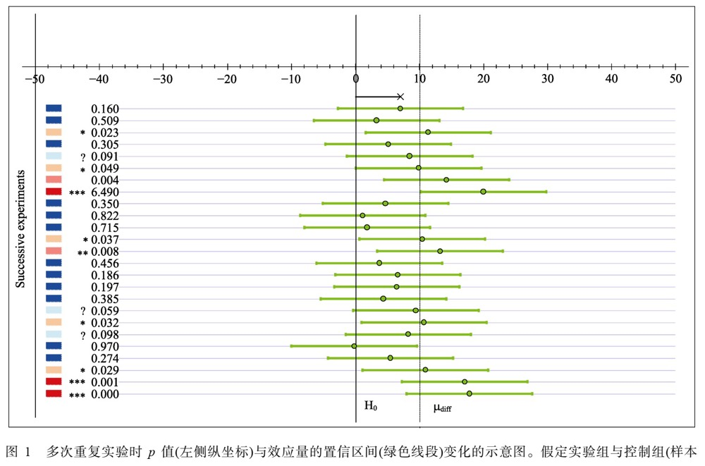
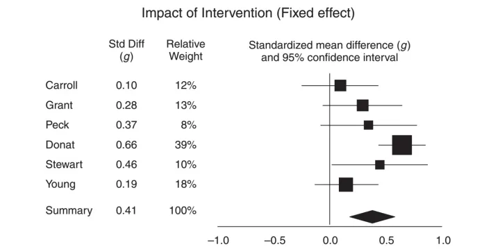
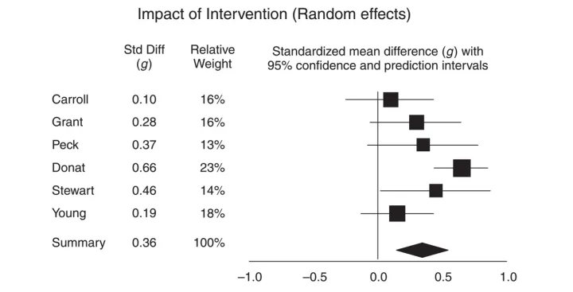

class: center, middle
<span style="font-size: 60px;">第十三章</span> <br>
<span style="font-size: 50px;">效应量和元分析 <br>

<br>
<br>
<span style="font-size: 30px;">胡传鹏</span> <br>
<span style="font-size: 30px;">2023/05/29</span> <br>

---

# <h1 lang="zh-CN">什么是效应量</h1>
**效应量**: 研究者感兴趣的任何效应的量(Cumming, 2012, Psych Sci)。<br>
<br>

标准化的效应量可以分为三大家族：<br>

- *d*-family（difference family）：如Cohen's *d*, Hedges' *g*
- *r*-family（correlation family）：如Pearson r, $R^2$, $\eta^2$, $\omega^2$, & *f*
- *OR*-family（categorical family）：如odds ratio (OR), risk ratio (RR)

---
# <h1 lang="zh-CN">什么是效应量</h1>

.center[]

- Lakens, D. (2013). Calculating and reporting effect sizes to facilitate cumulative science: A practical primer for t-tests and ANOVAs. *Frontiers in Psychology, 4*, 863.
---
# <h1 lang="zh-CN">什么是效应量</h1>

.center[]

- Lakens, D. (2013). Calculating and reporting effect sizes to facilitate cumulative science: A practical primer for t-tests and ANOVAs. *Frontiers in Psychology, 4*, 863.

---
# <h1 lang="zh-CN">效应量与置信区间</h1>

SPSS: 偏eta squared ( $\eta^{2}_{p}$ ) 
<br>

JASP: Cohen's *d*, $\eta^{2}_{p}$, $\eta^{2}_{G}$
<br>

Lakens (2013): 基于 excel 的计算程序 <br>

G\*power (Faul, et al., 2009) 可用于计算效应量, 但与SPSS输出的偏eta squared不相同, 使用时需要转换 (Lakens, 2013)
<br>

- Faul, F., Erdfelder, E., Buchner, A., & Lang, A.-G. (2009). Statistical power analyses using G\*Power 3.1: Tests for correlation and regression analyses. *Behavior Research Methods, 41*(4), 1149–1160.
- Lakens, D. (2013). Calculating and reporting effect sizes to facilitate cumulative science: A practical primer for t-tests and ANOVAs. *Frontiers in Psychology, 4*, 863.
---
# <h1 lang="zh-CN">效应量与置信区间</h1>
<br>
## 点估计与区间估计
<br>
基于估计的统计被认为是一种对虚无假设的补充, 但实际上反映了推断统计的不同取向, 最 重要的是从二分的思维方式转向量化的思维方式 (Cumming, 2012) <br>

在效应量的解读中, 没有固定的标准来判断一个效应量是大还是小。<br>

Richard, Bond, & Stokes-Zoota (2003) 对100多年来社会心理学研究中的元分析进行分析, 发现社会心理学研究中的平均效应量大约为*r* = 0.21, Cohen's *d* = 0.45。<br>

总的来说, 对效应量以及其置信区间的解读需要根据自己研究的实际情况来进行, 没有像NHST 中那样简单的二分标准(Cumming, 2012)。<br>

- Cumming, G. (2012). Understanding the new statistics: Effect sizes, confidence intervals, and meta-analysis. New York: Routledge.
- Richard, F. D., Bond, C. F., Jr., & Stokes-Zoota, J. J. (2003). One hundred years of social psychology quantitatively described. *Review of General Psychology, 7*(4), 331–363.

---
# <h1 lang="zh-CN">效应量与置信区间</h1>
<br>
## 如何解读效应量
<br>
.center[]

https://www.cell.com/trends/cognitive-sciences/fulltext/S1364-6613(19)30297-9

---
# <h1 lang="zh-CN">效应量与置信区间</h1>
.center[]

<br>
https://rpsychologist.com/d3/ci/

---

# <h1 lang="zh-CN">*t*检验中的*d*</h1>
<br>
## 基本公式: 独立样本*t*-test [Cohen's *d* for *sample*]
<br>

$$Cohen's \  d_s = \frac{X_1 - X_2}{\sqrt{SD_{pool}}} = \frac{X_1 - X_2}{\sqrt{\frac{(n_1 -1)SD_1^2 + (n_2-1)SD_2^2)}{n_1+n2-2}}}$$
## Hedges's *g*:

$$Hedges's \  g_s = Cohen's \ d_s \times (1 - \frac{3}{4(n_1 + n_2) - 9}) $$

---
# <h1 lang="zh-CN">*t*检验中的*d*</h1>
<br>

## 配对样本*t*-test: Cohen's $d_{rm}$

<br>

$$Cohen's \  d_{rm} = \frac{M_{diff}}{\sqrt{SD_1^2 + SD_2^2 -2 \times r \times SD_1 \times SD_2}} \times \sqrt{2(1-r)} $$

## 配对样本*t*-test: Cohen's $d_{av}$

$$Cohen's \  d_{av} = \sqrt{ \frac {M_{diff}} {(SD_1 + SD_2)/2}} $$
---
# <h1 lang="zh-CN">计算Cohen's *d* </h1>

```{r setup}
rm(list = ls())

# 检查是否已安装 pacman
if (!requireNamespace("pacman", quietly = TRUE)) {
  install.packages("pacman") }   # 如果未安装，则安装包

# 使用p_load来载入需要的包
pacman::p_load("tidyverse", "easystats")

# load data:
df.mt.raw <-  read.csv('./data/match/match_raw.csv',
                       header = T, sep=",", stringsAsFactors = FALSE)
```

---
# <h1 lang="zh-CN">计算Cohen's *d* </h1>
<br>
清理数据
```{r clean the data}
# from chapter 11, Chunk 3
df.mt.rt.subj <- df.mt.raw %>%
  dplyr::filter(ACC == 1 & RT > 0.2) %>%
  tidyr::extract(Shape, into = c("Valence", "Identity"),
                        regex = "(moral|immoral)(Self|Other)", remove = FALSE) %>%
  dplyr::mutate(Valence = case_when(Valence == "moral" ~ "Good",
                                    Valence == "immoral" ~ "Bad"),
                RT_ms = RT * 1000) %>%
  dplyr::mutate(Valence = factor(Valence, levels = c("Good", "Bad")),
                Identity = factor(Identity, levels = c("Self", "Other"))) %>%
  dplyr::group_by(Sub, Match, Identity, Valence) %>%
  dplyr::summarise(RT_mean = mean(RT_ms)) %>%
  dplyr::ungroup()

head(df.mt.rt.subj, 5)
```

---
# <h1 lang="zh-CN">计算Cohen's *d* </h1>
<br>
## 感兴趣的效应量: Match条件下好我与好人的平均反应时间差异
<br>

## 计算所需要的统计量：
- 每种条件下的组水平平均反应时间
- 每种条件下的组水平反应时间的SD
- 两种条件下个体水平平均反应时间的相关系数

---
# <h1 lang="zh-CN">计算Cohen's *d* </h1>

$$Cohen's \  d_{rm} = \frac{M_{diff}}{\sqrt{SD_1^2 + SD_2^2 -2 \times r \times SD_1 \times SD_2}} \times \sqrt{2(1-r)} $$

```{r prepare the data}
# from chapter 11, Chunk 3
df.mt.rt.subj.effect <- df.mt.rt.subj %>%
  dplyr::filter(Match == "match" & Valence == "Good") %>%
  dplyr::group_by(Identity) %>%
  dplyr::summarise(mean = mean(RT_mean),
                   sd = sd(RT_mean))

df.mt.rt.subj.effect.wide <- df.mt.rt.subj %>%
  dplyr::filter(Match == "match" & Valence == "Good") %>%
  tidyr::pivot_wider(names_from = "Identity", values_from = "RT_mean")

corr_est <- cor(df.mt.rt.subj.effect.wide$Self, df.mt.rt.subj.effect.wide$Other)

```

```{r calculate manually}
Cohens_d_manu <- ((df.mt.rt.subj.effect$mean[1] - df.mt.rt.subj.effect$mean[2])/sqrt(df.mt.rt.subj.effect$sd[1]**2 + df.mt.rt.subj.effect$sd[2]**2 - 2*corr_est*df.mt.rt.subj.effect$sd[1]*df.mt.rt.subj.effect$sd[2]))*sqrt(2*(1-corr_est))

```

Cohen's *d* = `r round(Cohens_d_manu, 3)`

---
# <h1 lang="zh-CN">计算Cohen's *d* </h1>
<br>

## Calculate using existing package:

```{r using effectsize}
SelfOther_diff <- t.test(df.mt.rt.subj.effect.wide$Self, df.mt.rt.subj.effect.wide$Other, paired = TRUE)

effectsize::effectsize(SelfOther_diff, paired = TRUE)

```

## Be cautious about the underlying formula!!!
---
# <h1 lang="zh-CN">元分析(meta-analysis)</h1>
<br>
### 一个研究的效应是一次采样而做出的估计
 <br>
### 理论上，对多次采样的估计量进行综合，可以得到更加准确地估计
 <br>
### 元分析是对效应量进行综合的统计方法 <br>

### 元分析需要： <br>
 - 效应量，例如相关系数*r*
 - 效应量的估计误差，其计算需要样本量*n*。
 - 样本量越大，取样误差越小，得到的效应量置信区间（95% CI）也就越精确。

---
# <h1 lang="zh-CN">元分析</h1>
传统的元分析模型通过效应值大小的变异的倒数对效应值进行加权(例如，标准误平方)来估计平均效应值。<br> 

固定效应模型： 会扩大样本量的影响，小变异的研究比那些有着大变异的研究对平均效应量的影响更大
随机效应模型： 该模型除了通过效应值大小的变异的倒数进行加权外，还考虑到研究之间的差异


---
# <h1 lang="zh-CN">元分析</h1>
元分析作为一种文章类型 <br>
 <br>
- Quintana, D. S. (2015). From pre-registration to publication: a non-technical primer for conducting a meta-analysis to synthesize correlational data. Frontiers in psychology, 1549.
---
# <h1 lang="zh-CN">元分析是HLM的特例</h1>
HLM: Hierarchical Linear Modeling <br>
元分析是只有level2的HLM <br>


---
# <h1 lang="zh-CN">元分析是HLM的特例</h1>
HLM: Hierarchical Linear Modeling <br>
Level 1: 效应量及其误差代替 <br>


---
# <h1 lang="zh-CN">元分析也是提倡预注册的</h1>


---
# <h1 lang="zh-CN">元分析步骤一</h1>
R语言中的元分析工具 <br>
- metafor (Viechtbauer, 2010) 
<br>
<br>

- Viechtbauer, W., and Cheung, M. W. L. (2010). Outlier and influence diagnostics for meta-analysis. Res. Synth. Method 1, 112–125. doi: 10.1002/jrsm.11

---
# <h1 lang="zh-CN">元分析步骤一：分析软件的选择</h1>
为了定位与检索到所有的有元分析功能的R程序包，我们进行了系统且全面的搜索。首先我们检索了warehouse R packages、the Comprehensive R Archive Network website(CRAN)和Revolution Analytics这三个网站，使用的检索词为：meta analysis、meta-analysis、systematic review。除此之外，我们还检索了Git Hub和Google Scholar，并向元分析领域的专家和开发R程序包的程序员请教。
<br>


---
# <h1 lang="zh-CN">元分析步骤一：分析软件的选择</h1>
程序包的特点 <br>


---
# <h1 lang="zh-CN">元分析步骤一：分析软件的选择</h1>
R程序包创建的年份分布


---
# <h1 lang="zh-CN">元分析步骤一：分析软件的选择</h1>
所有R元分析程序包的功能


---
# <h1 lang="zh-CN">元分析步骤一：分析软件的选择</h1>
- 在63个程序包中有11个程序包为General Meta-analytic 程序包。此组程序包与传统元分析的大部分程序相同，只适用于一般性问题，不适用于某一特定领域的问题。

- 基因和微阵列（microarray）元分析领域包含的程序包数量最多（n=16）。这些程序包都只针对特定领域，不适用于一般化的元分析，比如教育领域和社科领域。

- Multivariate Meta-Analytic Packages程序包主要是多变量元分析类型，对应用型和高级研究者可能会有帮助。该类型的程序包(n=10)共享允许使用多个协变量或结果的多变量统计过程。

- 虽然其他几个程序包的作者有具体说明可以使用他们的程序包来完成诊断性测验的精度元分析（例如metafor、mvmeta），但有5个专门为诊断元分析而设计的程序包，其中3个程序包只能完成一般的诊断元分析，另外两个程序包可以解决专门的数据问题

- 网络元分析程序包主要有三个：gemtc（van Valkenhoef & Kuiper，2014）、pcnetmeta（Lin，Zhang，2015）和netmeta（Krahn,2015)。

---
# <h1 lang="zh-CN">元分析步骤一：分析软件的选择</h1>
- 有两个程序包专门针对采用贝叶斯方法的元分析。Bamdit（Verde & Sykosch，2015）程序包能够对诊断测验的数据进行随机效应建模，计算效应值，并绘制贝叶斯ROC曲线图

- 有5个程序包用来评价出版偏倚，其中4个用来评价元分析中出版偏倚的可能性。这4个程序包分别是PubBias（Thornley，2015）、SAMURAI（Noory 2015）、selectMeta（Rufibach，2015）和WeightFunctionModel（Vevea & Coburn，2015）

- 有9个程序包是对特殊数据类型或进行元分析某一特殊方面。Compute.es (Del Re,2015a)主要用来计算6种受普遍的效应量（Cohen’s d, Hedges’g, r, Fisher’s z, odds ratio, log odds ratio）以及效应量的变异、置信区间和p值。

- 有两个程序包具有GUI 功能：MAVIS（Hamilton，Mizumoto, Aydin,&Coburn,2015）和RcmdrPlugin。

---
# <h1 lang="zh-CN">元分析步骤二：文献检索与数据收集</h1>
1. 确定适当的关键字和搜索限制，
  - 如果关键词过于狭窄，关键的文章可能被忽略。
  - 如果关键字过于宽泛，会得到大量与分析无关的文献。
2. 确定需要收集的效应量，一般是相关系数r
3. 是否包括灰色文献，比如
  - 会议摘要
  - 论文和预印本


---
# <h1 lang="zh-CN">元分析步骤二：文献检索与数据收集</h1>

- Quintana, D. S. (2015). From pre-registration to publication: a non-technical primer for conducting a meta-analysis to synthesize correlational data. Frontiers in psychology, 1549.

---
# <h1 lang="zh-CN">元分析步骤三：研究的异质性</h1>
探究总体异质性中有多少可归因于研究间的变异


---
# <h1 lang="zh-CN">元分析步骤四：森林图</h1>
森林图可视化了纳入的研究的效应量和置信区间，以及计算出的总效应量(固定效应或随机效应)


---
# <h1 lang="zh-CN">元分析步骤五：发表偏倚</h1>
具有较大影响大小的研究更有可能发表并随后被纳入荟萃分析。<br>
漏斗图是一种可视化工具，用于检查荟萃分析中潜在的发表偏倚
<br>
<br>


---
# <h1 lang="zh-CN">元分析步骤六：调节分析</h1>
可以进行调节分析以确定异质性的来源 <br>
以及这对研究之间观察到的效应量变异性的贡献程度

---
# <h1 lang="zh-CN">元分析步骤七：看不懂</h1>
Accounting for Multiple Effect Sizes from Individual Studies

---
# <h1 lang="zh-CN">元分析步骤八：数据的解释和报告</h1>

- Moher, D., Liberati, A., Tetzlaff, J., Altman, D. G., and Prisma Group. (2009). Preferred reporting items for systematic reviews and meta-analyses: the PRISMA statement. PLoS Med. 6:e1000097. doi: 10.1371/journal.pmed.1000097

---
# <h1 lang="zh-CN">元分析：简单地演示</h1>
<br>

## 将44人数据分成两部分
```{r random sample participants}

subjs <- unique(df.mt.rt.subj$Sub)

set.seed(1234)

subj_ls1 <- sample(subjs, 21)

df.mt.rt.subj.ls1 <- df.mt.rt.subj %>%
  dplyr::filter(Sub %in% subj_ls1) 

df.mt.rt.subj.ls2 <- df.mt.rt.subj %>%
  dplyr::filter(!(Sub %in% subj_ls1))

## effect size of group 1
df.mt.rt.subj.effect.ls1 <- df.mt.rt.subj.ls1 %>%
  dplyr::filter(Match == "match" & Valence == "Good") %>%
  dplyr::group_by(Identity) %>%
  dplyr::summarise(mean = mean(RT_mean),
                   sd = sd(RT_mean))

df.mt.rt.subj.effect.ls1.wide <- df.mt.rt.subj.ls1  %>%
  dplyr::filter(Match == "match" & Valence == "Good") %>%
  tidyr::pivot_wider(names_from = "Identity", values_from = "RT_mean")

corr_est.ls1 <- cor(df.mt.rt.subj.effect.ls1.wide$Self, df.mt.rt.subj.effect.ls1.wide$Other)
```

```{r old, eval=FALSE}
# set correlation = 0.7
df.mt.meta$ri <- 0.7 

escalc <- metafor::escalc(
  measure = "SMCRH",
  #standardized mean change using raw score standardization with heteroscedastic population variances at the two measurement occasions (Bonett, 2008)
  m1i = Self_RT_M_mean,
  m2i = Other_RT_M_mean,
  sd1i = Self_RT_M_sd,
  sd2i = Other_RT_M_sd,
  ni = Sample_size,
  ri = ri,
  data = df.mt.meta
  )

# aggregate the effect size estimates to the study level(same participants)
# the sampling errors within studies with a correlation of 0.6
aggregate.escalc <- escalc %>%
  dplyr::mutate(unique_ID = paste(Author, Year, Study, sep="_")) %>%
  # 每个paper的每个研究为一个cluster，换句话说，计算的是self和其他所有对象的平均差异
  metafor::aggregate.escalc(., cluster = unique_ID, rho = 0.6)
```

---
# <h1 lang="zh-CN">得到rma</h1>
```{r, eval=FALSE}
# 这个rma文件，是之后所有画图，分析的对象
# 固定效果模型
rma<- metafor::rma(yi, vi, data = df.mt.clean, 
                   slab=paste(Author, Year, Study, sep="_"))
# 随机效果模型
rma<- metafor::rma(yi, vi, data = df.mt.clean, 
                   mods = ~ Year, 
                   slab=paste(Author, Year, Study, sep="_"))
# 这里的slab是为了之后的森林图上方便显示
```

---
# <h1 lang="zh-CN">森林图表格</h1>
```{r, eval=FALSE}
fixed.pred.rma.temp <- metafor::predict.rma(rma)

fixed.pred.rma <- fixed.pred.rma.temp %>%
  dplyr::mutate(fix_yi = fixed.pred.rma.temp$pred, 
                fix_se = fixed.pred.rma.temp$se, 
                fix_ci.lb = fixed.pred.rma.temp$ci.lb, 
                fix_ci.ub = fixed.pred.rma.temp$ci.ub) %>%
  mutate(across(c(fix_yi, fix_se, fix_ci.lb, fix_ci.ub), ~ round(., 2)))
# 这一步不是必须要做。如果你想手动画森林图，
# 可以使用这一步得到森林图上每个点的点估计值和置信区间
```

为了保存之后的图片，这里写了一个保存图片的函数，用到了grDevices

```{r, eval=FALSE}
RVsave <- function(path = "./OUTPUT/RecordPlot.png", width = 8000, height = 6000, res = 1200) {
  # 保存刚刚出现的图片
  p <- grDevices::recordPlot()
  # 调整图片大小和保存位置
  grDevices::png(path, width = width, height = height, res = res)
  # 画出图片
  grDevices::replayPlot(p)
  # 保存图片
  # invisible表示不报告你保存了什么
  invisible(grDevices::dev.off())
  rm(p)
}
```

---
# <h1 lang="en">baujat plot</h1>
```{r, eval=FALSE}
baujat(rma)
```


---
# <h1 lang="en">influence plot</h1>
```{r, eval=FALSE}
inf <-influence(rma)
print(inf)
plot(inf)
```


---
# <h1 lang="zh-CN">森林图</h1>
```{r, eval=FALSE}
# Forest Plot
forest <- metafor::forest(rma)
# 由于这里生成的森林图无法直接用ggsave保存，所以写了一个保存图片的函数
RPsave(path = "../OUTPUT/Forest.png")
```


---
# <h1 lang="zh-CN">敏感度分析</h1>
```{r , eval=FALSE}
leaveout <-  metafor::leave1out(rma)
# 你也可以手动移除你想移除的研究，看看对整个元分析的效应有什么影响
write.csv(leaveout, "../OUTPUT/One_Study_Removed.csv")
```


---
# <h1 lang="zh-CN">漏斗图</h1>
```{r, eval=FALSE}
# Funnel  Plot
funnel <- metafor::funnel(rma)

RPsave(path = "../OUTPUT/Funnel.png")
```


---
# <h1 lang="zh-CN">其他可视化工具</h1>
```{r, eval=FALSE}
# install.packages("metaviz")
metaviz_forest <- viz_forest(x = mozart[1:10, c("d", "se")], study_labels = mozart[1:10, c("study_name")],
                             summary_label = "Summary effect", xlab = "Cohen d")

RPsave(path = "../OUTPUT/metaviz_forest.png")
```


---
# <h1 lang="zh-CN">其他可视化工具</h1>
```{r, eval=FALSE}
metaviz_funnel <- viz_sunset(rma, 
                             contours = TRUE,
                             power_contours =  "continuous")

RPsave(path = "../OUTPUT/metaviz_funnel.png")
```


---
# <h1 lang="zh-CN">元分析的局限性</h1>
- 当前研究的局限之一是我们只对进行元分析的统计软件进行综述，而没有对可能用于进行系统评价和提取元分析数据的软件进行综述。
- 元分析是一个系统搜索文献的结果，这一过程包含了大量的数据管理。R程序包在数据管理过程中是一个有用的工具，但目前我们还没有任何R程序包可以彻底解决这个问题。
- 在理想情况下，程序包对管理系统评价和元分析的每一个步骤都有很大的作用，所以该领域在发展发展中是一个值得关注的。
- 此外，鉴于开源项目的本质，在我们完成搜索、收集和编码程序包之后，可以创建更多的程序包，丰富程序包的功能。

---
# <h1 lang="zh-CN">元分析的展望</h1>
1. 建议程序包的作者可以考虑创建GUI，或者为他们的程序包提供至少一个演示操作，现在已经有一些程序包为用户提供了非常好的示例（如 metafor, metaARRAY, metaMA,和 metaSEM）
2. R程序包仍然缺少元分析的统计功效估计的功能。具有这个功能的程序包还很少，而且，目前还没有对调节变量进行统计功效分析的程序包
3. 建议作者完善元分析程序包制图功能的易操作性，因为目来说使用者细化图形是非常困难的
4. 程序包的作者应该尽力向初级使用者报告程序包的关键信息，即用户是否能够计算固定效应模型或随机效应模型

---
# <h1 lang="zh-CN">参考资料</h1>
https://zhuanlan.zhihu.com/p/47849067 <br>
https://zhuanlan.zhihu.com/p/60528092 <br>
https://doi.org/10.3389/fpsyg.2015.01549 <br>
<br>
https://chat.openai.com/ <br>
---