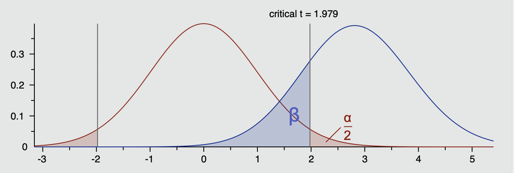
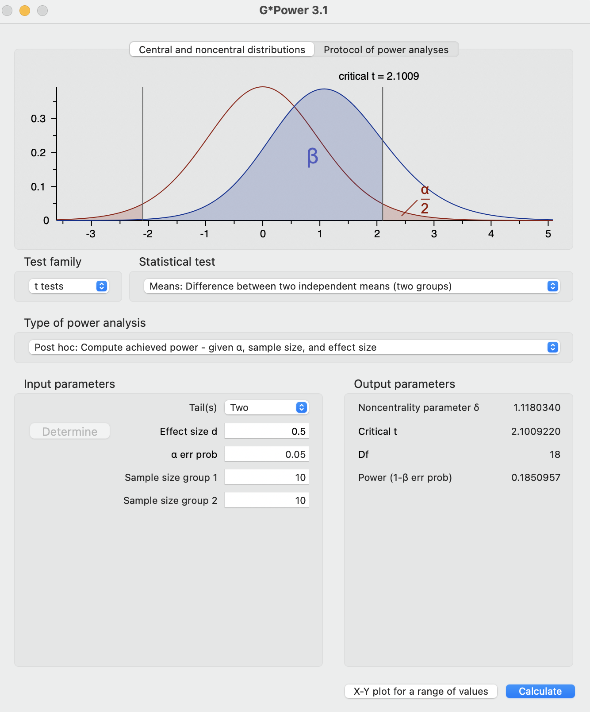
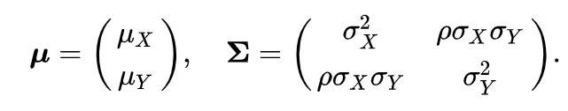
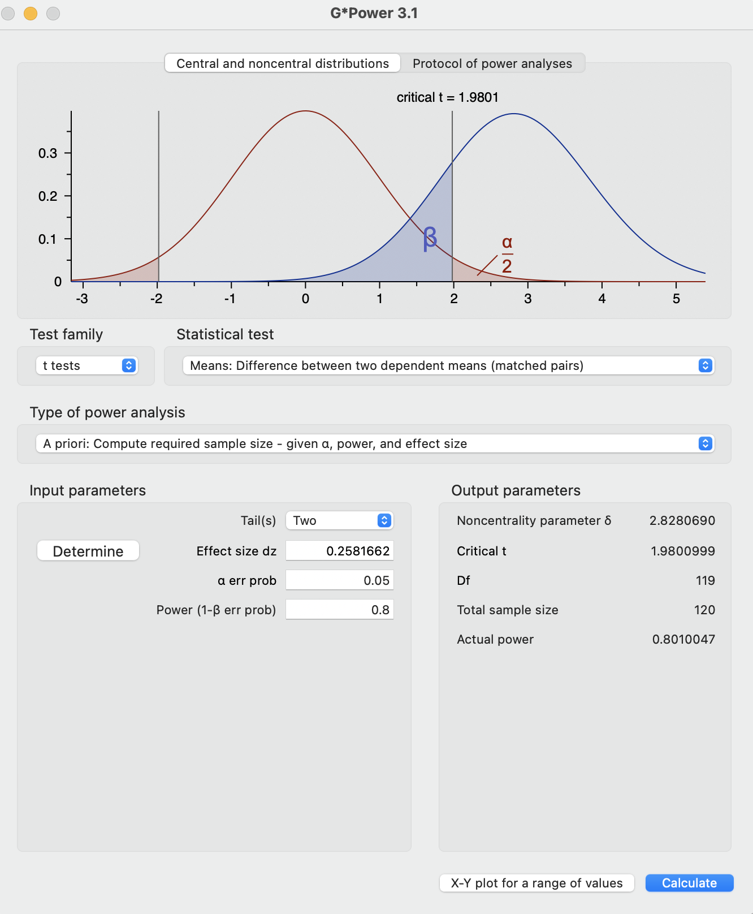

class: center, middle
<span style="font-size: 60px;">第十四章</span> <br>
<span style="font-size: 50px;">统计检验力分析 <br>

<br>
<br>
<span style="font-size: 30px;">胡传鹏</span> <br>
<span style="font-size: 30px;">2023/06/05</span> <br>

---

# <h1 lang="zh-CN">什么是统计检验力</h1>
**统计检验力（统计功效, statistical power）**: 假设检验中正确拒绝虚无假设的概率。<br>
<br>
$1 - \beta = P(sig \ | \ H_1)$
<br>
.center[]

---

统计检验力主要由三个因素决定：<br>

- 效应量(effect size)
- 一类错误率(Type 1 error, $\alpha$)
- 样本量(sample size)

效应量、一类错误率、效应量越大，统计功检验力越高；相反则更低。

---
# <h1 lang="zh-CN">其他统计量与统计检验力的关系——以单样本*t*检验为例</h1>
---
## <h2 lang="zh-CN">效应量与统计检验力的关系——以单样本*t*检验为例</h2>

在本次模拟中，样本量固定为$ n = 20$，一类错误率固定为$\alpha = 0.05$

```{r setup}
rm(list = ls())
if (!requireNamespace("pacman", quietly = TRUE)) {
  install.packages("pacman") }             # 检查是否已安装 pacman, 如果未安装，则安装包

pacman::p_load("tidyverse", "faux", "pwr", "MASS", "afex") # 使用p_load来载入需要的包
```

```{r illustrate effect size and power}

effect_size <- seq(0.1, 1, 0.1) # 生成10个效应量，从0.1到1，间隔为0.1

len_power <- length(effect_size) # 获取生成效应量的长度，即10

idx <- 0 # 设置一个idx变量作为标识符，后续用于定位

power <- numeric(len_power) # 生成与len_power长度一致的0，便于后续修改

for (i in effect_size) {     # 遍历所有的效应量
  p <- numeric(5000)        # 生成5000个长度的列表，用于储存p值
  idx <- idx + 1             # 每运行一次for循环，idx就加1
  for (j in 1:5000) { 
    # 在遍历效应量的基础上运行5000次计算p值，用于后续计算power
    # 生成20个服从均值为某一效应量，标准差为1的正态分布的样本
    x <- rnorm(n = 20, mean = i, sd = 1) 
    p[j] <- t.test(x)$p.value # 储存p值
  }
  
  power[idx] <- sum(p < 0.05) / 5000 # 计算p值小于0.05的个数并除5000计算power
}

df_sim1 <- data.frame(effect_size = effect_size, power = power)
```

---

```{r plot effect size and power}

df_sim1 %>%
  ggplot2::ggplot(aes(x = effect_size, y = power)) + 
  ggplot2::geom_point(size = 5) +
  ggplot2::geom_line() +
  ggplot2::labs(title = "Fixed sample size and alpha value",
                x = "Effect size (Cohen's d)",
                y = "Statistical power") + 
  papaja::theme_apa()

```

---

有许多R包可用于计算统计检验力，如`pwr`

```{r example of pwr}
pwr.t.test(
  n = 20, d = 0.2, sig.level = 0.05,
  type = "one.sample", alternative = "two.sided"
)[["power"]]
```

---

可以使用map函数结合`pwr`来计算不同效应量下的统计检验力

```{r warning=FALSE}
map_dbl(effect_size, ~ pwr.t.test(
  n = 20, d = .x,
  sig.level = 0.05,
  type = "one.sample",
  alternative = "two.sided"
)[["power"]])
```

---

## <h2 lang="zh-CN"> $\alpha$与统计检验力的关系 </h2>
在本次模拟中，样本量固定为20，效应量固定为0.5

```{r illustrate alpha and power}

alpha <- c(0.001, 0.01, 0.05, 0.1) # 生成5个alpha值
len_alpha <- length(alpha)         # 获取生成alpha向量的长度，即5

idx <- 0 # 设置一个idx变量作为标识符，后续用于定位

power <- numeric(len_alpha) # 生成与len_alpha长度一致的0，便于后续修改

for (i in alpha) {      # 遍历所有的效应量
  p <- numeric(5000)   # 生成5000个长度的列表，用于储存p值
  idx <- idx + 1        # 每运行一次for循环，idx就加1
  for (j in 1:5000) { 
    # 在遍历效应量的基础上运行5000次计算p值，用于后续计算power
    x <- rnorm(n = 20, mean = 0.5, sd = 1) 
    # 生成20个服从均值为某一效应量，标准差为1的正态分布的样本
    p[j] <- t.test(x)$p.value # 储存p值
  }
  power[idx] <- sum(p < i) / 5000 # 计算p值小于alpha的个数并除5000计算power
}

df_sim2 <- data.frame(alpha = alpha, power = power)
```

---

```{r plot alpha and power}
df_sim2 %>%
  ggplot2::ggplot(aes(x = alpha, y = power)) + 
  ggplot2::geom_point(size = 5) +
  ggplot2::geom_line() +
  ggplot2::labs(title = "Fixed sample size and effect size",
                x = "alpha",
                y = "Statistical power") + 
  papaja::theme_apa()
```

---
```{r}
map_dbl(alpha, ~ pwr.t.test(
  n = 20, d = 0.5,
  sig.level = .x,
  type = "one.sample",
  alternative = "two.sided"
)[["power"]])
```

---
## <h2 lang="zh-CN">样本量与统计检验力的关系</h2>

```{r}
sample_size <- seq(10, 100, 10)
# 生成10个效应量，从0.1到1，间隔为0.1
len_n <- length(sample_size) # 获取生成效应量的长度，即10
idx <- 0 # 设置一个idx变量作为标识符，后续用于定位
power <- numeric(len_n) # 生成与len_n长度一致的0，便于后续修改
for (i in sample_size) { # 遍历所有的效应量
  p <- numeric(5000) # 生成5000个长度的列表，用于储存p值
  idx <- idx + 1 # 每运行一次for循环，idx就加1
  # 在遍历效应量的基础上运行5000次计算p值，用于后续计算power
  for (j in 1:5000) { 
    x <- rnorm(n = i, mean = 0.5, sd = 1) 
    # 生成20个服从均值为某一效应量，标准差为1的正态分布的样本
    p[j] <- t.test(x)$p.value # 储存p值
  }
# 计算p值小于0.05的个数并除5000计算power
  power[idx] <- sum(p < 0.05) / 5000 
}

df_sim3 <- data.frame(sample_size = sample_size, power = power)
```

---

```{r plot sample size and power}
df_sim3 %>%
  ggplot2::ggplot(aes(x = sample_size, y = power)) + 
  ggplot2::geom_point(size = 5) +
  ggplot2::geom_line() +
  ggplot2::labs(title = "Fixed effect size and alpha",
                x = "Sample size",
                y = "Statistical power") + 
  papaja::theme_apa()
```

---

```{r}
map_dbl(sample_size, ~ pwr.t.test(
  n = .x, d = 0.5,
  sig.level = 0.05,
  type = "one.sample",
  alternative = "two.sided"
)[["power"]])
```

---
# <h1 lang="zh-CN">G*Power中的结果是如何计算的</h1>

在使用G\*Power时，我们通常需要在软件中填写两组之间的差异Cohen's *d*（如 Cohen's *d* = 0.5）。

假设我们有两组被试分别进行了某些测验，每组共10名被试，两组被试的均值分别为0.5和0，标准差为1。通过之前课程学习到的计算*d*的公式：

$$Cohen's \  d_s = \frac{X_1 - X_2}{\sqrt{SD_{pool}}} = \frac{X_1 - X_2}{\sqrt{\frac{(n_1 -1)SD_1^2 + (n_2-1)SD_2^2)}{n_1+n2-2}}}$$

我们可以计算出*d*为：
$$Cohen's \  d_s = \frac{0.5 - 0}{\sqrt{\frac{(10 -1)1^2 + (10-1)1^2)}{10+10-2}}}=0.5$$
---

代码实现：

```{r}
n1 <- 10
n2 <- 10
m1 <- 0.5
m2 <- 0
sd1 <- 1
sd2 <- 1
group1 <- rnorm(n1, m1, sd1) # 生成n1个，以m1为均值，sd1位标准差服从正态分布的样本
group2 <- rnorm(n2, m2, sd2)
print(group1)
print(group2)
```

---
*t*检验结果显示，未达到统计学意义上的显著性水平

```{r}
t.test(group1, group2)
```

---

为了进行统计检验力分析，我们需要模拟很多次并观察是否每次在给定效应量和一类错误率时的显著性水平。我们以传统上80%的统计检验力为标准，对比当前模拟的结果。

```{r}
sim <- 5000 # 进行5000次模拟
n1 <- 10
n2 <- 10
m1 <- 0.5
m2 <- 0
sd1 <- 1
sd2 <- 1
pvals <- c()
cohen_ds <- c()

for (i in 1:sim) {
  group1 <- rnorm(n1, m1, sd1)
  group2 <- rnorm(n2, m2, sd2)

  pvals[i] <- t.test(group1, group2)$p.value
  
  cohen_ds[i] <- (mean(group1)-mean(group2))/
    (sqrt(((n1-1)*sd(group1)^2 + (n2-1) * sd(group2)^2) / 
            (n1+n2-2)))
}
```

---
可以看到，这里我们的统计检验力只有：

```{r}
sum(pvals < 0.05) / sim
mean(cohen_ds)
```

---

与pwr包对比

```{r}
pwr.t.test(n = 10, d = 0.5, sig.level = 0.05, type = "two.sample")
```

---
与G*Power对比

.center[]
---

可以看到模拟的结果与其他两个工具包/软件的结果很相似。

---

接下来我们可以改进一下代码，在给定效应量，和一类错误水平的情况下，被试数量到达多少时，统计检验力达到80%。

**sample size planning?**

```{r}
sim <- 5000 # 模拟次数为5000
power <- c() # 储存power值
d_mean <- c() # 储存效应量
n1 <- 10 # 第一组被试初识数量为10名
n2 <- 10
m1 <- 0.5
m2 <- 0
sd1 <- 1
sd2 <- 1
increase_num <- 0 # 从0开始计算power，即从每组10人开始计算
```

---

```{r}
for (i in 1:5000000) { # for循环给定一个极大的数进行遍历
  pvals <- c()          # 储存后续每一次模拟的p值
  cohen_ds <- c()       # 储存每一次模拟的d值
  for (j in 1:sim) {    # 开始对每一个组数量进行模拟
    group1 <- rnorm(n1, m1, sd1)
    group2 <- rnorm(n2, m2, sd2)
    pvals[j] <- t.test(group1, group2)$p.value
    cohen_ds[j] <- (mean(group1) - mean(group2)) / (sqrt(((n1 - 1) * sd(group1)^2 + (n2 - 1) * sd(group2)^2) / (n1 + n2 - 2)))
  }
  power[increase_num + 1] <- sum(pvals < 0.05) / sim # 储存power值，由于无法添加索引0的值，所以先加1
  d_mean[increase_num + 1] <- mean(cohen_ds)
  n1 <- n1 + 1  # 每次计算完power后，对每组加1
  n2 <- n2 + 1
  if (power[increase_num + 1] >= 0.8) {
    break      # 当power达到0.8时停止运行
  }
  increase_num <- increase_num + 1                  # 增加的被试加1
}

```

---
统计检验力随着样本量增加的变化

```{r}
plot(10:(increase_num + 10), power, 
     xlab = "Number of subjects each group", 
     ylab = "power", ylim = c(0, 1.0))
abline(h = 0.8, col = "red")
```

---

效应量随着样本量增加的变化(?)

```{r}
plot(10:(increase_num + 10), d_mean, 
     xlab = "Number of subjects each group", 
     ylab = "Cohen's d", ylim = c(0.2, 0.8))
abline(h = 0.5, col = "red")
```

---

模拟达到80%统计检验力所需要的样本数量为每组：

```{r}
print(10 + increase_num)
```

与G*Power对比：
.center[]

---

## <h2 lang="zh-CN">生成前后测数据——配对样本*t*检验</h2>

前后测数据通常之间存在一定程度的相关

为了生成前后测数据，我们可以通过`MASS`包中的`mvrnorm()`函数生成。

首先我们设定被试数量为100，前测的均值为0，后测均值为1，标准差均为1，两次测量结果的相关为0.3。

```{r}
n <- 100
test1_mean <- 0
test2_mean <- 1
test1_sd <- 1
test2_sd <- 1
rho <- 0.3
```

---
然后，我们根据公式生成一个方差协方差矩阵
.center[]

- https://en.wikipedia.org/wiki/Multivariate_normal_distribution

---
代码实现：

```{r warning=TRUE}
sigma <- matrix(c(test1_sd^2, test1_sd * test2_sd * rho, 
                  test1_sd * test2_sd * rho, test2_sd^2), 
                ncol = 2)

df <- data.frame(mvrnorm(
  n = n, mu = c(test1_mean, test2_mean),
  Sigma = sigma
))
head(df)
```

---
我们可以简单检查一下模拟结果:

```{r}
cor(df$X1, df$X2)
mean(df$X1)
mean(df$X2)
```

---
最后，我们可以根据计算cohen'd的公式确定一下配对数据的效应量，然后进行统计检验力分析，这里与G*Power一致采用：

 
$$Cohen's d_{z} = \frac{M_{diff}}{SD_{diff}}$$

```{r}
library(MASS)
sim <- 1000 # 模拟次数为5000

power <- c() # 储存power值
d_mean <- c()
cor_mean <- c()
n <- 10 # 第一组被试初识数量为10名
m1 <- 10
m2 <- 10.5
sd1 <- 1
sd2 <- 2
rho <- 0.3
increase_num <- 0 # 从0开始计算power，即从每组10人开始计算
```

---

```{r}
for (i in 1:500000) { # for循环给定一个极大的数进行遍历
  pvals <- c() # 储存后续每一次模拟的p值
  ds <- c()
  cors <- c()
  for (j in 1:sim) { # 开始对每一个组数量进行模拟
    sigma <- matrix(c(sd1^2, sd1 * sd2 * rho, 
                      sd1 * sd2 * rho, sd2^2), 
                    ncol = 2)
    df <- data.frame(mvrnorm(
      n = n, mu = c(m1, m2),
      Sigma = sigma
    ))
    pvals[j] <- t.test(df$X1, df$X2, paired = TRUE)$p.value
    ds <- (mean(df$X1) - mean(df$X2)) / sd(df$X1 - df$X2)
    cors[j] <- cor(df$X1, df$X2)
  }
  power[increase_num + 1] <- sum(pvals < 0.05) / sim 
  d_mean[increase_num + 1] <- mean(ds)
  cor_mean[increase_num + 1] <- mean(cors)
  n <- n + 1 # 每次计算完power后，对每组加1
  if (power[increase_num + 1] >= 0.8) {
    break # 当power达到0.8时停止运行
  }
  increase_num <- increase_num + 1 # 增加的被试加1
}
```

---

```{r}
plot(10:(increase_num + 10), power, 
     xlab = "Number of subjects", 
     ylab = "power", ylim = c(0, 1.0))
abline(h = 0.8, col = "red")

```

---

```{r}
plot(x = 10:(increase_num + 10), 
     y = cor_mean, ylim = c(0, 0.6), 
     ylab = "correlation", 
     xlab = "Number of subjects")
```

---

总共需要样本量为：

```{r}
print(10 + increase_num)
```

---

与G*Power对比：
- 首先先生成一个拥有相同参数的很大样本量的数据，用于计算总体水平的Cohen's dz，并将该值输入到G*Power中

```{r}
set.seed(124)
n <- 500000 # 第一组被试初识数量为10名
m1 <- 10
m2 <- 10.5
sd1 <- 1
sd2 <- 2
rho <- 0.3

sigma <- matrix(c(sd1^2, sd1 * sd2 * rho,
                  sd1 * sd2 * rho, sd2^2), 
                ncol = 2)

df <- data.frame(mvrnorm(
  n = n, mu = c(m1, m2),
  Sigma = sigma
))

dz <- (mean(df$X1) - mean(df$X2)) / sd(df$X1 - df$X2)
print(dz)
```

---

.center[]

---

# <h1 lang="zh-CN">如何计划分析方法：以ANOVA为例</h1>

---

## <h2 lang="zh-CN">生成假数据</h2>
在规划样本量时通常使用G\*Power进行先验统计检验力分析 (*a-priori* power analysis)。使用使用工具进行先验统计检验力分析非常方便，但是灵活性不高。在进行更复杂的检验时，我们可以使用前面使用过模拟的方式进行。

假设我们要进行一个2\*2被试内设计的实验，根据前人的研究我们设定groupA和groupB的四个水平的均值分别为A1B1 = 100, A1B2 = 80, A2B1 = 200, A2B2 = 250。

并且，我们主要关注和检验groupA和groupB的交互作用
---

### <h3 lang="zh-CN">代码实现</h3>
使用`faux`包生成2*2被试内的模拟数据

---

```{r}
df_aov <- sim_design(
  n = 50, # 生成50名被试
  within = list(groupA = c("A1", "A2"), groupB = c("B1", "B2")), # 生成被试内因子的列表
  
  mu = c(100, 80, 200, 250), # 设置变量的均值
  
  sd = c(A1 = 20, A2 = 10, B1 = 50, B2 = 90), # 设置变量的标准差
  
  long = TRUE,  # 输出长数据形式
  
  dv = "score", # 因变量命名为score
  plot = TRUE   # 显示图
)
head(df_aov)
```

---

### <h3 lang="zh-CN">检查数据</h3>
我们检查一下模拟生成的数据

```{r}
df_aov %>%
  group_by(groupA, groupB) %>%
  summarise(
    m = mean(score),
    sd = sd(score)
  )
```

---
### <h3 lang="zh-CN">计算交互项p值</h3>

使用`afex`包对数据进行重复测量方差分析，并输出交互项的*p*值

```{r}
aov <- aov_ez(id = "id", dv = "score", within = c("groupA", "groupB"), data = df_aov)
aov
aov[["anova_table"]][["Pr(>F)"]][3]
```

```{r}
aov[["anova_table"]][["Pr(>F)"]][3]
```

---
## <h2 lang="zh-CN">基于模拟的统计检验力分析</h2>
进行统计检验力分析

```{r}
sim <- 1000        # 模拟次数为1000

power <- c()       # 储存power值
n <- 5             # 第一组被试初识数量为10名
increase_num <- 0  # 从0开始计算power，即从每组10人开始计算
```

---

```{r}
for (i in 1:5000000) {  # for循环给定一个极大的数进行遍历
  pvals <- c()          # 储存后续每一次模拟的p值
  for (j in 1:sim) {    # 开始对每一个组数量进行模拟
    df_aov <- sim_design(
      n = n, 
      within = list(groupA = c("A1", "A2"), groupB = c("B1", "B2")),
      mu = c(100, 80, 200, 250),
      sd = c(A1 = 20, A2 = 10, B1 = 50, B2 = 90),
      long = TRUE,
      dv = "score",
      plot = FALSE 
    )
    aov <- aov_ez(id = "id", dv = "score", within = c("groupA", "groupB"), data = df_aov)
    pvals[j] <- aov[["anova_table"]][["Pr(>F)"]][3]
  }
  power[increase_num + 1] <- sum(pvals < 0.05) / sim 
  n <- n + 1 # 每次计算完power后，对每组加1
  if (power[increase_num + 1] >= 0.8) {
    break   # 当power达到0.8时停止运行
  }
  increase_num <- increase_num + 1 # 增加的被试加1
}
```

---

```{r}
plot(5:(increase_num + 5), power, 
     xlab = "Number of subjects", 
     ylab = "power", ylim = c(0, 1.0))
abline(h = 0.8, col = "red")
```

---
我们一共需要的样本量为：

```{r}
print(5 + increase_num)
```

---
# <h1 lang="zh-CN">统计检验力分析小结</h1>

- 效应量、一类错误率、样本量在控制其他因素的情况下越大，统计检验力越高

- 可以通过模拟进行样本量规划

- 明确感兴趣的效应是进行统计检验力分析的重要步骤

---

# <h1 lang="zh-CN">推荐阅读</h1>
- Daniël Lakens; Sample Size Justification. *Collabra: Psychology* 5 January 2022; 8 (1): 33267. doi: https://doi.org/10.1525/collabra.33267
- DeBruine LM, Barr DJ. Understanding Mixed-Effects Models Through Data Simulation. *Advances in Methods and Practices in Psychological Science*. 2021;4(1). doi:10.1177/2515245920965119

