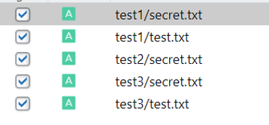
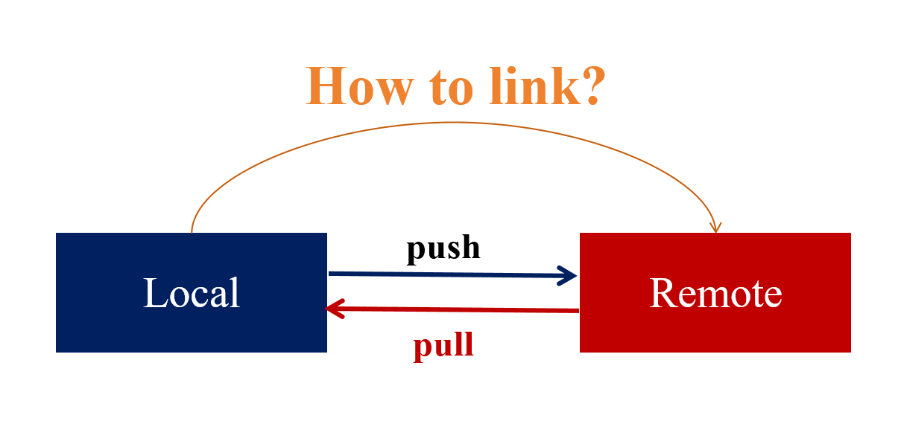
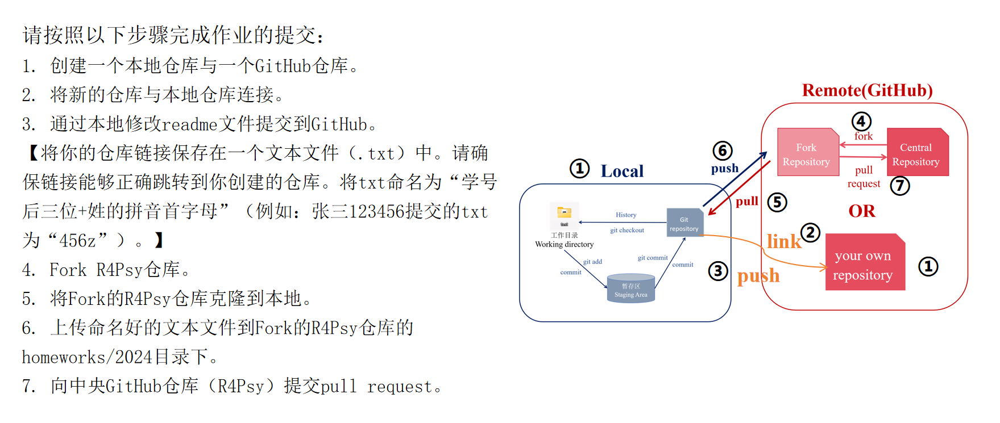

class: center, middle
第三讲  
 Git & R Studio工作流  
版本控制  
 
 
胡传鹏  
2024/03/10  
 
 
 
 
Reference:  
Vuorre, M., & Curley, J. P. (2018). Curating research assets: A tutorial on the Git version control system. Advances in Methods and Practices in Psychological Science, 1(2), 219-236.
---
 
 
<h1 lang="en" style="font-size: 60px;">Contents</h1>
 
 
 
 
Goal of Chp 3
  
3.1 Files and Folders System
  
3.2 Git and GitHub
  
3.3 Local Version Control
  
3.4 Remote Version Control
  
 

---
## <h1 lang="en">Goal of Chp 3</h1> 
 
  

---
 
 
 
 
3.1 Files and Folders System
  
 
 - 3.1.1 Why  
 - 3.1.2 How to improve  
 - 3.1.3 Recommended Structure  

---
## <h1 lang="en">3.1.1 Why</h1> 
 
  
 
---
## <h1 lang="en">3.1.2 How to improve</h1> 

- 制定一定的命名规则；
- 创建清晰的层级结构，并且使用文件夹分类；
- 定期清理和维护；
- ……
 
---
## <h1 lang="en">3.1.3 Recommended Structure</h1> 
 
- 1_Protocol  
- 2_Literature_Search  
- 3_Article_Screen  
- 4_Data_Extraction  
- 5_Analysis  
- 6_Reports  
 
- .git  
- .gitignore  
- README.md(.txt)  
 
 
 
 
Reference:  
[https://psych-transparency-guide.uni-koeln.de/folder-structure.html](https://psych-transparency-guide.uni-koeln.de/folder-structure.html)

---
## <h1 lang="en">Reminder</h1> 
 
  
- 不要让你的文件夹外部看起来非常整洁  
- 但当打开几个文件夹后，内部文件的存放毫无逻辑  

---
 
 
 
 
3.2 Git and GitHub
  
 
- 3.2.1 Version Control  
- 3.2.2 Git  
- 3.2.3 GitHub  

---
## <h1 lang="en">3.2.1 Version Control</h1> 

- 版本控制(Version Control)是一种管理文件修改历史的系统，特别是用于源代码管理。通常可以分为本地版本控制与远程版本控制两大类。  
- 本地版本控制系统主要在用户的个人计算机上运行，管理和跟踪文件或项目的历史版本。它允许用户在自己的设备上回退到旧版本、比较文件改动、恢复丢失的文件等，而不依赖于网络连接。  
- 远程版本控制系统则侧重于团队协作和共享资源，通常依托于服务器或云服务。它允许多个用户或团队成员在共同的项目上工作，管理和合并彼此的贡献，同时保持项目的同步和一致性。  

---
## <h1 lang="en">3.2.2 Git</h1> 

  
- Git是目前最常用的免费开源的版本控制的工具。  
- 首先，我们要下载Git(https://git-scm.com/downloads)。  

---
## <h1 lang="en">3.2.2 Git</h1> 

- Git支持多种运行模式，主要通过两个途径：终端（Terminal）和图形用户界面（GUI Panel）。  
- 终端途径提供了全面的功能访问权限，适用于各种命令行界面，包括Git Bash、CMD、R Terminal等。这种方式允许用户执行复杂的Git命令和操作，适合需要深度控制和定制Git工作流的场景。 
- 图形用户界面（GUI Panel）则提供了更为直观的操作方式，用户只需通过点击即可完成操作，但这种方式可能不支持某些高级功能。这类界面包括R Studio中的Git面板和GitHub Desktop等，它们适合那些偏好图形界面或不需要执行复杂Git命令的用户。 

---
## <h1 lang="en">3.2.3 GitHub</h1> 

- GitHub是全球最大的开源的在线软件源代码托管服务平台，使用Git作为版本控制软件。  
- 在2018年，GitHub被微软公司收购。潜在的平替平台：Gitee, GitLab, Bitbucket。  
- 注册一个GitHub账号( https://github.com )。 
- ~~使用科学上网工具时较为稳定，推荐使用outlook, gmail, icloud, hotmail, yahoo等"你懂的"邮箱~~

---
## <h1 lang="en">3.2.3 GitHub</h1> 
    
  
- 以下将简单介绍GitHub的基本操作。 
- 使用GitHub创建仓库：在自己的用户界面找到repository，点击new。  

---
## <h1 lang="en">3.2.3 GitHub</h1> 
 
  
- 设定一个repository的名字，创建README文件，然后点击create repository。 

---
## <h1 lang="en">3.2.3 GitHub</h1> 

- README文件是位于项目根目录中的文本文件（通常为README.md、README.txt等），提供了关于项目的基本信息。  
- 基于Markdown语法，图中为常见的使用情况。  
- 本课的PPT由xaringan包生成，R Markdown，在Markdown的基础上进行扩展。  

---
## <h1 lang="en">3.2.3 GitHub</h1> 
 
  
 - Commit:向GitHub提交更改。  

---
## <h1 lang="en">3.2.3 GitHub</h1> 
 
  
 - History:查看历史版本。  

---
## <h1 lang="en">3.2.3 GitHub</h1> 
 
  
- Fork:复制一个已存在的代码仓库到自己的账户下,允许在不影响原始仓库的情况下自由地开发和修改代码。 

---
## <h1 lang="en">3.2.3 GitHub</h1> 
 
 

  
- Pull request:通知机制，告诉项目的维护者你已经完成了一段代码的修改并推送到了一个仓库。 

---
 
 
 
 
3.3 Local Version Control
  
 
- 3.3.1 Local Version Control  
- 3.3.2 Creating Git repository for project  
- 3.3.3 Adding files to Git  
- 3.3.4 Keeping track of changes with Git  
- 3.3.5 Accessing files’ past versions  
- 3.3.6 Telling Git to ignore files  

---
## <h1 lang="en">3.3.1 Local Version Control</h1> 
 
  

---
## <h1 lang="en">3.3.2 Creating Git repository for project</h1> 
 
  
- 在R Studio中创建一个本地的新项目，并创建其Git repository。  

---
## <h1 lang="en">3.3.3 Adding files to Git</h1> 
 
  
- 默认情况下，R Studio中Git位于右上角的子窗口。  
- 点击commit，会跳出Git面板。  

---
## <h1 lang="en">3.3.3 Adding files to Git</h1> 
 
  
- 勾选更新的文件，向Git repository提交更改。  

---
## <h1 lang="en">3.3.3 Adding files to Git</h1> 
 
  
- 提交更改时不要忘记填写commit message，否则会报错。  

---
## <h1 lang="en">3.3.3 Adding files to Git</h1> 
 
  
- 正常提交更改后会弹出如图所示的窗口。  

---
## <h1 lang="en">3.3.3 Adding files to Git</h1> 

- 在R Studio中创建一个readme.txt文件（File->New File->Text File），重复上述步骤。  

---
## <h1 lang="en">3.3.4 Keeping track of changes with Git</h1> 
 
  
- 修改readme文件并提交，Git面板中会出现前后内容的比较。  

---
## <h1 lang="en">3.3.5 Accessing files’ past versions</h1> 

  
- 点击Git面板中的History按钮，会弹出一个列出了所有的提交历史的窗口。  
- 点击任何一个提交，查看该提交的详细信息，包括具体的更改内容。  

---
## <h1 lang="en">3.3.6 Telling Git to ignore files</h1> 

  
- 在R Studio右下角的子窗口Files处点击‘.gitignore’。  

---
## <h1 lang="en">3.3.6 Telling Git to ignore files</h1> 

  
- 修改‘.gitignore’，向Git repository提交修改。  
- 图中的修改分别表示忽略test1整个文件夹、忽略test2文件夹中所有.txt文件、忽略test3文件夹中的secret.txt。 

---
## <h1 lang="en">3.3.6 Telling Git to ignore files</h1> 

- 上面的表格总结了修改.gitignore的常用语法，供参考。  
- 在.gitignore文件中规则按顺序执行，后面的规则可以覆盖前面的规则。 

---
## <h1 lang="en">3.3.6 Telling Git to ignore files</h1> 

- 关闭R Studio，在test文件夹中创建3个子文件夹，test1、test2、test3。  
- 每个子文件夹中都包括‘test.txt’,‘secret.txt’两个文件。 

---
## <h1 lang="en">3.3.6 Telling Git to ignore files</h1> 
  
  
- R Studio右上角的子窗口应该只存在如图所示的更改，其他修改都被Git忽略。  

---
## <h1 lang="en">3.3.6 Telling Git to ignore files</h1> 
  
  
- 但有时候事情并不会那么顺利，如图所示，Git并没有如预期那样忽略指定的文件。  
- 出现了bug。 

---
## <h1 lang="en">3.3.6 Telling Git to ignore files</h1> 

- 请保持冷静，跟随以下步骤来进行debug：  
- 是不是先添加的文件后修改的gitignore？那么文件可能已被Git跟踪，存在缓存，仅修改gitignore是不够的。可以尝试在左下角子窗口的Terminal下输入git rm --cached -r <目录名>/git rm --cached <文件名>这个命令。 
- 不存在缓存问题？请检查一下.gitignore中是否存在语法错误。 
- 都不存在？在Terminal输入git check-ignore -v .gitignore检查.gitignore文件是否被Git忽略。如果命令没有任何输出，这意味着 .gitignore 是有效的并被 Git 正确处理。 
- ……

---
 
 
 
 
3.4 Remote Version Control
  
 
- 3.4.1 Remote Version Control  
- 3.4.2 linking GitHub repository with a local Git repository  
- 3.4.3 Fork GitHub repository  
- 3.4.4 Push changes to GitHub repository  
- 3.4.5 Pull changes from GitHub repository  
- 3.4.6 Pull request to central GitHub repository  

---
## <h1 lang="en">3.4.1 Remote Version Control</h1> 
  
  

---
## <h1 lang="en">3.4.2 linking GitHub repository with a local Git repository</h1> 

- 有两种方法，将现有本地Git repository连接到新创建的远程GitHub repository(Method 1); 
- 或从远程GitHub repository创建新的本地Git repository(Method 2, clone)。 

---
## <h1 lang="en">3.4.2 Method 1</h1> 

- 请先在GitHub创建一个新的仓库。  
- 请跳过创建 README、.gitignore 和许可证文件，因为这些文件已在本地Git repository中创建。 

---
## <h1 lang="en">3.4.2 Method 1</h1> 

  
- 目前，RStudio的Git面板 仅允许**在创建新项目时**将本地 Git repository链接到远程存储库，无法将本地现有的 Git repository连接到 GitHub。 
- 按图所示创建本地仓库。 

---
## <h1 lang="en">3.4.2 Method 1</h1> 
 
  
- 在新建的GitHub仓库中获取URL。 

---
## <h1 lang="en">3.4.2 Method 1</h1> 

- 粘贴URL后仓库名字将自动生成，选择本地Git仓库创建的位置。 
- 创建后连接成功建立，需要复制旧文件夹的内容并将其粘贴到新的本地仓库中。注意，请先复制.gitignore文件。 

---
## <h1 lang="en">3.4.3 Fork GitHub repository</h1> 
 
  
- 合作时推荐大家先将中央仓库fork到自己的仓库,最终通过pull request推送到中央仓库。 

---
## <h1 lang="en">3.4.2 Method 2</h1> 
 
  
- 从已有的GitHub仓库中获取URL。 

---
## <h1 lang="en">3.4.2 Method 2</h1> 
 
  
- 在R Studio中创建新的版本控制仓库，选择合适的储存路径。 
- 创建后连接成功建立，已将已有的仓库克隆到本地。 

---
## <h1 lang="en">3.4.4 Push changes to GitHub repository</h1> 
 
  
- 向自己fork的远端GitHub repository推送更新。 
- push前不要忘记先commit你的修改！ 

---
## <h1 lang="en">3.4.4 Push changes to GitHub repository</h1> 
   
- 推送成功。 

---
## <h1 lang="en">3.4.5 Pull changes from GitHub repository</h1> 
 
  
- 从远端GitHub repository下拉更新。 
- 注意fork的仓库与中央远端GitHub repository保持一致。 

---
## <h1 lang="en">3.4.6 Pull request to central GitHub repository</h1> 
 
 
 

  

---
## <h1 lang="en">3.4.6 Pull request to central GitHub repository</h1> 
 
  
 
---
## <h1 lang="en">Advanced</h1> 
 
  
- 使用R Studio中的Terminal输入代码也可以实现操作。常用操作代码请搜索git cheatsheet（R Package也有cheatsheet）。 
- 可以通过在Terminal输入git clone https://github.com/example/repo.git 将远程仓库克隆到本地。 
- 也可以通过在Terminal输入git remote add origin https://github.com/username/reponame.git 与git push -u origin master实现将本地已有的Git repository与远程的GitHub repository建立连接，不需要移动文件位置。 

---
 
  

    Now It's Your Turn!

 

---
## Summary
- 项目管理：文件夹管理系统
- Git & Github: 代码管理与版本控制
- 使用R Studio与Git进行本地版本控制
- 使用R Studio, Git与GitHub进行协作版本控制

## Homework 
- ddl:下次上课前
