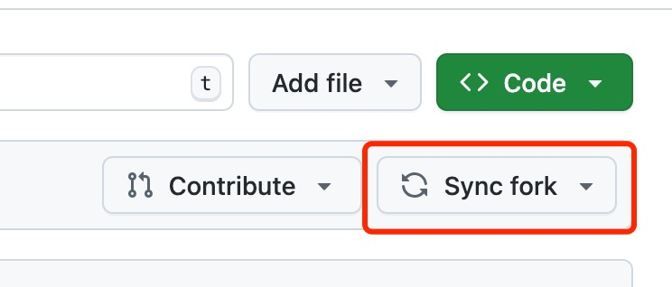

class: center, middle
<span style="font-size: 60px;">第四章: 导入数据</span> <br>
<br>
<br>
<span style="font-size: 30px;">胡传鹏(博士) </span> <br>
<span style="font-size: 20px;"> </span> <br>
<span style="font-size: 30px;"> 2025-03-19 </span> <br>
<span style="font-size: 20px;"> Created with Rmarkdown </span> <br>

---
# Tip #1 

## 如何使用最新的课件？

首先，在github上，对forked的课件进行同步更新

然后，让本地的文件夹（及隐藏的git仓库）与github上的仓库进行同步
```
git pull
```
---
# Tip #2
## 将`Rstudio`中报错语言变为英文
- <font size = 5.5> 打开Rstudio后，输入如下命令，可以让当前的session报错为英文。

```{r local,echo=TRUE, eval=FALSE}
# set local encoding to English
if (.Platform$OS.type == 'windows') {
  Sys.setlocale(category = 'LC_ALL','English_United States.1250')
} else {
  Sys.setlocale(category = 'LC_ALL','en_US.UTF-8')
}
# set the feedback language to English
Sys.setenv(LANG = "en") 
```

## loading packages
```{r load bruceR, message=FALSE, warning=FALSE}
# 可以将清华的镜像设置为下载的镜像
# options(repos = c(CRAN = "https://mirrors.tuna.tsinghua.edu.cn/CRAN/"))
if (!requireNamespace('pacman', quietly = TRUE)) {
    install.packages('pacman')
}
pacman::p_load(bruceR)
```

---

layout: true

# 4.0 回顾与问题
---


--
- # <font size = 5.5> 问卷数据：Human Penguin Project </font> 

- # <font size = 5.5> 实验数据：Perceptual matching </font> 

--
 
<br><br>
##  问题: 

- # <font size = 5.5> 导入 “penguin_rawdata.csv” </font> 

- # <font size = 5.5> 查看数据 —— 数据的类型与结构  </font> 

- # <font size = 5.5> 尝试选取变量进行初步统计计算  </font> 

---
layout: false
# 4.1 数据导入
## 4.1.1 数据的“住址”——路径 (_in Mac_)

<!-- ##### -->
<!-- ##### -->
<!-- Mac 的文件夹更适合展示，因此先说 Mac -->
<!-- ##### -->
<!-- ##### -->

<br>
<font size=5.5>
路径:  如果我们要找到`R4Psy`中`data`文件夹下的`penguin`数据"penguin_rawdata.csv"，需要先打开`R4Psy`文件夹：
</font>

<br>

--

<br><br>
这个顺序就形成了“路径”，用代码可以表示为：

<font size=5.5 class=center color=red>
"data/penguin/penguin_rawdata.csv"
</font>


---
## 4.1.1 数据的“住址”——路径 (_in Mac_)

<br>
但实际上，在 R4Psy 之前还存在文件夹(父文件夹)，如果一直追溯的话：  
<br><br>

<br><br>
因而对于数据penguin_rawdata.csv来说，完整路径就变得莫名其妙的长：
--
<br>
<font size=5.5 class=center color=red>
"/Users/cz***/Documents/github/R4Psy/data/penguin/penguin_rawdata.csv"
</font>

<div class="center">
    
</div>

---
## 4.1.2 绝对路径/相对路径
<br>
<font size=5.5>
相对路径：
</font>
    <font size=5.5 class=center color=red>  
    "data/penguin/penguin_rawdata.csv"   
    或 
    "./data/penguin/penguin_rawdata.csv"
    </font>
<br><br>


<font size=5.5>
绝对路径：
</font>
<br><br>
<font size=5.5 class=center color=red>
"/Users/cz***/Documents/github/R4Psy/data/penguin/penguin_rawdata.csv"
</font>

<br><br><br>
--

-   相对路径相当于设置了某个文件夹作为搜寻的“起点”(这里的`R4Psy`)；

-   设置了“起点”文件夹后，之前的路径可以忽略不写，因此更加简洁；

-   这个“起点”文件夹也被称为*工作目录*(working directory)；

-   使用`getwd()`(get working directory)查看当前工作目录；

-   使用`setwd()`设置工作目录的路径


---
## 4.1.2 绝对路径/相对路径


-   在 global options 中可以设置默认的工作目录  
<br>
<div class="center">
    
</div>

<br><br>

-   **对于`.rmd`文件和`.Rproj`文件来说，会默认将该文件所在的文件夹当做工作目录**，比如当前 rmd文件默认目录为：  

```{r getwd}
getwd()
```


---
## 4.1.2 绝对路径/相对路径(_in Windows_)
<br>

<font size=5.5>
在 Windows 系统中，点击任意文件夹的地址栏空白也能显示绝对路径：
</font>
<br>
<div class="center">
    
</div>
<br><br>
<font size=5.5>
绝对路径应该写为：
</font>

</font>
    <font class='center' color='red'>
    "C:/Users/****/Desktop/doc"
    </font>

<font size=5.5>
似乎有些不一样：  
</font>  
--
<br>
`/`：斜杠   
`\`：反斜杠


---
## 4.1.2 绝对路径/相对路径(_in Windows_)
<br>
<font size = 5.5>
需要注意在R中输入地址与Windows中地址栏的区别
</font>
```{r path_differencial,echo=TRUE, eval=FALSE}
######  Run in WinOS !!! #####
# r语言中的地址
first_path <- getwd()
cat(first_path,"\n")

# Windows的地址
normalized_path <- normalizePath(first_path, winslash = "\\")
cat(normalized_path)
```
<font size=5.5> **因此注意不要直接复制Windows地址栏中的地址**

<br>
<font size = 5.5> 避免不同操纵系统中分割符切换的问题：`here()` </font>

```{r using here, echo=TRUE, message=FALSE, warning=FALSE,results='hide'}
pacman::p_load(here)

# here::here()
here::here("data","penguin","penguin_rawdata.csv")
```

<br>

.footnote[注：在Python及大多数编程语言中，路径都支持斜杠（/）]

---
## 4.1.3 设定工作目录 -- 手动挡与自动挡


-   <font size=5.5>手动档</font>

  使用 `setwd`输入具体路径，例如：
  
```{r setwd_example, echo=TRUE, eval=FALSE}
setwd('D:/R4Psy/data/penguin/')
# or 
setwd('D:\\R4Psy\\data\\penguin')
```

--

-   <font size=5.5>半自动档</font>
<br><br>

```{r set_wd_gui, echo=TRUE, eval=FALSE}
# 两个函数等价，ask = T设置弹出交互式窗口选择文件夹
bruceR::set.wd(ask = T)
bruceR::set_wd(ask = T)
```

---
## 4.1.3 设定工作目录 -- 手动挡与自动挡

-   <font size=5.5>全自动档</font>
<br><br>


---


## 4.2 读取数据

<br><br>

- <font size=6>使用R读取数据，是处理数据的预备工作</font><br>
<span style="font-size: 20px;"> </span> <br>
- <font size=6>最好将数据放于工作目录下的子文件夹中</font><br>
<span style="font-size: 20px;"> </span> <br>
- <font size=6>通过相对路径读取数据，便于分享你的工作
  </font>
  <font size=5>(*写起来也更省事*)</font><br>


---

## 4.2 读取数据——手动档

```{r Read_first_csv}
# 读取数据,命名为penguin_data
penguin_data <- bruceR::import(here::here('data', 'penguin', 'penguin_rawdata.csv'))
```
--

-   <font size=5>由于已经加载bruceR，`bruceR::import()`可以简写为 `import()`，但不推荐；

-   <font size=5>心理学中常用数据基本都可以使用该函数导入(使用`?bruceR::import()`查看支持导入哪些类型)。

-   <font size=5>读取之后数据变量可以从Environment窗口中找到，变量名为penguin_data，点击会弹出窗口显示数据（也可在console中输入 `View(penguin_data)`查看）


---
## 4.2 读取数据——自动挡(GUI点击操作)

在设置好当前工作目录后，直接在 Files 窗口中点点点：


---
## 4.2 读取数据——自动挡
<br>

---

### 拆解第一个代码块
```{r recap first code, eval=FALSE}
penguin_data <- bruceR::import(here::here('data', 'penguin', 'penguin_rawdata.csv'))
```

`penguin_data`: 导入后的数据叫什么，可以理解为一个容器，里面装着数据；

`<-`：赋值符号，将右边的数据赋值给左边的变量；

`bruceR::import()`: 导入数据的函数，可以理解我们让R语言这个工具做的事情；

大家可以尝试不加`penguin_data <-`，改变`penguin_data`的名字，或者改变`import()`里的文件路径，看看会发生什么。

---
#### 赋值与变量

在R中，使用赋值操作符`<-`或 `=` 给对象赋值。<br>

比如：
```{r obj1}
object <- 10
object
```
给对象“object”赋值为10。<br>
赋值后可以对“object”进行操作，比如：<br>

```{r obj2}
object + 2
```

但注意此时的“object”本身并未发生改变。

```{r obj3}

object

```
---
#### 赋值与变量

<font size=5> 为什么会报错？<br>
<br>
--
<font size=5> R中变量名是区分大小写的<br>
--
<br>

<br>
<br>
<font size=5>  变量名可以由字母、数字、_和.组成。并且变量名的第一个字符不能为数字或者特殊符号，比如 +, -, *, /, ^, !, @, &。</font> <br>  
<br>
---
#### 赋值与变量
<font size="5">
<br>
<br>
tips：<br>
<br>
&emsp;&emsp;变量名可以使用中文，但不推荐，可能出现这样的乱码：<br>
&emsp;&emsp;鍙︿竴涓▼搴忔鍦ㄤ娇鐢ㄦ鏂囦欢锛岃繘绋嬫棤娉曡闂��。<br>
<br>
&emsp;&emsp;命名对象最好有不错的可读性，比如“age”就要比“x”更易读。
</font>

---
## 4.3 了解数据

- <font size=5.5> 想要做什么？

- <font size=5.5> 数据里有什么？

- <font size=5.5> 能做什么达到目标?


**思维的变化: 我们要了解数据一些“看不见”的属性。**

<br><br>
使用自动档读取penguin_rawdata.csv数据时，可以发现列名底下带有斜体字：


似乎：  *double*指的是数字，*character* 指的是字母

---

## 4.3 了解数据

- <font size=5.5> 想要做什么？

  - <font size=5> 基本信息 (被试人数、性别、年龄、国家分布 ...)
  
  - <font size=5> 数据预处理 (排除某些被试，反向记分 ...)

  - <font size=5> 问卷得分相关分析(求和、相关分析、因子分析、信度分析...)


**能好怎: 能用吗？好用吗？怎么用？**

---

## 4.3 了解数据

- <font size=5.5> 数据里有什么？

`str`: 查看R对象的结构

```{r check with str}
str(penguin_data)
```

---

## 4.3 数据类型(in Excel)


<div class="center">
    
</div>


---
## 4.3 数据类型(in R)  


<div class="center">
    
</div>


类似Excel但不同。每个单元格内的元素可以分为(部分)：  

-   数值(numeric)：

    包含小数(double)和整数型(int)

-   字符串(character/string):   
  
    文字数据，在字符串的开头或结尾一定要有单引号或双引号；

-   逻辑值(logical):

    比较大小或是否相等--TRUE(1)和FALSE(0)

---
## 4.3 数据类型
<br>
使用`class()`函数可以查看数据类型：

```{r check class}
# getwd 返回当前工作目录，返回的数据类型是？
class(getwd())
# 字符串的数字与数值型的数字；
# 注意区别== 与 =
class('1' == 1)
# 导入数据的类型
class(penguin_data)
```


---
## 4.3 数据类型对应的“操纵”


<br>
<br>
<font size = 5>
数学运算 <br>
&emsp;+ - * / ^(加、减、乘、除、求幂)等 <br>
<br>
比较运算 <br>
&emsp;>、<、>=、<=、==、!= <br>
&emsp;identical(x,y) —— 判断两个对象是否严格相等 <br>
<br>
---
## 数学运算:+ - * / ^(加、减、乘、除、求幂)等

```{r arithmetical1}
3.14 + 2
```

数值型可以进行数学运算
--

```{r arithmetical2}
TRUE * 3
F ^ 2
```

逻辑型可以进行数学运算

--

```{r arithmetical3, eval=FALSE}
"a" + 1
```

字符不能进行数学运算
---

## 4.4 数据结构
<br>
<font size=6>不同类型的数据进行组合，形成了不同的数据结构
<br>


-   Vector (向量)  

-   Matrix (矩阵)  

-   Array (数组)  

-   Data frame (数据框)  

-   List (列表)  


---

## 4.4 数据结构
<br>
<font size=6>不同类型的数据进行组合，形成了更复杂结构的数据
<br>

.pull-left[


]
.pull-right[

]


---

## 4.4 数据结构

<br>
<p align="right"><font size=2>from http://venus.ifca.unican.es/Rintro/dataStruct.html</font></p>

---
## 4.4 数据结构

### 向量
```{r creat the vector}
#创建向量
v1 <- c(1,2,3,4,5)  # 数值型向量
v1
v2 <- c('apple','pear','banana','strawberry','lemon') # 字符型向量
v2
v3 <- c(T,F,F,T,T) # 逻辑型向量
v3
v4 <- c(1:3) # 数值型向量
v4
```


最常见的函数 `c()`，将多个元素组合成向量。

---
## 4.4 数据结构

### 矩阵与数组
```{r 5.4 creat the matrix}
#创建矩阵
m1 <- matrix(c(1:9), nrow=3)
m1

#创建三维数组
a1 <- array(1:24, dim=c(3,4,2))
a1
```
---
## 4.4 数据结构

### data frame

```{r 5.4 creat the data.frame}
#创建数据框(每个成分都是一个向量)
d1 <- data.frame(v1,v2,v3)
d1

# d2 <- data.frame(v1,v2,v3,v4)
```
<font size = 5> 
数据框每一列的元素数目要相同 <br>

---
## 4.4 数据结构

### data frame
</br>
## 创建空的dataframe，但有列名。

```{r create empty df}
df <- data.frame(matrix(ncol = 3, nrow = 0))
x <- c("name", "age", "gender")
colnames(df) <- x
```

---
## 4.5.1 数据索引(中括号)
<font size=5>中括号索引(data[row,col])  

-   数字索引</font>  

```{r index vector}
v1[2]
v2[3]
```


```{r index dataframe}
# 根据行与列的编号
penguin_data[1:2, 1:3]

# 也可以使用减号
penguin_data[1:2, -c(4:ncol(penguin_data))]
```

---
## 4.5.1 数据索引(中括号)
<font size=5>中括号索引(data[row,col])  

-   名称索引</font>  
```{r}
# 同样选取前 2 行以及前 4 列数据
penguin_data[1:2, c('age','ALEX1','ALEX2')]
```

TIP：输入字符串每次都要打很多引号会非常麻烦，因此可以使用bruceR::cc()，只需在首尾写冒号：
```{r}
c('age','ALEX1','ALEX2') == cc('age,ALEX1,ALEX2')
```

---
## 4.5.2 数据索引($)  
<font size=5>美元符索引data$colname</font>

```{r}
## 根据列名进行索引
head(penguin_data$age)

## 如果数据类型的格式是 ***data.frame***
## 则使用$提取和中括号提取是等价的

class(penguin_data$age)
class(penguin_data[,1])

## 但另外一种数据框的格式tibble中
## 会出现差异，当然这是下节课的内容了

```

---
## 4.5.3 数据索引(逻辑值)  
<font size=5> 使用逻辑值进行索引，用于根据条件对数据进行筛选：</font>

```{r}
v5 <- v1 >=4

v1[v5]

# v1[v1>=4]
```

```{r}
## 输出逻辑值
head(penguin_data$age >1980)

## 筛选出生年份大于 1980 且(&)小于 1990 的数据
agedata = penguin_data[
  penguin_data$age >1980 & 
  penguin_data$age < 1990 ,]
unique(agedata$age)

## 逻辑运算： 且(&)、或(|)、非(!)、%in%(属于)
```


---
## 4.6 对象
<br>
<span style="font-size: 30px;"> partner 🙅 </span> <br>
<span style="font-size: 30px;"> object 👌</span> <br>

--

-   <span style="font-size: 30px;">   在R中存储的数据称为对象，R语言数据处理实际上就是不断地创建和操控这些对象； </span> <br>  


-   <span style="font-size: 30px;"> 可以将对象理解为“容器”，那就可以去装各种东西，数字、数据集、图片等，而变量名，就像“容器”的“标签” </span> <br>  
  

<div class="center">
    
</div>
<!-- {width=50} -->


---
class: center, middle
<span style="font-size: 60px;">Final Project</span> <br>


---

# <h1 lang="zh-CN">About the final project</h1><br>
## 对已发表论文的数据分析进行复现：<br>
<font size=5.5>1、展示：待定，每小组约8分钟+2分钟提问  <br><br></font>  

<font size=5.5>2、代码及报告提交：2024.6.30(待定)<br><br></font>  

<font size=5.5>3、需要上交如下内容：<br></font>  

-   <font size=5.5>代码（RMD格式，最好使用papaja进行准备）</font>  <br>

-   <font size=5.5>文档（PDF或者Word，采用APA格式撰写,推荐由Papaja生成）  </font><br>

-   <font size=5.5>报告（PPT或者HTML在课堂上展示）  </font><br>

<font size=5.5>4、参考手册</font>  

-   <font size=5.5>“心理学院R编程语言课程可重复检验指南(2025版).docx”</font>  <br>

---

# <h1 lang="zh-CN">Requirements</h1><br>
## 代码要求：  

<font size=5.5>1、数据预处理流程<br><br></font>  

<font size=5.5>2、完整的数据分析流程，包括：<br><br></font>  

-   <font size=5.5>描述性统计结果 + 可视化（集中量数，离散量数，相关等）</font>  <br><br>  

-   <font size=5.5>对原文数据分析结果的计算可重复性的评估(按照模板回答问题)</font>  <br><br>  

-   <font size=5.5>检验结果可视化</font>  <br><br>  


---

# <h1 lang="zh-CN">Requirements</h1><br>
## 文档要求：
-     <font size=5.5>标题《对XXX的可重复性研究》及作者</font>  <br><br>  
-  <font size=5.5>小组成员与分工</font>  <br><br>  
-   <font size=5.5>引言（对选取研究的简述，包含其假设、数据、方法、结果等）</font>  <br><br>  
-  <font size=5.5>研究复现思路及流程</font>  <br><br>  
-  <font size=5.5>复现结果</font>  <br><br>  
-  <font size=5.5>对结果的讨论及结论</font>  <br><br>  
-  <font size=5.5>参考文献</font>  <br><br>  
-  <font size=5.5>附件：对计算可重复性模板中问题的逐条回复</font>  <br><br>  

---

# <h1 lang="zh-CN">Requirements</h1><br>
## 报告要求：
-   <font size=5.5>标题，作者</font>  <br><br>  
-   <font size=5.5>成员信息、分工</font>  <br><br>  
-   <font size=5.5>所选研究简介，包含其前言、方法、结果三个部分</font>  <br><br>  
-   <font size=5.5>研究复现思路及流程</font>  <br><br>  
-   <font size=5.5>复现结果</font>  <br><br>  
-   <font size=5.5>对结果的讨论及结论</font>  <br><br>  

---

# <h1 lang="zh-CN">Marking</h1><br>
|         | 代码40% | 论文30% | 报告30% |
|---------|------|------|------|
| 基础要求 |  作为一个整体项目可运行  |  内容的完整性  |  时间分配的合理性  |
|         |  分析方法的一致性  |  格式的标准性  |  讲述的清晰性  |
|         |  代码的可读性（包括辅助文字以及对代码的注释）  |  逻辑的连贯与一致性  |  团队分工的合理性  |
| 加分项   |  代码的可读性，图表的美观性  |  英文写作，Papaja生成  |  英文报告，R生成  |
<br>
###额外加分项：以小组为单位将三部分内容pull  

request到Repo(https://github.com/hcp4715/R4Psy/tree/main/homeworks)

-   <font size=5.5>对于报告的评分每组对其他组进行评分 + 胡传鹏老师和助教进行评分，对所有评分去
掉最高最低，取平均作为最终得分。</font>  <br><br> 
-   <font size=5.5>对于代码及论文的评分，将由胡传鹏老师和四位助教进行评分，并取平均作为最终得分。</font>  <br><br> 


---
class: center, middle
<span style="font-size: 60px;">Any questions?</span> <br>


---
# 4.7  变量名与规范

## 4.7.1  变量命名

-   大小写敏感  

-   不能有空格，可以用下划线代替空格  

-   开头不能是数字和一些特殊符号(如+-*/)  

-   关于`.`：R语言是允许变量名中带`.`的，比如将数据命名为penguin.rawdata是合法的，但是`.`在许多编程语言中都具有特殊含义(如Python)，所以更建议使用`_`来代替`.`。  

-   如果一定要使用非法的变量名的话：将变量名使用\`illegal_varname\`括起来：  
```{r}
# 比如变量名以数字开头且包含空格：
`1 首先` = 1
print(`1 首先`)
# 从环境中删除该变量
rm(`1 首先`)
```


---

## 4.7.2  缺失值(NA)与 NULL

-   NA：代表缺失值，任何数值与 NA 进行计算都会得到 NA，因此在计算或绘图中，需要移除缺失值或对其进行填补
```{r}
unique(penguin_data$ALEX1)
#直接计算会得到 NA
mean(penguin_data$ALEX1)
# 因此计算时需要移除 NA(remove)
mean(penguin_data$ALEX1,na.rm = T)

```
    
-   NULL表示空值，没有任何数据或内容，比如penguin_data$ALEX1 = NULL 会直接删除 ALEX1 这一列（注意：该操作不可逆）

---
## 4.7.3 数据类型的转换

R 语言中有一类函数以 `as.`开头，如 as.numeric()、as.data.frame()，会对数据类型进行转换，比如：
```{r}
x = TRUE
x = as.numeric(x)
class(x)
x = as.character(x)
class(x)
```

类似，也存在一类函数以`is.`开头，判断对象是否属于某一类型，返回逻辑值：
```{r}
is.character(x)
```


---
## 4.7.4  目录和文件管理函数:

- `getwd()`—返回当前工作目录。
- `setwd()`—设置当前工作目录。
- `list.files()`或`dir()`—查看目录中内容。

    `list.files(pattern=’.*[.]r$’)`可以列出所有以“.r”结尾的文件。
- `file.path()`—把目录和文件名组合得到文件路径。
- `file.info(filenames)`—显示文件的详细信息。
- `file.exists()`—查看文件是否存在。
- `file.access()`—考察文件的访问权限。
- `create.dir()`—新建目录。
- `file.create()`—生成文件。
- `file.remove()`或`unlink()`—删除文件。

    `unlink()`可以删除目录。
- `file.rename()`—为文件改名。
- `file.append()`—把两个文件相连。
- `file.copy()`—复制文件。
- `basename()`和`dirname()`- 从一个全路径文件名获取文件名和目录。


---
## 4.7.5  对象与变量名

关于对象更加细节的内容，可以参考《R 语言入门与实践》[（点击这里）](https://rstudio-education.github.io/hopr/r-objects.html)。


R 语言中，对象就是存储数据的容器，而变量名相当于容器的标签，通过标签来找到对应的数据：比如`x = 1`，`y = x`，y 的值也为 1，而'x'和'y'只是数值 1 的两个标签，二者访问的计算机内存地址相同；  

但 R 语言中所使用的复制为浅拷贝(shallow copy)：当对 y 进行更改的时候并不会影响原本 x 的值（在 R 3.1.0之前为deep copies），而 y 这个标签也被“贴在”了新的内存地址上（copy-on-modify）。  

```{r}
x = 1;y = x
address(x)
address(y)
y = 2
address(y)
```


