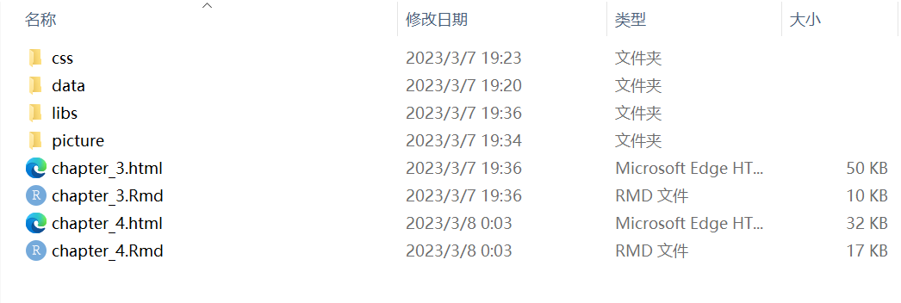
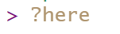
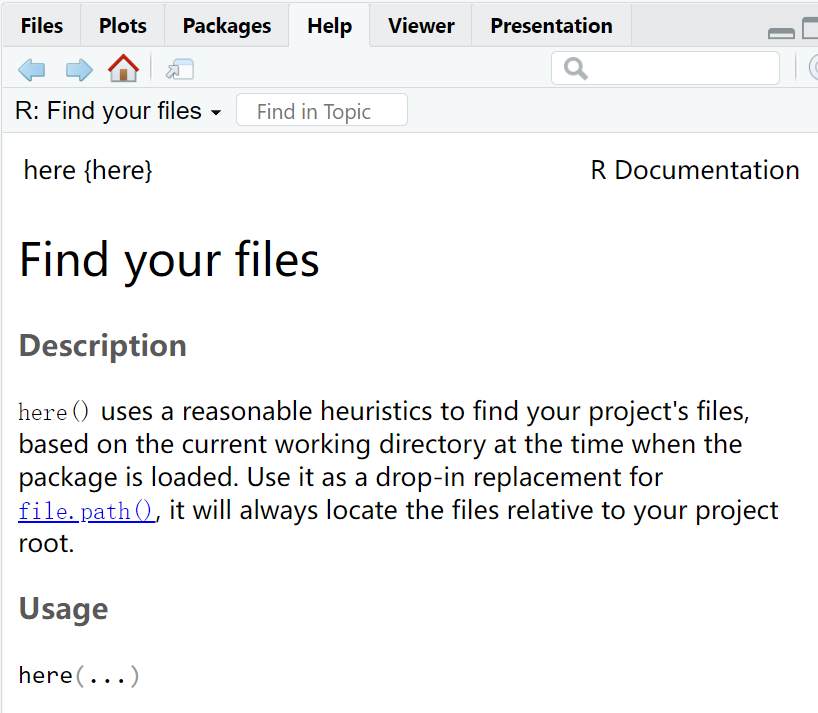

class: center, middle
<span style="font-size: 50px;">**第四章**</span> <br>
<span style="font-size: 50px;">__如何清理数据（一）__</span> <br>
<span style="font-size: 40px;">R语言编程基础</span><br>
<span style="font-size: 30px;">胡传鹏</span> <br>
<span style="font-size: 20px;"> </span> <br>
<span style="font-size: 30px;">`r Sys.Date()`</span> <br>
<span style="font-size: 20px;"> Made with Rmarkdown</span> <br>

---
#回顾
##工作目录与路径
##读取数据
<br><br>
#本节课内容
##了解函数
##- 数据筛选
##-- 向量类型
##-- 比较运算

---
#准备
##下载压缩包，解压
##打开文件夹，双击打开__R4Psy.Rproj__


---
# 回顾
## 创建 R Script
<font size=5>
&emsp;&emsp;我们可以创建一个R Script文件帮助我们更好地记录曾经写过什么，也方便我们对写的代码进行检查。
</font><br>
 <br>


---
# 回顾
## 创建 R Script
<font size=5>
&emsp;&emsp;并选择 File-Save as…进行保存。这里我们统一保存压缩包的目录里。data文件里有本课涉及到的两个数据。
</font><br>


---
# 回顾
## 读取数据
<font size=5>
&emsp;&emsp;同学们可以根据相对路径读取数据。
</font><br>
```{r}
#问卷数据参考读取方法：
penguin.data <- read.csv("./data/penguin/penguin_rawdata.csv",
                         header = TRUE, sep=",",
                         stringsAsFactors = FALSE)
```

---
# 回顾
## 读取数据
<font size=5>
&emsp;&emsp;同学们可以根据相对路径读取数据。
</font><br>
```{r}
#实验数据参考读取方法，这里我们随便选择三个被试：
match.data1 <- read.csv("./data/match/data_exp7_rep_match_7304.out", 
                        header = TRUE, sep = "", 
                        stringsAsFactors = FALSE)
match.data2 <- read.csv("./data/match/data_exp7_rep_match_7305.out", 
                        header = TRUE, sep = "", 
                        stringsAsFactors = FALSE)
match.data3 <- read.csv("./data/match/data_exp7_rep_match_7306.out", 
                        header = TRUE, sep = "", 
                        stringsAsFactors = FALSE)
```

---
# 回顾
## 读取数据
<font size=5>
&emsp;&emsp;这里我们有了三个被试的数据，可是他们分散在三个data中，我们并不好进行比较，这里我们可以使用rbind()函数对他们进行组合。
</font><br>
```{r}
#组合三个数据：
match.data.all <- rbind(match.data1, match.data2, match.data3)
```

---
# 补充
## R对象的赋值
在R中，我们可以使用赋值操作符“<-”给对象赋值。<br>
比如：
```{r}
object <- 10
object
```
我们给对象“object”赋值为10。<br>
赋值后可以对“object”进行操作，比如：<br>
```{r}
object + 2
```
但注意此时的“object”本身并未发生改变。
```{r}
object
```

---
# 补充
## R对象的赋值
&emsp;&emsp;因此，在组合三个数据时，我们需要一个新的R的对象来容纳组合成的新数据<br>
```{r}
#组合三个数据：
match.data.all <- rbind(match.data1, match.data2, match.data3)
```
&emsp;&emsp;在这里，新的对象叫做match.data.all，三个被试的数据被组合在一起装了进去。

---
# 补充
## 创建对象
&emsp;&emsp; <font size=5>  变量名可以由字母、数字、_和.组成。并且变量名的第一个字符不能为数字或者特殊符号，比如 +, -, *, /, ^, !, @, &。</font> <br>  
<br>
<font size="5">
tips：<br>
&emsp;&emsp;- 对象命名区分大小写，“X” 和 “x” 表示的是不同的对象。<br>
<br>
&emsp;&emsp;- 可以使用中文，但不推荐，可能出现这样的乱码：<br>
&emsp;&emsp;鍙︿竴涓▼搴忔鍦ㄤ娇鐢ㄦ鏂囦欢锛岃繘绋嬫棤娉曡闂��。<br>
<br>
&emsp;&emsp;- 命名对象最好有不错的可读性，比如“age”就要比“x”更易读。
</font>

---
# 函数
## 什么是函数
<font size=5>
&emsp;&emsp;我们在这里使用的rbind()就是R base中的一个基本函数。
<br>
&emsp;&emsp;在R中，函数是一种用于执行特定任务或计算的代码块。函数接受输入参数，执行特定的操作，并返回结果。
</font>
<br><br>
<font size=6>
- 已有函数<br>
&emsp;&emsp;- R base; <br>
&emsp;&emsp;- R packages; <br>
&emsp;&emsp;- functions from other sources<br>
- 自定义函数
</font>

---
# 函数
## 什么是函数
<font size=5>
&emsp;&emsp;如果我们不知道一个函数是什么，有什么用处。在R中，我们可以在Console中使用“?函数名”来打开帮助文档。
</font><br>

{:height="20px" width="80px"}

---
# 函数
## 如何调用已有函数
<font size=5>
&emsp;&emsp;直接调用:functions()
</font>
```{r}
#直接调用：
library("here")#加载here包，install的R包需要library后使用
here()
```
<font size=5>
&emsp;&emsp;注意，当你使用不同的包的时候，为了避免出现函数名重复导致调用错误，可以使用：R包::functions()
</font>
```{r}
#给出R包的调用：
here::here()#这里第一个here是R包，第二个here是调用这个包里here函数
```

---
# 函数
## 常用函数
## unique()
<font size=5>
&emsp;&emsp;如果我们拿到了match.data.all，想要知道Label这一列有多少种独特的情况，我们可以使用unique()函数。
</font>
```{r}
#使用$符号定位某一列
head(match.data.all$Label,10)
#使用unique查看这一列有多少种独特的情况
unique(match.data.all$Label)
```
---
# 函数
## 常用函数
## r filter()
<font size=5>
&emsp;&emsp;函数可以帮助我们完成很多操作，比如筛选数据。这里我们介绍filter()函数。
</font>
library
```{r}
#筛选出match.data.all的Match列中所有mismatch的数据
mismatch <- dplyr::filter(match.data.all, match.data.all$Match == "mismatch")
#查看是否成功
unique(mismatch$Match)
```

---
# 运算
## 比较运算
<font size=5>
&emsp;&emsp;我们先看函数里的内容。在这里我们使用了match.data.all$Match == "mismatch"来判断Match列中的每一个对象是否“==”mismatch，这里的“==”是R的比较运算符。
</font>

---
# 运算
## 比较运算
<font size=5>
&emsp;&emsp;比较运算符，旨在将两个两个向量的相应元素进行比较，返回比较结果为真TRUE、假FALSE。
</font>


---
# 向量的类型
<font size=5>
&emsp;&emsp;我们在进行比较运算时，比较的两个向量需要类型相同。
</font>
## 向量（Vector）<br>
<font size=6>
- 逻辑型（logical）<br>
- 整型（integer）<br>
- 双精度型（double）<br>
- 字符型（character）<br>
- 复数型（complex）<br> 
- 原始型（raw）<br>

---
# 向量的类型
<font size=5>
- 逻辑型（logical）<br>
```{r}
#注意需要全部大写
a <- TRUE 
b <- FALSE
print(c(a,b))
```
- 整型（integer）<br>
```{r}
a <- 3L
a
```

---
# 向量的类型
<font size=5>
- 双精度型（double）<br>
```{r}
a <- 3.14
a
```
- 字符型（character）<br>
```{r}
a <- "R4Psy"
a
```

---
# 向量的类型
<font size=5>
- 复数型（complex）<br> 
```{r}
a <- 3+4i
a
```
- 原始型（raw）<br>
```{r}
a <- charToRaw('hello')
a
```

---
# 向量的类型
<font size=5>
&emsp;&emsp;回到match.data.all$Match == "mismatch"这里，我们可以通过class()函数查看某一向量的类型。
</font>
```{r}
class(match.data.all$Match)
```
<font size=5>
&emsp;&emsp;所以，这其实是字符串的比较运算，通过Match列中每一个字符串是否和字符串“mismatch”相等来进行判断。
</font>

---
# 函数
## 常用函数
## filter()
<font size=5>
&emsp;&emsp;以上我们理解了函数内的比较，接下来我们看看filter()函数是如何运作的。
</font>
```{r}
head(match.data.all$Match == "mismatch")
```
<font size=5>
&emsp;&emsp;从结果我们能看出来，进行比较判断后返回的是TRUE和FALSE，也就是我们在类型中说的逻辑型。<br>
&emsp;&emsp;filter()函数做的，就是将返回为TRUE的数据保留下来，丢弃那些FALSE的数据，并返回一个新的数据框。
</font>

---
# 函数
## 常用函数
## filter()
<font size=5>
&emsp;&emsp;除了字符串以外，我们也可以利用比较判断进行数值比较。
</font>
```{r warning=FALSE}
class(match.data.all$ACC)#发现类型是character而不是numeric，我们需要先转换。
#通过as.numeric()将其他类型转化为数值型向量
match.data.all$ACC <- as.numeric(match.data.all$ACC)
class(match.data.all$ACC)
```

---
# 函数
## 常用函数
## filter()
<font size=5>
&emsp;&emsp;我们想把所有ACC大于等于0的被试提出来。
</font>
```{r}
#筛选出match.data.all的ACC列中所有大于等于0的数据
mismatch <- dplyr::filter(match.data.all, match.data.all$ACC >=0)
#查看是否成功
unique(mismatch$ACC)
```

---
# 练习
## 对match数据
<font size=5>
&emsp;&emsp;1.读取data_exp7_rep_match_7302.out和data_exp7_rep_match_7303.out文件，使用rbind()整合<br>
&emsp;&emsp;2.利用filter()提取出Sex为male的被试数据<br>
&emsp;&emsp;3.利用filter()提取出Age大于20的被试数据（注意数据类型）
</font>
<br>

---
# 练习
## 对penguins数据
<font size=5>
&emsp;&emsp;1.读取数据<br>
&emsp;&emsp;2.利用filter()提取出Site为Oxford的被试数据<br>
&emsp;&emsp;3.利用filter()提取出1988年及之后出生的被试的数据（注意数据类型）
</font>
<br>


