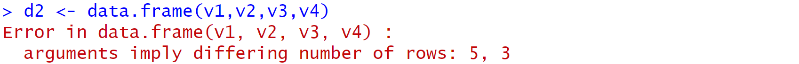
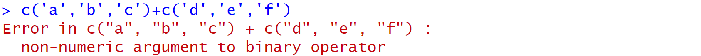
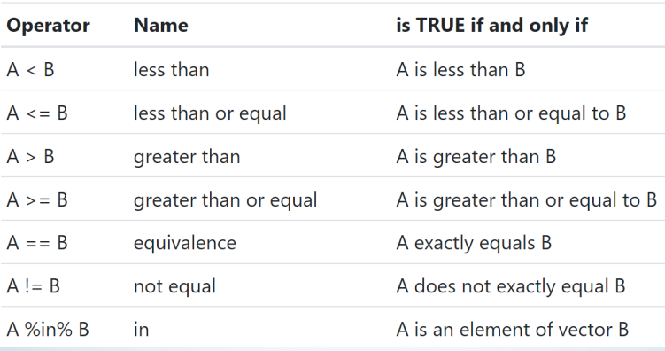
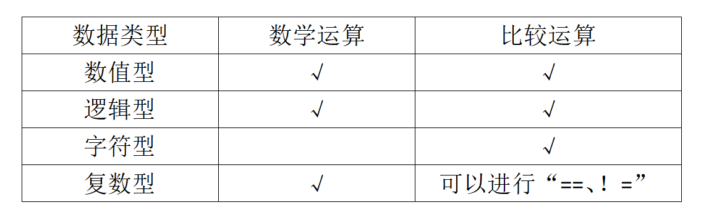
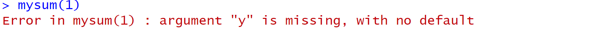
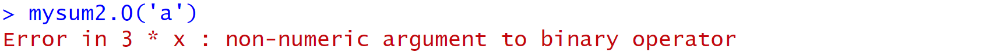

class: center, middle
<span style="font-size: 60px;">第五讲</span> <br>
<span style="font-size: 60px;">R语言中的对象2: 函数</span> <br>
<br>
<span style="font-size: 30px;">胡传鹏</span> <br>
<span style="font-size: 30px;">`r Sys.Date()`</span> <br>

---
<br>
<br>
# <h1 lang="zh-CN">回顾</h1>
# <h2 lang="zh-CN">&emsp;5.1 数据导入</h2>
# <h2 lang="zh-CN">&emsp;5.2 赋值</h2>
# <h2 lang="zh-CN">&emsp;5.3 数据类型</h2>
# <h2 lang="zh-CN">&emsp;5.4 数据结构</h2>
<br>
<br>
# <h1 lang="zh-CN">本节课内容</h1>
# <h2 lang="zh-CN">&emsp;5.5 对数据的操纵</h2>
# <h2 lang="zh-CN">&emsp;5.6 数据类型的判断与转换</h2>
# <h2 lang="zh-CN">&emsp;5.7 函数</h2>

---
# <h1 lang="zh-CN">5.1 数据导入</h1>
# <font size = 5.5> 问卷数据：Human Penguin Project </font> 
- # <font size = 5.5> 绝对路径:对文件或目录位置的完整描述，从根目录开始 </font>
```{r 5.1 absolute path}
paste(getwd(),"/data/penguin/penguin_rawdata.csv",sep = "")
```
- # <font size = 5.5> 相对路径:对文件或目录位置的部分描述，从当前工作目录开始。 </font>
"data/penguin/penguin_rawdata.csv"
- # <font size = 5.5> 工作目录 </font>
```{r 5.1 relative path}
getwd()#获取工作目录
```
--
- # <font size = 5.5>绝对路径=工作目录+相对路径</font>
- # <font size = 5.5>推荐使用相对路径</font>
---
```{r 5.1 R package}
#下载、导入所需R包
if (!requireNamespace('pacman', quietly = TRUE)) {
    install.packages('pacman')
}
pacman::p_load(bruceR,tidyverse)
```

```{r 5.1 read}
#读取数据
penguin_data = bruceR::import(here::here('data', 'penguin', 'penguin_rawdata.csv'))#当前工作目录为R4Psy,依次打开'data''penguin'文件夹获取'penguin_rawdata.csv'数据
```
--
<br>
---
# <h1 lang="zh-CN">5.2 赋值与变量</h1>

在R中，我们可以使用赋值操作符“<-”或“=”给对象赋值。<br>
比如：
```{r 5.2 obj1}
object <- 10
object
```
我们给对象“object”赋值为10。<br>
赋值后可以对“object”进行操作，比如：<br>
```{r 5.2 obj2}
object + 2
```
但注意此时的“object”本身并未发生改变。
```{r 5.2 obj3}

object

```
---
# <h1 lang="zh-CN">5.2 赋值与变量</h1>

<font size=5> 为什么会报错？<br>
<br>
--
<font size=5> R中变量名是区分大小写的<br>
--
<br>

<br>
<br>
<font size=5>  变量名可以由字母、数字、_和.组成。并且变量名的第一个字符不能为数字或者特殊符号，比如 +, -, *, /, ^, !, @, &。</font> <br>  
<br>
---
# <h1 lang="zh-CN">5.2 赋值与变量</h1>
<font size="5">
<br>
<br>
tips：<br>
<br>
&emsp;&emsp;变量名可以使用中文，但不推荐，可能出现这样的乱码：<br>
&emsp;&emsp;鍙︿竴涓▼搴忔鍦ㄤ娇鐢ㄦ鏂囦欢锛岃繘绋嬫棤娉曡闂��。<br>
<br>
&emsp;&emsp;命名对象最好有不错的可读性，比如“age”就要比“x”更易读。
</font>

---
# <h1 lang="zh-CN">5.3 基本数据类型</h1>
<font size=5> 
- numeric（数值型），又分为 integer（整数型）和 double（浮点型）</h3>
- logical（逻辑型），只有 TRUE 和 FALSE，或 T 和 F</h3>
- character（字符型），引号括起来的若干字符</h3>
- complex（复数类型），复数</h3>
- raw（原始型），用于存储原始字节数据</h3>

```{r 5.2 class}
object <- 10
class(object)#查看数据类型
a <- 3.14
class(a)
```

---
# <h1 lang="zh-CN">5.3 基本数据类型</h1>
```{r 5.3 data type}
b <- T
class(b)
c <- 'R4Psy'
class(c)
d <- 3+4i
class(d)
e <- charToRaw('hello')
class(e)
```

---
# <h1 lang="zh-CN">5.4 数据结构</h1>
数据结构是为了便于存储相同或不同类型的数据而设计的数据容器。<br>
常用数据结构<br>
&emsp;存放同类型数据：向量(Vector),矩阵(Matrix),多维数组(Array)<br>
&emsp;存放不同类型数据：列表(List)、数据框(Data Frame)<br>
&emsp;因子(Factor)<br>

---
# <h1 lang="zh-CN">5.4 数据结构</h1>

```{r 5.3 creat the vector}
#创建向量
v1 <- c(1,2,3,4,5)#数值型向量
v1
v2 <- c('apple','pear','banana','strawberry','lemon')#字符型向量
v2
v3 <- c(T,F,F,T,T)#逻辑型向量
v3
v4 <- c(1:3)#数值型向量
v4

```

---
# <h1 lang="zh-CN">5.4 数据结构</h1>

```{r 5.4 creat the data.frame}
#创建数据框(每个成分都是一个向量)
d1 <- data.frame(v1,v2,v3)
d1
```

--

--
<font size = 5> 
数据框每一列的元素数目要相同 <br>
---
# <h1 lang="zh-CN">5.4 数据结构</h1>

```{r 5.4 creat the matrix}
#创建矩阵
m1 <- matrix(c(1:9),nrow=3)
m1

#创建三维数组
a1 <- array(1:24,dim=c(3,4,2))
a1
```
---
# <h1 lang="zh-CN">5.4 数据结构</h1>

</br>
## 创建空的dataframe，但有列名。

```{r create empty df}
df <- data.frame(matrix(ncol = 3, nrow = 0))
x <- c("name", "age", "gender")
colnames(df) <- x
```

---
# <h1 lang="zh-CN">5.4 数据结构</h1>
```{r creat the list}
#创建列表
l1 <- list(1,c('a','b'),c(T,F))
l1
l2 <- list(d1,m1)
l2
```

---
# <h1 lang="zh-CN">5.4 数据结构</h1>
数据可分为：定量数据（数值型）、定性数据（分类型）；定性数据又可分为名义型（无好坏顺序之分，如性别）、有序型（有好坏顺序之分，如疗效）。<br>
<br>
R 提供了因子这一数据结构（容器），专门用来存放名义型和有序型的分类变量。<br>
<br>
直接用字符向量也可以表示分类变量，但它只有字母顺序，不能规定想要的顺序，也不能表达有序分类变量。<br>
--

```{r 5.4 factor1}
x <- c('good','better','best','bad','worse','worst')
sort(x)#排序
```
只会按照字母顺序排序
-

```{r 5.4 factor2}
x1 <- factor(x,levels = c('best','better','good','bad','worse','worst'))
sort(x1)#排序
```

转化为因子之后可按照设置的方式排序
---
# <h1 lang="zh-CN">5.4 数据结构</h1>
## 索引<br>
--
<font size = 5>
-   数字索引</font>  

```{r 5.4 index1}
# 选取前 2 行以及前 3 列数据
penguin_data[1:2,1:3]
# 也可以使用减号
penguin_data[1:2,-c(4:ncol(penguin_data))]
```

<font size = 5>
-   名称索引</font>  

```{r 5.4 index2}
# 同样选取前 2 行以及前 4 列数据
penguin_data[1:2,c('age','ALEX1','ALEX2')]
```

---
# <h1 lang="zh-CN">5.4 数据结构</h1>
## 小练习
<font size = 5>
尝试把以下表格中的内容创建为数据框，并把第一列改为因子


```{r 5.4 exercise}
# gender <- c(***)
# gender1 <- ***
# score <- c(***)
# letter <- c(***)
# logic <- c(***)
# data <- ***(***)

#将“***”部分替换为适合的代码，并删去行首的“#”,即可运行
```


---
# <h1 lang="zh-CN">5.5 对数据的操纵</h1>
<br>
<br>
<font size = 5>
数学运算 <br>
&emsp;+ - * / ^(加、减、乘、除、求幂)等 <br>
<br>
比较运算 <br>
&emsp;>、<、>=、<=、==、!= <br>
&emsp;identical(x,y) —— 判断两个对象是否严格相等 <br>
<br>
逻辑运算 <br>
&emsp;| & ! (或、与、非)等 <br>
---
# <h1 lang="zh-CN">5.5 对数据的操纵</h1>
## 数学运算:+ - * / ^(加、减、乘、除、求幂)等

```{r 5.5 arithmetical1}
3.14 + 2
```

数值型可以进行数学运算
--

```{r 5.5 arithmetical2}
TRUE * 3
F ^ 2
```

逻辑型可以进行数学运算
--

```{r 5.5 arithmetical3}
(3+1i)^2
```

复数型可以进行数学运算
--


---

# <h1 lang="zh-CN">5.5 对数据的操纵</h1>
## 数学运算:+ - * / ^(加、减、乘、除、求幂)等

```{r 5.5 arithmetical4}
c(1:5) ^ 2
c(1:5) * c(6:10)
c(T,F) / c(T,T)
c(8+6i,7+4i) + c(3+2i,4+4i)
```


---
# <h1 lang="zh-CN">5.5 对数据的操纵</h1>
## 比较运算:>、<、>=、<=、==、!= 

---
# <h1 lang="zh-CN">5.5 对数据的操纵</h1>
## 比较运算:>、<、>=、<=、==、!= 

```{r 5.5 comparision1}
3 < 5
7.00 == 7
T == TRUE
T > F
```
数值型和逻辑型可以进行比较运算
---

# <h1 lang="zh-CN">5.5 对数据的操纵</h1>
## 比较运算:>、<、>=、<=、==、!=

```{r 5.5 comparision2}
(3+4i) != (3-4i)
(1+1i) == (1+3i) 
```


复数型仅可以进行“==、!=”的比较运算
---
# <h1 lang="zh-CN">5.5 对数据的操纵</h1>
## 比较运算:>、<、>=、<=、==、!=

```{r 5.5 comparision3}
'a' == 'A'
'a' <= 'b'
'abc'>'a'
```

字符型可以进行比较运算
---
# <h1 lang="zh-CN">5.5 对数据的操纵</h1>
## 比较运算:>、<、>=、<=、==、!= 

```{r 5.5 comparision4}
3 < c(1:5)
c(1:3) < c(4:6)
3 %in% c(1:5)
c(1:3) %in% c(3:5)
c(T,F,T) != c(F,T,T)
```

数值型和逻辑型向量可以进行比较运算。

---
# <h1 lang="zh-CN">5.5 对数据的操纵</h1>
## 比较运算:>、<、>=、<=、==、!=

```{r 5.5 comparision5}
'apple' %in% c('apple','pear','banana','strawberry','lemon')
c('apple', 'watermelon') %in% c('apple','pear','banana','strawberry','lemon')
```

字符型向量可以进行比较运算
---
# <h1 lang="zh-CN">5.5 对数据的操纵</h1>
## 比较运算:>、<、>=、<=、==、!=
字符是否匹配的问题还可以具体为是否完全匹配、是否部分匹配<br>

```{r 5.5 comparision6}
#完全匹配
'c' %in% c('abc','cd','c')
#部分匹配
base::grepl('c',c('abc','cd','c'))
#部分匹配之开头匹配
base::startsWith(c('abc','cd','c'),'c')
#部分匹配之结尾匹配
base::endsWith(c('abc','cd','c'),'c')
          
```

---
# <h1 lang="zh-CN">5.5 对数据的操纵</h1>
## 比较运算:>、<、>=、<=、==、!=

<font size=5>
什么是通配符？<br>
--
&emsp;&emsp;通配符是一种特殊字符，它可以在匹配文件名或其他文本字符串时代替其他字符。<br>
<br>
--
R中常使用的通配符包括"*""?"和"[]"。<br>
--
&emsp;&emsp;*：代表任意数量的字符，例如*.csv将匹配所有以.csv结尾的文件。<br>
&emsp;&emsp;?：代表单个字符，例如file?.txt将匹配file1.txt，file2.txt等文件，但不会匹配file10.txt。<br>
&emsp;&emsp;[]：用于匹配指定的一组字符。例如，file[123].txt将匹配file1.txt，file2.txt和file3.txt。
</font>

---
# <h1 lang="zh-CN">5.5 对数据的操纵</h1>

---
# <h1 lang="zh-CN">5.5 对数据的操纵</h1>
## 逻辑运算：| & ! (或、与、非)等

```{r 5.5 logical1}
!1
!0
1 & 0
11 | 0
T & F
!T
```

---
# <h1 lang="zh-CN">5.5 对数据的操纵</h1>
## 逻辑运算：| & ! (或、与、非)等

```{r 5.5 logical2}
c(T,F,F) | T
c(T,F,F) | F
c(T,F,F) & c(T,T,F)
c(1,2) & c(0,1)
```

---
# <h1 lang="zh-CN">5.5 对数据的操纵</h1>
## 小练习
<font size = 5>
创建一个向量，包含数字1到20的三次方<br>
（首先创建一个包含数字1到20的向量，然后进行数学运算）<br>

```{r 5.5 exercise}
#a <- ***
#a3 <- ***

#将“***”部分替换为适合的代码，并删去行首的“#”,即可运行
```

---
# <h1 lang="zh-CN">5.6 数据类型的判断与转换</h1>
## 数据类型的判断:is族函数

```{r 5.6 is}
is.numeric(1.0)#判断是否为数值型
is.numeric('a')
is.character(c('a','b'))#判断是否为字符型
is.complex(1+1i)#判断是否为复数型
is.null(NULL)#判断是否为null值
is.na(c(1,NA))#判断是否为NA值
```

---
# <h1 lang="zh-CN">5.6 数据类型的判断与转换</h1>
## 数据类型的转化:as族函数
<font size = 5> 转化为数值：as.numeric

```{r 5.6 as1}
as.numeric(c('1','2','3'))
as.numeric(c('1','2','a'))
as.numeric(c(T,F))
```

---
# <h1 lang="zh-CN">5.6 数据类型的判断与转换</h1>
## 数据类型的转化
<font size = 5> 转化为字符串：as.character

```{r 5.6 as2}
as.character(c(1,2,3))
as.character(c(T,F))
as.character(as.numeric(c('1','2','3')))
```

---
# <h1 lang="zh-CN">5.6 数据类型的判断与转换</h1>
## 数据类型的转化
<font size = 5> 转化为因子(factor)：factor<br>
R中用因子代表数据中分类变量, 如性别、省份、职业。

```{r 5.6 factor}
class(penguin_data$sex)
unique(penguin_data$sex)
sex1 <- factor(penguin_data$sex,levels = c(1,2),labels = c('male','female'))
unique(sex1)
```

---
# <h1 lang="zh-CN">5.7 函数</h1>
## 什么是函数
<font size=5>
&emsp;&emsp;sqrt()、getwd()、here()等都是R中的函数。
<br>
&emsp;&emsp;在R中，函数是一种用于执行特定任务或计算的代码块。函数接受输入参数，执行特定的操作，并返回结果。
</font>
<br>
--
## 函数求助
<font size=5>
&emsp;&emsp;如果我们不知道一个函数是什么，有什么用处。在R中，我们可以在Console中使用“?函数名”来打开帮助文档。
--
</font><br>

---
# <h1 lang="zh-CN">5.7 函数</h1>
## 函数示例

---
# <h1 lang="zh-CN">5.7 函数</h1>
## 函数示例

<font size = 5>
参数可以分为形式参数和实际参数。这里给出的是形式参数，实际运行中输入的值为实际参数。（举例：求函数y(x)在x=2时的值，x为形式参数，2为实际参数。）
---
# <h1 lang="zh-CN">5.7 函数</h1>
## 函数示例

---
# <h1 lang="zh-CN">5.7 函数</h1>
## 函数调用
<font size=5>
-首先需要下载函数所在的R包（部分R包在下载R时已经自动下载）<br>
&emsp;&emsp;install.pcakages("R包名称")<br>
-然后需要加载R包<br>
&emsp;&emsp;library(R包名称)<br>
-已下载的R包，也可以直接 R包::函数名称 来调用函数<br>

-不同的R包中可能会有相同的函数名，为了避免调用错误，推荐使用：R包::函数名称<br>
---
# <h1 lang="zh-CN">5.7 函数</h1>
## 函数调用

<font size = 5>
未加载时不能直接调用函数
--

```{r}
here::here()#::左边的here指名为here的R包，::右边的here指这个包中名为here的函数
library(here)
here()
```

---
# <h1 lang="zh-CN">5.7 函数</h1>
## 函数调用

```{r 5.7 read.csv}
df.pg.raw <- utils::read.csv(file = './data/penguin/penguin_rawdata.csv',
                       header = T, 
                       sep=",",
                       stringsAsFactors = FALSE) 
```

&emsp;&emsp;df.pg.raw 变量名 <br>
&emsp;&emsp;utils 函数所在的R包 <br>
&emsp;&emsp;read.csv 函数名 <br>
&emsp;&emsp;file 参数：文件路径 <br>
&emsp;&emsp;header 参数：是否将第一行作为列名 <br>
&emsp;&emsp;sep 参数：指定分隔符 <br>
&emsp;&emsp;stringsAsFactors 参数：是否将字符型数据转化为因子 <br>
--
<br>
<br>
<font size = 5>
参数可分为形式参数（简称形参）和实际参数（简称实参）<br>
file = './data/penguin/penguin_rawdata.csv':<br>
&emsp;&emsp;file为形参<br>
&emsp;&emsp;'./data/penguin/penguin_rawdata.csv'为实参<br>


---
# <h1 lang="zh-CN">5.7 函数</h1>
## 函数分类
<font size=5>
已有函数<br>
&emsp;&emsp;R base; <br>
&emsp;&emsp;R packages; <br>
&emsp;&emsp;functions from other sources<br>
--
<font size=5>
自定义函数<br>
&emsp;&emsp;自己命名和创建函数

---
# <h1 lang="zh-CN">5.7 函数</h1>
## 自定义函数
<font size = 5>
函数定义通常由以下几个部分组成：<br>
&emsp;-函数名: 为函数指定一个唯一的名称，以便在调用时使用。<br>
&emsp;-参数: 定义函数接受的输入值。参数是可选的，可以有多个。<br>
&emsp;-函数体: 包含实际执行的代码块，用大括号 {} 括起来。<br>
&emsp;-返回值: 指定函数的输出结果，使用关键字return。<br>
--

```{r 5.7 mysum}
#定义一个函数：输入x和y，返回3倍x和5倍y的和
mysum <- function(x,y){
  result = 3*x+5*y
  return(result)
}
#mysum:自定义的函数名
#x,y:形式参数
#result = 3*x+5*y:函数体
#return(result):返回值

#调用函数,x=1,y=2
mysum(1,2)
mysum(y=1,x=2)
```

---
# <h1 lang="zh-CN">5.7 函数</h1>
## 自定义函数（小练习）
<font size = 5>
小练习：定义一个函数,输入值a,b,c,返回(a+b)/c;并计算abc分别为123时得到的值<br>

```{r 5.7 myabc}
#myabc <- function(***){
#  result = ***
#  return(***)
#}

#用合理的代码替换以上“***”,删除每行前的“#”,即可运行
```

---
# <h1 lang="zh-CN">5.7 函数</h1>
## 自定义函数
<font size = 5>
<br>我们定义的函数mysum需要输入x和y两个值，如果只输入一个会怎么样。
--

--
<font size = 5>
<br>在使用bruceR::import时，我们并没有输入所有参数，它依然可以运行，是因为它有默认值。

```{r}
mysum2 <- function(x = 6,y = 7){
  result = 3*x+5*y
  return(result)
}
mysum2()
mysum2(5)
```

---
# <h1 lang="zh-CN">5.7 函数</h1>
## 自定义函数(小练习)
<font size = 5>
小练习：<br>
&emsp;定义一个函数,输入值a,b,c,返回(a+b)/c;<br>
**&emsp;设置a、b、c的默认值为3、2、1<br>**


```{r 5.7 myabc2}
#myabc <- function(a = ***, b = ***, c = ***){
#  result = ***
#  return(***)
#}
#myabc(***)

#用合理的代码替换以上“***”,删除每行前的“#”,即可运行
```

---
# <h1 lang="zh-CN">5.7 函数</h1>
## 自定义函数
<font size = 5>
在学习数据类型时，我们提到字符型不能进行加减乘除等数学运算<br>
--

--
<font size = 5>
自定义函数时可以手动添加报错信息。<br>
只有在输入的内容符合要求时才可以正常运行，否则报错。<br>
此处判断是否符合要求本质上是一种逻辑判断。<br>
--

---
# <h1 lang="zh-CN">5.7 函数</h1>
## 自定义函数

```{r mysum3}
mysum3 <- function(x = 6,y = 7){
  if(is.numeric(x) == T & is.numeric(y) == T){
    result = 3*x+5*y
    return(result)}
  else{print("x and y must be number")}
}
#print：输出指定的内容
#is.numeric:判断是否为数值型。是则返回T，否则返回F
# & : 表示“且”
mysum3(5,6)
mysum3('a','b')
```

---
# <h1 lang="zh-CN">5.7 函数</h1>
## 自定义函数(小练习)
<font size = 5>
小练习：<br>
&emsp;定义一个函数,输入值a,b,c,返回(a+b)/c;<br>
&emsp;设置a、b、c的默认值为3、2、1;<br>
**&emsp;当c为0时报错“c should not be 0”**

```{r 5.7 myabc3}
#myabc <- function(***){
#  if(***){
#    result = ***
#    return(***)
#  }
#  else{print(***)}
#}

#用合理的代码替换以上“***”,删除每行前的“#”,即可运行
```

---
# <h1 lang="zh-CN">5.7 函数</h1>
## 自定义函数(小练习)
```{r myabc4}
#示例
myabc <- function(a = 3, b = 2, c = 1){
  if(c!=0){
    result = (a+b)/c
    return(result)
  }
  else{print('c should not be 0')}
}
```


