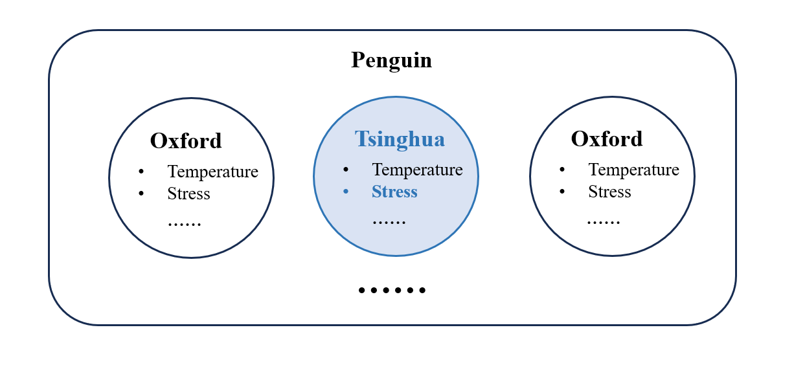
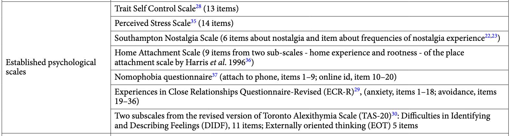
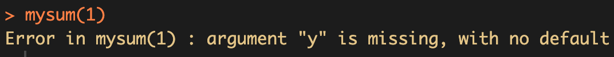
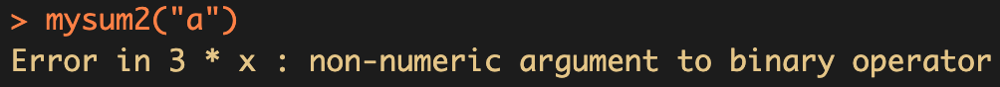

class: center, middle
<span style="font-size: 60px;">第五讲</span> <br>
<span style="font-size: 60px;">了解R语言中的对象(二)</span> <br>
<br>
<span style="font-size: 30px;">胡传鹏</span> <br>
<span style="font-size: 30px;">`r Sys.Date()`</span> <br>

---
<br>
<br>
# <h1 lang="zh-CN">回顾</h1>
# <h2 lang="zh-CN">&emsp;4.1 数据导入</h2>
# <h2 lang="zh-CN">&emsp;4.2 赋值</h2>
# <h2 lang="zh-CN">&emsp;4.3 数据类型及其操做</h2>
# <h2 lang="zh-CN">&emsp;4.4 数据结构</h2>
<br>
<br>
# <h1 lang="zh-CN">本节课内容</h1>
# <h2 lang="zh-CN">&emsp;5.1 通过操纵R中的对象来了解数据</h2>
# <h2 lang="zh-CN">&emsp;5.2 了解用来操纵R对象的对：函数</h2>

---
# <h1 lang="zh-CN">回顾：数据导入</h1>
# <font size = 5.5> 问卷数据：Human Penguin Project </font> 
- # <font size = 5.5> 绝对路径:对文件或目录位置的完整描述，从根目录开始 </font>

```{r 5.1 absolute path}
paste(getwd(),"/data/penguin/penguin_rawdata.csv",sep = "")
```
- # <font size = 5.5> 相对路径:对文件或目录位置的部分描述，从当前工作目录开始。 </font>
"data/penguin/penguin_rawdata.csv"
- # <font size = 5.5> 工作目录 </font>

```{r 5.1 relative path}
getwd() # 获取工作目录
```
--
- # <font size = 5.5>绝对路径=工作目录+相对路径</font>
- # <font size = 5.5>推荐使用相对路径</font>
---
```{r 5.1 R package}
# 可以将清华的镜像设置为下载的镜像
# options(repos = c(CRAN = "https://mirrors.tuna.tsinghua.edu.cn/CRAN/"))
#下载、导入所需R包
if (!requireNamespace('pacman', quietly = TRUE)) {
    install.packages('pacman')
}
pacman::p_load(bruceR,tidyverse)
```

```{r 5.1 load data}
# 读取数据
# 当前工作目录为R4Psy,依次打开'data''penguin'文件夹获取'penguin_rawdata.csv'数据
penguin_data <- bruceR::import(here::here('data', 'penguin', 'penguin_rawdata.csv'))

# 仅用基础包的做法：
# penguin_data <- read.csv('./data/penguin/penguin_rawdata.csv')
```
--
<br>
---
# <h1 lang="zh-CN">回顾：数据结构</h1>
数据结构是为了便于存储相同或不同类型的数据而设计的数据容器。<br>
常用数据结构<br>
&emsp;存放同类型数据：向量(Vector),矩阵(Matrix),多维数组(Array)<br>
&emsp;存放不同类型数据：列表(List)、数据框(Data Frame)<br>
&emsp;因子(Factor)<br>

---
# <h1 lang="zh-CN">回顾: 数据结构</h1>

心理学研究中将数据分为：定量数据（数值型）、定性数据（分类型）；定性数据又可分为名义型（无好坏顺序之分，如性别）、有序型（有好坏顺序之分，如疗效）。<br>
<br>
R 提供了因子(factor)这一数据类型，专门用来存放名义型和有序型的分类变量。<br>
<br>

直接用字符向量也可以表示分类变量，但它只有字母顺序，不能规定想要的顺序，也不能表达有序分类变量。<br>
--

```{r 5.4 factor1}
x <- c('good','better','best','bad','worse','worst')
sort(x) # 排序
```
只会按照字母顺序排序

--

```{r 5.4 factor2}
x1 <- factor(x, levels = c('best','better','good','bad','worse','worst'))
sort(x1) # 排序
```

转化为因子之后可按照设置的方式排序
---
# <h1 lang="zh-CN">回顾: 数据的索引 </h1>
## 索引<br>
--
<font size = 5>
-   数字索引</font>  

```{r 5.4 index1}
# 选取前 2 行以及前 3 列数据
penguin_data[1:2,1:3]

# 也可以使用减号
penguin_data[1:2,-c(4:ncol(penguin_data))]

# 取最后三列
penguin_data[1:2, (ncol(penguin_data)-2):ncol(penguin_data)]
```

<font size = 5>
-   名称索引</font>  

```{r 5.4 index2}
# 同样选取前 2 行以及前 4 列数据
penguin_data[1:2, c('age','ALEX1','ALEX2')]
```

---
# <h1 lang="zh-CN">回顾: 数据结构</h1>
## 小练习
<font size = 5>
尝试把以下表格中的内容创建为数据框，并把第一列改为因子


```{r 5.4 exercise}
# gender <- c(***)
# gender1 <- ***
# score <- c(***)
# letter <- c(***)
# logic <- c(***)
# data <- ***(***)

#将“***”部分替换为适合的代码，并删去行首的“#”,即可运行
```


---
<br>

<font size = 5> 疑问: 为什么我们要了解这些关于数据操纵的细节？</font>
<br>

--
<font size = 5> 回答：因为数据分析就是不断地重复这些基本的操作！</font>

<br>
--

## 假设的问题： 

- #  <font size = 5.5> 了解Human Penguin Project数据中，**清华站点**数据的**主观压力(Perceived Stress Scale)**情况 </font>


---
- # <font size = 5.5> 第一步: 导入 “penguin_rawdata.csv” </font> 

- # <font size = 5.5> 第二步: 从中选取 “Tsinghua” 站点选择数据计算主观压力得分  </font>


---
# <h1 lang="zh-CN">5.1 了解数据</h1>

- # <font size = 5.5> 从中选取 “Tsinghua” 站点选择数据计算主观压力得分  </font>

--
<br>
- ## <font size = 5.0> (1): 选择主观压力(Perceived Stress Scale)条目的列；</font>
<br>
- ## <font size = 5.0> (2): 选择"Tsinghua”这个站点的行;</font>
<br>
- ## <font size = 5.0> (3): 计算每个被试"stress"的总分;</font>
<br>
- ## <font size = 5.0> (4): 计算所有被试的"stress"总分的均值与标准差.</font>
      <br>
      
---
# <h1 lang="zh-CN">5.1 了解数据</h1>

- # <font size = 5.5> 从中选取 “Tsinghua” 站点选择数据计算主观压力得分  </font>
<br>
- ## <font size = 5.0> (1): 选择主观压力(Perceived Stress Scale)条目的列；</font>
      - ### <font size = 4.0> 数据框中**列**的索引: 位置、列名、列名字符匹配 </font>
<br>
- ## <font size = 5.0> (2): 选择"Tsinghua”这个站点的行;</font>
      - ### <font size = 4.0> 数据框中**行**的索引: 位置、列名、列名字符匹配 </font>
<br>
- ## <font size = 5.0> (3): 计算每个被试"stress"的总分;</font>
      - ### <font size = 4.0> 以**行**为单位的运算，得到新的列 </font>
<br>
- ## <font size = 5.0> (4): 计算所有被试的"stress"总分的均值与标准差.</font>
      - ### <font size = 4.0> 以新的总分**列**为单位的运算 </font>
      <br>
---
# <h1 lang="zh-CN"> (1): 选择主观压力(Perceived Stress Scale)条目的列；</h1>

- #  <font size = 5> 了解**主观压力(Perceived Stress Scale)**测量及其位置/列名 </font>


--
-   <font size = 5> 用colnames()函数查看数据集的列名的特点 </font>

```{r 5 colnames}
# colnames(penguin_data)

# 删去行首的“#”，运行改行代码
```

---
# <h1 lang="zh-CN"> (1): 选择主观压力(Perceived Stress Scale)条目的列；</h1>
<br>
-   <font size = 5> 用数字索引或名称索引选取“Site”、 “stress1” 到 “stress14”等列的变量，赋值给新变量“stress_data” </font>

```{r 5.2.1 select by name or index}
# stress_data <- penguin_data[***,***]
# stress_data <- penguin_data[ ,c(‘***’)]

#将“***”部分替换为适合的代码，并删去行首的“#”,即可运行
```

---
# <h1 lang="zh-CN"> (1): 选择主观压力(Perceived Stress Scale)条目的列；</h1>
<br>
-   <font size = 5> 压力的列名有规律: “stress1”, “stress2”, ...。能否使用规律？ </font>

--
# <font size = 5> 逻辑值索引，将符合特定条件的列选择出来 </font>

--
# <font size = 5> 这就需要对比较运算和逻辑运算进行简单复习 </font>
-   <font size = 4.5> 比较运算：>、<、>=、<=、==、!= </font>
-   <font size = 4.5> 逻辑运算： 且(&)、或(|)、非(!)、%in%(属于) </font>

## 比较运算:>、<、>=、<=、==、!=


---
# <h1 lang="zh-CN"> (1): 选择主观压力(Perceived Stress Scale)条目的列；</h1>

<font size = 5> 当对字符进行比较运算时，是否匹配的问题还可以分为完全匹配、部分匹配</font>

```{r 5.2.2 comparision}
#完全匹配
'c' %in% c('abc','cd','c')
#部分匹配
base::grepl('c',c('abc','cd','c'))
#部分匹配之开头匹配
base::startsWith(c('abc','cd','c'),'c')
#部分匹配之结尾匹配
base::endsWith(c('abc','cd','c'),'c')
          
```

---
# <h1 lang="zh-CN"> (1): 选择主观压力(Perceived Stress Scale)条目的列；</h1>
<br>
-   <font size = 5> 压力的列名有规律: “stress1”, “stress2”, ...。能否使用规律？ </font>

--
# <font size = 5> 使用字符的部分匹配将以"stress"开头的列选择出来 </font>

```{r 5.2.1 select by string}
# stress_data <- penguin_data[***,***]
selected_cols <- c('Site', colnames(penguin_data)[base::startsWith(colnames(penguin_data),'stress')])

stress_data <- penguin_data[ , selected_cols]

# alternative, 注意，grep返回的是列的序号
stress_data <- penguin_data[ , c(1, grep("^stress", names(penguin_data)))]

#将“***”部分替换为适合的代码，并删去行首的“#”,即可运行
```

# <font size = 5.5> 数据的选择中有多种方式达到同一目标 </font>

---
# <h1 lang="zh-CN"> (2): 选择"Tsinghua”这个站点的行</h1>

# <font size = 5> 使用字符的匹配将"Site"列中取值为"Tsinghua"的列选择出来 </font>

```{r select rows}
stress_data_thu <- stress_data[stress_data$Site == 'Tsinghua', ]
```

---
# <h1 lang="zh-CN"> (3): 计算每个被试"stress"的总分</h1>

# <font size = 5> 对数据的操纵 </font>
## 数学运算:+ - * / ^(加、减、乘、除、求幂)等

```{r 5.5 math with vector}
c(1:5) ^ 2
c(1:5) * c(6:10)
```

---
# <h1 lang="zh-CN"> (3): 计算每个被试"stress"的总分</h1>


```{r 5.5 row sum}
stress_data_thu$stress_sum <- rowSums(stress_data_thu[,grep("^stress", names(stress_data_thu))])
```


---
# <h1 lang="zh-CN"> (4): 计算所有被试的"stress"总分的均值与标准差</h1>


```{r 5.5 mean and SD}
mean(stress_data_thu$stress_sum, na.rm = TRUE)

sd(stress_data_thu$stress_sum, na.rm = TRUE)
          
```

---
# <h1 lang="zh-CN">了解R的对象是达成数据分析目的的基础</h1>

- # <font size = 5.5> 从中选取 “Tsinghua” 站点选择数据计算主观压力得分  </font>
<br>
- ## <font size = 5.0> (1): 选择主观压力(Perceived Stress Scale)条目的列；</font>
      - ### <font size = 4.0> 数据框中**列**的索引: 位置、列名、列名字符匹配 </font>
<br>
- ## <font size = 5.0> (2): 选择"Tsinghua”这个站点的行;</font>
      - ### <font size = 4.0> 数据框中**行**的索引: 位置、列名、列名字符匹配 </font>
<br>
- ## <font size = 5.0> (3): 计算每个被试"stress"的总分;</font>
      - ### <font size = 4.0> 以**行**为单位的运算，得到新的列 </font>
<br>
- ## <font size = 5.0> (4): 计算所有被试的"stress"总分的均值与标准差.</font>
      - ### <font size = 4.0> 以新的总分**列**为单位的运算 </font>
      <br>


---
# <h1 lang="zh-CN">5.2数据类型的判断与转换</h1>
## 数据类型的判断:is族函数

```{r 5.6 is}
is.numeric(1.0)#判断是否为数值型
is.numeric('a')
is.character(c('a','b'))#判断是否为字符型
is.complex(1+1i)#判断是否为复数型
is.null(NULL)#判断是否为null值
is.na(c(1,NA))#判断是否为NA值
```

---
# <h1 lang="zh-CN">5.2 数据类型的判断与转换</h1>
## 数据类型的转化:as族函数
<font size = 5> 转化为数值：as.numeric

```{r 5.6 as1}
as.numeric(c('1','2','3'))
as.numeric(c('1','2','a'))
as.numeric(c(T,F))
```

---
# <h1 lang="zh-CN">5.2 数据类型的判断与转换</h1>
## 数据类型的转化
<font size = 5> 转化为字符串：as.character

```{r 5.6 as2}
as.character(c(1,2,3))
as.character(c(T,F))
as.character(as.numeric(c('1','2','3')))
```

---
# <h1 lang="zh-CN">5.2 数据类型的判断与转换</h1>
## 数据类型的转化
<font size = 5> 转化为因子(factor)：factor<br>
R中用因子代表数据中分类变量, 如性别、省份、职业。

```{r 5.6 factor}
class(penguin_data$sex)
unique(penguin_data$sex)
sex1 <- factor(penguin_data$sex,levels = c(1,2),labels = c('male','female'))
unique(sex1)
```

---
# <h1 lang="zh-CN">5.3 函数</h1>
## 什么是函数
<font size=5>
&emsp;&emsp;sqrt()、getwd()、here()、mean()等都是R中的函数。
<br>
&emsp;&emsp;在R中，函数是一种用于执行特定任务或计算的代码块。函数接受输入参数，执行特定的操作，并返回结果。
</font>
<br>
--
## 函数求助
<font size=5>
&emsp;&emsp;如果我们不知道一个函数是什么，有什么用处。在R中，我们可以在Console中使用“?函数名”来打开帮助文档。
--
</font><br>

---
# <h1 lang="zh-CN">5.7 函数</h1>
## 函数示例

---
# <h1 lang="zh-CN">5.7 函数</h1>
## 函数示例

<font size = 5>
参数可以分为形式参数和实际参数。这里给出的是形式参数，实际运行中输入的值为实际参数。（举例：求函数y(x)在x=2时的值，x为形式参数，2为实际参数。）
---
# <h1 lang="zh-CN">5.7 函数</h1>
## 函数示例

---
# <h1 lang="zh-CN">5.7 函数</h1>
## 函数调用
<font size=5>
-首先需要下载函数所在的R包（部分R包在下载R时已经自动下载）<br>
&emsp;&emsp;install.pcakages("R包名称")<br>
-然后需要加载R包<br>
&emsp;&emsp;library(R包名称)<br>
-已下载的R包，也可以直接 R包::函数名称 来调用函数<br>

-不同的R包中可能会有相同的函数名，为了避免调用错误，推荐使用：R包::函数名称<br>
---
# <h1 lang="zh-CN">5.7 函数</h1>
## 函数调用

<font size = 5>
未加载时不能直接调用函数
--

```{r}
here::here()#::左边的here指名为here的R包，::右边的here指这个包中名为here的函数
library(here)
here()
```

---
# <h1 lang="zh-CN">5.7 函数</h1>
## 函数调用

```{r 5.7 read.csv}
df.pg.raw <- utils::read.csv(file = './data/penguin/penguin_rawdata.csv',
                       header = T, 
                       sep=",",
                       stringsAsFactors = FALSE) 
```

&emsp;&emsp;df.pg.raw 变量名 <br>
&emsp;&emsp;utils 函数所在的R包 <br>
&emsp;&emsp;read.csv 函数名 <br>
&emsp;&emsp;file 参数：文件路径 <br>
&emsp;&emsp;header 参数：是否将第一行作为列名 <br>
&emsp;&emsp;sep 参数：指定分隔符 <br>
&emsp;&emsp;stringsAsFactors 参数：是否将字符型数据转化为因子 <br>
--
<br>
<br>
<font size = 5>
参数可分为形式参数（简称形参）和实际参数（简称实参）<br>
file = './data/penguin/penguin_rawdata.csv':<br>
&emsp;&emsp;file为形参<br>
&emsp;&emsp;'./data/penguin/penguin_rawdata.csv'为实参<br>


---
# <h1 lang="zh-CN">5.7 函数</h1>
## 函数分类
<font size=5>
已有函数<br>
&emsp;&emsp;R base; <br>
&emsp;&emsp;R packages; <br>
&emsp;&emsp;functions from other sources<br>
--
<font size=5>
自定义函数<br>
&emsp;&emsp;自己命名和创建函数

---
# <h1 lang="zh-CN">5.7 函数</h1>
## 自定义函数
<font size = 5>
函数定义通常由以下几个部分组成：<br>
&emsp;-函数名: 为函数指定一个唯一的名称，以便在调用时使用。<br>
&emsp;-参数: 定义函数接受的输入值。参数是可选的，可以有多个。<br>
&emsp;-函数体: 包含实际执行的代码块，用大括号 {} 括起来。<br>
&emsp;-返回值: 指定函数的输出结果，使用关键字return。<br>
--

```{r 5.7 mysum}
#定义一个函数：输入x和y，返回3倍x和5倍y的和
mysum <- function(x,y){
  result = 3*x+5*y
  return(result)
}
#mysum:自定义的函数名
#x,y:形式参数
#result = 3*x+5*y:函数体
#return(result):返回值

#调用函数,x=1,y=2
mysum(1,2)
mysum(y=1,x=2)
```

---
# <h1 lang="zh-CN">5.7 函数</h1>
## 自定义函数（小练习）
<font size = 5>
小练习：定义一个函数,输入值a,b,c,返回(a+b)/c;并计算abc分别为123时得到的值<br>

```{r 5.7 myabc}
#myabc <- function(***){
#  result = ***
#  return(***)
#}

#用合理的代码替换以上“***”,删除每行前的“#”,即可运行
```

---
# <h1 lang="zh-CN">5.7 函数</h1>
## 自定义函数
<font size = 5>
<br>我们定义的函数mysum需要输入x和y两个值，如果只输入一个会怎么样。
--

--
<font size = 5>
<br>在使用bruceR::import时，我们并没有输入所有参数，它依然可以运行，是因为它有默认值。

```{r}
mysum2 <- function(x = 6,y = 7){
  result = 3*x+5*y
  return(result)
}
mysum2()
mysum2(5)
```

---
# <h1 lang="zh-CN">5.7 函数</h1>
## 自定义函数(小练习)
<font size = 5>
小练习：<br>
&emsp;定义一个函数,输入值a,b,c,返回(a+b)/c;<br>
**&emsp;设置a、b、c的默认值为3、2、1<br>**


```{r 5.7 myabc2}
#myabc <- function(a = ***, b = ***, c = ***){
#  result = ***
#  return(***)
#}
#myabc(***)

#用合理的代码替换以上“***”,删除每行前的“#”,即可运行
```

---
# <h1 lang="zh-CN">5.7 函数</h1>
## 自定义函数
<font size = 5>
在学习数据类型时，我们提到字符型不能进行加减乘除等数学运算<br>
--

--
<font size = 5>
自定义函数时可以手动添加报错信息。<br>
只有在输入的内容符合要求时才可以正常运行，否则报错。<br>
此处判断是否符合要求本质上是一种逻辑判断。<br>
--

---
# <h1 lang="zh-CN">5.3 函数</h1>
## 自定义函数

```{r mysum3}
mysum3 <- function(x = 6,y = 7){
  if(is.numeric(x) == T & is.numeric(y) == T){
    result = 3*x+5*y
    return(result)}
  else{print("x and y must be number")}
}
#print：输出指定的内容
#is.numeric:判断是否为数值型。是则返回T，否则返回F
# & : 表示“且”
mysum3(5,6)
mysum3('a','b')
```

---
# <h1 lang="zh-CN">5.3 函数</h1>
## 自定义函数(小练习)
<font size = 5>
小练习：<br>
&emsp;定义一个函数,输入值a,b,c,返回(a+b)/c;<br>
&emsp;设置a、b、c的默认值为3、2、1;<br>
**&emsp;当c为0时报错“c should not be 0”**

```{r 5 myabc3}
#myabc <- function(***){
#  if(***){
#    result = ***
#    return(***)
#  }
#  else{print(***)}
#}

#用合理的代码替换以上“***”,删除每行前的“#”,即可运行
```

---
# <h1 lang="zh-CN">5.3 函数</h1>
## 自定义函数(小练习)
```{r myabc4}
#示例
myabc <- function(a = 3, b = 2, c = 1){
  if(c!=0){
    result = (a+b)/c
    return(result)
  }
  else{print('c should not be 0')}
}
```


