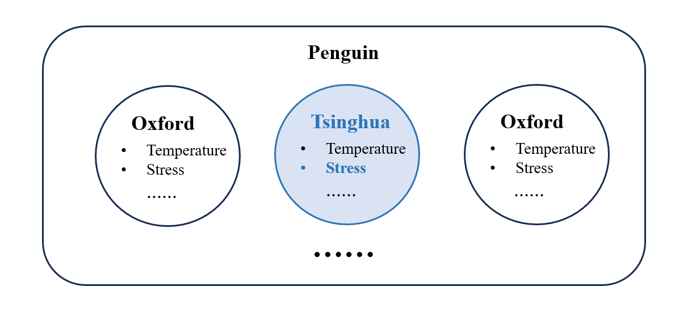
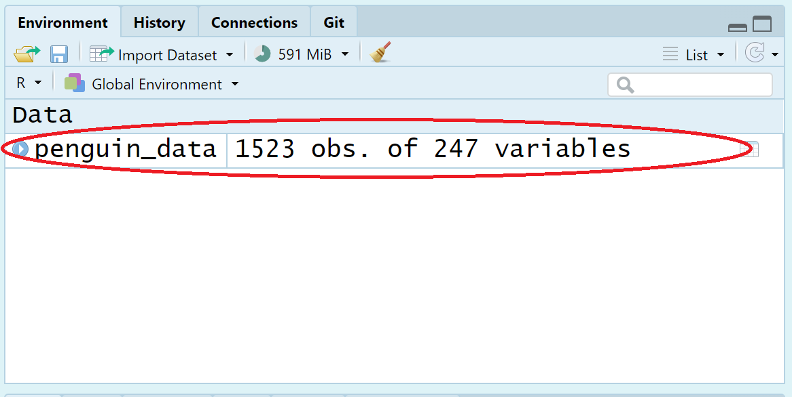
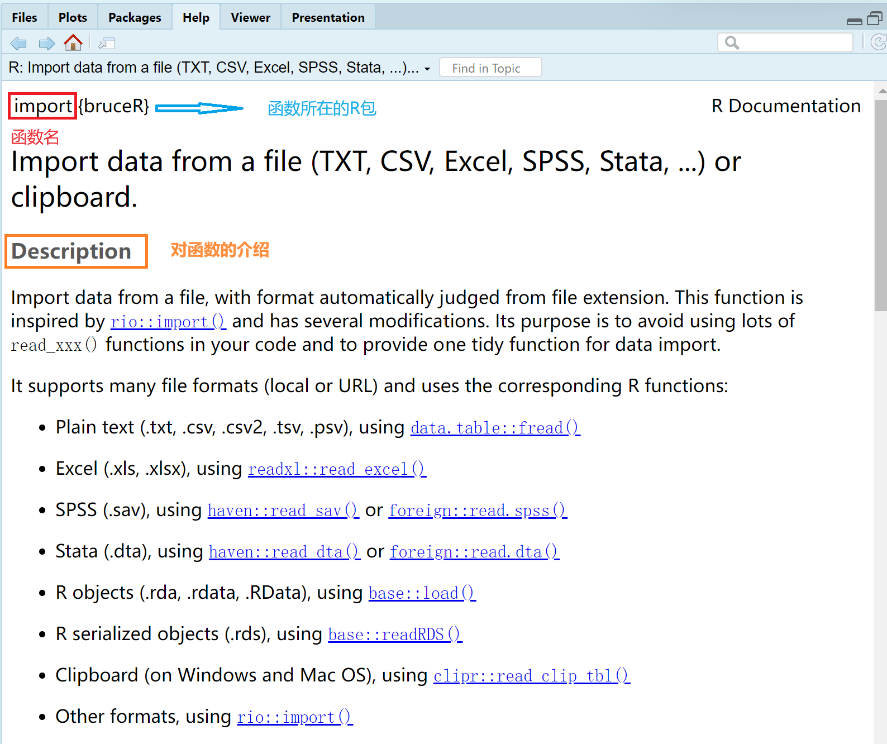
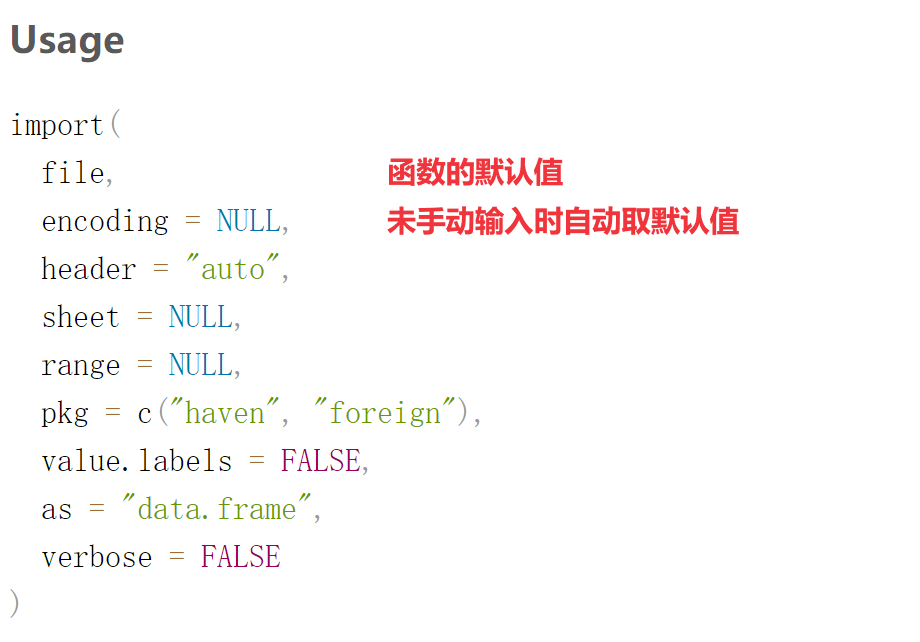

class: center, middle
<span style="font-size: 60px;">第五讲</span> <br>
<span style="font-size: 60px;">R语言中的对象2: 函数</span> <br>
<br>
<span style="font-size: 30px;">胡传鹏</span> <br>
<span style="font-size: 30px;">`r Sys.Date()`</span> <br>

---
<br>
<br>
# <h1 lang="zh-CN">回顾</h1>
# <h2 lang="zh-CN">&emsp;5.1 数据导入与赋值</h2>
# <h2 lang="zh-CN">&emsp;5.2 对数据进行选取</h2>
<br>
<br>
# <h1 lang="zh-CN">本节课内容</h1>
# <h2 lang="zh-CN">&emsp;5.3 数据类型的判断与转换</h2>
# <h2 lang="zh-CN">&emsp;5.4 数据间的运算</h2>
# <h2 lang="zh-CN">&emsp;5.5 函数</h2>

---
# 5.0 问题与回顾

<br>

##  问题: 

- # <font size = 5.5> penguin 这一数据集中，包含来自多个站点的、多个变量的数据 </font>

- #  <font size = 5.5> 我们想要研究**清华站点**所收集样本在**压力**方面的体现 </font>




---
##  回顾：
- # <font size = 5.5> 导入 “penguin_rawdata.csv” </font> 

- # <font size = 5.5> 从中选取 “Tsinghua” 站点的 “stress” 变量  </font>


--
##  本节课内容：
- # <font size = 5.5> 将所选变量转化为我们需要的数据类型(*double* / *int*) </font> 

- # <font size = 5.5> 对所选变量进行初步统计计算 </font>


---
# <h1 lang="zh-CN">5.1 数据导入与赋值</h1>

# <font size = 5.5> **首先，我们需要导入全部的问卷数据：Human Penguin Project** </font>

<!-- ##### -->
<!-- ##### -->
<!-- 这一步在上一课详细讲述了，因此进行了简述 -->
<!-- ##### -->
<!-- ##### -->

-   <font size=5.5> 利用上节课学习的代码读取数据，并赋值给 “penguin_data” </font>
```{r 5.1 Read_first_csv}
# 读取数据,命名为penguin_data
penguin_data <- bruceR::import(here::here('data', 'penguin', 'penguin_rawdata.csv'))#当前工作目录为R4Psy,依次打开'data''penguin'文件夹获取'penguin_rawdata.csv'数据
```

--
<br>
-   <font size=5.5> 如何确定数据导入成功？</font>
-   <font size=5.5> Environment 中会显示已经创建好的变量 </font>

其中 “obs.” 表示数据集共有多少列(被试数量)，“variables” 表示数据共有多少行(变量数量)

<br>

---
# <h1 lang="zh-CN">5.2 对数据进行选取</h1>

# <font size = 5.5> **可以进一步筛选数据，将其范围缩小到特定的被试(行)或变量(列)** </font>

--
# <font size = 5.5> 这需要用到我们上节课学习的索引 </font>
-   <font size = 5> 中括号索引</font>  
-   <font size = 5> 逻辑值索引</font>  

---
## 5.2.1 数据索引(中括号)

# <font size = 5> 确定变量名称或所在的行列时，可采用中括号索引**(data[row,col])** </font>  

--
-   <font size = 5> 数字索引</font>  

```{r 5.2.1 index1.1}
# 选取前 2 行以及前 3 列数据
penguin_data[1:2,1:3]
# 也可以使用减号
penguin_data[1:2,-c(4:ncol(penguin_data))]
```

--
<br>TIP：索引值为空(没有索引值)时会返回完整的原始向量
```{r 5.2.1 index1.2}
# 选取前 3 列数据
head(penguin_data[ ,1:3])
```

---
## 5.2.1 数据索引(中括号)

# <font size = 5> 确定变量名称或所在的行列时，可采用中括号索引**(data[row,col])** </font>  

--
-   <font size = 5> 名称索引</font>  

```{r 5.2.1 index2.1}
# 同样选取前 2 行以及前 3 列数据
penguin_data[1:2,c('age','ALEX1','ALEX2')]
```

--
<br>TIP：输入字符串每次都要打很多引号会非常麻烦，因此可以使用bruceR::cc()，只需在首尾写冒号：
```{r 5.2.1 index2.2}
c('age','ALEX1','ALEX2') == bruceR::cc('age,ALEX1,ALEX2')
```

---
## 5.2.1 数据索引(中括号)

# <font size = 5.5> **小练习**：在 “penguin_data” 中，“stress” 这一变量的名称和所在的列可以确定，因此可以尝试用中括号索引对其进行选取 </font>

--
-   <font size = 5> 首先可以colnames()函数查看数据集的列名称 </font>
```{r 5.2.1 exercise_step1}
#colnames(penguin_data)

#删去行首的“#”，运行改行代码
```

--
<br>
-   <font size = 5> 在确定名称或所在的列后，用数字索引或名称索引选取“Site”、 “stress1” 到 “stress14”等列的变量，赋值给新变量“stress_data” </font>
```{r 5.2.1 exercise_step2}
# stress_data <- penguin_data[***,***]
# stress_data <- penguin_data[ ,bruceR::cc(‘***’)]

#将“***”部分替换为适合的代码，并删去行首的“#”,即可运行
```

---
## 5.2.2 数据索引(逻辑值)

# <font size = 5> **但有时也存在无法确定变量名称或所在的行列的情况(e.g. 如何筛选出所有来自清华站点的样本？)** </font> 

<!-- ##### -->
<!-- ##### -->
<!-- 需要筛选出所有变量“site”为“Tsinghua”的被试，较难对应到具体某一行或某几行 -->
<!-- ##### -->
<!-- ##### -->

--
# <font size = 5> 此时可以采用逻辑值索引，根据条件对数据进行筛选 </font>

--
# <font size = 5> 这就需要对比较运算和逻辑运算进行简单复习 </font>
-   <font size = 5> 比较运算：>、<、>=、<=、==、!= </font>
-   <font size = 5> 逻辑运算： 且(&)、或(|)、非(!)、%in%(属于) </font>

---
## 5.2.2 数据索引(逻辑值)
## 比较运算:>、<、>=、<=、==、!=


---
# 5.2.2 数据索引(逻辑值)
## 比较运算:>、<、>=、<=、==、!=
TIP：当对字符进行比较运算时，是否匹配的问题还可以具体为是否完全匹配、是否部分匹配

```{r 5.2.2 comparision}
#完全匹配
'c' %in% c('abc','cd','c')
#部分匹配
base::grepl('c',c('abc','cd','c'))
#部分匹配之开头匹配
base::startsWith(c('abc','cd','c'),'c')
#部分匹配之结尾匹配
base::endsWith(c('abc','cd','c'),'c')
          
```

---
## 5.2.2 数据索引(逻辑值)
## 逻辑运算： 且(&)、或(|)、非(!)、%in%(属于)

```{r 5.2.1 logical1}
!1
!0
1 & 0
11 | 0
T & F
!T
```

---
## 5.2.2 数据索引(逻辑值)
## 逻辑运算： 且(&)、或(|)、非(!)、%in%(属于)

```{r 5.2.2 logical2}
c(T,F,F) | T
c(T,F,F) | F
c(T,F) %in% c(T)
c(1,2) & c(0,1)
```

---
# 5.2.2 数据索引(逻辑值)

# <font size = 5> **但有时也存在无法确定变量名称或所在的行列的情况(e.g. 如何筛选出所有来自清华站点的样本？)** </font> 

<!-- ##### -->
<!-- ##### -->
<!-- 需要筛选出所有变量“site”为“Tsinghua”的被试，较难对应到具体某一行或某几行 -->
<!-- ##### -->
<!-- ##### -->

--
# <font size = 5> 此时可以采用逻辑值索引，根据条件对数据进行筛选： </font>
```{r 5.2.2 index1}
## 输出逻辑值
head(penguin_data$age >1980)
```

```{r 5.2.2 index2}
## 筛选出生年份大于 1980 且(&)小于 1990 的数据
agedata <- penguin_data[
  penguin_data$age >1980 & 
  penguin_data$age < 1990 ,]
unique(agedata$age)

## 逻辑运算： 且(&)、或(|)、非(!)、%in%(属于)
```

---
## 5.2.2 数据索引(逻辑值)

# <font size = 5.5> **小练习**：在 “stress_data” 中，可以尝试用逻辑值索引进一步筛选站点为清华的数据，赋值给“ThuStress_data" </font>

--
-   <font size = 5> 首先，可以用 “==” 选出 “Site” 这一变量中值为 “Tsinghua” 的样本 </font>
```{r 5.2.2 exercise_method1}
#ThuStress_data <- stress_data[stress_data$Site == '***',]

#将“***”部分替换为适合的代码，并删去行首的“#”,即可运行
```

--
<br>
-   <font size = 5> 也可以采用%in%逻辑运算来进行这一步骤 </font>
```{r 5.2.1 exercise_method2}
#a %in% b 表示向量a中有多少元素属于向量b
#ThuStress_data2 <- stress_data[stress_data$Site %in% c('***'),]

#比较与前一种方法生成的“ThuStress_data”是否一致 
#ThuStress_data == ThuStress_data2
#将“***”部分替换为适合的代码，并删去行首的“#”,即可运行
```

---
# <h1 lang="zh-CN">5.3 数据类型的判断与转换</h1>

# <font size = 5.5> **在得到我们需要的数据集 “ThuStress_data” 后，需要确定其数据类型** </font>

--
# <font size = 5.5> 在上节课中，我们学到了数据可以分为以下几种类型 </font>
-   <font size = 5> numeric（数值型），又分为 integer（整数型）和 double（浮点型）</font>
-   <font size = 5> logical（逻辑型），只有 TRUE 和 FALSE，或 T 和 F </font>
-   <font size = 5> character（字符型），引号括起来的若干字符 </font>
-   <font size = 5> complex（复数类型），复数 </font>
-   <font size = 5> raw（原始型），用于存储原始字节数据 </font>

--
# <font size = 5.5> 如何确定我们数据集的变量属于哪种类型呢，存在两种方法： </font>
-   <font size = 5> 使用str()函数直接查看</font>  
-   <font size = 5> 使用is族函数进行判断</font> 

---

## 5.3.1 数据类型的判断
## str()函数

```{r 5.3.1 str}
str(penguin_data)
```

---
## 5.3.1 数据类型的判断
## is族函数

```{r 5.3.1 is}
is.numeric(1.0)#判断是否为数值型
is.numeric('a')
is.character(c('a','b'))#判断是否为字符型
is.complex(1+1i)#判断是否为复数型
is.null(NULL)#判断是否为null值
is.na(c(1,NA))#判断是否为NA值
```

---
# <h1 lang="zh-CN">5.3 数据类型的判断与转换</h1>

# <font size = 5.5> **如果数据集 “ThuStress_data” 中的数据不是我们需要的类型(*double* / *int*)，还需要对其数据类型进行转化** </font>

--
# <font size = 5.5> 此时，可以使用as函数 </font>
-   <font size = 5> 转化为数值：as.numeric </font>  
-   <font size = 5> 转化为字符串：as.character </font>

---
## 5.3.2 数据类型的转化
## 转化为数值：as.numeric

```{r 5.6 as1}
as.numeric(c('1','2','3'))
as.numeric(c('1','2','a'))
as.numeric(c(T,F))
```

---
## 5.3.2 数据类型的转化
## 转化为字符串：as.character

```{r 5.6 as2}
as.character(c(1,2,3))
as.character(c(T,F))
as.character(as.numeric(c('1','2','3')))
```

---
# <h1 lang="zh-CN">5.3 数据类型的判断与转换</h1>

# <font size = 5.5> **小练习**：判断 “ThuStress_data" 中的 “stress” 的数据是否为我们需要的类型(*double* / *int*)，如果不是，对其进行转化</font>

--
-   <font size = 5> 首先，可以使用str()函数或is族函数进行数据类型的判断 </font>
```{r 5.3 exercise_step1}
#str(ThuStress_data)
#is.***(***) #请注意，此时需要选择“ThuStress_data”中具体的列

#将“***”部分替换为适合的代码，并删去行首的“#”,即可运行
```

--
<br>

-   <font size = 5> 如果数据类型不符合要求，则可以使用as族函数对其进行转化 </font>
```{r 5.3 exercise_step2}
#col_num <- as.numeric(***) #将某列中的字符串数据转化为数值，赋值给col_num
#ThuStress_data$*** <- col_num #用转化为数值后的该列替换原本的该列

#能否尝试将上面两行代码在一行代码中实现？

#将“***”部分替换为适合的代码，并删去行首的“#”,即可运行
```

---
# <h1 lang="zh-CN">5.4 数据间的运算</h1>

# <font size = 5.5> **最后，当我们得到需要的数据集，确定其数据类型符合我们的需求后，还需要对其中的数据进行初步计算** </font>

--
-   <font size = 5> 这样的计算可能发生在一列数据内(e.g. 反向计分) </font>  
```{r 5.4 revert}
# 创建一个新列表
raw_data <- data.frame(x = c(1, 2, 2, 4, 3), y = c(2, 3, 4, 1, 5))
# 利用减法进行反向计分
revert <- rep(6, nrow(raw_data))
raw_data['x_revert'] <- revert - raw_data['x']
print(raw_data)
```

--
-   <font size = 5> 也可能发生在几列数据间(e.g. 计算总分) </font>  
```{r 5.4 total}
# 利用加法进行计算总分
raw_data['z'] <- raw_data['y'] + raw_data['x_revert']
print(raw_data)
```
<!-- ##### -->
<!-- ##### -->
<!-- 上述操作有更简单的实现方法，此处主要为了演示数据间的计算 -->
<!-- ##### -->
<!-- ##### -->

---
# <h1 lang="zh-CN">5.4 数据间的运算</h1>

# <font size = 5.5> **小练习**：对 “ThuStress_data" 中的 “stress_12” 进行反向计分，并计算"stress"的总分和平均分

--
-   <font size = 5> 反向计分：利用减法进行反向计分 </font>
```{r 5.4 exercise_step1}
#revert <- rep(***, ***）
#ThuStress_data['stress_12_revert'] <- *** - ***

#将“***”部分替换为适合的代码，并删去行首的“#”,即可运行
```

--
-   <font size = 5> 计算总分：利用加法进行总分的计算 </font>
```{r 5.4 exercise_step2}
#ThuStress_data['stress_total'] <- *** + *** 

#将“***”部分替换为适合的代码，并删去行首的“#”,即可运行
```

--
-   <font size = 5> 计算平均分：利用除法进行平均分的计算 </font>
```{r 5.4 exercise_step3}
#total_nume <- rep(14, nrow(ThuStress_data))
#ThuStress_data['stress_meanl'] <- *** / ****

#将“***”部分替换为适合的代码，并删去行首的“#”,即可运行
```

---
# <h1 lang="zh-CN">5.5 函数</h1>
## 什么是函数
<font size=5>
&emsp;&emsp;sqrt()、getwd()、here()等都是R中的函数。
<br>
&emsp;&emsp;在R中，函数是一种用于执行特定任务或计算的代码块。函数接受输入参数，执行特定的操作，并返回结果。
</font>
<br>
--
## 函数求助
<font size=5>
&emsp;&emsp;如果我们不知道一个函数是什么，有什么用处。在R中，我们可以在Console中使用“?函数名”来打开帮助文档。
--
</font><br>

---
# <h1 lang="zh-CN">5.5 函数</h1>
## 函数示例

---
# <h1 lang="zh-CN">5.5 函数</h1>
## 函数示例

<font size = 5>
参数可以分为形式参数和实际参数。这里给出的是形式参数，实际运行中输入的值为实际参数。（举例：求函数y(x)在x=2时的值，x为形式参数，2为实际参数。）
---
# <h1 lang="zh-CN">5.5 函数</h1>
## 函数示例

---
# <h1 lang="zh-CN">5.5 函数</h1>
## 函数调用
<font size=5>
-首先需要下载函数所在的R包（部分R包在下载R时已经自动下载）<br>
&emsp;&emsp;install.pcakages("R包名称")<br>
-然后需要加载R包<br>
&emsp;&emsp;library(R包名称)<br>
-已下载的R包，也可以直接 R包::函数名称 来调用函数<br>

-不同的R包中可能会有相同的函数名，为了避免调用错误，推荐使用：R包::函数名称<br>
---
# <h1 lang="zh-CN">5.5 函数</h1>
## 函数调用

<font size = 5>
未加载时不能直接调用函数
--

```{r}
here::here()#::左边的here指名为here的R包，::右边的here指这个包中名为here的函数
library(here)
here()
```

---
# <h1 lang="zh-CN">5.5 函数</h1>
## 函数调用

```{r 5.5 read.csv}
df.pg.raw <- utils::read.csv(file = './data/penguin/penguin_rawdata.csv',
                       header = T, 
                       sep=",",
                       stringsAsFactors = FALSE) 
```

&emsp;&emsp;df.pg.raw 变量名 <br>
&emsp;&emsp;utils 函数所在的R包 <br>
&emsp;&emsp;read.csv 函数名 <br>
&emsp;&emsp;file 参数：文件路径 <br>
&emsp;&emsp;header 参数：是否将第一行作为列名 <br>
&emsp;&emsp;sep 参数：指定分隔符 <br>
&emsp;&emsp;stringsAsFactors 参数：是否将字符型数据转化为因子 <br>
--
<br>
<br>
<font size = 5>
参数可分为形式参数（简称形参）和实际参数（简称实参）<br>
file = './data/penguin/penguin_rawdata.csv':<br>
&emsp;&emsp;file为形参<br>
&emsp;&emsp;'./data/penguin/penguin_rawdata.csv'为实参<br>


---
# <h1 lang="zh-CN">5.5 函数</h1>
## 函数分类
<font size=5>
已有函数<br>
&emsp;&emsp;R base; <br>
&emsp;&emsp;R packages; <br>
&emsp;&emsp;functions from other sources<br>
--
<font size=5>
自定义函数<br>
&emsp;&emsp;自己命名和创建函数

---
# <h1 lang="zh-CN">5.5 函数</h1>
## 自定义函数
<font size = 5>
函数定义通常由以下几个部分组成：<br>
&emsp;-函数名: 为函数指定一个唯一的名称，以便在调用时使用。<br>
&emsp;-参数: 定义函数接受的输入值。参数是可选的，可以有多个。<br>
&emsp;-函数体: 包含实际执行的代码块，用大括号 {} 括起来。<br>
&emsp;-返回值: 指定函数的输出结果，使用关键字return。<br>
--

```{r 5.5 mysum}
#定义一个函数：输入x和y，返回3倍x和5倍y的和
mysum <- function(x,y){
  result = 3*x+5*y
  return(result)
}
#mysum:自定义的函数名
#x,y:形式参数
#result = 3*x+5*y:函数体
#return(result):返回值

#调用函数,x=1,y=2
mysum(1,2)
mysum(y=1,x=2)
```

---
# <h1 lang="zh-CN">5.5 函数</h1>
## 自定义函数（小练习）
<font size = 5>
小练习：定义一个函数,输入值a,b,c,返回(a+b)/c;并计算abc分别为123时得到的值<br>

```{r 5.5 myabc}
#myabc <- function(***){
#  result = ***
#  return(***)
#}

#用合理的代码替换以上“***”,删除每行前的“#”,即可运行
```

---
# <h1 lang="zh-CN">5.5 函数</h1>
## 自定义函数
<font size = 5>
<br>我们定义的函数mysum需要输入x和y两个值，如果只输入一个会怎么样。
--

--
<font size = 5>
<br>在使用bruceR::import时，我们并没有输入所有参数，它依然可以运行，是因为它有默认值。

```{r}
mysum2 <- function(x = 6,y = 7){
  result = 3*x+5*y
  return(result)
}
mysum2()
mysum2(5)
```

---
# <h1 lang="zh-CN">5.7 函数</h1>
## 自定义函数(小练习)
<font size = 5>
小练习：<br>
&emsp;定义一个函数,输入值a,b,c,返回(a+b)/c;<br>
**&emsp;设置a、b、c的默认值为3、2、1<br>**


```{r 5.5 myabc2}
#myabc <- function(a = ***, b = ***, c = ***){
#  result = ***
#  return(***)
#}
#myabc(***)

#用合理的代码替换以上“***”,删除每行前的“#”,即可运行
```

---
# <h1 lang="zh-CN">5.5 函数</h1>
## 自定义函数
<font size = 5>
在学习数据类型时，我们提到字符型不能进行加减乘除等数学运算<br>
--

--
<font size = 5>
自定义函数时可以手动添加报错信息。<br>
只有在输入的内容符合要求时才可以正常运行，否则报错。<br>
此处判断是否符合要求本质上是一种逻辑判断。<br>
--

---
# <h1 lang="zh-CN">5.7 函数</h1>
## 自定义函数

```{r mysum3}
mysum3 <- function(x = 6,y = 7){
  if(is.numeric(x) == T & is.numeric(y) == T){
    result = 3*x+5*y
    return(result)}
  else{print("x and y must be number")}
}
#print：输出指定的内容
#is.numeric:判断是否为数值型。是则返回T，否则返回F
# & : 表示“且”
mysum3(5,6)
mysum3('a','b')
```

---
# <h1 lang="zh-CN">5.5 函数</h1>
## 自定义函数(小练习)
<font size = 5>
小练习：<br>
&emsp;定义一个函数,输入值a,b,c,返回(a+b)/c;<br>
&emsp;设置a、b、c的默认值为3、2、1;<br>
**&emsp;当c为0时报错“c should not be 0”**

```{r 5.7 myabc3}
#myabc <- function(***){
#  if(***){
#    result = ***
#    return(***)
#  }
#  else{print(***)}
#}

#用合理的代码替换以上“***”,删除每行前的“#”,即可运行
```

---
# <h1 lang="zh-CN">5.5 函数</h1>
## 自定义函数(小练习)
```{r myabc4}
#示例
myabc <- function(a = 3, b = 2, c = 1){
  if(c!=0){
    result = (a+b)/c
    return(result)
  }
  else{print('c should not be 0')}
}
```


