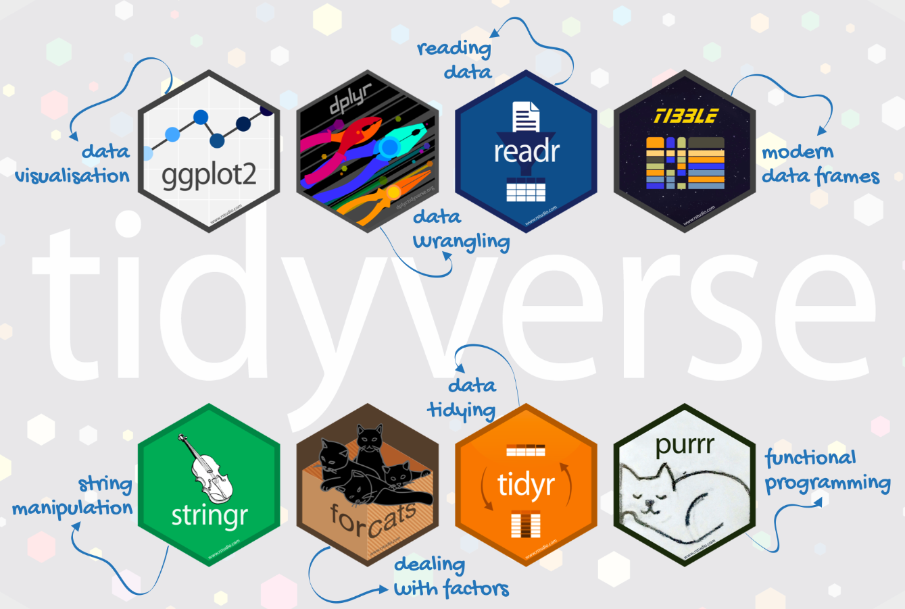
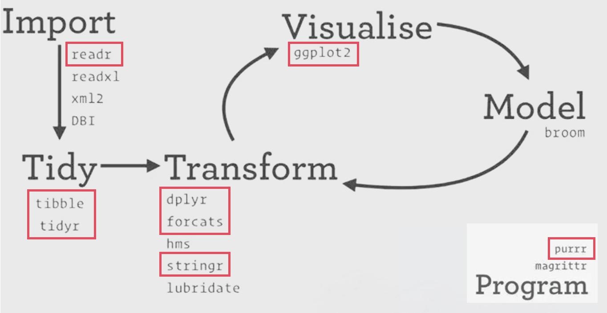
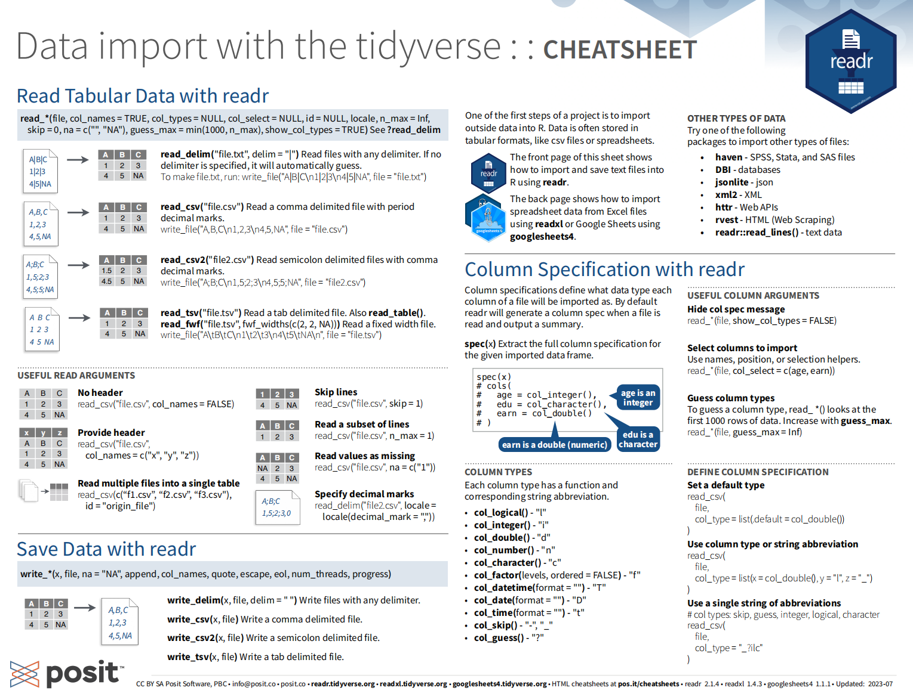
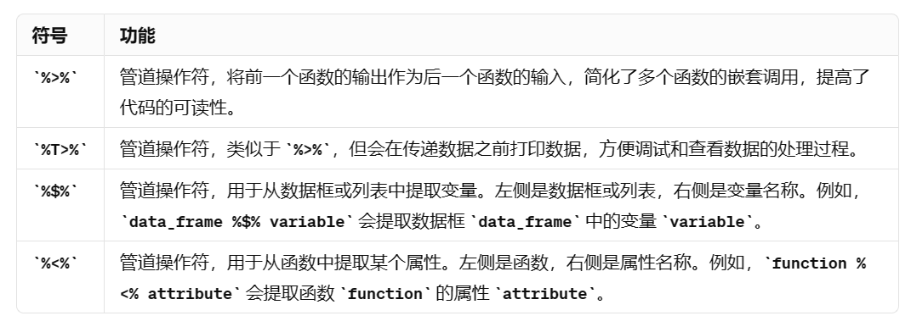
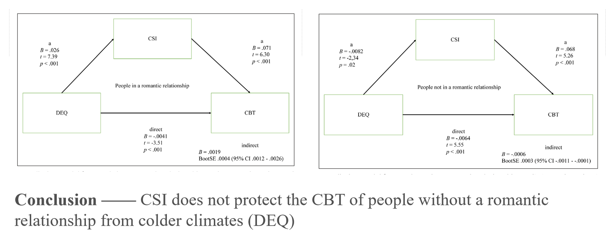
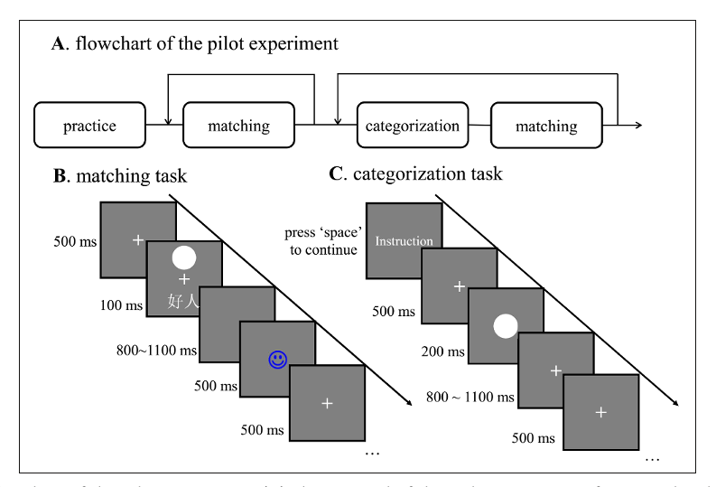
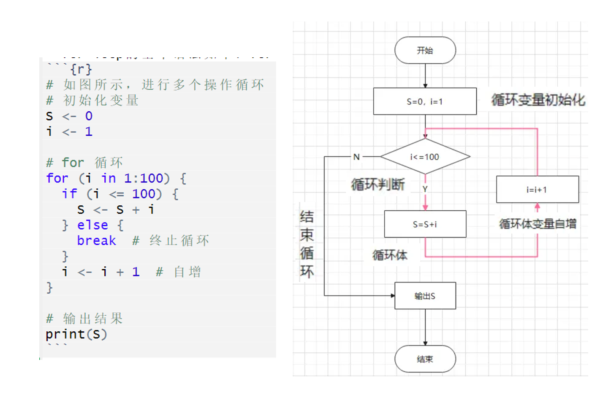

class: center, middle
<span style="font-size: 60px;">第六讲</span> <br>
<span style="font-size: 50px;">数据预处理</span> <br>
<br>
<br>
<span style="font-size: 30px;">胡传鹏</span> <br>
<span style="font-size: 30px;">2024/04/03</span> <br>
<br>
<br>
<br>
<br>
---
<h1 lang="en" style="font-size: 60px;">Contents</h1>
<br>
<br>
<span style="font-size: 45px;">6.1 Tidyverse</span></center> <br>
<br>
<span style="font-size: 45px;">6.2 问卷数据</span></center> <br>
<span style="font-size: 30px;">&emsp;6.2.1 研究问题 & 数据情况</span></center> <br>
<span style="font-size: 30px;">&emsp;6.2.2 操作步骤</span></center> <br>
<span style="font-size: 30px;">&emsp;6.2.3 小结</span></center> <br>
<br>
<span style="font-size: 45px;">6.3 反应时数据</span></center> <br>
<span style="font-size: 30px;">&emsp;6.3.1 研究问题 & 数据情况</span></center> <br>
<span style="font-size: 30px;">&emsp;6.3.2 操作步骤</span></center> <br>
<span style="font-size: 30px;">&emsp;6.3.3 小结</span></center> <br>
---
# <h1 lang="en">6.1 Tidyverse</h1>
<br>
<br>
- 本课程的数据预处理将基于tidyverse( https://www.tidyverse.org/ )，它是一个由8个多功能R包组成的连贯的系统。
- 核心包的具体功能如图所示。

---
# <h1 lang="en">6.1 Tidyverse</h1>
<br>
<br>
- workflow如图所示。

---
# <h1 lang="en">6.1 Tidyverse</h1>

- 可以通过搜索包的cheatsheet快速了解包的使用，图为readr的cheatsheet的部分截图。

---
# <h1 lang="en">6.1 Tidyverse</h1>
- **Tidyverse的优势在于这个系统中的R包共享一个底层设计哲学、语法和数据结构，具有高度的一致性。**
- **函数的第一个参数总是一个数据框**：这种设计使得函数的使用变得非常直观，用户总是先传入你要操作的数据，然后再指定要进行的操作。<br>
- **整洁数据的概念**：在Tidyverse中，一个整洁的数据框应该是每行代表一个观察值，每列代表一个变量的值。这种数据结构使得数据的操作和分析变得更加直接和简单。<br>
- **管道操作符**：最常用的管道操作符为%>%，它将一个函数的输出作为下一个函数的输入，可以将一系列的操作链接起来，从而形成一个数据处理的流水线。这种方式可以使得代码更加易读，也更容易理解每一步操作的含义。<br>
假设我们有一个数据集data，我们想要找到age大于30的所有行，并对其进行升序排序，代码如下：
```{r eval=FALSE}
filtered_data <- filter(data, age > 30)
filtered_sorted_data <- arrange(filtered_data, age)
```
使用管道操作符后，代码变为：
```{r eval=FALSE}
filtered_sorted_data <- data %>%
  filter(age > 30) %>%
  arrange(age)
```

---
# <h1 lang="en">6.1 Tidyverse</h1>
<br>
<br>
- tidyverse常见的管道符如表所示，依赖于magrittr包。<br>
- R 4.1以上版本加入了原生管道操作符|>，不再依赖R包。<br>

---
# <h1 lang="en">6.2 问卷数据</h1>
<span style="font-size: 30px;">6.2.1 研究问题 & 数据情况</span></center> <br>

- 研究问题：社会体温调节理论认为，现代人际关系是围绕体温调节组织的。复杂社会整合（Complex Social Integration, CSI）被定义为一个人参与的高接触角色的数量。研究发现，CSI是核心体温（Core Body Temperature, CBT）的关键预测指标，并且较冷的气候(Distance from equator, DEQ)与较高的CSI水平有关，而CSI又与较高的CBT（当气候变冷时）有关。这一效应受个体的恋爱情况(romantic)调节。最终建立了DEQ-CBT-CSI模型，如图所示(Izerman et al., 2018)。<br>
- 课程接下来会以重复这一研究的分析进行问卷数据分析的示例。

---
# <h1 lang="en">6.2 问卷数据</h1>
<span style="font-size: 30px;">6.2.1 研究问题 & 数据情况</span></center><br>
- 数据情况（通过data文件夹下的penguin_full_codebook可以查看详细情况）：<br>
CBT: 核心体温，测量两次，变量名为Temperature_t1, Temperature_t2<br>
CSI: 变量为SNI23-32，23-27为关系的种类，28-32为某种关系下每两周通话一次的关系数量<br>
DEQ: 距赤道的距离，变量名为DEQ<br>
romantic: 是否处于恋爱关系，1 = "yes", 2 = "no"<br>
ALEX: 述情障碍，为潜在的混淆变量，5点量表，变量为ALEX1-16，第4, 12, 14, 16题反向计分
```{r}
# 导入数据
penguin_data = bruceR::import(here::here('data', 'penguin', 'penguin_rawdata.csv'))
```

```{r eval=FALSE}
# 查看数据
colnames(penguin_data) #查看变量名（列名）
unique(penguin_data) #获取向量或数据框中唯一的元素或行
```

---
# <h1 lang="en">6.2 问卷数据</h1>
<span style="font-size: 30px;">6.2.2 操作步骤</span></center><br>
- 数据预处理目标：计算每一个变量的值，排除混淆变量，根据感兴趣的变量分组求均值<br>

Step1: 选择我们需要的变量：Temperature_t1, Temperature_t2, SNI28-32, DEQ, romantic, ALEX1-16 [select]<br>
Step2: 检查变量的数据类型，并转换不恰当的数据类型[glimpse, as族函数]<br>
Step3: 按照Temperature, DEQ处理缺失值[filter, is.na]<br>
Step4: 计算每个被试两次核心温度的均值，保存为Temperature[mutate]<br>
Step5: 计算CSI（即SNI28-32的总和），保存为CSI[mutate]<br>
Step6: 将4, 12, 14, 16题反向计分，计算ALEX，保存为ALEX[case when, mutate]<br>
Step7: 按romantic计算Temperature的平均值 [group_by, summarise]

```{r}
# 不要忘记加载包
library(tidyverse)
```

---
# <h1 lang="en">6.2 问卷数据</h1>
<span style="font-size: 30px;">6.2.2 操作步骤</span></center><br>
```{r}
# 加载包后函数前不需要注明包，此处只是为了提示函数属于哪个包
# 选择我们需要的变量：Temperature_t1, Temperature_t2, SNI28-32, DEQ, romantic, ALEX1-16
df = dplyr::select(penguin_data, Temperature_t1, Temperature_t2, SNI28:SNI32, DEQ, romantic, ALEX1:ALEX16)
```
<br>
- select()函数会按照提供的参数顺序选择列<br>
- 可以使用列名、范围（例如 starts_with()、ends_with()、contains()、matches() 等），或者使用 everything() 来选择所有列<br>
- select()函数返回一个新的数据框，不会修改原始数据框，需要将结果分配给一个新的变量

---
# <h1 lang="en">6.2 问卷数据</h1>
<span style="font-size: 30px;">6.2.2 操作步骤</span></center><br>
```{r}
# 检查变量的数据类型
dplyr::glimpse(df)
```

---
# <h1 lang="en">6.2 问卷数据</h1>
<span style="font-size: 30px;">6.2.2 操作步骤</span></center><br>
```{r}
# 转换数据类型
df = dplyr::mutate(df, 
                   Temperature_t1 = as.numeric(Temperature_t1), 
                   Temperature_t2 = as.numeric(Temperature_t2), 
                   DEQ = as.numeric(DEQ))
```
<br>
- mutate()函数常用于创建新的变量或修改现有变量，允许你在数据框中添加新的列或更新现有列，同时保留其他列不变<br>
- 使用 mutate() 函数之前，确保理解要对数据进行什么样的修改，并注意修改后的数据类型是否符合预期<br>
- 要注意如何处理缺失值——某些函数在计算过程中可能无法处理缺失值，因此可能需要先对缺失值进行处理<br>
- mutate()函数返回一个新的数据框，不会修改原始数据框，需要将结果分配给一个新的变量

---
# <h1 lang="en">6.2 问卷数据</h1>
<span style="font-size: 30px;">6.2.2 操作步骤</span></center><br>
```{r}
# 按照Temperature, DEQ处理缺失值
df = filter(df, !is.na(Temperature_t1) & !is.na(Temperature_t2) & !is.na(DEQ))
```
<br>
- filter()函数用于从数据框中筛选行（观测值），允许根据指定的条件来选择符合条件的行，并且丢弃不符合条件的行<br>
- 使用filter()函数时要清楚所需的过滤条件是什么，可以通过逻辑运算符组合多个条件<br>
- filter()函数返回一个新的数据框，不会修改原始数据框，需要将结果分配给一个新的变量

---
# <h1 lang="en">6.2 问卷数据</h1>
<span style="font-size: 30px;">6.2.2 操作步骤</span></center><br>
```{r}
# 计算每个被试两次核心温度的均值，保存为Temperature
df = dplyr::mutate(df, Temperature = rowMeans(select(df, starts_with("Temperature"))))

# 计算CSI（即SNI28-32的总和），保存为CSI,用na.rm忽视CSI中的缺失值
df = dplyr::mutate(df, CSI = rowSums(select(df, SNI28:SNI32), na.rm = TRUE))

# 查看数据
df
```

---
# <h1 lang="en">6.2 问卷数据</h1>
<span style="font-size: 30px;">6.2.2 操作步骤</span></center><br>
```{r}
# 将4, 12, 14, 16题反向计分，计算ALEX，保存为ALEX
df = mutate(df,
            ALEX4 = case_when(
              TRUE ~ 6 - ALEX4  # 反向计分：6减去原始值
              ),
            ALEX12 = case_when(TRUE ~ 6 - ALEX12),
            ALEX14 = case_when(TRUE ~ 6 - ALEX14),
            ALEX16 = case_when(TRUE ~ 6 - ALEX16)
            )

#也可以写成 case_when(ALEX4 == '1' ~ '5',ALEX4 == '2' ~ '4', ALEX4 == '3' ~ '3', ALEX4 == '4' ~ '2', ALEX4 == '5' ~ '1',TRUE ~ as.character(ALEX4))
```
- case_when()函数是一个强大的条件判断函数，通常用于根据不同的条件生成新的变量或对现有变量进行转换<br>
- 确保条件中使用的值与变量的数据类型匹配<br>
- 有多个条件时，按照条件的顺序逐个进行判断，一旦有条件满足，则返回对应的值并停止继续判断其他条件<br>
- 在设定条件时，应该避免条件之间的重叠，即确保每个观测值只匹配到一个条件<br>
- 可以使用 TRUE ~ 或者 TRUE ~ NA来处理未匹配到任何条件的情况，这样可以确保即使所有条件都不满足时，函数也会返回一个默认值，避免产生错误

---
# <h1 lang="en">6.2 问卷数据</h1>
<span style="font-size: 30px;">6.2.2 操作步骤</span></center><br>
```{r}
# 查看数据
df

# 计算ALEX
df = mutate(df, ALEX = rowSums(select(df, starts_with("ALEX"))))
```

---
# <h1 lang="en">6.2 问卷数据</h1>
<span style="font-size: 30px;">6.2.2 操作步骤</span></center><br>
- bruceR中的反向计分并计算变量的等效操作
```{r eval=FALSE}
# 创建一个包含需要反向计分的变量的列表
vars_to_reverse = c("ALEX4", "ALEX12", "ALEX14", "ALEX16")

# 对列表中的变量进行反向计分
df$ALEX = bruceR::SUM(df, 
                      varrange = "ALEX1:ALEX16", 
                      rev = vars_to_reverse, 
                      likert = 1:5)
```

---
# <h1 lang="en">6.2 问卷数据</h1>
<span style="font-size: 30px;">6.2.2 操作步骤</span></center><br>
```{r}
# 排除ALEX > 60的被试
df = dplyr::filter(df, ALEX <= 60)

# 按romantic计算Temperature的平均值
df = dplyr::group_by(df, romantic)
df1 = dplyr::summarise(df, mean_Temperature = mean(Temperature))
df = dplyr::ungroup(df)
```
<br>
- group_by()函数将数据框按照指定的分组变量进行分组，然后可以对每个分组进行单独的操作，如汇总、计算统计量等<br>
- 在完成分组操作后，可以使用ungroup()函数取消数据框的分组状态<br>
- summarise()函数用于对数据框进行汇总操作，常与group_by()连用<br>
- 在summarise()函数中，可以使用各种统计函数来计算汇总统计量，例如mean()、sum()、median()、min()、max()、sd()等

---
# <h1 lang="en">6.2 问卷数据</h1>
<span style="font-size: 30px;">6.2.2 操作步骤</span></center><br>
```{r}
# 用管道操作符合并以上代码
# 使用管道操作符时建议先单独查看变量的数据类型，转换完毕后在进行操作
# dplyr::glimpse(penguin_data)

df2 <- penguin_data %>%
  dplyr::select(Temperature_t1, Temperature_t2, SNI28:SNI32, DEQ, romantic, ALEX1:ALEX16) %>%
  dplyr::filter(!is.na(Temperature_t1) & !is.na(Temperature_t2) & !is.na(DEQ)) %>%
  dplyr::mutate(Temperature = rowMeans(select(., starts_with("Temperature"))),
                CSI = rowSums(select(., SNI28:SNI32), na.rm = TRUE),
                ALEX4 = case_when(TRUE ~ 6 - ALEX4),
                ALEX12 = case_when(TRUE ~ 6 - ALEX12),
                ALEX14 = case_when(TRUE ~ 6 - ALEX14),
                ALEX16 = case_when(TRUE ~ 6 - ALEX16),
                ALEX = rowSums(select(., starts_with("ALEX")))) %>%
  dplyr::group_by(romantic) %>%
  dplyr::summarise(mean_Temperature = mean(Temperature)) %>%
  dplyr::ungroup()

# 查看数据
df2
```

---
# <h1 lang="en">6.2 问卷数据</h1>
<span style="font-size: 30px;">6.2.3 小结</span></center><br>
_数据的预处理主要依赖dplyr包，常见函数总结如下_

- filter() 选择符合某个条件的行（可能代表一个被试的数据） <br>

- mutate() 创建新的变量或修改现有变量 <br>

- case when() 重新编码变量<br>

- group_by() 依据某些变量产生的条件，给数据分组 <br>
  **如果你使用了 "group_by",** <br>
  **一定要在summarise后使用 "ungroup".** <br>
  
- summarise() 进行某些加减乘除的运算 <br>  

- ungroup() 取消刚刚进行的分组 <br>  

- select() 选择进行分析时需要用到的变量，同时也起到了为所有变量排序的功能 <br>

- arrange() 某一列的值，按照某个顺序排列（其他列也会随之变动） <br>

---
# <h1 lang="en">6.2 问卷数据</h1>
<span style="font-size: 30px;">6.2.3 小结</span></center><br>
<br>
- 练习<br>
1. 分步骤使用bruceR计算ALEX的值，保留ALEX在30-50间的被试，按照langfamily进行分组，计算Temperature均值<br>
<br>
2. 使用管道操作符合并上述代码<br>
<br>
3. 按照langfamily进行分组计算DEQ, CSI的均值

---
# <h1 lang="en">6.3 反应时数据</h1>
<span style="font-size: 30px;">6.3.1 研究问题 & 数据情况</span></center> <br>

- 研究问题：人们对自我相关的刺激表现出稳定的优先权。研究者将自我概念（好我与坏我）与不同形状的图形建立联结（例如，圆形/好我、三角形/好他者、菱形/坏我、正方形/坏他者），完成形状标签匹配任务和形状分类任务。结果发现，无论承担什么任务，与积极概念建立联结的自我形状（与其他形状相比）的反应更快更准确。<br>
- 课程将重复这一研究作为反应时数据分析的示例。

---
# <h1 lang="en">6.3 反应时数据</h1>
<span style="font-size: 30px;">6.3.1 研究问题 & 数据情况</span></center> <br>
- 数据情况：<br>
数据保存于data/match文件夹下，每个被试的数据保存为独立的文件。每个数据文件都存在一行变量名。<br>
命名为data_exp7_rep_match_*.out的数据是形状标签匹配任务的数据，有44个被试。<br>
<br>
主要变量：<br>
Shape/Label: 屏幕呈现的图形代表的概念，moralSelf = “好我”, immoralSelf = "坏我", moralOther = "好他", immoralOther = "坏他"。<br>
Match: 图形与呈现的标签是否匹配，match = "匹配", mismatch = "不匹配"。<br>
ACC: 被试的判断是否正确，1 = "正确", 0 = "错误"。-1, 2表示未按键或按了两个键的情况，属于无效作答。<br>
RT: 被试做出判断的反应时。[200,1500]的反应时纳入分析。<br>

---
# <h1 lang="en">6.3 反应时数据</h1>
<span style="font-size: 30px;">6.3.2 操作步骤</span></center><br>
- 数据预处理目标：计算实验条件为Match-Moral时efficiency的SPE。<br>

Step1: 批量读取并合并数据[for loop]<br>
Step2: 选择我们需要的变量[select]<br>
Step3: 删除缺失值，选择符合标准的被试[drop_na, filter]<br>
Step4: 分实验条件计算平均反应时和正确率[group_by, summarise]<br>
Step5: 将Shape变量拆分为Valence和Identity，选取Match-Moral组[extract, filter]<br>
Step6: 将长数据转化为宽数据，得到Self和Other情况下的efficiency[pivot_wide]<br>
Step7: 计算实验条件为Match-Moral时efficiency的SPE[mutate, select]<br>

---
# <h1 lang="en">6.3 反应时数据</h1>
<span style="font-size: 30px;">6.3.2 操作步骤</span></center><br>
- 在选用读取数据的函数时要注意函数默认的分隔符（参数sep），如read.csv默认为",", read.table默认为" "<br>
- .out文件是以空格或制表符分隔的文本文件
```{r}
# 查看单个被试的数据
# 查看数据时要注意所需变量的数据类型，如果存在问题需要提前转换
p1 = utils::read.table("data/match/data_exp7_rep_match_7302.out", header = TRUE)
p2 = utils::read.table("data/match/data_exp7_rep_match_7303.out", header = TRUE)

p1
```

---
# <h1 lang="en">6.3 反应时数据</h1>
<span style="font-size: 30px;">6.3.2 操作步骤</span></center><br>
```{r}
# 将两个被试的数据合并
df3 = base::rbind(p1, p2)
df3 = dplyr::bind_rows(p1, p2)
```
- rbind()函数，用于合并两个或多个数据框、矩阵、数组或列表，并将它们按行连接成一个新的对象，其中的 "r" 代表 "row"。<br>
- 通常情况下，rbind会返回一个矩阵，但输入对象的特性（如列名、列属性等）也可能导致rbind()返回数据框。想要获得数据框最好使用bind_rows()函数。<br>
- 合并数据框时，要确保被合并的数据框具有相同的列数和列名。如果列名不同，bind_rows()会尝试按照列名的顺序进行合并。如果无法自动匹配列名，则会产生错误。

---
# <h1 lang="en">6.3 反应时数据</h1>
<span style="font-size: 30px;">6.3.2 操作步骤</span></center><br>
- 虽然可以通过逐个导入数据并逐个合并得到最终的数据，但这样费时费力，且代码冗余。<br>
- 编程中常用迭代结构执行重复操作，如for loop。<br>
- for loop的基本语法如下：for (variable in sequence) { # 在这里执行循环体操作 }
```{r}
# 单个操作循环，打印”Hello“10次
for (i in 1:10) print("Hello")
```

---
# <h1 lang="en">6.3 反应时数据</h1>
<span style="font-size: 30px;">6.3.2 操作步骤</span></center><br>


---
# <h1 lang="en">6.3 反应时数据</h1>
<span style="font-size: 30px;">6.3.2 操作步骤</span></center><br>
```{r}
# 如图所示，进行多个操作循环
# 初始化变量
S <- 0

# for 循环
for (i in 1:100) {
  if (i <= 100) {
    S <- S + i
  } else {
    break  # 终止循环
  }
  i <- i + 1  # 自增
}

# 输出结果
print(S)
```

---
# <h1 lang="en">6.3 反应时数据</h1>
<span style="font-size: 30px;">6.3.2 操作步骤</span></center><br>
- 那么要如何利用for loop批量导入数据呢？<br>
```{r for loop list.files, error=FALSE}
# 把所有符合某种标题的文件全部读取到一个list中
files <- list.files(file.path("data/match"), pattern = "data_exp7_rep_match_.*\\.out$")

head(files, n = 10L)

str(files)
```
*P.S.尽管函数叫list.files，但它得到的变量的属性是value，而不是list*

---
# <h1 lang="en">6.3 反应时数据</h1>
<span style="font-size: 30px;">6.3.2 操作步骤</span></center><br>
```{r df.mt.out.fl}
# 批量读取并合并数据
# 创建一个空的列表来存储读取的数据框
df_list = list()

# 定义函数用于数据类型转换
convert_data_types = function(df) {
  df = df %>%
    dplyr::mutate(Date = as.character(Date),
                  Prac = as.character(Prac),
                  Sub = as.numeric(Sub),
                  Age = as.numeric(Age),
                  Sex = as.character(Sex),
                  Hand = as.character(Hand),
                  Block = as.numeric(Block),
                  Bin = as.numeric(Bin),
                  Trial = as.numeric(Trial),
                  Shape = as.character(Shape),
                  Label = as.character(Label),
                  Match = as.character(Match),
                  CorrResp = as.character(CorrResp),
                  Resp = as.character(Resp),
                  ACC = as.numeric(ACC),
                  RT = as.numeric(RT))
  return(df)
}
```

---
# <h1 lang="en">6.3 反应时数据</h1>
<span style="font-size: 30px;">6.3.2 操作步骤</span></center><br>
```{r}
# 批量读取并合并数据
# 循环读取每个文件，处理数据并添加到列表中
for (i in seq_along(files)) { # 重复"读取到的.out个数"的次数
  # 对每个.out，使用 read.table 读取数据
  df = read.table(file.path("data/match", files[i]), header = TRUE) 
  
  # 使用 filter 函数过滤掉 Date 列值为 "Date" 的行
  df = dplyr::filter(df, Date != "Date") 
  
  # 调用函数进行数据类型转换
  df = convert_data_types(df)
  
  # 将处理后的数据框添加到列表中
  df_list[[i]] = df
}

# 合并所有数据框
df3 = dplyr::bind_rows(df_list)
# rbind合并后是matrics，需要转换
# df3 = as.data.frame(do.call(rbind, df_list))

# 清除中间变量
rm(df, files, i)
```

---
# <h1 lang="en">6.3 反应时数据</h1>
<span style="font-size: 30px;">6.3.2 操作步骤</span></center><br>
- 使用lapply也能完成批量导入与合并。lapply思维难度更高，但代码更简洁。<br>
```{r error=FALSE}
# 获取所有的.out文件名
df3 <- list.files(file.path("data/match"), pattern = "data_exp7_rep_match_.*\\.out$") %>%
  # 对读取到的所有.out文件x都执行函数read.table
  lapply(function(x) read.table(file.path("data/match", x), header = TRUE)) %>% 
  # 对所有被read.table处理过的数据执行dplyr的清洗
  lapply(function(df) dplyr::filter(df, Date != "Date") %>% # 因为有些.out文件中部还有变量名，所需需要用filter把这些行过滤掉
                      dplyr::mutate(Date = as.character(Date),Prac = as.character(Prac),
                                    Sub = as.numeric(Sub),Age = as.numeric(Age),Sex = as.character(Sex),Hand = as.character(Hand),
                                    Block = as.numeric(Block),Bin = as.numeric(Bin),Trial = as.numeric(Trial),
                                    Shape = as.character(Shape),Label = as.character(Shape),Match = as.character(Match),
                                    CorrResp = as.character(CorrResp),Resp = as.character(Resp),
                                    ACC = as.numeric(ACC),RT = as.numeric(RT)
                                    ) # 有些文件里读出来的数据格式不同，在这里统一所有out文件中的数据格式
         ) %>%
  bind_rows()
```
---
# <h1 lang="en">6.3 反应时数据</h1>
<span style="font-size: 30px;">6.3.2 操作步骤</span></center><br>
- 保存合并的数据文件。<br>
```{r error=FALSE}
#for loop 或 lapply的都可以
write.csv(df3, 
          file = "./data/match/match_raw.csv",
          row.names = FALSE)
```
---
# <h1 lang="en">6.3 反应时数据</h1>
<span style="font-size: 30px;">6.3.2 操作步骤</span></center><br>
```{r example of total part1 rawdata_matchtask,message=FALSE}
# 选择我们需要的变量
df3 <- dplyr::select(df3,
                     Sub, Age, Sex, Hand, #人口统计学
                     Block, Bin, Trial, # 试次
                     Shape, Label, Match, # 刺激
                     Resp, ACC, RT) # 反应结果
```
```{r example of total part1 rawdata_matchtask DT, echo=FALSE}
DT::datatable(head(df3, 24),
              fillContainer = TRUE, options = list(pageLength = 5))
```

---
# <h1 lang="en">6.3 反应时数据</h1>
<span style="font-size: 30px;">6.3.2 操作步骤</span></center><br>
```{r example of total part2 rawdata_matchtask,message=FALSE}
# 删除缺失值，选择符合标准的被试
df4 = tidyr::drop_na(df3) # 删除含有缺失值的行
df4 = dplyr::filter(df3, Hand == "R", # 选择右利手被试
                    ACC == 0 | ACC == 1 , # 排除无效应答（ACC = -1 OR 2)
                    RT >= 0.2 & RT <= 1.5)  # 选择RT属于[200,1500]
```
```{r example of total part2 rawdata_matchtask DT, echo=FALSE}
DT::datatable(head(df4, 24),
              fillContainer = TRUE, options = list(pageLength = 5))
```
---
# <h1 lang="en">6.3 反应时数据</h1>
<span style="font-size: 30px;">6.3.2 操作步骤</span></center><br>
```{r example of total part3 rawdata_matchtask,message=FALSE}
# 分实验条件计算
df4 = dplyr::group_by(df4, Sub, Shape, Label, Match)
df4 = dplyr::summarise(df4, mean_ACC = mean(ACC), mean_RT = mean(RT))
df4 = dplyr::ungroup(df4)
df4 = dplyr::mutate(df4, efficiency = mean_RT/mean_ACC) 
```
```{r example of total part3 rawdata_matchtask DT, echo=FALSE}
DT::datatable(head(df4, 24),
              fillContainer = TRUE, options = list(pageLength = 5))
```

---
# <h1 lang="en">6.3 反应时数据</h1>
<span style="font-size: 30px;">6.3.2 操作步骤</span></center><br>
```{r example of total part4 rawdata_matchtask}
# 将Shape变量拆分
df4 = tidyr::extract(df4, Shape, into = c("Valence", "Identity"),
                     regex = "(moral|immoral)(Self|Other)", remove = FALSE)
df4 = dplyr::filter(df4, Match == "match" & Valence == "moral") 
  # 自我优势效应一般讨论的是匹配条件下
  # 人们对自己相关的信息反应快于非自我相关的

```
```{r example of total part4 rawdata_matchtask DT, echo=FALSE}
DT::datatable(head(df4, 24),
              fillContainer = TRUE, options = list(pageLength = 5))
```

---
# <h1 lang="en">6.3 反应时数据</h1>
<span style="font-size: 30px;">6.3.2 操作步骤</span></center><br>
```{r example of total part5 rawdata_matchtask}
# 将长数据转为宽数据
df4 = dplyr::select(df4, Sub, Identity, efficiency)
df4 = tidyr::pivot_wider(df4, names_from = "Identity", values_from = "efficiency")
```
```{r example of total part5 rawdata_matchtask DT, echo=FALSE}
DT::datatable(head(df4, 24),
              fillContainer = TRUE, options = list(pageLength = 5))
```

---
# <h1 lang="en">6.3 反应时数据</h1>
<span style="font-size: 30px;">6.3.2 操作步骤</span></center><br>
```{r example of total part6 rawdata_matchtask}
# 计算SPE
df4 = dplyr::mutate(df4, eff_moral_SPE = Self - Other)
df4 = dplyr::select(df4, Sub, eff_moral_SPE) 
```
```{r example of total part6 rawdata_matchtask DT, echo=FALSE}
DT::datatable(head(df4, 24),
              fillContainer = TRUE, options = list(pageLength = 5))
```

---
# <h1 lang="en">6.3 反应时数据</h1>
<span style="font-size: 30px;">6.3.2 操作步骤</span></center><br>
```{r example of total rawdata_matchtask, message=FALSE}
# 用管道操作符合并以上代码
df4 <- df3 %>%
  dplyr::select(Sub, Age, Sex, Hand, #人口统计学
                Block, Bin, Trial, # 试次
                Shape, Label, Match, # 刺激
                Resp, ACC, RT, # 反应结果
                ) %>% 
  tidyr::drop_na() %>% #删除缺失值
  dplyr::filter(.,Hand == "R", # 选择右利手被试
                  ACC == 0 | ACC == 1 , # 排除无效应答（ACC = -1 OR 2)
                  RT >= 0.2 & RT <= 1.5 # 选择RT属于[200,1500]
                ) %>%
  dplyr::group_by(Sub, 
                  Shape, Label, Match) %>%
  dplyr::summarise(mean_ACC = mean(ACC),
                   mean_RT = mean(RT)) %>%
  dplyr::ungroup() %>%
  dplyr::mutate(efficiency = mean_RT/mean_ACC) %>%
  tidyr::extract(Shape, into = c("Valence", "Identity"),
                        regex = "(moral|immoral)(Self|Other)", remove = FALSE) %>%
  dplyr::filter(Match == "match" & Valence == "moral") %>%
  dplyr::select(Sub, Identity, efficiency) %>%
  tidyr::pivot_wider(names_from = "Identity", values_from = "efficiency") %>%
  dplyr::mutate(eff_moral_SPE = Self - Other) %>%
  dplyr::select(Sub, eff_moral_SPE) 
```

---
# <h1 lang="en">6.3 反应时数据</h1>
<span style="font-size: 30px;">6.3.3 小结</span></center><br>
<br>
- separate() 把一个变量的单元格内的字符串拆成两份，变成两个变量 <br>
  **更适合用于按固定分隔符分割字符串，如将“2022-02-25”分成“2022”、“02”和“25”三列** <br>
  
- extract() 类似于separate <br>
  **更适合用于从字符串中提取特定的信息，如将“John Smith”分成“John”和“Smith”两列** <br>
  
- unite() 把多个列（字符串）整合为一列 <br>

- pivot_longer() 把宽数据转化为长数据 <br>
- pivot_wider() 把长数据转化为宽数据 <br>   
  
- drop_na() 删除缺失值

---
# <h1 lang="en">6.3 反应时数据</h1>
<span style="font-size: 30px;">6.3.3 小结</span></center><br>
- 练习<br>
计算不同Shape情况下（immoralself，moralself，immoralother，moralother）<br>
基于信号检测论match与mismatch之间的d值（match为信号，mismatch噪音）<br>
为了方便大家写代码。以下是计算信号检测论d值的公式 <br>
```{r, eval=FALSE}
dplyr::summarise(
      hit = length(ACC[Match == "match" & ACC == 1]),
      fa = length(ACC[Match == "mismatch" & ACC == 0]),
      miss = length(ACC[Match == "match" & ACC == 0]),
      cr = length(ACC[Match == "mismatch" & ACC == 1]),
      Dprime = qnorm(
        ifelse(hit / (hit + miss) < 1,
               hit / (hit + miss),
               1 - 1 / (2 * (hit + miss))
              )
        ) 
             - qnorm(
        ifelse(fa / (fa + cr) > 0,
              fa / (fa + cr),
              1 / (2 * (fa + cr))
              )
                    )
      ) 
```

---
# <h1 lang="en">6.3 反应时数据</h1>
<span style="font-size: 30px;">6.3.3 小结</span></center><br>
- 练习思路<br>
Step1: 选择需要的变量 <br>
<br>
Step2: 基于Sub，Block，Bin和Shape分组 <br>
<br>
Step3: 使用计算公式 <br>
<br>
Step4: 删除击中、虚报、误报、正确拒绝 <br>
<br>
Step5: 按Sub和Shape分组 <br>
<br>
Step6: 长转宽，得到每个Shape情况下的信号检测论d值 <br>
<br>
