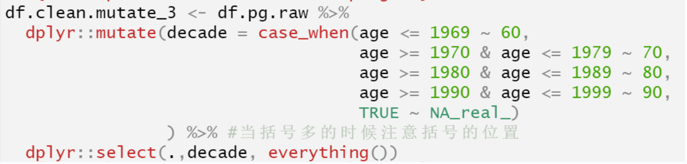

class: center, middle
<span style="font-size: 50px;">**第六章**</span> <br>
<span style="font-size: 50px;">__如何探索数据: __</span> <br>
<span style="font-size: 40px;">描述性统计与数据可视化基础</span><br>
<span style="font-size: 30px;">胡传鹏</span> <br>
<span style="font-size: 20px;"> </span> <br>
<span style="font-size: 30px;">`r Sys.Date()`</span> <br>
<span style="font-size: 20px;"> Made with Rmarkdown</span> <br>

---
#回顾
##函数及用法
##-函数名及语句
##-group_by()
##for loop
##练习题
<br><br>
#本节课内容
##探索性数据分析
##--描述性统计
##--数据可视化基础
##----ggplot2介绍
##----ggplot2可视化基础

---
#回顾
##函数及用法
<font size=5>
&emsp;&emsp;重新了解函数：
</font>
```{r}
df.mt.raw <-  read.csv('./data/match/match_raw.csv',
                       header = T, sep=",", stringsAsFactors = FALSE) 
```
<font size=5>
&emsp;&emsp;以用的最多的read.csv()这一函数为例，它包括两部分：“read.csv”——函数名,在“()”中输入参数。<br>
&emsp;&emsp;比如，“header=…”：是否要使用第一行作为列名；<br>
&emsp;&emsp;再如，“sep=…” ：指定什么为分割符 <br>

</font>

---
#回顾
##函数及用法
<font size=5>
&emsp;&emsp;重新了解函数：
</font>
```{r}
df.mt.raw <-  read.csv('./data/match/match_raw.csv',
                       header = T, sep=",", stringsAsFactors = FALSE) 
```
<font size=5>
&emsp;&emsp;以用的最多的read.csv()这一函数为例，它包括两部分：“read.csv”——函数名；“()”中的输入参数。<br>
&emsp;&emsp;比如，“header=…”：是否要使用第一行作为列名；<br>
&emsp;&emsp;再如，“sep=…” ：指定什么是分割符 <br>
<br>
&emsp;&emsp;为什么第一个文件名没有相应的argument？。
</font>

---
#回顾
##函数及用法
<font size=5>
&emsp;&emsp;重新了解函数：
</font>

完整输入arguments
```{r, eval=FALSE}
result1 <- functionName(arg1 = value1, arg2 = value2, arg3 = value3)
result1 <- functionName(arg3 = value3, arg1 = value1, arg2 = value2)
```

省略arguments,按照顺序输入argument的值
```{r, eval=FALSE}
result2 <- functionName(value1, value2, value3)

result2 <- functionName(value3, value1, value2) # will not return expected
```

省略有默认值的arguments
```{r, eval=FALSE}
result3 <- functionName(arg1 = value1)

```

---
#回顾
##函数及用法
<font size=5>
&emsp;&emsp;比如，完整地写出argument应该是这样。
</font>
```{r}
df.mt.raw <-  read.csv(file = './data/match/match_raw.csv',
                       header = T, 
                       sep=",",
                       stringsAsFactors = FALSE) 
```

---
#回顾
##函数及用法
<font size=5>
&emsp;&emsp;argument: “TRUE ~ NA_real_”?<br>
</font>


<br>
<font size=5>
&emsp;&emsp;首先，查找case_when()，但是我们并未发现对这一语句的描述，这可能是因为该argument已经在最新的语句中有了替代。<br>
&emsp;&emsp;因此，我们直接查找Na_real_，可以发现它表示这个默认值是一个缺失值（NA），并且是数值类型（real），那再结合case_when()的作用就很好理解了，那些“TRUE”，也即不在给出的任何条件中的值，被赋为NA。<br>
&emsp;&emsp;同学们也可以尝试使用case_when()文档中提供的语句重新写。
</font>

---
#回顾
##函数及用法
<font size=5>
&emsp;&emsp;关于函数“dplyr::group_by()"的作用: 比较操作前后的结果。
</font>   
```{r}
library("tidyverse")
group <- df.mt.raw %>% 
  group_by(Shape)
group#注意看数据框的第二行，有Groups:   Shape [4]的信息
```
---
#回顾
##函数及用法
<font size=5>
&emsp;&emsp;当某一列作为group_by分类的对象时，生成的数据框具有此分类列的信息，这个信息是数据框的一个基本信息，你甚至无法删除这一列。
</font>   
```{r}
group <- group %>% 
  select(-Shape)
#注意返回的提示，因为数据框已经按照此列分类，所以不能再检索到此列。
```

---
# 回顾
## 函数及用法
<font size=5>
&emsp;&emsp;对于group_by()函数的作用，我们可以对比不使用它的效果。
</font>

```{r}
library("tidyverse")
df.mt.raw <-  read.csv('./data/match/match_raw.csv',
                       header = T, sep=",", 
                       stringsAsFactors = FALSE) 
group <- df.mt.raw %>% 
  group_by(., Shape) %>% 
  summarise(n())
DT::datatable(group)
```
---
# 回顾
## 函数及用法
<font size=5>
&emsp;&emsp;对于group_by()函数的作用，我们可以对比不使用它的效果。
</font>
```{r}
ungroup <- df.mt.raw %>% 
  summarise(n())
DT::datatable(ungroup)
```

---
# 回顾
## 函数及用法
<font size=5>
&emsp;&emsp;从对比中可以看出，使用了group_by()后，实际上对数据框进行了分组，summarise针对的是每一个按照Shape列拆分开的数据框。
</font>
```{r}
remove(group, ungroup)
 
```

---

# 回顾
## 函数及用法
<font size=5>
&emsp;&emsp; 理解函数的最好办法：创建函数
</font>
```{r}
simpleFun <- function(a = 1, b = 100){
  sum <- a + b
  product <- a * b
  
  res <- c(sum, product)
  
  return(res)
}

```

```{r}
simpleFun()
```

```{r}
simpleResult <- simpleFun(a=1, b=5)
```
---

# 回顾
## for loop
<font size=5>
&emsp;&emsp;我们看一下for loop语句最基础的结构：<br>
&emsp;&emsp; __for (variable in sequence) {statement}__ <br>
&emsp;&emsp;其中，variable是循环变量，sequence是一个向量或列表，statement是要重复执行的语句。在每次循环中，variable会被赋值为sequence中的下一个元素，然后执行statement。<br>
比如，我如果想计算1到100的和：
</font>
```{r}
sum <- 0
for (i in 1:100) {
  sum <- sum + i
}
print(sum)
```

---
# 回顾
## for loop
<font size=5>
&emsp;&emsp;理解了这一点我们再来看使用for loop如何批量读取文件。
</font>
```{r}
files <- list.files(file.path("data/match"), 
                    pattern = "data_exp7_rep_match_.*\\.out$")

df_list <- list()

for (i in seq_along(files)) {
  df <- read.table(file.path("data/match", files[i]), header = TRUE) 
  df_list[[i]] <- df
}
```

```{r include=FALSE}
remove(files,i,sum,df,df_list)
```
<font size=5>
&emsp;&emsp;1.利用list.files读取所有的文件保存成value<br>
&emsp;&emsp;2.创建新的df_list存储结果<br>
&emsp;&emsp;3.for (i in seq_along(files))……部分是，对files里的第一个值执行read.table()，并将结果放进df_list中。接着对第二个值执行，直至循环结束整个files
</font>
---
# 回顾
## 练习

定义一下函数，其有两个整数型的arguments (a, b)，第一个比第二个小，函数的输出是计算从a到b的所有整数之和。

```
# 回顾
## 练习题
<font size=5>
&emsp;&emsp;我们在实际使用这些函数时，是带着目的去使用的。想要计算击中率虚报率，我们首先要知道什么情况是击中，也要让计算机知道什么情况是击中，一旦分类了，计算的时候也需要进行判断。但在分类判断之前，我们要先告诉计算机什么是正确情况什么是错误情况，哪些是这个被试做的，哪些不是，所以也需要分组。<br>
&emsp;&emsp;梳理到这，我们有了基本的思路：1.分组，使用group_by。2.告诉计算机什么是hit，什么是miss，使用summarise函数。3.利用判断语句进行分类计算，我们这里使用了ifelse。<br>
&emsp;&emsp;当然，具体执行时，我们也需要考虑缺失值等细节，但总体的思路不会有变。
<br>
&emsp;&emsp;以上次的练习为例。首先我们需要加载数据。
</font>

```{r}
# 读取原始数据
df.mt.raw <-  read.csv('./data/match/match_raw.csv',
                       header = T, sep=",", stringsAsFactors = FALSE) 
```
---
# 回顾
## 练习题
<font size=5>
&emsp;&emsp;接着，我们选出需要的几列，包括自变量和因变量，以及分组变量。使用select()函数
</font>
```{r}
df.mt.clean <- df.mt.raw %>%
  dplyr::select(Sub, Block, Bin,  # block and bin
                Shape, Match, # 自变量
                ACC, RT, # 反应结果
                )
```
<font size=5>
&emsp;&emsp;因为数据中存在缺失值，所以也需要除去它们。
</font>
```{r}
df.mt.clean <- df.mt.raw %>%
  dplyr::select(Sub, Block, Bin,  # block and bin
                Shape, Match, # 自变量
                ACC, RT, # 反应结果
                ) %>% 
  tidyr::drop_na()
```

---
# 回顾
## 练习题
<font size=5>
&emsp;&emsp;在计算击中率误报率等的时候，我们针对的是被试的在某一特定实验条件下的反应。所以我们需要通过bin、block、shape、sub进行分组，这样进行计算时，就是每一个条件组下分别计算。不会出现在虚报的实验条件下计算正确拒绝的情况。
</font>
```{r}
df.mt.clean <- df.mt.raw %>%
  dplyr::select(Sub, Block, Bin,  # block and bin
                Shape, Match, # 自变量
                ACC, RT, # 反应结果
                ) %>% 
  tidyr::drop_na()  %>% #删除缺失值
  dplyr::group_by(Sub, Block, Bin, Shape)
```
---
# 回顾
## 练习题
<font size=5>
&emsp;&emsp;接下来就是要使用summarise函数来给击中、虚报等分类，并使用ifelse函数根据分类计算概率
</font>
```{r}
df.mt.clean <- df.mt.raw %>%
  dplyr::select(Sub, Block, Bin,  # block and bin
                Shape, Match, # 自变量
                ACC, RT, # 反应结果
                ) %>% 
  tidyr::drop_na()  %>% #删除缺失值
  dplyr::group_by(Sub, Block, Bin, Shape) %>%
  dplyr::summarise(
      hit = length(ACC[Match == "match" & ACC == 1]),
      fa = length(ACC[Match == "mismatch" & ACC == 0]),
      miss = length(ACC[Match == "match" & ACC == 0]),
      cr = length(ACC[Match == "mismatch" & ACC == 1]),
      Dprime = qnorm(
        ifelse(hit / (hit + miss) < 1,
               hit / (hit + miss),
               1 - 1 / (2 * (hit + miss))
              )
           ) - qnorm(
        ifelse(fa / (fa + cr) > 0,
               fa / (fa + cr),
               1 / (2 * (fa + cr))
              )
                    ))
```

---
# 回顾
## 练习题
<font size=5>
&emsp;&emsp;最后使用ungroup、select等函数对数据进行清理，除去计算中的过程变量，并进行长宽转换方便查看。
</font>
```{r}
df.mt.clean <- df.mt.raw %>%
  dplyr::select(Sub, Block, Bin,  # block and bin
                Shape, Match, # 自变量
                ACC, RT, # 反应结果
                ) %>% 
  tidyr::drop_na()  %>% #删除缺失值
  dplyr::group_by(Sub, Block, Bin, Shape) %>%
  dplyr::summarise(
      hit = length(ACC[Match == "match" & ACC == 1]),
      fa = length(ACC[Match == "mismatch" & ACC == 0]),
      miss = length(ACC[Match == "match" & ACC == 0]),
      cr = length(ACC[Match == "mismatch" & ACC == 1]),
      Dprime = qnorm(
        ifelse(hit / (hit + miss) < 1,
               hit / (hit + miss),
               1 - 1 / (2 * (hit + miss))
              )
           ) - qnorm(
        ifelse(fa / (fa + cr) > 0,
               fa / (fa + cr),
               1 / (2 * (fa + cr))
              )
                    )) %>% 
  dplyr::ungroup() %>%
  select(-"hit",-"fa",-"miss",-"cr") %>%
  dplyr::group_by(Sub, Shape)  %>%
  tidyr::pivot_wider(names_from = Shape,
                     values_from = Dprime) 
```

---
class: center, middle
<span style="font-size: 50px;">**第六章**</span> <br>
<span style="font-size: 50px;">__如何探索数据: __</span> <br>
<span style="font-size: 40px;">描述性统计与数据可视化基础</span><br>
---

# 探索性数据分析
## What is exploratory data analysis?
<font size=5>
&emsp;&emsp;在介绍描述性统计和可视化之前，我们先了解一个概念：探索性数据分析(Exploratory Data Analysis, EDA)。<br>
&emsp;&emsp;In statistics, exploratory data analysis (EDA) is an approach to analyzing data sets to summarize their maincharacteristics, often with visual methods (Wikipedia).
</font>
<div style="text-align:center;">
  
</div>

---
# 探索性数据分析
## What is exploratory data analysis?
<font size=5>
&emsp;&emsp;要进行EDA，首先要了解自己的数据，并提出有质量的问题。但是提出有质量的问题前，我们可以先从几个基础的简单问题开始：<br>
&emsp;&emsp;有哪些变量，类型如何？变量的值是如何变化的？变量之间有什么关系？
</font>
```{r prepare the packages}

# 检查是否已安装 pacman
if (!requireNamespace("pacman", quietly = TRUE)) {
  install.packages("pacman") }   # 如果未安装，则安装包

# 加载所需要的R包
pacman::p_load("tidyverse")
# 读取数据
df.pg.raw <- read.csv("./data/penguin/penguin_rawdata.csv",
                      header = TRUE, sep=",", stringsAsFactors = FALSE)
df.mt.raw <-  read.csv('./data/match/match_raw.csv',
                       header = T, sep=",", stringsAsFactors = FALSE) 
```

---
# 探索性数据分析
## 有哪些变量，类型如何？

```{r, out.width = "10px", out.height = "300px"}
colnames(df.mt.raw)                # 查看列名，观察有哪些变量
DT::datatable(head(df.mt.raw, 3))  # 了解数据内容
```

---
# 探索性数据分析
## 了解数据
```{r, out.width = "10px", out.height = "300px"}
# 前几节课提过的summary()函数
# 这里使用datatable()是为了方便在ppt呈现
DT::datatable(summary(df.mt.raw))
```

---
# 探索性数据分析
## 了解你的数据
<font size=5>
&emsp;&emsp;更进一步，如果我想知道变量的平均数、中位数和标准差等统计量应该怎么办？
</font><br>
```{r, width = 400, height = 300}
# 使用psych包中的describe()函数
DT::datatable(psych::describe(df.mt.raw))
# 需要注意的是，describe()函数不会帮你处理缺失值，它会跳过缺失值。
```

---
# 探索性数据分析
## 了解你的数据
<font size=5>
&emsp;&emsp;更进一步，如果我想知道变量的平均数、中位数和标准差等统计量应该怎么办？
</font><br>
```{r}
# 使用dplyr包中的summarise()函数
df.mt.raw %>%
  summarise(mean_RT = mean(RT),
            sd_RT = sd(RT),
            n_values = n())
# summarise函数不会忽略缺失值，如果计算的列中有缺失值，会有报错。
```

---
# 探索性数据分析
## 变量的值是如何变化的？可视化
<font size=5>
&emsp;&emsp;可视化的部分我们介绍一个最常用的包：ggplot2。<br>
&emsp;&emsp;所谓gg源于“grammar of graphics”，即图形语法。<br>
&emsp;&emsp;ggplot2绘图的核心在于使用图层去描述和构建图形。<br>
&emsp;&emsp;我们在这里给出一个示例，探究体温和健康的关系，并简单了解一下ggplot2的语法。
</font>
<div style="text-align:center;">
  
</div>

---
# 可视化
## 柱状图
<font size=5>
&emsp;&emsp;比方说，我们想要看看被试回答正确率的情况。
</font>
```{r warning=FALSE, fig.width=6, fig.height=4}
ggplot2::ggplot(data=df.mt.raw,       # 指定数据
                aes(x=ACC)) +         # 确定映射到x轴的变量
  geom_bar() +                        # 绘制直方图
  theme_classic()                     # 设定绘图风格
```
---
# 可视化
## 柱状图
<font size=5>
&emsp;&emsp;消除图形与x轴之间的空白。
</font>
```{r warning=FALSE, fig.width=6, fig.height=4}
ggplot2::ggplot(data=df.mt.raw,         # 指定数据
                aes(x=ACC)) +           # 确定映射到x轴的变量
  geom_bar() +                          # 绘制直方图
  scale_y_continuous(expand=c(0, 0)) +  # x轴在 y=0 处  
  theme_classic()                       # 设定绘图风格
```
---

# 可视化
## 直方图
<font size=5>
&emsp;&emsp;对于连续变量，我们可以使用直方图进行可视化。比如说，我们想看看被试的反应时分布。
</font>
```{r fig.height=4, fig.width=6, message=FALSE, warning=FALSE}
ggplot2::ggplot(data=df.mt.raw,      # 指定数据
                aes(x=RT)) + # 确定映射到x轴的变量
  geom_histogram() +                   # 绘制直方图
  stat_bin(bins = 40) +                # 设定连续变量分组数量
  scale_x_continuous(name = "RT") +    # 命名x轴
  scale_y_continuous(expand=c(0, 0)) + # x轴在 y=0 处 
  theme_classic()                      # 设定绘图风格
```
---
# 可视化
## 密度图
<font size=5>
&emsp;&emsp;同样的我们可以使用密度图来描述反应时的分布情况。
</font>
```{r fig.height=4, fig.width=6, message=FALSE, warning=FALSE}
ggplot2::ggplot(data=df.mt.raw,         # 指定数据
                aes(x=RT)) +  # 确定映射到x轴的变量
  geom_density() +                      # 绘制密度曲线
  scale_x_discrete(name="RT") +         # 命名x轴
  scale_y_continuous(expand=c(0, 0)) +  # x轴在 y=0 处 
  theme_classic()                       # 设定绘图风格
```
---
# 可视化
## 图层叠加

```{r fig.height=3.5, fig.width=6, message=FALSE, warning=FALSE}
ggplot2::ggplot(data=df.mt.raw,             # 指定数据
                aes(x=RT,                   # x轴的变量
                    y=after_stat(density),  # y轴对应的是密度曲线
                    alpha=0.8)) +           # 透明度
  geom_histogram() +                        # 绘制直方图
  geom_density() +                          # 绘制密度曲线
  guides(alpha=FALSE) +                     # 隐藏透明度alpha设置带来的图例
  theme_classic()                           # 设定绘图风格
```

---
# 可视化
## 箱线图
<font size=5>
&emsp;&emsp;除了单个变量的可视化，我们可以尝试将两个变量的关系可视化。
&emsp;&emsp;这里我们利用箱线图看看不同Label的RT如何。
</font>
```{r fig.height=3.5, fig.width=6, message=FALSE, warning=FALSE}
ggplot2::ggplot(data=df.mt.raw,  # 指定数据
                aes(x=Label,     # 确定映射到xy轴的变量
                    y=RT)) +                 
  geom_boxplot() +               # 绘制箱线图
  theme_classic()                # 设定绘图风格
```

---
# 可视化
## 散点图
<font size=5>
&emsp;&emsp;而对于两个连续变量，我们可以使用散点图。比如，我们可以看看被试在做penguin问卷前后体温的关系。
</font>
```{r fig.height=3.5, fig.width=6, message=FALSE, warning=FALSE}
ggplot2::ggplot(data=df.pg.raw,                  # 指定数据
                aes(x=Temperature_t1,            # 确定映射到xy轴的变量
                    y=Temperature_t2)) +
  geom_point() +                                 # 绘制散点图
  scale_x_continuous(name = "Temperature_t1") +  # 修改X轴的名称
  scale_y_continuous(name = "Temperature_t2") +  # 修改Y轴的名称
  theme_classic()                                # 设定绘图风格
```

---
# 可视化
## 散点图
<font size=5>
&emsp;&emsp;事实上，当我们进行探索时往往需要先对数据进行处理，再进行可视化。以下我们想看看手机使用和焦虑是否存在关系。
</font>
```{r fig.height=4, fig.width=6, message=FALSE, warning=FALSE}
# 利用管道符，可以帮助我们更简洁地合并数据处理和可视化的过程。
df.pg.raw %>% 
  dplyr::mutate(stress_ave=rowMeans(.[,c("stress1", "stress2", "stress3","stress4", "stress5", 
                                         "stress6","stress7", "stress8", "stress9","stress10", 
                                         "stress11", "stress12","stress13", "stress14")]),
                phone_ave=rowMeans(.[,c("phone1","phone2","phone3","phone4","phone5",
                                        "phone6","phone7","phone8","phone9")])
                ) %>% 
  ggplot(aes(x=stress_ave, 
             y=phone_ave)) +
  geom_point() +
  geom_smooth(method="lm") +    # 在散点图上叠加回归线，语法可以查找帮助文档
  theme_classic()
```

---

# 可视化
## ggplot2小组

* 化繁为简：大量的默认值
* 精准定制：所有元素均可控
* 易于叠加：丰富的信息
* 日益丰富的生态系统 https://r-graph-gallery.com/

---

# 可视化
## Explore data with DataExplorer
<font size=5>
&emsp;&emsp;DataExplorer可能是是一个不错的工具
</font>
```{r fig.height=4, fig.width=6, message=FALSE, warning=FALSE}
# load DataExplorer
pacman::p_load("DataExplorer")

DataExplorer::plot_str(df.pg.raw)
```
---

# 可视化
## Explore data with DataExplorer
<font size=5>
&emsp;&emsp;DataExplorer可能是是一个不错的工具
</font>
```{r fig.height=4, fig.width=6, message=FALSE, warning=FALSE}
DataExplorer::plot_str(df.mt.raw)
```
---

# 可视化
## Explore data with DataExplorer
<font size=5>
&emsp;&emsp;DataExplorer可能是是一个不错的工具
</font>
```{r fig.height=4, fig.width=6, message=FALSE, warning=FALSE}
DataExplorer::plot_intro(df.mt.raw)
```
---
# 可视化
## Explore data with DataExplorer
<font size=5>
&emsp;&emsp;DataExplorer可能是是一个不错的工具
</font>
```{r fig.height=4, fig.width=6, message=FALSE, warning=FALSE}
DataExplorer::plot_missing(df.mt.raw)
```
---

# 可视化
## Explore data with DataExplorer
<font size=5>
&emsp;&emsp;DataExplorer可能是是一个不错的工具
</font>
```{r fig.height=4, fig.width=6, message=FALSE, warning=FALSE}
DataExplorer::plot_bar(df.mt.raw)
```
---

# 可视化
## Explore data with DataExplorer
<font size=5>
&emsp;&emsp;DataExplorer可能是是一个不错的工具
</font>
```{r fig.height=4, fig.width=6, message=FALSE, warning=FALSE}
DataExplorer::plot_bar(df.mt.raw, by="Match")
```
---

# 可视化
## Explore data with DataExplorer
<font size=5>
&emsp;&emsp;DataExplorer可能是是一个不错的工具
</font>
```{r fig.height=4, fig.width=6, message=FALSE, warning=FALSE}
DataExplorer::plot_histogram(df.mt.raw)
```
---

# 可视化
## Explore data with DataExplorer
<font size=5>
&emsp;&emsp;DataExplorer可能是是一个不错的工具
</font>
```{r fig.height=4, fig.width=6, message=FALSE, warning=FALSE}
DataExplorer::plot_qq(df.pg.raw[,2:10])
```
---

# 可视化
## Explore data with DataExplorer
<font size=5>
&emsp;&emsp;DataExplorer可能是是一个不错的工具
</font>
```{r fig.height=4, fig.width=6, message=FALSE, warning=FALSE}
DataExplorer::plot_correlation(na.omit(df.pg.raw[, 2:30]))
```
---

#练习
## 1. 读取match数据，对自己感兴趣的变量进行描述性统计。
## 2. 读取match数据，对不同shape的击中率进行分组绘图，可使用boxplot观察差异。
## 3. 读取penguin数据，选择自己感兴趣的两个变量进行处理并画出散点图。
## 4. 对两个数据中自己感兴趣的变量们做探索性数据分析。
#探索
## 在本章的例子中，我们举例了反应时的分布。但其实我们是对所有被试的所有反应时绘制了总的分布，那么我们能不能找到一个办法绘制出每一个被试的反应时分布呢？


