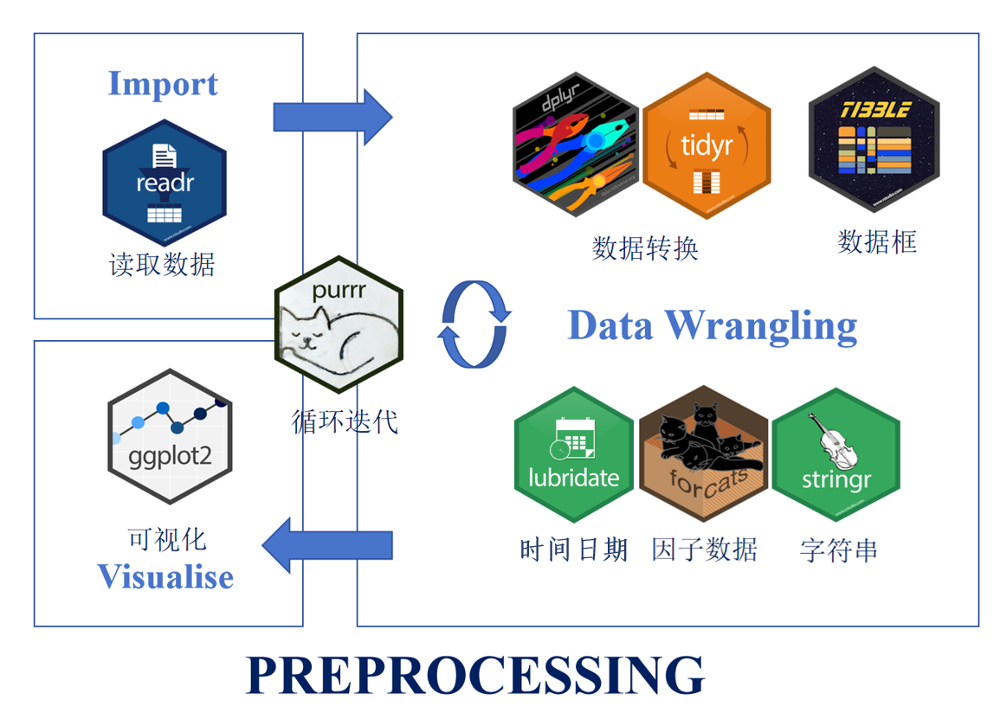
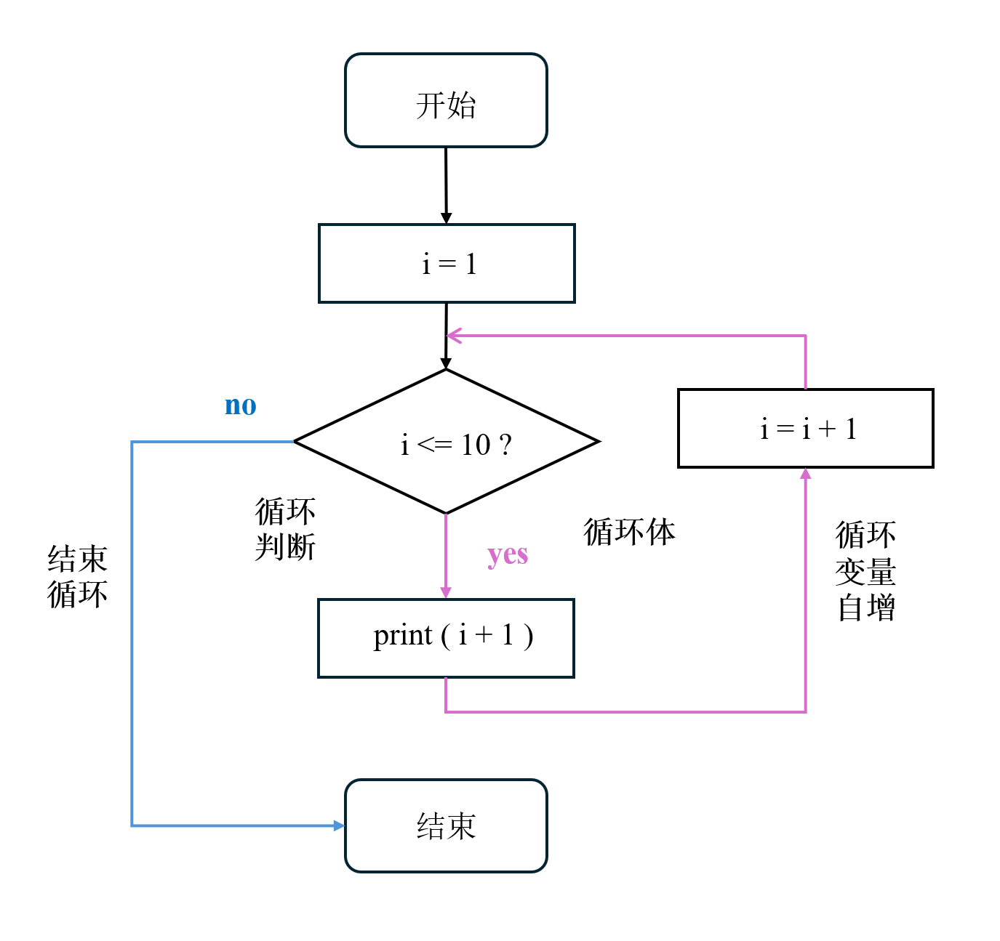
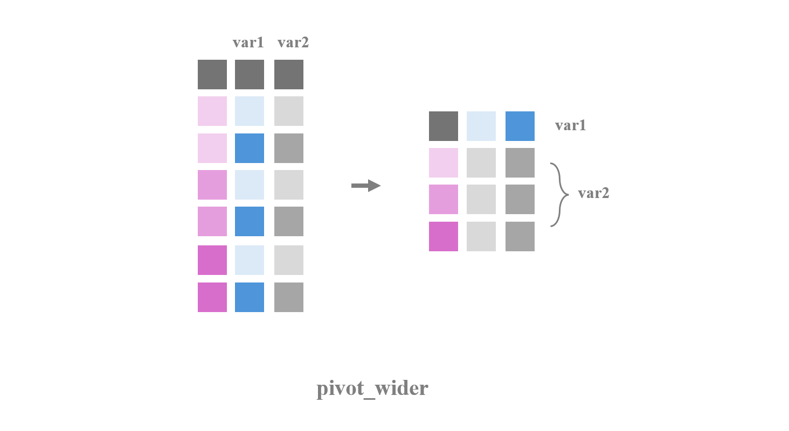

class: center, middle
<span style="font-size: 60px;">第六讲</span> <br>
<span style="font-size: 50px;">基于Tidyverse的数据预处理</span> <br>
<br>
<br>
<span style="font-size: 30px;">胡传鹏</span> <br>
<span style="font-size: 30px;">2025/03/26</span> <br>
<br>
<br>
<br>
<br>
---
<br>
<span style="font-size: 40px;">回顾：数据导入与操作</span></center> <br>
<br>
<span style="font-size: 40px;">数据导入</span></center> <br>
<br>
<span style="font-size: 40px;">数据操作</span></center> <br>
<span style="font-size: 30px;">&emsp;目标: 达到特定的数据处理目标</span></center> <br>
<span style="font-size: 30px;">&emsp;知识：数据类型</span></center> <br>
<span style="font-size: 30px;">&emsp;知识：R语言中的数据对象及其操作规则</span></center> <br>
<span style="font-size: 30px;">&emsp;技能：达到数据处理目标的具体步骤</span></center> <br>
<span style="font-size: 30px;">&emsp;技能：不同数据对象的操作(索引与运算)与组合</span></center> <br>
<br>
---
<br>
<span style="font-size: 40px;">回顾：数据导入与操作</span></center> <br>
<br>
- # <font size = 5.5> 从中选取 “Tsinghua” 站点选择数据计算主观压力得分  </font>
<br>
--
<br>
- ## <font size = 5.0> (1): 选择主观压力(Perceived Stress Scale)条目的列；</font>
<br>
- ## <font size = 5.0> (2): 选择"Tsinghua”这个站点的行;</font>
<br>
- ## <font size = 5.0> (3): 计算每个被试"stress"的总分;</font>
<br>
- ## <font size = 5.0> (4): 计算所有被试的"stress"总分的均值与标准差.</font>
      <br>
---
<h1 lang="en" style="font-size: 60px;">Contents</h1>
<br>
<span style="font-size: 40px;">6.1 Tidyverse简介</span></center> <br>
<br>
<span style="font-size: 40px;">6.2 基于Tidyverse处理问卷数据</span></center> <br>
<span style="font-size: 30px;">&emsp;6.2.1 操作步骤 (dplyr) </span></center> <br>
<span style="font-size: 30px;">&emsp;6.2.2 小结 </span></center> <br>
<br>
<span style="font-size: 40px;">6.3 基于Tidyverse处理反应时数据</span></center> <br>
<span style="font-size: 30px;">&emsp;6.3.1 研究问题 & 数据情况</span></center> <br>
<span style="font-size: 30px;">&emsp;6.3.2 操作步骤 (tidyr)</span></center> <br>
<span style="font-size: 30px;">&emsp;6.3.3 小结 </span></center> <br>

---
# <h1 lang="en">从问题出发</h1>
<br>
- [IJzerman et al (2018)](https://doi.org/10.1525/collabra.165)的问卷数据<br>
<br>
- **研究问题**：社交复杂度(CSI)等变量是否能预测核心体温(CBT)<br>
<br>

- **数据分析思路**：<br>
第一：得到各个变量的“干净”数据；<br>
第二：对干净的数据进行统计分析。<br>

<br>
- **要得到干净的数据，需要首先了解数据**<br>
---
# <h1 lang="en">从问题出发</h1>

- 数据情况(Hu et al., 2019)：<br>
通过data/penguin文件夹下的penguin_full_codebook可以查看详细情况<br>


---
# <h1 lang="en">从问题出发</h1>
- 研究核心变量：<br>

&emsp;&emsp; CBT: 核心体温，测量两次，变量为Temperature_t1, Temperature_t2<br>

&emsp;&emsp; CSI: 变量为socialdiversity<br>

&emsp;&emsp; Site: 数据源站点<br>

&emsp;&emsp; DEQ: 距赤道的距离，变量为DEQ<br>

&emsp;&emsp; romantic: 是否处于恋爱关系，1 = "yes", 2 = "no"<br>

&emsp;&emsp; ALEX (Toronto Alexithymia Scale, TAS-20): 述情障碍量表

&emsp;&emsp;&emsp;&emsp; (5点量表，变量为ALEX1 ～ ALEX16，第4, 12, 14, 16题反向计分)

---
# <h1 lang="en">了解数据</h1>

```{r 5.1 R package}
# 可以将清华的镜像设置为下载的镜像
# options(repos = c(CRAN = "https://mirrors.tuna.tsinghua.edu.cn/CRAN/"))
#下载、导入所需R包
if (!requireNamespace('pacman', quietly = TRUE)) {
    install.packages('pacman')
}
pacman::p_load(bruceR,tidyverse)
```

```{r load data}
df1 <- bruceR::import(here::here('data', 'penguin', 'penguin_rawdata.csv')) # 导入数据
# penguin_data <- read.csv('./data/penguin/penguin_rawdata.csv')  # 仅用基础包的做法
```

```{r example of penguin, echo=FALSE}
DT::datatable(head(df1),
              fillContainer = TRUE, options = list(pageLength = 4))
```

---
# <h1 lang="en">了解数据</h1>
```{r}
#查看变量名（列名）
colnames(df1) 
```

---
# <h1 lang="en">根据数据分析目标，理清思路</h1>

- **以如下目标为例**：获得感兴趣变量的数据(体温和述情障碍量表得分)，并按照Site查看被试的平均体温<br>

&emsp;&emsp; Step1: 导入数据<br>
&emsp;&emsp; Step2: 对相关变量进行预处理(检查数据类型、处理缺失值、<font color='red'>反向计分</font>等) <br>
&emsp;&emsp; Step3: 计算所需变量<br>
&emsp;&emsp; Step4: 分组求统计量<br>

--


---
# <h1 lang="en">数据预处理的R base操作</h1>

<span style="font-size: 30px;">例子 | 计算述情障碍量表得分</span></center><br>

<span style="font-size: 20px;">Step 1: 选择ALEX1 ~ ALEX16 (可选) </span></center><br>

<span style="font-size: 20px;">Step 2: 以部分条件进行反向计分 </span></center><br>

<span style="font-size: 20px;">Step 3: 对反向记分后的条目进行求和 </span></center><br>

```{r base operation for reverse coding, eval=FALSE}
# 反向计算: 1 --> 5; 2 --> 4; 3 --> 3; 4 --> 2; 5 --> 1
df1$ALEX4_new <- 6 - df1$ALEX4
df1$ALEX12_new <- 6 - df1$ALEX12
df1$ALEX14_new <- 6 - df1$ALEX14
df1$ALEX16_new <- 6 - df1$ALEX16

# 计算反向计算分ALEX得分:
df1$ALEX <- df1$ALEX1 + df1$ALEX2 + df1$ALEX3 + df1$ALEX4_new + df1$ALEX5 + 
      df1$ALEX6 + df1$ALEX7 + df1$ALEX8 + df1$ALEX9 + df1$ALEX10 + df1$ALEX11 + 
      df1$ALEX12_new + df1$ALEX13 + df1$ALEX14_new + df1$ALEX15 + df1$ALEX16_new

# 用rowSum 计算反向计算分ALEX得分:
df1$ALEX <- rowSums(df1[, c("ALEX1", "ALEX2", "ALEX3", "ALEX4_new", "ALEX5", 
                            "ALEX6", "ALEX7", "ALEX8", "ALEX9", "ALEX10", 
                            "ALEX11", "ALEX12_new", "ALEX13", "ALEX14_new", 
                            "ALEX15", "ALEX16_new")])
```

---
# <h1 lang="en">数据预处理</h1>

<span style="font-size: 30px;">例子 | 计算述情障碍量表得分</span></center><br>

<span style="font-size: 20px;">Step 1: 选择ALEX1 ~ ALEX16 (可选) </span></center><br>

<span style="font-size: 20px;">Step 2: 以部分条件进行反向计分 </span></center><br>

<span style="font-size: 20px;">Step 3: 对反向记分后的条目进行求和 </span></center><br>

<span style="font-size: 30px;">使用R base进行操作的不足：</span></center><br>

<span style="font-size: 20px;">（1）可能会产生中间变量 </span></center><br>

<span style="font-size: 20px;">（2）思路全靠注释 </span></center><br>

<span style="font-size: 30px;">有没有更好的R工具？</span></center><br>

--
```{r bruceR for reverse coding, eval=FALSE, echo=FALSE}
# 创建一个包含需要反向计分的变量的列表
vars_to_reverse <- c("ALEX4", "ALEX12", "ALEX14", "ALEX16")

# 对列表中的变量进行反向计分
df1$ALEX <- bruceR::SUM(df1, 
                        varrange = "ALEX1:ALEX16", 
                        rev = vars_to_reverse, 
                        likert = 1:5)
```
---
# <h1 lang="en">6.1 Tidyverse</h1>
<br>
- [tidyverse](https://www.tidyverse.org/):目前最流行的数据预处理套件，
- 包括9个核心R包和诸多附加R包组成的连贯的系统<br>
- 核心包的具体功能与工作流如图所示



<!-- 增加了一个用于处理时间日期的核心包“lubridate” -->
---
# <h1 lang="en">6.1 Tidyverse</h1>

- 可以通过搜索包的cheatsheet快速了解包的使用<br>
- 官方cheatsheet: https://rstudio.github.io/cheatsheets/
---

# <h1 lang="en">6.1 Tidyverse</h1>
<br>
- 或者特定的包的cheatsheet快速了解其使用(此处以“forcat”包为例)<br>
- 官方cheatsheet: https://rstudio.github.io/cheatsheets/


---
# <h1 lang="en">6.1 Tidyverse</h1>
- **优势：共享一个底层设计哲学、语法和数据结构，具有高度的一致性**<br>
<br>
- **"整洁数据(tidy)"**：每行代表一个观察值，每列代表一个变量的值<br>
- **函数的第一个参数总是一个数据框**<br>
- **管道操作符**：连接独立代码，省去中间变量，流水线<br>
最常用的管道操作符为**%>%**，它将一个函数的输出作为下一个函数的输入<br>

<br>
假设需找到`data`中`age`大于`30`的所有行，并按照年龄排序，代码如下：<br>
```{r eval=FALSE}
filtered_data <- dplyr::filter(df1, age > 30)
filtered_sorted_data <- dplyr::arrange(filtered_data, age)
```
<br>
使用管道操作符后，代码变为：<br>
```{r eval=FALSE}
filtered_sorted_data <- df1 %>%
  dplyr::filter(age > 30) %>%
  dplyr::arrange(age)
```

---
# <h1 lang="en">6.1 Tidyverse</h1>

- tidyverse常见的管道符如表所示，依赖于`magrittr`包<br>
- R 4.1.0 以上版本加入了原生管道操作符`|>`<br>

<br>

---
# <h1 lang="en">6.1 Tidyverse</h1>
<span style="font-size: 30px;">小练习</span></center><br>

- 请基于tidyverse的管道操作符合并下面三段代码，省去中间变量

```{r practice 1}
# 创建dataframe
data <- data.frame(
  "grammer" = c("R","SPSS","Python","R",NA,"Matlab","Python","R"),
  "score" = c(4,2,5,4.5,5,4,2,5),
  "popularity" = c(1,2,NA,4,5,6,7,10)
  )
# 提取前两列
select_data1 <- data[ ,1:2]
# 提取含字符串"R"的行
select_data2 <- select_data1[select_data1$grammer == 'R', ]
```

- 提示
```{r, message=FALSE}
# 不要忘记加载包
library(tidyverse)

# 补全下列代码,可以使用刚刚举例的filter()函数
# select_data2 <- data %>%
```

---
# <h1 lang="en">6.1 Tidyverse的反向分操作</h1>
<span style="font-size: 30px;">关键函数：mutate,case_when</span></center><br>
```{r tidyverse reverse coding}
# 将4, 12, 14, 16题反向计分，计算ALEX，保存为ALEX
df2 <- df1 %>%
      dplyr::mutate(df1,
            # 使用 casewhen反向计分：6减去原始值
            ALEX4 = case_when(TRUE ~ 6 - ALEX4),
            ALEX12 = case_when(TRUE ~ 6 - ALEX12),
            ALEX14 = case_when(TRUE ~ 6 - ALEX14),
            ALEX16 = case_when(TRUE ~ 6 - ALEX16)
            )
#也可以写成 case_when(ALEX4 == '1' ~ '5',ALEX4 == '2' ~ '4', ALEX4 == '3' ~ '3', ALEX4 == '4' ~ '2', ALEX4 == '5' ~ '1',TRUE ~ as.character(ALEX4))
```
- `mutate()`创建新变量或修改现有变量<br>
- 有多种变式，如`mutate_at()`通过列名、位置或者列的类型进行选择，`mutate_if()`对数据框中满足条件的列应用指定的函数<br>
- `mutate()`内使用函数时，同样需要注意缺失值的问题<br>
- 注意`mutate()`进行转换之后需要进行核查：结果是否符合预期<br>
- 注意需要将函数结果赋值给一个新的变量/原始变量完成保存
--
---
# <h1 lang="en">6.1 Tidyverse的反向分操作</h1>
<span style="font-size: 30px;">关键函数：mutate,case_when</span></center><br>
```{r, eval=FALSE}
df2 <- df1 %>%
      dplyr::mutate(df2,
            ALEX4 = case_when(TRUE ~ 6 - ALEX4),
            ALEX12 = case_when(TRUE ~ 6 - ALEX12),
            ALEX14 = case_when(TRUE ~ 6 - ALEX14),
            ALEX16 = case_when(TRUE ~ 6 - ALEX16)
            )
#也可以写成 case_when(ALEX4 == '1' ~ '5',ALEX4 == '2' ~ '4', ALEX4 == '3' ~ '3', ALEX4 == '4' ~ '2', ALEX4 == '5' ~ '1',TRUE ~ as.character(ALEX4))
```
- `case_when()`函数是一个强大的条件判断函数，通常用于根据不同的条件生成新的变量或对现有变量进行转换<br>
- 运算逻辑：逐行评估每个条件，并根据条件的结果来确定新值，若条件为真，则用‘~’后的值替换原始值<br>
- 有多个条件时，按照条件的顺序逐个进行判断，一旦有条件满足，则返回对应的值并停止继续判断其他条件<br>
- 使用 `TRUE ~` 或者 `TRUE ~ NA`处理未匹配到任何条件的情况，确保即使所有条件都不满足时，函数也会返回一个默认值，避免产生错误

--
---
# <h1 lang="en">6.1 Tidyverse的反向分操作</h1>

- **前后对比**：<br>


---
# <h1 lang="en">6.1 Tidyverse的反向分操作</h1>

- 使用case when()要确保条件中使用的值与变量的数据类型匹配<br>

```{r, eval=FALSE}
# age为num
case_when(
  age < 18 ~ "Child",
  age >= 18 & age < 65 ~ "Adult",
  age >= 65 ~ "Senior"
)

# age为chr
case_when(
  age < "18" ~ "Child",
  age >= "18" & age < "65" ~ "Adult",
  age >= "65" ~ "Senior"
)
```

---
# <h1 lang="en">6.2 基于Tidyverse处理问卷数据</h1>

<span style="font-size: 30px;">根据数据分析目标，理清思路</span></center><br>

- **以如下目标为例**：获得感兴趣变量的数据(体温和述情障碍量表得分)，并按照Site查看被试的平均体温<br>

&emsp;&emsp; Step1: 导入数据<br>
&emsp;&emsp; Step2: 对相关变量进行预处理(检查数据类型、处理缺失值、<font color='red'>反向计分</font>等) <br>
&emsp;&emsp; Step3: 计算所需变量<br>
&emsp;&emsp; Step4: 分组求统计量<br>

--


---

<span style="font-size: 30px;">6.2.1 操作步骤</span></center><br>
- 数据预处理目标：计算感兴趣的变量(述情障碍量表得分)，按照Site查看被试的平均体温<br>

&emsp;&emsp; Step1: 选择变量[select]<br>
&emsp;&emsp; Step2: 检查数据类型[glimpse, as族函数]<br>
&emsp;&emsp; Step3: 处理缺失值[filter, is.na]<br>
&emsp;&emsp; Step4: 反向计分(已展示) [mutate, case_when]<br>
&emsp;&emsp; Step5: 计算所需变量[mutate]<br>
&emsp;&emsp; Step6: 分组求统计量 [group_by, summarise]

---
# <h1 lang="en">6.2 基于Tidyverse处理问卷数据</h1>
<span style="font-size: 30px;">6.2.1 操作步骤 | Step1: 选择变量[select]</span></center><br>
```{r}
# 加载包后函数前不需要注明包，此处只是为了提示函数属于哪个包
# 选择我们需要的变量：Temperature_t1, Temperature_t2, SNI28-32, DEQ, romantic, ALEX1-16
df2 <- df1 %>%
      dplyr::select(Temperature_t1, Temperature_t2, 
                    socialdiversity, Site, DEQ, 
                    romantic,ALEX1:ALEX16)
```
<br>
- select()函数会按照提供的参数顺序选择列<br>
- 可以使用列名、范围（例如 starts_with()、ends_with()、contains()、matches() 等），或者使用 everything() 来选择所有列<br>
- 注意需要将函数结果赋值给一个新的变量/原始变量完成保存

---
# <h1 lang="en">6.2 基于Tidyverse处理问卷数据</h1>
<span style="font-size: 30px;">6.2.1 操作步骤 | Step2: 检查数据类型[summary]</span></center><br>
```{r}
# 检查变量的数据类型
base::summary(df2)
```

---
# <h1 lang="en">6.2 基于Tidyverse处理问卷数据</h1>
<span style="font-size: 30px;">6.2.1 操作步骤 | Step2: 检查数据类型[as族函数]</span></center><br>

```{r}
# 转换数据类型
# 这里数据类型是正确的，只是示例
df2 <- df2 %>%
      dplyr::mutate(Temperature_t1_new = as.numeric(Temperature_t1),
                    Temperature_t2 = as.numeric(Temperature_t2))
```

---
# <h1 lang="en">6.2 基于Tidyverse处理问卷数据</h1>
<span style="font-size: 30px;">6.2.1 操作步骤 | Step3: 处理缺失值[filter, is.na]</span></center><br>

```{r}
# 按照Temperature, DEQ处理缺失值
df2 <- df2 %>%
      dplyr::filter(!is.na(Temperature_t1) & !is.na(Temperature_t2) & !is.na(DEQ))
```

<br>
- filter()函数用于从数据框中筛选**行**（观测值），可以通过逻辑运算符组合多个条件<br>
- 运算逻辑：遍历每一行，将给定的条件应用于该行，条件为真则保留，保留的行被组成一个新的数据框作为函数的返回值<br>
- 注意需要将函数结果赋值给一个新的变量/原始变量完成保存

---
# <h1 lang="en">6.2 基于Tidyverse处理问卷数据</h1>
<span style="font-size: 30px;">6.2.1 操作步骤 | Step5: 计算所需变量[mutate]</span></center><br>

```{r}
# 计算每个被试两次核心温度的均值，保存为Temperature
df2 <- df2 %>%
      dplyr::mutate(Temperature = rowMeans(select(df2, starts_with("Temperature"))))
```

- `mean()`函数用于计算向量或数组的平均值，`colMeans()`函数用于计算矩阵或数据框的每一列的平均值，`rowMeans()`函数用于计算矩阵或数据框的每一行的平均值<br>
- 数据类型需为numeric<br>
- `starts_with()`用于在数据框中选择列名以特定字符串开头的列

---
# <h1 lang="en">6.2 基于Tidyverse处理问卷数据</h1>
<span style="font-size: 30px;">6.2.1 操作步骤 | Step5: 计算所需变量[mutate]</span></center><br>

```{r}
# 计算ALEX
df2 <- df2 %>%
      dplyr::mutate(ALEX = rowSums(select(df2, starts_with("ALEX"))))

# 查看数据
df2
```

---
# <h1 lang="en">6.2 基于Tidyverse处理问卷数据</h1>
<span style="font-size: 30px;">6.2.1 操作步骤 | Step6: 分组描述[group_by, summarise]</span></center><br>
```{r}
# 按Site计算Temperature的平均值
df2 <- dplyr::group_by(df2, Site)
df3 <- dplyr::summarise(df2, mean_Temperature = mean(Temperature), n = n())
df2 <- dplyr::ungroup(df2)
```
<br>
- group_by()函数将数据框按照指定的分组变量进行分组，然后可以对每个分组进行单独的操作，如汇总、计算统计量等<br>
- 在完成分组操作后，建议使用ungroup()函数取消数据框的分组状态<br>
- summarise()函数用于对数据框进行汇总操作，常与group_by()连用<br>
- 在summarise()函数中，可以使用各种统计函数来计算汇总统计量，例如n()、mean()、sum()、median()、min()、max()、sd()等

---
# <h1 lang="en">6.2 基于Tidyverse处理问卷数据</h1>
<span style="font-size: 30px;">6.2.1 操作步骤 | 完整的管道操作</span></center><br>
```{r}
# 用管道操作符合并以上代码
# 使用管道操作符时建议先单独查看变量的数据类型，转换完毕后在进行操作
# dplyr::glimpse(penguin_data)

df3 <- df1 %>%
  dplyr::select(Temperature_t1, Temperature_t2, socialdiversity, Site, 
                DEQ, romantic, ALEX1:ALEX16) %>%
  dplyr::filter(!is.na(Temperature_t1) & !is.na(Temperature_t2) & !is.na(DEQ)) %>%
  dplyr::mutate(Temperature = rowMeans(dplyr::select(., dplyr::starts_with("Temperature"))),
                ALEX4 = dplyr::case_when(TRUE ~ 6 - ALEX4),
                ALEX12 = dplyr::case_when(TRUE ~ 6 - ALEX12),
                ALEX14 = dplyr::case_when(TRUE ~ 6 - ALEX14),
                ALEX16 = dplyr::case_when(TRUE ~ 6 - ALEX16),
                ALEX = rowSums(dplyr::select(., dplyr::starts_with("ALEX")))) %>%
  dplyr::group_by(Site) %>%
  dplyr::summarise(mean_Temperature = mean(Temperature),
                   mean_ALEX = mean(ALEX)) %>%
  dplyr::ungroup()

# 查看数据
df3
```

---
# <h1 lang="en">6.2 基于Tidyverse处理问卷数据</h1>
<span style="font-size: 30px;">6.2.2 小结</span></center><br>
_数据的预处理主要依赖`dplyr`包，常见函数总结如下_

- dplyr::filter() 选择符合某个条件的行（可能代表一个被试的数据） <br>

- dplyr::mutate() 创建新的变量或修改现有变量 <br>

- dplyr::case when() 重新编码变量<br>

- dplyr::group_by() 依据某些变量产生的条件，给数据分组 <br>
  **如果使用 "group_by",** <br>
  **一定要在summarise后使用 "dplyr::ungroup()".** <br>
  
- dplyr::summarise() 进行某些加减乘除的运算 <br>  

- dplyr::ungroup() 取消刚刚进行的分组 <br>  

- dplyr::select() 选择进行分析时需要用到的变量，同时也起到了为所有变量排序的功能 <br>

- dplyr::arrange() 某一列的值，按照某个顺序排列（其他列也会随之变动） <br>

---
# <h1 lang="en">6.2 基于Tidyverse处理问卷数据</h1>
<span style="font-size: 30px;">练习</span></center><br>

1. 按照langfamily进行分组计算DEQ, CSI的均值

---
# <h1 lang="en">6.3 反应时数据</h1>
<span style="font-size: 30px;">6.3.1 问题 & 数据</span></center> <br>
- 以[Hu et al.,2020](https://doi.org/10.1525/collabra.301)中的反应时数据作为示例<br>
<br>
- **研究问题**：探究人们对自我相关刺激的优先加工是否仅在某些条件下发生<br>
- **研究假设**：无论参与何种任务，与积极概念（好我）建立联结的自我形状会在反应时间和准确性上表现更快更准确<br>


---
# <h1 lang="en">6.3 反应时数据</h1>
<span style="font-size: 30px;">6.3.1 问题 & 数据</span></center> <br>
- **研究结果**：<br>
<br>


---
# <h1 lang="en">6.3 反应时数据</h1>
<span style="font-size: 30px;">6.3.1 问题 & 数据</span></center> <br>
- 数据情况：<br>
数据保存于data/match文件夹下<br>
N(被试) = 44, N(files) = 44<br>
形状标签匹配任务数据命名为`data_exp7_rep_match_*.out`<br>
<br>


---
# <h1 lang="en">6.3 反应时数据</h1>
<span style="font-size: 30px;">6.3.1 问题 & 数据</span></center> <br>
- 主要变量：<br>
Shape/Label: 屏幕呈现的图形代表的概念<br>
Match: 图形与呈现的标签是否匹配<br>
ACC: 被试的判断是否正确，1 = "正确", 0 = "错误", -1, 2表示未按键或按了两个键的情况，属于无效作答<br>
RT: 被试做出判断的反应时，[200,1500]的反应时纳入分析<br>
```{r example of singal rawdata_matchtask DT, echo=FALSE}
a1 <- utils::read.table("data/match/data_exp7_rep_match_7302.out", header = TRUE)
DT::datatable(head(a1),
              fillContainer = TRUE, options = list(pageLength = 4))
```

---
# <h1 lang="en">6.3 反应时数据</h1>
<span style="font-size: 30px;">6.3.2 操作步骤</span></center><br>
- **本课数据预处理目标**：计算Match-Moral条件下时RT的自我优势效应(SPE)。<br>

&emsp;&emsp; **Step1: 批量读取并合并数据[for loop]**<br>
&emsp;&emsp; Step2: 选择变量[select]<br>
&emsp;&emsp; Step3: 处理缺失值[drop_na, filter]<br>
&emsp;&emsp; **Step4: 分实验条件计算变量[group_by, summarise]**<br>
&emsp;&emsp; **Step5: 拆分变量[extract, filter]**<br>
&emsp;&emsp; **Step6: 将长数据转为宽数据[pivot_wide]**<br>
&emsp;&emsp; Step7: 计算实验条件为Match-Moral时RT的自我优势效应[mutate, select]<br>

---
# <h1 lang="en">6.3 反应时数据</h1>
<span style="font-size: 30px;">6.3.2 操作步骤 | Step1: 批量读取并合并数据[for loop]</span></center><br>
- 在选用读取数据的函数时要注意函数默认的分隔符（参数sep），如read.csv默认为",", read.table默认为" "<br>
- .out文件是以空格或制表符分隔的文本文件
- 以合作两个被试数据为例

```{r}
# 查看单个被试的数据
# 查看数据时要注意所需变量的数据类型，如果存在问题需要提前转换
p1 <- utils::read.table("data/match/data_exp7_rep_match_7302.out", header = TRUE)
p2 <- utils::read.table("data/match/data_exp7_rep_match_7303.out", header = TRUE)
p1
```

---
# <h1 lang="en">6.3 反应时数据</h1>
<span style="font-size: 30px;">6.3.2 操作步骤 | Step1: 批量读取并合并数据[for loop]</span></center><br>
- 以合并两个被试数据为例

```{r}
tmp <- base::rbind(p1, p2)
tmp <- dplyr::bind_rows(p1, p2)
```

- rbind()函数，用于合并两个或多个数据框、矩阵、数组或列表，并将它们按行连接成一个新的对象，其中的 "r" 代表 "row"。<br>
- 通常情况下，rbind会返回一个矩阵，但输入对象的特性（如列名、列属性等）也可能导致rbind()返回数据框。想要获得数据框最好使用bind_rows()函数。<br>
- 合并数据框时，要确保被合并的数据框具有相同的列数和列名。如果列名不同，bind_rows()会尝试按照列名的顺序进行合并。如果无法自动匹配列名，则会产生错误。

---
# <h1 lang="en">6.3 反应时数据</h1>
<span style="font-size: 30px;">6.3.2 操作步骤 | Step1: 批量读取并合并数据[for loop]</span></center><br>
- 虽然可以通过逐个导入数据并逐个合并得到最终的数据，但这样费时费力，且代码冗余。<br>
- 编程中常用迭代结构执行重复操作，如for loop。<br>
- for loop的基本语法如下：for (variable in sequence) { # 在这里执行循环体操作 }

```{r}
# 单个操作循环，打印i + 1
for (i in 1:10) {
  print(i + 1)
}
```

---
# <h1 lang="en">6.3 反应时数据</h1>
<span style="font-size: 30px;">6.3.2 操作步骤 | Step1: 批量读取并合并数据[for loop]</span></center><br>


---
# <h1 lang="en">6.3 反应时数据</h1>
<span style="font-size: 30px;">6.3.2 操作步骤 | Step1: 批量读取并合并数据[for loop]</span></center><br>
```{r}
# variable in sequence

for (i in 1:5) {print(i)}

for (i in seq(1, 5)) {print(i) }

my_vector <- c(1, 2, 3, 4, 5)
for (i in my_vector) {print(i) }

my_list <- list(a = 1, b = 2, c = 3) 
for (element in my_list) {print(element) }

my_string <- "world"
for (i in 1:nchar(my_string)) {print(substr(my_string, i, i)) }
```


---
# <h1 lang="en">6.3 反应时数据</h1>
<span style="font-size: 30px;">6.3.2 操作步骤 | Step1: 批量读取并合并数据[for loop]</span></center><br>
```{r}
# variable in sequence

my_list <- list(a = 1, b = 2, c = 3)
for (element in my_list) {print(element)}

my_string <- "world"
for (i in 1:nchar(my_string)) {print(substr(my_string, i, i))}
```

---
# <h1 lang="en">6.3 反应时数据</h1>
<span style="font-size: 30px;">6.3.2 操作步骤 | Step1: 批量读取并合并数据[for loop]</span></center><br>
```{r}
# 加简单条件
for (i in 1:10) {
  if (i > 5) {
    print(i + 1)
  }
}

```


---
# <h1 lang="en">6.3 反应时数据</h1>
<span style="font-size: 30px;">6.3.2 操作步骤 | Step1: 批量读取并合并数据[for loop]</span></center><br>
- 那么要如何利用for loop批量导入数据呢？<br>
      - (1) 找到所有要读取的文件名 --> <br>
      - (2) 以文件名形成的向量为基础，使用for loop逐个文件进行操作 --> <br>
      - (3) 将每次循环中读取的数据与之前已经读取的数据进行合并 --> <br>
      - (4) 循环每个文件，直到全部读取完成，删除中间变量。

```{r for loop list.files, error=FALSE}
# 找到所有要读取的文件名
# 使用 full.names 参数获取完整路径的文件列表
files <- list.files(here::here("data", "match"), pattern = "data_exp7_rep_match_.*\\.out$", full.names = TRUE)
head(files, n = 10L)
str(files)
```
*P.S.尽管函数叫list.files，但它得到的变量的属性是value，而不是list*

---
# <h1 lang="en">6.3 反应时数据</h1>
<span style="font-size: 30px;">6.3.2 操作步骤 | Step1: 批量读取并合并数据[for loop]</span></center><br>

```{r df.mt.out.fl}
# 定义函数用于数据类型转换，可以暂时不管
convert_data_types = function(df) {
  df <- df %>%
    dplyr::mutate(Date = as.character(Date),
                  Prac = as.character(Prac),
                  Sub = as.numeric(Sub),
                  Age = as.numeric(Age),
                  Sex = as.character(Sex),
                  Hand = as.character(Hand),
                  Block = as.numeric(Block),
                  Bin = as.numeric(Bin),
                  Trial = as.numeric(Trial),
                  Shape = as.character(Shape),
                  Label = as.character(Label),
                  Match = as.character(Match),
                  CorrResp = as.character(CorrResp),
                  Resp = as.character(Resp),
                  ACC = as.numeric(ACC),
                  RT = as.numeric(RT))
  return(df)
}
```

---
# <h1 lang="en">6.3 反应时数据</h1>
<span style="font-size: 30px;">6.3.2 操作步骤 | Step1: 批量读取并合并数据[for loop]</span></center><br>
```{r}
# 创建一个空的数据框来存储读取的数据
df3 <- data.frame()

# 循环读取每个文件，处理数据并添加到数据框中
for (i in seq_along(files)) { # 重复"读取到的.out个数"的次数
  # 读取数据文件
  df <- read.table(files[i], header = TRUE) 
  # 使用 filter 函数过滤掉 Date 列值为 "Date" 的行
  df <- dplyr::filter(df, Date != "Date") 
  # 调用函数进行数据类型转换
  df <- convert_data_types(df)
  # 使用 bind_rows() 函数将当前数据框与之前的数据框合并
  df3 <- dplyr::bind_rows(df3, df)
}

# 清除中间变量
rm(df, files, i)
```

---
# <h1 lang="en">6.3 反应时数据</h1>
<span style="font-size: 30px;">6.3.2 操作步骤 | Step1: 批量读取并合并数据[for loop]</span></center><br>
- 使用lapply也能完成批量导入与合并。lapply思维难度更高，但代码更简洁。<br>

```{r error=FALSE}
# 获取所有的.out文件名
files <- list.files(here::here("data", "match"), pattern = "data_exp7_rep_match_.*\\.out$", full.names = TRUE)

# 读取每个.out文件，并进行数据清洗
df3 <- lapply(files, function(file) {
  df <- read.table(file, header = TRUE)
  df <- dplyr::filter(df, Date != "Date") # 过滤掉 Date 列值为 "Date" 的行
  df <- mutate(df, 
               convert_data_types(df)
              ) # 进行数据类型转换和数据清洗
  return(df)
})

# 合并所有数据框
df3 <- dplyr::bind_rows(df3)

# 清除中间变量
rm(files)
```
---
# <h1 lang="en">6.3 反应时数据</h1>
<span style="font-size: 30px;">6.3.2 操作步骤 | Step1: 批量读取并合并数据[for loop]</span></center><br>
- 保存合并的数据文件。<br>

```{r error=FALSE}
write.csv(df3, 
          file = here::here("data", "match","match_raw.csv"),
          row.names = FALSE)
```
---
# <h1 lang="en">6.3 反应时数据</h1>
<span style="font-size: 30px;">6.3.2 操作步骤 | Step2: 选择变量[select]</span></center><br>

```{r example of total part1 rawdata_matchtask,message=FALSE}
# 选择我们需要的变量
df4 <- dplyr::select(df3,
                     Sub, Age, Sex, Hand, #人口统计学
                     Block, Bin, Trial, # 试次
                     Shape, Label, Match, # 刺激
                     Resp, ACC, RT) # 反应结果
```

```{r example of total part1 rawdata_matchtask DT, echo=FALSE}
DT::datatable(head(df4, 24),
              fillContainer = TRUE, options = list(pageLength = 5))
```

---
# <h1 lang="en">6.3 反应时数据</h1>
<span style="font-size: 30px;">6.3.2 操作步骤 | Step3: 处理缺失值[drop_na, filter]</span></center><br>

```{r example of total part2 rawdata_matchtask,message=FALSE}
# 删除缺失值，选择符合标准的被试
df4 <- tidyr::drop_na(df4) # 删除含有缺失值的行
df4 <- dplyr::filter(df4, Hand == "R",      # 选择右利手被试
                    ACC == 0 | ACC == 1 ,   # 排除无效应答（ACC = -1 OR 2)
                    RT >= 0.2 & RT <= 1.5)  # 选择RT属于[200,1500]
```

```{r example of total part2 rawdata_matchtask DT, echo=FALSE}
DT::datatable(head(df4, 24),
              fillContainer = TRUE, options = list(pageLength = 5))
```
---
# <h1 lang="en">6.3 反应时数据</h1>
<span style="font-size: 30px;">6.3.2 操作步骤 | Step4: 分条件描述[group_by, summarise]</span></center><br>

```{r example of total part3 rawdata_matchtask,message=FALSE}
# 分实验条件计算
df4 <- dplyr::group_by(df4, Sub, Shape, Label, Match)
df4 <- dplyr::summarise(df4, mean_ACC = mean(ACC), mean_RT = mean(RT))
df4 <- dplyr::ungroup(df4)
```

```{r example of total part3 rawdata_matchtask DT, echo=FALSE}
DT::datatable(head(df4, 24),
              fillContainer = TRUE, options = list(pageLength = 5))
```

---
# <h1 lang="en">6.3 反应时数据</h1>
<span style="font-size: 30px;">6.3.2 操作步骤 | Step4: 分条件描述[group_by, summarise]</span></center><br>
- group_by和summarise函数<br>
&emsp;group_by：定义分组变量<br>
&emsp;summarise：通过与mean、median等函数协作，对变量进行汇总<br>


---
# <h1 lang="en">6.3 反应时数据</h1>
<span style="font-size: 30px;">6.3.2 操作步骤 | Step4: 分条件描述[group_by, summarise]</span></center><br>
- group_by和summarise函数<br>
&emsp;group_by+summarise：对各组变量进行汇总<br>


---
# <h1 lang="en">6.3 反应时数据</h1>
<span style="font-size: 30px;">6.3.2 操作步骤 | Step5: 拆分变量[extract, filter]</span></center><br>

```{r example of total part4 rawdata_matchtask}
# 将Shape变量拆分
df4 <- tidyr::extract(df4, Shape, into = c("Valence", "Identity"),
                      regex = "(moral|immoral)(Self|Other)", remove = FALSE)
df4 <- dplyr::filter(df4, Match == "match" & Valence == "moral") 
```

```{r example of total part4 rawdata_matchtask DT, echo=FALSE}
DT::datatable(head(df4, 24),
              fillContainer = TRUE, options = list(pageLength = 5))
```

---
# <h1 lang="en">6.3 反应时数据</h1>
<span style="font-size: 30px;">6.3.2 操作步骤 | Step5: 拆分变量[extract, filter]</span></center><br>
- extract函数<br>
&emsp; extract(data = data, col = x1, into = c("x1a", "x1b"),regex = "([[:alnum:]]+)-([[:alnum:]]+)")


---
# <h1 lang="en">6.3 反应时数据</h1>
<span style="font-size: 30px;">6.3.2 操作步骤 | Step6: 将数据长转宽[pivot_wide]</span></center><br>
```{r example of total part5 rawdata_matchtask}
# 将长数据转为宽数据
df4 <- dplyr::select(df4, Sub, Identity, mean_RT)
df4 <- tidyr::pivot_wider(df4, names_from = "Identity", values_from = "mean_RT")
```

```{r example of total part5 rawdata_matchtask DT, echo=FALSE}
DT::datatable(head(df4, 24),
              fillContainer = TRUE, options = list(pageLength = 5))
```

---
# <h1 lang="en">6.3 反应时数据</h1>
<span style="font-size: 30px;">6.3.2 操作步骤 | 将数据长转宽[pivot_wide]</span></center><br>
- pivot_wide函数<br>
&emsp; pivot_wider(names_from = var1, values_from = var2)<br>
&emsp; names_from：其值将用作列名称的列<br>
&emsp; values_from：其值将用作单元格值的列<br>


---
# <h1 lang="en">6.3 反应时数据</h1>
<span style="font-size: 30px;">6.3.2 操作步骤</span></center><br>
```{r example of total part6 rawdata_matchtask}
# 计算SPE
df4 <- dplyr::mutate(df4, moral_SPE = Self - Other)
df4 <- dplyr::select(df4, Sub, moral_SPE) 
```

```{r example of total part6 rawdata_matchtask DT, echo=FALSE}
DT::datatable(head(df4, 24),
              fillContainer = TRUE, options = list(pageLength = 5))
```

---
# <h1 lang="en">6.3 反应时数据</h1>
<span style="font-size: 30px;">6.3.2 操作步骤</span></center><br>
```{r example of total rawdata_matchtask, message=FALSE}
# 用管道操作符合并以上代码
df4 <- df3 %>%
  dplyr::select(Sub, Age, Sex, Hand, #人口统计学
                Block, Bin, Trial,   # 试次
                Shape, Label, Match, # 刺激
                Resp, ACC, RT,       # 反应结果
                ) %>% 
  tidyr::drop_na() %>%                  #删除缺失值
  dplyr::filter(Hand == "R",          # 选择右利手被试
                ACC == 0 | ACC == 1 , # 排除无效应答（ACC = -1 OR 2)
                RT >= 0.2 & RT <= 1.5 # 选择RT属于[200,1500]
                ) %>%
  dplyr::group_by(Sub, 
                  Shape, Label, Match) %>%
  dplyr::summarise(mean_ACC = mean(ACC),
                   mean_RT = mean(RT)) %>%
  dplyr::ungroup() %>%
  tidyr::extract(Shape, into = c("Valence", "Identity"),
                        regex = "(moral|immoral)(Self|Other)", remove = FALSE) %>%
  dplyr::filter(Match == "match" & Valence == "moral") %>%
  dplyr::select(Sub, Identity, mean_RT) %>%
  tidyr::pivot_wider(names_from = "Identity", values_from = "mean_RT") %>%
  dplyr::mutate(moral_SPE = Self - Other) %>%
  dplyr::select(Sub, moral_SPE) 
```

---
# <h1 lang="en">6.3 反应时数据</h1>
<span style="font-size: 30px;">6.3.3 小结</span></center><br>
<br>
- separate() 把一个变量的单元格内的字符串拆成两份，变成两个变量 <br>
  **更适合用于按固定分隔符分割字符串，如将“2022-02-25”分成“2022”、“02”和“25”三列** <br>
  
- extract() 类似于separate <br>
  **更适合用于从字符串中提取特定的信息，如将“John Smith”分成“John”和“Smith”两列** <br>
  
- unite() 把多个列（字符串）整合为一列 <br>

- pivot_longer() 把宽数据转化为长数据 <br>

- pivot_wider() 把长数据转化为宽数据 <br>   
  
- drop_na() 删除缺失值

---
# <h1 lang="en">6.3 反应时数据</h1>
<span style="font-size: 30px;">练习</span></center><br>

计算不同Shape情况下(immoralself，moralself，immoralother，moralother)<br>
基于信号检测论match与mismatch之间的d'(match为信号，mismatch噪音)
- 提示： d′=  Z（Hit rate) - Z(False alarm rate)，以下是部分计算信号检测论d'的代码 <br>

```{r, eval=FALSE}
# 去掉下面#的部分，将***替换成合适的变量，补全代码
dplyr::summarise(
      # *** = length(ACC[Match == "match" & ACC == 1]),
      # *** = length(ACC[Match == "mismatch" & ACC == 0]),
      # *** = length(ACC[Match == "match" & ACC == 0]),
      # *** = length(ACC[Match == "mismatch" & ACC == 1]),
      Dprime = qnorm(
        ifelse(hit / (hit + miss) < 1,
               hit / (hit + miss),
               1 - 1 / (2 * (hit + miss))
              )
        ) 
             - qnorm(
        ifelse(fa / (fa + cr) > 0,
              fa / (fa + cr),
              1 / (2 * (fa + cr))
              )
                    )
      ) 
```

---
# <h1 lang="en">6.3 反应时数据</h1>
<span style="font-size: 30px;">6.3.3 小结</span></center><br>
- **练习思路**<br>
<br>
Step1: 选择需要的变量 <br>
<br>
Step2: 基于Sub, Shape分组 <br>
<br>
Step3: 使用计算公式，计算d值 <br>
<br>
Step4: 删除击中、虚报、误报、正确拒绝 <br>
<br>
Step5: 长转宽，得到每个Shape情况下的信号检测论d值 <br>


---
# <h1 lang="en">6.3 反应时数据</h1>
<span style="font-size: 30px;">6.3.3 小结</span></center><br>
- **答案参考**<br>
<br>

