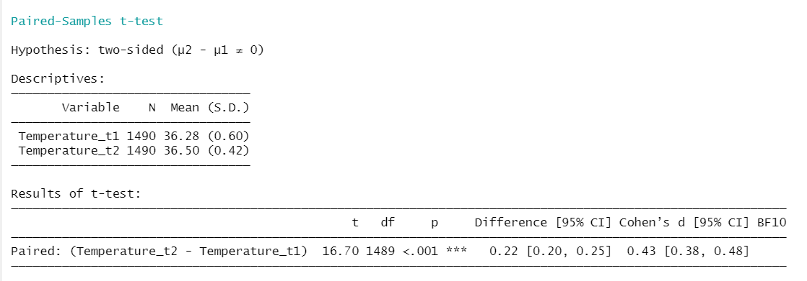
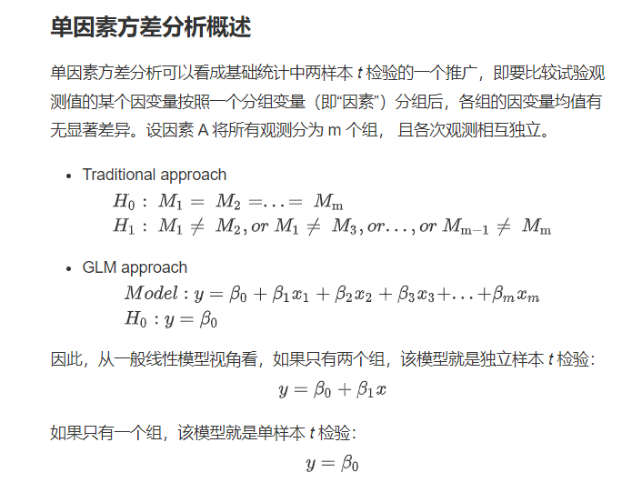
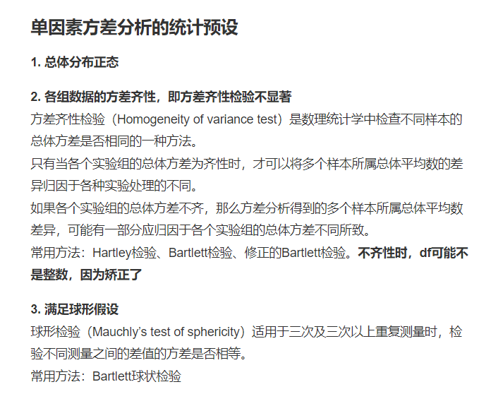
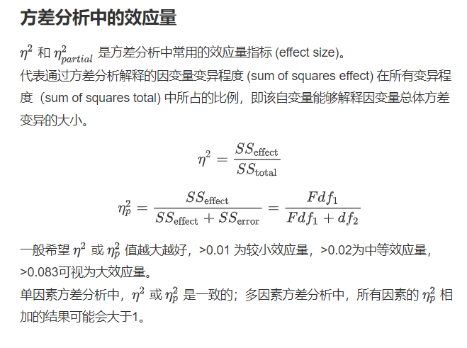
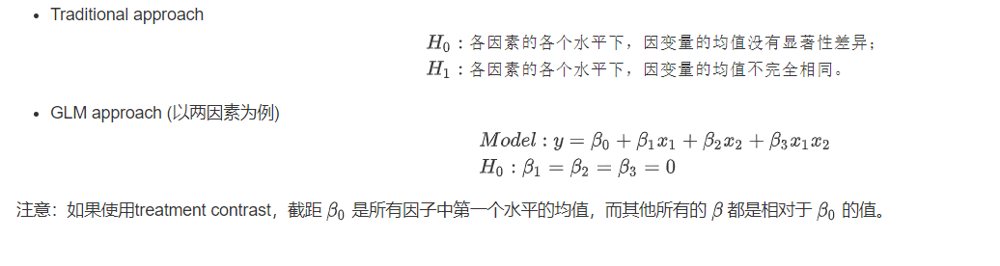
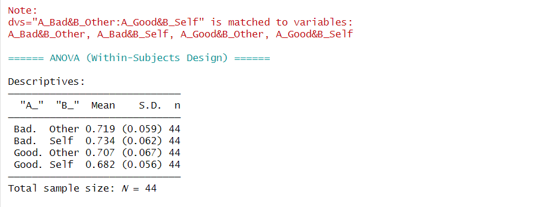

class: center, middle
<span style="font-size: 60px;">第七章</span> <br>
<span style="font-size: 50px;">如何进行基本的数据分析 (一) </span> <br>
<span style="font-size: 50px;">*t*-test和ANOVA</span> <br>
<br>
<br>
<span style="font-size: 30px;">胡传鹏</span> <br>
<span style="font-size: 30px;">2023/04/10</span> <br>

---
class: center, middle
<span style="font-size: 60px;">7.1  *t*-test</span> <br>
---
# <h1 lang="zh-CN">回顾*t*检验基础知识</h1>
<br>
<center>
##  One sample *t*-test：单样本*t*检验
</center>
<br>
<br>
### **Compare the sample mean against a fixed value.**
<br>
## The hypotheses:
* $H_0$: The current sample is sampled from a population with μ of the current value.
* $H_1$: The current sample is sampled from a population with μ that different from the current value.
* The significance level: $\alpha$ = 0.05
---
# <h1 lang="zh-CN">回顾*t*检验基础知识 </h1>

<br>
## Typical research questions are:

  与某一特定值比较的三种情况（大于/小于或等于)
<br>

* whether the mean (m) of the sample is equal to the theoretical mean, $\mu$?
* whether the mean (m) of the sample is less than the theoretical mean, $\mu$?
* whether the mean (m) of the sample is greater than the theoretical mean, $\mu$?

---
# <h1 lang="zh-CN">回顾*t*检验基础知识</h1>
<br>
<h2 lang="en">In statistics, we can define the corresponding null hypothesis ($H_0$) as follow:</h2>
<br>

* $H_0$: m = μ
* $H_0$: m <= μ
* $H_0$: m => μ

<br>
<br>
<h2 lang="en">The corresponding alternative hypotheses (H1) are as follow:</h2>
<br>
<h3 lang="en">H1:m ≠ μ (not equal to)</h3>
<h3 lang="en">H1:m > μ (greater than)</h3>
<h3 lang="en">H1:m < μ (less than)</h3>
---
# <h1 lang="zh-CN">回顾*t*检验基础知识</h1>
<br>
<center>
<h2 lang="en">Two-sample *t*-test ：双样本*t*检验</h2>
</center>
<br>
<h2 lang="en">Dependent(paried) *t*-test</h2>
<h3 lang="en">Population of difference scores has a normal distribution [population normality]</h3>
<h3 lang="en">Correlation between pairs of scores [dependent data]</h3>
<br>
<br>
<h2 lang="en">Independent *t*-test</h2>
<br>
<h3 lang="en">Population of difference scores has a normal distribution [population normality]</h3>
<h3 lang="en">The variances in two populations are similar [homogeneity of variance]</h3>
---
# <h1 lang="zh-CN">回顾*t*检验基础知识</h1>
<br>
<h2 lang="en">Dependent (Paired) *t*-test：配对样本*t*检验</h2>
<h3 lang="en">The paired *t*-test is used to compare the means between two related groups of samples. In this case, you have two values (i.e., pair of values) for the same samples.</h3>
<br>
<br>
<br>
<h2 lang="en">Independent *t*-test:独立样本*t*检验</h2>
<h2 lang="en">The independent samples *t*-test is used to compare the mean of two independent groups.</h2>
<br>
<h2 lang="en">Typical research questions are:</h2>
<h2 lang="en">whether the mean of group A (μ) is equal to the mean of group B (μ)?</h2>
<h2 lang="en">whether the mean of group A (μ) is less than the mean of group B (μ)?</h2>
<h2 lang="en">whether the mean of group A (μ) is greater than the mean of group B (μ)?</h2>
---
class: center, middle
<span style="font-size: 60px;">7.2 *t*-test in R</span> <br>
---
# <h1 lang="zh-CN">几个假想的问题</h1>
<br>
<br>
<h3 lang="zh-CN">1. “在penguin数据中，参与者对于家的依恋水平是否小于/等于/大于均值水平(假设在总体水平上，人们对家庭的依恋水平(HOME)均值为3.5)？”</h3>
<br>
<h3 lang="zh-CN">2. “在penguin数据中，男女生在亲密关系经验(ECR)中的得分是否存在显著差异？”</h3>
<br>
<h3 lang="zh-CN">3. “在penguin数据中，参与者在不同时间的温度差异是否具有显著性？”</h3>

---

# <h1 lang="zh-CN">载入包 - 设置工作路径 - 导入原始数据</h1>
```{r pacakge, message=FALSE}
# 检查是否已安装 pacman
if (!requireNamespace("pacman", quietly = TRUE)) {
  install.packages("pacman") }   # 如果未安装，则安装包

# 使用p_load来载入需要的包
pacman::p_load("tidyverse", "bruceR")
```

---
# <h1 lang="zh-CN">载入包 - 设置工作路径 - 导入原始数据</h1>
```{r WD & df.pg.raw}
# WD <-  here::here()
df.pg.raw <-  read.csv('./data/penguin/penguin_rawdata.csv',
                       header = T, sep=",", stringsAsFactors = FALSE)
```

```{r df.pg.raw DT, echo=FALSE}
DT::datatable(head(df.pg.raw, 10),
              fillContainer = TRUE, options = list(pageLength = 5))
```

---
# <h1 lang="zh-CN">准备数据</h1>
# <h3 lang="zh-CN">对感兴趣问题所涉及题目求均值</h3>

```{r df.pg.mean, message = FALSE}
df.pg.mean <- df.pg.raw %>%
  dplyr::filter(sex > 0 & sex < 3) %>% # 筛选出男性和女性的数据
  dplyr::mutate(ECR_mean=rowMeans(select(., starts_with("ECR")), na.rm = T),
                HOME_mean=rowMeans(select(., starts_with("HOME")), na.rm = T),
                sex=as.factor(sex)
                ) %>%
  dplyr::select(age, sex, romantic, ECR_mean, HOME_mean, Temperature_t1, Temperature_t2)

```  

```{r df.pg.mean DT, echo=FALSE}
# check 5st five rows 
# head(df.pg.mean, 5)
DT::datatable(head(df.pg.mean, 5),
              fillContainer = TRUE, options = list(pageLength = 5))
```

---
# <h1 lang="zh-CN">TTEST()：bruceR中*t*检验函数的参数</h1>

---
# <h1 lang="en">bruceR::TTEST</h1>
## <h2 lang="zh-CN">问题1: 单样本*t*检验</h2>
```{r}
  # bruceR::TTEST(df.pg.mean, "HOME_mean", test.value = 3.5, test.sided = ">")
  # bruceR::TTEST(df.pg.mean, "HOME_mean", test.value = 3.5, test.sided = "<")
  result.ttest <- capture.output({
  bruceR::TTEST(data=df.pg.mean, 
                y="HOME_mean", 
                test.value = 3.5, 
                test.sided = "=",
                file = "./output/chp7/one_sample_t.doc")
})
writeLines(result.ttest, "./output/chp7/single_t.md") # .md最整齐
                
```

---
# <h1 lang="en">bruceR::TTEST</h1>
## <h2 lang="en">OUTPUT</h2>


---
# <h1 lang="en">bruceR::TTEST</h1>
## <h2 lang="zh-CN">问题2: 独立样本*t*检验</h2>
```{r}
    result.ttest <- capture.output({   
    bruceR::TTEST(data=df.pg.mean, 
                y="ECR_mean",
                x="sex")
})

writeLines(result.ttest, "./output/chp7/inde_t.md")
                
```

---
# <h1 lang="en">bruceR::TTEST</h1>
## <h2 lang="en">OUTPUT</h2>


---
# <h1 lang="en">bruceR::TTEST</h1>
## <h2 lang="zh-CN">问题3: 配对样本*t*检验</h2>
```{r}
   result.ttest <- capture.output({
   bruceR::TTEST(data=df.pg.mean, 
                 y = c("Temperature_t1",              
                       "Temperature_t2"),
                 paired = T)  #是否为配对样本*t*检验？默认是FALSE
})

writeLines(result.ttest, "./output/chp7/pair_t.md")
                
```

---
# <h1 lang="en">bruceR::TTEST</h1>
## <h2 lang="en">OUTPUT</h2>


---
# <h1 lang="en">Reporting *t*-test results in APA</h1>
<br>
<br>
<h3 lang="en">The basic format for reporting the result of a *t*-test is the same in each case:</h3>
<h3 lang="en">*t*(degress of freedom) = the t-value , *p* = p-value, Cohen's *d* = effect size</h3>
<br>


<h4 lang="zh-CN">以上均与假想的问题无关，大家可结合自己的数据改写代码</h4>
---
class: center, middle
<span style="font-size: 60px;">7.3 anova</span> <br>

---
# <h1 lang="zh-CN">回顾ANOVA的基础知识</h1>


<br>
---
# <h1 lang="zh-CN">回顾ANOVA的基础知识</h1>


---
# <h1 lang="zh-CN">回顾ANOVA的基础知识</h1>



---
# <h1 lang="zh-CN">回顾ANOVA的基础知识</h1>
<br>
<h2 lang="zh-CN">多因素方差分析概述</h2>
<br>
<h3 lang="zh-CN">多因素方差分析原理与单因素方差分析基本一致，即利用方差比较的方法，通过假设检验的过程来判断多个因素是否对因变量产生显著性影响。当有两个及以上因素对因变量产生影响时，使用多因素方差分析。多因素方差分析不仅要考虑每个因素的主效应，往往还要考虑因素之间的交互效应。</h3>
<br>


---
class: center, middle
<span style="font-size: 60px;">7.4 anova in R</span> <br>
---
# <h1 lang="zh-CN">假想的问题</h1>
<br>
<br>
<h2 lang="zh-CN">1. “在match数据中，被试在匹配任务和不匹配任务上的反应时是否存在差异？”</h2>
<br>
<h2 lang="zh-CN">2. “在match数据中，被试在不同身份(self vs other)与不同效价(moral vs immoral)的条件组合下反应时是否存在差异？”</h2>
<br>
---
# <h1 lang="zh-CN">载入包</h1>
```{r}
pacman::p_load("tidyverse", "bruceR")
```

---
# <h1 lang="zh-CN">设置工作路径 - 导入数据与预处理</h1>
  
```{r}
df.match <-  read.csv('./data/match/match_raw.csv',
                      header = T, sep=",", stringsAsFactors = FALSE) %>%
  # 拆分单元格内字符串
  tidyr::separate(col=Shape,
                  into=c("Valence","Identity"),
                  sep="(?<=moral|immoral)(?=Self|Other)") %>% 
  dplyr::select(Sub, Valence, Identity, everything()) %>%
  dplyr::filter(ACC == 1) %>%    # 只选择回答正确的数据
  dplyr::filter(!is.na(RT)) %>%  # 剔除缺失值
  # remove outliers below and above 3rd sd
  dplyr::filter(RT > quantile(RT, 0.0015) & RT < quantile(RT, 0.9985)) %>%
  dplyr::mutate(RT = as.numeric(RT)) %>%
  dplyr::mutate(Valence = as.factor(Valence),
                Identity = as.factor(Identity))
  
```

---
<br>
<br>

```{r}
DT::datatable(head(df.match, 10),
              fillContainer = TRUE, options = list(pageLength = 5))
```

---
# <h1 lang="zh-CN">CODE_问题1处理</h1>
# <h2 lang="zh-CN">计算被试匹配与不匹配任务上的平均反应时间及其标准差</h2>

```{r}
df.match.mean <- df.match %>%
    dplyr::group_by(Sub, Match) %>%
    dplyr::summarise(
        n = n(),
        rt_sd = sd(as.numeric(RT), na.rm = T),
        rt_mean = mean(RT, na.rm = T), # 对于factor数据，先转成character，再变成numeric
        ) %>%
    dplyr::ungroup()
```

---
<br>
<br>

```{r}
DT::datatable(head(df.match.mean, 10),
              fillContainer = TRUE, options = list(pageLength = 5))
```

---
# <h1 lang="zh-CN">CODE_问题1处理</h1>
# <h2 lang="zh-CN">单因素被试内设计</h2>

```{r}
#比较被试在匹配任务和不匹配任务上的反应时是否存在差异
#单因素被试内设计（长型数据）
result.anova <- capture.output({
df_within <- df.match.mean %>%
  bruceR::MANOVA(subID="Sub",    # 被试id
                 dv="rt_mean",   # 因变量，因为是MANOVA，实际上因变量可以再后面设置很多个
                 within="Match") # 设置条件，因素分析的条件
})

writeLines(result.anova, "./output/chp7/anova_1.md")
# 若不符合球形假设要加上：sph.correction = "GG"
```

---
# <h1 lang="en">bruceR::MANOVA</h1>
## <h2 lang="en">OUTPUT</h2>


---
# <h1 lang="zh-CN">ANOVA问题2</h1>
# <h2 lang="zh-CN">计算被试在不同身份和效价条件下的平均反应时间及其标准差</h2>

```{r}
df.match.mean <- df.match %>%
    dplyr::group_by(Sub,Sex, Valence,Identity) %>%
    dplyr::summarise(
        n = n(),
        rt_sd = sd(as.numeric(RT), na.rm = T),
        rt_mean = mean(as.numeric(RT), na.rm = T)
        ) %>%
    dplyr::ungroup()
```

---
<br>
<br>
```{r}
DT::datatable(head(df.match.mean, 10),
              fillContainer = TRUE, options = list(pageLength = 5))
```

---
# <h1 lang="zh-CN">MANOVA()：多因素被试间/被试内/混合设计方差分析ANOVA</h1>
# <h2 lang="zh-CN">主要参数</h2>


---
# <h1 lang="zh-CN">问题2的R语法</h1>
# <h2 lang="zh-CN">长数据转换为宽数据</h2>

```{r}
df.match.within <- df.match.mean %>%
  dplyr::select(-c(n, rt_sd)) %>%
  dplyr::mutate(Valence = paste("A_", Valence, sep = ""),#将变量的名称进行修改转换，不生产新的变量
                Identity = paste("B_", Identity, sep = "")) %>%
  # 将morality和identity组合名称起来生成一个新的变量"Conds"
  tidyr::unite("Conds", Valence:Identity, sep = "&",remove=TRUE) %>% 
  tidyr::pivot_wider(names_from = Conds,
                     values_from = rt_mean)

head(df.match.within)
#str(df.match.within)
```

---
# <h1 lang="zh-CN">问题2的R语法</h1>
# <h2 lang="zh-CN">两因素被试内设计_宽数据</h2>

```{r}
#被试在不同身份(self vs other)与不同效价(moral vs moral)的条件组合下反应时是否存在差异）
  result.anova <- capture.output({
  res_rmANOVA_1 <- bruceR::MANOVA(data=df.match.within,
                   dvs="A_immoral&B_Other:A_moral&B_Self",
                   dvs.pattern="A_(.+)B_(.+)",#正则表达式
                   within=c("A_","B_"))#表示2个主条件
  })

writeLines(result.anova, "./output/chp7/anova_2.md")
```

---
# <h1 lang="en">bruceR::MANOVA</h1>
## <h2 lang="en">OUTPUT</h2>


---
# <h1 lang="en">bruceR::MANOVA</h1>
## <h2 lang="en">OUTPUT</h2>

---
# <h1 lang="zh-CN">问题2的R语法</h1>
# <h2 lang="zh-CN">两因素被试内设计_长数据</h2>

```{r}
#被试在不同身份(self vs other)与不同效价(good vs bad)的条件组合下反应时是否存在差异）
#head(df.match.mean)
  result.anova <- capture.output({
  res_rmANOVA_2 <- bruceR::MANOVA(data=df.match.mean,
                   dv="rt_mean",
                   within=c("Valence","Identity"),
                   subID="Sub")
  })

writeLines(result.anova, "./output/chp7/anova_3.md")
```

---
# <h1 lang="zh-CN">简单效应检验与多重比较</h1>
# <h2 lang="zh-CN">主要参数</h2>


---
# <h1 lang="zh-CN">简单效应检验与多重比较</h1>
# <h2 lang="zh-CN">问题2的简单效应比较</h2>

```{r}
result.check <- capture.output({
sim_eff_1 <- res_rmANOVA_1 %>%
  bruceR::EMMEANS("A_", by="B_")#简单效应分析
})
writeLines(result.check, "./output/chp7/check.md")

#sim_eff_1 <- res_rmANOVA_1 %>%
  #EMMEANS("B_", by="A_")   和上一个同理，只是转换了不同的形式
```

---
# <h1 lang="zh-CN">被试间设计的语法实现</h1>
# <h2 lang="en">性别与亲密关系对ECR得分的效应</h2>

```{r}
# MANOVA(data, dv="SCORE", between=c("A", "B"))
# data 代表两因素的数据类型
# dv 因变量
# between 被试间因素的名称，此处表示两因素被试间设计，如果只有一个就是单因素被试间设计
res_ANOVA_btw <- df.pg.mean %>%
  bruceR::MANOVA(., 
                 dv="ECR_mean",
                 between = c("sex", "romantic"))
```

---
# <h1 lang="zh-CN">混合设计的语法实现</h1>
# <h2 lang="en">CODE</h2>
<h3 lang="zh-CN">以2个被试间1个被试内的混合设计形式为例</h3>

```{r}
# 假设数据集是mixed.3_2b1w
# A、C是被试间变量，B是被试内变量
# MANOVA(mixed.3_2b1w, dvs="B1:B2", dvs.pattern="B(.)",
       #between=c("A", "C"), within="B")
res_ANOVA_mix <- df.match.mean %>%
  dplyr::mutate(Sex = ifelse(Sex =="1", "male",
                             ifelse(Sex == "2", "female", Sex))) %>%
  bruceR::MANOVA(., 
                 subID = "Sub",
                 dv="rt_mean",
                 between = c("Sex"),
                 within = c("Valence", "Identity"))
```

---
# <h1 lang="zh-CN">课堂练习</h1>
<br>
<br>
<h2 lang="zh-CN">1. “在Penguin数据中，不同站点(“Site”)的被试在主观压力上是否有差异？”</h2>
<br>
<h2 lang="zh-CN">2. “在match数据中，如何分析 *d'*”</h2>
<br>