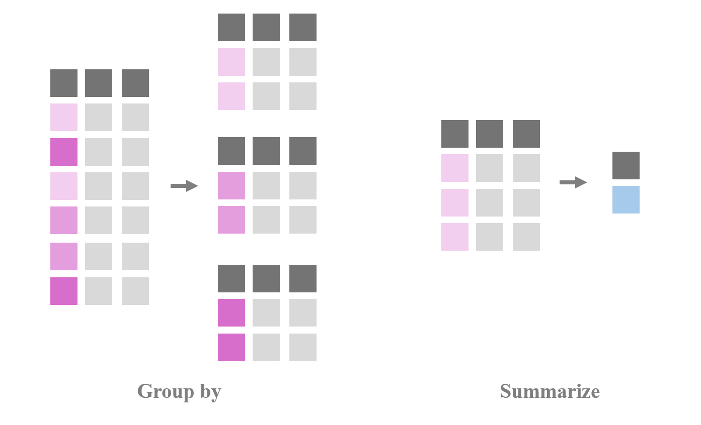
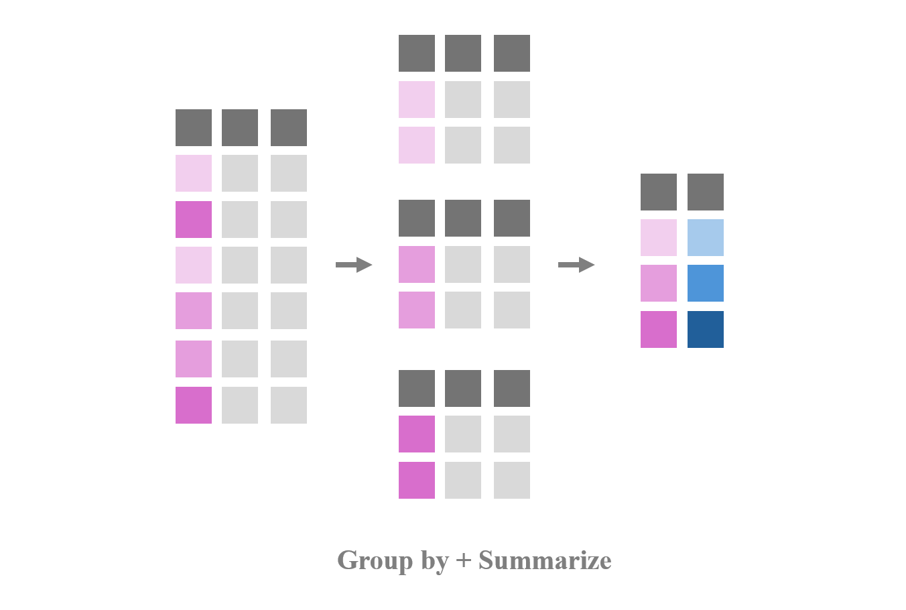

class: center, middle
<span style="font-size: 60px;">第七讲</span> <br>
<span style="font-size: 50px;">Tidyverse数据预处理与函数</span> <br>
<br>
<br>
<span style="font-size: 30px;">胡传鹏</span> <br>
<span style="font-size: 30px;">2025/04/02</span> <br>
<br>
<br>
<br>
<br>
---
<br>
<span style="font-size: 40px;">回顾：问卷数据的处理和实验数据的导入</span></center> <br>
<br>
<span style="font-size: 40px;">问卷数据的处理</span></center> <br>
<br>
<span style="font-size: 30px;">&emsp; Step1：选择变量[select]<br>
<span style="font-size: 30px;">&emsp; Step2：检查数据类型[glimpse, as族函数]<br>
<span style="font-size: 30px;">&emsp; Step3：处理缺失值[filter, is.na]<br>
<span style="font-size: 30px;">&emsp; Step4：反向计分[mutate, case_when]<br>
<span style="font-size: 30px;">&emsp; Step5：计算所需变量[mutate]<br>
<span style="font-size: 30px;">&emsp; Step6：分组求统计量 [group_by, summarise]
<br>
---
<br>
<span style="font-size: 40px;">回顾：问卷数据的处理和实验数据的导入</span></center> <br>
<br>
<span style="font-size: 40px;">实验数据的导入</span></center> <br>
<br>
- ## <font size = 5.0> (1) 找到所有要读取的文件名；</font>
<br>
- ## <font size = 5.0> (2) 以文件名形成的向量为基础，使用for loop逐个文件进行操作;</font>
<br>
- ## <font size = 5.0> (3) 将每次循环中读取的数据与之前已经读取的数据进行合并;</font>
<br>
- ## <font size = 5.0> (4) 循环每个文件，直到全部读取完成，删除中间变量.</font>
<br>
---
- 那么要如何利用for loop批量导入数据呢？<br>
      - (1) 找到所有要读取的文件名 --> <br>
      - (2) 以文件名形成的向量为基础，使用for loop逐个文件进行操作 --> <br>
      - (3) 将每次循环中读取的数据与之前已经读取的数据进行合并 --> <br>
      - (4) 循环每个文件，直到全部读取完成，删除中间变量。

```{r 5.1 R package}
# 可以将清华的镜像设置为下载的镜像
# options(repos = c(CRAN = "https://mirrors.tuna.tsinghua.edu.cn/CRAN/"))
# 导入所需R包
library(tidyverse)
```

```{r for loop list.files, error=FALSE}
# 找到所有要读取的文件名
# 使用 full.names 参数获取完整路径的文件列表
files <- list.files(here::here("data", "match"), pattern = "data_exp7_rep_match_.*\\.out$", full.names = TRUE)
```
*P.S.尽管函数叫list.files，但它得到的变量的属性是value，而不是list*

---
- # <font size = 5.5> 实验数据的导入  </font>
- 定义函数用于数据类转换
```{r df.mt.out.fl}
# 定义函数用于数据类型转换，可以暂时不管
convert_data_types = function(df) {
  df <- df %>%
    dplyr::mutate(Date = as.character(Date),
                  Prac = as.character(Prac),
                  Sub = as.numeric(Sub),
                  Age = as.numeric(Age),
                  Sex = as.character(Sex),
                  Hand = as.character(Hand),
                  Block = as.numeric(Block),
                  Bin = as.numeric(Bin),
                  Trial = as.numeric(Trial),
                  Shape = as.character(Shape),
                  Label = as.character(Label),
                  Match = as.character(Match),
                  CorrResp = as.character(CorrResp),
                  Resp = as.character(Resp),
                  ACC = as.numeric(ACC),
                  RT = as.numeric(RT))
  return(df)
}
```

---
- # <font size = 5.5> 实验数据的导入  </font>
- 建立并将数据存入数据框
```{r}
# 创建一个空的数据框来存储读取的数据
df3 <- data.frame()

# 循环读取每个文件，处理数据并添加到数据框中
for (i in seq_along(files)) { # 重复"读取到的.out个数"的次数
  # 读取数据文件
  df <- read.table(files[i], header = TRUE) 
  # 使用 filter 函数过滤掉 Date 列值为 "Date" 的行
  df <- dplyr::filter(df, Date != "Date") 
  # 调用函数进行数据类型转换
  df <- convert_data_types(df)
  # 使用 bind_rows() 函数将当前数据框与之前的数据框合并
  df3 <- dplyr::bind_rows(df3, df)
}

# 清除中间变量
rm(df, files, i)
```

---
- # <font size = 5.5> 实验数据的导入  </font>
- 使用lapply也能完成批量导入与合并。lapply思维难度更高，但代码更简洁。<br>

```{r error=FALSE}
# 获取所有的.out文件名
files <- list.files(here::here("data", "match"), pattern = "data_exp7_rep_match_.*\\.out$", full.names = TRUE)

# 读取每个.out文件，并进行数据清洗
df3 <- lapply(files, function(file) {
  df <- read.table(file, header = TRUE)
  df <- dplyr::filter(df, Date != "Date") # 过滤掉 Date 列值为 "Date" 的行
  df <- mutate(df, 
               convert_data_types(df)
              ) # 进行数据类型转换和数据清洗
  return(df)
})

# 合并所有数据框
df3 <- dplyr::bind_rows(df3)

# 清除中间变量
rm(files)
```
---
- # <font size = 5.5> 实验数据的导入  </font>
- 保存合并的数据文件。<br>

```{r error=FALSE}
write.csv(df3, 
          file = here::here("data", "match","match_raw.csv"),
          row.names = FALSE)
```
---
<h1 lang="en" style="font-size: 60px;">Contents</h1>
<br>
<span style="font-size: 40px;">7.1 基于Tidyverse的数据预处理（续）</span></center> <br>
<span style="font-size: 30px;">&emsp;7.1.1 研究问题 & 数据情况回顾</span></center> <br>
<span style="font-size: 30px;">&emsp;7.1.2 操作步骤 (tidyr)</span></center> <br>
<span style="font-size: 30px;">&emsp;7.1.3 小结 </span></center> <br>
<br>
<span style="font-size: 40px;">7.2 函数的概念与自定义函数</span></center> <br>
<span style="font-size: 30px;">&emsp;7.2.1 函数的概念与类别 </span></center> <br>
<span style="font-size: 30px;">&emsp;7.2.2 调用函数 </span></center> <br>
<span style="font-size: 30px;">&emsp;7.2.3 自定义函数 </span></center> <br>
<br>

---
# <h1 lang="en">7.1 基于Tidyverse处理反应时数据</h1>
<span style="font-size: 30px;">7.1.1 问题 & 数据</span></center> <br>
- 以[Hu et al.,2020](https://doi.org/10.1525/collabra.301)中的反应时数据作为示例<br>
<br>
- **研究问题**：探究人们对自我相关刺激的优先加工是否仅在某些条件下发生<br>
- **研究假设**：无论参与何种任务，与积极概念（好我）建立联结的自我形状会在反应时间和准确性上表现更快更准确<br>


---
# <h1 lang="en">7.1 基于Tidyverse处理反应时数据</h1>
<span style="font-size: 30px;">7.1.1 问题 & 数据</span></center> <br>
- **研究结果**：<br>
<br>


---
# <h1 lang="en">7.1 基于Tidyverse处理反应时数据</h1>
<span style="font-size: 30px;">7.1.1 问题 & 数据</span></center> <br>
- 主要变量：<br>
Shape/Label: 屏幕呈现的图形代表的概念<br>
Match: 图形与呈现的标签是否匹配<br>
ACC: 被试的判断是否正确，1 = "正确", 0 = "错误", -1, 2表示未按键或按了两个键的情况，属于无效作答<br>
RT: 被试做出判断的反应时，[200,1500]的反应时纳入分析<br>

```{r example of singal rawdata_matchtask DT, echo=FALSE}
a1 <- utils::read.table("data/match/data_exp7_rep_match_7302.out", header = TRUE)
DT::datatable(head(a1),
              fillContainer = TRUE, options = list(pageLength = 4))
```

---
# <h1 lang="en">7.1 基于Tidyverse处理反应时数据</h1>
<span style="font-size: 30px;">7.1.2 操作步骤</span></center><br>
- **本课数据预处理目标**：计算Match-Moral条件下时RT的自我优势效应(SPE)。<br>

&emsp;&emsp; **Step1: 批量读取并合并数据[for loop] (已演示)**<br>
&emsp;&emsp; Step2: 选择变量[select]<br>
&emsp;&emsp; Step3: 处理缺失值[drop_na, filter]<br>
&emsp;&emsp; **Step4: 分实验条件计算变量[group_by, summarise]**<br>
&emsp;&emsp; **Step5: 拆分变量[extract, filter]**<br>
&emsp;&emsp; **Step6: 将长数据转为宽数据[pivot_wide]**<br>
&emsp;&emsp; Step7: 计算实验条件为Match-Moral时RT的自我优势效应[mutate, select]<br>

---
# <h1 lang="en">7.1 反应时数据</h1>
<span style="font-size: 30px;">7.1.2 操作步骤 | Step2: 选择变量[select]</span></center><br>

```{r example of total part1 rawdata_matchtask,message=FALSE}
# 选择我们需要的变量
df4 <- dplyr::select(df3,
                     Sub, Age, Sex, Hand, #人口统计学
                     Block, Bin, Trial,   # 试次
                     Shape, Label, Match, # 刺激
                     Resp, ACC, RT)       # 反应结果
```

```{r example of total part1 rawdata_matchtask DT, echo=FALSE}
DT::datatable(head(df4, 10),
              fillContainer = TRUE, options = list(pageLength = 5))
```

---
# <h1 lang="en">7.1 反应时数据</h1>
<span style="font-size: 30px;">7.1.2 操作步骤 | Step3: 处理缺失值[drop_na, filter]</span></center><br>

```{r example of total part2 rawdata_matchtask,message=FALSE}
# 删除缺失值，选择符合标准的被试
df4 <- tidyr::drop_na(df4) # 删除含有缺失值的行
df4 <- dplyr::filter(df4, Hand == "R",      # 选择右利手被试
                    ACC == 0 | ACC == 1 ,   # 排除无效应答（ACC = -1 OR 2)
                    RT >= 0.2 & RT <= 1.5)  # 选择RT属于[200,1500]
```

```{r example of total part2 rawdata_matchtask DT, echo=FALSE}
DT::datatable(head(df4, 24),
              fillContainer = TRUE, options = list(pageLength = 5))
```
---
# <h1 lang="en">7.1 反应时数据</h1>
<span style="font-size: 30px;">7.1.2 操作步骤 | Step4: 分条件描述[group_by, summarise]</span></center><br>

```{r example of total part3 rawdata_matchtask,message=FALSE}
# 分实验条件计算
df4 <- dplyr::group_by(df4, Sub, Shape, Label, Match)
df4 <- dplyr::summarise(df4, mean_ACC = mean(ACC), mean_RT = mean(RT))
df4 <- dplyr::ungroup(df4)
```

```{r example of total part3 rawdata_matchtask DT, echo=FALSE}
DT::datatable(head(df4, 24),
              fillContainer = TRUE, options = list(pageLength = 5))
```

---
# <h1 lang="en">7.1 反应时数据</h1>
<span style="font-size: 30px;">7.1.2 操作步骤 | Step4: 分条件描述[group_by, summarise]</span></center><br>
- group_by和summarise函数<br>
&emsp;group_by：定义分组变量<br>
&emsp;summarise：通过与mean、median等函数协作，对变量进行汇总<br>


---
# <h1 lang="en">7.1 反应时数据</h1>
<span style="font-size: 30px;">7.1.2 操作步骤 | Step4: 分条件描述[group_by, summarise]</span></center><br>
- group_by和summarise函数<br>
&emsp;group_by+summarise：对各组变量进行汇总<br>


---
# <h1 lang="en">7.1 反应时数据</h1>
<span style="font-size: 30px;">7.1.2 操作步骤 | Step5: 拆分变量[extract, filter]</span></center><br>

```{r example of total part4 rawdata_matchtask}
# 将Shape变量拆分
df4 <- tidyr::extract(df4, Shape, into = c("Valence", "Identity"),
                      regex = "(moral|immoral)(Self|Other)", remove = FALSE)
df4 <- dplyr::filter(df4, Match == "match" & Valence == "moral") 
```

```{r example of total part4 rawdata_matchtask DT, echo=FALSE}
DT::datatable(head(df4, 24),
              fillContainer = TRUE, options = list(pageLength = 5))
```

---
# <h1 lang="en">7.1 反应时数据</h1>
<span style="font-size: 30px;">7.1.2 操作步骤 | Step5: 拆分变量[extract, filter]</span></center><br>
- extract函数<br>
&emsp; extract(data = data, col = x1, into = c("x1a", "x1b"),regex = "([[:alnum:]]+)-([[:alnum:]]+)")


---
# <h1 lang="en">7.1 反应时数据</h1>
<span style="font-size: 30px;">7.1.2 操作步骤 | Step6: 将数据长转宽[pivot_wide]</span></center><br>
```{r example of total part5 rawdata_matchtask}
# 将长数据转为宽数据
df4 <- dplyr::select(df4, Sub, Identity, mean_RT)
df4 <- tidyr::pivot_wider(df4, names_from = "Identity", values_from = "mean_RT")
```

```{r example of total part5 rawdata_matchtask DT, echo=FALSE}
DT::datatable(head(df4, 24),
              fillContainer = TRUE, options = list(pageLength = 5))
```

---
# <h1 lang="en">7.1 反应时数据</h1>
<span style="font-size: 30px;">7.1.2 操作步骤 | Step6: 将数据长转宽[pivot_wide]</span></center><br>
- pivot_wide函数<br>
&emsp; pivot_wider(names_from = var1, values_from = var2)<br>
&emsp; names_from：其值将用作列名称的列<br>
&emsp; values_from：其值将用作单元格值的列<br>


---
# <h1 lang="en">7.1 反应时数据</h1>
<span style="font-size: 30px;">7.1.2 操作步骤 </span></center><br>
```{r example of total part6 rawdata_matchtask}
# 计算SPE
df4 <- dplyr::mutate(df4, moral_SPE = Self - Other)
df4 <- dplyr::select(df4, Sub, moral_SPE) 
```

```{r example of total part6 rawdata_matchtask DT, echo=FALSE}
DT::datatable(head(df4, 24),
              fillContainer = TRUE, options = list(pageLength = 5))
```

---
# <h1 lang="en">7.1 反应时数据</h1>
<span style="font-size: 30px;">7.1.2 操作步骤</span></center><br>
```{r example of total rawdata_matchtask, message=FALSE}
# 用管道操作符合并以上代码
df4 <- df3 %>%
  dplyr::select(Sub, Age, Sex, Hand, #人口统计学
                Block, Bin, Trial,   # 试次
                Shape, Label, Match, # 刺激
                Resp, ACC, RT) %>%  # 反应结果
  tidyr::drop_na() %>%               #删除缺失值
  dplyr::filter(Hand == "R",         # 选择右利手被试
                ACC == 0 | ACC == 1, # 排除无效应答（ACC = -1 OR 2)
                RT >= 0.2 & RT <= 1.5) %>%  # 选择RT属于[200,1500]
  dplyr::group_by(Sub,Shape, Label, Match) %>%
  dplyr::summarise(mean_ACC = mean(ACC), mean_RT = mean(RT)) %>%
  dplyr::ungroup() %>%
  tidyr::extract(Shape, into = c("Valence", "Identity"),
              regex = "(moral|immoral)(Self|Other)", remove = FALSE) %>%
  dplyr::filter(Match == "match" & Valence == "moral") %>%
  dplyr::select(Sub, Identity, mean_RT) %>%
  tidyr::pivot_wider(names_from="Identity", values_from="mean_RT") %>%
  dplyr::mutate(moral_SPE=Self - Other)
```
---
# <h1 lang="en">7.1 反应时数据</h1>
<span style="font-size: 30px;">7.1.3 小结</span></center><br>
<br>
- separate() 把一个变量的单元格内的字符串拆成两份，变成两个变量 <br>
  **更适合用于按固定分隔符分割字符串，如将“2022-02-25”分成“2022”、“02”和“25”三列** <br>
  
- extract() 类似于separate <br>
  **更适合用于从字符串中提取特定的信息，如将“John Smith”分成“John”和“Smith”两列** <br>
  
- unite() 把多个列（字符串）整合为一列 <br>

- pivot_longer() 把宽数据转化为长数据 <br>

- pivot_wider() 把长数据转化为宽数据 <br>   
  
- drop_na() 删除缺失值

---
# <h1 lang="zh-CN">7.2 函数</h1>
## 7.2.1 什么是函数
<font size=5>
&emsp;&emsp;sqrt()、getwd()、here()、mean()等都是R中的函数。
<br>
&emsp;&emsp;在R中，函数是一种用于执行特定任务或计算的代码块。函数接受输入参数，执行特定的操作，并返回结果。
</font>
<br>

---
# <h1 lang="zh-CN">7.2 函数</h1>
## 7.2.1 函数分类
<font size=5>
已有函数<br>
&emsp;&emsp;R base; <br>
&emsp;&emsp;R packages; <br>
&emsp;&emsp;functions from other sources<br>
<font size=5>
自定义函数<br>
&emsp;&emsp;自己命名和创建函数

---
# <h1 lang="zh-CN">7.2 函数</h1>
## 7.2.2 函数调用
<font size=5>
-首先需要下载函数所在的R包（部分R包在下载R时已经自动下载）<br>
&emsp;&emsp;install.pcakages("R包名称")<br>
-然后需要加载R包<br>
&emsp;&emsp;library(R包名称)<br>
-已下载的R包，也可以直接 R包::函数名称 来调用函数<br>

-不同的R包中可能会有相同的函数名，为了避免调用错误，推荐使用：R包::函数名称<br>

---
# <h1 lang="zh-CN">7.2 函数</h1>
## 7.2.2 函数调用

<font size = 5>
未加载时不能直接调用函数
--

```{r}
here::here()#::左边的here指名为here的R包，::右边的here指这个包中名为here的函数
library(here)
here()
```

---
# <h1 lang="zh-CN">7.2 函数</h1>
## 7.2.2 函数调用

```{r 5.7 read.csv}
df.pg.raw <- utils::read.csv(file = './data/penguin/penguin_rawdata.csv',
                       header = T, 
                       sep=",",
                       stringsAsFactors = FALSE) 
```

&emsp;&emsp;`df.pg.raw` 变量名 <br>
&emsp;&emsp;`utils` 函数所在的R包 <br>
&emsp;&emsp;`read.csv` 函数名 <br>
&emsp;&emsp;`file` 参数：文件路径 <br>
&emsp;&emsp;`header` 参数：是否将第一行作为列名 <br>
&emsp;&emsp;`sep` 参数：指定分隔符 <br>
&emsp;&emsp;`stringsAsFactors` 参数：是否将字符型数据转化为因子 <br>

---
# <h1 lang="zh-CN">7.2 函数</h1>
## 7.2.3 自定义函数
<font size = 5>
函数定义通常由以下几个部分组成：<br>
&emsp;-函数名: 为函数指定一个唯一的名称，以便在调用时使用。<br>
&emsp;-参数: 定义函数接受的输入值。参数是可选的，可以有多个。<br>
&emsp;-函数体: 包含实际执行的代码块，用大括号 {} 括起来。<br>
&emsp;-返回值: 指定函数的输出结果，使用关键字`return`。<br>
--

```{r 5.7 mysum}
# 定义一个函数：输入x和y，返回3倍x和5倍y的和
mysum <- function(x,y){
  result = 3*x+5*y
  return(result)
}
# mysum: 自定义的函数名
# x,y:  形式参数
# result = 3*x+5*y: 函数体
# return(result): 返回值

#调用函数,x=1,y=2
mysum(1, 2)
mysum(y=1, x=2)
```

---
# <h1 lang="zh-CN">7.2 函数</h1>
## 7.2.3 自定义函数（小练习）
<font size = 5>
- 小练习: 定义一个函数, 输入值a, b, c, 返回`(a+b)/c`。计算a = 1, b = 2, c = 3时返回的值<br>

```{r 5.7 myabc}
# 自定义函数：计算 (a+b)/c
# myabc <- ***{
  # result = ****
  # return(result)}

# 计算abc分别为1,2,3时的值
#myabc(1, 2, 3)  # 结果：1

#用合理的代码替换以上“***”,删除每行前的“#”,即可运行
```

---
# <h1 lang="zh-CN">7.2 函数</h1>
## 7.2.3 自定义函数
<font size = 5>
<br>我们定义的函数mysum需要输入x和y两个值，如果只输入一个会怎么样。
--

--
<font size = 5>
<br>在使用bruceR::import时，我们并没有输入所有参数，它依然可以运行，是因为它有默认值。

```{r}
mysum2 <- function(x = 6,y = 7){
  result = 3*x+5*y
  return(result)
}
mysum2()
mysum2(5)
```
---
# <h1 lang="zh-CN">7.2 函数</h1>
## 7.2.3 自定义函数(小练习)
<font size = 5>
- 小练习：<br>
&emsp;1 定义一个函数, 输入值a, b, c, 返回`(a+b)/c`。<br>
**&emsp;2 设置a、b、c的默认值为3、2、1<br>**
- 通过这个练习，你将学习如何为函数添加默认值

```{r 5.7 myabc2}
# myabc <- function(a = ***, b = ***, c = ***){
#   result = ***
#   return(***)
# }
# myabc(***)

# 用合理的代码替换以上“***”,删除每行前的“#”,即可运行
```

---
# <h1 lang="zh-CN">7.2 函数</h1>
## 7.2.3 自定义函数
<font size = 5>
在学习数据类型时，我们提到字符型不能进行加减乘除等数学运算<br>
--

--
<font size = 5>
自定义函数时可以手动添加报错信息。<br>
只有在输入的内容符合要求时才可以正常运行，否则报错。<br>
此处判断是否符合要求本质上是一种逻辑判断。<br>
--

---
# <h1 lang="zh-CN">7.2 函数</h1>
## 7.2.3 自定义函数
```{r mysum3}
mysum3 <- function(x = 6,y = 7){
  if(is.numeric(x) & is.numeric(y)){
    result = 3*x+5*y
    return(result)}
  else{print("x and y must be number")}
}
# print：输出指定的内容
# is.numeric:判断是否为数值型。是则返回T，否则返回F
# & : 表示“且”
mysum3(5,6)
mysum3('a','b')
```

---
# <h1 lang="zh-CN">7.2 函数</h1>
## 7.2.3 自定义函数(小练习)
<font size = 5>
- 小练习：<br>
&emsp;1 定义一个函数,输入值a,b,c,返回(a+b)/c;<br>
&emsp;2 设置a、b、c的默认值为3、2、1;<br>
**&emsp;当c为0时报错“c should not be 0”**
- 通过这个练习，你将学习如何为函数添加报错信息

```{r 5 myabc3}
#myabc <- function(***){
#  if(***){
#    result = ***
#    return(***)
#  }
#  else{print(***)}
#}

#用合理的代码替换以上“***”,删除每行前的“#”,即可运行
```

---
# <h1 lang="zh-CN">7.2 函数</h1>
## 7.2.3 自定义函数(小练习)
```{r myabc4}
#示例
myabc <- function(a = 3, b = 2, c = 1){
  if(c!=0){
    result = (a+b)/c
    return(result)
  }
  else{print('c should not be 0')}
}
```
---
# <h1 lang="zh-CN">7.2 函数</h1>
- 函数在数据处理种的运用
```{r 7.2 example}
convert_data_types = function(df) {
  df <- df %>%
    dplyr::mutate(Date = as.character(Date),
                  Prac = as.character(Prac),
                  Sub = as.numeric(Sub),
                  Age = as.numeric(Age),
                  Sex = as.character(Sex),
                  Hand = as.character(Hand),
                  Block = as.numeric(Block),
                  Bin = as.numeric(Bin),
                  Trial = as.numeric(Trial),
                  Shape = as.character(Shape),
                  Label = as.character(Label),
                  Match = as.character(Match),
                  CorrResp = as.character(CorrResp),
                  Resp = as.character(Resp),
                  ACC = as.numeric(ACC),
                  RT = as.numeric(RT))
  return(df)
}
```

---
# <h1 lang="en">7.2 函数</h1>
<span style="font-size: 30px;">综合练习</span></center><br>

- 定义一个函数用于计算$d'$ 

- 计算不同Shape情况下(immoralself，moralself，immoralother，moralother)<br> 基于信号检测论(match为信号，mismatch噪音)的$d'$
<br>

提示：<br> 
- (1) $d′$ = ${Z_{击中率}−Z_{虚报率}}$ = $\frac{M_{SN}-M_N}{\sigma_N}$ <br><br>
- (2) $击中率$ = $\frac{击中次数}{信号总次数}$ <br><br>
- (3) $虚报率$ = $\frac{虚报次数}{噪音总次数}$ 
<br>

---
- 1 以下是计算击中(hit)、虚报(fa)、漏报(miss)和正确否定(cr)的代码<br>
```{r, 6.3_prec, eval=FALSE}
# 去掉下面#的部分，将***替换成合适的变量，补全代码
dplyr::summarise(
      # *** = length(ACC[Match == "match" & ACC == 1]),
      # *** = length(ACC[Match == "mismatch" & ACC == 0]),
      # *** = length(ACC[Match == "match" & ACC == 0]),
      # *** = length(ACC[Match == "mismatch" & ACC == 1]),
```
- 2 可以使用正态分布的累积分布函数（qnorm）来计算 $d′$ 值，以下为代码<br>
```{r, 6.3_prec2, eval=FALSE}
        Dprime = qnorm(
        ifelse(hit / (hit + miss) < 1,
               hit / (hit + miss),        # 击中率
               1 - 1 / (2 * (hit + miss)) # 避免击中率为1时的极端情况
              )
        ) 
             - qnorm(
        ifelse(fa / (fa + cr) > 0,
              fa / (fa + cr),     # 虚报率
              1 / (2 * (fa + cr)) # 避免虚报率为0时的极端情况
              )
                    )
      ) 
```
---
# <h1 lang="en">7.2 函数</h1>
<span style="font-size: 30px;">综合练习</span></center><br>
- **练习思路**<br>
<br>
Step1: 选择需要的变量 <br>
<br>
Step2: 基于Sub, Shape分组[extract,filter] <br>
<br>
Step3: 使用计算公式，计算d'值 <br>
<br>
Step4: 删除击中、虚报、误报、正确拒绝四个不需要的变量 <br>
<br>
Step5: 长转宽，得到每个Shape情况下的信号检测论d值[pivot_wide] <br>

---
# <h1 lang="en">7.2 函数</h1>
<span style="font-size: 30px;">综合练习</span></center><br>
- **答案参考**<br>
<br>

