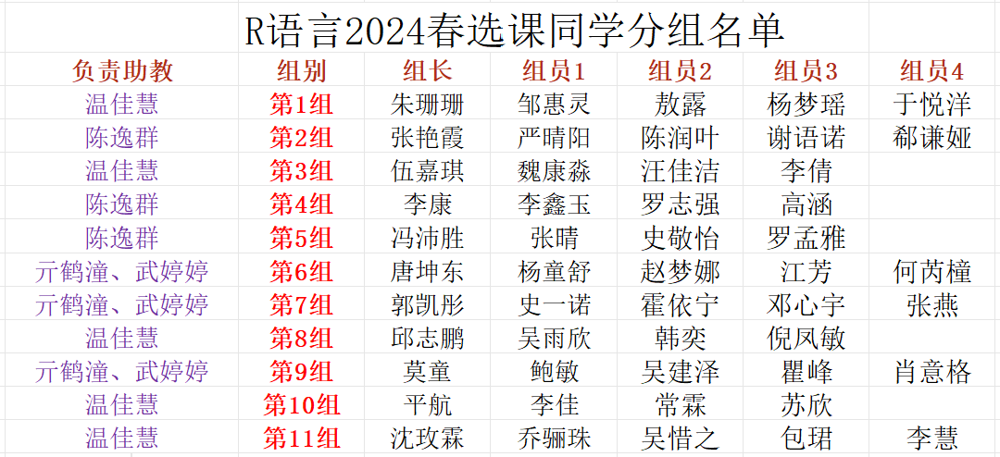
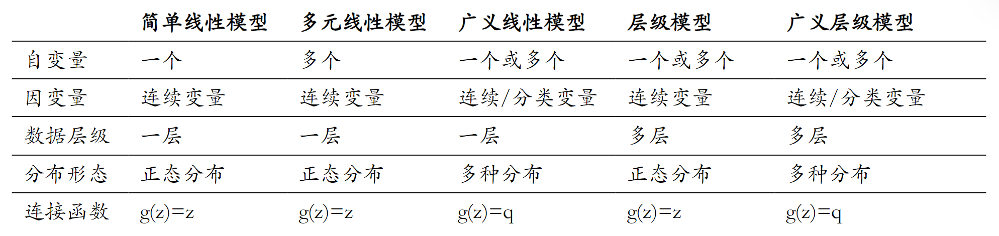
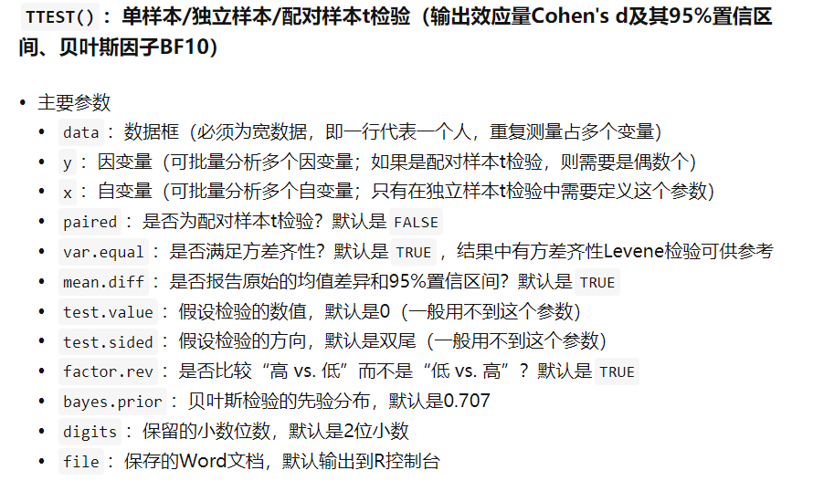
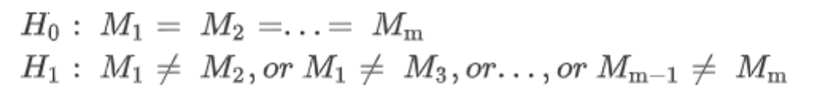

class: center, middle
<span style="font-size: 50px;">**第八章**</span> <br>
<span style="font-size: 50px;">基本统计分析</span> <br>
<span style="font-size: 30px;">胡传鹏</span> <br>
<span style="font-size: 20px;"> </span> <br>
<span style="font-size: 30px;">`r Sys.Date()`</span> <br>
<span style="font-size: 20px;"> Made with Rmarkdown</span> <br>

```{r setup, include=FALSE}
knitr::opts_chunk$set(
  fig.width=9, fig.height=4, fig.retina=2, 
  out.width="100%",
  message = FALSE,
  warning = F
)
```

```{css extra.css, echo=FALSE}
/* ---- extra.css ---- */
.bigfont {
  font-size: 30px;
}
.size5{
font-size: 20px;
}
.tit_font{
font-size: 60px;
}

```


---
<br>
<br>
```{r, echo = FALSE, fig.width = 4.5, fig.height = 3}

```

---
<h1 lang="en" style="font-size: 60px;">Contents</h1>
<br>
<span style="font-size: 45px;">8.1 课程思路</span></center> <br>
<br>
<span style="font-size: 45px;">8.2 *t*-test</span></center> <br>
<span style="font-size: 30px;">&emsp;8.2.1 *t*-test基础知识</span></center> <br>
<span style="font-size: 30px;">&emsp;8.2.2 bruceR::TTEST</span></center> <br>
<span style="font-size: 30px;">&emsp;8.2.3 代码实操</span></center> <br>
<br>
<span style="font-size: 45px;">8.3 ANOVA</span></center> <br>
<span style="font-size: 30px;">&emsp;8.3.1 ANOVA基础知识</span></center> <br>
<span style="font-size: 30px;">&emsp;8.3.2 bruceR::MANOVA</span></center> <br>
<span style="font-size: 30px;">&emsp;8.3.3 代码实操</span></center> <br>
<span style="font-size: 30px;">&emsp;8.3.4 ANOVA与线性回归</span></center> <br>


---
# 8.1  课程思路
## 8.1.1 总体思路
```{r, echo = FALSE, fig.width = 4.5, fig.height = 3}
knitr::include_graphics('pic_new/chp8/route.png')
```

---
# 8.1  课程思路
## 8.1.2 bruceR
```{r xaringan-panelset, echo=FALSE}
xaringanExtra::use_panelset()
```

.panelset[
.panel[.panel-name[概述]
```{r, echo=FALSE}
knitr::include_graphics('pic_new/chp8/zhihu1.png')
```

来源：https://zhuanlan.zhihu.com/p/281150493

.panel[.panel-name[功能概览]
```{r, echo=FALSE}
knitr::include_graphics('pic_new/chp8/zhihu2.png')
```
来源：https://zhuanlan.zhihu.com/p/281150493
.panel[.panel-name[主要函数功能简介]

**set.wd()或set_wd()**：自动获取并设置到当前打开文件（R脚本）的路径<br>
**import() / export()**：一站式导入/导出任意存储格式的数据表<br>
**RECODE()**：数值重新编码<br>
**Alpha()**：内部一致性信度（输出Cronbach's α、McDonald's ω）<br>
**EFA()与PCA()**：探索性因素分析与主成分分析<br>
**CFA()**：验证性因素分析<br>
**MEAN()**：多变量的横向计算系列函数——求多题平均值（无需额外手动反向计分）<br>
**Describe()**：描述统计（输出样本量、平均值、标准差、中位数、偏度、峰度）<br>
**Corr()**：相关分析（输出相关系数及其95%置信区间）<br>
**TTEST()**：单样本/独立样本/配对样本t检验（输出效应量Cohen's d及其95%置信区间、贝叶斯因子BF10）<br>
**MANOVA()**：多因素被试间/被试内/混合设计方差分析ANOVA（输出效应量partial η²、generalized η²）<br>
**EMMEANS()**：简单效应检验与多重比较（输出效应量Cohen's d及其95%置信区间）<br>
**model_summary()**：回归模型结果汇总输出（输出到R Console或Word文档）<br>
**PROCESS()**：普通与多水平的中介效应、调节效应、有调节的中介效应分析<br>

来源：https://zhuanlan.zhihu.com/p/281150493
]]]]

---
# 8.1  课程思路
## 8.1.3 stats：R自带的包
<br>
**数据清理**：如na.omit（删除含有缺失值的观测）、na.action（设置缺失值处理方式）等。<br>
**描述性统计**：如mean（计算均值）、var（计算方差）、sd（计算标准差）等。<br>
**概率分布**：提供了各种概率分布的密度函数、分布函数、分位数函数和随机数生成函数，例如dnorm、pnorm、qnorm、rnorm等。<br>
**统计检验**：包括t检验（t.test）、ANOVA（aov）、回归分析（lm）、卡方检验（chisq.test）等。<br>
**线性模型**：lm函数用于拟合线性模型，anova用于分析模型方差，summary用于提取模型的摘要信息。<br>
**预测和区间**：predict函数用于模型的预测，confint用于计算置信区间。<br>
**统计图形**：如plot、hist、qqnorm等，用于数据可视化。<br>
**时间序列分析**：包括时间序列对象的创建（ts）、时间序列模型的拟合（如arima）、预测（如forecast）等。<br>
**非线性最小二乘法和最大似然估计**：如nls和optim函数。<br>
**聚类分析**：如kmeans和hclust函数。<br>

---
# 8.1  课程思路
## 8.1.4 线性回归

.panelset[
.panel[.panel-name[回归分析]

&nbsp;&nbsp;&nbsp;&nbsp;回归分析用于研究一个或多个自变量（预测变量）与一个因变量（响应变量）之间的关系。<br>
&nbsp;&nbsp;&nbsp;&nbsp;其目的是找到最佳拟合线的方程，这条线尽可能地接近所有的数据点。<br>
&nbsp;&nbsp;&nbsp;&nbsp;可以初步分为线性回归和非线性回归。<br>



.panel[.panel-name[线性回归]

&nbsp;&nbsp;&nbsp;&nbsp;线性回归的基本思想是通过数据拟合一条直线，使得这条直线尽可能地接近所有的数据点，从而实现对新数据点的预测。<br>
&nbsp;&nbsp;&nbsp;&nbsp;线性回归模型可以表示为：
$$y = \beta_0 + \beta_1 x_1 + \beta_2 x_2 + ... + \beta_p x_p + \epsilon$$
&nbsp;&nbsp;&nbsp;&nbsp;其中，y是因变量，x是自变量， $β_i$  是模型参数，表示截距和斜率，ε是误差项，表示模型未能解释的随机误差。<br>
]]]
---
<h1 lang="en" style="font-size: 60px;">Packages</h1>
```{r}
if (!requireNamespace('pacman', quietly = TRUE)) {
    install.packages('pacman')
}


pacman::p_load(
  # 本节课需要用到的 packages
  here, tidyverse, bruceR,
  # 生成课件
  xaringan, xaringanthemer, xaringanExtra)
```
<br>
<h1 lang="zh-CN" style="font-size: 60px;">如果你的输出中常出现科学计数法</h1>
```{r}
# 改变R在显示大数字和小数字时是选择常规格式还是科学计数法的倾向
options(scipen=999)

# 还原设置 options(scipen = 0)
```


---
class: center, middle
<span style="font-size: 60px;">8.2  *t*-test</span> <br>


---
# <h1 lang="zh-CN">8.2.1 *t*检验基础知识</h1>

.panelset[
.panel[.panel-name[单样本(One sample)t检验]
## 比较单个样本的平均值(m)与已知的总体平均值(μ)之间是否存在显著差异
<br>
## 前提条件
* 正态性（Normality）：样本数据应来自正态分布的总体。样本量足够大时，即使不严格服从正态分布，结果也是稳健的。
* 独立性（Independence）：样本中的观测值必须是独立的，即一个观测值不应影响另一个观测值。

## 假设
* $H_0$: 样本的均值(m)与给定的总体均值或假设的总体均值(μ)之间没有显著差异。
* $H_1$: 样本的均值(m)与给定的总体均值或假设的总体均值(μ)之间有显著差异。
<br>

$$t = \frac{\bar{X} - \mu}{s / \sqrt{n}}$$
.panel[.panel-name[配对样本(Dependent/Paired)t检验]
## 比较两个相关的样本组（例如，同一组受试者在不同条件下的测量）的平均值是否存在显著差异。
<br>
## 前提条件
* 正态性（Normality）：每对差异值（即两次测量之间的差值）应来自正态分布的总体。
* 独立性（Independence）：配对样本中的观测值必须是独立的，即每一对观测值不应影响其他对的观测值。
* 同方差性（Homoscedasticity）：配对差异值的方差应该是恒定的，即差异值的方差不应随着均值的变化而变化。
* 配对设计（Paired Design）：数据必须是以配对形式收集的。

## 假设
* $H_0$: 配对样本的总体平均差与零没有显著差异，即μ_d = 0（两个配对样本的均值没有显著差异）。
* $H_1$: 配对样本的总体平均差与零有显著差异，即μ_d ≠ 0（两个配对样本的均值存在显著差异）。
<br>
$$t = \frac{\bar{D}}{s / \sqrt{n}}$$
.panel[.panel-name[独立样本(Indpendent)t检验]
## 比较两个独立样本群体的均值是否有显著差异。
<br>
## 前提条件
* 正态性：两个样本数据都应该来自正态分布的总体。
* 同方差性：两个样本的方差应该是相等的。
* 独立性：两个样本应该是独立的，即一个样本的观测值不应影响另一个样本的观测值。

## 假设
* $H_0$: 两个独立样本群体的均值没有显著差异，即 μ_1 = μ_2
* $H_1$: 两个独立样本群体的均值有显著差异，即 μ_1 ≠ μ_2
<br>
$$t = \frac{\bar{X}_1 - \bar{X}_2}{\sqrt{\frac{s_1^2}{n_1} + \frac{s_2^2}{n_2}}}$$
]]]]
---
# <h1 lang="zh-CN">8.2.2 bruceR::TTEST</h1>
```{r, echo = FALSE, fig.width=4.5, fig.height=2}

```
---
# <h1 lang="zh-CN">8.2.3 代码实操</h1>

.panelset[
.panel[.panel-name[tidy data]
```{r prepare}
# 导入数据
df1 <- bruceR::import(here::here('data', 'penguin', 'penguin_rawdata.csv'))
#清理数据
df.penguin <- df1 %>%
  dplyr::select(Temperature_t1, Temperature_t2, socialdiversity, Site, DEQ, romantic, ALEX1:ALEX16) %>% #选择变量
  dplyr::filter(!is.na(Temperature_t1) & !is.na(Temperature_t2) & !is.na(DEQ)) %>% #处理缺失值
  dplyr::mutate(Temperature = rowMeans(select(., starts_with("Temperature"))),#计算两次核心温度的均值
                ALEX4 = case_when(TRUE ~ 6 - ALEX4),
                ALEX12 = case_when(TRUE ~ 6 - ALEX12),
                ALEX14 = case_when(TRUE ~ 6 - ALEX14),
                ALEX16 = case_when(TRUE ~ 6 - ALEX16),
                ALEX = rowSums(select(., starts_with("ALEX"))))#反向计分后计算总分
```

.panel[.panel-name[查看数据]

```{r}
DT::datatable(head(df.penguin),
              fillContainer = TRUE, options = list(pageLength = 4))
```

.panel[.panel-name[具体问题]
<br>
<h3 lang="zh-CN">1. “在penguin数据中，全体被试的核心体温(Temperature)是否等于36.6？”</h3>
<br>
<h3 lang="zh-CN">2. “在penguin数据中，被试报告的两个核心温度(Temperature_t1,Temperature_t2)是否有显著差异？”</h3>
<br>
<h3 lang="zh-CN">3. “在penguin数据中，是否处于恋爱关系中(romantic)对核心体温(Temperature)有无影响？”</h3>
]]]]

---
# <h1 lang="zh-CN">8.2.3 代码实操|单样本*t*检验</h1>
<br>
全体被试的核心体温(Temperature)是否等于36.6


.panelset[
.panel[.panel-name[bruceR::TTEST]
```{r}
bruceR::TTEST(data = df.penguin, #数据
                y = "Temperature", #确定变量
                test.value = 36.6, #固定值
                test.sided = "=")  #根据研究目的，可更改为“<”或“>”
```

.panel[.panel-name[stats::t.test]
```{r}
stats::t.test(x = df.penguin$Temperature, #核心体温均值
              mu = 36.6) #固定值
```

.panel[.panel-name[stats::lm]

```{r}
model.single <- lm(data = df.penguin, #数据
                   formula = Temperature-36.6 ~ 1) #公式：只有截距，没有自变量
summary(model.single)
```
]]]]

---
# <h1 lang="zh-CN">8.2.3 代码实操|单样本*t*检验</h1>
<br>
全体被试的核心体温(Temperature)是否等于36.6?

$$y = \beta_0 + \beta_1 x_1 + \beta_2 x_2 + ... + \beta_p x_p + \epsilon$$

此时，仅截距不为0。<br>
--
$$y = \beta_0$$
$$H_0: \beta_0 = 0$$

---
# <h1 lang="zh-CN">8.2.3 代码实操|单样本*t*检验</h1>
<br>
全体被试的核心体温(Temperature)是否等于36.6

<p align="center">
  
</p>

---
# <h1 lang="zh-CN">8.2.3 代码实操|配对样本*t*检验</h1>
<br>
被试报告的两个核心温度(Temperature_t1,Temperature_t2)是否有显著差异

.panelset[
.panel[.panel-name[bruceR::TTEST]
```{r}
bruceR::TTEST(data = df.penguin, #数据
                 y = c("Temperature_t1",              
                       "Temperature_t2"), #变量为两次核心体温
                 paired = T)  #是否为配对样本*t*检验？默认是FALSE
```

.panel[.panel-name[stats::t.test]
```{r}
stats::t.test(x = df.penguin$Temperature_t1, #第1次核心体温
              y = df.penguin$Temperature_t2, #第2次核心体温
              paired = TRUE) #配对
```

.panel[.panel-name[stats::lm]
```{r}
model.paired <- lm(data = df.penguin,
                   formula = Temperature_t1 - Temperature_t2 ~ 1)
summary(model.paired)#查看模型拟合情况
```
]]]]
---
# <h1 lang="zh-CN">8.2.3 代码实操|配对样本*t*检验</h1>
<br>
被试报告的两个核心温度(Temperature_t1,Temperature_t2)是否有显著差异
 
$$y_1 - y_2 = \beta_0 $$
$$H_0: \beta_0 = 0 $$
可以将配对样本*t*检验理解为对差值进行的单样本*t*检验，即单独用一个数字来预测对应的差值（见图的右半部分）。<br>
也可以认为这些组间之差是斜率（见图的左半部分）。<br>

<p align="center">
  
</p>
---
# <h1 lang="zh-CN">8.2.3 代码实操|独立样本*t*检验</h1>
<br>
是否处于恋爱关系中对核心体温有无影响

.panelset[
.panel[.panel-name[bruceR::TTEST]
```{r, results='hide'}
bruceR::TTEST(data = df.penguin, #数据
                y = "Temperature", #因变量：核心体温均值
                x = "romantic" #自变量：是否在恋爱关系中
) %>%
  capture.output() %>%
  .[c(14:20,24:29)]#使用capture.output只是为了在课件中呈现
```


.panel[.panel-name[stats::t.test]
```{r}
stats::t.test(data = df.penguin, #数据框
              Temperature ~ romantic) #因变量~自变量
```

.panel[.panel-name[stats::lm]
```{r}
model.inde <- lm(data = df.penguin,
                   formula = Temperature ~ romantic)
summary(model.inde)
```
]]]]

---
# <h1 lang="zh-CN">8.2.3 代码实操|独立样本*t*检验</h1>
## <h2 lang="zh-CN">是否处于恋爱关系中对核心体温有无影响？</h2>
两个均值来预测y。<br>
--
$$y_i = \beta_0 + \beta_1 x_i$$ 
$$H_0: \beta_1 = 0 $$

<p align="center">
  
</p>
---
# <h1 lang="zh-CN">8.2.3 代码实操|独立样本*t*检验</h1>
<br>
是否处于恋爱关系中对核心体温有无影响？

<br>
<h3 lang="en">The basic format for reporting the result of a *t*-test is the same in each case:</h3>
<h3 lang="en">*t*(degress of freedom) = the t-value , *p* = p-value, Cohen's *d* = effect size</h3>

```{r, echo = FALSE, fig.width=6, fig.height=4}
knitr::include_graphics('pic_new/chp8/example.png')
```


---
# <h1 lang="zh-CN">课堂练习1</h1>
<br>
<br>
## 尝试用t检验以及线性回归解决以下问题，对比结果是否一致
<h2 lang="zh-CN">1. “在Penguin数据中，被试社交复杂度(socialdiversity)的分数是否显著高于6？”</h2>
<br>
<h2 lang="zh-CN">2. “在Penguin数据中，处在不同恋爱关系中(romantic)的被试在社交复杂度(socialdiversity)上是否有显著差异？”</h2>
<br>


---
class: center, middle
<span style="font-size: 60px;">8.3  方差分析</span> <br>


---
# 8.3  ANOVA
## 8.3.1 基础知识
.pull-left[

]

.pull-right[
<br>
<br>
<br>
当研究者想要比较两个或多个组之间的均值差异时，可使用方差分析(Analysis of Variance，简称ANOVA)。<br>
<br>
它由英国统计学家R.A.Fisher提出，基本思想是将测量数据的总变异（即总方差）按照变异来源分为处理（组间）效应和误差（组内）效应，并作出其数量估计，从而确定实验处理对研究结果影响力的大小。
]

---
# 8.3  ANOVA
## 8.3.1 基础知识
<br>
<br>
**基本假设：**

1.正态性<br>
实验中的观测值应来自正态分布的总体。当观测值不是正态分布时需要对观测值做合适的转换。<br>

2.独立性<br>
每个因素的影响被看作是独立的，不受其他因素的影响。在理想情况下，如果将一个因素的效应加到总效应中去，它应该增加（或者减少）平均响应一个固定的数量，而不依赖于其他任何因素。<br>

3.方差齐性<br>
当被试随机分配给K个处理水平时，K个处理组被试的观测值的变异是同质的，即各个组的变异是相等的。<br>

---
# 8.3  ANOVA
## 8.3.1 基础知识
<p align="center">
  
</p>

---
# 8.3  ANOVA
## 8.3.1 基础知识
平方和(SS)的计算
<br>
.panelset[
.panel[.panel-name[Type I SS]
<br>
通常用于顺序重要的模型。也就是说，解释变量的顺序会影响到类型I平方和的计算结果。<br>
<br>
**stats::aov()函数默认采用的就是Type I SS，它逐步将每一个因子引入模型进行计算。**<br>

.panel[.panel-name[Type II SS]
<br>
适用于所有主效应不涉及交互效应的情况。也就是说，它忽略了因子之间可能存在的交互作用。<br>
假定所有的因子都是同时进入模型的，并且它们都是等价的。<br>
<br>
**car::Anova()函数默认计算Type II SS，可以通过type = 3调整为Type III SS。**<br>

.panel[.panel-name[Type III SS]
<br>
类型III平方和是一个更全面的模型，涉及所有的主效应以及交互效应。<br>
它假定所有因子（以及它们的交互项）都是重要的，并考虑所有因素。<br>
<br>
**bruceR::MANOVA*()函数默认采用Type III SS，可以通过ss.type = 2调整为Type II SS。**<br>

]]]]

---
# 8.3  ANOVA
## 8.3.1 基础知识
按照自变量个数，可以分为单因素方差分析、双因素方差分析、以及多因素方差分析。
.panelset[
.panel[.panel-name[单因素方差分析]
最基本的方差分析形式，用于检验一个变量不同水平之间是否有显著差异。<br>
例如，比较三种不同的教学方法对学生学习成绩的影响。在这种情况下，自变量是“教学方法”，因变量是学生学习成绩。<br>
<br>
<br>
```{r, echo = FALSE, fig.width=4.5, fig.height=2.5}

```

.panel[.panel-name[双因素方差分析]
双因素方差分析用于检验两个分类变量和它们的交互效应对因变量的影响。<br>
例如，要检察两种不同的教学方法和两种不同的课程难度对学生学习成绩的影响。<br>
<br>
<br>
```{r, echo = FALSE, fig.width=4.5, fig.height=2.5}
knitr::include_graphics('pic_new/chp8/mway.png')
```

.panel[.panel-name[多因素方差分析]
最复杂的ANOVA类型，用于检验多个分类变量和它们的交互效应对响应变量的影响。<br>
例如，要检验课程类型，教学方法，学生性别等多个因素对学习成绩的影响。<br>
<br>
<br>
```{r, echo = FALSE, fig.width=4.5, fig.height=2.5}
knitr::include_graphics('pic_new/chp8/mway.png')
```

]]]]

---
# 8.3  ANOVA
## 8.3.2 bruceR::MANOVA
<p align="center">
  
</p>

---
# 8.3  ANOVA
## 8.3.2 bruceR::MANOVA
<p align="center">
  
</p>

---
class: center, middle
<span style="font-size: 60px;">问题1</span> <br>
<span style="font-size: 60px;">在match数据中，被试在匹配(match)条件和不匹配(mismatch)条件下的反应时是否存在差异？</span> <br>
<br>
<span style="font-size: 45px;">完成这一分析需要什么方法与数据格式？</span> <br>

---
# 8.3  ANOVA
## 8.3.3 代码实操|单因素方差分析
.panelset[
.panel[.panel-name[`tidy data`]
```{r}
df.match <- read.csv(here::here("data", "match","match_raw.csv"),
                     header = T, sep=",", stringsAsFactors = FALSE) %>%
  # 拆分单元格内字符串
  tidyr::separate(col=Shape,
                  into=c("Valence","Identity"),
                  sep="(?<=moral|immoral)(?=Self|Other)") %>% 
  dplyr::select(Sub, Match, Valence, Identity, everything()) %>%
  dplyr::filter(ACC == 1) %>%    # 只选择回答正确的数据
  dplyr::filter(!is.na(RT)) %>%  # 剔除缺失值
  # remove outliers below and above 3rd sd
  dplyr::filter(RT > quantile(RT, 0.0015) & RT < quantile(RT, 0.9985)) %>%
  dplyr::mutate(RT = as.numeric(RT)) %>%
  dplyr::mutate(Valence = as.factor(Valence),
                Identity = as.factor(Identity))
```
```{r example of match data, echo=FALSE}
DT::datatable(head(df.match, 24),
              fillContainer = TRUE, options = list(pageLength = 5))
```

.panel[.panel-name[`preprocessing`]
```{r}
df.match.long1 <- df.match %>%
  dplyr::group_by(Sub, Match) %>%
  dplyr::summarise(
    n = n(),
    rt_sd = sd(as.numeric(RT), na.rm = T),
    rt_mean = mean(as.numeric(RT), na.rm = T)
    ) %>%
  dplyr::ungroup()
```
```{r example of long match data1, echo=FALSE}
DT::datatable(head(df.match.long1, 24),
              fillContainer = TRUE, options = list(pageLength = 5))
```

]]]

---
# 8.3  ANOVA
## 8.3.3 代码实操|单因素方差分析
```{r}
# 正态性检验-Shapiro-Wilk测试
# 若p >.05，不能拒绝数据符合正态分布的零假设

shapiro.test(df.match.long1$rt_mean)

```

---
# 8.3  ANOVA
## 8.3.3 代码实操|单因素方差分析
```{r}
# 正态性检验-qq图
qqnorm(df.match.long1$rt_mean)
qqline(df.match.long1$rt_mean, col = "red") # 添加理论正态分布线
```


---
# 8.3  ANOVA
## 8.3.3 代码实操|单因素方差分析
.panelset[
.panel[.panel-name[`bruceR::MANOVA`]
```{r,results='hide'}
res1 <- bruceR::MANOVA(data = df.match.long1,
                       subID = "Sub",    # 被试id
                       dv = "rt_mean",   # 因变量，因为是MANOVA，实际上因变量可以再后面设置很多个
                       within = "Match" # 设置条件，因素分析的条件
) 
```

```{r,echo=FALSE}
res1 %>%
  capture.output()
```

.panel[.panel-name[`stats::aov()`]
```{r}
aov1 <- aov(rt_mean ~ Match, data = df.match.long1)
summary(aov1)
```

.panel[.panel-name[`stats::lm()`]
```{r}
lm1 <- lm(rt_mean ~ Match, data = df.match.long1)
summary(lm1)
```

]]]]

---
# 8.3  ANOVA
## 8.3.4 ANOVA与线性回归
<br>
线性回归采用最小二乘法使得残差平方和最小。<br>
方差分析中的组内平方和是一个类似的概念——也即是尽量让各组内的数据点尽可能接近各自组的均值。<br>
<br>
单因素方差分析可以看作是一种特殊的线性回归模型，自变量是分类数据。<br>
实际上，线性回归模型中如果使用分类变量（dummy coding）作为预测变量，得到的结果和ANOVA是一样的。组间效应（组间平方和）就被视为线性模型中的斜率效应。<br>
<br>
同理，双因素方差分析也可以看作是一种特殊的线性回归模型，自变量为两个分类变量。<br>


---
# 8.3  ANOVA
## 8.3.4 ANOVA与线性回归
```{r, echo=FALSE}
# Figure
N = 15

# Generate normal data with known parameters
rnorm_fixed = function(N, mu = 0, sd = 1)
  scale(rnorm(N)) * sd + mu

# Plot style.
theme_axis = function(P,
                      jitter = FALSE,
                      xlim = c(-0.5, 2),
                      ylim = c(-0.5, 2),
                      legend.position = c(0,0)) {
  P = P + theme_bw(15) +
    geom_segment(
      x = -1000, xend = 1000,
      y = 0, yend = 0,
      lty = 2, color = 'dark gray', lwd = 0.5
    ) +
    geom_segment(
      x = 0, xend = 0,
      y = -1000, yend = 1000,
      lty = 2, color = 'dark gray', lwd = 0.5
    ) +
    coord_cartesian(xlim = xlim, ylim = ylim) +
    theme(
      axis.title = element_blank(),
      axis.text = element_blank(),
      axis.ticks = element_blank(),
      panel.border = element_blank(),
      panel.grid = element_blank(),
      legend.position = legend.position
    )
  
  # Return jittered or non-jittered plot?
  if (jitter) {
    P + geom_jitter(width = 0.1, size = 2)
  }
  else {
    P + geom_point(size = 2)
  }
}

D_anova1 = data.frame(
  y = c(
    rnorm_fixed(N, 0.5, 0.3),
    rnorm_fixed(N, 0, 0.3),
    rnorm_fixed(N, 1, 0.3),
    rnorm_fixed(N, 0.8, 0.3)
  ),
  x = rep(0:3, each = 15)
)
ymeans = aggregate(y~x, D_anova1, mean)$y
P_anova1 = ggplot(D_anova1, aes(x=x, y=y)) + 
  stat_summary(fun.y=mean, geom = "errorbar", aes(ymax = ..y.., ymin = ..y.., color='intercepts'), lwd=2) + 
  geom_segment(x = -10, xend = 100, y = 0.5, yend = 0.5, lwd = 2, aes(color = 'beta_0')) +
  geom_segment(x = 0, xend = 1, y = ymeans[1], yend = ymeans[2], lwd = 2, aes(color = 'betas')) +
  geom_segment(x = 1, xend = 2, y = ymeans[1], yend = ymeans[3], lwd = 2, aes(color = 'betas')) +
  geom_segment(x = 2, xend = 3, y = ymeans[1], yend = ymeans[4], lwd = 2, aes(color = 'betas')) +
  
  scale_color_manual(
    name = NULL, values = c("blue", "red", "darkblue"), 
    labels=c(
      bquote(beta[0]*" (group 1 mean)"), 
      bquote(beta[1]*", "*beta[2]*",  etc. (slopes/differences to "*beta[0]*")"),
      bquote(beta[0]*"+"*beta[1]*", "*beta[0]*"+"*beta[2]*", etc. (group 2, 3, ... means)")
    )
  )
  
#theme_axis(P_anova1, xlim = c(-0.5, 4), legend.position = c(0.7, 0.1))
```

<p align="center">
  
</p>


---
# 8.3  ANOVA
## 单因素方差分析|思考
假如数据是宽数据可以完成分析吗？它和上面学习的t检验有什么区别？
```{r}
df.match.wide1 <- df.match.long1 %>%
  dplyr::select(Sub, Match, rt_mean) %>%
  tidyr::pivot_wider(names_from = Match,
                     values_from = rt_mean)
```
```{r example of wide match data1, echo=FALSE}
DT::datatable(head(df.match.wide1, 24),
              fillContainer = TRUE, options = list(pageLength = 5))
```


---
class: center, middle
<span style="font-size: 60px;">问题2</span> <br>
<span style="font-size: 60px;">在match数据中，被试在不同身份与不同效价的条件组合下反应时是否存在差异？</span> <br>
<br>
<span style="font-size: 45px;">2(self vs other) * 2(moral vs immoral) 的被试内设计</span> <br>


---
# 8.3  ANOVA
## 8.3.3 代码实操|双因素方差分析
.panelset[
.panel[.panel-name[`long data`]
```{r}
df.match.long2 <- df.match %>%
    dplyr::filter(Match == "match") %>%
  dplyr::group_by(Sub, Valence, Identity) %>%
  dplyr::summarise(
    n = n(),
    rt_sd = sd(as.numeric(RT), na.rm = T),
    rt_mean = mean(as.numeric(RT), na.rm = T)
    ) %>%
  dplyr::ungroup()
```
```{r example of long match data2, echo=FALSE}
DT::datatable(head(df.match.long2, 24),
              fillContainer = TRUE, options = list(pageLength = 6))
```

.panel[.panel-name[`wide data`]
```{r}
df.match.wide2 <- df.match.long2 %>%
  dplyr::select(Sub, Valence, Identity, rt_mean) %>%
  dplyr::mutate(Valence = paste("A_", Valence, sep = ""),#将变量的名称进行修改转换，不生产新的变量
                Identity = paste("B_", Identity, sep = "")) %>%
  # 将morality和identity组合名称起来生成一个新的变量"Condition"
  unite("Condition", Valence, Identity, sep = "&") %>%
  tidyr::pivot_wider(names_from = Condition,
                     values_from = rt_mean)
```
```{r example of wide match data2, echo=FALSE}
DT::datatable(head(df.match.wide2, 24),
              fillContainer = TRUE, options = list(pageLength = 5))
```

]]]


---
# 8.3  ANOVA
## 8.3.3 代码实操|双因素方差分析
```{r}
# 正态性检验-Shapiro-Wilk测试
# 若p >.05，不能拒绝数据符合正态分布的零假设

shapiro.test(df.match.long1$rt_mean)

```


---
# 8.3  ANOVA
## 8.3.3 代码实操|双因素方差分析
```{r}
# 正态性检验-qq图
qqnorm(df.match.long1$rt_mean)
qqline(df.match.long1$rt_mean, col = "red") # 添加理论正态分布线
```


---
# 8.3  ANOVA
## 8.3.3 代码实操|双因素方差分析
.panelset[
.panel[.panel-name[`bruceR::MANOVA()`]
```{r,results='hide'}
res2 <- bruceR::MANOVA(data=df.match.long2,
                            dv="rt_mean",
                            within=c("Valence","Identity"),
                            subID="Sub")
```
```{r,echo=FALSE}
res2 %>%
  capture.output()
```


.panel[.panel-name[`car::Anova()`]
```{r}
aov2 <- car::Anova(aov(rt_mean ~ Valence * Identity, data = df.match.long2), type = 3)
aov2
```

.panel[.panel-name[`stats::lm()`]
```{r}
lm2 <- lm(rt_mean ~ Valence * Identity, data = df.match.long2)
summary(lm2)
```

]]]]


---
# 8.3  ANOVA
## 8.3.3 代码实操|双因素方差分析
```{r,results='hide'}
# 宽数据
res2_wide <- bruceR::MANOVA(data = df.match.wide2,
                            dvs = "A_immoral&B_Other:A_moral&B_Self",
                            dvs.pattern = "A_(.+)B_(.+)",#正则表达式
                            within = c("A_","B_"))
```
```{r,echo=FALSE}
res2_wide %>%
  capture.output()
```


---
# 8.3  ANOVA
## 8.3.2 bruceR::EMMEANS
<p align="center">
  
</p>

---
# 8.3  ANOVA
## 8.3.3 代码实操|双因素方差分析
简单效应分析
.panelset[
.panel[.panel-name[`长数据`]
```{r,results='hide'}
sim_eff_long <- res2 %>% 
  bruceR::EMMEANS("Identity", by = "Valence")
```

```{r,echo=FALSE}
sim_eff_long %>%
  capture.output()
```


.panel[.panel-name[`宽数据`]
```{r,results='hide'}
sim_eff_wide <- res2_wide %>%
  bruceR::EMMEANS("A_", by = "B_") 
```

```{r,echo=FALSE}
sim_eff_wide %>%
  capture.output()
```


]]]


---
# 8.3  ANOVA
## 8.3.4 ANOVA与线性回归
<p align="center">
  
</p>


---
class: center, middle
<span style="font-size: 60px;">思考</span> <br>
<span style="font-size: 60px;">如何从线性回归的角度理解重复测量方差分析呢？</span> <br>


---
# <h1 lang="zh-CN">课堂练习2</h1>
<br>
<br>
<br>
<h2 lang="zh-CN">在match数据中，以性别，身份为自变量，反应时为因变量进行方差分析</h2>

