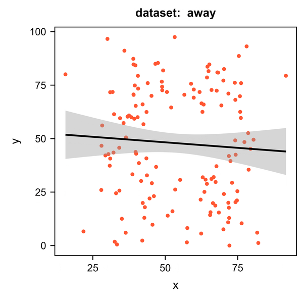
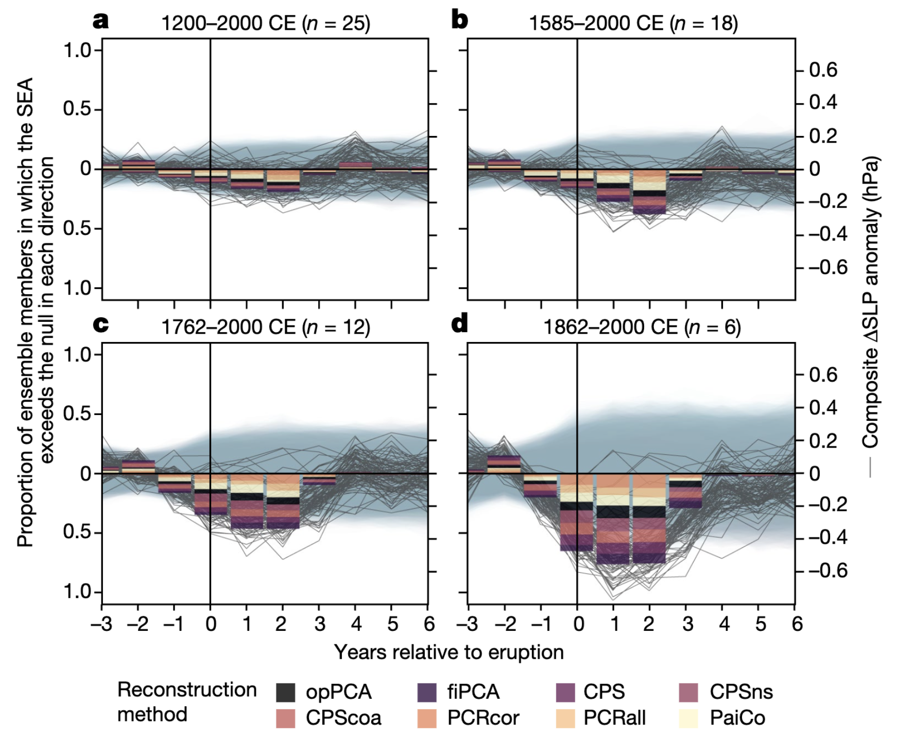
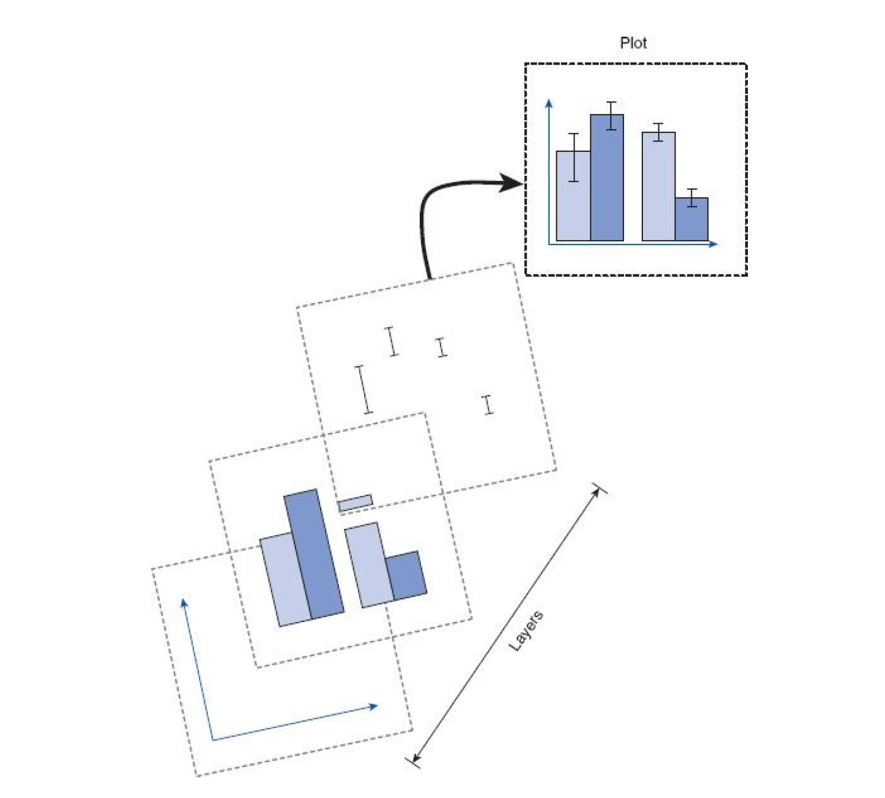

class: center, middle
<span style="font-size: 50px;">**第八章**</span> <br>
<span style="font-size: 50px;">__如何探索数据: __</span> <br>
<span style="font-size: 40px;">描述性统计与数据可视化基础</span><br>
<span style="font-size: 30px;">胡传鹏</span> <br>
<span style="font-size: 20px;"> </span> <br>
<span style="font-size: 30px;">`r Sys.Date()`</span> <br>
<span style="font-size: 20px;"> Made with Rmarkdown</span> <br>

```{r setup, include=FALSE}
knitr::opts_chunk$set(
  fig.width=9, fig.height=4, fig.retina=2, 
  out.width="100%",
  message = FALSE,
  warning = F
)
```

```{css extra.css, echo=FALSE}
/* ---- extra.css ---- */
.bigfont {
  font-size: 30px;
}
.size5{
font-size: 20px;
}
.tit_font{
font-size: 60px;
}

```


---
# Packages
```{r}
if (!requireNamespace('pacman', quietly = TRUE)) {
    install.packages('pacman')
}


pacman::p_load(
  # 本节课需要用到的 packages
  here,skimr,quartets,GGally,showtext,bruceR,tidyverse,DataExplorer,
  # 生成课件
  xaringan,xaringanthemer,xaringanExtra)
```


---
class: inverse center middle
.tit_font[
回顾
]

???
-   回顾

-   数据探索与描述统计

-   为什么可视化

-   为什么用 ggplot 画图

-   ggplot 绘图的原理

-   基本图形简介
  -   散点图
  -   柱状图
  -   密度图
  -   


---
## 8.0.1  回顾: 批量导入数据
```{r xaringan-panelset, echo=FALSE}
xaringanExtra::use_panelset()
```


.panelset[
.panel[.panel-name[获取路径]
```{r}
# 所有数据路径
files <- list.files(  #<<
  ## <- & =
  here::here("data", "match"), 
  pattern = "data_exp7_rep_match_.*\\.out$", 
  full.names = TRUE)
```


.panel[.panel-name[数据类型转换]

```{r}
convert_data_types <- function(df) {
  df <- df %>% 
    dplyr::mutate(Date = as.character(Date),Prac = as.character(Prac),
                  Sub = as.numeric(Sub),Age = as.numeric(Age),
                  Sex = as.character(Sex),Hand = as.character(Hand),
                  Block = as.numeric(Block),Bin = as.numeric(Bin),
                  Trial = as.numeric(Trial),Shape = as.character(Shape),
                  Label = as.character(Label),Match = as.character(Match),
                  CorrResp = as.character(CorrResp),Resp = as.character(Resp),
                  ACC = as.numeric(ACC),RT = as.numeric(RT))
  return(df)
}
```

.panel[.panel-name[批量合并]
```{r }
df3 <- data.frame() 

for (i in seq_along(files)) {
  # 读取
  df <- read.table(files[i], header = TRUE) %>%  
    dplyr::filter(Date != "Date") %>%  
    convert_data_types() 
  # 合并
  df3 <- dplyr::bind_rows(df3, df) 
}
# 删除临时变量
rm(df, files, i)
```

.panel[.panel-name[保存数据]

```{r eval=FALSE}
## NOT RUN
## 上节课介绍了write.csv,也可使用bruceR::export
bruceR::export(
  df3, 
  file = here::here("data", "match","match_raw.csv"))

## 当然，export 不仅可以保存数据，也可以输出模型结果

```

.panel[.panel-name[修改列名-rename]
```{r}
## 修改第一列列名 Date 为小写 date
df3 %>% dplyr::rename(  ## new_name = old_name
  date = Date
) %>% colnames()  

## 将全部列名都变成小写
df3 %>% dplyr::rename_with(
  ## 将字符向量全部变成小写； ~ 声明这是一个函数，.代表前面的数据(df3)传到.所在的位置
  ~tolower(.)   #<<
  ## 即使用 tolower()对所有列名进行批量处理
  ##
) %>% colnames()

```


]
]
]
]
]
]

???
-   解释 变量赋值与参数接受符号差别

-   代码规范性，R 对缩进换行不敏感

-   export 函数


---
## 8.0.2  代码书写规范

```{r eval=FALSE}
## 看起来如何？
iris %>% group_by(Species) %>% summarize_all(mean) %>%
ungroup %>% gather(measure, value, -Species) %>%
arrange(value)
```

--
```{r eval=FALSE}
### 是不是更整洁一些
iris %>%
  dplyr::group_by(Species) %>%
  dplyr::summarize_if(is.numeric, mean) %>%
  dplyr::ungroup() %>%
  tidyr::gather(measure, value, -Species) %>%
  dplyr::arrange(value)
## 有没有自动挡…
```


.footnote[
-----
参考链接：[tidyverse style guide](https://style.tidyverse.org/index.html)
]


---
## 8.0.2  代码书写规范


```{r eval=FALSE}
## 使用 Ctrl + Shift + A  (cmd+shift+A in Mac) 
## 或者点击 Code --> Reformat Code (快捷键冲突)
## 自动增加空格与缩进
## 选中下面代码看看效果，尽管效果有限
## 还是平时养成书写习惯更好

files <- list.files(
  here::here("data","match"),
  pattern = "data_exp7_rep_match_.*\\.out$",
  full.names = TRUE
)
```


.footnote[
-----
参考链接：[tidyverse style guide](https://style.tidyverse.org/index.html)
]


---
## 8.0.3  回顾: 数据清洗
.pull-left[
### 列操作
-   增加、修改、删除(mutate)
-   列筛选(select & tidyseletion)

### 行操作

-   条件过滤(filter)
-   行索引(slice)

### 数据框
-   列/行合并：
    bind_cols & bind_rows

-   匹配合并：
    left_join, right_join, full_join

-   修改列名：
    rownames or dplyr::rename
    
-   长/宽数据转换：
    pivot_longer, pivot_wider
]


.pull-right[

### 分组计算

-   group_by/ungroup

-   summarise

-   rowMeans or bruceR::MEAN(or SUM)

-   case_when()

-   多列选取：across()

<br>
### 字符串(stringr package)
-   str_xxx()系列  

<br>
### 函数式编程(purrr package)

-   map()系列，类似 apply() 系列  

]


---
## 8.0.4  大作业

```{r,echo=FALSE,out.width="45%",fig.align='right'}

```

.footnote[
-----
参考链接：[文献列表及状态](https://osf.io/ck5eg); 

email: instituteforreplication@gmail.com.
]

---
class: center,middle


<span style="font-size: 50px;">**第八章**</span> <br>
<span style="font-size: 50px;">__如何探索数据: __</span> <br>
<span style="font-size: 40px;">描述性统计与数据可视化基础</span><br>


---
class: inverse,center,middle

.bigfont[
数据已经清洗完成，下面应该做的是……]
--
.bigfont[
<br>
查看数据内容？
<br>
建模分析？
<br>
......
]


--
.bigfont[
先看一个数据(quartets::datasaurus_dozen)
]


---

.panelset[
.panel[.panel-name[view]
```{r}
quartets::datasaurus_dozen %>%  ## 包中的数据
  head(10)
```

.panel[.panel-name[`str()`]
```{r}
quartets::datasaurus_dozen %>%  ## 包中的数据
  str()
```


.panel[.panel-name[`summary()`]
```{r}
summary(datasaurus_dozen)
```


]]]]


---
class: middle,center
.tit_font[
好像没什么问题…  

]

--
.tit_font[
<br>
作图看看呢
]

---
## 
```{r echo=FALSE,eval=FALSE}
## NOT SHOW
## PLOT GIF
pacman::p_load(camcorder, tidyverse, bruceR)
data = quartets::datasaurus_dozen
colors = c('#FF5733','#00CED1','#FFD700',
           '#8A2BE2','#32CD32','#4682B4',
           '#FF4500','#9400D3','#00FF00',
           '#FF1493','#8B0000','#FF69B4','#20B2AA')

orders <- data$dataset %>% unique()
orders <- c(orders[-1],orders[1])

pic <- list()
for(i in 1:13) {
  
    pic[[i]] <- data %>% filter(dataset == orders[i]) %>%
      ggplot(aes(x, y)) +
      geom_point(color = colors[i]) +
      geom_smooth(method = "lm", color = 'black')  +
      labs(title = paste0('dataset:  ', orders[i])) +
      bruceR::theme_bruce() +
      theme(title = element_text(size = 20)) 
}

gg_record(
  dir <- file.path(tempdir(), "recording"), 
  device = "png",
  width = 5,
  height = 5,
  units = "in",
  dpi = 500
)

for(i in 1:13){
  pic[[i]] %>% print()
}

gg_playback(name = file.path(paste0(getwd(),'/picture/chp7/'), "dino.gif"),
            first_image_duration = 1,
            last_image_duration = 3,
            frame_duration = 1,loop = F,
            playback = T,last_as_first = F,
)
gg_stop_recording()
```

```{r echo=FALSE,fig.align='center',out.width='50%'}

```


```{r echo=FALSE,fig.width=7,fig.height=6,fig.dpi=600,out.width='60%',fig.align='center',eval = FALSE}

### NOT RUN
quartets::datasaurus_dozen %>% 
  ggplot(aes(x, y, color = dataset)) +
  geom_point() +
  geom_smooth(method = "lm") +
  facet_wrap(~ dataset)
```


---
layout: true
# 8.1  探索性数据分析

---

.bigfont[了解原始数据的特点，做到心中有数，属于一个更广泛的概念： 

**探索性数据分析(Exploratory Data Analysis, EDA)**
]

> 在统计中，探索性数据分析(EDA)总结数据主要特征的数据分析取向, 通常是使用可视化的方法([Wikipedia](https://en.wikipedia.org/wiki/Exploratory_data_analysis)).  


```{r,echo=FALSE,out.width="50%",fig.align='center'}
knitr::include_graphics("picture/chp7/Data_visualization_process_v1.png")
```


---

.bigfont[探索性数据分析是为了更加了解数据，形成对数据基本的判断；但每一次探索背后仍然都有特定的问题。我们可以先从几个基础的简单问题开始:]

.pull-left[
.bigfont[
-   有哪些变量？
-   变量的类型？
-   变量的分布？
-   变量间关系？
]
]


.pull-right[

```{r eval = T}
# 读取数据
pg_raw <- bruceR::import(here::here(
  "data", "penguin","penguin_rawdata.csv"))

mt_raw <- bruceR::import(here::here(
  "data", "match","match_raw.csv")) 
```

]

---
.panelset[
.panel[.panel-name[`head`]
```{r, out.width = "10px"}
DT::datatable(head(mt_raw, 3))  # 注：datatable 这里只为了在网页中输出
```

.panel[.panel-name[`str`]
```{r}
mt_raw %>% 
  str() 
```

]]]

---
## 常用函数

.panelset[
.panel[.panel-name[`summary`]
```{r,out.width="10%"}
summary(mt_raw) %>% 
  knitr::kable() # 注：kable函数只为了输出
```


.panel[.panel-name[`skimr::skim()--1`]
```{r}
skimr::skim(mt_raw) %>% 
  capture.output() %>% 
  .[1:12]
```

.panel[.panel-name[`skimr::skim()--2`]

```{r}
skimr::skim(mt_raw) %>% 
  capture.output() %>% 
  .[13:24]
```


.panel[.panel-name[`skimr::skim()--3`]
```{r}
skimr::skim(mt_raw) %>% 
  capture.output() %>% 
  .[25:41]
```

.panel[.panel-name[`bruceR::Describe()`]

```{r,warning=FALSE}
bruceR::Describe(mt_raw) %>% 
  capture.output() %>% 
  .[2:17] ## 可以使用 file参数输出 Word
```


]]]]]]


---
layout: false
class: inverse middle center


.tit_font[
但是...<br>还不够
]

---
# 8.2  数据可视化
## 8.2.1 可视化的重要性

.pull-left[
.size5[
任何的统计分析或计算描述性统计值之前，都应该对数据“本来的面貌”进行可视化:  

-   简单快速地了解数据质量，发现异常的模式。

-   诚实地向读者呈现数据的特征。
]
]

--
.pull-right[
```{r echo=FALSE, fig.width=5,out.width='90%',fig.align='default'}
library(showtext)
showtext::showtext_auto(enable = T)
quartets::datasaurus_dozen %>% 
  filter(dataset == 'dino') %>% 
  ggplot(aes(x,y)) + geom_point(color ='#20B2AA') + 
  theme_bruce() + 
  labs(title = '请记住这只 DINO !!!') + 
  theme(plot.title = element_text(size = 20)) 
```

]
<br>
<br>

.size5[
绘图的方式有很多，如 Base graphics, grid, lattice,plotly...为什么使用<span style="color: red;">ggplot2</span>?
]


---
# 8.2  数据可视化
## 8.2.2 为何使用 ggplot2?
<br>
.size5[
* 化繁为简：大量的默认值

* 精准定制：所有元素均可控

* 易于叠加：丰富的信息

* 日益丰富的生态系统 [https://r-graph-gallery.com/](https://r-graph-gallery.com/)

]


.bigfont[
总之，好看、业界标杆，举个例子:
]

---
## 8.2.2 为何使用 ggplot?

```{r echo=FALSE,out.width='63%',fig.align='center'}

```


---
## 8.2.2 为何使用 ggplot?

```{r echo=FALSE,out.width='63%',fig.align='center'}
knitr::include_graphics('picture/chp7/exmp1.png')
```


.footnote[
-----
Falster, G., Konecky, B., Coats, S. et al. Forced changes in the Pacific Walker circulation over the past millennium. Nature 622, 93–100 (2023). https://doi.org/10.1038/s41586-023-06447-0
]


---
## 8.2.3 ggplot2 的逻辑
.left-column[
.bigfont[
-   数据映射
]
]

.right-column[
```{r echo=FALSE,out.width='75%'}
knitr::include_graphics('picture/chp7/mapping.jpg')
```
]


---
## 8.2.3 ggplot2 的逻辑

.left-column[
.bigfont[
-   数据映射

-   图层叠加
]
]

.right-column[
```{r echo=FALSE,out.width='70%'}
# knitr::include_graphics('https://psyteachr.github.io/data-skills-v1/images/layers.png')

```
]


---
## 8.2.3 ggplot2 的逻辑

.left-column[
.bigfont[
-   数据映射

-   图层叠加

-   Code展示
]]

.right-column[
.panelset[
.panel[.panel-name[数据映射]
```{r fig.width=7,fig.height=6,fig.dpi=600,out.width='50%',fig.align='center'}
# 以penguin问卷中前后体温为例

p1 <- pg_raw %>%
      ggplot(aes(x = Temperature_t1, # 确定映射到xy轴的变量
                 y = Temperature_t2)) 
p1 ## 坐标轴名称已对应，虽然图片为空
```


.panel[.panel-name[添加图层-散点]
```{r fig.width=7,fig.height=6,fig.dpi=600,out.width='60%',fig.align='center'}
p1 + geom_point()
```
.panel[.panel-name[添加图层-拟合曲线]
```{r fig.width=7,fig.height=6,fig.dpi=600,out.width='60%',fig.align='center'}
p1 + geom_point() + geom_smooth(method = 'lm')
```

.panel[.panel-name[改变映射]
```{r fig.width=7,fig.height=6,fig.dpi=600,out.width='50%',fig.align='center'}
pg_raw %>% 
      drop_na(Temperature_t1,Temperature_t2,sex) %>% 
      ggplot(aes(x = Temperature_t1, 
                 y = Temperature_t2,
                 color = factor(sex))) +
      geom_point() + 
      geom_smooth()  

```


]]]]]]


???
-   映射与添加图层是两个概念，映射后可以不进行绘图

-   图层的添加使用 + 

-   除了 x 和 y，仍然有其他变量进行映射，如 color

---
## 8.2.4 单个图片的组成

```{r echo=FALSE,out.width='70%',fig.align='center'}
knitr::include_graphics('picture/chp7/comps1.png')

```


---
## 8.2.4 单个图片的组成

```{r echo=FALSE,out.width='75%',fig.align='center'}
knitr::include_graphics('picture/chp7/comps2.png')

```


---
layout: true
# 8.3 常用图形


---
## 直方图
<font size=5>
对于连续变量，我们可以使用直方图进行可视化。
以认知实验中被试的反应时数据为例。
</font>
<br>

.pull-left[
```{r fig.height=4, fig.width=6, message=FALSE, warning=FALSE,out.width='70%'}
pic_his <- mt_raw %>% 
      # 确定映射到x轴的变量
      ggplot(aes(x = RT)) + 
      geom_histogram(bins = 40) +
      theme_classic()
```
]

.pull-right[
```{r fig.height=4, fig.width=6, message=FALSE, warning=FALSE,out.width='100%',echo=FALSE}
pic_his 
```
]


---
## 密度图
<font size=5>
&emsp;&emsp;同样的我们可以使用密度图来描述反应时的分布情况。
</font>

.pull-left[
```{r fig.height=4, fig.width=6, message=FALSE, warning=FALSE,out.width='50%'}
pic_dens <- mt_raw %>% 
      ggplot() +
      # 绘制密度曲线 
      geom_density(aes(x = RT)) +
      theme_classic()
```
]

.pull-right[

```{r fig.height=4, fig.width=6, message=FALSE, warning=FALSE,out.width='100%',echo=FALSE}
pic_dens
```
]

---
## 直方图 + 密度图

.pull-left[
```{r eval=FALSE}
## 尝试将两个图层叠加在一起
mt_raw %>% 
      ggplot(aes(x = RT))+
      geom_histogram(bins = 40) + 
      geom_density() +
      theme_classic()
```
]


.pull-right[
```{r echo=FALSE,fig.height=3.5, fig.width=6, message=FALSE, warning=FALSE}

mt_raw %>% 
      ggplot(aes(x = RT)) +
      geom_histogram(bins = 40) + 
      theme_classic()
```
似乎密度曲线没有显示…
原因在于密度图和直方图Y轴单位并不相同，其实已经映射上了，
如果仔细观察 x 坐标轴还是能看到细微差异的。
]


---
## 直方图 + 密度图
.pull-left[
```{r fig.height=3.5, fig.width=6, message=FALSE, warning=FALSE,out.width='100%'}
pic_mix <- mt_raw %>% 
      ggplot(aes(x = RT,
                 ## 直方图的统计结果通过after_stat(density)传递给了密度图
                 y = after_stat(density))) +  
      geom_histogram() +
      geom_density() +
      # 设定绘图风格
      theme_classic()
```
]

.pull-right[
```{r fig.height=3.5, fig.width=6, message=FALSE, warning=FALSE,out.width='100%',echo=FALSE}
pic_mix
```
]

---
## 箱线图

除了单个变量的可视化，我们可以尝试将两个变量的关系可视化。这里我们利用箱线图看看不同Label的RT如何。


.pull-left[
```{r fig.height=3.5, fig.width=6, message=FALSE, warning=FALSE,out.width='50%'}
pic_box <- mt_raw %>% 
      ggplot(aes(x = Label, y = RT)) +
      geom_boxplot(staplewidth = 1) +
      # 绘制箱线图并添加上下边缘线 
      theme_classic()
```


]
.pull-right[
```{r fig.height=3.5, fig.width=6, message=FALSE, warning=FALSE,out.width='100%',echo=FALSE}
pic_box
```
]

.footnote[
----
矩形中间线为中位数，上下两条线分别为上四分位数和下四分位数；
1.5个四分位距(Q3-Q1)以外的值为离群值；geom_boxplot默认使用1.5IQR
]
---
layout: true
# 8.4 Explore data with DataExplorer

---


```{r fig.height=4, fig.width=6, message=FALSE, warning=FALSE,out.width='80%',eval=FALSE}
 DataExplorer::plot_str(mt_raw)
```

```{r echo=FALSE,out.width='65%'}
knitr::include_graphics('picture/chp7/plotstr.png')
```

---

```{r fig.height=4, fig.width=6, message=FALSE, warning=FALSE,out.width='70%'}
DataExplorer::plot_intro(mt_raw)
```


---

```{r fig.height=4, fig.width=6, message=FALSE, warning=FALSE,out.width='70%'}
 DataExplorer::plot_missing(mt_raw)
```

---

```{r fig.height=4, fig.width=6, message=FALSE, warning=FALSE,out.width='70%'}
 DataExplorer::plot_bar(mt_raw)
```

---

```{r fig.height=4, fig.width=6, message=FALSE, warning=FALSE,out.width='70%'}
 DataExplorer::plot_bar(mt_raw, by="Match")
```

---

```{r fig.height=4, fig.width=6, message=FALSE, warning=FALSE,out.width='70%'}
DataExplorer::plot_histogram(mt_raw)
```


---

```{r fig.height=4, fig.width=6, message=FALSE, warning=FALSE,out.width='70%'}
 DataExplorer::plot_qq(pg_raw[,2:10])
```

---

```{r fig.height=4, fig.width=6, message=FALSE, warning=FALSE,out.width='70%'}
DataExplorer::plot_correlation(na.omit(pg_raw[, 2:30]))
```

---
## 使用ggpairs

.panelset[
```{r panelset=TRUE}
## 以 penguin project 数据中 ALEX, stress和 ECR 为例
pg_raw %>% 
  mutate(
    # 计算均值
    m_ALEX = bruceR::MEAN(.,
      var = 'ALEX',items = 1:16,rev = c(4,12,14,16)),
    m_stress = bruceR::MEAN(.,
      var = 'stress',items = 1:14,rev = c(4:7,9,10,13)
    ),
    m_ECR = bruceR::MEAN(.,
      var = 'ECR',items = 1:36
    )
  ) %>% 
  select(contains('m_')) %>% 
  GGally::ggpairs()
```

]

---
layout: false
#练习
.bigfont[
1. 读取match数据，对不同shape的击中率进行分组绘图，可使用boxplot观察差异。

2. 在上一题中，如何按照特定的顺序来展现 boxplot，比如按照moralSelf - immoralSelf - moralOther - immoralOther(提示：设置因子)

3. 读取penguin数据，选择自己感兴趣的两个变量进行处理并画出散点图。
 
]

#探索
.bigfont[
1. 在本章的例子中，我们举例了反应时的分布。但其实我们是对所有被试的所有反应时绘制了总的分布，那么我们能不能找到一个办法绘制出每一个被试的反应时分布呢？

2. 学会使用大语言模型进行学习，进行精准地提问。
]

---
# 参考阅读
.bigfont[
-   [R Graphics Cookbook](https://r-graphics.org/)

-   [ggplot2: Elegant Graphics for Data Analysis (3e)](https://ggplot2-book.org/index.html)

-   [The Landscape of R Packages for Automated Exploratory Data Analysis](https://doi.org/10.32614/RJ-2019-033)
]