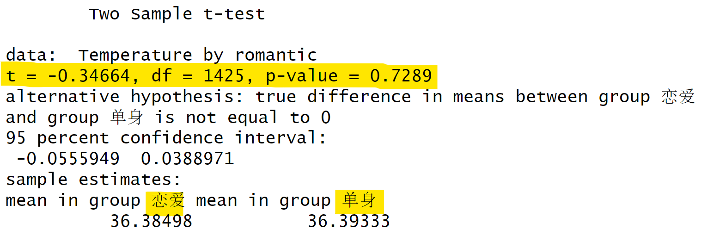
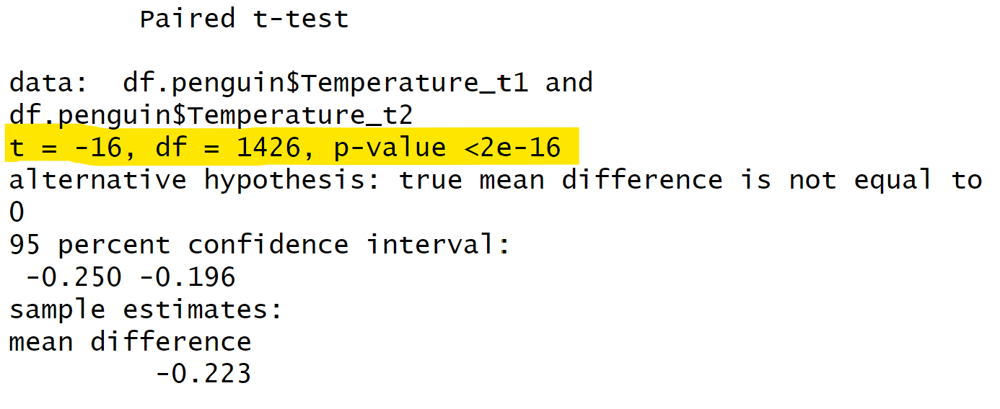
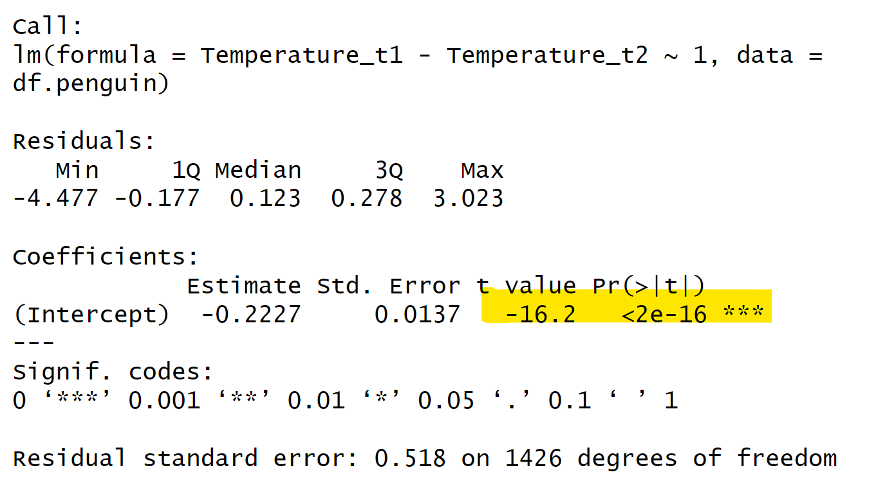
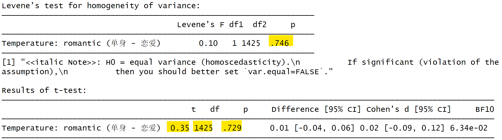
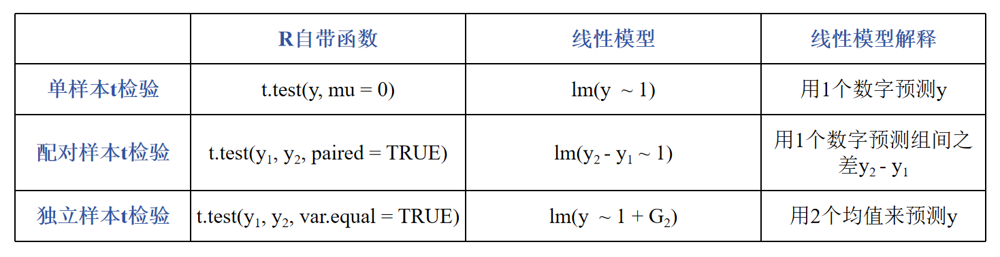
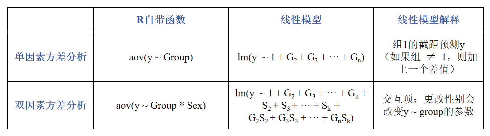
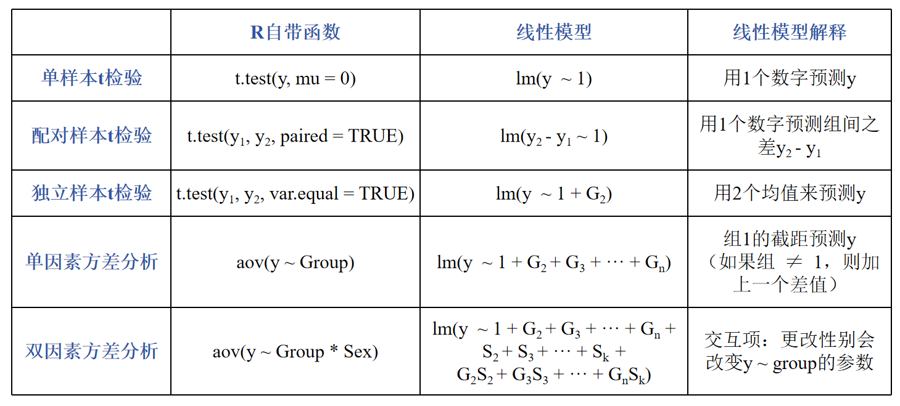

class: center, middle
<span style="font-size: 50px;">**第八章**</span> <br>
<span style="font-size: 50px;">回归模型(一)</span> <br>
<span style="font-size: 30px;">胡传鹏</span> <br>
<span style="font-size: 20px;"> </span> <br>
<span style="font-size: 30px;">`r Sys.Date()`</span> <br>
<span style="font-size: 20px;"> Made with Rmarkdown</span> <br>

```{r setup, include=FALSE}
knitr::opts_chunk$set(
  message = FALSE,
  warning = F
)
```

```{css extra.css, echo=FALSE}
/* ---- extra.css ---- */
.bigfont {
  font-size: 30px;
}
.size5{
font-size: 20px;
}
.tit_font{
font-size: 60px;
}

```

```{r xaringan-panelset, echo=FALSE}
xaringanExtra::use_panelset()
```

```{r, echo=FALSE}
# Packages
if (!requireNamespace('pacman', quietly = TRUE)) {
    install.packages('pacman')
}


pacman::p_load(
  # 本节课需要用到的 packages
  here, tidyverse, bruceR, DT, car,
  # 生成课件
  xaringan, xaringanthemer, xaringanExtra)
```

```{r, echo=FALSE}
# 改变R在显示大数字和小数字时是选择常规格式还是科学计数法的倾向
options(scipen=999)

# 还原设置 options(scipen = 0)
```


---
class: center, middle
```{r, echo = FALSE, fig.width = 4.5, fig.height = 3}
knitr::include_graphics('pic_new/chp8/group.png')
```


---
<h1 lang="zh-CN" style="font-size: 60px;">课堂目标</h1>
<br>
<br>
## 纯粹的代码学习 → 统计知识和代码的结合 <br>
<br>
## R：更灵活的统计分析方法，与统计知识结合更加紧密<br>
<br>
## 回归模型在数据分析中的重要占比<br>


---
<h1 lang="zh-CN" style="font-size: 60px;">研究问题</h1>
<<<<<<< HEAD

.panelset[
.panel[.panel-name[具体问题]

<br>
* 在penguin数据中，恋爱状态(romantic)对被试核心体温(Temperature)的影响
* 在penguin数据中，距赤道距离(DEQ)和恋爱状态(romantic)对于被试核心体温(Temperature)的影响
<br>
<br>

.panel[.panel-name[清理数据]
=======


<br>
## 在penguin数据中，恋爱状态(romantic)对被试核心体温(Temperature)的影响
<br>
<br>
## 在penguin数据中，距赤道距离(DEQ)和恋爱状态(romantic)对于被试核心体温(Temperature)的影响
<br>
<br>


---
<h1 lang="en" style="font-size: 60px;">Contents</h1>
<br>
<span style="font-size: 45px;">8.1 *t*-test & linear regression</span></center> <br>
<span style="font-size: 30px;">&emsp;8.1.1 独立样本*t*检验</span></center> <br>
<span style="font-size: 30px;">&emsp;8.1.2 线性回归</span></center> <br>
<span style="font-size: 30px;">&emsp;8.1.3 单样本*t*检验</span></center> <br>
<span style="font-size: 30px;">&emsp;8.1.4 配对样本*t*检验</span></center> <br>
<span style="font-size: 30px;">&emsp;8.1.5 bruceR::TTEST</span></center> <br>
<br>
<span style="font-size: 45px;">8.2 ANOVA & linear regression</span></center> <br>
<span style="font-size: 30px;">&emsp;8.2.1 研究问题</span></center> <br>
<span style="font-size: 30px;">&emsp;8.2.2 代码实操</span></center> <br>
<span style="font-size: 30px;">&emsp;8.2.3 线性回归</span></center> <br>
<span style="font-size: 30px;">&emsp;8.2.4 知识延申</span></center> <br>


---
class: center, middle
<span style="font-size: 60px;">8.1 *t*-test & linear regression</span> <br>

---
class: center, middle
<span style="font-size: 60px;">8.1  研究问题</span> <br>
<br>
<span style="font-size: 45px;">在penguin数据中，恋爱状态(romantic)对被试核心体温(Temperature)的影响</span> <br>
<br>
<span style="font-size: 45px;">独立样本*t*检验</span> <br>

---
# 8.1 *t*-test & linear regression
## 8.1.1 独立样本*t*检验(independent *t*-test)

.panelset[
.panel[.panel-name[基础知识]

<br>
**比较两个独立样本群体的均值是否有显著差异。**
<br>
**前提条件**
* 正态性：两个样本数据都应该来自正态分布的总体。样本量足够大时，即使不严格服从正态分布，结果也是稳健的。
* 同方差性：两个样本的方差应该是相等的。
* 独立性：两个样本应该是独立的，即一个样本的观测值不应影响另一个样本的观测值。<br>
<br>

**假设**
* $H_0$: 两个独立样本群体的均值没有显著差异，即 $μ_1$ = $μ_2$
* $H_1$: 两个独立样本群体的均值有显著差异，即 $μ_1$ ≠ $μ_2$
<br>
$$t = \frac{\bar{X}_1 - \bar{X}_2}{\sqrt{\frac{s_1^2}{n_1} + \frac{s_2^2}{n_2}}}$$

.panel[.panel-name[数据清理]

>>>>>>> 7fcb3dffd5de9f45539881aa4e97270889d2016b

```{r prepare}
df.penguin <- bruceR::import(here::here('data', 'penguin', 'penguin_rawdata.csv')) %>%
  dplyr::select(Temperature_t1, Temperature_t2, socialdiversity, Site, DEQ, romantic, ALEX1:ALEX16) %>% #选择变量
  dplyr::filter(!is.na(Temperature_t1) & !is.na(Temperature_t2) & !is.na(DEQ)) %>% #处理缺失值
  dplyr::mutate(romantic = factor(romantic, levels = c(1,2), labels = c("恋爱", "单身")),#转化为因子
                Temperature = rowMeans(select(., starts_with("Temperature"))),#计算两次核心温度的均值
                ALEX4 = case_when(TRUE ~ 6 - ALEX4),
                ALEX12 = case_when(TRUE ~ 6 - ALEX12),
                ALEX14 = case_when(TRUE ~ 6 - ALEX14),
                ALEX16 = case_when(TRUE ~ 6 - ALEX16),
                ALEX = rowSums(select(., starts_with("ALEX"))))#反向计分后计算总分
```
```{r, echo=FALSE}
DT::datatable(head(df.penguin),
              fillContainer = TRUE, options = list(pageLength = 4))
```


<<<<<<< HEAD
]]]


---
<h1 lang="en" style="font-size: 60px;">Contents</h1>
<br>
<span style="font-size: 45px;">8.1 *t*-test & linear regression</span></center> <br>
<span style="font-size: 30px;">&emsp;8.1.1 独立样本*t*检验</span></center> <br>
<span style="font-size: 30px;">&emsp;8.1.2 线性回归</span></center> <br>
<span style="font-size: 30px;">&emsp;8.1.3 单样本*t*检验</span></center> <br>
<span style="font-size: 30px;">&emsp;8.1.4 配对样本*t*检验</span></center> <br>
<span style="font-size: 30px;">&emsp;8.1.5 bruceR::TTEST</span></center> <br>
<br>
<span style="font-size: 45px;">8.2 ANOVA</span></center> <br>
<span style="font-size: 30px;">&emsp;8.2.1 研究问题</span></center> <br>
<span style="font-size: 30px;">&emsp;8.2.2 代码实操</span></center> <br>
<span style="font-size: 30px;">&emsp;8.2.3 线性回归</span></center> <br>
<span style="font-size: 30px;">&emsp;8.2.4 知识延申</span></center> <br>


---
class: center, middle
<span style="font-size: 60px;">8.1 *t*-test & linear regression</span> <br>


---
# 8.1 *t*-test & linear regression
## 8.1.1 独立样本*t*检验(independent *t*-test)

.panelset[
.panel[.panel-name[基础知识]

<br>
**比较两个独立样本群体的均值是否有显著差异。**
<br>
**前提条件**
* 正态性：两个样本数据都应该来自正态分布的总体。样本量足够大时，即使不严格服从正态分布，结果也是稳健的。
* 同方差性：两个样本的方差应该是相等的。
* 独立性：两个样本应该是独立的，即一个样本的观测值不应影响另一个样本的观测值。<br>
<br>

**假设**
* $H_0$: 两个独立样本群体的均值没有显著差异，即 $μ_1$ = $μ_2$
* $H_1$: 两个独立样本群体的均值有显著差异，即 $μ_1$ ≠ $μ_2$
<br>
$$t = \frac{\bar{X}_1 - \bar{X}_2}{\sqrt{\frac{s_1^2}{n_1} + \frac{s_2^2}{n_2}}}$$

.panel[.panel-name[代码实操]

```{r}
stats::t.test(data = df.penguin, #数据框
              Temperature ~ romantic,#因变量~自变量
              var.equal = TRUE) %>%
  capture.output() #capture.output仅为输出整齐
```


]]]
=======
.panel[.panel-name[代码实操]

```{r}
stats::t.test(data = df.penguin, #数据框
              Temperature ~ romantic,#因变量~自变量
              var.equal = TRUE) %>%
  capture.output() #capture.output仅为输出整齐
```


]]]]

---
# 8.1 *t*-test & linear regression
## 8.1.2 线性回归(linear regression)
<br>
**回归分析**
* 回归分析用于研究一个或多个自变量（预测变量）与一个因变量（响应变量）之间的关系。<br>
* 其目的是找到最佳拟合线的方程，这条线尽可能地接近所有的数据点。<br>
<br>
<br>
--
<br>
**线性回归**
* 线性回归的基本思想是通过数据拟合一条直线，使得这条直线尽可能地接近所有的数据点，从而实现对新数据点的预测。<br>
* 线性回归模型可以表示为：
$$y = \beta_0 + \beta_1 x_1 + \beta_2 x_2 + ... + \beta_p x_p + \epsilon$$
* 其中，y是因变量，x是自变量， $β_i$  是模型参数，表示截距和斜率，ε是误差项，表示模型未能解释的随机误差。
>>>>>>> 7fcb3dffd5de9f45539881aa4e97270889d2016b

---
# 8.1 *t*-test & linear regression
## 8.1.2 线性回归(linear regression)
<br>
<<<<<<< HEAD
**回归分析**
* 回归分析用于研究一个或多个自变量（预测变量）与一个因变量（响应变量）之间的关系。<br>
* 其目的是找到最佳拟合线的方程，这条线尽可能地接近所有的数据点。<br>
<br>
<br>
--
<br>
**线性回归**
* 线性回归的基本思想是通过数据拟合一条直线，使得这条直线尽可能地接近所有的数据点，从而实现对新数据点的预测。<br>
* 线性回归模型可以表示为：
$$y = \beta_0 + \beta_1 x_1 + \beta_2 x_2 + ... + \beta_p x_p + \epsilon$$
* 其中，y是因变量，x是自变量， $β_i$  是模型参数，表示截距和斜率，ε是误差项，表示模型未能解释的随机误差。

---
# 8.1 *t*-test & linear regression
## 8.1.2 线性回归(linear regression)
<br>
=======
>>>>>>> 7fcb3dffd5de9f45539881aa4e97270889d2016b
* 独立样本t检验是线性模型的特殊形式(自变量为二分变量）
--
<p align="center">
  
</p>


---
# 8.1 *t*-test & linear regression
## 8.1.2 线性回归(linear regression)
.pull-left[
```{r,results='hide'}
#t检验
stats::t.test(data = df.penguin, #数据框
              Temperature ~ romantic,#因变量~自变量
              var.equal = TRUE) %>%
  capture.output() #capture.output仅为输出整齐
```

<p align="center">
  
</p>
]

.pull-right[
```{r,results='hide'}
#线性回归
model.inde <- stats::lm(data = df.penguin,#数据框
                   formula = Temperature ~ romantic #因变量~自变量
                   
)
<<<<<<< HEAD

=======
summary(model.inde)
>>>>>>> 7fcb3dffd5de9f45539881aa4e97270889d2016b
```

<p align="center">
  
</p>

]


---
# 8.1 *t*-test & linear regression
## 8.1.3 单样本*t*检验(one sample *t*-test)
* 在penguin数据中，全体被试的核心体温(Temperature)是否等于36.6？<br>
<br>
--
<br>
**比较单个样本的平均值(m)与已知的总体平均值(μ)之间是否存在显著差异**<br>
<br>

**前提条件**
* 正态性：样本数据应来自正态分布的总体。样本量足够大时，即使不严格服从正态分布，结果也是稳健的。
* 独立性：样本中的观测值必须是独立的，即一个观测值不应影响另一个观测值。<br>
<br>

**假设**
* $H_0$: 样本的均值(m)与给定的总体均值或假设的总体均值(μ)之间没有显著差异。
* $H_1$: 样本的均值(m)与给定的总体均值或假设的总体均值(μ)之间有显著差异。
<br>

$$t = \frac{\bar{X} - \mu}{s / \sqrt{n}}$$

---
# 8.1 *t*-test & linear regression
## 8.1.3 单样本*t*检验(one sample *t*-test)
.pull-left[
<br>
<br>

$$y = \beta_0 + \beta_1 x_1 + \beta_2 x_2 + ... + \beta_p x_p + \epsilon$$

单样本t检验中，仅截距不为0。此时公式为：<br>
--
$$y = \beta_0$$
$$H_0: \beta_0 = 0$$
]
.pull-right[
<p align="center">
  
</p>
]
---
# 8.1 *t*-test & linear regression
## 8.1.3 单样本*t*检验(one sample *t*-test)

.pull-left[
```{r,results='hide'}
stats::t.test(x = df.penguin$Temperature, #核心体温均值
              mu = 36.6) 
  
```

<br>
<br>
<p align="center">
  
</p>

]
.pull-right[
```{r,results='hide'}
model.single <- lm(data = df.penguin, #数据
                   formula = Temperature-36.6 ~ 1) #公式：只有截距，没有自变量
summary(model.single) 
```

<br>
<br>
<p align="center">
  
</p>

]

---
# 8.1 *t*-test & linear regression
## 8.1.4 配对样本*t*检验(paired *t*-test)
* 在penguin数据中，被试报告的两次核心温度(Temperature_t1,Temperature_t2)是否有显著差异？<br>
<br>
--
**比较两个相关的样本组（例如，同一组受试者在不同条件下的测量）的平均值是否存在显著差异。**<br>
<br>
**前提条件**
* 正态性：样本数据应来自正态分布的总体。样本量足够大时，即使不严格服从正态分布，结果也是稳健的。
* 独立性：配对样本中的观测值必须是独立的，即每一对观测值不应影响其他对的观测值。
* 配对设计：数据必须是以配对形式收集的。<br>
<br>
**假设**
* $H_0$: 配对样本的总体平均差与零没有显著差异（两个配对样本的均值没有显著差异）。
* $H_1$: 配对样本的总体平均差与零有显著差异（两个配对样本的均值存在显著差异）。
<br>

$$t = \frac{\bar{X} - \mu}{s / \sqrt{n}}$$
---
# 8.1 *t*-test & linear regression
## 8.1.4 配对样本*t*检验(paired *t*-test)

$$y_1 - y_2 = \beta_0 $$
$$H_0: \beta_0 = 0 $$
--
可以将配对样本*t*检验理解为对差值进行的单样本*t*检验，即单独用一个数字来预测对应的差值（见图的右半部分）。<br>
也可以认为这些组间之差是斜率（见图的左半部分）。<br>

<p align="center">
  
</p>

---
# 8.1 *t*-test & linear regression
## 8.1.4 配对样本*t*检验(paired *t*-test)
.pull-left[
```{r,results='hide'}
stats::t.test(x = df.penguin$Temperature_t1, #第1次核心体温
              y = df.penguin$Temperature_t2, #第2次核心体温
              paired = TRUE)
```

<br>
<br>
<p align="center">
  
</p>

]
.pull-right[
```{r,results='hide'}
model.paired <- lm(data = df.penguin,
                   formula = Temperature_t1 - Temperature_t2 ~ 1)
summary(model.paired)
```

<br>
<br>
<p align="center">
<<<<<<< HEAD
  
=======
  
>>>>>>> 7fcb3dffd5de9f45539881aa4e97270889d2016b
</p>

]

---
# 8.1 *t*-test & linear regression
## 8.1.5 bruceR::TTEST
* 如果偏好使用t检验，推荐bruceR::TTEST函数

<p align="center">
  
</p>

中文帮助文档：https://zhuanlan.zhihu.com/p/281150493
---
# 8.1 *t*-test & linear regression
## 8.1.5 bruceR::TTEST
.panelset[
.panel[.panel-name[独立样本t检验]
.pull-left[
```{r,results='hide'}
stats::t.test(data = df.penguin, #数据框
              Temperature ~ romantic,#因变量~自变量
<<<<<<< HEAD
              var.equal = TRUE) %>%
  capture.output() #capture.output仅为输出整齐 
=======
              var.equal = TRUE) 
>>>>>>> 7fcb3dffd5de9f45539881aa4e97270889d2016b
```


<br>
<p align="center">
  
</p>
]
.pull-right[
```{r,results='hide'}
bruceR::TTEST(data = df.penguin, #数据
                y = "Temperature", #因变量：核心体温均值
                x = "romantic" #自变量：是否在恋爱关系中
) 
```

<br>
<p align="center">
  
</p>

<<<<<<< HEAD
<p align="center">
  
</p>
=======

>>>>>>> 7fcb3dffd5de9f45539881aa4e97270889d2016b
]
.panel[.panel-name[单样本t检验]
.pull-left[
```{r, results='hide'}
stats::t.test(x = df.penguin$Temperature, #核心体温均值
              mu = 36.6)

```


<br>
<p align="center">
  
</p>
]
.pull-right[
```{r,results='hide'}
bruceR::TTEST(data = df.penguin, #数据
                y = "Temperature", #确定变量
                test.value = 36.6, #固定值
                test.sided = "=")  #根据研究目的，可更改为“<”或“>”

```

<br>
<p align="center">
  
</p>

]
.panel[.panel-name[配对样本t检验]

.pull-left[
```{r,results='hide'}
stats::t.test(x = df.penguin$Temperature_t1, #第1次核心体温
              y = df.penguin$Temperature_t2, #第2次核心体温
              paired = TRUE) 
  
```


<br>
<p align="center">
  
</p>
]
.pull-right[
```{r, results='hide'}
bruceR::TTEST(data = df.penguin, #数据
                 y = c("Temperature_t1",              
                       "Temperature_t2"), #变量为两次核心体温
                 paired = T)  #是否为配对样本*t*检验？默认是FALSE
```

<br>
<p align="center">
  
</p>
]
]]]]

---
# 8.1 *t*-test & linear regression
<br>
<br>



---
class: center, middle
<<<<<<< HEAD
<span style="font-size: 60px;">8.2  ANOVA</span> <br>
=======
<span style="font-size: 60px;">8.2  ANOVA & linear regression</span> <br>
>>>>>>> 7fcb3dffd5de9f45539881aa4e97270889d2016b


---
class: center, middle
<span style="font-size: 60px;">8.2.1  研究问题</span> <br>
<br>
<span style="font-size: 45px;">在penguin数据中，距赤道距离(DEQ)和恋爱状态(romantic)对于被试体温的影响</span> <br>
<br>
<span style="font-size: 45px;">双因素被试间方差分析</span> <br>


---
<<<<<<< HEAD
# 8.2  ANOVA
=======
# 8.2  ANOVA & linear regression
>>>>>>> 7fcb3dffd5de9f45539881aa4e97270889d2016b
## 8.2.2 代码实操|知识回顾
.pull-left[
<br>
**方法简介：**

当研究者想要比较两个或多个组之间的均值差异时，可使用方差分析(Analysis of Variance，简称ANOVA)。<br>
<br>
它由英国统计学家R.A.Fisher提出，基本思想是将测量数据的总变异（即总方差）按照变异来源分为处理（组间）效应和误差（组内）效应，并作出其数量估计，从而确定实验处理对研究结果影响力的大小。

**假设：**
* $H_0$: 各因素的各个水平下，因变量的均值无显著差异
* $H_1$: 各因素的各个水平下，因变量的均值不完全相同
]

.pull-right[
<br>
<br>
<br>
<br>
**前提条件：**

* 可加性：各效应可加，即观测值是由各主效应，交互作用以及误差通过相加得到的<br>
* 随机性：各样本（观测值）是随机样本<br>
* 正态性：各样本来自于正态分布的总体<br>
* 独立性：各样本观测值互相独立<br>
* 方差齐性：各样本来自的总体方差相同<br>
* 因变量应为连续变量<br>

]

---
<<<<<<< HEAD
# 8.2  ANOVA
=======
# 8.2  ANOVA & linear regression
>>>>>>> 7fcb3dffd5de9f45539881aa4e97270889d2016b
## 8.2.2 代码实操|数据预处理
.panelset[
.panel[.panel-name[vars]
```{r}
summary(df.penguin$DEQ)
```

```{r}
# 设定分割点
# [0-23.5 热带， 23.5-35 亚热带]， [35-40 暖温带， 40-50 中温带]， [50-66.5 寒温带]
breaks <- c(0, 35, 50, 66.5)

# 设定相应的标签
labels <- c('热带', '温带', '寒温带')

# 创建新的变量
df.penguin$climate <- cut(df.penguin$DEQ, breaks = breaks, labels = labels)
summary(df.penguin$climate)
```

.panel[.panel-name[tidy data]
```{r}
df <- df.penguin %>% 
<<<<<<< HEAD
  select(climate, romantic, Temperature)  %>%
  mutate(romantic = factor(romantic, levels = c(1,2), labels = c("恋爱", "单身")))
=======
  select(climate, romantic, Temperature) 
  
>>>>>>> 7fcb3dffd5de9f45539881aa4e97270889d2016b
```
```{r example of df, echo=FALSE}
DT::datatable(head(df), fillContainer = TRUE)
```

]]]


---
<<<<<<< HEAD
# 8.2  ANOVA
=======
# 8.2  ANOVA & linear regression
>>>>>>> 7fcb3dffd5de9f45539881aa4e97270889d2016b
## 8.2.2 代码实操|正态性检验
.panelset[
.panel[.panel-name[KS检验]
```{r}
# 正态性检验-Kolmogorov-Smirnov检验
# 若p >.05，不能拒绝数据符合正态分布的零假设
ks.test(df$Temperature, 'pnorm')
```

```{r}
# 进行数据转换，转换后仍非正态分布
df$Temperature_log <- log(df$Temperature)
ks.test(df$Temperature_log, 'pnorm')
```

.panel[.panel-name[qq图]
```{r, fig.width=7, fig.height=5}
# 正态性检验-qq图
qqnorm(df$Temperature)
qqline(df$Temperature, col = "red") # 添加理论正态分布线
```

.panel[.panel-name[直方图]
```{r, fig.width=7, fig.height=5}
ggplot(df, aes(Temperature)) +
    geom_histogram(aes(y =..density..), color='black', fill='white', bins=30) +
    geom_density(alpha=.5, fill='red')
```

]]]]


---
<<<<<<< HEAD
# 8.2  ANOVA
=======
# 8.2  ANOVA & linear regression
>>>>>>> 7fcb3dffd5de9f45539881aa4e97270889d2016b
## 8.2.2 代码实操|双因素被试间方差分析
.panelset[
.panel[.panel-name[stats::aov()]
```{r}
aov1 <- stats::aov(Temperature ~ climate * romantic, data = df)
aov1
```

.panel[.panel-name[SPSS]
```{r, echo = FALSE, fig.width = 4.5, fig.height = 3}
knitr::include_graphics('pic_new/chp8/SPSS.png')
```

]]]


---
class: center, middle
<span style="font-size: 60px;">结果为什么不相同？</span> <br>


---
<<<<<<< HEAD
# 8.2  ANOVA
=======
# 8.2  ANOVA & linear regression
>>>>>>> 7fcb3dffd5de9f45539881aa4e97270889d2016b
## 8.2.2 代码实操|平方和(SS)的计算
<br>
在平衡设计中，三种类型的平方和的结果会很清晰，并且方差分析的结果独立于平方和的类型；<br>
而在非平衡设计中，尤其是当各组样本量差距较大时，三种类型的平方和计算结果可能会不同，此时需要根据具体研究设计和问题来选择使用哪一种类型的平方和。<br>
<br>
对于 Y ~ A + B + A * B<br>
<br>
.panelset[
.panel[.panel-name[Type I SS]
<br>
解释变量的顺序会影响到类型I平方和的计算结果，通常用于顺序重要的模型。<br>
效应根据表达式中先出现的效应做调整。A不做调整，B根据A调整，A:B交互项根据A和B调整。<br>
<br>
**stats::aov()函数默认采用的就是Type I SS，它逐步将每一个因子引入模型进行计算。**<br>

.panel[.panel-name[Type II SS]
<br>
忽略了因子之间可能存在的交互作用，适用于所有主效应不涉及交互效应的情况。<br>
假定所有的因子都是同时进入模型的，并且它们都是等价的。<br>
效应根据同水平或低水平的效应做调整。A根据B调整，B依据A调整，A:B交互项同时根据A和B调整。<br>
<br>
**car::Anova()函数默认计算Type II SS，可以通过type = 3调整为Type III SS。**<br>

.panel[.panel-name[Type III SS]
<br>
更全面，假定所有因子（以及它们的交互项）都是重要的，并考虑所有因素。<br>
每个效应根据模型其他各效应做相应调整。A根据B和A:B做调整，A:B交互项根据A和B调整。<br>
<br>
**SPSS默认采用Type III SS。**<br>
**bruceR::MANOVA*()函数也默认采用Type III SS，可以通过ss.type = 2调整为Type II SS。**<br>

]]]]


---
<<<<<<< HEAD
# 8.2  ANOVA
=======
# 8.2  ANOVA & linear regression
>>>>>>> 7fcb3dffd5de9f45539881aa4e97270889d2016b
## 8.2.2 代码实操|双因素被试间方差分析
.panelset[
.panel[.panel-name[car::Anova()]
```{r}
# 结果不一致
aov1 <- car::Anova(aov(Temperature ~ climate * romantic, data = df), type = 3)
aov1
```

.panel[.panel-name[debug]
```{r}
df$ID <- seq_len(nrow(df))

# bruceR::MANOVA基于aov_ez，能够得到同样的结果，但它其实也是基于car::Anova的
afex::aov_ez(id = "ID", dv = "Temperature", data = df, between = c("climate", "romantic"), type = 3)
```

```{r,results='hide'}
# afex中的其他函数可以得到同样的结果
afex::aov_car(Temperature ~ climate * romantic + Error(ID), data = df, type = 3)
afex::aov_4(Temperature ~ climate * romantic + (1|ID), data = df)
```


]]]

---
<<<<<<< HEAD
# 8.2  ANOVA
=======
# 8.2  ANOVA & linear regression
>>>>>>> 7fcb3dffd5de9f45539881aa4e97270889d2016b
## 8.2.3 线性回归

.pull-left[

<br>
<br>
<br>
线性回归采用最小二乘法使得残差平方和最小。<br>
方差分析中的组内平方和是一个类似的概念——也即是尽量让各组内的数据点尽可能接近各自组的均值。<br>
<br>
实际上，线性回归模型中如果使用分类变量（dummy coding）作为预测变量，得到的结果和ANOVA是一样的。组间效应（组间平方和）就被视为线性模型中的斜率效应。<br>
<br>
**双因素方差分析可以看作是一种特殊的线性回归模型，自变量为两个分类变量。**<br>

]

.pull-right[
<br>
<br>
```{r, echo = FALSE, fig.width = 3.5, fig.height = 2}
knitr::include_graphics('pic_new/chp8/aovLM.png')
```
]

<<<<<<< HEAD
]


---
# 8.2  ANOVA
## 8.2.3 线性回归
.pull-left[

```{r}
aov1 <- car::Anova(aov(Temperature ~ climate * romantic, data = df), type = 3)
aov1
```

]

.pull-right[

```{r}
lm1 <- car::Anova(lm(Temperature ~ climate * romantic, data = df), type = 3)
lm1
```

]


---
# 8.2  ANOVA
## 8.2.2 代码实操|bruceR
* 使用bruceR可以更简单地实现上述操作，但要注意数据格式
<p align="center">
  
</p>


---
# 8.2  ANOVA
## 8.2.2 代码实操|bruceR::MANOVA
<p align="center">
  
</p>


---
# 8.2  ANOVA
## 8.2.2 代码实操|bruceR::MANOVA
```{r,results='hide'}
res1 <- bruceR::MANOVA(data = df, 
                       dv = "Temperature", 
                       between = c("climate", "romantic"))
```
=======
---
# 8.2  ANOVA & linear regression
## 8.2.3 线性回归
.pull-left[

```{r,results='hide'}
aov1 <- car::Anova(aov(Temperature ~ climate * romantic, data = df), type = 3)
aov1
```
<br>

]


.pull-right[

```{r,results='hide'}
lm1 <- car::Anova(lm(Temperature ~ climate * romantic, data = df), type = 3)
lm1
```
<br>


]


---
# 8.2  ANOVA & linear regression
## 8.2.2 代码实操|bruceR
* 使用bruceR可以更简单地实现上述操作，但要注意数据格式
<p align="center">
  
</p>


---
# 8.2  ANOVA & linear regression
## 8.2.2 代码实操|bruceR::MANOVA
<p align="center">
  
</p>


---
# 8.2  ANOVA & linear regression
## 8.2.2 代码实操|bruceR::MANOVA
```{r,results='hide'}
res1 <- bruceR::MANOVA(data = df, 
                       dv = "Temperature", 
                       between = c("climate", "romantic"))
```
>>>>>>> 7fcb3dffd5de9f45539881aa4e97270889d2016b
```{r,echo=FALSE}
res1 %>%
  capture.output()
```


---
<<<<<<< HEAD
# 8.2  ANOVA
=======
# 8.2  ANOVA & linear regression
>>>>>>> 7fcb3dffd5de9f45539881aa4e97270889d2016b
## 8.2.2 代码实操|bruceR::EMMEANS
更进一步进行简单效应分析与多重比较
<p align="center">
  
</p>


---
<<<<<<< HEAD
# 8.2  ANOVA
=======
# 8.2  ANOVA & linear regression
>>>>>>> 7fcb3dffd5de9f45539881aa4e97270889d2016b
## 8.2.2 代码实操|bruceR::EMMEANS
```{r, results='asis'}
sim_eff <- res1 %>% 
  bruceR::EMMEANS("climate", by = "romantic") %>%
  bruceR::EMMEANS("romantic", by = "climate")
```

---
<<<<<<< HEAD
# 8.2  ANOVA
=======
# 8.2  ANOVA & linear regression
>>>>>>> 7fcb3dffd5de9f45539881aa4e97270889d2016b
## 8.2.4 知识延申|单因素方差分析示例
```{r}
# DEQ对Temperature的影响
res2 <- bruceR::MANOVA(data = df,
                       dv = "Temperature",   
                       between = "climate") 
```


---
<<<<<<< HEAD
# 8.2  ANOVA
=======
# 8.2  ANOVA & linear regression
>>>>>>> 7fcb3dffd5de9f45539881aa4e97270889d2016b
## 8.2.4 知识延申|总结
<br>
<br>



---
<h1 lang="zh-CN" style="font-size: 60px;">课堂总结</h1>


---
<h1 lang="zh-CN" style="font-size: 60px;">课堂总结</h1>



参考：https://lindeloev.github.io/tests-as-linear/#61_one-way_anova_and_kruskal-wallis


---
class: center, middle
<span style="font-size: 60px;">思考</span> <br>
<span style="font-size: 60px;">如何从回归模型的角度理解重复测量方差分析呢？</span> <br>


---
<h1 lang="zh-CN" style="font-size: 60px;">课堂练习</h1>
<br>
<br>
<br>
<h2 lang="zh-CN">1.在Penguin数据中，处在不同恋爱状态下(romantic)的被试在社交复杂度(socialdiversity)上是否有显著差异？</h2>
<br>
<br>
<h2 lang="zh-CN">2.在Penguin数据中，不同气候带(DEQ)与恋爱状态(romantic)对被试社交复杂度(socialdiversity)的影响.</h2>


