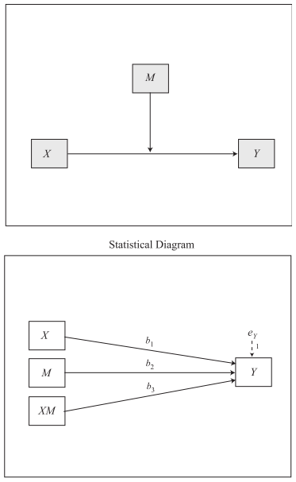
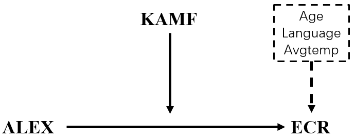
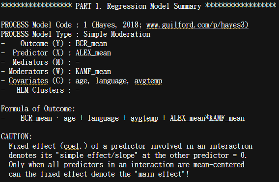
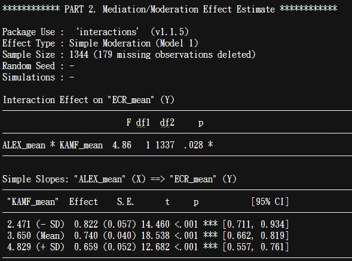

class: center, middle
<span style="font-size: 60px;">第九章</span> <br>
<span style="font-size: 50px;">如何进行基本的数据分析</span> <br>
<span style="font-size: 50px;">中介和调节分析</span> <br>
<span style="font-size: 30px;">PROCESS and lavaan(SEM)</span> <br>
<br>
<br>
<span style="font-size: 30px;">胡传鹏</span> <br>
<span style="font-size: 30px;">2023/04/17</span> <br>

---
class: center, middle
<span style="font-size: 60px;">9.1 事前准备</span> <br>
---
# <h1 lang="zh-CN">必须要知道的东西</h1>
<br>
<center>
<h2 lang="en">中介调节的鼻祖：Baron & Kenny (1986)</h2>
</center>
<br>

<div style="display:flex; align-items:center;">
  
  
</div>
<br>
_<h5 lang="en">- Baron, R. M., & Kenny, D. A. (1986). The moderator–mediator variable distinction in social psychological research: Conceptual, strategic, and statistical considerations. Journal of personality and social psychology, 51(6), 1173. </h5>_
---
# <h1 lang="zh-CN">必须要知道的东西</h1>
<br>
<center>
<h2 lang="en">PROCESS的作者：Andrew F. Hayes </h2>
</center>
<br>

<div style="display:flex; align-items:center; justify-content:center;">
  
  
</div>
<br>
_<h5 lang="en">- Hayes, A. F. (2017). Introduction to mediation, moderation, and conditional process analysis: A regression-based approach. Guilford publications. </h5>_

---
# <h1 lang="zh-CN">必须要知道的东西</h1>
<br>
<center>
<h2 lang="en">bruceR::PROCESS & lavaan </h2>
</center>
<br>

<div style="display:flex; align-items:center; justify-content:center;">
  
  
</div>
<br>
_<h5 lang="en">- Bao, H.-W.-S. (2022). bruceR: Broadly useful convenient and efficient R functions. R package version 0.8.x. https://CRAN.R-project.org/package=bruceR </h5>_
_<h5 lang="en">- Rosseel Y (2012). “lavaan: An R Package for Structural Equation Modeling.” Journal of Statistical Software, 48(2), 1–36. doi:10.18637/jss.v048.i02. </h5>_
---
# <h1 lang="zh-CN">载入包 - 设置工作路径 - 导入原始数据</h1>
```{r pacakge, message=FALSE}
library(here)
#library(bruceR)
library(dplyr)
library(tidyr)

# 载入bruceR有点慢，PPT中就不载入了
```

---
# <h1 lang="zh-CN">载入包 - 设置工作路径 - 导入原始数据</h1>
```{r WD & df.pg.raw}
WD <-  here::here()

df.pg.raw <-  read.csv('./data/penguin/penguin_rawdata.csv',
                       header = T, sep=",", stringsAsFactors = FALSE)
```
```{r df.pg.raw DT, echo=FALSE}
DT::datatable(head(df.pg.raw, 10),
              fillContainer = TRUE, options = list(pageLength = 5))
```

---
# <h1 lang="zh-CN">查找量表题目与维度的对应关系</h1>

ALEX：16题(TAS-20)<br>    DIF 1,3,5,6,7,10,11; DDF 2,4,8,9; EOT 12,13,14,15,16 <br>
_<h5 lang="en">- Taylor, G. J., Bagby, R. M., & Parker, J. D. (2003). The 20-Item Toronto Alexithymia Scale: IV. Reliability and factorial validity in different languages and cultures. Journal of psychosomatic research, 55(3), 277-283. </h5>_
<br>
ECR：36题   1-18为焦虑，19-36为回避 <br>
_<h5 lang="en">- Fraley, R. C., Waller, N. G., & Brennan, K. A. (2000). An item response theory analysis of self-report measures of adult attachment. Journal of personality and social psychology, 78(2), 350. </h5>_
<br>
HOME：9题 <br>
_<h5 lang="zh-CN">来源未知</h5>_
<br>
KAMF：7题 <br>
_<h5 lang="zh-CN">来源未知</h5>_
<br>
查找量表的维度与题目对应关系在PROCESS，或者说在"仅有结构模型的结构方程模型"中并不重要<br>
因为一个变量内的所有题目会被求平均分。（换句话说，量表的信度被视作1，没有测量模型，不考虑测量误差）
---
# <h1 lang="zh-CN">清洗数据</h1>
# <h2 lang="zh-CN">对模型涉及变量的题目求均值</h2>
```{r df.pg.mean, message = FALSE}
# 如果你需要探究某个维度对其他变量的影响，可以按照维度求和，做更复杂的模型
df.pg.mean <- df.pg.raw %>%
  dplyr::mutate(ALEX_mean = rowMeans(select(., starts_with("ALEX"))),
                ECR_mean = rowMeans(select(., starts_with("ECR"))),
                HOME_mean = rowMeans(select(., starts_with("HOME"))),
                KAMF_mean = rowMeans(select(., starts_with("KAMF")))
                ) %>%
  dplyr::select(age, language, avgtemp, 
                ALEX_mean, ECR_mean, HOME_mean, KAMF_mean)

```  
```{r df.pg.mean DT, echo=FALSE}
DT::datatable(head(df.pg.mean, 10),
              fillContainer = TRUE, options = list(pageLength = 5))
```

---
class: center, middle
<span style="font-size: 60px;">9.2 PROCESS in R</span> <br>
---
# <h1 lang="zh-CN">想~~编~~一个模型</h1>
<div style="display:flex; align-items:center;">
  
  <font size=20> Model 1 </font> 
</div>

---
# <h1 lang="zh-CN">想~~编~~一个模型</h1>
<br>
<div style="display:flex; align-items:center;">
   <br>
</div>

---
# <h1 lang="en">bruceR::PROCESS</h1>
## <h2 lang="en">CODE</h2>
```{r bruceR::PROCESS model 1, message=FALSE, eval=FALSE}
result.PROCESS <- capture.output({
# capture.output 可以将这段代码的结果存储进一个变量中
  bruceR::PROCESS(df.pg.mean,
                  x = "ALEX_mean", #自变量
                  y = "ECR_mean", # 因变量
                  #meds = c(), # 中介变量 
                  mods = c("KAMF_mean"), # 调节变量
                  covs = c("age", "language", "avgtemp"), # 控制变量（协变量）
                  #clusters = c(), #类似调节变量 分组变量
                  #hlm.re.m = "",hlm.re.y = "",hlm.type = c("1-1-1", "2-1-1", "2-2-1"),
                  #med.type = c("parallel", "serial"), # 中介变量之间是并列还是连续
                  #mod.type = c("2-way", "3-way"), # 两项交互还是三项交互
                  mod.path = c("x-y"), # 调节哪条路径
                  cov.path = c("y"), # 控制变量进入几个方程，both意味着中介和因变量都会考虑控制变量
                  #mod1.val = NULL,mod2.val = NULL, # 调节变量高低水平对应的值
                  ci = c("boot"), # 置信区间使用bootstrap 或其他抽样方法
                  nsim = 1000, # 抽样的次数
                  #seed = NULL, # 设置seed可以让每次的抽样结果都一样
                  center = FALSE, # 是否对自变量和调节变量中心化。非中心化在解释时更方便
                  std = FALSE, # 是否在计算钱对所有变量进行标准化
                  digits = 3, # 保留的小数位数
                  #nsmall = digits,file = NULL
                  ) 
})
writeLines(result.PROCESS, "./output/chp9/PROCESS_model_1.md") # .md最整齐
```

---
# <h1 lang="en">bruceR::PROCESS</h1>
## <h2 lang="en">OUTPUT</h2>


---
# <h1 lang="en">bruceR::PROCESS</h1>
## <h2 lang="en">OUTPUT</h2>


---
# <h1 lang="en">bruceR::PROCESS</h1>
## <h2 lang="en">OUTPUT</h2>

---
# <h1 lang="zh-CN">想~~编~~一个模型</h1>
<div style="display:flex; align-items:center;">
  
  <font size=20> Model 4 </font> 
</div>

---
# <h1 lang="zh-CN">想~~编~~一个模型</h1>
<br>
<div style="display:flex; align-items:center;">
   <br>
</div>

---
# <h1 lang="en">bruceR::PROCESS</h1>
## <h2 lang="en">CODE</h2>
```{r bruceR::PROCESS model 4, message=FALSE, eval=FALSE}
result.PROCESS <- capture.output({
# capture.output 可以将这段代码的结果存储进一个变量中
  bruceR::PROCESS(df.pg.mean,
                  x = "ALEX_mean", #自变量
                  y = "HOME_mean", # 因变量
                  meds = c("ECR_mean"), # 中介变量 
                  #mods = c(), # 调节变量
                  covs = c("age", "language", "avgtemp"), # 控制变量（协变量）
                  #clusters = c(), #类似调节变量 分组变量
                  #hlm.re.m = "",hlm.re.y = "",hlm.type = c("1-1-1", "2-1-1", "2-2-1"),
                  #med.type = c("parallel", "serial"), # 中介变量之间是并列还是连续
                  #mod.type = c("2-way", "3-way"), # 两项交互还是三项交互
                  #mod.path = c(), # 调节哪条路径
                  cov.path = c("both"), # 控制变量进入几个方程，both意味着中介和因变量都会考虑控制变量
                  #mod1.val = NULL,mod2.val = NULL, # 调节变量高低水平对应的值
                  ci = c("boot"), # 置信区间使用bootstrap 或其他抽样方法
                  nsim = 1000, # 抽样的次数
                  #seed = NULL, # 设置seed可以让每次的抽样结果都一样
                  center = FALSE, # 是否对自变量和调节变量中心化。非中心化在解释时更方便
                  std = FALSE, # 是否在计算钱对所有变量进行标准化
                  digits = 3, # 保留的小数位数
                  #nsmall = digits,file = NULL
                  ) 
})
writeLines(result.PROCESS, "./output/chp9/PROCESS_model_4.md") # .md最整齐
```

---
# <h1 lang="en">bruceR::PROCESS</h1>
## <h2 lang="en">OUTPUT</h2>


---
# <h1 lang="en">bruceR::PROCESS</h1>
## <h2 lang="en">OUTPUT</h2>


---
# <h1 lang="en">bruceR::PROCESS</h1>
## <h2 lang="en">OUTPUT</h2>

---
# <h1 lang="zh-CN">想~~编~~一个模型</h1>
<div style="display:flex; align-items:center;">
  
  <font size=20> Model 7 </font> 
</div>

---
# <h1 lang="zh-CN">想~~编~~一个模型</h1>
<div style="display:flex; align-items:center;">
   <br>
</div>

---
# <h1 lang="en">bruceR::PROCESS</h1>
## <h2 lang="en">CODE</h2>
```{r bruceR::PROCESS model 7, message=FALSE, eval=FALSE}
result.PROCESS <- capture.output({
# capture.output 可以将这段代码的结果存储进一个变量中
  bruceR::PROCESS(df.pg.mean,
                  x = "ALEX_mean", #自变量
                  y = "HOME_mean", # 因变量
                  meds = c("ECR_mean"), # 中介变量 
                  mods = c("KAMF_mean"), # 调节变量
                  covs = c("age", "language", "avgtemp"), # 控制变量（协变量）
                  #clusters = c(), #类似调节变量 分组变量
                  #hlm.re.m = "",hlm.re.y = "",hlm.type = c("1-1-1", "2-1-1", "2-2-1"),
                  #med.type = c("parallel", "serial"), # 中介变量之间是并列还是连续
                  #mod.type = c("2-way", "3-way"), # 两项交互还是三项交互
                  mod.path = c("x-m"), # 调节哪条路径
                  cov.path = c("both"), # 控制变量进入几个方程，both意味着中介和因变量都会考虑控制变量
                  #mod1.val = NULL,mod2.val = NULL, # 调节变量高低水平对应的值
                  ci = c("boot"), # 置信区间使用bootstrap 或其他抽样方法
                  nsim = 100, # 抽样的次数
                  #seed = NULL, # 设置seed可以让每次的抽样结果都一样
                  center = FALSE, # 是否对自变量和调节变量中心化。非中心化在解释时更方便
                  std = FALSE, # 是否在计算钱对所有变量进行标准化
                  digits = 3, # 保留的小数位数
                  #nsmall = digits,file = NULL
                  ) 
})
writeLines(result.PROCESS, "./output/chp9/PROCESS_model_7.md") # .md最整齐
```

---
# <h1 lang="en">bruceR::PROCESS</h1>
## <h2 lang="en">OUTPUT</h2>


---
# <h1 lang="en">bruceR::PROCESS</h1>
## <h2 lang="en">OUTPUT</h2>


---
# <h1 lang="en">bruceR::PROCESS</h1>
## <h2 lang="en">OUTPUT</h2>


---
# <h1 lang="en">bruceR::PROCESS</h1>
## <h2 lang="en">OUTPUT</h2>


---
class: center, middle
<span style="font-size: 60px;">9.3 SEM in R</span> <br>

---
# <h1 lang="en">SEM</h1>
<div style="display:flex; align-items:center;">
  
</div>

https://www.bilibili.com/video/BV1Bt4y127xq/?spm_id_from=333.999.0.0&vd_source=4b61fa5a135da9b04ce5af0535b1e28c 
<br>
有兴趣的同学可以去看这个视频学习怎么做SEM

---
# <h1 lang="en">SEM</h1>
<div style="display:flex; align-items:center;">
  
</div>

https://www.youtube.com/watch?v=fGdsiugwO0k&list=PLliBbGBc5nn3m8bXQ4CmOep3UmQ_5tVlC&index=1&ab_channel=SachaEpskamp
<br>
这是原地址
