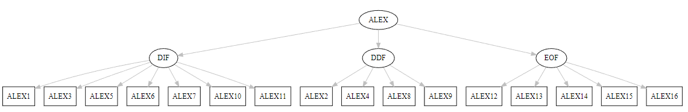
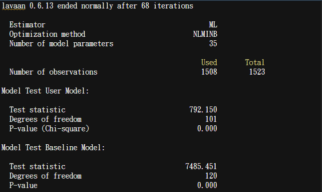
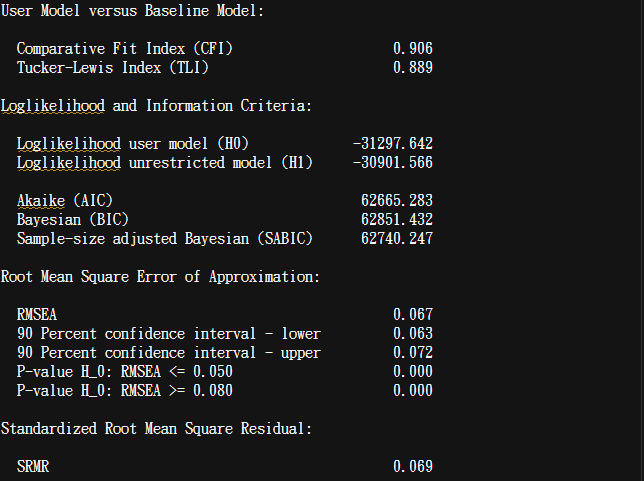
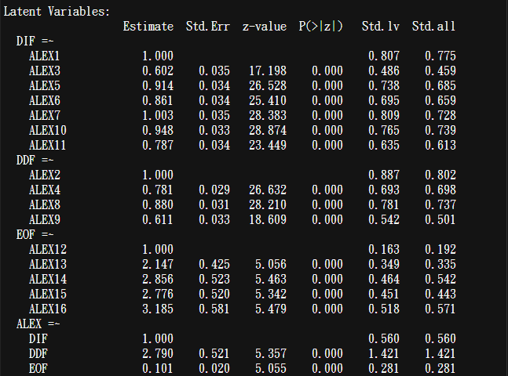
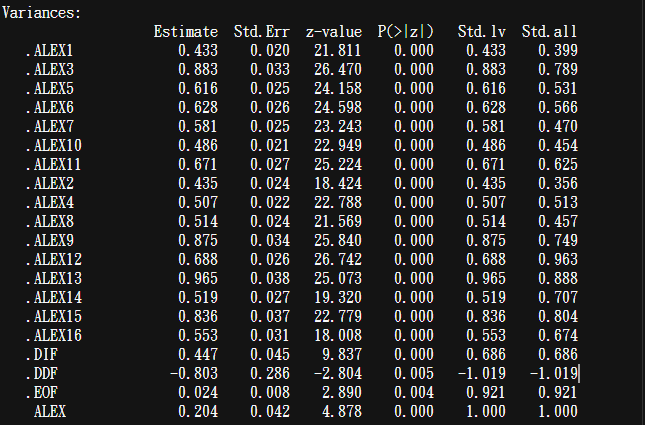
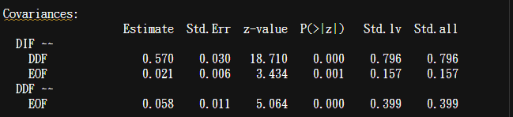
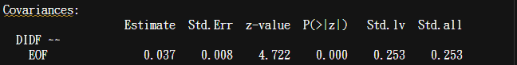
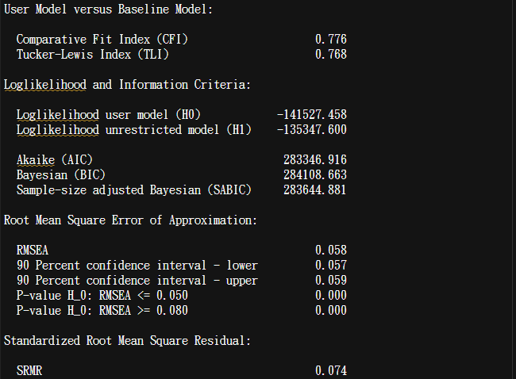

class: center, middle
<span style="font-size: 60px;">第九章</span> <br>
<span style="font-size: 50px;">如何进行基本的数据分析</span> <br>
<span style="font-size: 50px;">中介和调节分析</span> <br>
<span style="font-size: 30px;">PROCESS and lavaan(SEM)</span> <br>
<br>
<br>
<span style="font-size: 30px;">胡传鹏</span> <br>
<span style="font-size: 30px;">2023/04/17</span> <br>

---
class: center, middle
<span style="font-size: 60px;">9.1 事前准备</span> <br>
---
# <h1 lang="zh-CN">必须要知道的东西</h1>
<br>
<center>
<h2 lang="en">中介调节的鼻祖：Baron & Kenny (1986)</h2>
</center>
<br>

<div style="display:flex; align-items:center;">
  
  
</div>
<br>
_<h5 lang="en">- Baron, R. M., & Kenny, D. A. (1986). The moderator–mediator variable distinction in social psychological research: Conceptual, strategic, and statistical considerations. Journal of personality and social psychology, 51(6), 1173. </h5>_
---
# <h1 lang="zh-CN">必须要知道的东西</h1>
<br>
<center>
<h2 lang="en">PROCESS的作者：Andrew F. Hayes </h2>
</center>
<br>

<div style="display:flex; align-items:center; justify-content:center;">
  
  
</div>
<br>
_<h5 lang="en">- Hayes, A. F. (2017). Introduction to mediation, moderation, and conditional process analysis: A regression-based approach. Guilford publications. </h5>_
---
# <h1 lang="zh-CN">必须要知道的东西</h1>
<br>
<center>
<h2 lang="en">解释调节很重要的一本书：Aiken, West & Reno (1991) </h2>
</center>
<br>
<div style="display:flex; align-items:center;">
  

  - 因为对调节效应中对交乘项系数的解释，有很多误解。<br> 

  - 不论是Hayes 还是 Aiken & West 都在这方面有类似的解释 (Hayes, 2017, p. 282; Aiken & West, 1991, p. 36).
  <br>
  <br>
  _对调节效应的理解，也有助于日后学习HLM_
</div>
<br>
_<h5 lang="en">- Aiken, L. S., West, S. G., & Reno, R. R. (1991). Multiple regression: Testing and interpreting interactions. sage. </h5>_
---
# <h1 lang="zh-CN">必须要知道的东西</h1>
<br>
<center>
<h2 lang="en">bruceR::PROCESS & lavaan </h2>
</center>
<br>

<div style="display:flex; align-items:center; justify-content:center;">
  
  
</div>
<br>
_<h5 lang="en">- Bao, H.-W.-S. (2022). bruceR: Broadly useful convenient and efficient R functions. R package version 0.8.x. https://CRAN.R-project.org/package=bruceR </h5>_
_<h5 lang="en">- Rosseel Y (2012). “lavaan: An R Package for Structural Equation Modeling.” Journal of Statistical Software, 48(2), 1–36. doi:10.18637/jss.v048.i02. </h5>_
---
# <h1 lang="zh-CN">载入包 - 设置工作路径 - 导入原始数据</h1>
```{r pacakge, message=FALSE}
library(here)
library(lavaan)
library(lavaanPlot)
#library(bruceR)
library(dplyr)
library(tidyr)

# 载入bruceR有点慢，PPT中就不载入了
```

---
# <h1 lang="zh-CN">载入包 - 设置工作路径 - 导入原始数据</h1>
```{r WD & df.pg.raw}
WD <-  here::here()

df.pg.raw <-  read.csv('./data/penguin/penguin_rawdata.csv',
                       header = T, sep=",", stringsAsFactors = FALSE)
```
```{r df.pg.raw DT, echo=FALSE}
DT::datatable(head(df.pg.raw, 10),
              fillContainer = TRUE, options = list(pageLength = 5))
```

---
class: center, middle
<span style="font-size: 60px;">9.2 PROCESS in R</span> <br>
---
# <h1 lang="zh-CN">想~~编~~一个模型</h1>
<div style="display:flex; align-items:center;">
  
  <font size=20> Model 7 </font> 
</div>
---
# <h1 lang="zh-CN">想~~编~~一个模型</h1>
<div style="display:flex; align-items:center;">
   <br>
</div>
---
# <h1 lang="zh-CN">清洗数据</h1>
# <h2 lang="zh-CN">对模型涉及变量的题目求均值</h2>
```{r df.pg.mean, message = FALSE}
df.pg.mean <- df.pg.raw %>%
  dplyr::mutate(ALEX_mean = rowMeans(select(., starts_with("ALEX"))),
                ECR_mean = rowMeans(select(., starts_with("ECR"))),
                HOME_mean = rowMeans(select(., starts_with("HOME"))),
                KAMF_mean = rowMeans(select(., starts_with("KAMF")))
                ) %>%
  dplyr::select(age, language, avgtemp, 
                ALEX_mean, ECR_mean, HOME_mean, KAMF_mean)

```  
```{r df.pg.mean DT, echo=FALSE}
DT::datatable(head(df.pg.mean, 10),
              fillContainer = TRUE, options = list(pageLength = 5))
```

---
# <h1 lang="en">bruceR::PROCESS</h1>
## <h2 lang="en">CODE</h2>
```{r bruceR::PROCESS, message=FALSE, eval=FALSE}
result.PROCESS <- capture.output({
# capture.output 可以将这段代码的结果存储进一个变量中
  bruceR::PROCESS(df.pg.mean,
                  x = "ALEX_mean", #自变量
                  y = "HOME_mean", # 因变量
                  meds = c("ECR_mean"), # 中介变量 
                  mods = c("KAMF_mean"), # 调节变量
                  covs = c("age", "language", "avgtemp"), # 控制变量（协变量）
                  #clusters = c(), #类似调节变量 分组变量
                  #hlm.re.m = "",hlm.re.y = "",hlm.type = c("1-1-1", "2-1-1", "2-2-1"),
                  #med.type = c("parallel", "serial"), # 中介变量之间是并列还是连续
                  #mod.type = c("2-way", "3-way"), # 两项交互还是三项交互
                  mod.path = c("x-m"), # 调节哪条路径
                  cov.path = c("both"), # 控制变量进入几个方程，both意味着中介和因变量都会考虑控制变量
                  #mod1.val = NULL,mod2.val = NULL, # 调节变量高低水平对应的值
                  ci = c("boot"), # 置信区间使用bootstrap 或其他抽样方法
                  nsim = 100, # 抽样的次数
                  #seed = NULL, # 设置seed可以让每次的抽样结果都一样
                  center = FALSE, # 是否对自变量和调节变量中心化。非中心化在解释时更方便
                  std = FALSE, # 是否在计算钱对所有变量进行标准化
                  digits = 3, # 保留的小数位数
                  #nsmall = digits,file = NULL
                  ) 
})
writeLines(result.PROCESS, "./output/chp9/PROCESS.md") # .md最整齐
```

---
# <h1 lang="en">bruceR::PROCESS</h1>
## <h2 lang="en">OUTPUT</h2>


---
# <h1 lang="en">bruceR::PROCESS</h1>
## <h2 lang="en">OUTPUT</h2>


---
# <h1 lang="en">bruceR::PROCESS</h1>
## <h2 lang="en">OUTPUT</h2>


---
# <h1 lang="en">bruceR::PROCESS</h1>
## <h2 lang="en">OUTPUT</h2>


---
class: center, middle
<span style="font-size: 60px;">9.2 SEM in R</span> <br>
<span style="font-size: 40px;">using lavaan</span> <br>

---
# <h1 lang="zh-CN">结构方程模型的教科书</h1>
<br>
<center>
<h2 lang="en">引用量140k的经典：Hair (2009)</h2>
</center>
<br>

<div style="display:flex; justify-content:center; align-items:center;">
  
</div>
<br>
<center>
<h4 lang="zh-CN">之后的分析流程均参考自这本书</h4>
</center>
<br>
_<h5 lang="en">- Hair, J. F. (2009). Multivariate data analysis. </h5>_

---
# <h1 lang="zh-CN">清洗数据</h1>
# <h2 lang="zh-CN">选择模型内的变量</h2>
```{r df.pg.items, message = FALSE}
df.pg.items <- df.pg.raw %>%
  dplyr::select(., age, language, avgtemp, 
                starts_with("ALEX"),
                starts_with("ECR"),
                starts_with("HOME"),
                starts_with("KAMF")
                ) 
```  
```{r df.pg.items DT, echo=FALSE}
DT::datatable(head(df.pg.items, 10),
              fillContainer = TRUE, options = list(pageLength = 5))
```

---
# <h1 lang="zh-CN">查找量表题目与维度的对应关系</h1>

ALEX：16题(TAS-20)<br>    DIF 1,3,5,6,7,10,11; DDF 2,4,8,9; EOT 12,13,14,15,16 <br>
_<h5 lang="en">- Taylor, G. J., Bagby, R. M., & Parker, J. D. (2003). The 20-Item Toronto Alexithymia Scale: IV. Reliability and factorial validity in different languages and cultures. Journal of psychosomatic research, 55(3), 277-283. </h5>_

<br>

ECR：36题   1-18为焦虑，19-36为回避 <br>

_<h5 lang="en">- Fraley, R. C., Waller, N. G., & Brennan, K. A. (2000). An item response theory analysis of self-report measures of adult attachment. Journal of personality and social psychology, 78(2), 350. </h5>_

<br>

HOME：9题 <br>
_<h5 lang="zh-CN">来源未知</h5>_

<br>

KAMF：7题 <br>
_<h5 lang="zh-CN">来源未知</h5>_

---
# <h1 lang="zh-CN">验证性因素分析</h1>
## <h2 lang="en">CODE</h2>
```{r CFA_ALEX}
result.CFA_ALEX <- capture.output({
  CFA_ALEX<- 'DIF =~ ALEX1 + ALEX3 + ALEX5 + ALEX6 + ALEX7 + ALEX10 + ALEX11
              DDF =~ ALEX2 + ALEX4 + ALEX8 + ALEX9
              EOF =~ ALEX12 + ALEX13 + ALEX14 + ALEX15 + ALEX16
              ALEX =~ DIF + DDF + EOF' %>%
  lavaan::cfa(.,data=df.pg.items,estimator="ML") 
  lavaan::summary(CFA_ALEX,fit.measures=TRUE,standardized=TRUE)
})
writeLines(result.CFA_ALEX, "./output/chp9/CFA_ALEX.md")
```

_<h3 lang="en">- Heywood Case</h3>_

_<h4 lang="zh-CN">- 报错说有方差为负</h4>_
_<h4 lang="zh-CN">- 大概率是因为有两个维度（或题目）之间存在共线性</h4>_

_<h5 lang="en">- Van Driel, O. P. (1978). On various causes of improper solutions in maximum likelihood factor analysis. Psychometrika, 43, 225-243.</h5>_

---
# <h1 lang="zh-CN">验证性因素分析</h1>
## <h2 lang="en">PLOT</h2>
```{r CFA_ALEX PLOT, eval=FALSE}
lavaanPlot(model = CFA_ALEX, edge_options = list(color = "grey"))
```
<br>
<br>
<br>

<br>
<br>
_<h4 lang="zh-CN">- lavaan的画图并不是很好看，建议还是去AMOS里画图</h4>_

---
# <h1 lang="zh-CN">验证性因素分析</h1>
## <h2 lang="en">OUTPUT</h2>


---
# <h1 lang="zh-CN">验证性因素分析</h1>
## <h2 lang="en">OUTPUT</h2>

_<h4 lang="zh-CN">- 模型拟合度指标CFI, TLI, RMSEA, SRMR 问题都不大</h4>_

---
# <h1 lang="zh-CN">验证性因素分析</h1>
## <h2 lang="en">OUTPUT</h2>

_<h4 lang="zh-CN">- 问题出在'DDF <- ALEX '的载荷超过了1。说明DDF和某个维度之间存在共线性</h4>_

---
# <h1 lang="zh-CN">验证性因素分析</h1>
## <h2 lang="en">OUTPUT</h2>

_<h4 lang="zh-CN">- DDF和某个维度之间存在共线性，所以DDF的方差为负</h4>_

---
# <h1 lang="zh-CN">验证性因素分析</h1>
## <h2 lang="en">OUTPUT</h2>
```{r CFA_ALEX three dimension, eval=FALSE}
result.CFA_ALEX <- capture.output({
  CFA_ALEX<- 'DIF =~ ALEX1 + ALEX3 + ALEX5 + ALEX6 + ALEX7 + ALEX10 + ALEX11
              DDF =~ ALEX2 + ALEX4 + ALEX8 + ALEX9
              EOF =~ ALEX12 + ALEX13 + ALEX14 + ALEX15 + ALEX16' %>%
  lavaan::cfa(.,data=df.pg.items,estimator="ML") 
  lavaan::summary(CFA_ALEX,fit.measures=TRUE,standardized=TRUE)
})
writeLines(result.CFA_ALEX, "./output/chp9/CFA_ALEX.md")
```
_<h4 lang="zh-CN">- 想弄明白DDF和谁有共线性，我们可以先不做二阶模型，把ALEX的三个维度当作三个一阶变量看待。</h4>_
_<h4 lang="zh-CN">- 找到哪两个维度之间有高相关，然后将它们合并为一个维度</h4>_

_<h4 lang="zh-CN">- 看来是DIF和DDF之间的相关过高了（存在共线性）</h4>_

---
# <h1 lang="zh-CN">验证性因素分析</h1>
## <h2 lang="en">OUTPUT</h2>
```{r CFA_ALEX two dimension, eval=FALSE}
result.CFA_ALEX <- capture.output({
  CFA_ALEX<- 'DIDF =~ ALEX1 + ALEX3 + ALEX5 + ALEX6 + ALEX7 + ALEX10 + ALEX11 + ALEX2 + ALEX4 + ALEX8 + ALEX9
              EOF =~ ALEX12 + ALEX13 + ALEX14 + ALEX15 + ALEX16' %>%
  lavaan::cfa(.,data=df.pg.items,estimator="ML") 
  lavaan::summary(CFA_ALEX,fit.measures=TRUE,standardized=TRUE)
})
writeLines(result.CFA_ALEX, "./output/chp9/CFA_ALEX.md")
```
_<h4 lang="zh-CN">- 按照原文(IJzerman et al., 2018)所说，将DIF和DDF合并为DIDF</h4>_



_<h4 lang="zh-CN">- 两个维度无法做二阶变量（不足识别，自由度不够）</h4>_
---
# <h1 lang="zh-CN">验证性因素分析</h1>
## <h2 lang="en">CODE</h2>
```{r CFA_ECR, eval=FALSE}
result.CFA_ECR <- capture.output({
  CFA_ECR<- 'ANX =~ ECR1 + ECR2 + ECR3 + ECR4 + ECR5 + ECR6 + ECR7 + ECR8 + ECR9 + ECR10 + ECR11 + ECR12 + ECR13 + ECR14 + ECR15 + ECR16 + ECR17 + ECR18
             AVO =~ ECR19 + ECR20 + ECR21 + ECR22 + ECR23 + ECR24 + ECR25 + ECR26 + ECR27 + ECR28 + ECR29 + ECR30 + ECR31 + ECR32 + ECR33 + ECR34 + ECR35 + ECR36' %>%
  lavaan::cfa(.,data=df.pg.items,estimator="ML") 
  lavaan::summary(CFA_ECR,fit.measures=TRUE,standardized=TRUE)
})
writeLines(result.CFA_ECR, "./output/chp9/CFA_ECR.md")
```
```{r CFA_HOME, eval=FALSE}
result.CFA_HOME <- capture.output({
CFA_HOME<- 'HOME =~ HOME1 + HOME2 + HOME3 + HOME4 + HOME5 + HOME6 + HOME7 + HOME8 + HOME9' %>%
  lavaan::cfa(.,data=df.pg.items,estimator="ML") 
  lavaan::summary(CFA_HOME,fit.measures=TRUE,standardized=TRUE)
})
writeLines(result.CFA_HOME, "./output/chp9/CFA_HOME.md")
```
```{r CFA_KAMF, eval=FALSE}
result.CFA_KAMF <- capture.output({
CFA_KAMF<- 'KAMF =~ KAMF1 + KAMF2 + KAMF3 + KAMF4 + KAMF5 + KAMF6 + KAMF7' %>%
  lavaan::cfa(.,data=df.pg.items,estimator="ML") 
  lavaan::summary(CFA_KAMF,fit.measures=TRUE,standardized=TRUE)
})
writeLines(result.CFA_KAMF, "./output/chp9/CFA_KAMF.md")
```

---
# <h1 lang="zh-CN">验证性因素分析</h1>
## <h2 lang="en">CODE</h2>
```{r CFA_total}
result.CFA <- capture.output({
CFA<- 'DIDF =~ ALEX1 + ALEX3 + ALEX5 + ALEX6 + ALEX7 + ALEX10 + ALEX11 + ALEX2 + ALEX4 + ALEX8 + ALEX9
       EOF =~ ALEX12 + ALEX13 + ALEX14 + ALEX15 + ALEX16
            
       ANX =~ ECR1 + ECR2 + ECR3 + ECR4 + ECR5 + ECR6 + ECR7 + ECR8 + ECR9 + ECR10 + ECR11 + ECR12 + ECR13 + ECR14 + ECR15 + ECR16 + ECR17 + ECR18
       AVO =~ ECR19 + ECR20 + ECR21 + ECR22 + ECR23 + ECR24 + ECR25 + ECR26 + ECR27 + ECR28 + ECR29 + ECR30 + ECR31 + ECR32 + ECR33 + ECR34 + ECR35 + ECR36
            
       HOME =~ HOME1 + HOME2 + HOME3 + HOME4 + HOME5 + HOME6 + HOME7 + HOME8 + HOME9
            
       KAMF =~ KAMF1 + KAMF2 + KAMF3 + KAMF4 + KAMF5 + KAMF6 + KAMF7' %>%
       # ALEX =~ DIDF + EOF
       # ECR =~ ANX + AVO
       # 为了后面做收敛和区别效度方便些，这里采用一阶模型
  lavaan::cfa(.,data=df.pg.items,estimator="ML") 
  lavaan::summary(CFA,fit.measures=TRUE,standardized=TRUE)
})
writeLines(result.CFA, "./output/chp9/CFA.md")
```
_<h4 lang="zh-CN">- 在对每个变量都进行了CFA检验后，需要将所有变量放在一起做CFA。</h4>_
_<h4 lang="zh-CN">- 此时自由度足够，哪怕是两维度的二阶变量，也可以定义为二阶变量</h4>_
_<h4 lang="zh-CN">- 代码部分是为了后面方便做收敛与区别效度，没有做二阶</h4>_
_<h4 lang="zh-CN">- 往后两张PPT 图片是以二阶模型得到的</h4>_
_<h4 lang="zh-CN">- 结果过长，之后仅展现几个重点部分</h4>_

---
# <h1 lang="zh-CN">验证性因素分析</h1>
## <h2 lang="en">OUTPUT</h2>

_<h4 lang="zh-CN">- 模型拟合度比较糟糕</h4>_

---
# <h1 lang="zh-CN">验证性因素分析</h1>
## <h2 lang="en">OUTPUT</h2>


_<h4 lang="zh-CN">- 两个二阶变量的二阶载荷可以接受</h4>_
<br>

_<h4 lang="zh-CN">- ALEX和ECR高度相关，如果是正式构建模型，建议只使用其中一个</h4>_

---
# <h1 lang="zh-CN">结构方程模型</h1>
## <h2 lang="en">CODE</h2>
```{r SEM, eval=FALSE}
result.SEM <- capture.output({
SEM<- 'DIDF =~ ALEX1 + ALEX3 + ALEX5 + ALEX6 + ALEX7 + ALEX10 + ALEX11 + ALEX2 + ALEX4 + ALEX8 + ALEX9
       EOF =~ ALEX12 + ALEX13 + ALEX14 + ALEX15 + ALEX16
       ALEX =~ DIDF + EOF
            
       ANX =~ ECR1 + ECR2 + ECR3 + ECR4 + ECR5 + ECR6 + ECR7 + ECR8 + ECR9 + ECR10 + ECR11 + ECR12 + ECR13 + ECR14 + ECR15 + ECR16 + ECR17 + ECR18
       AVO =~ ECR19 + ECR20 + ECR21 + ECR22 + ECR23 + ECR24 + ECR25 + ECR26 + ECR27 + ECR28 + ECR29 + ECR30 + ECR31 + ECR32 + ECR33 + ECR34 + ECR35 + ECR36
       ECR =~ ANX + AVO
            
       HOME =~ HOME1 + HOME2 + HOME3 + HOME4 + HOME5 + HOME6 + HOME7 + HOME8 + HOME9

       ECR ~ a*ALEX + age + language + avgtemp
       HOME ~ b*ECR + age + language + avgtemp

       ind_eff:=a*b ' %>%
  lavaan::sem(.,data=df.pg.items,estimator="ML") 
  lavaan::summary(SEM,fit.measures=TRUE, standardized=TRUE, ci=TRUE)
})
writeLines(result.SEM, "./output/chp9/SEM.md")
```

---
# <h1 lang="zh-CN">结构方程模型</h1>
## <h2 lang="en">OUTPUT</h2>


_<h4 lang="zh-CN">- 这里的模型是ALEX -> ECR -> HOME简单的模型4</h4>_
_<h4 lang="zh-CN">- 间接效应a*b是显著小于0的</h4>_
_<h4 lang="zh-CN">- 潜变量的调节在lavaan中还只能以原始的手动交乘完成，有兴趣可以自己去探索</h4>_
_<h4 lang="zh-CN">- 如果你的模型中一定用latent moderator，你可以使用Mplus，或者回到PROCESS</h4>_
_<h4 lang="zh-CN">- 你完全可以把Mplus当作一个R包来使用：install.packages("MplusAutomation")</h4>_
---
class: center, middle
<span style="font-size: 60px;">9.3 Extra</span> <br>
<span style="font-size: 40px;">Convergent Validity and Discriminant Validity</span> <br>

---
# <h1 lang="zh-CN">收敛效度与区别效度</h1>
## <h2 lang="en">semTools</h2>
```{r semTools, message=FALSE}
library(semTools)
```
```{r semTools::reliability}
semTools::reliability(CFA)
# 此处的alpha值与组成信度CR很接近
# avevar就是AVE的值

# 但是如果想得到一个比较完整的收敛效度与区别效度的表格，最好是是使用excel来完成
# R可以做，但是很麻烦
```

---
# <h1 lang="zh-CN">收敛效度与区别效度</h1>
## <h2 lang="zh-CN">结果矩阵</h2>
```{r matrix.CFA}
matrix.CFA <- lavaan::lavInspect(CFA,"standardized") 
CFA.loading <- as.data.frame(matrix.CFA$lambda) %>%
  dplyr::select(DIDF, EOF, ANX, AVO, HOME, KAMF) %>%
  dplyr::mutate_at(vars(DIDF, EOF, ANX, AVO, HOME, KAMF), round, 3)
CFA.loading[CFA.loading == 0] <- NA

CFA.correlation <- as.data.frame(matrix.CFA$psi) %>%
  dplyr::mutate_at(vars(DIDF, EOF, ANX, AVO, HOME, KAMF), round, 3) %>%
  .[c("DIDF","EOF","ANX","AVO","HOME","KAMF"), c("DIDF","EOF","ANX","AVO","HOME","KAMF")]
# 如果是二阶模型，这里将看不到DIDF, EOF, ANX, AVO，只有ALEX和ECR

write.csv(CFA.loading, "./output/chp9/CFA.loading.csv")
write.csv(CFA.correlation, "./output/chp9/CFA.correlation.csv")
```
_<h4 lang="zh-CN">题目    <-    潜变量 = 'matrix.CFA$lambda'</h4>_
_<h4 lang="zh-CN">题目    <->   题目 = 'matrix.CFA$theta'</h4>_
_<h4 lang="zh-CN">潜变量  <->   潜变量 = 'matrix.CFA$psi'</h4>_
_<h4 lang="zh-CN">潜变量  <-    潜变量 = 'matrix.CFA$psi'   在CFA中表示： 一阶潜变量  <-    二阶潜变量</h4>_
<br>
_<h4 lang="zh-CN">潜变量  <-    潜变量 = 'matrix.SEM$beta'  在SEM中表示： 潜变量   <-   潜变量</h4>_
---
# <h1 lang="zh-CN">结果矩阵</h1>
## <h2 lang="en">Factor Loading (lambda λ) </h2>
```{r CFA.loading, echo=FALSE}
DT::datatable(head(CFA.loading, 100),
              fillContainer = TRUE, options = list(pageLength = 8))
```

---
# <h1 lang="zh-CN">结果矩阵</h1>
## <h2 lang="en"> Latent Variable Correlations (psi ψ)</h2>
```{r CFA.correlation, echo=FALSE}
DT::datatable(head(CFA.correlation, 6),
              fillContainer = TRUE, options = list(pageLength = 6))
```

---
# <h1 lang="zh-CN">收敛效度</h1>
## <h2 lang="en">Average Variance Extracted</h2> 
```{r Convergent Validity AVE}
AVE <- CFA.loading %>%
  # 分别对每个潜变量对应的题目的所有载荷求平方，又名SMC Squared Multiple Correlation
  dplyr::mutate(across(.cols = everything(), ~ .^2, .names = "{col}_SMC")) %>% 
  # 求SMC的平均值 即AVE Average Variance Extracted
  dplyr::mutate(across(contains("_SMC"), ~ mean(., na.rm = TRUE),.names = "{col}_mean")) %>% 
  # 会出现很多列结尾为mean的变量，即刚刚求的平均值（每一行的值都是重复的）
  tidyr::pivot_longer(cols = contains("_mean"), names_to = "var") %>% 
  # 需要把这些宽数据转化为长数据
  tidyr::separate(var, into = c("name", "type"), sep = "_SMC_mean") %>% 
  dplyr::select(Variable = name, AVE = value) %>%
  dplyr::distinct() %>% # 删掉重复的值
  # 给AVE开方，用于之后求区别效度
  dplyr::mutate(sqrt_AVE = sqrt(AVE)) %>% 
  dplyr::mutate_at(vars(AVE, sqrt_AVE), round, 3)
```

---
# <h1 lang="zh-CN">收敛效度</h1>
## <h2 lang="en">Average Variance Extracted</h2> 
```{r AVE DT, echo=FALSE}
DT::datatable(head(AVE, 6),
              fillContainer = TRUE, options = list(pageLength = 6))
```

---
# <h1 lang="zh-CN">收敛效度</h1>
## <h2 lang="en">Composite Reliability</h2> 
```{r Convergent Validity CR}
# 我这里的方法很笨，将CR的计算公式一步步分解，然后手动计算
CR <- CFA.loading %>%
  # 对所有载荷求平方，又名SMC Squared Multiple Correlation
  dplyr::mutate(across(.cols = everything(), ~ .^2, .names = "{col}_SMC")) %>% 
  # 求1-SMC 用于之后计算CR Average Variance Extracted
  dplyr::mutate(across(contains("_SMC"), ~ 1 - ., .names = "{col}_res")) %>% 
  # 把SMC_res改名为_res
  dplyr::rename_with(~sub("_SMC_res$", "_res", .), contains("_SMC_res")) %>% 
  # 给loading列增加_LD的标签，方便后面计算
  dplyr::rename_at(vars(matches("^([^_]+)$")), ~paste0(., "_LD")) %>% 
  # 对每一列求和
  colSums(.,na.rm = TRUE) %>%
  data.frame(variable = names(.), total = .) %>%
  tidyr::pivot_wider(., names_from = "variable", values_from = "total") %>%
  dplyr::mutate(DIDF_CR = DIDF_LD*DIDF_LD / (DIDF_LD*DIDF_LD + DIDF_res),
                EOF_CR = EOF_LD*EOF_LD / (EOF_LD*EOF_LD + EOF_res),
                ANX_CR = ANX_LD*ANX_LD / (ANX_LD*ANX_LD + ANX_res),
                AVO_CR = AVO_LD*AVO_LD / (AVO_LD*AVO_LD + AVO_res),
                HOME_CR = HOME_LD*HOME_LD / (HOME_LD*HOME_LD + HOME_res),
                KAMF_CR = KAMF_LD*KAMF_LD / (KAMF_LD*DIDF_LD + KAMF_res)) %>%
  dplyr::mutate_at(vars(DIDF_CR, EOF_CR, ANX_CR, AVO_CR, HOME_CR, KAMF_CR), round, 3) %>%
  dplyr::select(DIDF_CR, EOF_CR, ANX_CR, AVO_CR, HOME_CR, KAMF_CR) %>%
  tidyr::pivot_longer(DIDF_CR:KAMF_CR,names_to = "Variable", values_to = "CR")
```

---
# <h1 lang="zh-CN">收敛效度</h1>
## <h2 lang="en">Composite Reliability</h2> 
```{r CR DT, echo=FALSE}
DT::datatable(head(CR, 6),
              fillContainer = TRUE, options = list(pageLength = 6))
```

---
# <h1 lang="zh-CN">区别效度</h1>
## <h2 lang="en">Discriminant Validity</h2>
_<h4 lang="zh-CN">写一个循环，把得到的根号下AVE填写到潜变量相关矩阵的对角线上</h4>_

```{r Discriminant Validity}
# 循环遍历AVE中的每个变量
for(var in AVE$Variable) {   
  # 找到匹配的行和列名称
  row_name <- col_name <- var   
  # 从AVE中获取sqrt_AVE的值
  sqrt_ave <- AVE$sqrt_AVE[AVE$Variable == var]   
  # 将CFA.correlation中的单元格替换为sqrt_AVE的值
  CFA.correlation[row_name, col_name] <- sqrt_ave  
}
rm(row_name,sqrt_ave,col_name,var)
# 我不会在R里定义局部变量，所以我习惯在循环结束后删除循环中用到的中间变量
```

---
# <h1 lang="zh-CN">区别效度</h1>
## <h2 lang="en">Discriminant Validity</h2>
_<h4 lang="zh-CN">对角线为根号下AVE。如果该变量的根号下AVE大于该变量与其他变量的相关，则说明该变量与其他变量之间具有区别效度</h4>_
```{r CFA.correlation Discriminant Validity DT, echo=FALSE}
DT::datatable(head(CFA.correlation, 6),
              fillContainer = TRUE, options = list(pageLength = 6))
```

---
# <h1 lang="zh-CN">偷偷告诉你</h1>
<br>

<font size = 25>
有计算AVE和CR的Excel，<br>
只需要把标准化载荷粘贴进去 <br>
就做好收敛和区别效度表
</font>
<div style="display:flex; align-items:center; justify-content:center;">
  
</div>