class: center, middle
<span style="font-size: 60px;">第九章</span> <br>
<span style="font-size: 50px;">如何进行基本的数据分析</span> <br>
<span style="font-size: 50px;">中介和调节分析</span> <br>
<br>
<span style="font-size: 30px;">bruceR::PROCESS & lavaan</span> <br>
<br>
<br>
<span style="font-size: 30px;">胡传鹏</span> <br>
<span style="font-size: 30px;">2023/04/24</span> <br>

---
class: center, middle
<span style="font-size: 60px;">9.1 事前准备</span> <br>
---
# <h1 lang="zh-CN">相关知识点</h1>
<br>
<center>
<h2 lang="en">中介调节的鼻祖：Baron & Kenny (1986)</h2>
</center>
<br>

<div style="display:flex; align-items:center;">
  
  
</div>
<br>
_<h5 lang="en">- Baron, R. M., & Kenny, D. A. (1986). The moderator–mediator variable distinction in social psychological research: Conceptual, strategic, and statistical considerations. Journal of personality and social psychology, 51(6), 1173. </h5>_
---
# <h1 lang="zh-CN">相关知识点</h1>
<br>
<center>
<h2 lang="en">PROCESS的作者：Andrew F. Hayes </h2>
</center>
<br>

<div style="display:flex; align-items:center; justify-content:center;">
  
  
</div>
<br>
_<h5 lang="en">- Hayes, A. F. (2017). Introduction to mediation, moderation, and conditional process analysis: A regression-based approach. Guilford publications. </h5>_

---
# <h1 lang="zh-CN">相关的R包：</h1>
<br>
<center>
<h2 lang="en">bruceR::PROCESS & lavaan </h2>
</center>
<br>

<div style="display:flex; align-items:center; justify-content:center;">
  
  
</div>
<br>
_<h5 lang="en">- Bao, H.-W.-S. (2022). bruceR: Broadly useful convenient and efficient R functions. R package version 0.8.x. https://CRAN.R-project.org/package=bruceR </h5>_
_<h5 lang="en">- Rosseel Y (2012). “lavaan: An R Package for Structural Equation Modeling.” Journal of Statistical Software, 48(2), 1–36. doi:10.18637/jss.v048.i02. </h5>_
---
# <h1 lang="zh-CN">载入包 - 设置工作路径 - 导入原始数据</h1>
```{r pacakge, echo=TRUE, message=FALSE}

# 检查是否已安装 pacman
if (!requireNamespace("pacman", quietly = TRUE)) {
  install.packages("pacman") }   # 如果未安装，则安装包

# 使用p_load来载入需要的包
pacman::p_load("tidyverse", "bruceR", "performance", "lavaan", "lavaanPlot")
```

---
# <h1 lang="zh-CN">载入包 - 设置工作路径 - 导入原始数据</h1>

---
```{r get socialdiversity, eval = FALSE, echo = FALSE}

df.pg.raw <-  read.csv('./data/penguin/penguin_rawdata_full.csv',
                       header = T, sep=",", stringsAsFactors = FALSE) 

snDivNames  <- c("SNI3" , "SNI5", "SNI7" , "SNI9" , "SNI11"  , "SNI13",  "SNI15", "SNI17","SNI18","SNI19",
                "SNI21")
extrDivName <- c("SNI28","SNI29","SNI30","SNI31","SNI32")    # colnames of the extra groups

### get data for diversity
snDivData <- setNames(data.frame(matrix(ncol = length(snDivNames), nrow = nrow(df.pg.raw))), snDivNames)

### recode spouse/partner Q10 (spouse): 1-> 1; else ->0
snDivData$SNI1_r <- car::recode(df.pg.raw$SNI1,"1= 1; else = 0")

### re-code Q12 ~ Q30: NA -> 0; 0 -> 0; 1~10 -> 1
snDivData[,snDivNames] <- apply(df.pg.raw[,snDivNames],2,function(x) {x <- car::recode(x,"0 = 0; NA = 0; 1:10 = 1;"); x}) 
colnames(snDivData[,snDivNames]) <- paste(snDivNames,"div",  sep = "_")   # add suffix to the colnames

snDivData$SNIwork   <- snDivData$SNI17 + snDivData$SNI18                  # combine the diversity of work (SNI17, SNI18)
snDivData$SNIwork_r <- car::recode(snDivData$SNIwork,"0 = 0;1:10 = 1")

### re-code extra groups, 0/NA --> 0; more than 0 --> 1
extrDivData <- df.pg.raw[,extrDivName]  # Get extra data

### sum and recode the extra groups
extrDivData$sum <- rowSums(extrDivData)
snDivData$extrDiv_r <- car::recode(extrDivData$sum,"0 = 0; NA = 0; else = 1")

### combine the recoded variables
snDivNames_r <- c("SNI1_r","SNI3","SNI5","SNI7","SNI9","SNI11","SNI13","SNI15","SNIwork_r",
                  "SNI19","SNI21","extrDiv_r")

### get the social diveristy score
snDivData$SNdiversity   <- rowSums(snDivData[,snDivNames_r])

### save the social diversity index
df.pg.raw$socialdiversity <- snDivData$SNdiversity

rm(extrDivData, snDivData, extrDiv_r, snDivNames, snDivNames_r, extrDivName)
write.csv(df.pg.raw, "./data/penguin/penguin_rawdata_new.csv")
```


```{r WD & df.pg.raw}

df.pg.raw <-  read.csv('./data/penguin/penguin_rawdata_new.csv',
                       header = T, sep=",", stringsAsFactors = FALSE) %>%
  dplyr::select(., age, language, avgtemp,socialdiversity, DEQ,
                   starts_with("ALEX"),
                   starts_with("ECR"),
                   starts_with("HOME"),
                   starts_with("KAMF"),
                   starts_with("SNI"),
                ) 
# 这些包含原始题目的数据集，将在SEM lavaan中直接使用
```

```{r df.pg.raw DT, echo=FALSE}
DT::datatable(head(df.pg.raw, 10),
              fillContainer = TRUE, options = list(pageLength = 5))
```


---
# <h1 lang="zh-CN">查找量表题目与维度的对应关系</h1>

ALEX：16题(TAS-20)<br>    DIF 1,3,5,6,7,10,11; DDF 2,4,8,9; EOT 12,13,14,15,16 <br>
_<h5 lang="en">- Taylor, G. J., Bagby, R. M., & Parker, J. D. (2003). The 20-Item Toronto Alexithymia Scale: IV. Reliability and factorial validity in different languages and cultures. Journal of psychosomatic research, 55(3), 277-283. </h5>_
<br>
ECR：36题   1-18为焦虑，19-36为回避 <br>
_<h5 lang="en">- Fraley, R. C., Waller, N. G., & Brennan, K. A. (2000). An item response theory analysis of self-report measures of adult attachment. Journal of personality and social psychology, 78(2), 350. </h5>_
<br>
HOME：9题 <br>
_<h5 lang="zh-CN">来源未知</h5>_
<br>
KAMF：7题 <br>
_<h5 lang="zh-CN">来源未知</h5>_
<br>
在PROCESS中由于一个变量内的题目都会求平均分，所以是否知道题目与维度的对应并不重要<br>
但在lavaan(SEM)中，必须知道题目与维度的对应关系，才可以构建模型

---
# <h1 lang="zh-CN">清洗数据</h1>
# <h2 lang="zh-CN">对模型涉及变量的题目求均值</h2>
```{r df.pg.mean, message = FALSE}
# 如果你需要探究某个维度对其他变量的影响，可以按照维度求和，做更复杂的模型
df.pg.mean <- df.pg.raw %>%
  dplyr::mutate(ALEX_mean = rowMeans(select(., starts_with("ALEX"))),
                ECR_mean = rowMeans(select(., starts_with("ECR"))),
                HOME_mean = rowMeans(select(., starts_with("HOME"))),
                KAMF_mean = rowMeans(select(., starts_with("KAMF"))),) %>%
  dplyr::select(age, language, avgtemp, 
                ALEX_mean, ECR_mean, HOME_mean, KAMF_mean)
```  
```{r df.pg.mean DT, echo=FALSE}
DT::datatable(head(df.pg.mean, 10),
              fillContainer = TRUE, options = list(pageLength = 5))
```

---
class: center, middle
<span style="font-size: 60px;">9.2 PROCESS in R</span> <br>

---
# <h1 lang="en">Penguin Model 4</h1>
<div style="display:flex; align-items:center;">
  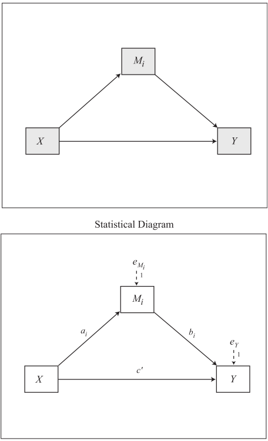
  <font size=20> Model 4 </font> 
</div>

---
# <h1 lang="en">Penguin Model 4</h1>
<br>
<div style="display:flex; align-items:center;">
  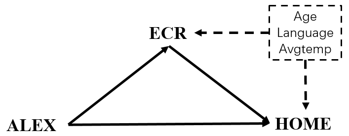 <br>
</div>

---

# <h1 lang="en">bruceR::PROCESS</h1>
## <h2 lang="en">CODE</h2>

```{r bruceR::PROCESS model 4, message=FALSE, eval=FALSE}
result.PROCESS <- capture.output({
# capture.output 可以将这段代码的结果存储进一个变量中
  bruceR::PROCESS(df.pg.raw,
                  x = "DEQ", #自变量
                  y = "avgtemp", # 因变量
                  meds = c("socialdiversity"), # 中介变量 
                  #mods = c(), # 调节变量
                  #covs = c(), # 控制变量（协变量）
                  #clusters = c(), #类似调节变量 分组变量
                  #hlm.re.m = "",hlm.re.y = "",hlm.type = c("1-1-1", "2-1-1", "2-2-1"),
                  #med.type = c("parallel", "serial"), # 中介变量之间是并列还是连续
                  #mod.type = c("2-way", "3-way"), # 两项交互还是三项交互
                  #mod.path = c(), # 调节哪条路径
                  cov.path = c("both"), # 控制变量进入几个方程，both意味着中介和因变量都会考虑控制变量
                  #mod1.val = NULL,mod2.val = NULL, # 调节变量高低水平对应的值
                  ci = c("boot"), # 置信区间使用bootstrap 或其他抽样方法
                  nsim = 1000, # 抽样的次数
                  #seed = NULL, # 设置seed可以让每次的抽样结果都一样
                  center = FALSE, # 是否对自变量和调节变量中心化。非中心化在解释时更方便
                  std = FALSE, # 是否在计算钱对所有变量进行标准化
                  digits = 3, # 保留的小数位数
                  #nsmall = digits,file = NULL
                  ) 
})
writeLines(result.PROCESS, "./output/chp9/PROCESS_model_4.md") # .md最整齐
```

---
# <h1 lang="en">bruceR::PROCESS</h1>
## <h2 lang="en">OUTPUT</h2>
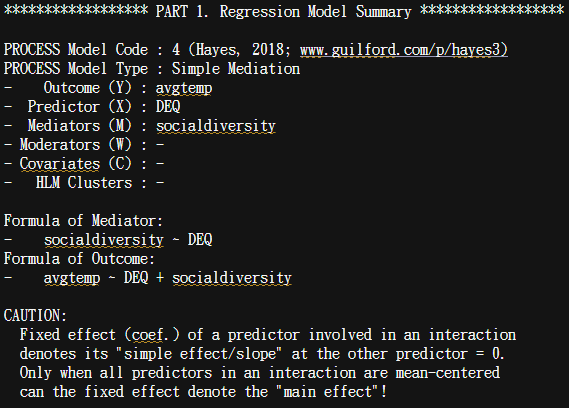

---
# <h1 lang="en">bruceR::PROCESS</h1>
## <h2 lang="en">OUTPUT</h2>
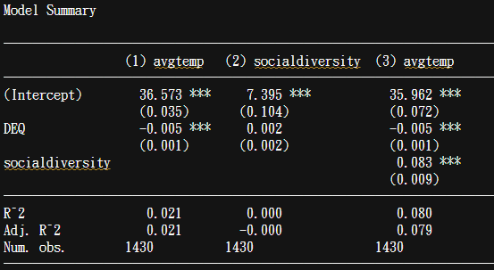

---
# <h1 lang="en">bruceR::PROCESS</h1>
## <h2 lang="en">OUTPUT</h2>
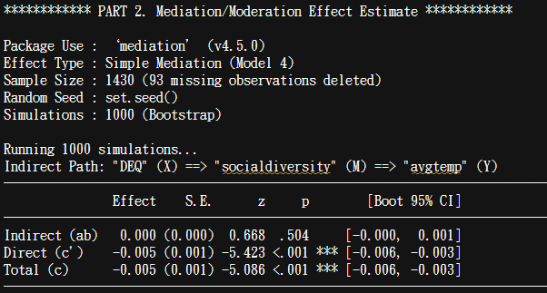

---
# <h1 lang="zh-CN">想~~编~~一个模型</h1>
<div style="display:flex; align-items:center;">
  
  <font size=20> Model 7 </font> 
</div>

---
# <h1 lang="zh-CN">想~~编~~一个模型</h1>
<div style="display:flex; align-items:center;">
  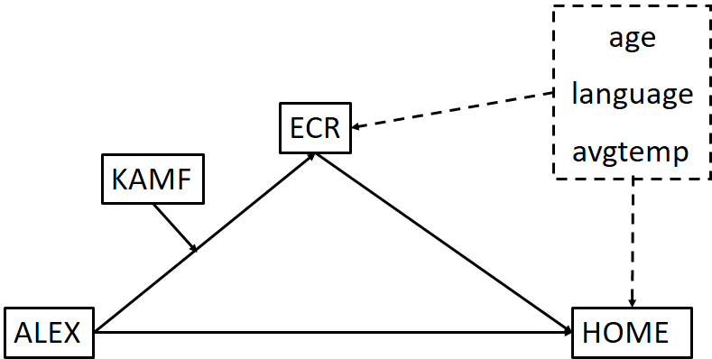 <br>
</div>

---
# <h1 lang="en">bruceR::PROCESS</h1>
## <h2 lang="en">CODE</h2>

```{r bruceR::PROCESS model 7, message=FALSE, eval=FALSE}
result.PROCESS <- capture.output({
# capture.output 可以将这段代码的结果存储进一个变量中
  bruceR::PROCESS(df.pg.mean,
                  x = "ALEX_mean", #自变量
                  y = "HOME_mean", # 因变量
                  meds = c("ECR_mean"), # 中介变量 
                  mods = c("KAMF_mean"), # 调节变量
                  covs = c("age", "language", "avgtemp"), # 控制变量（协变量）
                  #clusters = c(), #类似调节变量 分组变量
                  #hlm.re.m = "",hlm.re.y = "",hlm.type = c("1-1-1", "2-1-1", "2-2-1"),
                  #med.type = c("parallel", "serial"), # 中介变量之间是并列还是连续
                  #mod.type = c("2-way", "3-way"), # 两项交互还是三项交互
                  mod.path = c("x-m"), # 调节哪条路径
                  cov.path = c("both"), # 控制变量进入几个方程，both意味着中介和因变量都会考虑控制变量
                  #mod1.val = NULL,mod2.val = NULL, # 调节变量高低水平对应的值
                  ci = c("boot"), # 置信区间使用bootstrap 或其他抽样方法
                  nsim = 100, # 抽样的次数
                  #seed = NULL, # 设置seed可以让每次的抽样结果都一样
                  center = FALSE, # 是否对自变量和调节变量中心化。非中心化在解释时更方便
                  std = FALSE, # 是否在计算钱对所有变量进行标准化
                  digits = 3, # 保留的小数位数
                  #nsmall = digits,file = NULL
                  ) 
})
writeLines(result.PROCESS, "./output/chp9/PROCESS_model_7.md") # .md最整齐
```

---
# <h1 lang="en">bruceR::PROCESS</h1>
## <h2 lang="en">OUTPUT</h2>


---
# <h1 lang="en">bruceR::PROCESS</h1>
## <h2 lang="en">OUTPUT</h2>
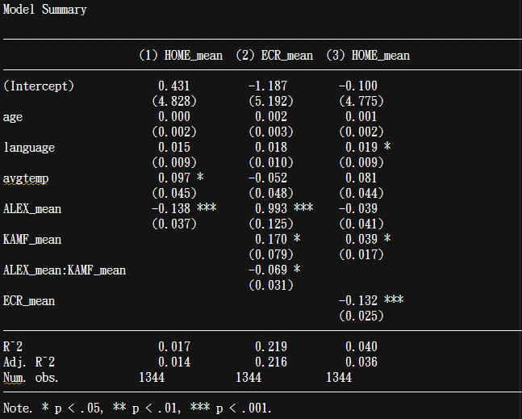

---
# <h1 lang="en">bruceR::PROCESS</h1>
## <h2 lang="en">OUTPUT</h2>
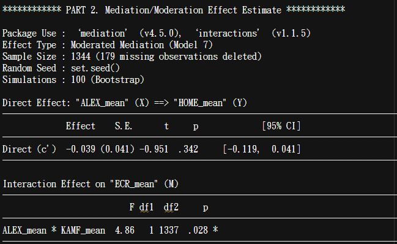

---
# <h1 lang="en">bruceR::PROCESS</h1>
## <h2 lang="en">OUTPUT</h2>
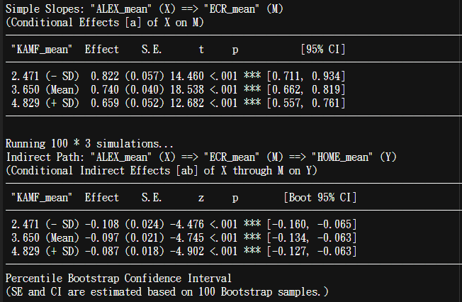

---
class: center, middle
<span style="font-size: 60px;">9.3 SEM in R (lavaan)</span> <br>

---
# <h1 lang="en">lavaan::cfa</h1>
# <h2 lang="en">CODE</h2>
```{r CFA_total, eval=FALSE}
result.CFA <- capture.output({
CFA<- 'DIDF =~ ALEX1 + ALEX3 + ALEX5 + ALEX6 + ALEX7 + ALEX10 + ALEX11 + ALEX2 + ALEX4 + ALEX8 + ALEX9
       EOF =~ ALEX12 + ALEX13 + ALEX14 + ALEX15 + ALEX16
            
       ANX =~ ECR1 + ECR2 + ECR3 + ECR4 + ECR5 + ECR6 + ECR7 + ECR8 + ECR9 + ECR10 + ECR11 + ECR12 + ECR13 + ECR14 + ECR15 + ECR16 + ECR17 + ECR18
       AVO =~ ECR19 + ECR20 + ECR21 + ECR22 + ECR23 + ECR24 + ECR25 + ECR26 + ECR27 + ECR28 + ECR29 + ECR30 + ECR31 + ECR32 + ECR33 + ECR34 + ECR35 + ECR36
            
       HOME =~ HOME1 + HOME2 + HOME3 + HOME4 + HOME5 + HOME6 + HOME7 + HOME8 + HOME9
            
       KAMF =~ KAMF1 + KAMF2 + KAMF3 + KAMF4 + KAMF5 + KAMF6 + KAMF7' %>%
       # ALEX =~ DIDF + EOF
       # ECR =~ ANX + AVO
       # 为了简化，这里没有做二阶
  lavaan::cfa(.,data=df.pg.raw,estimator="ML") 
  lavaan::summary(CFA,fit.measures=TRUE,standardized=TRUE)
})
writeLines(result.CFA, "./output/chp9/CFA.md")
```
_<h4 lang="zh-CN">- 这里并不是完全正确的做法，该论文penguin对原始量表做了一些修改</h4>_
_<h4 lang="zh-CN">- 原始量表中ALEX是一个二阶潜变量，由三个一阶潜变量DIF, DDF, EOF构成</h4>_
_<h4 lang="zh-CN">- 但是DIF和DDF被合并为DIDF了（penguin没有说这是为什么）</h4>_
_<h4 lang="zh-CN">- 如果你每个维度单独做CFA，就能找到问题所在（是因为这两个维度共线性太高）</h4>_

---
# <h1 lang="en">lavaan::cfa</h1>
## <h2 lang="en">OUTPUT: Model Fit</h2>
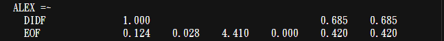
---
# <h1 lang="en">lavaan::cfa</h1>
## <h2 lang="en">OUTPUT: Model Fit</h2>
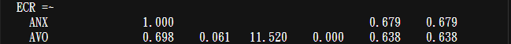
---
# <h1 lang="en">lavaan::cfa</h1>
## <h2 lang="en">OUTPUT: Factor Loading</h2>
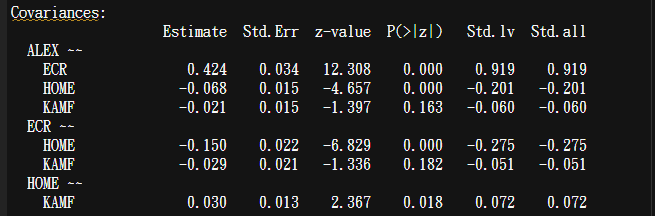
---
# <h1 lang="en">lavaan::cfa</h1>
## <h2 lang="en">OUTPUT: Factor Loading</h2>
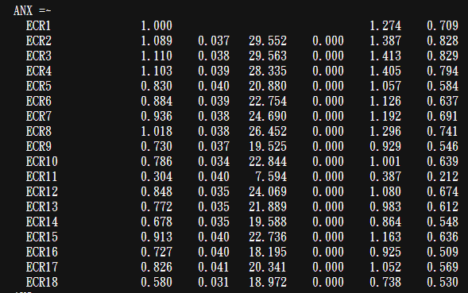
---
# <h1 lang="en">lavaan::cfa</h1>
## <h2 lang="en">OUTPUT: Factor Loading</h2>
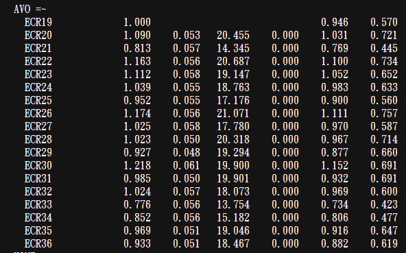
---
# <h1 lang="en">lavaan::cfa</h1>
## <h2 lang="en">OUTPUT: Factor Loading</h2>

---
# <h1 lang="en">lavaan::cfa</h1>
## <h2 lang="en">OUTPUT: Covariances</h2>
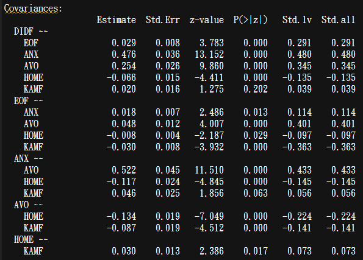
<br>
如果有两个变量之间协方差（相关）过高，则说明存在共线性，可以删除其中一个
---
# <h1 lang="en">lavaan::cfa</h1>
## <h2 lang="en">OUTPUT: Variances</h2>

<br>
残差和方差必须为正且显著，否则模型可能不收敛
_<h5 lang="en">- Heywood Case</h3>_
_<h5 lang="en">- Van Driel, O. P. (1978). On various causes of improper solutions in maximum likelihood factor analysis. Psychometrika, 43, 225-243.</h5>_

---
# <h1 lang="en">lavaan::cfa</h1>
## <h2 lang="en">Plot</h2>
```{r CFA PLOT, eval=FALSE}
lavaanPlot(model = CFA, edge_options = list(color = "grey"))
```

由于模型的题目比较多，这里的图片已经看不清了，就不打印在PPT上了<br>
lavaan的画图比较鸡肋，AMOS在画图上会更好看一些(如下图) <br>
有兴趣的同学可以跑一下试试看<br>
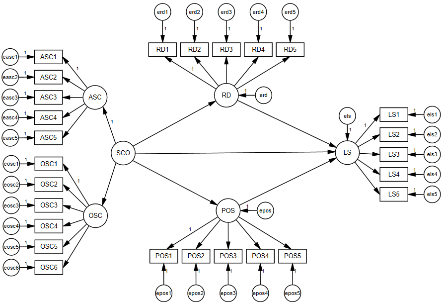

---
# <h1 lang="en">lavaan::sem</h1>
## <h2 lang="en">CODE</h2>
```{r SEM, eval=FALSE}
# 这里拿model 4举例
# 因为lavaan的调节变量不能是潜变量. 如果是潜变量作为调节变量，需要手动与其他变量相乘
result.SEM <- capture.output({
SEM<- 'DIDF =~ ALEX1 + ALEX3 + ALEX5 + ALEX6 + ALEX7 + ALEX10 + ALEX11 + ALEX2 + ALEX4 + ALEX8 + ALEX9
       EOF =~ ALEX12 + ALEX13 + ALEX14 + ALEX15 + ALEX16
       ALEX =~ DIDF + EOF
            
       ANX =~ ECR1 + ECR2 + ECR3 + ECR4 + ECR5 + ECR6 + ECR7 + ECR8 + ECR9 + ECR10 + ECR11 + ECR12 + ECR13 + ECR14 + ECR15 + ECR16 + ECR17 + ECR18
       AVO =~ ECR19 + ECR20 + ECR21 + ECR22 + ECR23 + ECR24 + ECR25 + ECR26 + ECR27 + ECR28 + ECR29 + ECR30 + ECR31 + ECR32 + ECR33 + ECR34 + ECR35 + ECR36
       ECR =~ ANX + AVO
            
       HOME =~ HOME1 + HOME2 + HOME3 + HOME4 + HOME5 + HOME6 + HOME7 + HOME8 + HOME9

       ECR ~ a*ALEX + age + language + avgtemp
       HOME ~ b*ECR + age + language + avgtemp

       ind_eff:=a*b ' %>%
  lavaan::sem(.,data=df.pg.raw,estimator="ML") 
  lavaan::summary(SEM,fit.measures=TRUE, standardized=TRUE, ci=TRUE)
})
writeLines(result.SEM, "./output/chp9/SEM.md")
```

---
# <h1 lang="en">lavaan::sem</h1>
## <h2 lang="en">OUTPUT: Path Analysis and Indirect Effect</h2>
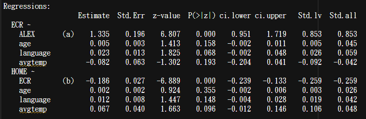 <br>
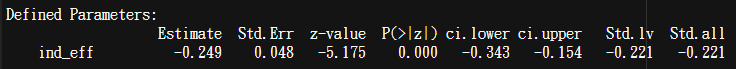 <br>
大多数结果与CFA类似，但是多了路径系数，以及我们设定的中介效应值

---
class: center, middle
<span style="font-size: 60px;">9.4 Others</span> <br>

---
# <h1 lang="zh-CN">其他有用的包</h1>
1. 如果你的SEM模型中一定用latent moderator，你可以使用Mplus，或者回到PROCESS <br>
2. Mplus某种意义上也是一个R包，install.packages("MplusAutomation") <br>
3. CFA得到之后，可以借助semTools这个包来提取矩阵lambda, theta, psi, beta. 这些矩阵用于制作收敛和区别效度表 <br>

其他SEM的细节就不在R课里讲述了
---
# <h1 lang="en">Videos</h1>
<div style="display:flex; align-items:center;">
  
</div>

https://www.bilibili.com/video/BV1Bt4y127xq/?spm_id_from=333.999.0.0&vd_source=4b61fa5a135da9b04ce5af0535b1e28c 
<br>
有兴趣的同学可以去看这个视频学习怎么做SEM

---
# <h1 lang="en">Videos</h1>
<div style="display:flex; align-items:center;">
  
</div>

https://www.youtube.com/watch?v=fGdsiugwO0k&list=PLliBbGBc5nn3m8bXQ4CmOep3UmQ_5tVlC&index=1&ab_channel=SachaEpskamp
<br>
这是原地址