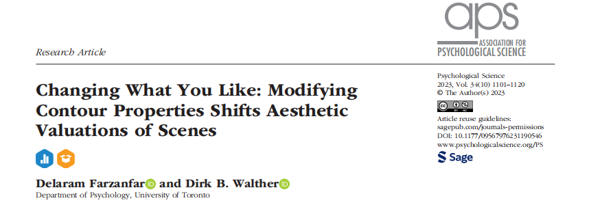
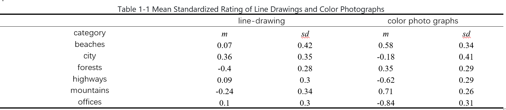
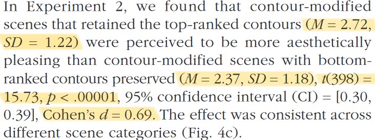
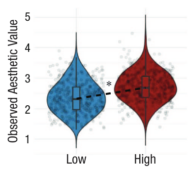
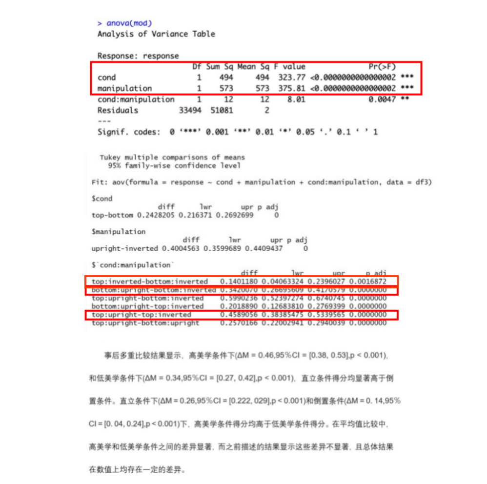
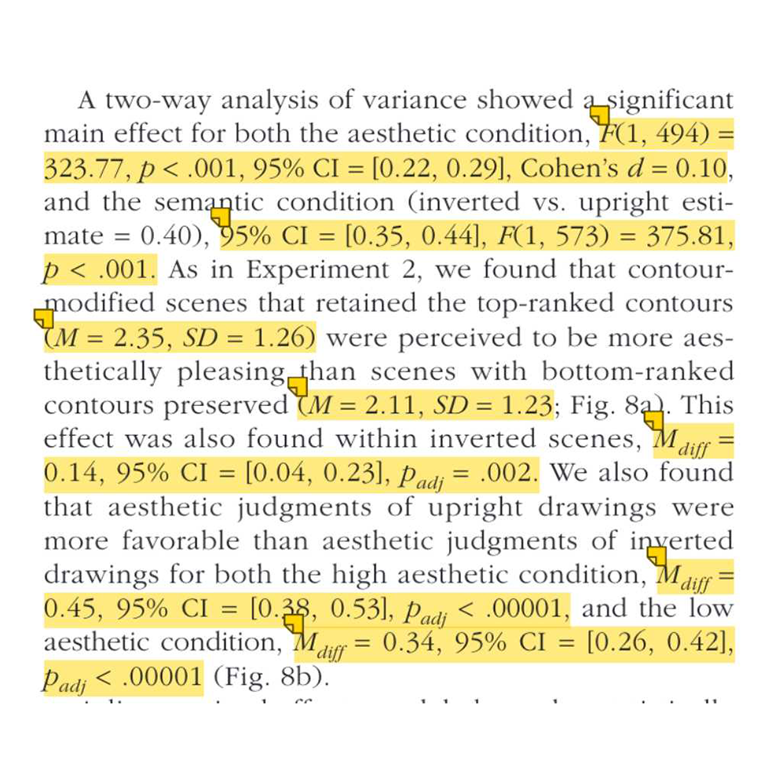
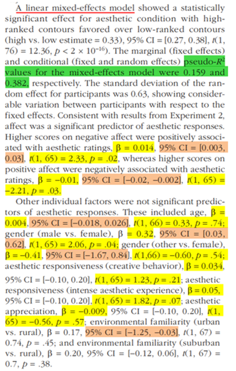
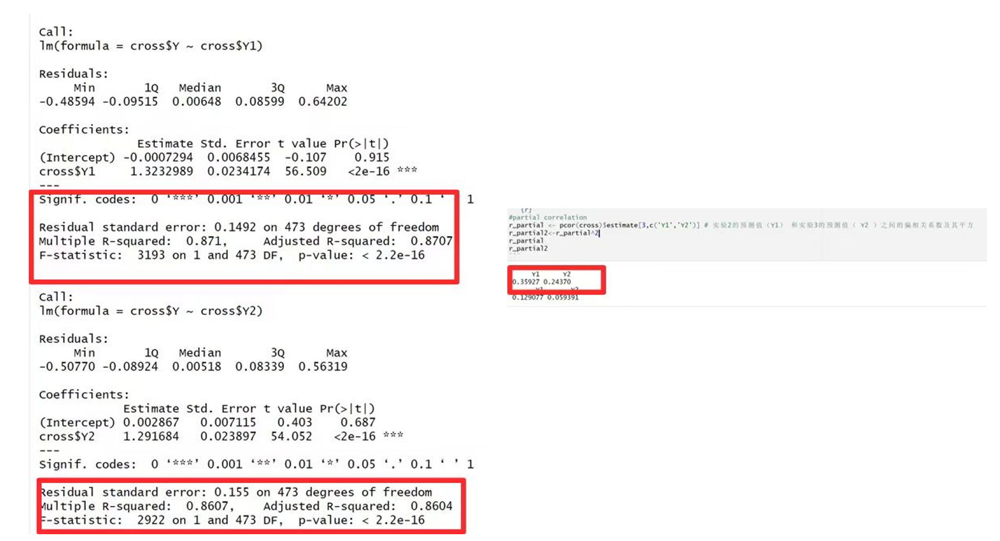
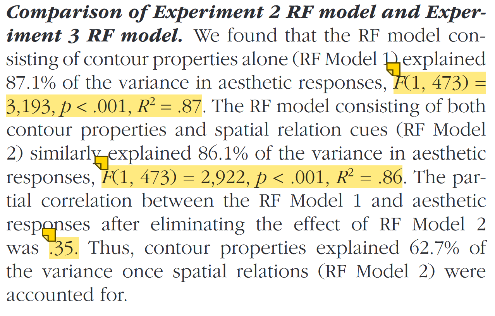

class: center, middle
<span style="font-size: 30px;">**Reproducibility Study Report on "Changing What You Like: Modifying Silhouette Characteristics Changes the Aesthetic Value of a Scene"**</span> <br>
<span style="font-size: 45px;">改变你喜欢的：修改轮廓属性改变场景的审美价值</span> <br>
<span style="font-size: 17px;">Farzanfar, D., & Walther, D. B. (2023). Changing What You Like: Modifying Contour Properties Shifts Aesthetic Valuations of Scenes. Psychological science, 34(10), 1101–1120. </span> <br>
<span style="font-size: 20px;"> </span> <br>
<span style="font-size: 30px;">汇报人: 郭凯彤   组员:邓心宇 霍依宁 史一诺 张燕</span> <br>
<span style="font-size: 20px;"> </span> <br>
<span style="font-size: 30px;">`r Sys.Date()`</span> <br>
<span style="font-size: 20px;"> Made with Rmarkdown</span> <br>
```{r echo=FALSE, out.width='70%', fig.align='center'}

```

```{r setup1, include=FALSE}
knitr::opts_chunk$set(
  fig.width=6, fig.height=4, fig.retina=2, 
  out.width="50%",
  message = FALSE,
  warning = F
)
```

```{css extra.css, echo=FALSE}
/* ---- extra.css ---- */
.bigfont {
  font-size: 25px;
}

.tit_font{
font-size: 70px;
}

```

```{r xaringan-panelset, echo=FALSE}
xaringanExtra::use_panelset()
```

---

<br>
<br>
<br>
<br>
.pull-left[

## 1.Division of labor among members

## 2.Literature introduction

- Introduction

- Methods

- Results


]

.pull-right[

## 3.Reproduce ideas and processes

## 4.Reproducible results

## 5.Discussions and conclusions of results

]

---
# <h3 lang="en">Division of labor among members</h3>
<span style="font-size: 22px;">郭凯彤：Responsible for reviewing the literature and reporting the recurrence results; writing of written reports</span></center><br>
<span style="font-size: 20px;"> </span> <br>
<span style="font-size: 22px;">邓心宇：Responsible for visual image reproduction of experiment 1, 2 and 3; partial inferential statistical reproduction; RMD collation and summary; writing html report and papaja code; writing of written reports</span></center><br>
<span style="font-size: 20px;"> </span> <br>
<span style="font-size: 22px;">霍依宁：Responsible for the descriptive statistics of experiment 1 and 2; the reproduction of inferred statistics and RMD collation; writing of written reports</span></center><br>
<span style="font-size: 20px;"> </span> <br>
<span style="font-size: 22px;">史一诺：Responsible for the matlab model and image processing of experiment 1, 2 and 3; the reproduction of partial inferential statistics; RMD collation; writing html report and papaja code; writing of written reports</span></center><br>
<span style="font-size: 20px;"> </span> <br>
<span style="font-size: 22px;">张燕：Responsible for literature screening; the descriptive statistics and inferred statistics of experiments 1 and 3 and the RMD collated; writing of written reports</span></center><br>
<span style="font-size: 20px;"> </span> <br>
<span style="font-size: 18px;">Discussion 1: Each person selected a literature and discussed the most suitable literature for repeatability research</span></center><br>
<span style="font-size: 18px;">Discussion 2: Division of labor for code reproduction </span></center><br>
<span style="font-size: 18px;">Discussion 3: Division of labor for the production and presentation of reports</span></center><br>

---

# <h2 lang="en">Introduction of the literature</h2>
<span style="font-size: 30px;">To what extent do aesthetic experiences arise from the human ability to perceive and extract meaning from visual features?</span></center><br>
<span style="font-size: 20px;"> </span> <br>
<span style="font-size: 30px;">What is the nature of these visual features? </span></center><br>
<span style="font-size: 20px;"> </span> <br>
<span style="font-size: 30px;">What role do they play in aesthetic judgments?</span></center><br>
<span style="font-size: 20px;"> </span> <br>
<span style="font-size: 30px;color:red;">This paper studies the effect of the visual features in scenes on observers’ aesthetic responses, and developed a contour model, allowing to predict aesthetic responses, and help to understand the causal relationship between contour properties and aesthetic valuation.</span></center><br>

---
# <h2 lang="en">Methods and Results</h2>
<span style="font-size: 30px;">The 1st experiment aims to investigate whether a model trained on contours properties can generate accurate aesthetic predictions.</span></center><br>
<span style="font-size: 20px;"> </span> <br>
<span style="font-size: 30px;">The 2nd experiment aims to investigate the causal relationship between contour properties and aesthetic valuation.</span></center><br>
<span style="font-size: 20px;"> </span> <br>
<span style="font-size: 30px;">The 3rd experiment aims to test whether the relationship still exists when semantic processing of the scenes is disrupted.</span></center><br>
<span style="font-size: 20px;"> </span> <br>
<span style="font-size: 20px;"> </span> <br>
<span style="font-size: 30px;color:red;">Contour manipulations directly shift subjective aesthetic judgments, and this provides the evidence for a causal relationship between contour properties and aesthetic valuation.</span></center><br>
---
# <h2 lang="en">Reproduction Content and Approach</h2>
<span style="font-size: 35px;">Reproduction Content：</span></center><br>
<span style="font-size: 20px;"> </span> <br>
<span style="font-size: 25px;">1.Descriptive Statistics</span></center><br>
<span style="font-size: 20px;"> </span> <br>
<span style="font-size: 25px;">2.t-test, Linear Mixed-Effects Model, Correlation, Analysis of Variance</span></center><br>
<span style="font-size: 20px;"> </span> <br>
<span style="font-size: 25px;">3.Image Visualization</span></center><br>
<span style="font-size: 20px;"> </span> <br>
<span style="font-size: 20px;"> </span> <br>
<span style="font-size: 35px;">Reproduction Approach：</span></center><br>
<span style="font-size: 20px;"> </span> <br>
<span style="font-size: 25px;">Run Original Code from the Document → Compare Code Results with Data and Image Results from the Document → Modify and Run Code</span></center><br>

---
# <h3 lang="en">Visual Aesthetics Research Based on MATLAB</h3>
<span style="font-size: 25px;">Image Processing, Model Training, and Result Analysis</span> <br>
```{r setup2, include=FALSE}
knitr::opts_chunk$set(echo = TRUE)
library(knitr)

# 设置图片路径
img1_path <- './picture/experiment1.png'
img2_path <- './picture/experiment2.png'
img3_path <- './picture/experiment3.png'

```
<style>.flex-container {
  display: flex;justify-content: space-around;
}.flex-item { margin: 10px;
}
</style>
<div class="flex-container">
<div class="flex-item">
<details>
<summary>Experiment 1</summary>
<p>
```{r echo=FALSE, fig.cap="Experiment 1"}
      knitr::include_graphics(img1_path)
```
</p>
</details>
</div>
<div class="flex-item">
<details>
<summary>Experiment 2</summary>
<p>
```{r echo=FALSE, fig.cap="Experiment 2"}
      knitr::include_graphics(img2_path)
```
</p>
</details>
</div>
<div class="flex-item">
<details>
<summary>Experiment 3</summary>
 <p>
```{r echo=FALSE, fig.cap="Experiment 3"}
    knitr::include_graphics(img3_path)
```
</p>
</details>
</div>
</div>

---
# <h3 lang="en">Preliminary Organization</h3>
<span style="font-size: 25px;">Call the packages used in this study</span></center><br>
```{r}
if (!requireNamespace('pacman', quietly = TRUE)) {
    install.packages('pacman')
}


pacman::p_load(
  # Call the packages used in this study
  dplyr, tidyverse, ggplot2, ggstatsplot, ggpubr, summarytools, psych, randomForest, randomForestExplainer, effectsize, car, afex, DT, papaja, ggrepel, lme4, lmerTest, MuMIn, lmtest, randomForest, randomForestExplainer, ppcor,   
  # Generate HTML report
  xaringan, xaringanthemer, xaringanExtra, knitr)

options(scipen=99999,digits = 5)
```

---
# <h3 lang="en">1.Experiment 1</h3>
<span style="font-size: 25px;">1.1 Import Data</span></center><br>
```{r}
#--------------------------------Set the Work Path------------------------------------------
setwd("./data/experiment1")
#--------------------------------Import Data------------------------------------------------
#Import Intact Line Drawings Data
LD1 <- read.csv("LD1.csv",stringsAsFactors=TRUE)
#Import Color Photo Data
CP <- read.csv("CP.csv",,stringsAsFactors=TRUE)

```

```{r example of data1, echo=FALSE}
DT::datatable(head(LD1),
              fillContainer = TRUE, options = list(pageLength = 4))
DT::datatable(head(CP),
              fillContainer = TRUE, options = list(pageLength = 4))

```

---

<span style="font-size: 25px;">1.2 Calculate M and SD for each group</span></center><br>

```{r}
# Function to calculate the mean and the standard deviation for each group
data_summary <- function(data, varname, groupnames){
  require(plyr)
  summary_func <- function(x, col){
    c(mean = mean(x[[col]], na.rm=TRUE),
      sd = sd(x[[col]], na.rm=TRUE))
  }
  data_sum<-ddply(data, groupnames, .fun=summary_func,
                  varname)
  data_sum <- rename(data_sum, c("mean" = varname))
  return(data_sum)
}
```


---

<span style="font-size: 25px;">1.3 Summarize LD Data</span></center><br>

```{r}
#Average ratings by category (raw scores)
by(LD1$pleasure_m,factor(LD1$category),describe)

#Average ratings by category (normalized scores)
by(LD1$Z_pleasure,factor(LD1$category),describe)
```


---

<span style="font-size: 25px;">1.4 Match LD with Color Photo Data</span></center><br>

.panelset[
.panel[.panel-name[Combined color and LD dataset]
```{r }
#combined color and LD dataset 
LD <- subset.data.frame(LD1, select = c("ImageName","pleasure_m"))  #Extract the "ImageName" and "pleasure_m" columns from the LD1 dataframe and store the result in a new dataframe LD

CPLD <- merge(x=CP,y=LD,by.x="imageName",by.y="ImageName",all.x=TRUE) #merge the CP and LD dataframes based on the image name

#Create two new columns, pleasure_LD and pleasure_CP, which contain the data from the pleasure_m column of the original LD dataframe and the mean_pleasure column of the CP dataframe
CPLD$pleasure_LD <- CPLD$pleasure_m
CPLD$pleasure_CP <- CPLD$mean_pleasure     
library(reshape2)
CPLD_long <- melt(CPLD, id.vars=c("imageName"), 
                  measure.vars=c("pleasure_LD", "pleasure_CP"),
                  variable.name="ImageType",
                  value.name="response")
```


.panel[.panel-name[Add category information]

```{r}
#add category information
CPLD_long <- CPLD_long %>% mutate(category = case_when(
  str_detect(.$imageName, "mountains_") ~ "mountains",
  str_detect(.$imageName, "city_") ~ "city",
  str_detect(.$imageName, "forests_") ~ "forests",
  str_detect(.$imageName, "beaches_") ~ "beaches",
  str_detect(.$imageName, "highways_") ~ "highways",
  str_detect(.$imageName, "offices_") ~ "offices",
  TRUE ~ as.character(.$imageName)))  # Convert the category column to a factor variable
CPLD_long$category <- as.factor(CPLD_long$category)       

```

.panel[.panel-name[Add category information]
```{r }
#add category information
CP <- CP %>% mutate(category = case_when(
  str_detect(.$imageName, "mountains_") ~ "mountains",
  str_detect(.$imageName, "city_") ~ "city",
  str_detect(.$imageName, "forests_") ~ "forests",
  str_detect(.$imageName, "beaches_") ~ "beaches",
  str_detect(.$imageName, "highways_") ~ "highways",
  str_detect(.$imageName, "offices_") ~ "offices",
  TRUE ~ as.character(.$imageName)))  # Convert the category column to a factor variable
CP$category <- as.factor(CP$category)    
```
]]]]

---

<span style="font-size: 25px;">1.5 Summarize Color Photo Data</span></center><br>

```{r}
#Average ratings by category (raw scores)
by(CP$mean_pleasure,factor(CP$category),describe)
#Average ratings by category (normalized scores)
by(CP$Z_pleasure,factor(CP$category),describe)

```

---

<span style="font-size: 25px;">1.6 Descriptive Statistics Results</span></center><br>

.panelset[
.panel[.panel-name[Reproduce Results]
```{r echo=FALSE, out.width='80%', fig.align='center'}

```

.panel[.panel-name[Comparison with Literature Results]
```{r echo=FALSE, out.width='50%', fig.align='center'}
knitr::include_graphics('./picture/e1paper_msd.jpg')
```
]]]

---

<span style="font-size: 25px;">1.7 Fig.3 c: Comparison of Reproduced Results with Literature Results</span></center><br>


.panelset[
.panel[.panel-name[pre-1]
```{r}
group.colors2 <- c(LD_pleasure = "steelblue", CP_pleasure = "darkred")
#dataframe summary
CPLD_summary <- data_summary(CPLD_long, varname="response", 
                            groupnames=c("ImageType", "category"))

```

.panel[.panel-name[pre-2]
```{r}
#raw version of Figure 3C
p<- ggplot(CPLD_summary, aes(x=category, y=response, group=ImageType)) + 
  geom_line(aes(linetype=ImageType)) +
  geom_point(aes(shape=ImageType))
p+labs(title="Experiment 1: LD - CP", x="Category", y = "Response")+
  theme_classic() 

```

.panel[.panel-name['Fig.3c' from the literature]
```{r echo=FALSE, out.width='60%', fig.align='center'}
knitr::include_graphics('./picture/figure3c.png')
```

.panel[.panel-name[post-1]
```{r}
# Set colors
group.colors2 <- c("Line Drawings" = "black", "Photographs" = "mediumturquoise")

# Data summary
CPLD_summary <- data_summary(CPLD_long, varname="response", groupnames=c("ImageType", "category"))

# Assign fixed x-values for each type and tweak to avoid points near the edges
CPLD_summary$xpos <- ifelse(CPLD_summary$ImageType == "pleasure_LD", 2, 3)  # Appropriately increase x-coordinate

# Convert ImageType to more understandable labels
CPLD_summary$ImageType <- factor(CPLD_summary$ImageType, levels = c("pleasure_LD", "pleasure_CP"),
                                 labels = c("Line Drawings", "Photographs"))

```

.panel[.panel-name[post-2]
```{r}
# Plot
p <- ggplot(CPLD_summary, aes(x=xpos, y=response, group=category, color=ImageType)) +
  geom_point(size=4) +  # Draw points
  geom_line(aes(group=category), linewidth=1, color="grey") +  # Connecting lines
  geom_text_repel(aes(label=category, x=ifelse(ImageType == "Line Drawings", xpos - 0.3, xpos + 0.3), hjust=ifelse(ImageType == "Line Drawings", 1, 0)), vjust=0, show.legend = FALSE, nudge_y=0.1, direction="y", segment.color = NA) +  # Add category labels, adjust position
  scale_color_manual(values=group.colors2) +
  labs(title="Experiment 1: LD - CP", y="Mean Aesthetic Value", color=NULL) +  # Remove legend title
  theme_minimal() +
  theme(
    axis.text.x = element_blank(), 
    axis.ticks.x = element_blank(), 
    axis.title.x = element_blank(), 
    panel.grid.major.x = element_blank(), 
    panel.grid.minor.x = element_blank(),  # Clear x-axis related elements
    panel.grid.major.y = element_blank(),  # Remove major horizontal grid lines
    panel.grid.minor.y = element_blank(),  # Remove minor horizontal grid lines
    axis.line.x = element_line(color = "black"),  # Add x-axis line
    axis.line.y = element_line(color = "black")   # Add y-axis line
  ) +
  scale_x_continuous(breaks = c(2, 3), labels = c("Line Drawings", "Photographs"), limits = c(1, 4))  # Adjust x-axis range and labels
  papaja::theme_apa()  # Apply APA style theme

```

.panel[.panel-name[post-3]
```{r}
# Display plot
print(p)
```

]]]]]]]

---

# <h3 lang="en">2.Experiment 2</h3>
<span style="font-size: 25px;">2.1 Import Data</span></center><br>
```{r}
#--------------------------------Set the Work Path------------------------------------------
setwd("./data/experiment2")
#--------------------------------Import Data------------------------------------------------
#Import half-split data
df2 <- read.csv("LD2.csv",stringsAsFactors=TRUE)

```

```{r example of data2, echo=FALSE}
DT::datatable(head(df2),
              fillContainer = TRUE, options = list(pageLength = 4))

```

---

<span style="font-size: 25px;">2.2 Calculate M and SD for each group</span></center><br>

```{r}
# Function to calculate the mean and the standard deviation for each group
data_summary <- function(data, varname, groupnames){
  require(plyr)
  summary_func <- function(x, col){
    c(mean = mean(x[[col]], na.rm=TRUE),
      sd = sd(x[[col]], na.rm=TRUE))
  }
  data_sum<-ddply(data, groupnames, .fun=summary_func,
                  varname)
  data_sum <- rename(data_sum, c("mean" = varname))
  return(data_sum)
}
```

---

<span style="font-size: 25px;">2.3 T-test</span></center><br>

.panelset[
.panel[.panel-name[Summarize Data]
```{r }
#mean and sd for top and bottom-ranked contours
by(df2$response,factor(df2$condition),describe)
```


.panel[.panel-name[Top vs Bottom Mean Diff]

```{r}
#make dataframe for paired samples t-test
df2_paired <- df2 %>%
  dplyr::select(Imageidentity,stimulusitem1,response,condition) %>%
  dplyr::group_by(condition,Imageidentity)%>%
  dplyr::summarize(response = mean(response))
#paired t statistic
t.test(df2_paired$response[df2_paired$condition=="top"],df2_paired$response[df2_paired$condition=="bottom"],paired=TRUE)
#effect size (cohen's d)
effsize::cohen.d(df2_paired$response, factor(df2_paired$condition))

```

.panel[.panel-name[Reproduce Results]
```{r echo=FALSE, out.width='70%', fig.align='center'}
knitr::include_graphics('./picture/e2_t.png')
```

.panel[.panel-name[Comparison with Literature Results]
```{r echo=FALSE, out.width='70%', fig.align='center'}

```

]]]]]

---

<span style="font-size: 25px;">2.4 Fig.4 c left: Comparison of Reproduced Results with Literature Results</span></center><br>

.panelset[
.panel[.panel-name[pre-1]
```{r}
group.colors <- c(bottom = "steelblue", top = "darkred")
#dataframe summary
df2_summary <- data_summary(df2, varname="response", 
                            groupnames=c("condition", "category"))

```

.panel[.panel-name[pre-2]
```{r}
#violin plot Figure 4C Left
ggp <- ggplot(df2_summary, aes(condition, response, fill = condition)) +            
  geom_violin(trim=FALSE, bw=0.2, position = "identity") + geom_jitter(alpha=0.1)
ggp <- ggp + scale_fill_manual(values=group.colors) + ylim(0,5)
ggp <- ggp + theme_minimal() + geom_boxplot(width=0.1, position=position_dodge(.9),outlier.shape = NA)
ggp + xlab("Contour Condition") + ylab("Mean Aesthetic Response") + theme_minimal()

```


.panel[.panel-name['Fig.4c left' from the literature]
```{r echo=FALSE, out.width='45%', fig.align='center'}

```


.panel[.panel-name[post-1]
```{r}
# Remap condition labels
df2_paired$condition <- dplyr::recode(df2_paired$condition, "bottom" = "Low", "top" = "High")

# Set colors
group.colors <- c("Low" = "steelblue", "High" = "darkred")

# Calculate means
low_mean <- mean(df2_paired$response[df2_paired$condition == "Low"])
high_mean <- mean(df2_paired$response[df2_paired$condition == "High"])

```

.panel[.panel-name[post-2]
```{r}
# Plot violin and scatter plot
ggp <- ggplot(df2_paired, aes(x=condition, y=response, fill=condition)) +            
  geom_violin(trim=FALSE, bw=0.2, position="identity", alpha=0.5) +
  geom_jitter(aes(color=condition), width=0.4, height=0, alpha=0.5) +  # Add scatter points
  geom_boxplot(width=0.1, position=position_dodge(0.9), outlier.shape=NA, alpha=0.5) +
  scale_fill_manual(values=group.colors) +
  scale_color_manual(values=group.colors) +
  ylim(0, 5) +
  theme_minimal() +
  labs(x="Contour Condition", y="Observed Aesthetic Value") +
  theme(legend.position="none") +  # Hide legend
  geom_segment(aes(x=1, xend=2, y=low_mean, yend=high_mean), linetype="dashed", color="black") +  # Add dashed line
  annotate("text", x=1.5, y=(low_mean + high_mean) / 2 + 0.2, label="*", size=6)  # Add asterisk
  papaja::theme_apa() # Apply APA style theme
  
```

.panel[.panel-name[post-3]
```{r}
# Display plot
print(ggp)
```

]]]]]]]

---

<span style="font-size: 25px;">2.5 Fig.4 c right: Comparison of Reproduced Results with Literature Results</span></center><br>

.panelset[
.panel[.panel-name[pre-1]
```{r}
#line plot Figure 4C right
df2_mean <- df2 %>%
  dplyr::group_by(condition,category) %>%
  dplyr::summarise(response = mean(response),
                   sd = sd(response))

```

.panel[.panel-name[pre-2]
```{r}
p<- ggplot(df2_mean, aes(x=category, y=response, group=condition)) + geom_line(aes(linetype=condition))+
  geom_point(aes(shape=condition)) 
p+labs(title="Study 2: Category and Condition", x="Category", y = "Response")+ theme_classic() + scale_fill_manual(values=group.colors)
```

.panel[.panel-name['Fig.4c right' from the literature]
```{r echo=FALSE, out.width='60%', fig.align='center'}
knitr::include_graphics('./picture/figure4cright.png')
```

.panel[.panel-name[post-1]
```{r}
df2_mean <- df2 %>%
  dplyr::group_by(condition, category) %>%
  dplyr::summarise(response = mean(response), sd = sd(response), .groups = 'drop') %>%
  mutate(
    xpos = ifelse(condition == "bottom", 1, 3),  # Set x position for Low and High
    text_xpos = xpos + ifelse(condition == "bottom", -0.15, 0.15)  # Adjust label x position
  )
```

.panel[.panel-name[post-2]
```{r}
# Create plot
p <- ggplot(df2_mean, aes(x=xpos, y=response, group=condition)) +
  geom_point(aes(color=condition), size=3) +
  geom_line(aes(group=category), color="grey") +  # Draw connecting lines for categories
  geom_text_repel(
    aes(x=text_xpos, label=category, hjust=ifelse(condition=="bottom", 1, 0)),
    size=3, color="black", box.padding = 0.35, point.padding = 0.5,
    max.overlaps = Inf, direction = "y"  # Limit label adjustments to vertical direction
  ) +
  scale_x_continuous(name="Condition", breaks=c(1, 3), labels=c("Low", "High"), limits=c(0.5, 3.5)) +
  scale_y_continuous(name="Observed Aesthetic Value", limits=c(1.4, 3.4)) +  # Set y-axis range from 1.4 to 3.4
  labs(y = "Observed Aesthetic Value", title="Category and Condition") +
  theme_minimal() +
  scale_color_manual(values=c("bottom"="steelblue", "top"="darkred")) +
  theme(panel.grid.major.x = element_blank(), panel.grid.minor.x = element_blank(),
        legend.position = "none")  # Hide legend
  papaja::theme_apa() # Apply APA style theme
  
```

.panel[.panel-name[post-3]
```{r}
# Display plot
print(p)
```

]]]]]]]

---

<span style="font-size: 25px;">2.6 Linear Mixed Effects Model</span></center><br>

.panelset[
.panel[.panel-name[LMM]
```{r}
mod_fac_slp_exp2 <- lmer(response ~ condition + DATscore + training_response+ PositiveAffectScore+
                           NegativeAffectScore + regionpast_response + gender_response +experience_response
                         + age_response + (1+condition|subject),
                         na.action = "na.exclude", data = df2,REML=T)
summary(mod_fac_slp_exp2)
anova(mod_fac_slp_exp2)
#confidence intervals
#confint(mod_fac_slp_exp2)  # Running the code for confidence intervals here takes a long time, so it is labeled and hidden here
r.squaredGLMM(mod_fac_slp_exp2)
```

.panel[.panel-name[Reproduce Results]
```{r echo=FALSE, out.width='70%', fig.align='center'}
knitr::include_graphics('./picture/e2_LMM.jpg')
```

.panel[.panel-name[Comparison with Literature Results]
```{r echo=FALSE, out.width='30%', fig.align='center'}
knitr::include_graphics('./picture/e2paper_LMM.jpg')
```

]]]]

---

# <h3 lang="en">3.Experiment 3</h3>
<span style="font-size: 25px;">3.1 Import Data</span></center><br>
```{r}
#--------------------------------Set the Work Path-----------------------------
setwd("./data/experiment3")
#--------------------------------Import Data-----------------------------------
#Import data
df3 <- read.csv("LD3.csv", stringsAsFactors=TRUE)
#Import random forest model residual data
cross <- read.csv("cross.csv")

```


```{r example of data3, echo=FALSE}
DT::datatable(head(df3),
              fillContainer = TRUE, options = list(pageLength = 4))

DT::datatable(head(cross),
              fillContainer = TRUE, options = list(pageLength = 4))
```

---

<span style="font-size: 25px;">3.2 Summarize Data</span></center><br>

.panelset[
.panel[.panel-name[group the data by condition]

```{r}
by(df3$response,factor(df3$cond),describe)
```

.panel[.panel-name[creates a new category column]

```{r}
df3 <- df3 %>% mutate(category = case_when(
  str_detect(.$stimulusitem1, "mountains_") ~ "mountains",
  str_detect(.$stimulusitem1, "city_") ~ "city",
  str_detect(.$stimulusitem1, "forests_") ~ "forests",
  str_detect(.$stimulusitem1, "beaches_") ~ "beaches",
  str_detect(.$stimulusitem1, "highways_") ~ "highways",
  str_detect(.$stimulusitem1, "offices_") ~ "offices",
  TRUE ~ as.character(.$stimulusitem1)))
df3$category <- as.factor(df3$category)
```

.panel[.panel-name[group the data by category]

```{r}
by(df3$response,factor(df3$category),describe)
```
]]]]

---

<span style="font-size: 25px;">3.3 ANOVA (top vs bottom condition)</span></center><br>

.panelset[
.panel[.panel-name[Interaction Plot]
```{r}
interaction.plot(df3$cond,df3$manipulation,df3$response)
```

.panel[.panel-name[Analysis of Variance]
```{r}
mod <- aov(response~cond+manipulation+cond:manipulation, data = df3)
anova(mod)
```

.panel[.panel-name[Mean Comparison]
```{r}
#mean comparisons
print(TukeyHSD(mod))
cohens_f(mod)
```

.panel[.panel-name[Reproduce Results]
```{r echo=FALSE, out.width='45%', fig.align='center'}

```

.panel[.panel-name[Comparison with Literature Results]
```{r echo=FALSE, out.width='45%', fig.align='center'}

```
]]]]]]

---

```{r setup3, include=FALSE}
knitr::opts_chunk$set(
  fig.width=5, fig.height=3, fig.retina=2, 
  out.width="30%",
  message = FALSE,
  warning = F
)
```

<span style="font-size: 25px;">3.4 Fig.8 b: Comparison of Reproduced Results with Literature Results</span></center><br>

.panelset[
.panel[.panel-name[pre-1]
```{r}
group.colors <- c(bottom = "steelblue", top = "darkred")
df3_upright <- df3 %>%
  dplyr::filter(manipulation=="upright")

df3_upright_mean <- df3_upright %>%
  dplyr::group_by(image,cond) %>%
  dplyr::summarise(mean_response = mean(response))

#upright condition
ggp <- ggplot(df3_upright_mean, aes(cond, mean_response, fill = cond)) +            
  geom_violin(trim=FALSE, bw=0.2, position = "identity") + geom_jitter(alpha=0.1)
ggp <- ggp + scale_fill_manual(values=group.colors) + ylim(0,5)
ggp <- ggp + theme_minimal() + geom_boxplot(width=0.1, position=position_dodge(.9),outlier.shape = NA)
ggp + xlab("Contour Condition") + ylab("Mean Aesthetic Response") + theme_minimal()

#inverted condition
df3_inverted <- df3 %>%
  dplyr::filter(manipulation=="inverted")

df3_inverted_mean <- df3_inverted %>%
  dplyr::group_by(image,cond) %>%
  dplyr::summarise(mean_response = mean(response))
```

.panel[.panel-name[pre-2]
```{r}
#plot
ggp <- ggplot(df3_inverted_mean, aes(cond, mean_response, fill = cond)) +            
  geom_violin(trim=FALSE, bw=0.2, position = "identity") + geom_jitter(alpha=0.1)
ggp <- ggp + scale_fill_manual(values=group.colors) + ylim(0,5)
ggp <- ggp + theme_minimal() + geom_boxplot(width=0.1, position=position_dodge(.9),outlier.shape = NA)
ggp + xlab("Contour Condition") + ylab("Mean Aesthetic Response") + theme_minimal()

```

.panel[.panel-name['Fig.8b' from the literature]
```{r echo=FALSE, out.width='60%', fig.align='center'}
knitr::include_graphics('./picture/figure8b.png')
```

```{r setup4, include=FALSE}
knitr::opts_chunk$set(
  fig.width=5, fig.height=5, fig.retina=2, 
  out.width="40%",
  message = FALSE,
  warning = F
)
```

.panel[.panel-name[post-1]
```{r}
# Create a comprehensive data frame containing upright and inverted data
df3_combined <- df3 %>%
  mutate(condition = ifelse(manipulation == "upright", "Upright", "Inverted")) %>%
  dplyr::group_by(image, cond, condition) %>%
  dplyr::summarise(mean_response = mean(response))

# Ensure the correct order of Upright and Inverted
df3_combined$condition <- factor(df3_combined$condition, levels = c("Upright", "Inverted"))

# Define colors
group.colors <- c("bottom" = "steelblue", "top" = "darkred")


```

.panel[.panel-name[post-2]
```{r}
# Create a combined chart
ggp_combined <- ggplot(df3_combined, aes(cond, mean_response, fill = cond)) +            
  geom_violin(trim=FALSE, bw=0.2, position = "identity") + 
  scale_fill_manual(values=group.colors) + 
  ylim(0,5) +
  theme_minimal() + 
  geom_boxplot(width=0.1, position=position_dodge(.9), outlier.shape = NA) +
  theme_minimal() +
  theme(legend.position = "none") + # Remove the legend
  xlab(NULL) + 
  ylab("Observed Aesthetic Value") +
  facet_wrap(~condition, scales = "free_x") +
  theme(strip.text.x = element_text(size=12, face="bold")) # Add labels and adjust font size
  papaja::theme_apa() # Apply APA style theme
  
```

.panel[.panel-name[post-3]
```{r}
# Display plot
print(ggp_combined)
```

]]]]]]]

---

<span style="font-size: 25px;">3.5 Linear Mixed Effects Model</span></center><br>

.panelset[
.panel[.panel-name[LMM]
```{r}
mod_fac_slp_exp3 <- lmer(response ~ cond + PositiveAffectScore+ CB + IAE + AA +
                           NegativeAffectScore + region + gender +
                           + age + (1+cond|subject),
                         na.action = "na.exclude", data = df3,REML=T)
summary(mod_fac_slp_exp3)
anova(mod_fac_slp_exp3)
```

.panel[.panel-name[CI & R²]
```{r}
#confint(mod_fac_slp_exp3) #Running the code for confidence intervals here takes a long time, so it is labeled and hidden here
r.squaredGLMM(mod_fac_slp_exp3)
```

.panel[.panel-name[Reproduce Results]
```{r echo=FALSE, out.width='80%', fig.align='center'}
knitr::include_graphics('./picture/e3_LMM.jpg')
```

.panel[.panel-name[Comparison with Literature Result]
```{r echo=FALSE, out.width='30%', fig.align='center'}

```

]]]]]

---

<span style="font-size: 25px;">3.6 Model Comparison</span></center><br>

.panelset[
.panel[.panel-name[Variance Decomposition]
```{r}
#Y column values are the predictions from intact line drawing model in experiment 1
#Y1 column values are predictions from experiment 2
#Y2 column values are predictions from experiment 3
mod <- lm(cross$Y ~ cross$Y1 + cross$Y2) #Evaluate the predictive values of Experiment 2 (Y1) and Experiment 3 (Y2) for the total variance explained by the predictive values of Experiment 1 (Y)
mod1 <- lm(cross$Y ~ cross$Y1) #Evaluate the independent variance explained by Experiment 2 for the predictive values of Experiment 1
mod2 <- lm(cross$Y ~ cross$Y2) #Evaluate the independent variance explained by Experiment 3 for the predictive values of Experiment 1

# Calculate and display the detailed statistics of mod1
summary(mod1)

# Calculate and display the detailed statistics of mod2
summary(mod2)

# Extract the R-squared value
r_squared_mod1 <- summary(mod1)$r.squared
r_squared_mod2 <- summary(mod2)$r.squared

# Extract the F-statistics value
f_stat_mod1 <- summary(mod1)$fstatistic
f_stat_mod2 <- summary(mod2)$fstatistic
```

.panel[.panel-name[Calculate partial correlations]
```{r}
#partial correlation
r_partial <- pcor(cross)$estimate[3,c('Y1','Y2')] # The partial correlation coefficient and its square between the predicted values of Experiment 2 (Y1) and Experiment 3 (Y2)
r_partial2<-r_partial^2
r_partial 
r_partial2
```

.panel[.panel-name[Calculate semipartial correlations]
```{r}
#semipartial correlation
r_part <- spcor(cross)$estimate[3,c('Y1','Y2')] # The semipartial correlation coefficient and its square between the predicted values of Experiment 2 (Y1) and Experiment 3 (Y2)
r_part^2
```

.panel[.panel-name[Reproduce Results]
```{r echo=FALSE, out.width='80%', fig.align='center'}

```

.panel[.panel-name[Comparison with Literature Results]
```{r echo=FALSE, out.width='60%', fig.align='center'}

```

]]]]]]

---

class: middle,center
.tit_font[
Thanks！

]

