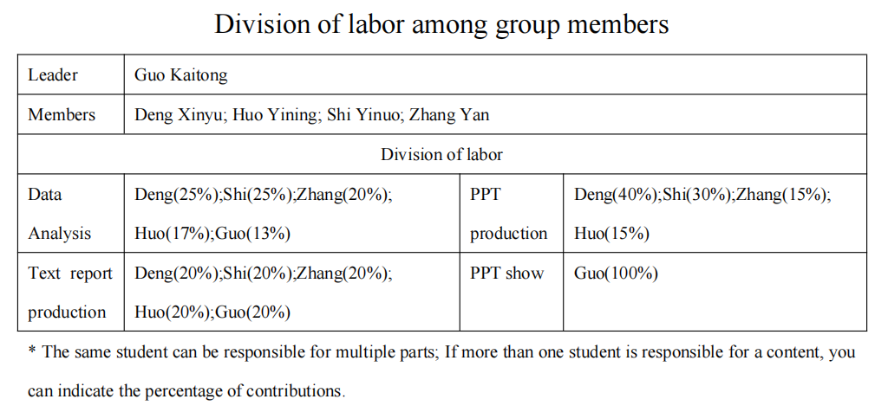

```{r setup, include = FALSE}
# Check if the tinytex package is installed, and install it if not
if (!requireNamespace("tinytex", quietly = TRUE)) {
  install.packages("tinytex")
  tinytex::install_tinytex()
}

library("papaja")
r_refs("r-references.bib")
```

```{r analysis-preferences}
# Seed for random number generation
set.seed(42)
knitr::opts_chunk$set(cache.extra = knitr::rand_seed)
```

# 1 Introduction
## 1.1 Selected Literature
This study is based on a paper by Farzanfar & Walther published in Psychological science in 2023 entitled “Changing What You Like: Modifying Contour Properties Shifts Aesthetic Valuations of Scenes”.

The study's data, materials, and code are publicly available on the Open Science Framework (OSF) and can be accessed at https://osf.io/rb2wc/.

## 1.2 Literature Introduction
## 1.2.1 Background of literature research

Visual aesthetics is an important topic in the field of psychology and art, and it is generally believed that beautiful scenes or objects can trigger pleasant emotional experience[@biederman2006;@palmer2013;@chatterjee2022;@farzanfar2023].The visual information provided by ordinary scenes, such as beaches and sunsets, can trigger the perceiver's aesthetic feelings. It is precisely through such a phenomenon that artists can rationally arrange the visual features in artistic performance, so that people can obtain aesthetic pleasure. This pleasure may be related to the way human visual system processes information. Visual information is an important way for humans to obtain environmental information, and visual features carry a wealth of information, such as the direction, length, curvature and connection mode of contour lines, which can convey the spatial relationship between objects and scenes, help people identify objects and classify scenes, and evaluate the potential costs and benefits of interacting with different objects and environments. Research has shown that these visual features play an important role in aesthetic judgments, such as curved shapes are often considered more attractive than straight shapes, and symmetry is also considered an important aesthetic feature. Furthermore, according to the extension of Marr's visual framework - component recognition theory [@marr1982], the categorical process by which people recognize objects in the environment occurs through a set of visual primitives, similar to geometric building blocks of shapes, which are viewpoint-invariant, i.e. non-accidental properties [@biederman1987]. Non-accidental attributes are those visual features that help people identify objects and scenes and understand their spatial relationships, such as the way contours are connected. Studies have shown that non-accidental attributes play an important role in object recognition and scene classification.

However, exactly what visual features are responsible, and the cognitive mechanisms behind this aesthetic response, are still unclear. Therefore, the authors adopted an empirical approach to study how systematic changes in visual features in the scene would affect the aesthetic response of the observer, so as to test the possible relationship between visual information and aesthetic response, and further explore how visual features affect people's aesthetic judgment and reveal the neuropsychological basis behind it.

## 1.2.2 Literature research problems

The main research question of this literature is to what extent does the human ability to perceive and extract meaning from visual features produce aesthetic experience? How do basic visual features (contour attributes and their spatial relationships) affect people's aesthetic evaluation of a scene? This paper further discusses the essence of these visual features and the role they play in aesthetic judgment. Based on the existing research background and the above research questions, the researchers conducted three experimental designs to verify three research hypotheses, namely: (1) There is a high correlation between the aesthetic value prediction of different scenes generated by the random forest model trained on the contour statistical characteristics and people's real aesthetic rating of different scenes; (2) Changing the contour characteristics of the scene on the basis of model prediction can change people's real aesthetic rating in the expected direction; (3) When people's semantic processing of the scene is interrupted by flipping the contour in the scene, people's evaluation of the contour scene with high aesthetic value generated by the model will also be higher than that of the contour scene with low aesthetic value.

## 1.2.3 Literature research results and conclusions

By constructing contour models and conducting relevant experimental studies, researchers in this literature first show that contour attribute models can accurately predict people's aesthetic evaluation of scenes, whether it is line drawings or color photos. Secondly, modifying the contour attributes can lead to changes in people's aesthetic evaluation of the scene. The scene that retains the contour with high predictive aesthetic value is more popular than the scene that retains the contour with low predictive aesthetic value. While scene inversion reduces people's aesthetic evaluation of scenes, it does not change the aesthetic advantage of scenes with high-value contours, suggesting that feature manipulation directly changes aesthetic judgment. Finally, observers' negative emotions can predict their aesthetic evaluation of the scene, and observers with higher negative emotions may be more likely to give a positive evaluation of the line painting scene. Specifically, the results of experiment 1 show that there is a significant correlation between the aesthetic value predicted by the model and people's real aesthetic rating, indicating that the random forest model trained on scene contour characteristics can predict people's subjective aesthetic evaluation of the scene. The T-test results of experiment 2 show that when viewing contour modification scenes with high aesthetic grade and low aesthetic grade generated by the model, there is a significant difference between people's real aesthetic ratings of the two scenes, and the linear mixed effect model also shows a significant effect of high and low aesthetic conditions, indicating that modifying contour characteristics can change people's aesthetic evaluation of the scene. That is, there is a causal relationship between contour characteristics and people's aesthetic ratings. The ANOVA analysis results of experiment 3 show that the main effect of the semantic conditions of contour inversion and upright is significant. For both high aesthetic conditions and low aesthetic conditions, the aesthetic rating of upright contour scenes is higher than that of inverted contour scenes. Moreover, the linear mixed effect model also shows significant effects of high and low aesthetic conditions, indicating that even if the semantic processing of scenes is interfered with, For example, reverse the contour in the scene, and the causal relationship between the contour characteristics in experiment 2 and people's aesthetic ratings still exists.

Therefore, the literature considers that the basic visual features (contour attributes and their spatial relationships) are important factors affecting people's aesthetic evaluation of the scene. By manipulating these features, one can change one's aesthetic evaluation of a scene, even if the semantic identity of the scene remains the same. Observers' individual differences (such as mood) also affect their aesthetic evaluation of the scene. These findings support the concept of a "perceptual reward system," in which people take information from their perceptual environment and experience pleasure. These findings provide important experimental evidence for understanding the cognitive mechanism behind visual aesthetics, lay a foundation for further research on the relationship between visual features and aesthetic experience, and provide some relevant guidance for artists and designers to create more attractive works.

# 2 Methods
## 2.1 Introduction to the original research methods
This literature designed three experiments to explore the impact of the contour features and their spatial relationships in natural scenes on aesthetic judgments.

In experiment 1, a random forest algorithm was used to construct a model based on the statistical properties of individual contours (including direction, length, curvature, and connection points), and to predict the aesthetic value for scenes of line drawings and color photographs. Based on the color photographs, the authors verified the predictive consistency of contour statistical properties and constructed a random forest model which included the statistical properties of the color. In this experiment, the researchers established an aesthetic model based on contour properties to predict the aesthetic value of the scene. Firstly, they use MATLAB, extracting the color photographs and line drawings from the Toronto Scenes Dataset as stimulus materials, respectively including natural scenes and artificial scenes. The contour properties of the scene included direction, length, curvature, angle and type of contour junctions. A random forest regression model was trained based on these contour properties, and the properties were also used as features to generate aesthetic value predictions for different scenes (beaches, cities, forests, highways, mountains, offices). The representative decision trees and variable importance were given. In addition, researchers invited 75 participants to rate the aesthetics of the line drawings, while for color photographs, 121 participants were invited to rate (6 participants were excluded from the analysis). Two groups of participants were asked to view scene images and rate on a 5-point Likert scale. Then the researchers extracted the direction, length, curvature, and junction of the contours in each scene by using the random forest algorithm to establish a model, and predicted the aesthetic value of the scene based on the contour properties, and test the correlation between the predicted values of the model and the actual aesthetic score. R was used to present the aesthetic ratings of M and SD for two types of stimulus sets: line drawings and color photographs. M and SD were presented for two types of stimuli sets according to the six scenes. Subsequently, a correlation analysis was conducted between the predicted values of the model and the actual evaluation values.

The purpose of the 2nd experiment is to verify the causal effect of contour properties on aesthetic judgment. Therefore, the researchers changed the contour properties and generated aesthetic value predictions for individual contours in a single scene based on the model established in Experiment 1. The contours were sorted according to the predicted values and were divided into two groups: high aesthetic value and low aesthetic value. Scenes containing different groups of contours were generated to test the aesthetic judgment of observers on different contour scenes. In this experiment, the researchers generated scenes with different contour properties using the contour aesthetic model constructed in Experiment 1 as stimulus materials. They used a random forest model to predict the aesthetic value of a single contour and ranked the contours from lowest to highest based on the predicted aesthetic value. All scenes were divided into two groups of contours modified scenes with high and low aesthetic levels. 77 participants were recruited with the same standards and procedures in Experiment 1 to see the modified scenes and receive their aesthetic ratings. Information on age, gender, educational attainment, environmental-type familiarity, positive affect score, negative affect score, creativity score, years of artistic training and experience was collected to test whether the aesthetic value of the modified scenes was consistent with the predictions from the model. Paired sample t-test was used in R to test whether there was a statistically significant difference in average aesthetic value judgment when viewing modified scenes with high-level and low-level contours. Linear mixed effects model analysis was conducted using the lmer package to explore the impact of individual differences on aesthetic judgment.

The purpose of the 3rd experiment is to expand the model properties, and to explore the impact of spatial relationships and semantic content on aesthetic judgment, extend the properties in the contour model to the spatial relationships of adjacent contours (separation, parallelism, mirror symmetry), generate new contour scenes containing spatial relationship properties, and test the aesthetic judgment of independent observers. Scene reversal is used to manipulate the acquisition of semantic content in the scene, and the relative statistical contribution of individual contours and their spatial relationships in aesthetic reactions is clearly measured and compared in separate scene classification experiments. The stimulus material for this experiment is generated with the model which is constructed in Experiment 1, including spatial relationship properties in the scene and is processed through scene inversion. The researchers firstly used the same MATLAB program as in Experiment 1 to predict the aesthetic rating of a given scene in a new random forest model. The spatial relationship attributes of adjacent contours were added to the feature list to generate aesthetic value predictions for different scenes. Meanwhile, following the same stimulus generation process as in Experiment 2, scene images were generated for this experiment, with 950 presented as upright and 132 presented as reversed (i.e. rotated 180 degrees). Recruit two groups of participants simultaneously for aesthetic rating and scene classification experiments. In the aesthetic rating experiment, participants watched the modified scene and performed an aesthetic rating; In the scene classification experiment, participants watched scene images and performed scene classification. The researchers invited 77 participants for aesthetic rating; In another scenario classification experiment, an additional 60 participants were invited. They were randomly presented with semi split and inverted stimuli, and were asked to respond to the categories of scenes (beaches, cities, forests, highways, mountains, offices). Each participant classified 350 scenes and collected the same individual information as in Experiment 2. In terms of data analysis, R was used for correlation analysis, linear mixed effects model analysis, and the variance partitioning analysis was used to compare Model 1 based on contour properties with the Model 2 based on contour properties and spatial relationships, in order to test the impact of spatial relationships and scene reversal on aesthetic judgment, whether scene reversal changed the semantic content of the scene, to test the prediction differences between different models, and to compare the relative statistical contributions of individual contours and their spatial relationships in aesthetic response.

In the process of calculating the repeatability test, we reproduced the above analysis using MATLAB and R.

## 2.2 Replication Approach and R Packages
The team members reproduced the contents in the order of experiments I, II and III in the literature, including descriptive statistics, inferential statistical analysis and visual results of each experiment.

First of all, in terms of data preparation, the original literature provides the original data, processed data and data processing methods used in the research, as well as the code used in the research and the explanatory files about the code. The team members downloaded and decompressed the data set from https://osf.io/rb2wc/, and checked the format of the data set. Make sure it is in a format that R can read (such as CSV or Excel). Secondly, the original code was used to verify the data analysis results. Although the model results were not successfully run in R, the team members built the model through MATLAB using the Random Forest algorithm, taking contour features and color features as predictive variables and aesthetic scores as response variables. Use cross-validation to assess the accuracy of model predictions and analyze the importance of features; In addition, the "LD1.csv" and "CP.csv" data were imported according to the R code provided in experiment 1, and the unstandardized and standardized mean (M) and standard deviation (SD) of the aesthetic ratings classified according to the six types of scenes were reproduced. When the aesthetic score of the contour modification scene was reproduced, the modified contour scene was generated according to the method of experiment 2, and the "LD2.csv" data file was imported. The differences in aesthetic score of different contour scenes were analyzed using the paired sample T-test or the linear mixed effects model. The linear mixed effect model or correlation analysis was used to analyze the influence of individual differences on aesthetic scores. ANOVA or partial correlation analysis were used to compare the explanatory power of different models on aesthetic rating. The data files "LD3.csv" and "cross.csv" were imported during the scene classification experiment. The modified and reversed scenes should have been generated according to the method of experiment 3, and the difference in classification accuracy of different scene conditions was analyzed by ANOVA or linear mixed effects model. However, the original data file does not provide the variable of accuracy and the data cannot be reproduced.

Finally, when we reproduced the visual visualization results in the literature, we could not get the results consistent with the pictures presented in the literature by relying on the code provided by the original literature, and many problems occurred, such as the lack of chart elements, the mismatch between horizontal classification and conditions, and the mismatch between chart types, etc. Therefore, we rewrote the code for the visual part of the article. On this basis, the chart is embellished, such as adjusting the range of horizontal and vertical coordinates so that the content is not too crowded, adjusting the label spacing so that they do not overlap each other, and so on, so that the results are similar or consistent with the pictures presented in the original literature.

The R packages used in the reproduction process are dplyr, tidyverse, ggplot2, ggstatsplot, ggpubr, summarytools, psych, randomForest, random Forest Explainer, effectsize, car, afex, DT, papaja, ggrepel, lme4, lmerTest, MuMIn, lmtest, randomForest, randomForestExplainer, ppcor. In the production of report courseware, xaringan, xaringanthemer, xaringanExtra, knitr and other R packages are used.

What's more, we used `r cite_r("r-references.bib")` for the generation of this report.

# 3 Results
## 3.1 Descriptive statistics

```{r}
knitr::opts_chunk$set(echo = TRUE)
library(readxl)
library(knitr)
library(kableExtra)
```

```{r echo=FALSE}
# Reading Excel file
data <- read_excel("./table/e1_ds.xlsx", na = "")

# Replace NA with empty string in the data frame
data[is.na(data)] <- ""

# print table
kable(data, format = "latex", longtable = TRUE, booktabs = TRUE, 
      caption = "Table 1: Descriptive statistics of the reproduced results of experiment 1") %>%
  kable_styling(latex_options = c("hold_position")) %>%
  column_spec(3, width = "2.5cm") %>%  
  column_spec(4, width = "2.5cm") %>%  
  column_spec(5, width = "2.5cm") %>%
  column_spec(6, width = "2.5cm")

```

```{r echo=FALSE}
# Reading Excel file
data <- read_excel("./table/e2_ds.xlsx", na = "")

# Replace NA with empty string in the data frame
data[is.na(data)] <- ""

# print table
kable(data, format = "latex", longtable = TRUE, booktabs = TRUE, 
      caption = "Table 2: Descriptive statistics of the reproduced results of experiment 2") %>%
  kable_styling(latex_options = c("hold_position"))

```

```{r echo=FALSE}
# Reading Excel file
data <- read_excel("./table/e3_ds.xlsx", na = "")

# Replace NA with empty string in the data frame
data[is.na(data)] <- ""

# print table
kable(data, format = "latex", longtable = TRUE, booktabs = TRUE, 
      caption = "Table 3: Descriptive statistics of the reproduced results of experiment 3") %>%
  kable_styling(latex_options = c("hold_position"))

```

## 3.2 Inferential statistics

```{r echo=FALSE}
# Reading Excel file
data <- read_excel("./table/e2_t.xlsx", na = "")

# Replace NA with empty string in the data frame
data[is.na(data)] <- ""

# print table
kable(data, format = "latex", longtable = TRUE, booktabs = TRUE, 
      caption = "Table 4: Inferential statistics of the reproduced results of experiment 2(t-test)") %>%
  kable_styling(latex_options = c("hold_position"))

```

```{r echo=FALSE}
# Reading Excel file
data <- read_excel("./table/e2_lmm1.xlsx", na = "")

# Replace NA with empty string in the data frame
data[is.na(data)] <- ""

# print table
kable(data, format = "latex", longtable = TRUE, booktabs = TRUE, 
      caption = "Table 5: Inferential statistics of the reproduced results of experiment 2(LMM-1)") %>%
   kable_styling(latex_options = "repeat_header") %>%
   column_spec(1, width = "3cm") %>%  
   column_spec(2, width = "2cm") %>%
   column_spec(3, width = "2cm") %>%  
   column_spec(4, width = "2cm") %>%  
   column_spec(5, width = "2cm") %>%
   column_spec(6, width = "3cm")
```

```{r echo=FALSE}
# Reading Excel file
data <- read_excel("./table/e2_lmm2.xlsx", na = "")

# Replace NA with empty string in the data frame
data[is.na(data)] <- ""

# print table
kable(data, format = "latex", longtable = TRUE, booktabs = TRUE, 
      caption = "Table 6: Inferential statistics of the reproduced results of experiment 2(LMM-2)") %>%
  kable_styling(latex_options = c("hold_position"))

```

```{r echo=FALSE}
# Reading Excel file
data <- read_excel("./table/e3_anova.xlsx", na = "")

# Replace NA with empty string in the data frame
data[is.na(data)] <- ""

# print table
kable(data, format = "latex", longtable = TRUE, booktabs = TRUE, 
      caption = "Table 7: Inferential statistics of the reproduced results of experiment 3(ANOVA)") %>%
  kable_styling(latex_options = c("hold_position")) %>%
  column_spec(3, width = "2cm") %>%  
  column_spec(4, width = "2cm") %>%  
  column_spec(5, width = "2cm") %>%
  column_spec(6, width = "2.5cm")
```

```{r echo=FALSE}
# Reading Excel file
data <- read_excel("./table/e3_anova_post.xlsx", na = "")

# Replace NA with empty string in the data frame
data[is.na(data)] <- ""

# print table
kable(data, format = "latex", longtable = TRUE, booktabs = TRUE, 
      caption = "Table 8: Inferential statistics of the reproduced results of experiment 3(post-hoc)") %>%
  kable_styling(latex_options = c("hold_position")) %>%
  column_spec(1, width = "2.5cm")
```

```{r echo=FALSE}
# Reading Excel file
data <- read_excel("./table/e3_lmm1.xlsx", na = "")

# Replace NA with empty string in the data frame
data[is.na(data)] <- ""

# print table
kable(data, format = "latex", longtable = TRUE, booktabs = TRUE, 
      caption = "Table 9: Inferential statistics of the reproduced results of experiment 3(LMM-1)") %>%
   kable_styling(latex_options = "repeat_header") %>%
   column_spec(1, width = "3cm") %>%  
   column_spec(2, width = "2cm") %>%
   column_spec(3, width = "2cm") %>%  
   column_spec(4, width = "2cm") %>%  
   column_spec(5, width = "2cm") %>%
   column_spec(6, width = "3cm")
```

```{r echo=FALSE}
# Reading Excel file
data <- read_excel("./table/e3_lmm2.xlsx", na = "")

# Replace NA with empty string in the data frame
data[is.na(data)] <- ""

# print table
kable(data, format = "latex", longtable = TRUE, booktabs = TRUE, 
      caption = "Table 10: Inferential statistics of the reproduced results of experiment 3(LMM-2)") %>%
  kable_styling(latex_options = c("hold_position"))

```

```{r echo=FALSE}
# Reading Excel file
data <- read_excel("./table/e3_comparemodel.xlsx", na = "")

# Replace NA with empty string in the data frame
data[is.na(data)] <- ""

# print table
kable(data, format = "latex", longtable = TRUE, booktabs = TRUE, 
      caption = "Table 11: Inferential statistics of the reproduced results of experiment 3(Model Comparison") %>%
  kable_styling(latex_options = c("hold_position")) %>% 
  column_spec(3, width = "2.5cm") %>%  
  column_spec(4, width = "2.5cm") %>%  
  column_spec(5, width = "2.5cm") %>%
  column_spec(6, width = "2.5cm")
```

## 3.3 Assessment of the reproducibility of the literature

```{r echo=FALSE}
# Reading Excel file
data <- read_excel("./table/all.xlsx", na = "")

# Replace NA with empty string in the data frame
data[is.na(data)] <- ""

# print table
kable(data, format = "latex", longtable = TRUE, booktabs = TRUE, 
      caption = "Table 12: Evaluation table for reproducibility of all data calculations") %>%
  kable_styling(latex_options = c("hold_position"))

```

Based on the table above, it is evident that the original literature contains a total of 186 data results that need to be replicated, of which 25 cannot be subjected to reproducibility tests. The issues are primarily concentrated in two areas: First, the correlation (r) and mean squared error (MSE) of two random forest models (RF) mentioned in the literature could not be reproduced in R. This is because, although the researchers loaded the necessary packages ("random Forest" and "random Forest Explainer") in the provided R code, they did not specify the actual code needed for execution in subsequent parts of the R script. As a result, it was impossible to obtain data results demonstrating a significant correlation between the predicted aesthetic value based on cross-validation and the observed aesthetic ratings. Second, the semantic content control experiment data results from Experiment 3 could not be reproduced in R either, because the data files provided by the researchers on the OSF platform did not include the variable for accuracy. Thus, it was not possible to replicate the results, and therefore their consistency remains uncertain.
  
  Additionally, among the data results that could be replicated, 55 showed inconsistencies. In R, the data with small deviations compared to the original findings mainly included the standard deviation (SD) of aesthetic ratings for "Mountain" in Experiment 1 descriptive statistics, and the t-values for "Artistic train" and "Environmental familiarity urban" in the linear mixed models of Experiment 2. In contrast, results with large deviations were mainly found in Experiment 3 within the linear mixed-effects models assessing the impact of individual factors on aesthetic ratings of stimuli. Inconsistencies due to rounding issues were primarily observed in Experiments 2 and 3 in the linear mixed-effects models, where researchers did not standardize the number of decimal places retained nor the rounding principles when presenting the data. It is worth noting that the original literature reported confidence intervals (CI), but team members encountered difficulties in obtaining these results when running the R code. Upon further inspection, it appeared that the researchers might have commented out the CI calculation code by adding a "#" because it required a lengthy execution time. Therefore, the code did not produce CI results during the initial runs. After altering the code to remove the comment, the CI results could be generated. However, after modifying and rerunning the code, some of the CI results still differed from those reported in the original literature, likely due to rounding issues.
  
  Lastly, the original code from this study generated four visualization result graphs, which differed from those presented in the original document. We made modifications to the code; however, because the reproducibility delta (δ) value could not be calculated, these were not included in the aforementioned table.

# 4 Discussion
  The computational reproducibility of a research study is of paramount importance in ensuring the integrity and reliability of scientific discoveries, representing the ability for other researchers to replicate the study’s computational methods and results, thereby validating the study’s conclusions and contributing to the advancement of science. The members of our group conducted a test and analysis on the computational reproducibility of the research results from Farzanfar, D. and Walther, D. B. (2023). The validation process employed the original study’s computational methods, including the selection of software, R packages, and parameters, and followed the data processing and analysis procedures as outlined in the original literature.
  
## 4.1 Analysis of the results of the computational reproducibility test
  In our replication, we found that the data in the original literature is open, transparent, and well-documented, the computational methods are reliable, and clear explanations and code are provided for other researchers to repeat the tests. Therefore, our replication test largely reproduces the results and findings of the original literature, enhancing the credibility and reliability of the research conclusions. However, there are still some differences between our replication results and the original study. As shown in Table 15, the proportion of data results that are completely consistent is 56.99%. Although the replication rate is not particularly high, a significant portion of the inconsistencies are due to rounding issues. For the reasons behind other inconsistencies, we need to consider multiple factors that may lead to differences in the replication test results. Here are some speculations on important reasons that may cause differences, with each point explained in detail.
  
  Firstly, the general issue of open access. The minor discrepancies in several results may be due to printing or copy-pasting errors. For example, in the analysis process of Experiment 3’s mixed linear model, the original literature yielded two completely identical confidence intervals (for CB and IAE, the confidence intervals were both [-0.10, 0.20]). However, in our replication test, the results were significantly different from the original ones. We believe this discrepancy might be attributed to the original literature copying and pasting the same data into two different results.
  
  Secondly, the specific issue with OSF open access. The description of the correlation analysis methods used in Experiments 1 and 3 is unclear, leading to initial difficulties in completely reproducing the original results using R language. Subsequently, replication was achieved using Matlab and validated. Additionally, the data and code files on OSF do not always correspond to each other. For example, in Experiment 3, the results obtained from the Control experiment for semantic content section are not found in the data files, making it impossible to use the codes to operate on the data and repeat the validation of the experiment’s results. Furthermore, the data provided on OSF is not entirely original but is based on ratings for each image. The process of how to rate for each participant are aggregated is not explained in the literature or the codes.
  
  Third, the issue of code integrity. The vast majority of the codes provided by the original researcher were able to reproduce the results of the study, but there still existed some codes that yielded results after running that differed significantly from the original literature, and the statistical plots derived by the researcher from the three experiments in the literature were completely different from those derived from the original code runs, whereas most of the mating plots in the original literature were reassembled and processed from the plots derived from the runs performed by the R code. Based on this situation, members of this group modified and recoded the original code, and eventually obtained similar and more detailed statistical plots as those in the original literature. In response to this reproduction result, we speculate that the original authors' graph visualizations in the literature have been embellished by other software.
  
  Fourth, differences in computational methods and reporting. Even for the same dataset, the use of different research methods may lead to different results, and the use of different statistical methods, different parameter settings, or different data preprocessing steps may lead to differences. For example, this review found that when repeating some of the results of Experiment 3, the original study's settings for the data were not clear, which led to our inability to restore all the results of the study completely. At the same time, there may be differences in the process of data rounding, for example, for many of the results of the original study, this reproduction is not quite the same data, after analyzing and comparing the results, we found that the reason for this discrepancy is that many of the data in the original study have rounding problems, and most of them chose to round off the back of the numbers and retain them directly when they should be rounded up.
  
  In summary, the results of the computational reproducibility tests provide valuable insights into the studied computational methods and contribute to the development of the field. The results show that the studied computational methods are largely reproducible, reliable, transparent and efficient. The reproduction of the validation results of this test on different computational environments and datasets shows that the results and findings of the study are reliable and are likely to be applicable to other similar studies, enhancing the credibility and reliability of the study's conclusions.

## 4.2 Other thoughts
  Data analysis is a complex and multidimensional process involving multiple steps and tools. Firstly the purpose and objectives of the analysis need to be defined, a good problem definition can help to determine the scope and importance of the analysis. Secondly in data cleaning and screening, cleaning the data to ensure its quality and usability, this includes dealing with missing values, outliers, duplicates, etc. The original literature mentions the use of a variety of methods to eliminate invalid data, such as consecutive identical responses, failure of attention checking, completion time anomalies, and so on, and these are more common methods of excluding invalid data used in the study, but it is necessary to consider whether these methods are reasonable for this study and if there are other invalid data that need to be taken into account. reasonable and whether there are other types of invalid data that need to be considered; the sample size in the experiment was large, but consideration needs to be given to whether this is sufficient and whether it needs to be adjusted based on the statistical power analysis; in addition, the original literature mentions converting aesthetic scores to standardized scores, but it is debatable whether this applies to all the analyses and whether there is a need to consider other methods of standardization. In terms of model selection and assessment, the random forest model was used in the experiment for prediction, and other models or methods can also be considered to explain the model's prediction results, such as feature importance analysis, model visualization, etc., as well as comparative assessment of the models and consideration of the model's generalization power. In terms of statistical methods, linear mixed-effects models were used in the experiment to analyse the effects of individual differences, but things like multiple regression and structural equation modelling can also be taken into account, and also because of the large sample sizes used by the researchers in the original literature, it is necessary to calculate the statistical test power based on the sample sizes and the effect sizes in order to ensure the reliability of the statistical results, e.g. Cohen' d, η2 p, in order to interpret the significance of the results more intuitively. Finally, in the experimental design and hypothesis testing of the study, it is necessary to consider whether the experimental design is reasonable, such as whether it is necessary to control other variables, whether it is necessary to balance the scenario categories, etc.; at the same time, it is necessary to specify the method and significance level of the hypothesis test, and to carry out the interpretation of the results of the hypothesis test.
  
  This computational reproducibility test for the results of an existing literature study is based on the fact that the data, materials and code of the study are available on OSF. Making the data and code publicly available can facilitate other researchers to verify the reliability of the research results and to reproduce the experimental process, which can help to improve the transparency and reproducibility of the research, and to facilitate the knowledge sharing and communication among researchers, but it also needs to pay attention to the measures taken to protect the intellectual property rights, data security, and privacy protection issues.


\newpage

# References

::: {#refs custom-style="Bibliography"}
:::

\newpage

# Appendix

