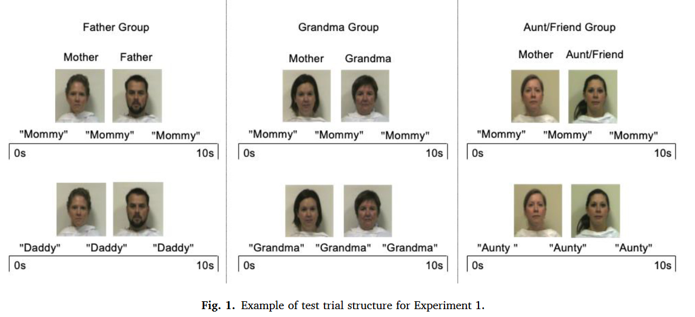

```{r setup, include = FALSE}
# check pacman
if (!requireNamespace("pacman", quietly = TRUE)) {
  install.packages("pacman") }  
install.packages("pacman", repos = "https://cloud.r-project.org/")
# load
pacman::p_load("dplyr", "tidyr", "ggplot2",  "papaja")

```

```{r analysis-preferences}
# Seed for random number generation
set.seed(42)
knitr::opts_chunk$set(cache.extra = knitr::rand_seed)
```

# 1	Experiment 1
Experiment 1 explored whether infants were able to understand any words with a personal scope, focusing on whether 6-month-old infants restricted their mother's correct name (e.g. 'mum') to the individual caregiver or extended it from the caregiver to another familiar person of a different gender or the same sex.

## 1.1 Objective of Experiment 1
6-month-old infants were assessed whether they would limit their address to their mother (e.g. 'mum') to her alone or whether they would extend it to another familiar person, i.e. their father, their grandmother or their maternal aunt/consanguineous female friend.

## 1.2 Data
The experiment was divided into three groups (fathers & grandmothers & aunts), each with a separate experimental and control group. 120 infants, with each subject assigned to any of the 6 groups.

## 1.3 Method
One-way experimental design (infants heard the name of their mother or another familiar person (father, grandmother or aunt)).
First, four 10-s long silent familiarization trials were presented to the infant. In each trial, the infant saw a video of a person on one side of the screen (left or right) two familiarization trials showing one adult (mother) and two showing another adult (father, grandmother, or aunt/friend). These trials were randomly arranged to familiarize the infant with the position of each person in the experiment. Next, infants performed four 10-s baseline trials in which a video of the same mother and another familiar adult as in the experimental trials was displayed on the screen and a "look" sound was played during the baseline trials, which was designed to obtain the infant's visual preference. This was followed by eight 10-s experimental trials in which the same video of the mother and familiar adult were presented, and the word "mom" or the name of another familiar adult was played once at the beginning, 4s, and 7s of each trial.



## 1.4 Study replication ideas and results.

### Mother and father groups in experiment 1
```{r load data1.1}
# Split the two sheets from the excel table in the original data into 2 csv files, see the data section for details.
df.ex1.FC <-  read.csv('./data/ex1_Father(control).csv', header = T, sep=",", stringsAsFactors = FALSE)
df.ex1.FE<-  read.csv('./data/ex1_Father(exp).csv', header = T, sep=",", stringsAsFactors = FALSE)
colnames(df.ex1.FE)[4] <- "Name.for.Other_Adult"
colnames(df.ex1.FC)[4] <- "Name.for.Other_Adult"
## Calculate the mean of the Father (exp) group
df.ex1.FE.mean <- colMeans(df.ex1.FE[1:20,3:4],na.rm = TRUE)
df.ex1.FE.sd<-apply(df.ex1.FE[1:20,3:4],2,sd,na.rm = TRUE)
##Calculate the average of the Father (control) group
df.ex1.FC.mean <- colMeans(df.ex1.FC[1:20,3:4],na.rm = TRUE)
df.ex1.FC.sd<-apply(df.ex1.FC[1:20,3:4],2,sd,na.rm = TRUE)
```

```{t test1.1}
## Load the package
install.packages("pacman") 
pacman::p_load("tidyverse", "bruceR","BayesFactor")
## One-sample t-test of the length of gaze of the mother's video in the experimental group against mean 0 (baseline)
result.ttest1 <- capture.output({
  bruceR::TTEST(data=df.ex1.FE,
                y="Name.for.Mother",
                test.value = 0, 
                test.sided = "=",
                file = "./data/FEM_t.doc"
  )
})
## Single-sample t-test of the duration of gaze of the father's video in the experimental group against mean 0 (baseline)
result.ttest1 <- capture.output({
  bruceR::TTEST(data=df.ex1.FE,
                y="Name.for.Other_Adult",
                test.value = 0, 
                test.sided = "=",
                file = "./data/FEF_t.doc"
  )
})
## One-sample t-test for length of gaze on mother's video vs. mean 0 (baseline) in control group
result.ttest1 <- capture.output({
  bruceR::TTEST(data=df.ex1.FC,
                y="Name.for.Mother",
                test.value = 0, 
                test.sided = "=",
                file = "./data/FCM_t.doc"
  )
})
## One-sample t-test for length of gaze on father's video vs. mean 0 (baseline) in control group
result.ttest1 <- capture.output({
  bruceR::TTEST(data=df.ex1.FC,
                y="Name.for.Other_Adult",
                test.value = 0, 
                test.sided = "=",
                file = "./data/FCF_t.doc"
  )
})

```


```{r load data1.2}
## Mother and grandmother groups in Experiment 1
## Split the two sheets in the excel table from the original data into 2 csv files, see data section for details
df.ex1.GE<-  read.csv('./data/Grandma Group (Exp).csv',
                      header = T, sep=",", stringsAsFactors = FALSE)
df.ex1.GC<-  read.csv('./data/Grandma Group (Control).csv',
                      header = T, sep=",", stringsAsFactors = FALSE)
df.ex1.GE<-df.ex1.GE[2:21,2:4]
df.ex1.GC<-df.ex1.GC[2:21,2:4]
colnames(df.ex1.GE)[3] <- "Name.for.Other_Adult"
colnames(df.ex1.GC)[3] <- "Name.for.Other_Adult"
## Calculate the mean of the Grandma (exp) group
df.ex1.GE$Name.for.Mother <- as.numeric(df.ex1.GE$Name.for.Mother)
df.ex1.GE$Name.for.Other_Adult<- as.numeric(df.ex1.GE$Name.for.Other_Adult)
df.ex1.GC$Name.for.Mother <- as.numeric(df.ex1.GC$Name.for.Mother)
df.ex1.GC$Name.for.Other_Adult <- as.numeric(df.ex1.GC$Name.for.Other_Adult)
df.ex1.GE.mean <- colMeans(df.ex1.GE[1:20,1:3],na.rm = TRUE)
df.ex1.GE.sd<-apply(df.ex1.GE[1:20,1:3],2,sd,na.rm = TRUE)
## Calculate the mean for the Grandma (control) group
df.ex1.GC.mean <- colMeans(df.ex1.GC[1:20,1:3],na.rm = TRUE)
df.ex1.GC.sd<-apply(df.ex1.GC[1:20,1:3],2,sd,na.rm = TRUE)
## Perform a one-sample t-test of the duration of the mother's video gaze in the experimental group against the mean 0 (baseline)
result.ttest1 <- capture.output({
  bruceR::TTEST(data=df.ex1.GE,
                y="Name.for.Mother",
                test.value = 0, 
                test.sided = "=",
                file = "./data/GEM_t.doc"
  )
})

```

### Mother and grandmother groups in Experiment 1
```{t test1.2}
## One-sample t-test of the duration of gaze for the Grandma video in the experimental group versus mean 0 (baseline)
result.ttest1 <- capture.output({
  bruceR::TTEST(data=df.ex1.GE,
                y="Name.for.Other_Adult",
                test.value = 0, 
                test.sided = "=",
                file = "./data/GEG_t.doc"
  )
})
## One-sample t-test for length of gaze vs. mean 0 (baseline) for the mother's video in the control group
result.ttest1 <- capture.output({
  bruceR::TTEST(data=df.ex1.GC,
                y="Name.for.Mother",
                test.value = 0, 
                test.sided = "=",
                file = "./data/GCM_t.doc"
  )
})
## One-sample t-test of gaze duration vs. mean 0 (baseline) for Grandma's video in control group
result.ttest1 <- capture.output({
  bruceR::TTEST(data=df.ex1.GC,
                y="Name.for.Other_Adult",
                test.value = 0, 
                test.sided = "=",
                file = "./data/GCG_t.doc"
  )
})

```

### Mother and aunt groups in Experiment 1
```{r load data1.3}
## Split the two sheets from the excel table in the original data into 2 csv files, see data section for details
df.ex1.AE<-  read.csv('./data/Exp1_AF.csv',
                      header = T, sep=",", stringsAsFactors = FALSE)
df.ex1.AC<-  read.csv('./data/Con1_AF.csv',
                      header = T, sep=",", stringsAsFactors = FALSE)
colnames(df.ex1.AE)[4] <- "Name.for.Mother"
colnames(df.ex1.AE)[5] <- "Name.for.Other_Adult"
colnames(df.ex1.AC)[4] <- "Name.for.Mother"
colnames(df.ex1.AC)[5] <- "Name.for.Other_Adult"
## Calculate the mean of the Aunt (exp) group
df.ex1.AE.mean <- colMeans(df.ex1.AE[1:20,3:5],na.rm = TRUE)
df.ex1.AE.sd<-apply(df.ex1.AE[1:20,3:5],2,sd,na.rm = TRUE)
## Calculate the mean of the Aunt (control) group
df.ex1.GC.mean <- colMeans(df.ex1.AC[1:20,3:5],na.rm = TRUE)
df.ex1.GC.sd<-apply(df.ex1.AC[1:20,3:5],2,sd,na.rm = TRUE)
```


```{t test1.3}
## Perform a one-sample t-test of the duration of the mother's video gaze in the experimental group against the mean 0 (baseline)
result.ttest1 <- capture.output({
  bruceR::TTEST(data=df.ex1.AE,
                y="Name.for.Mother",
                test.value = 0, 
                test.sided = "=",
                file = "./data/AEM_t.doc"
  )
})

## One-sample t-test of the length of gaze of Aunt's video in the experimental group versus mean 0 (baseline)
result.ttest1 <- capture.output({
  bruceR::TTEST(data=df.ex1.AE,
                y="Name.for.Other_Adult",
                test.value = 0, 
                test.sided = "=",
                file = "./data/AEA_t.doc"
  )
})
## One-sample t-test for length of gaze vs. mean 0 (baseline) for Mom's video in the control group
result.ttest1 <- capture.output({
  bruceR::TTEST(data=df.ex1.AC,
                y="Name.for.Mother",
                test.value = 0, 
                test.sided = "=",
                file = "./data/ACM_t.doc"
  )
})
## One-sample t-test of the length of gaze of the Aunta video in the control group against mean 0 (baseline)
result.ttest1 <- capture.output({
  bruceR::TTEST(data=df.ex1.AC,
                y="Name.for.Other_Adult",
                test.value = 0, 
                test.sided = "=",
                file = "./data/ACA_t.doc"
  )
})

```

```{r Plot the graph1}
library(ggplot2)
library(dplyr)
library(tidyr)
## Plot the graph
df.ex1.FE$group <- "Father Group"
df.ex1.FC$group<- "Father Group"
df.ex1.GE$group <- "Grandma Group"
df.ex1.GC$group <- "Grandma Group"
df.ex1.AE$group <- "Aunt/Friend Group"
df.ex1.AC$group <- "Aunt/Friend Group"
df_merged.exp<- bind_rows(select(df.ex1.FE, Name.for.Mother, Name.for.Other_Adult,group), 
                       select(df.ex1.GE, Name.for.Mother, Name.for.Other_Adult,group),
                       select(df.ex1.AE, Name.for.Mother,Name.for.Other_Adult,group))
df_merged.con<- bind_rows(select(df.ex1.FC,Name.for.Mother,Name.for.Other_Adult,group), 
                        select(df.ex1.GC, Name.for.Mother, Name.for.Other_Adult,group),
                        select(df.ex1.AC, Name.for.Mother,Name.for.Other_Adult,group))
c<-gather(df_merged.exp, "category", "score", -group)
d<-gather(df_merged.con, "category", "score", -group)
## Plot superimposed box plots and scatter plots using ggplot2
ggplot(c,aes(x=group,y=score,colour=category))+
  geom_point(position = position_jitter(width = 0.1))+
  geom_boxplot(alpha=0.5)+
  xlab("Category")+
  ylab("Baseline-Corrected Target Looking Scores")+
  ggtitle("exp1_Experiment Condition")+
  ylim(-0.8,0.8)+
  geom_hline(yintercept = 0,size=0.5)+
  theme(panel.background = element_blank(),panel.grid = element_blank(),axis.line.y = element_line(),
        axis.text.y = element_text(),axis.ticks.y = element_line())

## Plot control group
ggplot(d,aes(x=group,y=score,colour=category))+
  geom_point(position = position_jitter(width = 0.1))+
  geom_boxplot(alpha=0.5)+
  xlab("Category")+
  ylab("Baseline-Corrected Target Looking Scores")+
  ggtitle("exp1_Control Condition")+
  ylim(-0.8,0.8)+
  geom_hline(yintercept = 0,size=0.5)+
  theme(panel.background = element_blank(),panel.grid = element_blank(),axis.line.y = element_line(),
        axis.text.y = element_text(),axis.ticks.y = element_line())

```


## 1.5  Discussion of the results and conclusions

Experiment 1 provides the clearest evidence to date that young infants interpret references to their mothers (e.g., "mom") as labels with a personal scope, i.e., 6-month-old infants do not appear to extend references to their mothers from their mothers to someone of a different gender in the family (their father) or another familiar person of the same race and gender who is older than their mother (maternal grandmother) or to their someone of similar age to their mother (a maternal aunt or family friend). Second, we also found that 6-month-olds' tendency to understand their father's name (e.g., "dad") as a separate term, and, 6-month-olds' tendency to understand their grandmother's label (e.g., "grandmother") as a separate term, were associated with their number of previous weekly exposures to their grandmother. Finally, we found no evidence that infants interpreted their label for mother, father, grandmother, or aunt/friend as a personal range term for strangers.

# 2  Experiment 2

Experiment 2 examined whether infants understood both individual- and category-scope words by assessing the extensions of their mother's proper name (e.g. 'mother') and the common nouns 'hand' or 'ball' at the ages of 6 and 9 months.

## 2.1 Aim of Experiment 2
Experiment 2 assessed infants' understanding of the extension of their mother's unique name (e.g. 'mother') and the common nouns 'hand' or 'ball' by assessing infants' understanding of both individual scope and a word with categorical scope at 6 and 9 months of age. test whether the infants understood both individual scope and a word with categorical scope.

## 2.2 Data
The experiment was divided into two groups (Hand Group & Ball Group), with each subject comprising four randomly ordered trials and two baseline trials, resulting in six columns of data per group.

## 2.3 Methods:
2 (hand group, ball group) x 2 (cross-category trial, within-category trial) mixed design
Participants: hand group: 20 infants aged 6 months; ball group: 20 infants aged 9 months .
The methodology for Experiment 2 was similar to that of Experiment 1:
It involved two baseline and test trials:
Each baseline trial was repeated three times: the infants looked at two photographs on the screen side by side when they heard the words "look" or "see".
Cross-category trials: where the target's photograph (the baby's mother; or the baby's own hand or ball) is next to an unfamiliar photograph of a different category.
Within-category trials: where the target is next to a photograph of an unfamiliar member of the same category.
Data calculation method: If the babies interpreted any one person's name as a term in a separate category, they looked at that person more in the test trial when they heard that person's name than they did in the baseline trial. To quantify the change between baseline and test experiments, we calculated each infant's baseline pair-adjusted score, one for mother's name and the other for father, grandmother, or aunt/friend's name. We computed these scores by subtracting the mean proportion of total looking to the named person (the target) during baseline trials (i.e., [Look to target] / [Look to target + Look to distractor]) from the mean proportion of total looking to the target during test trials (i.e., [Look to target] / [Look to target + Look to distractor]). A positive score indicated an increase in looking to the target on test trials compared to baseline trials.


## 2.4 Study replication ideas and results:

```{r load data2}
# Import data
# Split the two sheets in the excel table from the original data into 2 csv files, see the data section for details.
df.ex2.hand <-  read.csv('./data/ex2_hand.csv',
                        header = T, sep=",", stringsAsFactors = FALSE)
df.ex2.ball<-  read.csv('./data/ex2_ball.csv',
                        header = T, sep=",", stringsAsFactors = FALSE)
# Calculate hand group mean and variance
a<-c(2,3,4,5,6,7,8)
df.ex2.hand.mean <- colMeans(df.ex2.hand [,a],na.rm = TRUE)
df.ex2.hand.sd<-apply(df.ex2.hand [,a],2,sd,na.rm = TRUE)
```

```{t test2}
# One-sample t-test for HAND group in the order in which they are presented in the study Load the bruceR package first, then perform a one-sample t-test on the 4 columns of baseline data in the study.
library(bruceR)
t.test(df.ex2.hand$Mother_Within_Baseline,mu=0,alternative  ="two.sided",conf.level=0.95)
t.test(df.ex2.hand$Mother_Across_Baseline,mu=0,alternative  ="two.sided",conf.level=0.95)
t.test(df.ex2.hand$Hand_Within_Baseline,mu=0,alternative  ="two.sided",conf.level=0.95)
t.test(df.ex2.hand$Hand_Across_Baseline,mu=0,alternative  ="two.sided",conf.level=0.95)

# Calculate ball group mean
df.ex2.ball.mean <- colMeans(df.ex2.ball [,a],na.rm = TRUE)
df.ex2.ball.mean <- colMeans(df.ex2.ball [,a],na.rm = TRUE)
df.ex2.ball.sd<-apply(df.ex2.ball [,a],2,sd,na.rm = TRUE)

# The ball group single sample t test was performed in the order in the study
t.test(df.ex2.ball$Mother_Within_Baseline,mu=0,alternative  = "two.sided",conf.level=0.95)
t.test(df.ex2.ball$Mother_Across_Baseline,mu=0,alternative  = "two.sided",conf.level=0.95) 
t.test(df.ex2.ball$Ball_Within_Baseline,mu=0,alternative  = "two.sided",conf.level=0.95)
t.test(df.ex2.ball$Ball_Across_Baseline,mu=0,alternative  = "two.sided",conf.level=0.95)
 
# One-sample t-test to calculate the difference between baseline and stranger for mothers in the HAND group
t.test(df.ex2.hand$Mother_Within_Unfamiliar,mu=0.5,alternative  = "two.sided",conf.level=0.95)
 
# One-sample t-test to calculate the difference between familiar hand baseline and unfamiliar hand in the HAND group
t.test(df.ex2.hand$Hand_Within_Unfamiliar,mu=0.5,alternative  = "two.sided",conf.level=0.95)
 
# One-sample t-test to calculate the difference between baseline and stranger for mothers in the ball group
t.test(df.ex2.ball$Mother_Within_Unfamiliar,mu=0.5,alternative  = "two.sided",conf.level=0.95)
 
# One-sample t-test to calculate the difference between baseline and unfamiliar balls in the ball group familiarity
t.test(df.ex2.ball$Ball_Within_Unfamiliar,mu=0.5,alternative  = "two.sided",conf.level=0.95)

```

```{r Plot the graph2}
# drawing-hand
library(dplyr)

# Filter out the required variables
df.ex2.hand2<-dplyr::select(df.ex2.hand,Hand_Within_Baseline,Hand_Across_Baseline,Mother_Within_Baseline,Mother_Across_Baseline)

library(tidyverse)
# Combine variables into one column and add type variables
df.ex2.hand3<-df.ex2.hand2%>%
  gather(category,vale)

# drawing-ball
df.ex2.ball2<-dplyr::select(df.ex2.ball,Ball_Within_Baseline,Ball_Across_Baseline,Mother_Within_Baseline,Mother_Across_Baseline)
# Filter out the required variables
df.ex2.ball2<-dplyr::select(df.ex2.ball,Ball_Within_Baseline,Ball_Across_Baseline,Mother_Within_Baseline,Mother_Across_Baseline)
# Combine variables into one column and add type variables
df.ex2.ball3<-df.ex2.ball2%>%
  gather(category,vale)

library(ggplot2)
# drawing graphs with ggplot2 superimposed box plots and scatter plots
ggplot(df.ex2.hand3,aes(x=category,y=vale,colour=category))+
  geom_point(position = position_jitter(width = 0.2))+
  geom_boxplot(alpha=0.5)+
  xlab("category")+
  ylab("Baseline-Corrected Target Looking Score")+
  ggtitle("Hand group")+
  ylim(-0.8,0.8)+
  geom_hline(yintercept = 0,size=0.5)+
  theme(panel.background = element_blank(),panel.grid = element_blank(),axis.line.y = element_line(),
        axis.text.y = element_text(),axis.ticks.y = element_line())

# drawing graphs with ggplot2 superimposed box plots and scatter plots
ggplot(df.ex2.ball3,aes(x=category,y=vale,colour=category))+
  geom_point(position = position_jitter(width = 0.2))+
  geom_boxplot(alpha=0.5)+
  xlab("category")+
  ylab("Baseline-Corrected Target Looking Score")+
  ggtitle("Ball group")+
  ylim(-0.8,0.8)+
  geom_hline(yintercept = 0,size=0.5)+
  theme(panel.background = element_blank(),panel.grid = element_blank(),axis.line.y = element_line(),
        axis.text.y = element_text(),axis.ticks.y = element_line())
```

## 2.5 discussion of the results and conclusions

When presented with an unfamiliar woman of the same race, the infant also appeared to limit the mother's name to her, which is consistent with the personal scope interpretation of the label.
6-month-olds appeared to understand the common noun 'hand' as encompassing both their own hand and an unfamiliar hand), which is consistent with the category interpretation of the term.
9-month-olds seem to understand the common noun 'ball' as meaning across the ball (both their own ball and an unfamiliar ball), which implies that the category interpretation of the word is understood.
That is,The tendency of infants to restrict their mother's name to the mother in both groups reflects their interpretation of names as having a body-wide term, while the tendency of infants to extend the words 'hand' (or 'ball') over two hands or two balls reflects their interpretation of Common nouns are interpreted in terms of scope terms. This indicates that 6- and 9-month-old infants can understand both a word restricted to a single object (e.g., their mother's name) and a word that is a member of a cross-object category (e.g., the common nouns 'hand' or 'ball'). 6 months represents the youngest age at which infants The results of this study suggest that infants' initial understanding of object words includes both personal- and category-wide terms, and although we do not provide evidence that this is equivalent to adult understanding of personal- and category-wide terms, it suggests the possibility that infants' early vocabulary includes both personal- and category-wide terms.

# 3	Experiment 3

Experiment 3 went further than this and explored whether infants could understand both individual range words and category range words for the same object.

## 3.1 Introduction
* Aim of the study: Experiment 3 explored whether infants understood two categories of different object words for the same object, in light of studies that reported that infants may know both proper and common nouns at the age of 12 - 15 months.
* Data: The experiment was divided into two types of objects, similar (dog-dog) and cross-category (dog-cat), and each category of objects was divided into proper and common nouns, so that there were four sets of data in total, and the scores were tallied as the value obtained by subtracting the proportion of time spent looking at the target object from the proportion of time spent looking at the target at baseline.

## 3.2 Method
Within-subject design for categories (similar, different) × (proper nouns, common nouns)
* Subjects: 48 infants aged 12 - 15 months
* Experimental material: video using photos of the infants' family dog, other dogs or cats
* Experimental procedure: The experiment was divided into three blocks, a silent block (7s), a proper noun block, and a common noun block. the first 7s of the experiment, a silent video clip, was designed to familiarise the infants with the location of the animals in the pictures; the second block was a proper noun or a common noun, and each block had four trials, two in the same category and two different category tests. The duration of each trial was 13 s, consisting of 3 s of silent and 10 s of audio clips, with the gaze duration of the 3 s silent clip being used as baseline data.

## 3.3 Research idea replication and results:
```{r load data3}
# Import Excel data and replace second and third column headings
Exp3.yuanshi <- read.csv('./data/ex3.csv',
                        header = T, sep=",", stringsAsFactors = FALSE)
colnames(Exp3.yuanshi)[2] <- "Group"
colnames(Exp3.yuanshi)[3] <- "Age"

# Calculate the mean and standard deviation of the age of the subjects in each of the two conditions
library(dplyr)
Exp3.yuanshi %>% 
  group_by(Group) %>% 
  summarize(
    mean_age = mean(Age), 
    sd_age = sd(Age)
  )

# Calculate the mean and standard deviation of the scores for each condition
library(dplyr)
result <- Exp3.yuanshi %>% 
  select(4:7) %>% 
  summarise(across(everything(), list(mean = mean, sd = sd)))

```

```{t test3}
# Perform a one-sample t-test for each of the four conditions in turn, comparing all values to 0. Save the results to a doc file and an md file

# Load package first
library(bruceR)

# Perform t-test
 result.ttest_P_across <- capture.output({
  bruceR::TTEST(data=Exp3.yuanshi, 
                y="P_across", 
                test.value = 0, 
                test.sided = "=",
                file = "./Exp3_output/P_across_inde_t.doc"
                )
})
writeLines(result.ttest, "./Exp3_output/P_across_inde_t.md")

result.ttest_P_in <- capture.output({
  bruceR::TTEST(data=Exp3.yuanshi, 
                y="P_in", 
                test.value = 0, 
                test.sided = "=",
                file = "./Exp3_output/P_in_inde_t.doc"
                )
})
writeLines(result.ttest, "./Exp3_output/P_in_inde_t.md")

result.ttest_C_across <- capture.output({
  bruceR::TTEST(data=Exp3.yuanshi, 
                y="C_across", 
                test.value = 0, 
                test.sided = "=",
                file = "./Exp3_output/C_across_inde_t.doc"
                )
})
writeLines(result.ttest, "./Exp3_output/C_across_inde_t.md")

result.ttest_C_in <- capture.output({
  bruceR::TTEST(data=Exp3.yuanshi, 
                y="C_in", 
                test.value = 0, 
                test.sided = "=",
                file = "./Exp3_output/C_in_inde_t.doc"
                )
})
writeLines(result.ttest, "./Exp3_output/C_in_inde_t.md")
```

```{r Plot the graph3}
library(ggplot2)
library(dplyr)
# Filter out the required variables
Exp3.huatu1<-dplyr::select(Exp3.yuanshi,C_in,C_across,P_in,P_across)
# Combine scores into one column
Exp3.huatu2<-Exp3.huatu1%>%
  gather(category,score)
# Draw a plot with ggplot2 overlaying box plots and scatter plots
ggplot(Exp3.huatu2,aes(x=category,y=score,colour=category))+
  geom_point(position = position_jitter(width = 0.1))+
  geom_boxplot(alpha=0.5)+
  xlab("Category")+
  ylab("Baseline-Corrected Target Looking Scores")+
  ggtitle("Exp3")+
  ylim(-0.8,0.8)+
  geom_hline(yintercept = 0,size=0.5)+
  theme(panel.background = element_blank(),panel.grid = element_blank(),axis.line.y = element_line(),
        axis.text.y = element_text(),axis.ticks.y = element_line())
```

## 3.4 Discussion of the results and conclusion
Experiment 3 provides evidence that infants understand two labels with differing extensions for the same object (their family pet) – both a word that is restricted to an individual object (a proper name in the adult language) and a word that extends across members of a category (a common noun in the adult language).

# 4 General discussion

In these experiments, we observed a consistent pattern of results, albeit with different methods, enabling them to be sensitive to the task demands of infant competence.
The findings of this paper suggest that it is possible that there are two types of vocabulary in the vocabulary of six-month-old infants, due to the fact that vocabulary learning takes place during the first six months of life and that infants first acquire a personal vocabulary or category of vocabulary before acquiring another type of vocabulary. This possibility becomes reasonable if there is evidence that infants understand either type of vocabulary by six months of age. However, if vocabulary learning does not begin until six months of age, then the evidence for both individual and category words in infants' lexicons at this age suggests that they learn both types of labels from the very beginning of their vocabulary development - inconsistent with the narrow-to-broad and broad-to-narrow accounts, but consistent with the narrow-to-broad account, according to which neither type of vocabulary has an advantage in acquisition.
If neither of these two vocabulary types is privileged in the acquisition process, how do infants learn individual and categorical ranges of object vocabulary? One possibility is that this learning occurs simply through the infant's ability to track and analyse the co-occurrence of labels and objects in different contexts. For example, infants may hear caregivers restrict a word such as 'mum' (or 'dad') to one person in a variety of situations and not extend it to others; conversely, they may hear caregivers extend a word such as 'hand' (or 'ball') to multiple hands (or balls). Another possibility (not mutually exclusive with the first) is that infants' early learning of individual- and categorical-scope words is not driven solely by their cross-situational tracking and analysis of word-object pairings. Rather, it may be aided by certain intuitive biases that conceptualize objects in certain semantic categories as individuals (e.g., people, dolls, anthropomorphic animals) and objects in other categories as members of categories that are interchangeable with any other category (e.g., body parts, food, artifacts).
To be sure, the observed semantic distinction between early individual-scope and categorical-scope words may be the product of learning rather than a reflection of the operation of intuitive biases guiding the learning. But recent work from the study of early cognitive development offers a reason to suspect that intuitive biases drive the learning. This research suggests that infants are endowed with certain systems of core cognition, including an intuitive psychology centred on the notion of an agent and an intuitive physics centred on the notion of an object . If these core cognition systems dispose infants to conceptualize agents (e.g., people) as individuals but to construe non-agents (e.g., body parts, foods, artifacts) as interchangeable category members, then they may furnish the basis for the proposed intuitive biases that lead to the observed semantic class distinctions in infants’ individual-scope and category-scope words. Further experimentation focused on young infants’ interpretations of novel words for novel objects from different semantic domains (e.g., people, artifacts) would be helpful to clarify whether such intuitive biases play a role in how infants determine the scope of their first object words.

# 5 Conclusion

This work advances our understanding of language development by offering the first experimental evidence that young infants have knowledge of object words of two different types – those with individual scope and those with categorical scope. Contrary to many prior accounts, the findings suggest that neither type represents a privileged starting point in lexical development. Infants’ initial lexicons may instead be semantically more complex than previously believed. Understanding the genesis of this early lexical-semantic complexity and determining its impact on subsequent word learning represent important challenges facing efforts to elucidate how children acquire their native language.


