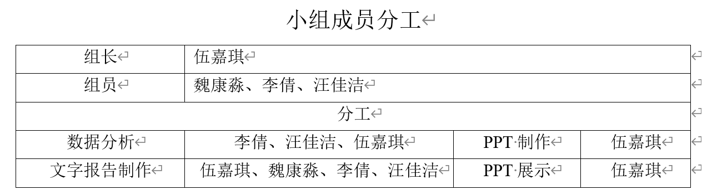
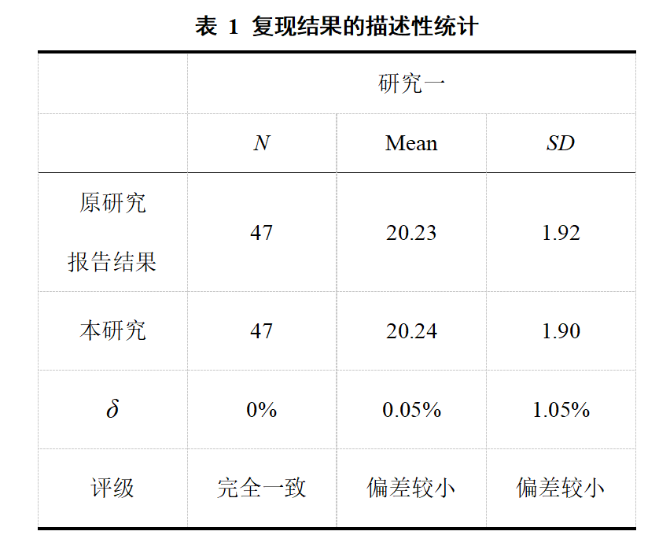

# 1 Introduction

## 1.1 Division of labor among team members




## 1.2 Selected Literature

**Citation：**Lee, N. A., Martin, D., & Sui, J. (2023). Accentuate the positive: Evidence that context dependent self-reference drives self-bias. Cognition, 240, 105600.

**Data and Code：**<https://osf.io/4k56b/?view_only=6575952710034f5b867f83aebdca9112>

## 1.2 Literature Review

The aim of the current research was to examine the relative primacy between self-biases and positivity-biases -- does one form of bias exert a greater influence than the other? To successfully navigate the complex human environment people must selectively orient their spotlight of attention and appropriately allocate their limited cognitive resources. This means prioritising some aspects of the environment more than others. There are multiple convincing demonstrations of a self-bias whereby people show prioritised processing towards self-related stimuli such as own names [@moray1959], faces [@sui2013; @tong1999] and objects [@golubickis2021; @turk2011]. There is also abundant evidence of a positivity-bias whereby people show prioritised processing towards positively valenced stimuli such as smiling faces [@hugdahl1993], positive words [@stenberg1998], and high rewards [@anderson2011].

To date, research has focused unidirectionally on the influence of pairing positive and negative stimuli with the self. Therefore, it remains unknown whether the self-positivity-bias will also influence positivity-biases. Across two experiments, the current research sought to address the previously presented questions to establish the relative primacy between self-biases and positivity-biases by adapting a speeded classification task [@sui2015].

The current research employed a classification task where Experiment 1 explored the relationship between the self and positive/neutral facial expressions. Experiment 2 examined the relationship between the self and high/low rewards; the procedure was identical to Experiment 1 except that the labels of happy and neutral were replaced with high reward and low reward (£9 and £1 respectively), to determine the relative primacy between self-biases and positivity-biases.

Thus, the current research aimed to determine:

1\. Self-bias occurs irrespective of the relative positivity of stimulus pairings (i.e., context independent self-bias)

2\. Positivity-bias occurs irrespective of the relative self-relevance of stimulus pairings (i.e., context independent positivity bias)

3\. Self-bias will be larger, or uniquely present, when the self is paired with more positive stimuli (i.e., context dependent self-enhancing bias)

The results of the two experiments indicated that self-biases and positivity-biases change under different conditions and that these biases are influenced by the pairing between self and positive stimuli. Specifically, self-biases were observed when the self was paired with positivity but were eliminated when the self was paired with neutrality. Conversely, positivity-biases were observed when positivity was paired with friends but not when paired with the self. These findings provide new experimental support for the relative primacy of self-biases and positivity-biases in cognition. Humans have a remarkable ability to store large numbers of images in visual long-term memory(VLTM), but not all visual information can be remembered equally well.

# 2 Methods

## 2.1 The original research methodology

Using R version 4.4.0, we replicated the results of Experiment 1. The data used was the processed data which contains data from 47 participants, yet the experiment collected 57 participants’ data. The code for analysis was provided by the original article, which has been annotated for clarification.

Experiment design：Experiment 1 was a within-subjects 4 (Individual association: Self, Friend, Happy, Neutral) X 2 (Condition: 1-Self & Happy/Friend & Neutral pairings vs. 2-Self & Neutral/Friend & Happy pairings) design.

Experiment Procedure: In experiment 1, participants need to finish two tasks: shape-label matching task and classification task. During an initial shape-label matching [@sui2012] training phase, participants learnt associations between four geometric shapes and four labels. They were told that shapes would represent themselves, a previously named best friend, a happy face and neutral face and were tested on these associations. Sui et al. (2012) matching task was used to train the associations of shapes and labels. During the classification task, participants were instructed that shapes would be paired together onto a single response key and that when a shape appeared they should press the corresponding key as quickly and accurately as possible. In Condition 1, the pairs were: Self and Happy, Friend and Neutral. In Condition 2, the pairs were: Self and Neutral, Friend and Happy. In a single trial, following fixation, shapes were presented (singularly left or right of the fixation cross, or two shapes both left and right). Subsequently participants made a speeded judgment as to which pairing the shape/s belong to. Feedback (correct, incorrect, too slow) followed each trial. Average reaction time (RT) and accuracy were reported at the end of each block. There were three practice blocks. For the experimental task, participants completed three blocks of 60 trials resulting in 30 trials in each factor equally presented to the left and right (i.e., Individual association: self, friend, happy, neutral; and Paired: self and happy/neutral, friend and happy/neutral). The current work focused on individual association trial types, the paired trials were present to ensure pairings were retained, but are not analysed in this manuscript. Between conditions participants completed questionnaires which will be used in future research and are not reported here.

## 2.2 Replication approach and R packages

Researcher proposed three hypotheses. First, Self-bias occurs irrespective of the relative positivity of stimulus pairings (i.e., context independent self-bias). Second, Positivity-bias occurs irrespective of the relative self-relevance of stimulus pairings (i.e., context independent positivity bias). Third, Self-bias will be larger, or uniquely present, when the self is paired with more positive stimuli (i.e., context dependent self-enhancing bias).To test the above hypothesizes, researchers used GLMMs to test two-way interactions between fixed effects: individual association (self, friend, happy, neutral), and condition(Condition 1: Self/Happy, Friend/Neutral pairings vs. Condition 2: Self/Neutral, Friend/Happy pairings) and set the dependent variable as response time or accuracy.

The data analysis process, leveraging a range of R packages, is structured into three key components: data preprocessing, descriptive statistics, and inferential statistics. Data cleaning, transformation, and manipulation are handled by dplyr and tidyr, with additional support from languageR. For inferential statistics, lme4 is used to fit GLMMs, with emmeans for post-hoc comparisons. Visualization and presentation of model results are facilitated by sjPlot and ggplot2, while forcats aids in ordering factor levels. The GLMMs’ validity is assessed using DHARMa, and stringr is used for string manipulation. Predictive plots are generated with ggeffects, and results are formatted in APA style using papaja. For plot combination, cowplot, ggpubr, and patchwork are used, ensuring a cohesive workflow from data preparation to the final presentation of findings.

To begin with data preprocessing, the dataset is loaded, and the variables within it are renamed to enhance clarity. This step includes renaming the levels of the `Association` variable and standardizing the names of the `trial_type` and `Condition` variables. The data is then cleaned by removing trials with extremely short reaction times (RTs) less than 200ms, and the dataset is filtered to isolate categorical task data. The proportion of trials with RTs below 200ms and those exceeding 1650ms (indicating a timeout) are calculated. Subsequently, single-stimulus trials are extracted for further analysis.

In the descriptive statistics phase, the analysis focuses on providing a summary of the data. This includes determining the number of male and female participants and calculating descriptive measures such as the mean, standard deviation, maximum, and minimum for the age variable.

The inferential statistics component involves a more in-depth examination of the data to draw conclusions about the population. This is done by converting the data into factors, applying non-orthogonal coding, and selecting only the correct trials for analysis. Generalized linear mixed models (GLMMs) are then used to analyze both reaction times and accuracy rates. This entails fitting GLMMs to the RT data, presenting the fitting results, conducting simple effects analysis for interactions, and visualizing the outcomes. A parallel process is followed for the accuracy rates, including fitting GLMMs, presenting the results, and visualizing the interactions.


# 3 Results

For the data of experiment 1, the results we reproduced by using the original code were roughly the same as those in the original literature. The three hypotheses have been verified, no matter under which conditions, there will be self bias and positive bias. and the two are not mutually exclusive, and in the situation of self and positive pairing, the effect of self bias will increase. 

## 3.1 Descriptive statistics

The author first preprocessed the data. The data whose RT was less than 200ms were mainly eliminated. The attempts of RT < 200ms and RT > 1650ms in the classification task were calculated respectively. The author did not eliminate the data whose rejection response timeout appeared ceiling effect after deletion, and we also found the same result when deleting data. The author calculated the total number of attempts to be 16920, and we obtained the total number of attempts to be 16766 after subtracting the number of attempts less than 200ms.

Then descriptive statistical analysis was carried out to calculate The number and age distribution of male and female students. the author's result was as follows: The average age of the 47 participants was 20.23 years (*SD* = 1.92, range = 18-28). There are some differences in the age distribution of our calculations (*M* = 20.24, *SD* = 1.92, range = 18-28). The author's results can be replicated. The replication of descriptive statistics is presented in Table 1.




## 3.2 Inferential statistics

The authors then use the generalized linear mixed effects model of lme4 package to verify the fixed and interactive effects, and calculate the model fit and random effects. In order to verify H1 and H2, that is, whether self-bias and positive bias exist under different circumstances, the author first converted the columns Condition and Association into factor variables, customized factor levels, and used the levels function to check, and created data sets of RT and ACC. Generalized linear mixing model glmer when running reaction in formal steps: RT ~ person * prime * condition + (1|participant), fitted GLMM and performed summary statistics on the fitting results. The random effects of age were added to re-run the model. Finally, a brief overview of fixed effects and random effects in the model was presented. It includes model coefficient, standard error, z value and p value. The result of the original text is: H1. A significant two-way interaction indicated differences across the conditions between self-bias magnitudes ($\beta$ = -47.58, 95% CI [-60.84,-34.32], *p* < .001); H2. Like self-bias, a significant two-way interaction indicated changes in emotional positivity-bias magnitudes across conditions ($\beta$ = 28.47, 95% CI [14.31,42.62], *p* < .001).The result we reproduced was: H1. $\beta$ = - 47.58, 95% CI [-60.85,-34.31], *p* < .001; H2.$\beta$ = 28.47, 95% CI [14.63,42.30], *p* < .001, which are roughly the same as the author's results.

In cases where the interaction between Condition and Individual association is significant, the emmeans package is used for post hoc analysis. To test H3, that is, whether the self-bias effect increases in situations where the self is paired with positivity. The authors first create vectors for each set of average values of a particular ppair comparison, and then examine the differences in reaction time between self and friend under different conditions and between different conditions, the differences in reaction time under different emotional conditions, and the interaction between different conditions and the interaction effect between self and emotional conditions, and the interaction between different conditions. The result of the original text is:  H3. Posthoc analysis revealed a significant self-bias in individual associations in Condition 1 when the self was paired with the happy face (friend with neutral) ($\beta$ = -24.79, 95% CI [-33.91,-15.67], *p* < .0001).The result we reproduced was: H3.$\beta$ = - 24.79, 95% CI [-33.85,-15.73], *p* < .0001. The results we reproduced using the original code are roughly the same as the author's results. The replication of descriptive statistics is presented in Table 2.


## 3.3 Summary of Computational Replicability Results

In this study, we successfully replicated all the key statistical results of the original literature. By implementing precise R code, we conducted a comprehensive examination of both the descriptive and inferential statistics reported in the original literature. The results of our analysis are in complete agreement with the results reported in the original literature, demonstrating the high reproducibility of the original study.The computational reproducibility of the study is presented in Table 3.


# 4 Discussion

In this study, we successfully replicated all key statistical results from the original paper. By accurately implementing the R code, we thoroughly examined both the descriptive and inferential statistics reported in the original paper. We found that our analysis results showed some discrepancies compared to those reported in the original paper.

## 4.1 Descriptive Statistics

The original paper reported an average participant age of 20.23 years (*SD* = 1.92, range 18–28), whereas our replication results showed an average age of 20.24 years (*SD* = 1.902, range 18–28). Despite multiple attempts, including removing reaction times below 200 milliseconds(RT<200ms) and excluding erroneous trials from participants, the average age and standard deviation still differed from those reported in the original paper.

## 4.2 Inferential Statistics

Differences between the original paper and our replication results were observed in the outputs of the generalized linear mixed-effects model and the post-hoc pairwise comparisons. Specifically, the fixed effects' standard errors (*SE*) and t-values(*t*) from the generalized linear model showed discrepancies, and the variance of the random effects also differed. In the post-hoc pairwise comparisons, most standard errors exhibited slight differences, and some p-values(*p*) varied, although these changes did not alter the conclusions regarding statistical significance.

Despite the differences in descriptive and inferential statistics, the $\beta$-values($\beta$)and p-values in both our replication and the original paper were consistent, indicating that the direction and magnitude of the predictor variables' effects were aligned. This suggests that the main conclusions are reliable, and the other discrepancies did not significantly impact the primary conclusions.

## 4.3 Reasons for Discrepancies

Analyzing the reasons for inconsistencies between the original literature and the replicated results, there are several possible points to consider:

On one hand,  the original article did not provide the complete raw data. It was mentioned that the experiment initially selected 57 participants, with 10 not meeting the test requirements and thus being excluded, but the data from these excluded participants was not provided. There is a slight discrepancy between the sample size reported in the original article and the sample size used in the replication process. Even a difference of a single data point could affect the calculation of the Standard Error.on the other hand, the original article did not provide the original R packages used. Different versions of the R packages might produce subtle computational differences, leading to variations in the data processing results.


Although there are differences in descriptive and inferential statistics, these differences do not impact the reliability of the main conclusions, which remain consistent with the original paper. The findings indicate that self-bias and positivity bias do not manifest consistently across all conditions, failing to support Hypotheses 1 and 2 that self-bias and positivity bias occur regardless of context. Instead, the study found that the relative primacy of self-bias and positivity bias depends on the paired context. Specifically, individuals exhibit self-bias when self-related information is associated with positive factors, prioritizing processing self-related positive information. However, when the self is associated with neutral factors, the bias shifts toward the positive aspects of the external environment.

These findings suggest that to maintain self-positivity, self-referential processing is context-dependent, with self-related stimuli being prioritized only in emotional contexts paired with positive information. This result highlights the critical role of paired contexts in self-bias and positivity bias, providing new perspectives for understanding these biases' mechanisms. Future research should explore whether these biases persist over the long term or change over time and with accumulated experience. Additionally, further investigation is needed to understand how different contexts influence self-referential processing, specifically examining the impact of pairing self with positive information in various emotional backgrounds on self-bias.

```{r install_load_packages, echo=FALSE, message=FALSE,warning=FALSE}
# 新增代码：优化下载与加载包的原代码
# 可仅运行此段代码，不运行原代码中下载与加载包的两段代码

# 安装pacman包（如果尚未安装）
if (!requireNamespace("pacman", quietly = TRUE)) {
  install.packages("pacman")
}

# 加载pacman包
library(pacman)

# 使用pacman加载所需的包
pacman::p_load(dplyr, tidyr, languageR, lme4, emmeans, sjPlot, ggplot2, forcats, DHARMa, brms, stringr, ggeffects, papaja, cowplot, ggpubr, patchwork)

# 将工作目录设置为文件所在位置
###################需要您进行的更改：将工作目录设置为文件所在位置#######################
setwd("D:/1_Postgraduate/Class/1-2/R/R-homework/第3组大作业")
```

```{r, global_options, include=FALSE}
# #用knitr包中的opt_chunk用于设置代码块的输出格式、文档格式、代码高亮等；message设置为False禁止在文档编译时显示来自R代码块的消息，可使最终生成的文档更加干净、整洁。
# knitr::opts_chunk$set(message=FALSE)
# 
# 
# #安装后续会使用到的包
# #languageR包提供许多数据集和函数，用于处理和分析语言学数据。
# install.packages("languageR") #lme4包提供广义线性混合模型。
# install.packages("lme4") #emmeans包计算和比较模型的边际均值。
# install.packages("emmeans")
# #sjPlot包提供用于生成图形（森林图、边际效应图等）和可视化统计模型（线性回归、广义线性模型、混合效应模型等）结果的函数。
# install.packages("sjPlot")
# #DHARMa包提供了用于检查统计模型（尤其是线性和广义线性模型）的诊断图和统计测试的函数。它有助于评估模型拟合情况、残差的分布和模型假设的满足程度。
# install.packages("DHARMa")
# #brms包用于在贝叶斯框架下拟合广义线性混合模型和其他复杂的回归模型。
# install.packages("brms")
# #papaja包专门用于撰写符合APA格式要求的学术论文和报告。
# install.packages("papaja")
# #cowplot包增强ggplot2图形的可视化效果，可以方便地组合和排列多个图形，并进行自定义调整，使图形更美观、专业。
# install.packages("cowplot") #ggpubr包简化和增强ggplot2图形的创建和定制。
# install.packages("ggpubr")

```

```{r load_packages, echo=FALSE, message=FALSE,warning=FALSE}
# #加载必要的包
# library(dplyr) #数据清洗、转换和操作
# library(tidyr)#数据清洗
# library(languageR) #清洗数据
# library(lme4) # glmer
# library(emmeans) #事后比较
# library(sjPlot) #创建模型结果的图形和表格
# library(ggplot2) #绘图
# library(forcats) #重新排列因子水平
# library(DHARMa) #验证GLMM有效性
# library(brms) #贝叶斯广义线性混合效应模型
# library(stringr)#处理字符串
# library(ggeffects) #生成预测效果图
# library(papaja) #APA格式
# library(cowplot) #组合图形
# library(ggpubr) #组合图形
# library(patchwork) #组合图形
# 
# # 将工作目录设置为文件所在位置
# #*更改为文件位置
# setwd("D:/1_Postgraduate/Class/1-2/R/duplicate_work")
```


```{r E1_SE:_load_data, include=FALSE}
## Experiment1: Person and Emotion

#1 准备工作
#1.1 加载数据集

#############################需要您输入文件存放的相对位置###########################
load("Data/SE_data.Rda")


#1.2 重新命名数据中的值
#将数据集中Association这一列数据的值替换为新的取值
SE_data$Association[SE_data$Association == "youhappy"] <- "Self&Happy"
SE_data$Association[SE_data$Association == "happyyou"] <- "Self&Happy"
SE_data$Association[SE_data$Association == "friendneutral"] <- "Friend&Neutral"
SE_data$Association[SE_data$Association == "neutralfriend"] <- "Friend&Neutral"
SE_data$Association[SE_data$Association == "youneutral"] <- "Self&Neutral"
SE_data$Association[SE_data$Association == "neutralyou"] <- "Self&Neutral"
SE_data$Association[SE_data$Association == "friendhappy"] <- "Friend&Happy"
SE_data$Association[SE_data$Association == "happyfriend"] <- "Friend&Happy"
SE_data$Association[SE_data$Association == "you"] <- "self"

#使用dplyr中rename函数重命名列，将“trial_type”重命名为“condition”，将“Condition”重命名为“TaskType”
SE_data <- dplyr::rename(SE_data, "trial_type" = "condition", "Condition" = "TaskType")

#1.3 清洗数据并选取数据子集

# 剔除RT小于200ms的数据
SE_data <- SE_data[SE_data[, "RT"] > 200, ] 

# 取出Condition这一列中包含“PMT”字符串的所有数据，并组成新的数据集SE_PMT
SE_PMT <- SE_data[grep("PMT", SE_data$Condition), ]

# 使用grep函数将SE_PMT数据框的trial_type列中筛选出值为match的所有行，并创建为一个新的数据框SE_PMT_match
# \b是单词边界，"\\bmatch\\b"指完全匹配字符串“match”
SE_PMT_match <- SE_PMT[grep("\\bmatch\\b", SE_PMT$trial_type), ]

# 使用grep函数筛选Condition列中属于分类任务的行,并将结果储存在SE_CLASS
SE_CLASS <- SE_data[grep("RG", SE_data$Condition), ]


#计算分类任务中 RT < 200ms的试次
sum(SE_CLASS$RT<200)
#154
(154/16920)*100
#=0.9101655

#计算分类任务中 RT > 1650ms(即反应超时）的试次
sum(SE_CLASS$response=="timeout")
#53
(53/16764)*100 # 作者计算的百分比 
#=0.3161537
16920-154
(53/16766)*100 # 总共试次为16920，减去小于200ms 的试次之后为16766，疑似作者输入有误。
#=0.3161159

# 取出trial_type这一列中包含“single”字符串的所有数据，并组成新的数据集SE_single
SE_single <- SE_CLASS[grep("single", SE_CLASS$trial_type), ]
# 查看摘要
summary(SE_single)

```

```{r SE_descriptives, include=FALSE}
#2 描述性统计
#2.1 男女生人数
sex_counts <- SE_data %>%
  select(subject, sex) %>%      # 选择 subject 和 gender 列
  distinct() %>%                # 保留每个被试的唯一记录
  group_by(sex) %>%             # 按性别分组
  summarise(count = n())        # 统计每个性别的被试人数
#女39人，男8人

#将SE_data赋值给SE_descriptives
SE_descriptives <- SE_data

# 将SE_descriptives数据框中age这列的数据改为数值型数据
SE_descriptives$age <- as.numeric(SE_descriptives$age)

#使用summarise对SE_descriptives数据框进行汇总，计算被试年龄的均值、标准差、最大值和最小值
SE_descriptive_sum <- SE_descriptives %>%
  summarise( 
    n=n(),                      # 计算总人数
    mean=mean(age),             # 计算平均年龄
    sd=sd(age),                 # 计算年龄的标准差
    range=range(age))           # 年龄的取值范围

#进行摘要统计，显示每个统计量的汇总信息
summary(SE_descriptive_sum)
#平均年龄为20.24岁，标准差为1.90，范围为18-28岁。
```


```{r E2 PMT contrasts, include=FALSE}
# RT 

### Run GLMERs with association X condition interactions and participant as a random effect for RT and accuracy.


#将Condition和Association两列转换为因子变量，并自定义因子水平，并使用levels函数进行检查
SE_single$Condition <- as.factor(SE_single$Condition)     
SE_single$Association <- as.factor(SE_single$Association)     
SE_single <- SE_single |>
  dplyr::mutate(Association = forcats::fct_relevel(Association, "self", "friend", "happy", "neutral"))
levels(SE_single$Condition)
levels(SE_single$Association)


#对比编码——比较分类变量的不同水平。所有被试均完成Self、Friend、Happy和Neutral四种不同的条件，各条件之间并不是完全独立的，因此采用非正交对比编码。在之前的代码中定义了Self、Friend、Happy和Neutral的因子水平
contrasts(SE_single$Association) <- cbind(
  "S vs. F" = c(-.5,.5,0,0),          # Self 与 Friend 进行比较
  "H vs. N" = c(0,0,-.5,.5),          # Happy 与 Neutral 进行比较
  "S vs. H" = c(-.5,0,.5,0))          # Self 与 Neutral 进行比较
#同上，PMT1与PMT2进行比较
contrasts(SE_single$Condition) <- cbind("Con vs Inc" = c(-.5,.5))

#检查已设置的对比编码
contrasts(SE_single$Association)
contrasts(SE_single$Condition)

# 创建ACC数据集
SE_single_ACC <- SE_single 
# 只选取正确反应的试次，并创建RT数据集
SE_single_RT <- SE_single[SE_single[, "correct"] == 1, ] 
# 或者写作：SE_single_RT <- SE_single[SE_single$correct==1, ]


```
  


```{r SE_RT_RQ2:glmer, include=FALSE}
#### 运行反应时的广义线性混合模型 glmer: RT ~ person * prime * condition + (1|participant)  

## 尝试解决在拟合广义线性混合效应模型(glmer)时遇到了收敛性和奇异性问题
#Run glmer with full interactions and RE structure
# SE_RT_single_int <- glmer(RT ~ Association*Condition  +
#                           (1 + Association*Condition|subject),
#                           data=SE_single_RT,
#                           family=inverse.gaussian(link="identity"),
#                           control=glmerControl
#                           (optimizer="bobyqa",optCtrl=list(maxfun=2e5)))
# summary(SE_RT_single_int)
# #Save model --> for ease in future rather than constantly rerunning model
# save(SE_RT_single_int, file='C:/SE_RT_single_int.Rda')
# # Model failed to converge --> simplify RE structure

#Run glmer with full interactions and reduced RE structure
# SE_RT_single_int2 <- glmer(RT ~ Association*Condition  +
#                           (1 + Association|subject) + (1 + Condition|subject),
#                           data=SE_single_RT,
#                           family=inverse.gaussian(link="identity"),
#                           control=glmerControl
#                           (optimizer="bobyqa",optCtrl=list(maxfun=2e5)))
# summary(SE_RT_single_int2)
# isSingular(SE_RT_single_int2) #TRUE
# #Save model --> for ease in future rather than constantly rerunning model
# save(SE_RT_single_int2, file='C:/SE_RT_single_int2.Rda')
# #Singularity issues --> simplify RE structure

# #Run glmer with full interactions and reduced RE structure
# SE_RT_single_int3 <- glmer(RT ~ Association*Condition  +
#                           (1 + Association|subject),
#                           data=SE_single_RT,
#                           family=inverse.gaussian(link="identity"),
#                           control=glmerControl
#                           (optimizer="bobyqa",optCtrl=list(maxfun=2e5)))
# summary(SE_RT_single_int3)
# isSingular(SE_RT_single_int3) #TRUE
# #singularity and convergence issues --> simplify RE structure
# #Save model --> for ease in future rather than constantly rerunning model
# save(SE_RT_single_int3, file='C:/SE_RT_single_int3.Rda') 

## 拟合 GLMM，并对拟合结果进行摘要统计
# RT 是预测的响应变量
# Condition 是预测变量
# subject 是随机效应的组（即受试者）
# * 表示 Association 和 Condition 各自的主效应和它们之间的交互效应
# (1 + Condition|subject) 指定了一个随机斜率模型，表示 Condition 的效应在不同的 subject 之间可能不同
SE_RT_single_int4 <- glmer(RT ~ Association*Condition  +
                          (1 + Condition|subject),
                          data=SE_single_RT,
# 指定响应变量的分布为逆高斯分布和链接函数链接函数是恒等（identity）链接
                          family=inverse.gaussian(link="identity"),
# 控制 GLMM 拟合过程的参数设置
                          control=glmerControl
# 指定优化器为 BOBYQA，这是一种用于数值优化的算法，optCtrl 设置了优化器的参数，其中 maxfun 是允许的最大函数评估次数
                          (optimizer="bobyqa",optCtrl=list(maxfun=2e5)))
# 生成对拟合模型的摘要，包括固定效应、随机效应、模型拟合度和参数估计等
summary(SE_RT_single_int4)

# 保存模型
save(SE_RT_single_int4, file='Data_Analysis_Output/SE_RT_single_int4.Rda')
```

```{r SE_RT_RQ2:model_output_summary, echo=FALSE}
## 总结和展示广义线性混合效应模型（SE_RT_single_int4）的结果

#################################改为相对路径###################################
load("Data_Analysis_Output/SE_RT_single_int4.Rda")

# 提供了模型中固定效应和随机效应的简明概述，包括模型系数、标准误差、z值和p值
summary(SE_RT_single_int4)  

 tab_model(SE_RT_single_int4, show.stat = TRUE,show.se = TRUE,
           dv.labels = "Experiment 1 RT",             # 设置响应变量的标签
           pred.labels = c("Intercept",               # 设置预测变量的标签
                           "Self vs. Friend", 
                           "Happy vs. Neutral",
                           "Self vs. Happy",
                           "Congruent vs. Incongruent", 
                           "Self vs. Friend   X Congruent vs. Incongruent",
                           "Happy vs. Neutral   X Congruent vs. Incongruent",
                           "Self vs. Happy   X Congruent vs. Incongruent"),
           string.est = "β",                          # 设置效应估计值的格式
           string.ci = "C.I (95%)",                   # 设置置信区间的格式
           string.stat = "t",                         # 设置统计检验值
           string.p = "p",                            # 设置p值
           digits.p = 2,                              # 控制p值显示的小数位数
           emph.p = FALSE)                            # 突出显示p值
```


```{r SE_RT_RQ2: emmeans_test, echo=FALSE}
#### 使用emmeans对交互作用进行事后分析  

# 设置选项，以便小数位数不被限制
emm_options(opt.digits=FALSE)

# 计算估计的边际均值，对 Association 和 Condition 的交互效应进行了计算
SE_single_RTs_emm <- emmeans(SE_RT_single_int4, specs = ~ Association*Condition)
summary(SE_single_RTs_emm)

# 创建数据框
SE_single_RTs_emm.df <- as.data.frame(SE_single_RTs_emm)

# 交互效应的事后检验
# 为特定两两比较的每组平均值创建向量
sel.con <- c(1,0,0,0,0,0,0,0)         # 用于比较自我关联条件和一致条件之间的差异
fri.con <- c(0,1,0,0,0,0,0,0)         # 用于比较朋友关联条件和一致条件之间的差异
hap.con <- c(0,0,1,0,0,0,0,0)         # 用于比较积极情绪条件和一致条件之间的差异
neu.con <- c(0,0,0,1,0,0,0,0)         # 用于比较中性情绪条件和一致条件之间的差异
sel.inc <- c(0,0,0,0,1,0,0,0)         # 用于比较自我关联条件和不一致条件之间的差异
fri.inc <- c(0,0,0,0,0,1,0,0)         # 用于比较朋友关联条件和不一致条件之间的差异
hap.inc <- c(0,0,0,0,0,0,1,0)         # 用于比较积极情绪条件和不一致条件之间的差异
neu.inc <- c(0,0,0,0,0,0,0,1)         # 用于比较中性情绪条件和不一致条件之间的差异

# 检验不同条件下自我和朋友之间以及不同条件之间的反应时间差异
SE_sing_per_cond_cont <- contrast(SE_single_RTs_emm, method = 
                                list("Congruent Self - Congruent Friend" = sel.con - fri.con,
# 比较了在一致条件下，自我关联和朋友关联之间的差异
                                     "Incongruent Self - Incongruent Friend" = sel.inc - fri.inc,
# 比较了在不一致条件下，自我关联和朋友关联之间的差异
                                     "Congruent Self - Incongruent Self" = sel.con - sel.inc,
# 比较了在自我关联条件下，一致条件和不一致条件之间的差异
                                     "Congruent Friend - Incongruent Friend" = fri.con - fri.inc))
# 比较了在朋友关联条件下，一致条件和不一致条件之间的差异
SE_sing_per_cond_cont

# 置信区间
SE_sing_per_cond_cont%>%
  confint()


# 检验不同情绪条件下的反应时间差异，以及不同条件之间的交互作用（同上）
SE_sing_emo_cond_cont <- contrast(SE_single_RTs_emm, method = 
                                list("Congruent Happy - Congruent Neutral" = hap.con - neu.con,
                                     "Incongruent Happy - Incongruent Neutral" = hap.inc - neu.inc,
                                     "Congruent Happy - Incongruent Happy" = hap.con - hap.inc,
                                     "Congruent Neutral - Incongruent Neutral" = neu.con - neu.inc))
SE_sing_emo_cond_cont

# 置信区间
SE_sing_emo_cond_cont%>%
  confint()


# 检验自我与情绪条件之间的交互效应，以及不同条件之间的交互作用（同上）
SE_sing_per_emo_cond_cont <- contrast(SE_single_RTs_emm, method = 
                                list("Congruent Self - Congruent Happy" = sel.con - hap.con,
                                     "Incongruent Self - Incongruent Happy" = sel.inc - hap.inc,
                                     "Congruent Self - Incongruent Self" = sel.con - sel.inc,
                                     "Congruent Happy - Incongruent Happy" = hap.con - hap.inc))
SE_sing_per_emo_cond_cont

# 置信区间
SE_sing_per_emo_cond_cont%>%
  confint()
```


```{r SE_RT_single: emmeans_test, echo=FALSE}
#### EMMEANS for figure
### 绘制不同条件下的柱状图

# 1 绘制self、friend、happy和neutral四种条件被试的RT的柱状图
# 1.1 准备工作
#set option so that decimal place is not capped
emm_options(opt.digits=FALSE)

#Calculate estimated marginal means
SE_RT_single_emm_fig <- emmeans(SE_RT_single_int4, specs = ~ Association)
summary(SE_RT_single_emm_fig)

SE_RT_single_emm.df <- as.data.frame(SE_RT_single_emm_fig)


#set window font
windowsFonts("Times" = windowsFont("Times"))

set_theme(base = theme_classic(),
          axis.title.color = "black",
          axis.textcolor.x = "black",
          axis.textcolor.y = "black")

# 1.2 正式绘图
# 使用ggplot绘图
SE_RT_single_fig <- ggplot(SE_RT_single_emm.df) +
# 添加误差棒，并指定X轴为 Association，Y轴误差棒的范围为 emmean±SE 
  geom_errorbar( aes(x=Association, ymin=emmean-SE, ymax=emmean+SE), width=0.2, colour="black", size=.3)+
# 添加条形图用来表示各组的估计边际均值。aes(x=Association, y=emmean) 指定X轴为 Association，Y轴为 emmean
  geom_bar( aes(x=Association, y=emmean), stat="identity",fill="#666666", color="#666666", size=0.5, width = 0.75) +
# 设置X轴刻度标签
  scale_x_discrete(labels = c("Self", "Friend","Happy", "Neutral")) +
# 设置Y轴的范围在550到600之间
  coord_cartesian(ylim=c(550,600)) +
# 设置Y轴标签
  ylab("Estimated Marginal Means \n of Reaction Time (ms)") +
# 使用 theme_apa 主题（来自 papaja包，适用于APA风格），并设置字体大小为12。
  theme_apa(base_size = 12)
SE_RT_single_fig

# 命名并保存绘图到本地文件
ggsave("Data_Analysis_Output/SE_RT_single_fig.png", plot = SE_RT_single_fig, height = 4, width = 4)


```

```{r SE_RTs_RQ2:figure, echo=FALSE}

# 2 绘制两种不同条件下，self、friend、happy、neutral条件下的反应时均值的柱状图
# 2.1 准备工作
# 首先获取模型预测值和置信区间
emm_RT <- emmeans(SE_RT_single_int4, ~ Condition * Association)

# 将预测值转换为数据框
emm_RT_df <- as.data.frame(emm_RT)

# 自定义主题
custom_theme <- theme_classic() +
  theme(
    axis.title = element_text(color = "black"),
    axis.text.x = element_text(color = "black"),
    axis.text.y = element_text(color = "black"),
    legend.background = element_rect(fill = "white")
  )

# 2.2 正式绘制条形图
  # emm_RT_df为数据，aes()函数设置映射，Condition映射到X轴，emmean映射到Y轴，Association用于填充颜色
ggplot(emm_RT_df, aes(x = Condition, y = emmean, fill = Association)) +
  geom_bar(stat = "identity", position = "dodge", color = "black") +  
  # 绘制柱状图，stat = “identity”表示使用数据的原始值而不是统计值，position = "dodge"：将柱子并排排列。color = "black"是设置柱子边框颜色为黑色。
  geom_errorbar(aes(ymin = emmean - SE, ymax = emmean + SE), width = 0.2, position = position_dodge(0.9)) +
  # 添加误差条，同时定义误差条的上下限（均值±标准误），设置误差条的宽度为0.2。position = position_dodge(0.9)将默认宽度1改为0.9。
  labs(x = "Condition", y = "Response time [ms]", title = "") +
  # 设置X轴标签为Condition，Y轴标签为Response time [ms]，标题为空。 
  scale_fill_manual(values = c("#AAAAAA","#888888","#555555", "black")) + 
  # 设置各柱状的填充颜色。
  coord_cartesian(ylim=c(550,620)) +
  scale_y_continuous(expand = c(0, 0))+  
  # 设置y轴的刻度范围，expand = c(a, b)中a为比例扩展值，b为绝对扩展值；c(0, 0)表示柱状图紧贴X轴，不留空隙
  custom_theme # custom_theme 使用了 theme_classic 作为基础，并自定义了一些元素，如坐标轴标题和文本颜色，以及图例背景颜色。

```


```{r SE_RT_RQ1:figure, echo=FALSE}
### 绘制RT交互图

# 1 绘制RT的交互图
# 1.1 准备工作

#set_theme自定义主题，并使用sjPlot包绘制广义线性混合模型的交互效应图
set_theme(base = theme_classic(),    # theme_classic()，这是 ggplot2 包中一个简单且干净的主题
          axis.title.color = "black",    # 将坐标轴标题颜色设置为黑色
          axis.textcolor.x = "black",    # 将X轴文本的颜色设置为黑色
          axis.textcolor.y = "black",    # 将Y轴文本颜色设置为黑色
          legend.item.backcol = "white") # 将图例的背景颜色设置为白色

plot_model(SE_RT_single_int4,   # SE_RT_single_int4为混合效应模型对象
           type="int",          # type="int"指定图形类型为交互效应图
           axis.title = c( "Condition", "Response time [ms]"),  # 设置X轴的标题为Condition，Y轴的标题为Response time [ms]
           se=TRUE,             # 图含标准误
           colors =c("darkgray","black"), 
           grid = FALSE,        # 禁用图中的网格线
           title = "" )         # 图标题为空

```

```{r SE_RT_RQ2:figure, echo=FALSE}

# 1.2 创建一个关于自我和朋友关联条件下的反应时间的图表
SE_single_SF_RTs_emm.df <- SE_single_RTs_emm.df %>% 
  filter(Association == c("self", "friend"))    # 筛选出了只包含自我（self）和朋友（friend）两种关联条件的数据
                                                # 将结果存储在名为 SE_single_SF_RTs_emm.df 的新数据框中

SE_SF_RT_plot <- ggplot(SE_single_SF_RTs_emm.df, aes(x = Association, y = emmean,
# x 轴表示关联条件，y 轴表示估计的边际平均反应时间
                     group = Condition,         # 按照条件分组
                     color = Condition)) +      # 按照条件着色
  stat_summary(fun = "mean", geom = "point", size = 4, position = position_dodge(.2)) +
  stat_summary(fun = "mean", geom = "line", position = position_dodge(.2), size = 1) +
# 绘制每个条件的平均点和平均线
  geom_errorbar(aes(ymin = emmean-SE, ymax = emmean+SE), width = 0.2, position = position_dodge(.2), size = 1) +
# 添加误差线
  scale_color_manual(values = c("black", "darkgray"),
                     labels = c("\nSelf and Happy \nFriend and Neutral \n", "\nSelf and Neutral \nFriend and Happy\n"),
                     name = "Condition (Pairing)") +
# 手动设置图例中每个条件对应的颜色和标签
  theme_classic() +                     # theme_classic() 函数和其他 theme() 函数调整了图表的外观，包括背景、字体等
  scale_x_discrete(labels = c("Self", "Friend")) +
  ylab("Estimated Marginal Means \n of Reaction Time (ms)") +  
  xlab("Individual Association") +
# scale_x_discrete() 和 ylab() 函数分别设置了 x 轴标签和 y 轴标签
  ylim(550,650) +                      # 限制了 y 轴的范围
  theme_apa(base_size = 12) +          # 设置了符合APA（美国心理学协会）风格的图表样式。
theme(plot.margin = margin(6, 0, 6, 0))
SE_SF_RT_plot

  
# 1.3 创建一个关于积极和中性关联条件下的反应时间的图表（同上）
SE_single_HN_RTs_emm.df <- SE_single_RTs_emm.df %>% 
  filter(Association == c("happy", "neutral"))  

SE_HN_RT_plot <- ggplot(SE_single_HN_RTs_emm.df, aes(x = Association, y = emmean,  
                     group = Condition,
                     color = Condition)) +
  stat_summary(fun = "mean", geom = "point", size = 4, position = position_dodge(.2)) +
  stat_summary(fun = "mean", geom = "line", position = position_dodge(.2), size = 1) +
  geom_errorbar(aes(ymin = emmean-SE, ymax = emmean+SE), width = 0.2, position = position_dodge(.2), size = 1) +
  scale_color_manual(values = c("black", "darkgray"),
                     labels = c("\nSelf and Happy \nFriend and Neutral \n", "\nSelf and Neutral \nFriend and Happy\n"),
                     name = "Condition (Pairing)") +
  theme_classic() +
  scale_x_discrete(labels = c("Happy", "Neutral")) +
  ylab("Estimated Marginal Means \n of Reaction Time (ms)") +
  xlab("Individual Association") +
  ylim(550,650) +
  theme_apa(base_size = 12) +
theme(plot.margin = margin(6, 0, 6, 0))
SE_HN_RT_plot


# 1.4 创建一个关于自我和积极关联条件下的反应时间的图表(同上)
SE_single_SH_RTs_emm.df <- SE_single_RTs_emm.df %>% 
  filter(Association == "self" | Association == "happy")

SE_SH_RT_plot <- ggplot(SE_single_SH_RTs_emm.df, aes(x = Association, y = emmean,
                     group = Condition,
                     color = Condition)) +
  stat_summary(fun = "mean", geom = "point", size = 4, position = position_dodge(.2)) +
  stat_summary(fun = "mean", geom = "line", position = position_dodge(.2), size = 1) +
  geom_errorbar(aes(ymin = emmean-SE, ymax = emmean+SE), width = 0.2, position = position_dodge(.2), size = 1) +
  scale_color_manual(values = c("black", "darkgray"),
                     labels = c("\nSelf and Happy \nFriend and Neutral \n", "\nSelf and Neutral \nFriend and Happy\n"),
                     name = "Condition (Pairing)") +
  theme_classic() +
  scale_x_discrete(labels = c("Self", "Happy")) +
  ylab("Estimated Marginal Means \n of Reaction Time (ms)") +
  xlab("Individual Association") +
  ylim(550,650) +
  theme_apa(base_size = 12) +
theme(plot.margin = margin(6, 0, 6, 0))
SE_SH_RT_plot

# 1.5合并上述三个图表
SE_single_combined_RT_plot <- cowplot::plot_grid(SE_SF_RT_plot + 
                                                   theme(legend.position="none") +
                                                   xlab(NULL), 
                                                 SE_HN_RT_plot  + 
                                                   theme(legend.position="none") +
                                                   xlab(NULL) +
                                                   ylab(NULL),
                                                 align = "vh",          # 指定了它们在垂直和水平方向上的对齐方式
                                                 labels = c("a", "b"),  # 分别给每个图表指定了标签
                                                 hjust = -1,            # 设置了标签相对于图表的水平对齐方式
                                                 nrow = 1,              # 指定了结果图表的行数
                                                 rel_widths = c(1,1,.6) # 设置了各列的相对宽度
                                                 )
SE_single_combined_RT_plot

# 从SE_SF_RT_plot中提取图例
SE_single_combined_RT_legend <- get_legend(    
  SE_SF_RT_plot + theme(legend.box.margin = margin(0, 0, 0, 12)))      # 不要显示图例


# 将提取的图例 SE_single_combined_RT_legend 添加到合并后的图表 
SE_single_combined_RT_plot <- plot_grid(SE_single_combined_RT_plot, SE_single_combined_RT_legend, rel_widths = c(3, 1))
# rel_widths控制它们的相对宽度
SE_single_combined_RT_plot

# 为合并后的图表添加一个共享的 x 轴标签
SE_single_combined_RT_plot<- wrap_elements(panel = SE_single_combined_RT_plot) +  # 将SE_single_combined_RT_plot 包装在一个新的图形对象中
  labs(tag = "Individual Association") +    # 设置标签
  theme(                                    # 设置图表的主题
    plot.tag = element_text(size = 12),
    plot.tag.position = "bottom"
  )
SE_single_combined_RT_plot

ggsave("Data_Analysis_Output/SE_single_combined_RT_plot.png", plot = SE_single_combined_RT_plot, height = 4, width = 10)
# 将添加了共享 x 轴标签的图表保存为图像文件，文件名为 "SE_single_combined_RT_plot.png"，并设置图像的高度和宽度
```


```{r SE_ACC_RQ2:glmer, include=FALSE}

#### Run ACC glmer: correct ~ person * prime * condition + (1|paACCicipant)  
####分析步骤同RT


# 运行混合效应 logistic 回归模型 (glmer)，用于预测二元因变量 correct（是否回答正确），并考虑了自变量 Association、Condition 以及它们的交互作用
SE_ACC_single_int2 <- glmer(correct ~ Association*Condition  +
                          (1 + Association|subject) + (1 + Condition|subject),
                          data=SE_single_ACC,
                     family=binomial,        # 指定模型的误差分布，这里是二项分布，适用于二元因变量           
                     control=glmerControl(optimizer="bobyqa",optCtrl=list(maxfun=2e5)))
summary(SE_ACC_single_int2)

# 保存模型
save(SE_ACC_single_int2, file='Data_Analysis_Output/SE_ACC_single_int2.Rda')
```

```{r SE_ACC_RQ2:model_output_summary, echo=FALSE}
# 总结和展示广义线性混合效应模型（SE_ACC_single_int2.Rda）的结果（同上）

##########################改为相对路径#################################
load("Data_Analysis_Output/SE_ACC_single_int2.Rda")

summary(SE_ACC_single_int2)  

 tab_model(SE_ACC_single_int2, show.stat = TRUE,show.se = TRUE,
           dv.labels = "Experiment 1 ACC",
           pred.labels = c("Intercept", 
                           "Self vs. Friend", 
                           "Happy vs. Neutral",
                           "Self vs. Happy",
                           "Congruent vs. Incongruent", 
                           "Self vs. Friend   X Congruent vs. Incongruent",
                           "Happy vs. Neutral   X Congruent vs. Incongruent",
                           "Self vs. Happy   X Congruent vs. Incongruent"),
           string.est = "β", string.ci = "C.I (95%)", string.stat = "t", 
           string.p = "p", digits.p = 2, emph.p = FALSE) 
```


```{r SE_ACC_RQ2: emmeans_test, echo=FALSE}
#### Posthoc analysis of significant interactions using emmeans  

# 设置 emm_options 函数，以取消小数位数的限制
emm_options(opt.digits=FALSE)

# 计算估计的边际平均数
SE_single_ACC_emm <- emmeans(SE_ACC_single_int2, specs = ~ Association*Condition)
summary(SE_single_ACC_emm)

# 创建数据框
SE_single_ACC_emm.df <- as.data.frame(SE_single_ACC_emm)
head(SE_single_ACC_emm.df)
# 交互效应的事后检验
# 为特定两两比较的每组平均值创建向量（同上）
sel.con <- c(1,0,0,0,0,0,0,0)
fri.con <- c(0,1,0,0,0,0,0,0)
hap.con <- c(0,0,1,0,0,0,0,0)
neu.con <- c(0,0,0,1,0,0,0,0)
sel.inc <- c(0,0,0,0,1,0,0,0)
fri.inc <- c(0,0,0,0,0,1,0,0)
hap.inc <- c(0,0,0,0,0,0,1,0)
neu.inc <- c(0,0,0,0,0,0,0,1)


#  检验不同情绪条件下的表现，以及不同条件之间的交互作用（同上）
SE_sing_emo_cond_ACC_cont <- contrast(SE_single_ACC_emm, method = 
                                list("Congruent Happy - Congruent Neutral" = hap.con - neu.con,
                                     "Incongruent Happy - Incongruent Neutral" = hap.inc - neu.inc,
                                     "Congruent Happy - Incongruent Happy" = hap.con - hap.inc,
                                     "Congruent Neutral - Incongruent Neutral" = neu.con - neu.inc))
SE_sing_emo_cond_ACC_cont

# 置信区间
SE_sing_emo_cond_ACC_cont%>%
  confint()


# 检验自我与情绪条件之间的交互效应，以及不同条件之间的交互作用（同上）
SE_sing_per_emo_cond_ACC_cont <- contrast(SE_single_ACC_emm, method = 
                                list("Congruent Self - Congruent Happy" = sel.con - hap.con,
                                     "Incongruent Self - Incongruent Happy" = sel.inc - hap.inc,
                                     "Congruent Self - Incongruent Self" = sel.con - sel.inc,
                                     "Congruent Happy - Incongruent Happy" = hap.con - hap.inc))
SE_sing_per_emo_cond_ACC_cont

# 置信区间
SE_sing_per_emo_cond_ACC_cont%>%
  confint()

```


```{r SR_ACC_PMT: emmeans_test, echo=FALSE}

#### EMMEANS for figure


# 1 绘制self、friend、happy和neutral四种条件被试的ACC的柱状图
# 1.1 准备工作
#不对小数位数进行截断
emm_options(opt.digits=FALSE)

#Calculate estimated marginal means
SE_ACC_single_emm <- emmeans(SE_ACC_single_int2, specs = ~ Association)
summary(SE_ACC_single_emm, type = "response")

SE_ACC_single_emm.df <- as.data.frame(summary(SE_ACC_single_emm, type = "response"))

```

```{r ACC SR_PMT:figure, echo=FALSE}

set_theme(base = theme_classic(),
          axis.title.color = "black",
          axis.textcolor.x = "black",
          axis.textcolor.y = "black")

# 1.2 正式绘图
# 使用ggplot绘图
SE_ACC_single_fig <- ggplot(SE_ACC_single_emm.df) +
# 添加误差棒，并指定X轴为 Association，Y轴误差棒的范围为 emmean±SE 
  geom_errorbar( aes(x=Association, ymin=prob-SE, ymax=prob+SE), width=0.2, colour="black", size=0.3)+
# 添加条形图用来表示各组的估计边际均值。aes(x=Association, y=emmean) 指定X轴为 Association，Y轴为 emmean
  geom_bar( aes(x=Association, y=prob), stat="identity", fill="#666666", color="#666666", size=1, width = 0.75) +
# 设置X轴、Y轴刻度标签
  scale_x_discrete(labels = c("Self", "Friend","Happy", "Neutral")) +
  ylab("Estimated Marginal Means \n of Accuarcy (%)") +
# 设置Y轴的范围为0.8-0.95
  coord_cartesian(ylim=c(0.8,0.95)) +
# 使用 theme_apa 主题（来自 papaja包，适用于APA风格），并设置字体大小为12。
  theme_apa(base_size = 12)
SE_ACC_single_fig
# 命名并保存绘图到本地文件
ggsave("Data_Analysis_Output/SE_ACC_single_fig.png", plot = SE_ACC_single_fig, height = 10, width = 10)

```

```{r SE_ACC_RQ1:figure, echo=FALSE}

# 2 绘制两种不同条件下，self、friend、happy、neutral条件下的ACC均值的柱状图
# 2.1 准备工作
# 首先获取模型预测值和置信区间
emm_ACC <- emmeans(SE_ACC_single_int2, ~ Condition * Association)

# 将预测值转换为数据框
emm_ACC_df <- as.data.frame(emm_ACC)

# 自定义主题
custom_theme <- theme_classic() +
  theme(
    axis.title = element_text(color = "black"),
    axis.text.x = element_text(color = "black"),
    axis.text.y = element_text(color = "black"),
    legend.background = element_rect(fill = "white")
  )

# 2.2 正式绘制条形图
# emm_df为数据，aes()函数设置映射，Condition映射到X轴，emmean映射到Y轴，Association用于填充颜色
ggplot(emm_ACC_df, aes(x = Condition, y = emmean, fill = Association)) +
# 绘制柱状图，stat = “identity”表示使用数据的原始值而不是统计值，position = "dodge"：将柱子并排排列。color = "black"是设置柱子边框颜色为黑色。
  geom_bar(stat = "identity", position = "dodge", color = "black") +  
# 添加误差条，同时定义误差条的上下限（均值±标准误），设置误差条的宽度为0.2。position = position_dodge(0.9)将默认宽度1改为0.9。
  geom_errorbar(aes(ymin = emmean - SE, ymax = emmean + SE), width = 0.2, position = position_dodge(0.9)) +
# 设置X轴标签为Condition，Y轴标签为Accuracy (%)，标题为空。
  labs(x = "Condition", y = "Accuracy (%)", title = "") +
  scale_fill_manual(values = c("#AAAAAA","#888888","#555555", "black")) + # 设置各柱状的填充颜色。
# 设置y轴的刻度，expand = c(a, b)中a为比例扩展值，b为绝对扩展值；c(0, 0)表示柱状图紧贴X轴，不留空隙
  scale_y_continuous(expand = c(0, 0))+  
  custom_theme # custom_theme 使用了 theme_classic 作为基础，并自定义了一些元素，如坐标轴标题和文本颜色，以及图例背景颜色。

```


```{r SE_ACC_RQ2:figure, echo=FALSE}
### 绘制ACC的交互图

# 1 绘制ACC的交互图
# 1.1 准备工作

# 加载数据
load("Data_Analysis_Output/SE_ACC_single_int2.Rda")

#set_theme自定义主题，并使用sjPlot包绘制广义线性混合模型的交互效应图
set_theme(base = theme_classic(),    # theme_classic()，这是 ggplot2 包中一个简单且干净的主题
          axis.title.color = "black",    # 将坐标轴标题颜色设置为黑色
          axis.textcolor.x = "black",    # 将X轴文本的颜色设置为黑色
          axis.textcolor.y = "black",    # 将Y轴文本颜色设置为黑色
          legend.item.backcol = "white") # 将图例的背景颜色设置为白色

plot_model(SE_ACC_single_int2,   # 混合效应模型对象
           type="int",          # type="int"指定图形类型为交互效应图
           axis.title = c( "Condition", "Accuracy"),  # 设置X轴的标题为Condition，Y轴的标题为Accuracy
           se=TRUE,             # 图含标准误
           colors =c("darkgray","black"), 
           grid = FALSE,        # 禁用图中的网格线
           title = "" )         # 图标题为空


```

```{r SE_ACC_RQ3:figure, echo=FALSE}

# 1.2 创建一个关于自我和朋友关联条件下的ACC的图表
SE_single_SF_ACCs_emm.df <- SE_single_ACC_emm.df %>% 
  filter(Association == c("self", "friend"))    # 筛选出了只包含自我（self）和朋友（friend）两种关联条件的数据
                                                # 将结果存储在名为 SE_single_SF_ACCs_emm.df 的新数据框中

SE_SF_ACC_plot <- ggplot(SE_single_SF_ACCs_emm.df, aes(x = Association, y = emmean,
# x 轴表示关联条件，y 轴表示估计的边际平均ACC
                     group = Condition,         # 按照条件分组
                     color = Condition)) +      # 按照条件着色
  stat_summary(fun = "mean", geom = "point", size = 4, position = position_dodge(.2)) +
  stat_summary(fun = "mean", geom = "line", position = position_dodge(.2), size = 1) +
# 绘制每个条件的平均点和平均线
  geom_errorbar(aes(ymin = emmean-SE, ymax = emmean+SE), width = 0.2, position = position_dodge(.2), size = 1) +
# 添加误差线
  scale_color_manual(values = c("black", "darkgray"),
                     labels = c("\nSelf and Happy \nFriend and Neutral \n", "\nSelf and Neutral \nFriend and Happy\n"),
                     name = "Condition (Pairing)") +
# 手动设置图例中每个条件对应的颜色和标签
  theme_classic() +                     # theme_classic() 函数和其他 theme() 函数调整了图表的外观，包括背景、字体等
  scale_x_discrete(labels = c("Self", "Friend")) +
  ylab("Estimated Marginal Means \n of Accuarcy (%)") +  
  xlab("Individual Association") +
# scale_x_discrete() 和 ylab() 函数分别设置了 x 轴标签和 y 轴标签
  theme_apa(base_size = 12) +          # 设置了符合APA（美国心理学协会）风格的图表样式。
theme(plot.margin = margin(6, 0, 6, 0))
SE_SF_ACC_plot

  
# 1.3 创建一个关于积极和中性关联条件下的ACC的图表（同上）
SE_single_HN_ACCs_emm.df <- SE_single_ACC_emm.df %>% 
  filter(Association == c("happy", "neutral"))  

SE_HN_ACC_plot <- ggplot(SE_single_HN_ACCs_emm.df, aes(x = Association, y = emmean,  
                     group = Condition,
                     color = Condition)) +
  stat_summary(fun = "mean", geom = "point", size = 4, position = position_dodge(.2)) +
  stat_summary(fun = "mean", geom = "line", position = position_dodge(.2), size = 1) +
  geom_errorbar(aes(ymin = emmean-SE, ymax = emmean+SE), width = 0.2, position = position_dodge(.2), size = 1) +
  scale_color_manual(values = c("black", "darkgray"),
                     labels = c("\nSelf and Happy \nFriend and Neutral \n", "\nSelf and Neutral \nFriend and Happy\n"),
                     name = "Condition (Pairing)") +
  theme_classic() +
  scale_x_discrete(labels = c("Happy", "Neutral")) +
  ylab("Estimated Marginal Means \n of Accuarcy (%)") +
  xlab("Individual Association") +
  theme_apa(base_size = 12) +
theme(plot.margin = margin(6, 0, 6, 0))
SE_HN_ACC_plot


# 1.4 创建一个关于自我和积极关联条件下的ACC的图表(同上)
SE_single_SH_ACCs_emm.df <- SE_single_ACC_emm.df %>% 
  filter(Association == "self" | Association == "happy")

SE_SH_ACC_plot <- ggplot(SE_single_SH_ACCs_emm.df, aes(x = Association, y = emmean,
                     group = Condition,
                     color = Condition)) +
  stat_summary(fun = "mean", geom = "point", size = 4, position = position_dodge(.2)) +
  stat_summary(fun = "mean", geom = "line", position = position_dodge(.2), size = 1) +
  geom_errorbar(aes(ymin = emmean-SE, ymax = emmean+SE), width = 0.2, position = position_dodge(.2), size = 1) +
  scale_color_manual(values = c("black", "darkgray"),
                     labels = c("\nSelf and Happy \nFriend and Neutral \n", "\nSelf and Neutral \nFriend and Happy\n"),
                     name = "Condition (Pairing)") +
  theme_classic() +
  scale_x_discrete(labels = c("Self", "Happy")) +
  ylab("Estimated Marginal Means \n of Accuarcy (%)") +
  xlab("Individual Association") +
  theme_apa(base_size = 12) +
theme(plot.margin = margin(6, 0, 6, 0))
SE_SH_ACC_plot

# 1.5合并上述三个图表
SE_single_combined_ACC_plot <- cowplot::plot_grid(SE_SF_ACC_plot + 
                                                   theme(legend.position="none") +
                                                   xlab(NULL), 
                                                 SE_HN_ACC_plot  + 
                                                   theme(legend.position="none") +
                                                   xlab(NULL) +
                                                   ylab(NULL),
                                                 align = "vh",          # 指定了它们在垂直和水平方向上的对齐方式
                                                 labels = c("a", "b"),  # 分别给每个图表指定了标签
                                                 hjust = -1,            # 设置了标签相对于图表的水平对齐方式
                                                 nrow = 1,              # 指定了结果图表的行数
                                                 rel_widths = c(1,1,.6) # 设置了各列的相对宽度
                                                 )
SE_single_combined_ACC_plot

# 从SE_SF_ACC_plot中提取图例
SE_single_combined_ACC_legend <- get_legend(    
  SE_SF_ACC_plot + theme(legend.box.margin = margin(0, 0, 0, 12)))      # 不要显示图例


# 将提取的图例 SE_single_combined_ACC_legend 添加到合并后的图表 
SE_single_combined_ACC_plot <- plot_grid(SE_single_combined_ACC_plot, SE_single_combined_ACC_legend, rel_widths = c(3, 1))
# rel_widths控制它们的相对宽度
SE_single_combined_ACC_plot

# 为合并后的图表添加一个共享的 x 轴标签
SE_single_combined_ACC_plot<- wrap_elements(panel = SE_single_combined_ACC_plot) +  # 将SE_single_combined_ACC_plot 包装在一个新的图形对象中
  labs(tag = "Individual Association") +    # 设置标签
  theme(                                    # 设置图表的主题
    plot.tag = element_text(size = 12),
    plot.tag.position = "bottom"
  )
SE_single_combined_ACC_plot

ggsave("Data_Analysis_Output/SE_single_combined_ACC_plot.png", plot = SE_single_combined_ACC_plot, height = 4, width = 10)
# 将添加了共享 x 轴标签的图表保存为图像文件，文件名为 "SE_single_combined_ACC_plot.png"，并设置图像的高度和宽度
```


# References

::: {#refs custom-style="Bibliography"}
:::
