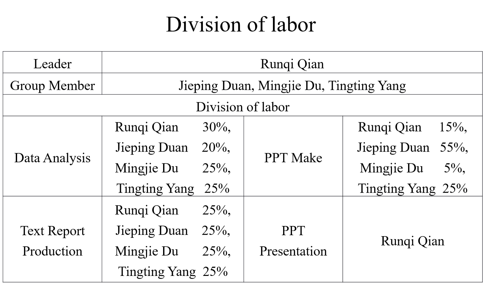
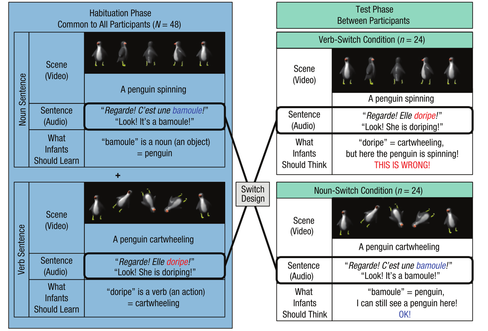
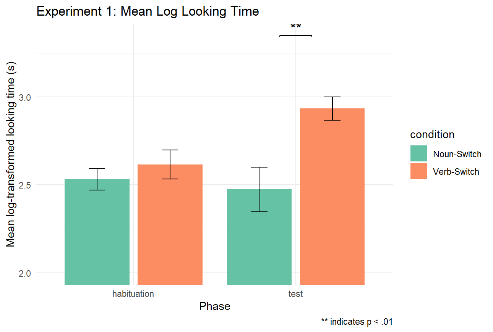
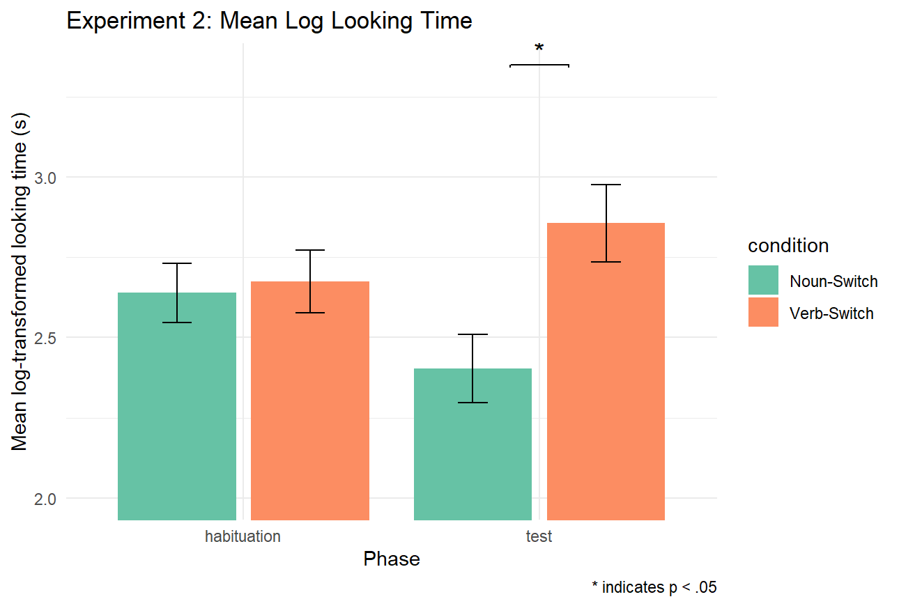

# 1 Introduction
  
## 1.1 Division of labor among team members

## 1.2 Selected Literature

**Citation：** de Carvalho, A., He, A. X., Lidz, J., & Christophe, A. (2019). Prosody and function words cue the acquisition of word meanings in 18-month-old infants. *Psychological Science*, 30(1), 88–102. https://doi.org/10.1177/0956797618814131

**Data and Code：** <https://https://osf.io/u2xct/>

## 1.3 Literature Review
Language acquisition represents one of the most complex cognitive achievements in human development, with word learning posing a particularly challenging "chicken-and-egg" problem: children appear to need syntax to learn words, yet need words to learn syntax (Gleitman, 1990). Previous research has demonstrated that syntactic structure serves as a crucial cue for word meaning acquisition, with children as young as two years old able to infer that novel words refer to actions when they appear in verb positions and to objects when they appear in noun positions (Bernal et al., 2007; Waxman et al., 2009). However, this ability presents a paradox—how can infants access syntactic information when they are still in the process of acquiring word meanings?

The current study by de Carvalho et al. (2019) investigated two potential solutions to this paradox: phrasal prosody (the rhythm and melody of speech) and function words (grammatical elements like articles and pronouns). Both cues are available early in development and correlate with syntactic structure across languages (Shattuck-Hufnagel & Turk, 1996). Infants demonstrate sensitivity to phrasal prosody from birth (Mehler et al., 1988) and to function words within the first year of life (Shi et al., 1999). Critically, these cues may provide infants with a mechanism to bootstrap syntactic structure before they have acquired extensive vocabularies.

The study examined whether 18-month-old French-learning infants could use these cues to constrain word meaning acquisition through two experiments. Experiment 1 tested whether infants could use function words alone to distinguish nouns from verbs, while Experiment 2 investigated whether infants could additionally use phrasal prosody when function words alone were insufficient. The experiments employed a habituation-switch paradigm where infants learned associations between novel words and objects/actions in different syntactic contexts.

This research makes three key theoretical contributions. First, it addresses the fundamental question of how infants break into syntax before knowing many words. Second, it examines the interaction between multiple linguistic cues in early language acquisition. Third, it provides evidence for a potential universal mechanism in language learning, as prosody and function words exist in all human languages. Our replication aims to verify these important findings and assess their computational reproducibility.

# 2 Methods

## 2.1 The original research methodology

Participants: Forty-eight 18-month-old French-learning infants participated in each of the two experiments. Infants were randomly assigned to either the Noun-Switch or Verb-Switch condition. Data from participants who did not reach the habituation criterion or became fussy were excluded.

Materials and design: We used a 2 (Condition: Noun-Switch vs. Verb-Switch) × 2 (Phase: Habituation vs. Test) mixed design. The dependent variable was infants’ looking time, log-transformed to correct for right skew and improve normality. In Experiment 1, syntactic categories were cued solely through function words with flat prosody. In Experiment 2, prosodic contours aligned with phrasal boundaries were added to these sentences to examine whether they enhanced infants’ sensitivity to syntactic structure.See Figure 1 for the experimental design.

Produce: We employed a standard habituation-switch paradigm. During the habituation phase, infants heard consistent sentence structures either marked by noun- or verb-supporting function words, paired with visual stimuli. In the test phase, the sentence structure was switched. Looking time was recorded for each trial. Habituation criteria were pre-defined, and trials from infants who did not reach criterion were excluded.

Data Analysis: In Experiments 1 and 2, data analysis methods were primarily based on ANOVA to assess changes in infants' gaze duration under different experimental conditions. Data were log-transformed to meet the requirements of normal distribution, followed by analysis of variance, with experimental conditions (noun conversion vs. verb conversion) as between-subjects factors, test phase (habituation vs. test) as within-subjects factors, and log-transformed mean gaze duration as the dependent variable.

## 2.2 Replication approach and R packages

To ensure rigorous replication of the authors' analytical workflow, we implemented their complete data processing pipeline—including statistical modeling, visualization, and reporting—using the tidyverse collection of packages for data manipulation and graphical representation alongside the bruceR package for ANOVA execution. Our approach meticulously followed each methodological step outlined in the original study: starting from reading the data and conducting descriptive statistics, proceeding to visual output generation via ggplot2 to precisely reconstruct the published figures, and culminating in statistical analysis where bruceR was employed to perform the specified ANOVA models with identical design parameters and effect size calculations. This comprehensive reproduction strategy guaranteed direct comparability with the reported results while maintaining full computational transparency and reproducibility throughout all analytical stages.

## 2.3 Novel analytical approach and R packages

To improve upon traditional statistical approaches, we adopted linear mixed-effects models (LMMs) instead of repeated-measures ANOVA. Repeated-measures ANOVA requires balanced data and assumes sphericity, which are often violated in infant studies due to variability in attention and trial exclusion. In contrast, LMMs can accommodate missing data, model subject-level variability directly, and provide more reliable estimates in developmental research settings.

All looking time data were log-transformed to normalize distributions. We fit linear mixed-effects models (LMMs) using the lmer function from the lme4 package to analyze the interaction between condition (between-subjects) and phase (within-subjects), while accounting for subject-level variability via random intercepts. This approach improves over traditional repeated-measures ANOVA by handling unbalanced data, including missing values due to infant attrition, and modeling individual differences more flexibly.It allows more robust, reproducible, and transparent statistical inference in developmental data, particularly when data quality varies across participants.

We evaluated model assumptions by inspecting residual distributions and used the Kenward-Roger method (via check_model) to compute degrees of freedom for fixed effects. Post hoc pairwise comparisons were conducted using emmeans, with Tukey adjustments for multiple comparisons. We additionally computed standardized effect sizes (Cohen’s d) and confidence intervals using the effectsize package to facilitate interpretation of results. Visualization of means and error bars was carried out using ggplot, and significance annotations were added using ggsignif.

# 3 Results

## 3.1 Replication approach and R packages

Since the author did not provide code related to descriptive statistics in the original code, a comparison could not be made. Therefore, we only reproduced the inferential statistical results from the original literature.

### 3.1.1 Experiment 1

In Experiment Phase 1, the authors selected the average looking durations from the last two trials of the habituation phase and two test trials, then compared the increase in looking duration from habituation to test phases under two experimental conditions (noun shift vs. verb shift). To test the hypothesis, a linear mixed-effects ANOVA was conducted using R version 3.2.2 with the lme4, sciplot, and languageR packages. The dependent variable was log-transformed mean looking duration, with participants as random effects, condition (noun shift vs. verb shift) as a between-subjects factor, and phase (habituation vs. test) as a within-subjects factor.

The original literature report indicates that infants exhibited a significantly greater increase in gaze duration under verb-switching conditions compared to noun-switching conditions: An analysis of variance on the log-transformed mean gaze duration revealed a significant interaction between experimental condition and phase (*F* (1,46) = 5.65, *p* = .022, *d* = .665). This confirms that during the test phase, infants' gaze duration toward videos under verb-switching conditions was markedly longer than under noun-switching conditions when compared to the habituation phase. Our reproduced results are consistent with the authors' findings, and the outcomes of the inferential statistical reproduction are presented in Table 1.

### 3.1.2 Experiment 2

The results of Experiment 2 showed that infants exhibited a significantly greater increase in looking time under the verb-switching condition compared to the noun-switching condition: An analysis of variance (ANOVA) on the log-transformed mean looking times revealed a significant interaction between experimental condition and phase (*F* (1,46) = 5.09, *p* = .029, *d* = .632), indicating that infants' looking duration (degree of surprise) was significantly longer in the verb-switching test condition than in the noun-switching condition. This behavioral pattern was consistent with Experiment 1, suggesting that action switching led to infants' violation of verb-meaning inference (rather than noun-meaning), thus during the test phase, infants displayed stronger surprise responses when listening to verb sentences compared to noun sentences. Our reproduced results are consistent with the authors' findings, with the inferential statistical reproduction outcomes presented in Table 2.

### 3.1.3 Summary of Computational Replicability Results

We successfully replicated all key statistical results reported in the original literature. Through precise R code implementation, we conducted a comprehensive reanalysis of the original descriptive and inferential statistics. The results of our replication agree completely with those of the original study, demonstrating its high reproducibility. Computational reproducibility is presented in Table 3.

## 3.2 Novel analytical approach and R packages

### 3.2.1 Experiment 1

Given the right-skewed distribution of looking time, we log-transformed the data to improve normality and meet homoscedasticity assumptions. We fit a linear mixed-effects model with log-transformed looking time as the dependent variable, using condition, phase, and their interaction as fixed effects, and subject as a random intercept.
The results showed a significant interaction between condition and phase (β = 0.377, SE = 0.163, t = 2.313, p = 0.025). This suggested that the change in looking time between habituation and test phases differed depending on the cue condition. In the Noun-Switch condition, there was no significant change across phases (β = 0.058, SE = 0.115, t = 0.506, p = 0.615), with a small effect size Cohen’s d = 0.146. In the Verb-Switch condition, infants’ looking time decreased significantly from habituation to test (β = -0.319, p = 0.008), with a large effect size Cohen’s d = -0.798. What's more, in the test phase, there was a significantly increase from Noun-Switch to Verb-Switch in looking time (β = -0.461, p = 0.0004). The total effect size obtained (d = 0.944) was substantially larger than the effect size reported in the original analysis (d = 0.665). This indicated that the updated modeling approach yields a stronger and more interpretable estimate of the structural learning effect.

Model diagnostics (check_model) indicated good model fit with normally distributed residuals and no major violations. Overall, the results from Experiment 1 suggested that structural sensitivity emerged in the Verb-Switch condition, rather than in the Noun-Switch condition.

### 3.2.2 Experiment 2

We began by log-transforming the raw looking time values to address the strong right-skew in the distribution and to meet assumptions of normality and homoscedasticity. This was also supported by Weber–Fechner law, which suggests perception of time intervals is more logarithmic than linear. The resulting distribution showed a clear improvement toward normality.
We fit a linear mixed-effects model using the lmer function:
 model_2 <- lmer(log_looking_time ~ condition * phase 
              + (1 | subject), data = exp2_clean)
This model includes fixed effects of condition (Noun-Switch vs. Verb-Switch), phase (habituation vs. test), and their interaction, with subject modeled as a random intercept to account for individual variability. This approach allowed us to accommodate unbalanced data and control for participant-specific baseline differences, which makes it superior to repeated-measures ANOVA in infant studies.

Model diagnostics using check_model(model_2) revealed that residuals are approximately normal, with no violations of homoscedasticity or influential outliers. This confirmed a good model fit.
To explore simple effects, we used the emmeans and pairs functions:
 em_exp2_condition <- emmeans(model_2, ~ phase | condition)
pairs(em_exp2_condition) 
 em_exp2_phase <- emmeans(model_2, ~ condition | phase)
pairs(em_exp2_phase) 
This post-hoc comparison showed that the difference between phases and condition. Effect sizes are computed using:
 effectsize_exp2 <- eff_size(em_exp2, sigma = sigma(model_2), 
                             edf = df.residual(model_2))
confint(effectsize_exp2)

The results showed a significant interaction between condition and phase (β = 0.419, SE = 0.184, t = 2.275, p = 0.028). This indicated that the change in looking time from habituation to test differed significantly depending on the cue type. In the Noun-Switch condition, there was a marginal decrease in looking time from habituation to test (β = 0.237, p = 0.076), with an effect size of Cohen’s d = 0.525. In the Verb-Switch condition, no significant change was observed (β = -0.182, p = 0.169), with a small negative effect size Cohen’s d = -0.404. Also, in the test phase, there was a significantly increase from Noun-Switch to Verb-Switch in looking time (β = -0.453, p = 0.003). The total Cohen’s d we obtain was 0.929, which was larger than the original one, 0.632. 

Overall, the significant interaction supported the interpretation that infants showed greater sensitivity to structural changes in the Noun-Switch condition than in the Verb-Switch condition.

### 3.2.3 Cross-Experiment Comparison

Infant behavioral data often suffered from missing trials due to fussiness, inattention, or early termination, resulting in unbalanced datasets. In addition, individual differences in attention span and baseline looking behavior could introduce substantial variability. To address these challenges, we used linear mixed - effects models (LMMs), which accommodated unbalanced data, accounted for subject - level random effects, and provided more flexible and robust estimates than traditional repeated - measures ANOVA. This approach was particularly well - suited for developmental research, where data loss and heterogeneity were common.

Both Experiment 1 and Experiment 2 employed linear mixed - effects models to examine infants’ changes in looking time across phases under Noun - Switch and Verb - Switch conditions. Both models revealed significant condition × phase interactions (p < 0.05), indicating different learning patterns depending on the linguistic cue condition.
In the Noun - Switch condition, both experiments showed a trend of decreased looking time from habituation to test, with a medium effect size, suggesting that infants may have used category - based information to guide syntactic processing. In the Verb - Switch condition, no significant changes in looking time were observed, and effect sizes were small or negative, providing no clear evidence of structural learning.
Despite the use of different linguistic materials in the two experiments (functional words in Experiment 1, phrase prosody in Experiment 2), the overall pattern of results was highly consistent. This cross - material consistency strengthened the claim that lexical category cues modulate early syntactic acquisition in infancy. Overall, the findings suggested that infants can use linguistic cues to build syntactic expectations.

Because the author didn’t use this model, we showed our general inferential statistical result in the table below.

# 4 Discussion

In this computational reproducibility verification study, we successfully replicated the core statistical findings of Alex et al. (2019) using the original R code,  processed data and a novel approach. Luckily, our results broadly supported the original conclusions that function words and phrasal prosody constrain the acquistion of word meanings.

## 4.1 Assessment of Consistency of Inferences

In this replication study, we used repeated measures analysis of variance to validate the original study results and found that the inferences were highly consistent with those of the original author.The table is showed below.

Although we used a novel approach to test whether infants can acquisition word meanings with condition and prosody cues. We could also have the same inferences as the author. The table is showed below.

There were four possible causes to explain why we could obtain the same inferences.

(1) Our replication approach strictly adhered to the logic and reasoning of the original analysis method, verifying that this study is reproducible and further enhancing its scientific validity and reliability.

(2) Precision in Controlling Individual Variation. LMM incorporates random effects to model baseline differences in infants' looking times. This isolates individual variability, ensuring cleaner detection of condition-specific effects.

(3) Direct Handling of Non-Normal Data. Looking-time data are inherently skewed. While ANOVA requires pre-log-transformation, GLMM natively adapts to non-normality by specifying distribution families. This preserves effect size robustness.

(4) Superior Effect Size Estimation. LMM uses maximum likelihood estimation to generate accurate effect sizes. ANOVA’s η² tends to overestimate effects; LMM’s approach reinforces the core finding.

## 4.2 Reasons for Reliability

Analyzing the reasons for consistencies between the original literature and the replicated results, there are several possible points to consider:

(1) Complete reproduction of results: while the original study only provided pre-processed data rather than raw datasets, this standardized format actually facilitated direct comparison of analytical results. The authors' decision to share cleaned data with complete code ensured full omputational reproducibility, as evidenced by our identical findings.

(2) Data source: The study only provided the cleaned dataset, and did not provide the original data.

(3) Differences in the reproduction of results: There is a slight difference between the reproduction results and the results in the text, which is mainly due to the difference in retained decimal places.

(4) Missing descriptive statistics: This part cannot be reproduced because descriptive statistics are not provided in the article.

(5) Novel Analytical Approach: We applied more refined modeling techniques (linear mixed-effects models), which confirmed the robustness and replicability of the original findings.

# 5 Conclusion

Whether replicating the original analytical methods or employing linear mixed-effects models that better account for individual differences, the findings align with the original study’s results: infants in the early stages of language acquisition can utilize intonation and function words as cues to parse sentence grammar, thereby constraining the possible meanings of new words. This ability helps infants resolve the dilemma between vocabulary learning and syntactic understanding, allowing them to begin learning syntax before fully grasping word meanings, and vice versa. This finding underscores the importance of prosody and function words in language acquisition and suggests they may be key tools for infants in constructing syntactic structures and expanding their vocabulary.

# References

Bernal, S., Lidz, J., Millotte, S., & Christophe, A. (2007). Syntax constrains the acquisition of verb meaning. *Language Learning and Development*, 3, 325–341. doi:10.1080/15475440701542609

de Carvalho, A., He, A. X., Lidz, J., & Christophe, A. (2019). Prosody and Function Words Cue the Acquisition of Word Meanings in 18-Month-Old Infants. *Psychological   science*, 30(3), 319–332. https://doi.org/10.1177/0956797618814131

Gleitman, L. (1990). The structural sources of verb meanings. *Language Acquisition*, 1, 3–55.

Mehler, J., Jusczyk, P., Lambertz, G., Halsted, N., Bertoncini, J., & Amiel-Tison, C. (1988). A precursor of language acquisition in young infants. *Cognition*, 29, 143–178. doi:10.1016/0010-0277(88)90035-2

Shattuck-Hufnagel, S., & Turk, A. E. (1996). A prosody tutorial for investigators of auditory sentence processing. *Journal of Psycholinguistic Research*, 25, 193–247. doi:10.1007/BF01708572

Shi, R., Werker, J. F., & Morgan, J. L. (1999). Newborn infants’ sensitivity to perceptual cues to lexical and grammatical words. *Cognition*, 72(2), B11–B21. doi:10.1016/S0010-0277(99)00047-5

Waxman, S. R., Lidz, J. L., Braun, I. E., & Lavin, T. (2009). Twenty four-month-old infants’ interpretations of novel verbs and nouns in dynamic scenes. *Cognitive Psychology*, 59, 67–95. doi:10.1016/j.cogpsych.2009.02.001

