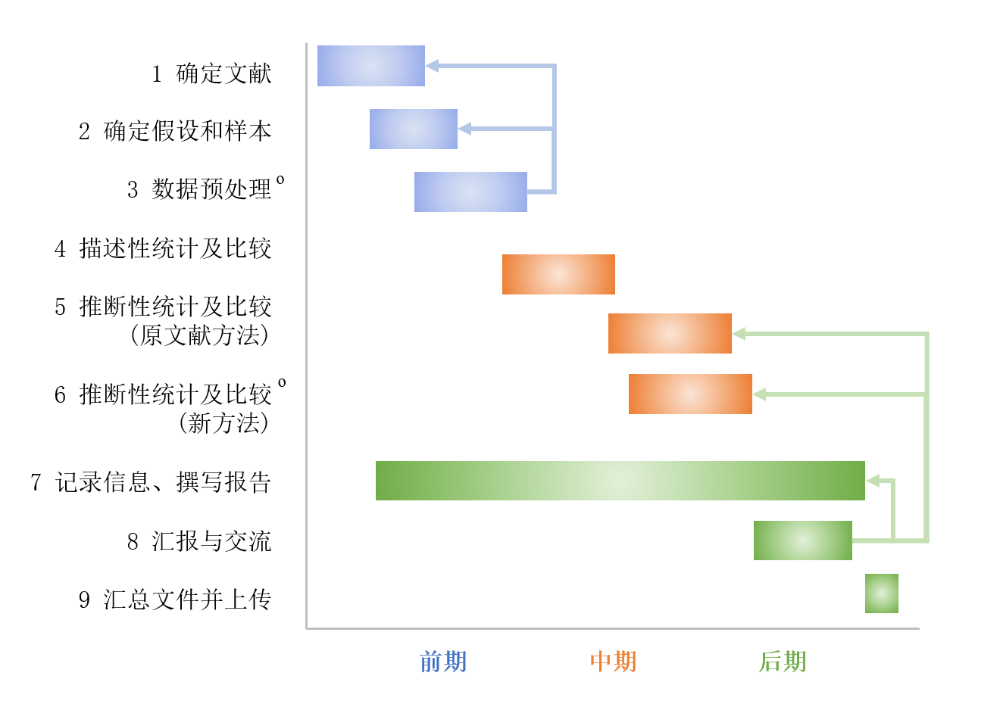

**心理学院 R 编程语言**

**分析与计算可复现性检验指南**

> 

**整理人：** 周方茹 吕冬煦

**版本更新信息(2025.3)**

在优化已有可复现检验指南的基础上，调整内容以适应《R
编程语言及其在心理学研究中的运用》课程(以下简称 R
语言)内容的需要。主要包括如下修改：

1 增添整体可复现性检验流程的图文说明。

2 对选定文献的要求进行了更多补充和建议，与已有研究相适应。

3
增添了数据预处理、汇报与交流、汇总文件并上传等部分的介绍，增强指南的指导意义。

4
对可复现性检验进行了细化，区别了描述性检验与推断性检验，对结果的检验和对推论的检验，并进一步规定了需要比较哪些结果。

5
添加了可能影响可复现性检验结果的因素，综合了原文献的因素和复现者的因素。

**  
**

**1 概述**

**1.1 可重复性及其重要性**

近年，人们对科学研究可重复性的关注持续上升，许多科学发现很难或无法复制，导致了“可重复性危机”(replication
crisis)的出现。可重复性指研究人员使用与原始研究者使用的相同的材料复制先前研究结果的能力(Goodman
et al.,
2016)。可重复性是科学的决定性特征，不可重复性(irreplication)可能会破坏数据的重复使用(Hardwicke
et al., 2018)，使复制尝试变得复杂(Nuijten et al.,
2018)，并对科学证据的来源和真实性造成不确定性，从而有可能破坏任何相关推论的可信度(LeBel
et al., 2018)。

由于可重复性是一个笼统的术语，有研究者试图将其内容划分为更易于处理的术语(Goodman
et al., 2016)。基于教学目标，**本课程主要关注分析可复现性**(analytical
reproducibility)或**计算可复现性**(computational reproducibility) [1]。

-   **分析可复现性**指提供数据文件及对数据分析说明的情况下，其他研究者可以重现原研究中所报告的最终结果，包括关键的定量的结果、图表和数值(Kitzes
    et al., 2017)；

-   **计算可复现性**指的是原研究者不仅提供数据及对数据分析的说明，而且提供分析所使用的代码，其他研究者可使用**原代码**和**原数据**重现原研究中所报告的最终结果，包括关键的定量结果、图表和数值。

**1.2 分析/计算可复现性的检验**

数据、材料和分析代码的共享是提高可复现性的重要举措，可使其他研究者复制、检验与建构现有的研究(Kitzes
et al., 2017)。为了更好地促进对已有的研究的可复现性检验，*Psychological
Science* 等期刊鼓励作者在 OSF(osf.io)
等平台上公开数据与代码，这些文献都可以进行复制与检验。本课程作业需要通过
R 复现真实研究中的数据分析过程，帮助同学们在掌握 R
的同时，进一步了解与思考数据分析和计算可复现性的问题。通过复现分析，同学们将经历真实数据分析的全流程、尝试解决真实数据分析中遇到的问题，从而在实践中加深对统计方法的理解与运用；还能以更全面、更批判性的视角看待前人研究并进行验证，为心理学的发展做出自己的贡献。

**2 进行可复现性检验**

如下图所示，在进行可复现性检验时，需要经过确定文献、确定假设和样本、数据预处理(可选)、进行描述性统计的可复现性检验、采用原始方法进行推断性统计的可复现性检验、采用新方法进行推断性统计的可重复检验(可选)、记录信息并撰写报告、汇报与交流、汇总文件并上传
9 个步骤。

**图 1 《R 语言》可复现性检验流程**

\*带o标志的步骤为可选步骤，不强制要求、但推荐进行。

\*编号靠后步骤需要以编号靠前步骤的信息为基础，但并不意味着需要等前一步骤完全结束再开始进行，如进度标识所示，很多步骤在时间上会同时进行；此外，如箭头所示，在部分步骤后可能需要根据新的反馈，退回上一步骤进行优化。

下文将对其中涉及的部分步骤进行展开介绍。其中，斜体部分为可选步骤，是同学可以结合自己所选择的文献、自行选择是否进行的步骤。但我们建议同学们加入这些步骤，更好地理解可复现性检验的流程，以及本课程的教学内容。

**2.1 选取文献**

**2.1.1 与在课程中分析/计算可复现性相关要求**

根据此前研究者在课堂中指导学生进行可复现性检验的经验(Bauer et al., 2023,
2025; Janz, 2015; Karathanasis et al., 2022; Marshall & Underwood, 2018;
Standing et al., 2014; Stojmenovska et al.,
2019)，为了在课堂情境中实现检验原文献计算可复现性这一目的，在选取文献时应注意以下几点：

\(1\)
对文献主题的兴趣和了解程度：对于选定文献的研究主题，应有一定的兴趣和背景知识储备，有相关的科研训练或实践更佳。

\(2\)
复制文献的可行性：对于选定文献进行复制的可能性，可以通过该文献提供的数据、代码等信息，以及文献使用的数据分析软件和方法两方面出发进行判断。首先，选定文献的数据和代码应公开可获取，提供原始数据及其处理流程更佳；若无公开代码和原始数据，至少可以获得处理后的、可分析的数据；

其次，选定文献中方法部分提到的数据分析或建模方法应为小组成员所掌握，或者通过快速学习能够掌握。

此外，在选取文献时还可以优先考虑满足以下条件的文献：

\(1\) 文献所涉及的研究主题包含不止一篇研究，有相关元分析研究更佳(Bauer
et al., 2023, 2025)；

\(2\) 文献此前被其他研究者成功或失败复制过(Standing et al., 2014)。

这两个条件不是必须的，但在对文献的可复现性结果进行归纳和反思时，满足这两个条件的文献能提供更多可供比较的信息。

**2.1.2 与本课程相关的要求**

由于本课程的目标在于让同学们学习如何在 R
编程语言进行心理学研究数据分析，因此，文献选取为心理学各领域的量化研究的文献，在选取文献时还应注意：

\(1\) 选定文献应来自 *Science*、*Nature*、*Science Advances*、*Nature
Human Behavior*、*Nature Communications*、*Psychological
Science*、*Cognition* 、*Journal of Experimental Psychology:
General*、*Advances in Methods and Practices in Psychological
Science*、*Collabra:
Psychology*这十本期刊中的人类心理与行为研究相关的文章(这些期刊均较为支持开放科学实践，更有可能提供了完整数据)；

\(2\) 如果原文献使用 R
完成分析并提供代码最佳；而使用其他数据分析软件但其方法能够在 R
中实现也可以纳入选择范围。

\(3\) 原文献中至少有一部分包含课程所涉及的数据分析方法。

**2.2** **选取研究假设和****数据集，并进行数据预处理**

因为时间与精力的限制，可以仅选取文献中部分研究假设进行复现。另一方面，选取的研究可能涉及原始数据、处理数据两个数据集，需要进行选择；并且，由于部分分析方法可能需要进行多次抽样，消耗较大算力，如果原研究数据集较大，也需要进行筛选。

**2.2.1 选取具体待验证的研究假设**

因此，规定在选取具体待验证的研究假设时遵循以下原则：

\(1\) 优先选取文献中已经过可复现性检验的研究假设进行验证；

\(2\)
如文献中的研究假设均(未)经过可复现性检验，则默认对最后一个实验中的研究假设进行验证，因为相对而言，文献中的第一项研究更多是初步论证、进行复制的价值更小(Open
Science Collaboration, 2014; Open Science Collaboration, 2015)；

\(3\)
如无法或较难对最后一个实验中的研究假设进行验证，则按从后向前的顺序、优先验证更靠后实验中的研究假设(Open
Science Collaboration, 2014)。

要求在代码文件和报告文件中记录最终选取的待检验假设及理由。

**2.2.2 选取具体的数据集**

在选取具体数据集时遵循以下原则：

\(1\)
如选取的文献提供了原始数据和数据处理方法，则应当对原始数据进行预处理，再用于可复现性检验，而不是直接使用处理后的数据；

\(2\) 非必要不对使用的数据集进行删改，如需要删改，需要利用 G-power
软件对修改样本后效应量的大小进行计算，确保其达到了 80%
这一重复研究中的效应量基准(Cohen，1988; Open Science Collaboration,
2014)。

要求在代码文件和报告文件中记录最终选取的数据集，如与原文样本不一致还需补充理由，还需要在方法部分报告具体的改动标准、步骤，和改动后的效应量。

***2.2.3 数据预处理***

*包括对原始数据进行缺失值处理、转化与计算，得到可复现性检验中会使用到的变量的过程。在报告文件的方法部分简述数据处理的步骤，在代码文件详细记录数据预处理的步骤、并进行注释，在代码文件和报告文件中记录最终选取变量的信息。*

*数据预处理步骤的记录包括进行了哪些处理、为什么要进行这些处理；选取变量信息包括选取了哪些变量、是什么类型的变量(如称名/顺序/等距/等比，连续/离散)，如为类别变量，则需要报告各数值分别代表了哪一类别(如0代表女性)。*

*建议在最终确定文献以及具体的验证假设、数据集前就开始部分数据预处理的工作，以保证所选定的部分具备进行可复现性检验的可行性。*

在完成文献、研究假设和数据集的选取后，需要填写文献信息表，如表 1 所示。

**表 1 文献信息表**

<table>
<thead>
<tr class="header">
<th><strong>1 文献基本信息</strong></th>
<th></th>
<th></th>
<th></th>
</tr>
</thead>
<tbody>
<tr class="odd">
<td>所选文献</td>
<td>(APA 格式的参考文献)</td>
<td></td>
<td></td>
</tr>
<tr class="even">
<td>数据来源</td>
<td>(osf 或 github 链接)</td>
<td></td>
<td></td>
</tr>
<tr class="odd">
<td><strong>2 文献选取</strong></td>
<td></td>
<td></td>
<td></td>
</tr>
<tr class="even">
<td>文献主题是否包含不止一篇研究？</td>
<td><ul>
<li>
是，且包含元分析研究
</li>
<li>
是，但不包含元分析研究
</li>
<li>
否
</li>
</ul></td>
<td>文献此前被其他研究者重复过？</td>
<td><ul>
<li>
是(附上原文链接)
</li>
<li>
否
</li>
</ul></td>
</tr>
<tr class="odd">
<td><strong>3 研究假设选取</strong></td>
<td></td>
<td></td>
<td></td>
</tr>
<tr class="even">
<td>重复的研究假设</td>
<td>(指出检验了原文献哪部分的哪些假设结果，如研究一、研究二/ 行为数据、电生理数据/ A任务、B任务等)</td>
<td></td>
<td></td>
</tr>
<tr class="odd">
<td>重复的研究假设是否在其他研究中经过重复？</td>
<td><ul>
<li>
是(附上原文链接)
</li>
<li>
否
</li>
</ul></td>
<td>文献共几个实验，重复的研究假设是第几个实验中的？</td>
<td></td>
</tr>
<tr class="even">
<td>选择该假设的原因</td>
<td>(若未按照指南推荐的优先顺序，需额外说明)</td>
<td></td>
<td></td>
</tr>
<tr class="odd">
<td><strong>4 数据集选取</strong></td>
<td></td>
<td></td>
<td></td>
</tr>
<tr class="even">
<td>是否采用原始数据？</td>
<td><ul>
<li>
是
</li>
<li>
否
</li>
</ul></td>
<td>是否对样本量进行修改？</td>
<td><ul>
<li>
是(说明原因)
</li>
<li>
否
</li>
</ul></td>
</tr>
<tr class="odd">
<td>若修改，报告原文样本量大小和修改后的样本量大小</td>
<td></td>
<td>若修改，报告使用 G-power 计算的修改后的样本量对应的效应量</td>
<td></td>
</tr>
</tbody>
</table>

**2.3 进行分析/计算可重复检验**

在选定文献后，同学们由
3-5人为一组，以小组为单位对其结果进行分析/计算可复现性检验。以往对分析/计算可复现性的研究中，通常会由多名重复者或者团队独立地检验同一篇文章以尽量避免操作错误(Crüwell
et al.,
2023)。首先，每个重复者会分别进行计算可复现性的检验并撰写个人报告，这一过程中重复者需要尽量保持独立、避免相互干扰；在这一阶段结束后，负责同一篇文章的重复者会就各自独立检验的结果进行交流、讨论，共同完成小组汇总报告。

但这种方式的工作难度和负担较大，本课程仅需要以小组为单位进行可复现性检验，但也推荐由各成员独立完成分析，后进行小组讨论的环节。

**2.3.1 分析/计算可重复检验的方法\* (请注意阅读本小节)\***

在进行可复现性检验的过程中，需要分别对原文献结果和推论的可复现性进行检验。其中，结果是指描述性统计或推断性统计中报告的各类统计指标值，推论则是指基于统计结果和显著性水平
(*p* 值) 所做出的假设检验的结论。

采用 Kambouris(2024)和 Hardwicke
等人(2021)的方法，比较原文献中报告的原始数值结果与重复后获得的数值结果间的差异，以百分误差（Percentage
Error, PE）将其量化。PE = \|*x**R* −
*x**O*\|/\|*x**O*\| × 100%（其中 *x**R*
为原文献报告的数值，*x**O*
为重复分析时获得的数值）。随后，根据 PE
值对每个结果的可复现性进行评级，分为：完全一致(PE = 0%)，次要偏差（0%
&gt; PE &lt; 10%），主要偏差（PE ≥
10%）。此外，对特殊的情况进行记录，包括因舍入导致的偏差(如*x**O*
为 1.50，*x**R* 为1.51 或
1.52)和无法进行可重复检验的情况(如所需数据缺失，或缺乏清晰说明因而无法比较)。

除结果外，还需比较推论的一致性，即原始的 *p* 值与重复后的 *p* 值是否落在
α 边界的同侧，若非同侧，则记为推论不一致（除非另有说明，否则假设 α
边界为0.05）。最后，根据一致的结果和推论在全部重复结果中的占比，对文献的整体可复现性进行总结。

**2.3.2 分析/计算可重复检验的内容**

\(1\) 检验描述性统计的结果

应首先对所使用样本的描述性统计结果检验，再对其推断性统计结果进行检验，以确认推断性统计所使用的样本本身是否存在问题(如重复检验时发现样本人数与原文献中报告的样本人数存在不一致，即使用这一样本能重复原研究的推断性统计的结果，结果的有效性仍然存疑)。

在检验描述性统计的结果时，需同时呈现重复分析与原文献报告的样本量(*N*)、均值(Mean)、方差(*SD*)等结果，并进行比较，并汇总成表格，如表
2 所示。

**表 2 描述性统计结果的比较**

<table>
<thead>
<tr class="header">
<th></th>
<th>变量一</th>
<th>变量二</th>
<th></th>
<th></th>
<th></th>
<th></th>
</tr>
</thead>
<tbody>
<tr class="odd">
<td></td>
<td><em>N</em></td>
<td>Mean</td>
<td><em>SD</em></td>
<td><em>N</em></td>
<td>Mean</td>
<td><em>SD</em></td>
</tr>
<tr class="even">
<td>
原研究

报告结果
</td>
<td></td>
<td></td>
<td></td>
<td></td>
<td></td>
<td></td>
</tr>
<tr class="odd">
<td>本研究</td>
<td></td>
<td></td>
<td></td>
<td></td>
<td></td>
<td></td>
</tr>
<tr class="even">
<td><em>δ</em></td>
<td></td>
<td></td>
<td></td>
<td></td>
<td></td>
<td></td>
</tr>
<tr class="odd">
<td>评级</td>
<td></td>
<td></td>
<td></td>
<td></td>
<td></td>
<td></td>
</tr>
</tbody>
</table>

\(2\) 使用原文献方法检验推断性统计的结果

在描述性统计结果检验的基础上，采用原文献使用的编程语言、编程包和分析方法，对原文献的推断性结果进行检验。在以往的重复性检验过程中，通常会采用不同统计方法中最为重要几个的参数指标，作为需要重复的参数(Open
Science Collaboration, 2015)。

因此对同学们在对采用各类统计方法的文献中，需要进行重复的基本参数进行了汇总，如表
3 和表 4
所示。在对这些基本参数进行重复的基础上，也可以根据文献具体内容加入对其他参数的重复

**表 3 传统统计方法中的重要参数**

| 统计方法                   | 统计量  | 效应量               | 显著性指标 |
|----------------------------|---------|----------------------|------------|
| t检验 (t-test)             | *t* 值  | Cohen’s *d*          | *p* 值     |
| 方差分析 (ANOVA)           | *F* 值  | *η*2 或 partial *η*2 | *p* 值     |
| 相关分析 (Correlation)     | *r* 值  | Pearson’s *r*        | *p* 值     |
| 回归分析 (Regression)      | *t* 值  | R²                   | *p* 值     |
| 卡方检验 (Chi-square test) | *χ2* 值 | Cramér’s *V*         | *p* 值     |

**表 4 Bayes 统计方法中的重要参数**

| 统计方法              | 决策标准 | 参数估计                            | 置信区间 | 后验评估                |
|-----------------------|----------|-------------------------------------|----------|-------------------------|
| 贝叶斯分析 (Bayesian) | BF       | *Β, Posterior Mean*, *Posterior SD* | *CI/HDI* | ELPD、MAE、WAIC、LOO-CV |

在检验推断性性统计的结果时，需同时呈现重复分析与原文献报告的上述重要参数结果，并进行比较，并汇总成表格，如表
5 所示。

**表 5 推断性统计结果的比较(原文献方法)**

<table>
<thead>
<tr class="header">
<th></th>
<th>假设一</th>
<th>假设二</th>
<th></th>
<th></th>
<th></th>
<th></th>
</tr>
</thead>
<tbody>
<tr class="odd">
<td></td>
<td>样本量<em>N*</em></td>
<td>
统计量

(如 <em>t</em> 或 <em>F</em>)
</td>
<td>
效应量

(如 Cohen’s <em>d</em>)
</td>
<td>显著性指标(<em>p</em>)</td>
<td>其它指标</td>
<td>（略）</td>
</tr>
<tr class="even">
<td>
原文献

报告结果
</td>
<td></td>
<td></td>
<td></td>
<td></td>
<td></td>
<td></td>
</tr>
<tr class="odd">
<td>本研究</td>
<td></td>
<td></td>
<td></td>
<td></td>
<td></td>
<td></td>
</tr>
<tr class="even">
<td><em>δ</em></td>
<td></td>
<td></td>
<td></td>
<td></td>
<td></td>
<td></td>
</tr>
<tr class="odd">
<td>评级</td>
<td></td>
<td></td>
<td></td>
<td></td>
<td></td>
<td></td>
</tr>
</tbody>
</table>

\*
此前描述性统计已报告，因此此处仅需进行报告，不需作为一个额外的结果、计算百分误差

注意，本课程对可复现性检验应包括完全采用原文献的分析思路、编程语言和统计方法，即使原文献使用的程序语言不是
R 语言、统计方法在课程中未涉及。如果复制的文献未使用 R
语言、或统计方法在课程中未涉及，则需要额外采用 R
语言、至少用一部分课程使用的统计方法对原文献进行分析，并与采用原始分析思路、编程语言和统计方法的结果进行比较。如果复制的文献使用
R 语言，且统计方法在课程中已有提及，则不要求、但鼓励增加创新性内容。

*(3) 使用创新方法检验推断性统计的结果*

*在此完成基于原文献方法的重复后，同学们可以根据课程学习的内容，采用创新性分析方法对原文献结论进行检验，以便为验证同一假设提供其他可行的、甚至更具理论意义的方法。在以往课堂可复现性检验的实践中，很多学生都会在完全重复前人研究的基础上增加创新性的工作，因此我们鼓励同学们也进行这种尝试(Bauer
et al., 2015; Janz, 2015; King, 2006:120; Stojmenovska et al., 2019)。*

*本课程可可供参考的具体的创新思路包括：采取原文未使用的数据分析思路(如，改变原文的变量类型，或建立了与原文不同的模型)，使用不同的编程语言或包(如原文献使用
SPSS，本研究使用
R)，采用原文未使用的数据分析方法(如原文采用传统统计方法，重复时加入
Bayes
统计方法)等。此时，由于分析思路或方法发生改变，难以对具体的描述性或推断性统计中的数值进行直接比较。因此，仅报告复现后的结果及推论、并说明与原文献推论是否一致即可，如表
6 所示。*

*此外，如果使用了创新方法，需要在方法部分对其进行介绍，并结合相应理论对该方法的可行性、及其相比原方法的优势进行说明。*

**表 6 推断性统计结果(创新方法)**

<table>
<thead>
<tr class="header">
<th></th>
<th>样本量(<em>N)*</em></th>
<th>
统计量

(如 <em>t</em> 或 <em>F</em>)
</th>
<th>
效应量

(如 Cohen’s <em>d</em>)
</th>
<th>显著性指标(<em>p</em>)</th>
<th>其它参数</th>
</tr>
</thead>
<tbody>
<tr class="odd">
<td>假设一</td>
<td></td>
<td></td>
<td></td>
<td></td>
<td></td>
</tr>
<tr class="even">
<td>假设二</td>
<td></td>
<td></td>
<td></td>
<td></td>
<td></td>
</tr>
<tr class="odd">
<td>…</td>
<td></td>
<td></td>
<td></td>
<td></td>
<td></td>
</tr>
</tbody>
</table>

**2.4 撰写计算可复现性检验报告**

如上文所述，同学们在完成对选取文献结果的计算可复现性检验后，需要编写程序文档和报告文档。

其中，程序文档包括使用的数据、进行数据处理和分析的编程语句及其注释，格式和内容遵循课程学习的
workflow，并且可以以课上练习的程序为参考。为了帮助同学们更好地撰写报告文档，本指南根据已有可复现性检验研究的报告整理了可供本课程使用的报告格式(详见附件一)。同学们也可以在撰写报告的过程中，参考这些已发表的可复现性检验研究报告(Crüwell
et al., 2023; OSF:
https://osf.io/xzke7/)。但是，本文档中提供的模板并不是强制性的，大家也可进行重复分析之外的扩展分析。

**2.4.1 一般性内容**

课程报告应按照心理学研究中实证研究的规范进行撰写，包括标题、作者、摘要、关键词、前言、方法、结果、总结与讨论与参考文献几个必要的部分。

其中标题为《对*作者(年份)*研究结果的计算可复现性检验报告》，作者为小组成员及分工；前言部分报告所选文献以及对所选文献的简要介绍，并需要填写文献信息表；方法部分介绍原研究的研究设计、数据分析方法和数据分析软件以及数据来源（代码与数据的OSF
链接）等，以及重复时所使用的数据集、数据分析方法和数据分析软件；结果部分包括重复分析的结果及与原结果对比，既包括使用原文献数据分析思路进行重复分析的结果，也包括使用新思路或新方法进行重复分析的结果；讨论部分则对分析/计算可复现性的结果进行总结并探讨可重复或不可重复的原因。参考文献按照
APA 格式进行撰写。

由于前言、方法、结果部分需要包含的内容在前文已有涉及，这里主要对总结与讨论部分需要包含的内容进行介绍，包括对此前可复现性检验结果的总结，对可复现性检验结果的思考以及其他内容。

**2.4.2 分析/计算可复现性结果总结**

\(1\) 使用原文献数据分析方法进行分析的结果总结

在完成研究报告主体部分的基础上，对重复分析情况做总结分析。在此前，同学们对原文献各部分的结果进行了检验，得到了不同值的
*δ* 和评级。此时可以对结果的*δ*
和评级、推论的一致性进行汇总，报告达到各个评级的结果的数量和在全体中的占比、一致和不一致的推论的数量和在全体中的占比，整理成表格，并在展示和文档中进行汇报。

表格如下所示：

**表 7 结果的计算可复现性的评估表**

| 结果的可复现性                 | 数量及占比 |     |
|--------------------------------|------------|-----|
|                                | *N \**     | *%* |
| 完全一致(*δ* = 0%)             |            |     |
| 偏差较小(0% &lt; *δ* &lt; 10%) |            |     |
| 偏差较大(*δ* ＞ 10%)           |            |     |
| 因舍入导致的偏差               |            |     |
| 无法进行可重复检验             |            |     |

\*
结果数量*N*指的在重复分析中，对重复分析结果与原结果进行配对比较的次数。对于每个目标效应，结果包括一组数值，如汇总效应估计(summary
estimate，如*t*值/ F值)、置信区间界限(confidence interval
bound)、效应量(effect size)样本大小(size
effect)等，应将原文中报告的每个数值与重复结果进行比较。例如，在一个*t*检验中，原文献报告了*t*值、95%置信区间、cohen’s
d和样本大小，则这个效应中*N*＝4。将各效应的*N*求和即为全体数量。

**表 8 推论的一致性的评估表(原分析方法)**

| 推论的一致性 | 数量及占比 |     |
|--------------|------------|-----|
|              | *N \**     | *%* |
| 一致         |            |     |
| 不一致       |            |     |

\*
推论数量*N*指的在重复分析中，对效应做出统计推断的次数。例如，仅进行了一个*t*检验，则*N*＝1；如果进行了一个2\*2的方差分析，并进行简单效应分析，则有可能有7个统计推断：两个主效应的推论，一个交互作用的推论，四个可能的简单效应分析的推论，因此*N*＝7。如果报告的*p*值相对于重复的*p*值落在显著性水平边界的另一侧，则被归类为推论不一致；反之为推论一致。

若出现结果存在偏差或不能进行重复检验的情况，需要对此进行总结。首先，可以先说明文章中哪些结果由于什么样的原因无法进行重复性检验，因此不确定其结果是否能保持一致(如原文没有提供相关数据，导致重复的过程中断)；其次，可以指出描述性统计中有哪些结果出现了偏差(如样本人数、均值等)，由于这一部分数据可能直接用在后续的推断性统计中、影响后续结果的有效性，还应说明出现偏差的数据是否在后续分析中进一步使用了、用在了哪些分析中；最后，可以按照研究假设，依次对推断统计中有哪些结果出现了偏差进行报告，重新考虑原文献的研究假设是否可以证实。

*(2) 使用创新分析思路或方法进行分析的结果总结*

*在此基础上，对采用新思路、新方法的分析结果与原文献的分析结果进行比较，此时仅需要对推论的一致性进行比较。*

**表 9 推论的一致性的评估表(新分析方法)**

| 推论的一致性 | 数量及占比 |     |
|--------------|------------|-----|
|              | *N \**     | *%* |
| 一致         |            |     |
| 不一致       |            |     |

*先总述使用新方法后，与原文献一致或不一致的推论数量。如果推论一致，可以比较两种分析方法下推论的效应量大小(参考不同统计方法对效应量的评级)、或理论意义(如哪种分析方法更符合研究假设，如采用二项分布建模更适合对性别的效应进行分析)。如果推论不一致，需要分别报告两种分析方法下的推论方向。*

**2.4.3 分析结果(不)可复现的可能原因**

除对结果进行总结外，在总结与讨论部分还需要对可复现性检验结果的影响因素进行探讨。已有研究对于计算可复现性检验结果的影响因素进行了探讨(
Crüwell et al., 2023; Kambouris等, 2024; Karathanasis et al.,
2022)。可以下表为参考，对原文献进行分析，推测可能导致可复现性检验结果差异的原因。

**表10 计算上（不）可复现的原因分析表**

| **可能原因**         | **研究一**                 | **……**                                                                                                   | **研究n** |     |     |
|----------------------|----------------------------|----------------------------------------------------------------------------------------------------------|-----------|-----|-----|
| **原文献开放性问题** | **一般性开放获取问题**     | 个别结果的微小差异，可能是由于分析中使用了没有设置固定种子的随机数；                                     |           |     |     |
|                      |                            | 个别结果的微小差异，可能是由于印刷或复制粘贴错误；                                                       |           |     |     |
|                      |                            | 文章文本中程序报告不明确，包括纳入亚组的标准、缺乏或不正确报告用于回归模型的变量、以及未报告的单侧分析； |           |     |     |
|                      |                            | 在文章的开放实践声明中对研究的模糊标记。                                                                 |           |     |     |
|                      | **OSF 开放获取特定问题**   | OSF 中缺乏对数据和/或代码内容进行说明的文档(readme文档)；                                                |           |     |     |
|                      |                            | OSF 上的数据与代码文件不一致，如代码中对部分数据进行了操作，但这部分数据在数据文件中无对应；             |           |     |     |
|                      |                            | OSF上的数据存储问题，包括文件损坏或无法下载。                                                            |           |     |     |
|                      | **数据开放获取特定问题**   | 没有提供原始数据；                                                                                       |           |     |     |
|                      |                            | 没有提供处理后的数据；                                                                                   |           |     |     |
|                      |                            | 没有提供数据处理过程的描述或代码。                                                                       |           |     |     |
|                      | **代码开放获取特定问题**   | 缺乏共享的分析代码或建模代码；                                                                           |           |     |     |
|                      |                            | 软件包或软件版本的问题。                                                                                 |           |     |     |
| **重复过程的原因**   | **重复研究与院研究的区别** | 是否使用同样的数据集；                                                                                   |           |     |     |
|                      |                            | 是否使用同样的数据分析软件及软件包；                                                                     |           |     |     |
|                      |                            | 是否使用同样的数据分析方法。                                                                             |           |     |     |
|                      | **重复者相关因素**         | 复制者此前是否有过 R 使用经验；                                                                          |           |     |     |
|                      |                            | 复制者对关于 R 的知识或操作上存在漏洞，较难理解原文章中的部分操作(可做简单说明)。                        |           |     |     |
| **其他影响因素**     | **文献年份**               | 文献发表年份是否较为久远，是否在开放科学运动之前；                                                       |           |     |     |
|                      | **文献质量**               | 文献引用量大小；                                                                                         |           |     |     |
|                      |                            | 是否有其他研究支持本文献结果；                                                                           |           |     |     |
|                      |                            | 是否有其他研究对本文献结果进行了重复，重复结果如何(可做简单说明)。                                       |           |     |     |

*如果采用了原文献不同的创新思路或方法，则还需要在此处补充分析不同分析思路或数据方法可能带来的潜在影响。*

**2.6 其他思考**

在讨论部分还可自由总结数据分析过程中除计算可复现性问题外的其他思考。如：

\(1\) 课程学习方面：如对于 R 学习或统计方法的思考；

\(2\) 科学研究方面：如对于研究方法的思考；

\(3\) 小组合作方面：如对于合作方式、协作能力的思考；

\(4\) 课程作业方面：课程作业的收获与建议。

**参考文献**

Bauer, G., Breznau, N., Gereke, J., Höffler, J. H., Janz, N., Rahal, R.
M., Rennstich, J. K., & Soiné, H. (2023). Constructive replication in
the social sciences: Teaching companion and sample syllabus “TC”. Open
Science Framework. <https://osf.io/g3k5t/>

Bauer, G., Breznau, N., Gereke, J., Höffler, J. H., Janz, N., Rahal,
R.-M., Rennstich, J. K., & Soiné, H. (2025). Teaching Constructive
Replications in the Behavioral and Social Sciences Using Quantitative
Data. *Teaching of Psychology*, *52*(1), 117-123.

Crüwell, S., Apthorp, D., Baker, B. J., Colling, L., Elson, M., Geiger,
S. J., Lobentanzer, S., Monéger, J., Patterson, A., Schwarzkopf, D. S.,
Zaneva, M., & Brown, N. J. L. (2023). What’s in a badge? A computational
reproducibility investigation of the open data badge policy in one issue
of Psychological Science. *Psychological Science*, *34*(4), 513–522.

Goodman, S. N., Fanelli, D., & Ioannidis, J. P. (2016). What does
research reproducibility mean? *Science translational
medicine*, *8*(341).

Janz, N. (2016). Bringing the Gold Standard into the Classroom:
Replication in University Teaching. *International Studies
Perspectives*, *17*(4), 392–407,

Hardwicke, T. E., Mathur, M. B., MacDonald, K., Nilsonne, G., Banks, G.
C., Kidwell, M. C., ... & Frank, M. C. (2018). Data availability,
reusability, and analytic reproducibility: Evaluating the impact of a
mandatory open data policy at the journal Cognition. *Royal Society Open
Science*, *5*(8), 180448.

Hardwicke, T. E., Bohn, M., MacDonald, K., Hembacher, E., Nuijten, M.
B., Peloquin, B. N., deMayo, B. E., Long, B., Yoon, E. J., & Frank, M.
C. (2021). Analytic reproducibility in articles receiving open data
badges at the journal Psychological Science: An observational study.
*Royal Society Open Science*, *8*(1), 201494.

Kambouris, S., Wilkinson, D. P., Smith, E. T., & Fidler, F. (2024).
Computationally reproducing results from meta-analyses in ecology and
evolutionary biology using shared code and data. *PLOS ONE, 19*(3),
e0300333. https://doi.org/10.1371/journal.pone.0300333

Karathanasis, N., Hwang, D., Heng, V., Abhimannyu, R., Slogoff-Sevilla,
P., Buchel, G., Frisbie, V., Li, P., Kryoneriti, D., & Rigoutsos, I.
(2022). Reproducibility efforts as a teaching tool: A pilot study. *PLOS
Computational Biology, 18*(11), e1010615.

Kitzes, J., Turek, D., & Deniz, F. (2017). *The practice of reproducible
research: Case studies and lessons from the dataintensive sciences*.
Oakland: University of California Press.

LeBel, E. P., McCarthy, R. J., Earp, B. D., Elson, M., & Vanpaemel, W.
(2018). A unified framework to quantify the credibility of scientific
findings. *Advances in Methods and Practices in Psychological
Science*, *1*(3), 389–402.

Marshall, E., C., & Underwood, A. (2019). Writing in the discipline and
reproducible methods: A process-oriented approach to teaching empirical
undergraduate economics research. *The Journal of Economic Education,
50*(1), 17–32.

Open Science Collaboration. (2014). The Reproducibility Project: A Model
of Large-Scale Collaboration for Empirical Research on Reproducibility.
in I*mplementing Reproducible Computational Research (A Volume in The R
Series)*, V. Stodden, F. Leisch, R. Peng, Eds. (Taylor & Francis, New
York, 2014), pp. 299–323

Open Science Collaboration. (2015). Estimating the reproducibility of
psychological science. *Science, 349,* aac4716.

Standing, L.G., Grenier, M.L., Lane, E.A., Roberts, M.S., & Sykes, S.
(2014). Using replication projects in teaching research
methods. *Psychology Teaching Review*, 20(1), 96–104.

Stojmenovska, D., Bol, T., & Leopold, T. (2019). Teaching Replication to
Graduate Students. *Teaching Sociology, 47*(4), 303-313.

附录一、研究报告格式(中文)

**对*作者(年份)*研究结果的计算可复现性检验**

小组成员分工

| 组长         |     |          |     |
|--------------|-----|----------|-----|
| 组员         |     |          |     |
| 分工         |     |          |     |
| 数据分析     |     | PPT 制作 |     |
| 文字报告制作 |     | PPT 展示 |     |

\*
同一名同学可负责多个部分；如同一内容由多位同学负责，可按百分比注明贡献占比

**摘要**：200 ～ 400字，包括背景、方法、结果与讨论/结论几个关键部分

**关键词**：三到五个关键词，需要包括“计算可复现性”

**1 引言**

**1.1 所选文献信息**

**表 1 文献信息表**

<table>
<thead>
<tr class="header">
<th><strong>1 文献基本信息</strong></th>
<th></th>
<th></th>
<th></th>
</tr>
</thead>
<tbody>
<tr class="odd">
<td>所选文献</td>
<td>(APA 格式的参考文献)</td>
<td></td>
<td></td>
</tr>
<tr class="even">
<td>数据来源</td>
<td>(osf 或 github 链接)</td>
<td></td>
<td></td>
</tr>
<tr class="odd">
<td><strong>2 文献选取</strong></td>
<td></td>
<td></td>
<td></td>
</tr>
<tr class="even">
<td>文献主题是否包含不止一篇研究？</td>
<td><ul>
<li>
是，且包含元分析研究
</li>
<li>
是，但不包含元分析研究
</li>
<li>
否
</li>
</ul></td>
<td>文献此前被其他研究者重复过？</td>
<td><ul>
<li>
是(附上原文链接)
</li>
<li>
否
</li>
</ul></td>
</tr>
<tr class="odd">
<td><strong>3 研究假设选取</strong></td>
<td></td>
<td></td>
<td></td>
</tr>
<tr class="even">
<td>重复的研究假设</td>
<td>(指出检验了原文献哪部分的哪些假设结果，如研究一、研究二/ 行为数据、电生理数据/ A任务、B任务等)</td>
<td></td>
<td></td>
</tr>
<tr class="odd">
<td>重复的研究假设是否在其他研究中经过重复？</td>
<td><ul>
<li>
是(附上原文链接)
</li>
<li>
否
</li>
</ul></td>
<td>文献共几个实验，重复的研究假设是第几个实验中的？</td>
<td></td>
</tr>
<tr class="even">
<td>选择该假设的原因</td>
<td>(若未按照指南推荐的优先顺序，需额外说明)</td>
<td></td>
<td></td>
</tr>
<tr class="odd">
<td><strong>4 数据集选取</strong></td>
<td></td>
<td></td>
<td></td>
</tr>
<tr class="even">
<td>是否采用原始数据？</td>
<td><ul>
<li>
是
</li>
<li>
否
</li>
</ul></td>
<td>是否对样本量进行修改？</td>
<td><ul>
<li>
是(说明原因)
</li>
<li>
否
</li>
</ul></td>
</tr>
<tr class="odd">
<td>若修改，报告原文样本量大小和修改后的样本量大小</td>
<td></td>
<td>若修改，报告使用 G-power 计算的修改后的样本量对应的效应量</td>
<td></td>
</tr>
</tbody>
</table>

**1.2 文献介绍**

简要介绍所选文献的研究背景、主要研究问题及假设、研究结果和结论

**2 方法**

**2.1 样本**

对原文献的数据集进行说明。

如使用的新样本与原文样本不一致，还需补充理由，并报告具体的改动标准、步骤，新样本信息和改动后的效应量。

**2.2 原研究方法简介**

介绍研究设计、数据分析的方法，使用的软件及软件包。

**2.3 重复思路说明**

对选用的文章进行复现的思路，包括选取了哪些部分重复及其原因，在使用原文献方法进行重复时是否有需要改动的情况、具体如何改动的。

*此外，如果使用了创新方法，需要具体介绍，并结合相应理论对该方法的可行性、及其相比原方法的优势进行说明。*

**3 结果**

**3.1 描述性统计**

对原文献描述性统计进行重复的结果，并汇总表格：

**表 2 描述性统计结果的比较**

<table>
<thead>
<tr class="header">
<th></th>
<th>变量一</th>
<th>变量二</th>
<th></th>
<th></th>
<th></th>
<th></th>
</tr>
</thead>
<tbody>
<tr class="odd">
<td></td>
<td><em>N</em></td>
<td>Mean</td>
<td><em>SD</em></td>
<td><em>N</em></td>
<td>Mean</td>
<td><em>SD</em></td>
</tr>
<tr class="even">
<td>
原研究

报告结果
</td>
<td></td>
<td></td>
<td></td>
<td></td>
<td></td>
<td></td>
</tr>
<tr class="odd">
<td>本研究</td>
<td></td>
<td></td>
<td></td>
<td></td>
<td></td>
<td></td>
</tr>
<tr class="even">
<td><em>δ</em></td>
<td></td>
<td></td>
<td></td>
<td></td>
<td></td>
<td></td>
</tr>
<tr class="odd">
<td>评级</td>
<td></td>
<td></td>
<td></td>
<td></td>
<td></td>
<td></td>
</tr>
</tbody>
</table>

**3.2 推断性统计**

**3.2.1 使用与原文献相同方法的推断性统计**

报告对原文献推断性统计进行重复的结果，并汇总表格：

**表 3 推断性统计结果的比较(原文献方法)**

<table>
<thead>
<tr class="header">
<th></th>
<th>假设一</th>
<th>假设二</th>
<th></th>
<th></th>
<th></th>
<th></th>
</tr>
</thead>
<tbody>
<tr class="odd">
<td></td>
<td>样本量(<em>N)*</em></td>
<td>
统计量

(如 <em>t</em> 或 <em>F</em>)
</td>
<td>
效应量

(如 Cohen’s <em>d</em>)
</td>
<td>显著性指标(<em>p</em>)</td>
<td>其它指标</td>
<td>（略）</td>
</tr>
<tr class="even">
<td>
原文献

报告结果
</td>
<td></td>
<td></td>
<td></td>
<td></td>
<td></td>
<td></td>
</tr>
<tr class="odd">
<td>本研究</td>
<td></td>
<td></td>
<td></td>
<td></td>
<td></td>
<td></td>
</tr>
<tr class="even">
<td><em>δ</em></td>
<td></td>
<td></td>
<td></td>
<td></td>
<td></td>
<td></td>
</tr>
<tr class="odd">
<td>评级</td>
<td></td>
<td></td>
<td></td>
<td></td>
<td></td>
<td></td>
</tr>
</tbody>
</table>

\* 此前描述性统计已报告，因此此处仅需进行报告，不需作为一个额外的结果

**3.2.2 使用与原文献不同方法的推断性统计**

对采用新方法进行数据分析的描述性或推断性结果进行描述，并记录在表格中。

**表 4 推断性统计结果(创新方法)**

<table>
<thead>
<tr class="header">
<th></th>
<th>样本量<em>N*</em></th>
<th>
统计量

(如 <em>t</em> 或 <em>F</em>)
</th>
<th>
效应量

(如 Cohen’s <em>d</em>)
</th>
<th>显著性指标(<em>p</em>)</th>
<th>其它参数</th>
</tr>
</thead>
<tbody>
<tr class="odd">
<td>假设一</td>
<td></td>
<td></td>
<td></td>
<td></td>
<td></td>
</tr>
<tr class="even">
<td>假设二</td>
<td></td>
<td></td>
<td></td>
<td></td>
<td></td>
</tr>
<tr class="odd">
<td>…</td>
<td></td>
<td></td>
<td></td>
<td></td>
<td></td>
</tr>
</tbody>
</table>

**3.3 对原文计算可复现性进行评估**

**3.3.1 使用与原文献相同方法**

报告原文献的值的评级分布、推论的一致情况，整理成表格，如下表所示：

**表 5 结果可复现性的评估表**

| 可复现性情况                   | 数量及占比 |     |
|--------------------------------|------------|-----|
|                                | *N*        | *%* |
| 完全一致(*δ* = 0%)             |            |     |
| 偏差较小(0% &lt; *δ* &lt; 10%) |            |     |
| 偏差较小(*δ* ＞ 10%)           |            |     |
| 因舍入导致的偏差               |            |     |

\*
结果数量*N*指在重复分析中，对重复分析结果与原结果进行配对比较的次数。对于每个目标效应，结果包括一组数值，如汇总效应估计(summary
estimate，如*t*值/ F值)、置信区间界限(confidence interval
bound)、效应量(effect size)样本大小(size
effect)等，应将原文中报告的每个数值与重复结果进行比较。例如，在一个*t*检验中，原文献报告了*t*值、95%置信区间、cohen’s
d和样本大小，则这个效应中*N*＝4。将各效应的*N*求和即为全体数量。

**表 6 推论的一致性的评估表(原分析方法)**

| 推论的一致性 | 数量及占比 |     |
|--------------|------------|-----|
|              | *N \**     | *%* |
| 一致         |            |     |
| 不一致       |            |     |

\*
推论数量*N*指在重复分析中，对效应做出统计推断的次数。例如，仅进行了一个*t*检验，则*N*＝1；如果进行了一个2\*2的方差分析，并进行简单效应分析，则有可能有7个统计推断：两个主效应的推论，一个交互作用的推论，四个可能的简单效应分析的推论，因此*N*＝7。如果报告的*p*值相对于重复的*p*值落在显著性水平边界的另一侧，则被归类为推论不一致；反之为推论一致。

若出现不一致的情况，需要文字总结出现了哪些不一致。

**3.3.2 使用与原文献不同方法**

报告采用新方法后，推论与原文献推论的一致情况，整理成表格，如下表所示

**表 7 推论的一致性的评估表(创新方法)**

| 推论的一致性 | 数量及占比 |     |
|--------------|------------|-----|
|              | *N \**     | *%* |
| 一致         |            |     |
| 不一致       |            |     |

若出现不一致的情况，需要文字总结出现了哪些不一致。

**4 讨论**

**4.1 计算可复现性检验结果分析**

结合下表，对原文献进行分析，推测可能导致可复现性检验结果差异的原因。对于重要的原因，逐段进行展开说明。

**表 8 计算上（不）可重复的原因分析表**

| **可能原因**         | **研究一**                 | **……**                                                                                                   | **研究n** |     |     |
|----------------------|----------------------------|----------------------------------------------------------------------------------------------------------|-----------|-----|-----|
| **原文献开放性问题** | **一般性开放获取问题**     | 几个结果的微小差异，可能是由于分析中使用了没有设置固定种子的随机数；                                     |           |     |     |
|                      |                            | 个别结果的微小差异，可能是由于印刷或复制粘贴错误；                                                       |           |     |     |
|                      |                            | 文章文本中程序报告不明确，包括纳入亚组的标准、缺乏或不正确报告用于回归模型的变量、以及未报告的单侧分析； |           |     |     |
|                      |                            | 在文章的开放实践声明中对研究的模糊标记。                                                                 |           |     |     |
|                      | **OSF 开放获取特定问题**   | OSF 中缺乏对数据和/或代码内容进行说明的文档(readme文档)；                                                |           |     |     |
|                      |                            | OSF 上的数据与代码文件不一致，如代码中对部分数据进行了操作，但这部分数据在数据文件中无对应；             |           |     |     |
|                      |                            | OSF上的数据存储问题，包括文件损坏或无法下载。                                                            |           |     |     |
|                      | **数据开放获取特定问题**   | 没有提供原始数据；                                                                                       |           |     |     |
|                      |                            | 没有提供处理后的数据；                                                                                   |           |     |     |
|                      |                            | 没有提供数据处理过程的描述或代码。                                                                       |           |     |     |
|                      | **代码开放获取特定问题**   | 缺乏共享的分析代码或建模代码；                                                                           |           |     |     |
|                      |                            | 软件包或软件版本的问题。                                                                                 |           |     |     |
| **重复过程的原因**   | **重复研究与院研究的区别** | 是否使用同样的数据集；                                                                                   |           |     |     |
|                      |                            | 是否使用同样的数据分析软件及软件包；                                                                     |           |     |     |
|                      |                            | 是否使用同样的数据分析方法。                                                                             |           |     |     |
|                      | **重复者相关因素**         | 重复者此前是否有过 R 使用经验；                                                                          |           |     |     |
|                      |                            | 重复者对关于 R 的知识或操作上存在漏洞，较难理解原文章中的部分操作(可做简单说明)。                        |           |     |     |
| **其他影响因素**     | **文献年份**               | 文献发表年份是否较为久远，是否在开放科学运动之前；                                                       |           |     |     |
|                      | **文献质量**               | 文献引用量大小；                                                                                         |           |     |     |
|                      |                            | 是否有其他研究支持本文献结果；                                                                           |           |     |     |
|                      |                            | 是否有其他研究对本文献结果进行了重复，重复结果如何(可做简单说明)。                                       |           |     |     |

**4.2 其他思考**

可自由总结数据分析过程中除计算可复现性问题外的其他思考，也可以包括对本课的建议。

**参考文献(APA格式)**

**  
**

[1] Reproducibility 应翻译为可复现性，区别于replicability可重复性。

可重复性指研究的设计、实施、分析和报告的程度，使第三方能够重复该研究并评估其发现。这一特性也被他人命名为方法可现性（methods
reproducibility）。而可复现研究结果与复制研究结果的一致程度。这一特性也被他人命名为结果可现性（results
reproducibility）。

## 转换检查备注

- 本文件由 `pandoc 2.12` 从 Word 文件 `心理学院R编程语言课程可重复检验指南(2025版).docx` 转换而来。
- Word 中的 2 张图片已提取到 `media/` 文件夹，并在本文中改为相对路径引用。
- 原 Word 文档包含脚注与尾注；pandoc 已将其转换为文末注释形式，建议人工复核脚注编号与正文对应关系。
- 原 Word 文档中有多个复杂表格；pandoc 已尽量保留为 Markdown 表格或 HTML 表格，建议人工复核合并单元格、表头层级和空白填写格。
- 原文中部分标题在 Word 中以加粗样式呈现，转换后保留为加粗文本，未强行改写为 Markdown 标题，以尽量保持原文形态。
- 原文中的公式、希腊字母、上下标和统计符号已尽量保留，建议人工复核 PE / δ 公式、p 值、η²、χ²、Cramér’s V、CI/HDI 等符号显示。
- 参考文献和附录已保留在正文后部，建议人工复核换行、斜体和 APA 格式细节。
