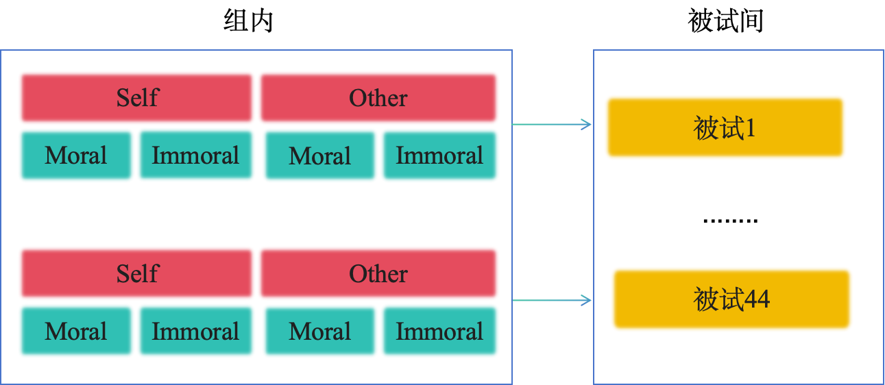
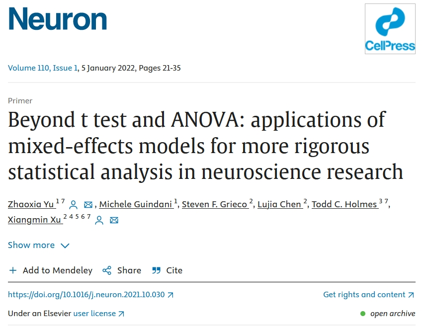
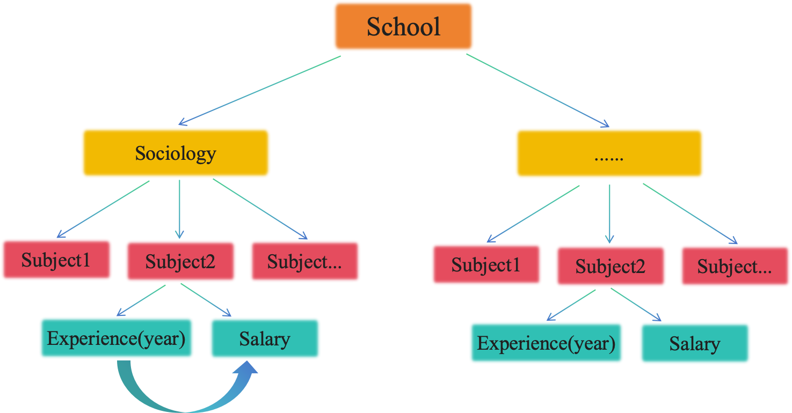
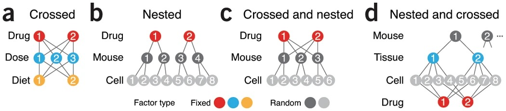
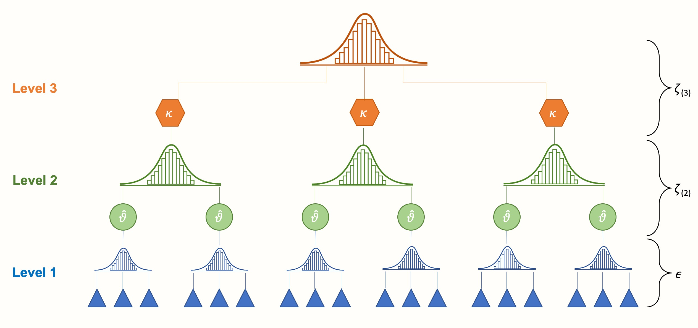
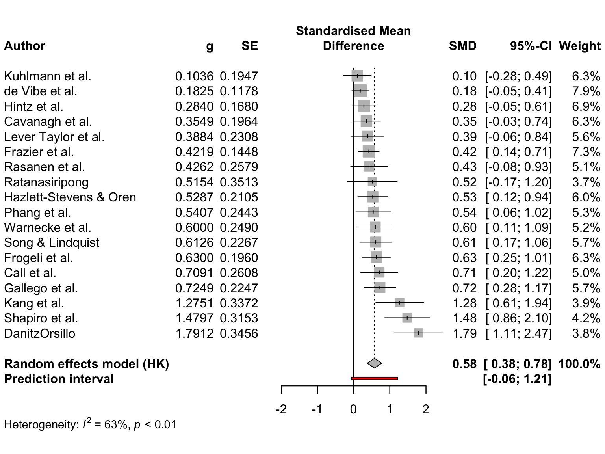

class: center, middle
<span style="font-size: 50px;">**第十章**</span> <br>
<span style="font-size: 50px;">回归模型(二)：分层线性模型</span> <br>
<span style="font-size: 30px;">胡传鹏</span> <br>
<span style="font-size: 20px;"> </span> <br>
<span style="font-size: 30px;">2026/5/14</span> <br>
<span style="font-size: 20px;"> Made with Rmarkdown</span> <br>

---
```{r setup, include=FALSE}
knitr::opts_chunk$set(
  message = FALSE,
  warning = FALSE,
  fig.align = 'center',
  fig.height=6, fig.width=7.5,
  fig.retina=2
)
```


```{css extra.css, echo=FALSE}
.bigfont {
  font-size: 30px;
}
.size5{
font-size: 24px;
}
.tit_font{
font-size: 60px;
}

```


## 准备工作
```{r }
# Packages
if (!requireNamespace('pacman', quietly = TRUE)) {
    install.packages('pacman')
}

pacman::p_load(
  # 本节课需要用到的 packages
  here, tidyverse, 
  # ANOVA & HLM
  bruceR, lmerTest, lme4, broom, afex, interactions,
  # 生成课件
  xaringan, xaringanthemer, xaringanExtra, knitr)

options(scipen=99999,digits = 5)
```


---
class: inverse, middle ,center


#  一般线性模型回顾


---
# 0.1 线性模型与方差分析等价性

<br>

|       | R自带函数 | 线性模型 | 解释 |
|-------|-------|-------|-------|
| 单样本*t* | t.test(y, mu = 0) | lm(y ~ 1)| 仅有截距的回归模型 |
| 独立样本*t* | t.test( $y_1$, $y_2$) | lm(y ~ 1 + $G_2$)| 自变量为二分变量的回归模型 |
| 配对样本*t* | t.test( $y_1$, $y_2$, paired=T)  | lm( $y_1$ - $y_2$ ~ 1)| 仅有截距的回归模型)|
| 单因素ANOVA | aov(y ~ G) | lm(y ~ 1 + $G_1$ + $G_2$ + ...)| 一个离散自变量的回归模型 |
| 多因素ANOVA | aov(y ~ G * S) | lm(y ~ $G_1$ + $G_2$ + ... + $S_1$ + $S_2$ + ...)| 多个离散自变量的回归模型 |

<br>
<br>


---
# 0.2 虚拟编码(indicator coding)

```{r xaringan-panelset, echo=FALSE}
xaringanExtra::use_panelset()
```

.panelset[
.panel[.panel-name[预处理]
```{r preprocessing}
df.penguin <- bruceR::import(here::here('slides', 'data', 'penguin', 'penguin_rawdata.csv')) %>%
  dplyr::mutate(subjID = row_number()) %>%
  dplyr::select(subjID,Temperature_t1, Temperature_t2, socialdiversity, 
                Site, DEQ, romantic, ALEX1:ALEX16) %>%
  dplyr::filter(!is.na(Temperature_t1) & !is.na(Temperature_t2) & !is.na(DEQ)) %>%
  dplyr::mutate(romantic = factor(romantic, levels = c(1,2), 
                                  labels = c("恋爱", "单身")),  # 转化为因子
                Temperature = rowMeans(select(., starts_with("Temperature"))))

# 设定相应的标签
breaks <- c(0, 35, 50, 66.5)
labels <- c('热带', '温带', '寒温带')
# 创建新的变量
df.penguin$climate <- cut(df.penguin$DEQ, 
                          breaks = breaks, 
                          labels = labels)
```


.panel[.panel-name[虚拟编码]

```{r}
# 比较不同气候条件下个体的体温是否存在差异：
## 虚拟编码
contrasts(df.penguin$climate) <- stats::contr.treatment(unique(df.penguin$climate))
### contr.treatment本质上创建了一个矩阵
### 由于3个分组，所以矩阵为2列


## 建立回归模型
lm_temp <- stats::lm(Temperature ~ climate,data = df.penguin)

```

.panel[.panel-name[结果]

.pull-left[

```{r}
## 输出回归系数
lm_temp %>% 
  tidy() %>% 
  select(1:3) %>% 
  mutate(across(where(is.numeric),
                ~round(., 3)))
```

]

.pull-right[

```{r}
## 可以看到回归的结果以热带为基准，系数则为均值之差
df.penguin %>% 
  group_by(climate) %>% 
  summarise(mean = mean(Temperature)) %>% 
  as.data.frame() 
```
]


]]]]


.footnote[

----------
虚拟编码方式很多，可参考[这里](https://stats.oarc.ucla.edu/r/library/r-library-contrast-coding-systems-for-categorical-variables/)
]


---
class: center, middle, inverse
<span style="font-size: 55px;">重复测量方差分析与回归模型 </span> 


---
# 1 重复测量方差分析
## 1.1 数据与问题介绍

.size5[
以match_raw.csv为例，一个2x2的被试内实验设计（Identity: Self vs. Other) x Valence: Moral vs. Immoral)），我们希望知道这两种条件之下被试的反应时是否存在显著差异]

.panelset[
.panel[.panel-name[预处理]
```{r}
mt_raw <- bruceR::import(here::here('slides', 'data','match','match_raw.csv'))

mt_raw <- mt_raw %>% 
  tidyr::extract(Shape, 
                 into = c("Valence", "Identity"),
                 regex = "(moral|immoral)(Self|Other)",
                 remove = FALSE)
```

.panel[.panel-name[数据展示]
```{r echo=FALSE}
head(mt_raw[3:12],5) %>% DT::datatable()
```

]]]


---
## 1.2 数据结构

```{r echo=FALSE, out.width='70%'}

```

<br>
.size5[
-   将总变异分解为组间与组内

-   组内变异是主要关注对象，组间变异则要被控制
]


---
## 1.3 重复测量方差分析的实现

.panelset[
.panel[.panel-name[ANOVA-bruceR]
```{r warning=FALSE}

mt_mean <- mt_raw %>%
      dplyr::filter(!is.na(RT) & Match == "match" & ACC == 1) %>%
      dplyr::group_by(Sub,Identity,Valence) %>%
      dplyr::summarise(RT = mean(RT)) %>%
      dplyr::ungroup()

##  本例为长数据
##  RUN IN CONSOLE!
##  球形检验输出：
bruceR::MANOVA(data = mt_mean,
               subID = 'Sub', # 被试编号
               dv= 'RT',      # dependent variable
               within = c('Identity', 'Valence')) %>%
      capture.output() %>% 
      .[c(33:37)]


```


.panel[.panel-name[ANOVA-bruceR(输出)]
```{r warning=FALSE}
bruceR::MANOVA(data = mt_mean,
               subID = 'Sub',
               dv = 'RT',
               within = c('Identity', 'Valence')) %>%
      capture.output() %>% .[c(15:31)]
```


.panel[.panel-name[ANOVA-afex]
```{r }
## bruceR::MANOVA 是对afex的封装
m_aov <- afex::aov_ez(
      data = mt_mean,
      id = 'Sub',
      dv = 'RT',
      within = c('Identity', 'Valence'))

m_aov
```

]]]]


---
# 1.4 重复测量方差分析的不足

.bigfont[
重复测量方差分析有没有局限性？
]

--
<br>
.bigfont[
-   个体间差异同样无法估计；
]

.bigfont[
-   处理缺失值只能将整行观测删除，会导致标准误增加、功效降低；
]

.bigfont[
-   对因变量(连续)和自变量(分类)的类型有要求；
]


.bigfont[
-   对每一个试次中数据利用率低，造成试次的浪费
]


<br>

---
# 1.4 重复测量方差分析的不足

.bigfont[
重复测量方差分析有没有局限性？
]

```{r echo=FALSE, out.width='45%'}

```

.bigfont[

*因此，现在越来越多的期刊推荐使用多层线性回归(Hierarchical Linear Model) ，如[Neuron](https://www.sciencedirect.com/science/article/pii/S089662732100845X)。*
]


---
# 2 多层线性模型(HLM)简介


.size5[
分层线性模型/多层线性模型(HLM): 用于处理"多层嵌套数据"，在一个以上层次上变化参数的线性模型。但多层线性模型的名字非常多，不同学科称呼不同，有许多“近义词”：]

    -   层级/分层模型（Hierarchical Model，HM）  
    
    -   多水平模型（Multilevel Model，MLM）
    
    -   线性混合模型（Linear Mixed Model）
    
    -   混合效应模型（Mixed Effects Model）
    
    -   随机效应模型（Random Effects Model）
    
    -   随机系数模型（Random Coefficients Model）.....


.size5[

但在注意与多元回归(multiple regression)进行区分，即逐步引入自变量到回归模型中，以检验每个自变量对因变量的影响是否独立于其他自变量
]

---
layout: true
# 2.1 多层线性模型(HLM)的关键概念：固定效应与随机效应

---
.size5[
在回归模型中一般会在截距和斜率上分别讨论**固定效应**和**随机效应**。

例如，关于研究教师的工龄(Experience)与薪水(Salary)之间是否存在关系。在某校随机抽取了5个学院的教师信息，具体数据如下：]
<br>

```{r echo=FALSE}
## 创建虚拟数据
set.seed(999)
departments <- c('sociology', 'biology', 'english', 'informatics', 'statistics')
base.salaries <- c(40000, 50000, 60000, 70000, 80000)
annual.raises <- c(2000, 500, 500, 1700, 500)
faculty.per.dept <- 20
total.faculty <- faculty.per.dept * length(departments)

# Generate dataframe of faculty and (random) years of experience
ids <- 1:total.faculty
department <- rep(departments, faculty.per.dept)
experience <- floor(runif(total.faculty, 0, 10))
bases <- rep(base.salaries, faculty.per.dept) * runif(total.faculty, .9, 1.1) # noise
raises <- rep(annual.raises, faculty.per.dept) * runif(total.faculty, .9, 1.1) # noise
df <- data.frame(ids, department, bases, experience, raises)

# Generate salaries (base + experience * raise)
df <- df %>% mutate(
    salary = bases + experience * raises
)
```


```{r echo=FALSE}
df %>% 
      mutate(across(where(is.numeric),~round(.,3))) %>% 
      head(6) %>% 
      DT::datatable()
```


```{r echo=FALSE}
# Model without respect to grouping
m0 <- stats::lm(salary ~ experience, data=df)

df$simple.model <- predict(m0)

# Model with varying intercept
m1 <- lme4::lmer(salary ~ experience + (1|department), data = df)

df$random.intercpet.preds <- predict(m1)

# 可能会碰到错误
# remove.packages("Matrix")
# remove.packages("lme4")
# install.packages("lme4", type = "source")

# Model with varying slope
m2 <- lme4::lmer(salary ~ experience + (0 + experience|department), data=df)

df$random.slope.preds <- predict(m2)

# Model with varying slope and intercept
m3 <- lme4::lmer(salary ~ experience + (1 + experience|department), data=df)

df$random.slope.int.preds <- predict(m3)
```


.footnote[
----------
数据来源见[这里](https://github.com/mkfreeman/hierarchical-models/blob/master/generate-data.R)
]


---
layout: true
## 2.2 固定效应(fixed effects)与随机效应(random effects)

---

.size5[问题：是否可用工龄预测某个学校员工的工资？]

.panelset[
.panel[.panel-name[数据结构]
```{r echo=FALSE,out.width='80%'}

```


.panel[.panel-name[OLS]

```{r echo=FALSE}
###  plot
df %>% 
  ggplot(aes(x = experience,y = salary)) + 
  geom_point(aes(x = experience,
                 y = salary,color = department),
             size = 5,alpha = 0.5) + 
  geom_smooth(method = 'lm',color = 'black',se=F,size = 0.5)  + 
  labs(x = 'Experience',y = 'Salary',legends = 'Department') + 
  scale_colour_discrete('Department') +
  bruceR::theme_bruce()
```


]]]


---

.size[
似乎可以。但有两个问题：

-   不同学院的底薪有可能存在差异（存在/不存在）

-   不同学院间间，工资与工龄的关系存在差异（存在/不存在）

这意味有可能会出现四种情况
]

--
<br>
.size[

对应在图中，则会在截距与斜率之间出现差异：

1.    不同学院的底薪相同，工资涨幅也相同；（截距不随分组变化，斜率不随分组变化）

2.    不同学院间底薪不同，但工资涨幅相同；（截距根据分组变化，斜率不随分组变化）

3.    不同学院间底薪相同，但工资涨幅不同；（截距不随分组变化，斜率根据分组变化）

4.    不同学院间底薪和工资涨幅都不相同。（截距、斜率均根据分组而变化）

画图看看.
]


---

.panelset[
.panel[.panel-name[fixI-fixS]
```{r echo=FALSE}
###  plot
df %>% 
      ggplot(aes(x = experience,y = salary)) + 
      geom_point(aes(x = experience,
                     y = salary,
                     color = department),
                 size = 5, alpha = 0.5) + 
      geom_smooth(method = 'lm',color = 'black',se=F) + 
      labs(x = 'Experience',y = 'Salary',legends = 'Department') + 
      scale_colour_discrete('Department') +
      ggtitle("Fixed Slope and Intercept") +
      bruceR::theme_bruce()
```


.panel[.panel-name[ranI-fixS]

```{r echo=FALSE}
df %>% 
      ggplot() +
      geom_point(data = df,
                 aes(x = experience,y = salary,
                     color = department),
                 size = 5,alpha = 0.4) + 
      geom_line(aes(x=experience, y=random.intercpet.preds,
                    group = department, 
                    colour = department)) +
      labs(x="Experience", y="Salary") +
      ggtitle("Varying Intercept") + 
      scale_colour_discrete('Department') +
      bruceR::theme_bruce()
```


.panel[.panel-name[fixI-ranS]

```{r echo=FALSE}
df %>%
      ggplot() +
      geom_point(
            data = df,
            aes(x = experience, y = salary, color = department),
            size = 5,
            alpha = 0.4) +
      geom_line(aes(
            x = experience,
            y = random.slope.preds,
            group = department,
            colour = department)) +
      labs(x = "Experience", y = "Salary") +
      ggtitle("Varying Slope") +
      scale_colour_discrete('Department') +
      bruceR::theme_bruce()
```

.panel[.panel-name[ranI-ranS]

```{r echo=FALSE}
df %>%
      ggplot(aes(x = experience, y = salary, color = department)) +
      geom_point(size = 5, alpha = 0.4) +
      geom_smooth(method = 'lm', se = F, size = 0.5) +
      labs(x = "Experience", y = "Salary") +
      ggtitle("Varying Slope and Intercept") +
      bruceR::theme_bruce() 
```


]]]]]


---
layout: false
## 2.3 两种数据结构的比较
.size5[
无论在我们的数据中，还是刚才的数据中，其实都出现了层级或嵌套关系；只是对于match数据，每个变量都嵌套在一个被试中，而每个被试都可视为一条回归线。
]

.panelset[
.panel[.panel-name[两种效应]

.size5[
-   固定效应代表了总体水平上的效应，即它们在不同分组（可能是个体、群体或条件）之间的影响是一致的，如match数据中Identity和Valence在所有被上总体的效应。

-   随机效应则表示了在不同分组中变化的效应/参数。

- 这两个术语的使用非常混乱，需要看到模型本身的代码进行判断，不可盲目相关文字描述。
]


.panel[.panel-name[match_data]
```{r echo=FALSE,out.width='70%'}

```

.panel[.panel-name[shcool]
```{r echo=FALSE,out.width='80%'}

```
]]]]


---
.size5[
对于match数据，类比与学校员工薪水数据，我们也可以设想：

-   不同被试总体上会不会存在反应时上的差异：有些个体普遍反应速度更快，而有些反应速度普遍更慢（随机截距）

-   在自我条件下，两种Valence的差异是否完全相同？还是会有个体差异？（随机斜率）


画图尝试一下，计算被试平均反应时后进行排序，选取首尾的几名被试：
]

```{r echo=FALSE,fig.height=5.8}
mt_sample_df <- mt_raw %>%
      dplyr::filter(Match == 'match' & ACC == 1) %>%
      dplyr::filter(Sub %in% c(7311, 7313, 7307, 7324)) %>%
      dplyr::mutate(
            Sub = factor(Sub),
            Identity = factor(Identity, levels = c("Self", "Other")),
            Valence = factor(Valence, levels = c("moral", "immoral"))
      )

mt_sample_df %>%
      dplyr::filter(Identity == 'Self') %>%
      ggplot(aes(x = Valence, color = Valence, y = RT))  +
      geom_point(position = position_jitter(0.2), alpha = 1) +
      stat_summary(
            fun.y = "mean",
            geom = "point",
            shape = 18,
            size = 4,
            color = "darkred"
      ) +
      stat_summary(
            fun.y = "mean",
            geom = "line",
            aes(group = 1),
            color = "darkred"
      ) +
      facet_wrap( ~ Sub, nrow = 1) +
      scale_color_brewer(palette = 'Accent') +
      theme_bw(base_size = 13)
```


---
# 3 多层线性模型的应用
## 3.1 基本形式

.size5[
我们使用lme4包对多层线性模型建模，具体语句形式如下：
]

<br>
```{r eval=FALSE, highlight=TRUE}
fit <- lme4::lmer(
      data =   , 
      formula = DV ~ Fixed_Factor + (Random_intercept + Random_Slope | Random_Factor)) #<<
```
<br>
--
.size5[
注：

-   **但在建立模型之前，需要思考模型中的总体水平和随着分组变化的效应分别是什么**。一般推荐至少添加变化的截距，也有推荐一开始就让斜率随着分组变化；

-   另外，由于分组变化的效应可以视为从某些总体中抽样的离散单位，因而是分类变量
]


---
## 3.2 建立模型

.panelset[
.panel[.panel-name[ranI]
```{r}
## 变化截距 固定斜率
model <- lme4::lmer(data = mt_raw, RT ~ Identity * Valence + (1 | Sub))

```


.size5[
-   Identity\*Valence:  \*表示两变量间所有可能的形式，等同与Identity + Valence + Identity:Valence

-   (1|Sub): 1表示随机截距（0则表示截距不根据分组变化）； 管道(|)右侧Sub为分组变量
]


.panel[.panel-name[ranI ranS]

```{r }
## 随机截距 随机斜率
model_full <- lme4::lmer(data = mt_raw, 
                         RT ~ Identity * Valence + (1 + Identity * Valence |Sub)) 
```


.size5[
-   Identity \* Valence:  \*表示两变量间所有可能的形式，等同与Identity + Valence + Identity:Valence

-   (1|Sub): 1表示随机截距（0则表示截距不根据分组变化）； 管道(|)右侧Sub为分组变量
]

.panel[.panel-name[模型比较]
```{r}
## 模型比较
stats::anova(model, model_full) %>% capture.output()
```

<br>
<br>
<br>

------
注：模型比较的指标、计算方法及其优劣请参考[《认知建模中模型比较的方法》](https://journal.psych.ac.cn/xlkxjz/CN/10.3724/SP.J.1042.2024.01736)

]]]]

---

## 3.3 两层HLM的公式表达

.size5[
**第一层（个体内）**：$Y_{ij} = \beta_{0j} + \beta_{1j}X_{ij} + r_{ij}$

-   $Y_{ij}$：第$j$组第$i$个个体的观测值
-   $\beta_{0j}$：第$j$组的截距
-   $\beta_{1j}$：第$j$组的斜率
-   $r_{ij}$：个体内残差
]

.size5[
**第二层（组间）**：
$$\beta_{0j} = \gamma_{00} + \gamma_{01}W_j + u_{0j}$$
$$\beta_{1j} = \gamma_{10} + \gamma_{11}W_j + u_{1j}$$

-   $\gamma_{00}$：总体截距
-   $\gamma_{01}$：组-level变量$W_j$对截距的效应
-   $u_{0j}, u_{1j}$：组-level残差
]

---

## 3.4 综合公式

.size5[
将两层公式合并，得到**综合公式**：

$$Y_{ij} = \gamma_{00} + \gamma_{10}X_{ij} + \gamma_{01}W_j + \gamma_{11}(X_{ij} \times W_j) + u_{0j} + u_{1j}X_{ij} + r_{ij}$$

各项含义：
-   $\gamma_{00}$：总体截距
-   $\gamma_{10}$：$X$对$Y$的固定效应
-   $\gamma_{01}$：$W$对截距的效应
-   $\gamma_{11}$：$X \times W$交互效应
-   $u_{0j}, u_{1j}$：随机效应（组间变异）
-   $r_{ij}$：残差（个体内变异）
]

---

## 3.5 HLM vs OLS：核心区别

.pull-left[
.size5[
**OLS回归假设**：
-   所有观测值相互独立
-   残差同方差
-   单一误差项

**忽略嵌套结构的风险**：
-   标准误被低估
-   Type I 错误率膨胀
-   效应估计不准确
]
]

.pull-right[
.size5[
**HLM/MLM优势**：
-   正确处理组内相关
-   同时估计个体和组效应
-   可以检验跨层交互作用
-   提供组间变异估计
]
]

---

## 3.6 ICC（组内相关系数）

.size5[
**ICC计算公式**：
$$\ICC = \frac{\sigma^2_u}{\sigma^2_u + \sigma^2_r}$$

**判断标准**：
-   ICC > 0.05 时，建议使用HLM
-   ICC越大，组间变异越重要

**ICC的意义**：
-   表示总变异中有多少是由组间差异解释的
-   ICC = 0.1 表示10%的变异来自组间差异
]

---

## 3.7 随机效应结构选择

.size5[
| 模型 | 随机效应 | 适用场景 |
|------|----------|----------|
| 模型1 | `(1 | Sub)` | 随机截距模型 |
| 模型2 | `(1 + X | Sub)` | 随机截距+斜率 |
| 模型3 | `(1 + X || Sub)` | 随机截距，独立斜率 |
| 模型4 | `(X || Sub)` | 仅随机斜率 |

**模型比较工具**：
-   `anova()`：似然比检验
-   `broom.mixed::glance()`：提取模型拟合指标
]

---

## 3.8 结果解读

.size5[
**固定效应解读**（与普通回归相同）：
-   回归系数表示$X$对$Y$的影响
-   p值检验该效应是否显著

**随机效应解读**：
-   `VarCorr()`：查看方差成分
-   $\sigma^2_u$：组间变异
-   $\sigma^2_r$：残差（组内变异）

**模型评估**：
-   AIC/BIC：越小越好
-   收敛警告：简化随机效应结构
]

---

## 3.9 练习：使用match数据分析SPE

.size5[
**研究问题**：自我优势效应(SPE)是否受Match条件调节？

**练习要求**：
1.  计算每个被试在各条件下的平均RT
2.  建立HLM模型：`RT ~ Identity * Match + (1 | Sub)`
3.  解释固定效应和随机效应
4.  比较有无随机斜率模型的差异

**提示**：
-   Identity: Self vs Other
-   Match: match vs mismatch
-   使用`lme4::lmer()`函数
]

---

## 3.10 似然比检验

.panelset[
.panel[.panel-name[问题]
.size5[
在建立模型后，我们希望知道固定效应大小是否显著，但由于多层线性模型中对于自由度的估计有多种方法，比较复杂，所以lme4::lmer()中没有提供显著性。
]

.panel[.panel-name[anova]
```{r}
# 建立没有固定效应的“空模型”
model_null <- lme4::lmer(data = mt_raw,
                   RT ~ (1 + Identity*Valence|Sub))

## 根据似然比进行模型比较
stats::anova(model_full, model_null)

```


.panel[.panel-name[mixed]

在模型非常复杂时（多层嵌套），如果仅仅只想对固定效应进行检验，可以使用afex::mixed()，设置method 参数为 LRT(Likelihood-ratio tests)

```{r highlight=TRUE}
afex::mixed(data = mt_raw,
            RT ~ Identity * Valence + (1 + Identity*Valence|Sub),
            method = 'LRT')
```


.panel[.panel-name[lmerTest]

lmerTest是一个与lme4包兼容的包，主要用于对混合效应模型进行假设检验；其中也包含了lmerTest::lmer()函数，与lme4::lmer()不同的是，其结果报告了显著性（使用Satterthwaite分母自由）

```{r}
lmer_model <- lmerTest::lmer(data = mt_raw,
                             RT ~ Identity * Valence + (1 + Identity * Valence|Sub))
# summary(lmer_model)

# 如果使用lmerTest包进行建模，可以使用bruceR::HLM_summary()进行输出
##  RUN IN CONSOLE
# HLM_summary(lmer_model)
```

]]]]]


---
## 3.4 模型解读

.panelset[
.panel[.panel-name[变化的效应]
注意：
-   相关矩阵会体现自变量效应在个体上的差异，尤其是第一列(截距与斜率的相关)，而具体的解释也应考虑对应固定效应系数本身的正负；  

-   有可能会提供天花板与地板效应的相关信息，如任务过于简单，数据变化较小，有可能出现截距与斜率为负相关。

```{r echo=FALSE}
summary(model_full) %>% capture.output() %>% .[c(11:18)]
```


.panel[.panel-name[固定效应]

```{r echo=FALSE}
## 使用lme4::lmer()并没有返回显著性
## 其中也报告了交互效应
summary(model_full) %>% capture.output() %>% .[c(20:25)]
```


.panel[.panel-name[交互效应的可视化]
```{r fig.height=5,fig.width=6}
## 一种快捷的方法
interactions::cat_plot(model = model_full,
                       pred = Identity,
                       modx = Valence)
```


]]]]


---
## 3.5 模型等价性

.size5[
如果我们观察一下使用lme4::lmer()的结果与重复测量结果，可以发现存在差异：
]


.panelset[
.panel[.panel-name[anova]


```{r}
m_aov
```

.panel[.panel-name[lme4]
```{r}
## 使用lme4建立的模型
model_full %>% anova()
```

.panel[.panel-name[lmerTest]


```{r}
## 使用lmerTest建立的模型
lmer_model %>% anova()
```


]]]]


---

```{r }
# http://www.dwoll.de/rexrepos/posts/anovaMixed.html#two-way-repeated-measures-anova-rbf-pq-design
model_aov <- mt_mean %>%
  lmerTest::lmer(
   data = .,
   RT ~ Identity * Valence + (1|Sub) + (1|Identity:Sub) + (1|Valence:Sub)
 )

model_aov %>% anova()
```


---
#  4 HLM的应用


.size5[
HLM 非常复杂，本节课仅以重复测量为例，下面提供了一些其他的应用场景：
]


.panelset[
.panel[.panel-name[嵌套数据]

```{r echo=FALSE}

```
.panel[.panel-name[元分析1]

通过综合一组研究来评估效应量的大小。由于不同研究的结果之间往往涉及到不同质的群体或不同的实验条件。

```{r echo=FALSE, out.width="85%"}

```

.panel[.panel-name[元分析2]
```{r echo=FALSE, out.width="60%"}

```

]]]]


---
# 5 可能遇到的问题

.size5[
-   模型不收敛：[混合线性模型的实现](https://zhuanlan.zhihu.com/p/63092231)

-   自由度问题：[多层线性模型（HLM）及其自由度问题](https://zhuanlan.zhihu.com/p/50048784)  

-   [统计学中的固定效应 vs. 随机效应](https://zhuanlan.zhihu.com/p/60528092)

-   [「固定效应、主效应、简单效应」概念辨析](https://zhuanlan.zhihu.com/p/513227882)
]


---

class: center, middle
.tit_font[
附录：给 LLM 的提问延伸模板
]

<br>

.size5[
把下面 4 组提示词当作“可复制的提问脚手架”。重点不是立刻生成 `lmer()` 代码，而是先用第 9/10 章术语把问题问清楚。
]


---
# A. 概念解释型：先讲清楚，再决定要不要代码

.size5[
适用情境：我分不清**嵌套结构**、**交叉分类结构**、**虚拟编码**分别在解决什么问题。

**不够好的问法**：
-   “帮我写一个 HLM。”

**更好的问法**：
]

```text
我正在学习第9/10章的多层线性模型与虚拟编码。请你不要直接给我完整 `lmer()` 代码，而是先用课程术语解释下面三个概念的区别：
1. 嵌套结构（nested data / nested multilevel structure）
2. 交叉分类模型（cross-classified model）
3. 虚拟编码（indicator coding）

请按以下顺序回答：
- 先说明每个概念回答的是“数据结构问题”还是“编码表示问题”
- 再说明它最容易和什么概念混淆
- 最后给一个心理学研究中的微型例子

如果我的问题里缺少关键背景，请先问我，而不是直接进入代码。
```


---
# B. 研究设计判断型：先判断结构，再决定模型方向

.size5[
适用情境：我有一个研究设计，但不确定它更像**嵌套**还是**交叉分类**，以及分类变量是否涉及**虚拟编码**。
]

```text
我想让你帮我判断研究设计，而不是直接写模型。

请根据第9/10章术语，判断我的设计更接近：
- 嵌套结构
- 交叉分类结构
- 仅仅是分类变量需要做虚拟编码

请按下面步骤和我互动：
1. 先复述你理解到的层级单位、被试单位、刺激单位、分组单位
2. 如果信息不够，请先向我提问补足
3. 明确指出：这里的问题是“观测值如何组织”，还是“分类变量如何编码”，还是两者都有
4. 只有在结构判断清楚后，才简要建议下一步分析方向

请避免一上来就给出完整 `lmer()` 语法，除非我明确要求代码。
```


---
# C. 概念纠错型：专门纠正“层级结构”和“编码方式”混淆

.size5[
适用情境：我已经形成了一个想法，但担心自己把**模型结构**和**虚拟编码**混为一谈。
]

```text
下面是我目前的理解，请你不要直接迎合我，而是检查我有没有“概念层级混淆”：

[把你自己的理解贴在这里]

请你完成四件事：
1. 标出我说得对的部分
2. 标出我把“嵌套结构 / 交叉分类结构”和“虚拟编码”混淆的地方
3. 用第9/10章术语重写一版更准确的表述
4. 如果你认为我缺少某个前提，请先问我，不要直接跳到完整代码

如果要举例，请优先用“被试、项目、班级、教师、刺激材料”这类常见心理学设计语言。
```


---
# D. 延迟代码型：只有我确认后才进入 `lmer()`

.size5[
适用情境：我最终可能需要代码，但希望 LLM **先解释、再判断、最后才写**。
]

```text
我希望你分阶段帮助我，暂时不要直接写完整 `lmer()` 代码。

阶段1：先判断我的问题属于嵌套结构、交叉分类结构、虚拟编码，还是它们的组合。
阶段2：如果信息不足，请先连续提问，直到你能清楚区分数据结构与编码问题。
阶段3：先用自然语言给出分析思路，包括固定效应、随机效应、以及分类变量编码各自扮演什么角色。
阶段4：只有在我回复“请给代码”之后，你再开始给出逐步的 `lmer()` 或相关 R 代码。

如果你发现我把“虚拟编码”误当成一种模型结构，请直接纠正我。
如果你发现我把“交叉分类”误当成“多因素固定效应设计”，也请直接指出。
```


---

class: center, middle
.tit_font[
思考
]
<br>
<span style="font-size: 50px;">当因变量不服从正态分布(如ACC)时如何处理？</span> <br>
