class: center, middle
<span style="font-size: 50px;">**第十一章**</span> <br>
<span style="font-size: 50px;">回归模型(三)：广义线性模型</span> <br>
<span style="font-size: 30px;">胡传鹏</span> <br>
<span style="font-size: 20px;"> </span> <br>
<span style="font-size: 30px;">2026-05-21</span> <br>
<span style="font-size: 20px;"> Made with Rmarkdown</span> <br>

---
```{r setup, include=FALSE}
knitr::opts_chunk$set(
  message = FALSE,
  warning = FALSE,
  fig.align = 'center',
  fig.height=6, fig.width=7.5,
  fig.retina=2
)
```

```{css extra.css, echo=FALSE}
.bigfont {
  font-size: 30px;
}
.size5{
font-size: 24px;
}
.tit_font{
font-size: 60px;
}

```

```{r, echo = FALSE}
## 准备工作
# Packages
if (!requireNamespace('pacman', quietly = TRUE)) {
    install.packages('pacman')
}

pacman::p_load(
  # 本节课需要用到的 packages
  here, tidyverse, ggplot2,
  # ANOVA & HLM
  bruceR, lmerTest, lme4, broom, afex, interactions, easystats, caret, pROC,
  # 生成课件
  xaringan, xaringanthemer, xaringanExtra, knitr)

options(scipen=99999,digits = 5)
```

```{r, echo = FALSE}
#读取数据
df.match <- bruceR::import(here::here('slides', 'data','match','match_raw.csv')) %>% 
  tidyr::extract(Shape, 
                 into = c('Valence', 'Identity'),
                 regex = '(moral|immoral)(Self|Other)',
                 remove = FALSE) %>% #将Shape列分为两列
  dplyr::mutate(Valence = factor(Valence, levels = c('moral','immoral'), labels = c('moral','immoral')),
                Identity = factor(Identity, levels = c('Self','Other'), labels = c('Self','Other'))) %>%
  dplyr::filter(ACC == 0 | ACC == 1, 
                RT >= 0.2 & RT <= 1.5,
                Match == 'match',
                (!Sub %in% c(7302,7303,7338))
                )#筛选
```

```{r, echo = FALSE}
df.match.aov <- df.match %>%
  dplyr::group_by(Sub, Valence, Identity) %>%
  dplyr::summarise(mean_ACC = mean(ACC)) %>%
  dplyr::ungroup()
```

```{r xaringan-panelset, echo=FALSE}
xaringanExtra::use_panelset()
```

---
class: center, middle
.tit_font[
当因变量不服从正态分布(如正确率)时如何处理？
]
---
.panelset[
.panel[.panel-name[df.match]
```{r}
head(df.match[c(3,11:17)],5) %>% DT::datatable()
```

]
.panel[.panel-name[df.match.aov]
```{r}
df.match.aov %>%
  dplyr::select(1:4) %>%
  head(5) %>% 
  DT::datatable()
```

]
]
---
.tit_font[Contents]
<br>
<br>
.bigfont[
    11.1 广义线性模型<br>
<br>
    11.2 二项分布<br>
<br>
    11.3 代码实操<br>
<br>
    11.4 方法比较<br>
<br>
    11.5 其他分布<br>
]
---
#11.1 广义线性模型(Generalized Linear Model, GLM)
##多元线性回归（Multiple Linear Regression）
<br>
.normal[
$$Y = b_0 + b_{1}X_{1} + b_{2}X_{2} +... + b_{p}X_{p} + \epsilon$$
- $Y$ : 因变量，Dependent variable
- $X_i$ : 自变量，Independent (explanatory) variable
- $b_0$ : 截距，Intercept
- $b_i$ : 斜率，Slope
- $\epsilon$ : 残差，Residual (error)
]
---
#11.1 广义线性模型(Generalized Linear Model, GLM)
##线性模型的组成部分
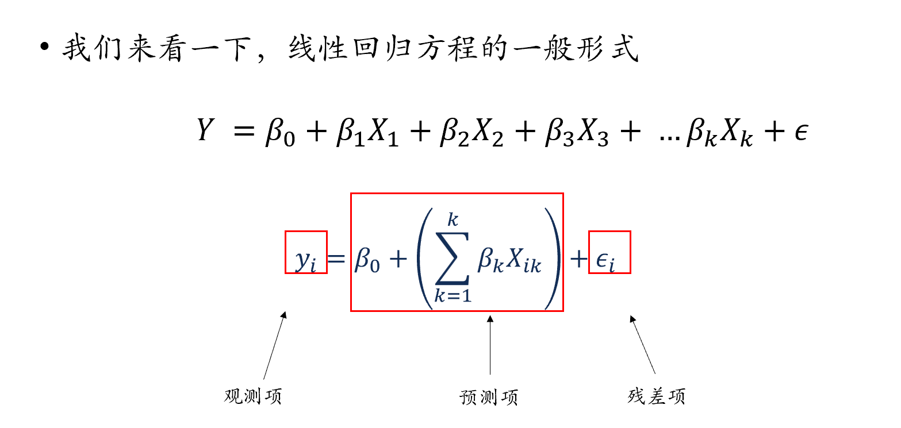
---
#11.1 广义线性模型(Generalized Linear Model, GLM)
##线性模型的组成部分
```{r echo=FALSE, out.width='60%'}
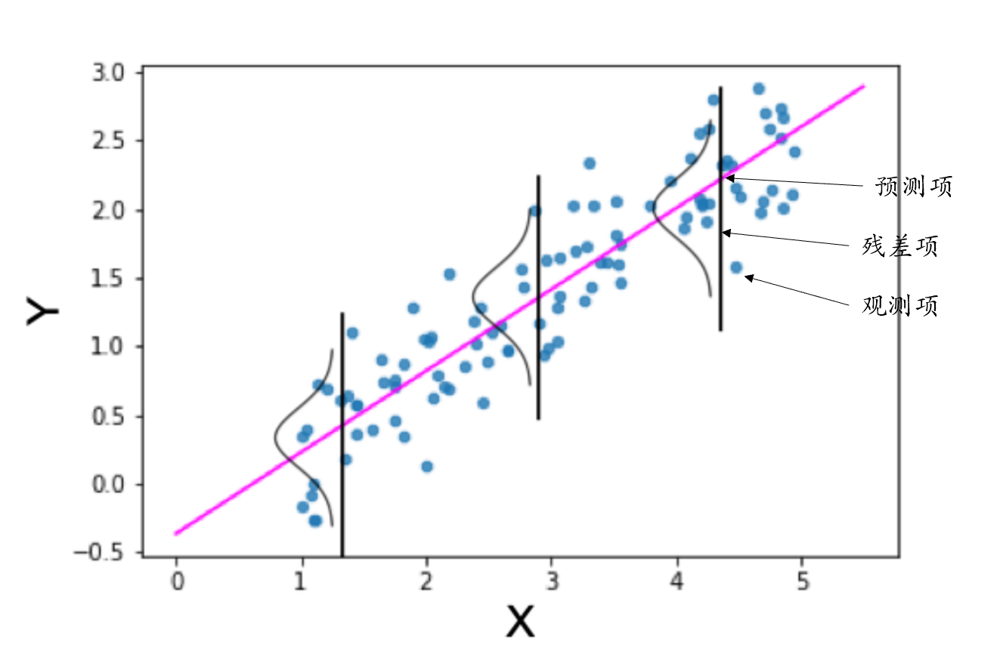
```

---
#11.1 广义线性模型(Generalized Linear Model, GLM)
##回归方程的多种形式<br>
.bigfont[
- 简单线性回归：
$$Y = b_0+b_1 X_1+ b_2 X_2+…+b_p X_p + \epsilon$$ 
- 线性代数表达：
$$y_i = b_0 + b_1 X_{i1} + b_2 X_{i2} + … + b_p X_{ip} + \epsilon$$ 
- 矩阵表达：
$$Y= X\beta + \epsilon$$
- 代码表达(r)：
$$Y \sim X_1 + X_2 + ... + X_n$$
]
---
#11.1 广义线性模型(Generalized Linear Model, GLM)
##回归方程的多种表达形式<br>
<br>
.bigfont[
- 回归模型形式：观测项 = 预测项 + 误差项 <br>
- 假定观测项是正态分布，上述公式可以重新表达为： <br>
$$y \sim N(\mu, \epsilon)$$ 
  <br>
  其中, $\mu$为预测值，即
  <br>
  $$μ = \beta_0 + \beta_1 x$$
- 观测值服从以预测项为均值的**正态分布**，观测值与预测值之间的差值就是残差。<br>
]
--

.bigfont[
如果因变量不服从正态分布，如何构建回归模型？
]
---
#11.1 广义线性模型(Generalized Linear Model, GLM)

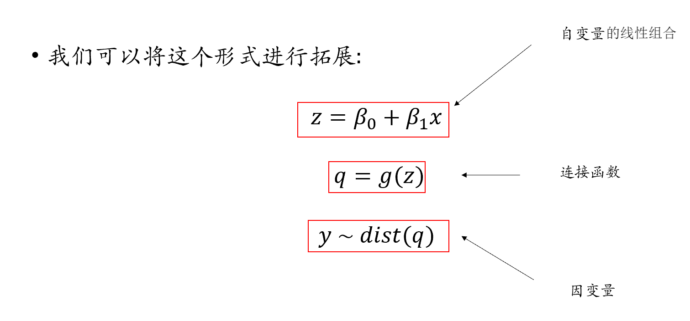
---
#11.1 广义线性模型(Generalized Linear Model, GLM)
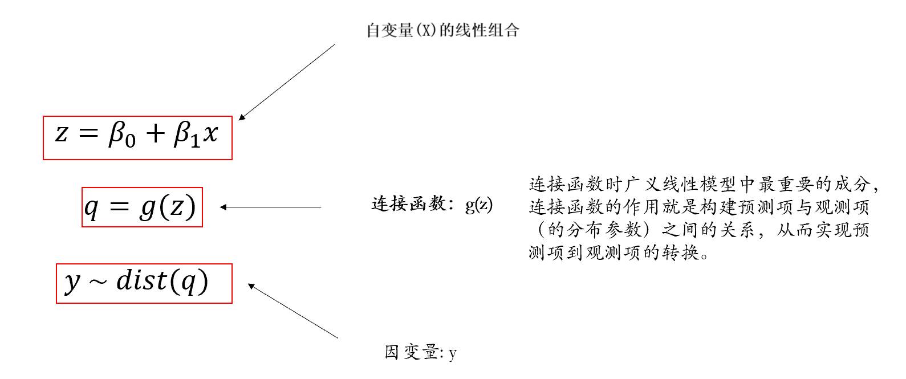

---
#11.1 广义线性模型(Generalized Linear Model, GLM)
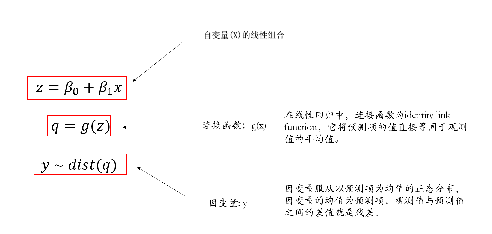

---
#11.1 广义线性模型(Generalized Linear Model, GLM)
##Generalized Linear Model, GLM
###在简单线性回归中，预测项的连接函数等于它本身
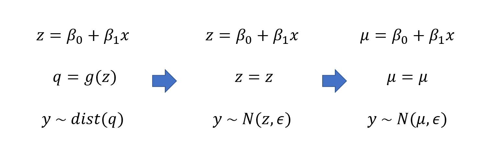
---
#11.1 广义线性模型(Generalized Linear Model, GLM)
.bigfont[
- 简单线性模型可视为GLM的特殊形式，预测项的连接函数等于它本身，观测项为正态分布。
- 在广义线性模型中：
  - 观测项不一定是正态分布（残差不一定是正态分布）
  - 连接函数不等于其自身

- 广义线性模型，能够对非正态分布的因变量进行建模
]
---
#11.2 二项分布(Binomial Distribution)
##伯努利试验
<br>
.bigfont[
- 同样的条件下重复地、相互独立地进行的一种随机试验。
<br>
<br>
- 该随机试验只有两种可能结果：发生或者不发生。
<br>
<br>
- 假设该项试验独立重复地进行了n次，那么就称这一系列重复独立的随机试验为n重伯努利试验(n-fold bernoulli trials)。
<br>
<br>
- n次独立重复的伯努利试验的概率分布服从二项分布
]
---
#11.2 二项分布(Binomial Distribution)
.bigfont[
- 每次试验中事件A发生的概率为*p*
<br><br>
- X表示*n*重伯努利试验中事件A发生的次数，X的可能取值为0，1，…，*n*
<br><br>
- 对每一个k($0 \le k \le n$), 事件{X = k} 指"*n*次试验中事件A恰好发生k次"
<br><br>
- 随机变量X服从以*n*, *p*为参数的二项分布，写作 $X \sim B(n, p)$ 
<br><br>
- $p \in [0,1]$, $n \in N$ 

$$P(X=k )=𝐶_𝑛^𝑘 𝑝^𝑘 𝑞^{𝑛−𝑘}= 𝐶_𝑛^𝑘 𝑝^𝑘 (1−𝑝)^{𝑛−𝑘}$$
$$𝐶_𝑛^𝑘= 𝑛!/𝑘!(𝑛−𝑘)! $$
]
---
#11.2 二项分布(Binomial Distribution)
##抛硬币
```{r, echo=FALSE}
simulate_coin_toss <- function(prob_head, num_people, num_tosses) {
  # 初始化一个向量来存储每个人正面朝上的总次数
  total_heads <- rep(0, num_people)
  # 模拟每个人抛硬币的次数，并计算正面朝上的总次数
  for (i in 1:num_people) {
    tosses <- rbinom(num_tosses, size = 1, prob = prob_head)
    total_heads[i] <- sum(tosses)
  }
  
  # 绘制直方图
  hist(total_heads, main = "Coin Toss Results for All People", xlab = "硬币正面朝上的次数", ylab = "人数", col = 'white', border = 'black', breaks = seq(min(total_heads), max(total_heads) + 1, by = 1), xlim = c(0,max(total_heads) + 1))
  
  # 返回每个人正面朝上的总次数
}
```

.panelset[
.panel[.panel-name[5人，每人10次]
```{r}
simulate_coin_toss(prob_head = 0.5,num_people = 5, num_tosses = 10)
```

]
.panel[.panel-name[10人，每人10次]

```{r}
simulate_coin_toss(prob_head = 0.5,num_people = 10, num_tosses = 10)
```

]
.panel[.panel-name[1000人，每人10次]

```{r}
simulate_coin_toss(prob_head = 0.5,num_people = 1000, num_tosses = 10)
```

]
]

---
#11.2 二项分布(Binomial Distribution)
.bigfont[
- 已知一次试验中的每次尝试中事件A发生的概率*p*，共进行*n*次独立重复的伯努利试验
- 事件A在一次试验中出现k次，事件A在*n*次试验中出现次数的平均数
$$（𝑘_1+𝑘_2+𝑘_3+...+𝑘_𝑛/𝑛)$$
- 当*n* → ∞，*p* ≠ *q*，*np* ≥ 5且*nq* ≥ 5，事件A在*n*次试验中出现次数的平均数：
$$\mu = np$$
- 事件A出现次数所属分布的标准差：
$$ \sigma = \sqrt{𝑛𝑝𝑞}$$
]
---
#11.2 二项分布(Binomial Distribution)
## 如何将z与二分变量进行连接？
### (1)将预测项映射到(0,1)之间，例如，使用
$$\frac{1}{1+exp(-z)}$$
### (2)找到一个分布，能根据(0,1)之间的值转成二分变量，例如，伯努利分布。
.pull-left[
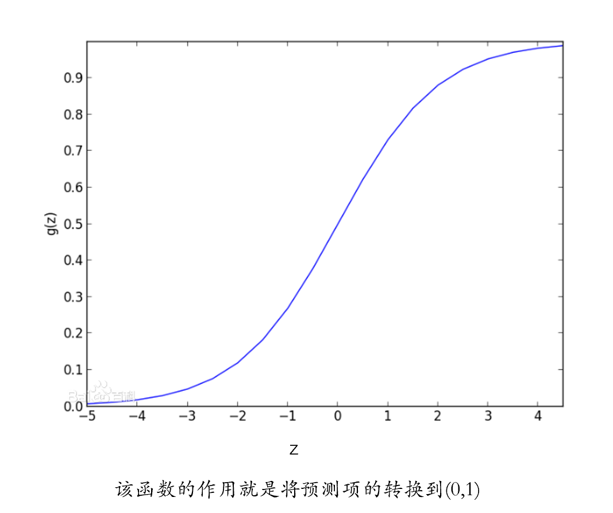
]
.pull-right[
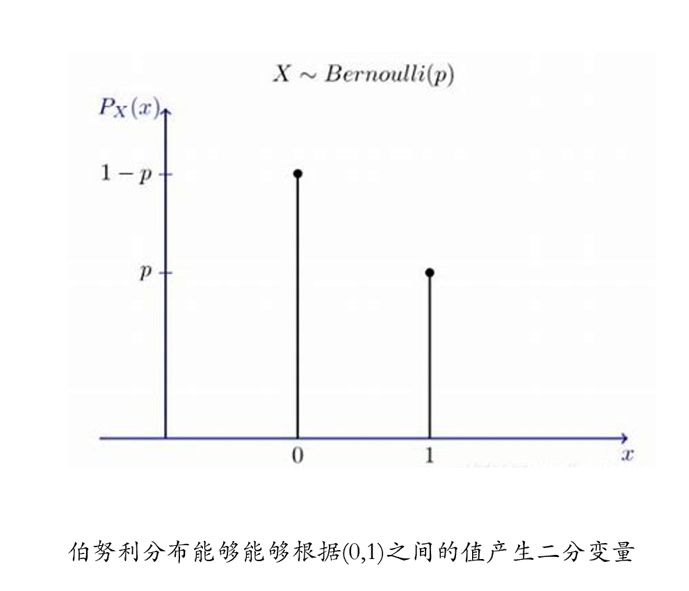
]


---
#11.2 二项分布(Binomial Distribution)
```{r echo=FALSE, out.width='80%'}
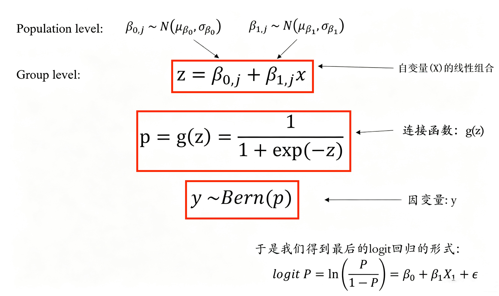
```

---
#11.2 二项分布(Binomial Distribution)
##参数求解
.bigfont[
- 对于logit回归，我们可以使用极大似然估计对其进行求解
- 该求解过程比较复杂，一般由计算机自动完成
]
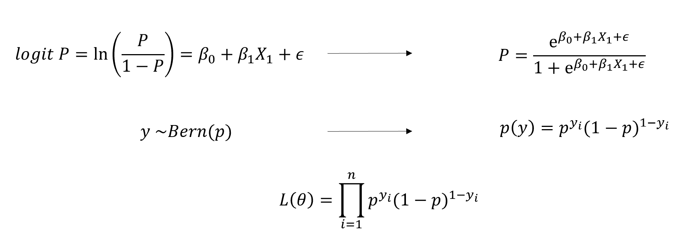
··


---
#11.3 代码实操
##首先分析一个被试的数据
```{r}
df.match.7304 <- df.match %>%
  dplyr::filter(Sub == 7304) #选择被试7304
mod_7304_full <- stats::glm(data = df.match.7304, #数据
                          formula = ACC ~ 1 + Identity * Valence, #模型
                          family = binomial) #因变量为二项分布
summary(mod_7304_full) %>% #查看模型信息
  capture.output() %>% .[c(6:11,15:19)] #课堂展示重要结果
```

---
#11.3 代码实操

.panelset[
.panel[.panel-name[mod_null]
```{r}
#无固定效应
mod_null <- lme4::glmer(data = df.match, #数据
                   formula = ACC ~ (1 + Identity * Valence|Sub), #模型
                   family = binomial) #因变量二项分布
#performance::model_performance(mod_null)
summary(mod_null) %>%
  capture.output()%>% .[c(7:8,14:24)]
```

]
.panel[.panel-name[mod]
```{r}
#随机截距，固定斜率
mod <- lme4::glmer(data = df.match, #数据
                     formula = ACC ~ 1 + Identity * Valence + (1|Sub), #模型
                     family = binomial) #因变量二项分布
#performance::model_performance(mod)
summary(mod) %>%
  capture.output() %>% .[c(7:8,14:24,28:32)]
```

]
.panel[.panel-name[model_full]
```{r}
#随机截距，随机斜率
mod_full <- lme4::glmer(data = df.match, #数据
                          formula = ACC ~ 1 + Identity * Valence + 
                            (1 + Identity * Valence | Sub), #模型
                          family = binomial) #因变量二项分布
##performance::model_performance(mod_full)
summary(mod_full) %>%
  capture.output() %>% .[c(6:8,13:18,21:26,30:34)]
```

]
.panel[.panel-name[模型比较anova]
```{r}
stats::anova(mod_null, mod, mod_full) #比较三个模型
```

]
.panel[.panel-name[模型比较compare_performance]
```{r,results='hide'}
performance::compare_performance(mod_null, mod, mod_full, rank = TRUE, verbose = FALSE)
```

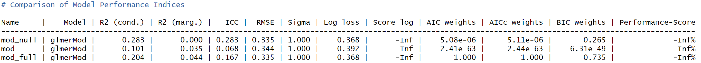
]
]

---
#11.3 代码实操
##结果解读
```{r}
summary(mod_full) %>% capture.output() %>% .[c(21:27)]
```

```{r echo=FALSE, out.width='60%'}
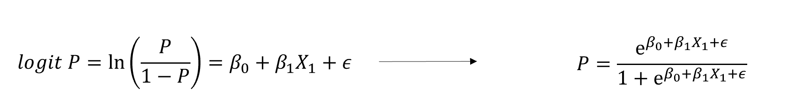
```
.pull-left[
- MoralSelf:
$P=\frac{e^{2.77}}{1+e^{2.77}} = 0.941$
<br>
- ImmoralSelf:
$P=\frac{e^{2.77-1.15}}{1+e^{2.77-1.15}} = 0.835$
]
.pull-right[
- MoralOther:
$P=\frac{e^{2.77-0.87}}{1+e^{2.77-0.87}} = 0.870$
<br>
- ImmoralOther:
$P=\frac{e^{2.77-0.87-1.15+0.99}}{1+e^{2.77-0.87-1.15+0.99}} = 0.851$
]
---
#11.3 代码实操

```{r}
#交互作用
interactions::cat_plot(model = mod_full,
                       pred = Identity,
                       modx = Valence)
```


---
#11.4 方法比较

.panelset[
.panel[.panel-name[anova]
```{r, results = 'hide'}
res <- bruceR::MANOVA(data = df.match.aov, #数据
       subID = 'Sub', # 被试编号
       dv= 'mean_ACC', # 因变量
       within = c('Identity', 'Valence')) #自变量（被试内）
```

```{r}
capture.output(res) %>% .[3:8]
```

]
.panel[.panel-name[EMMAMNS]
```{r}
res %>%
  bruceR::EMMEANS(effect = 'Valence', by = 'Identity') %>%
  capture.output()
```

]
.panel[.panel-name[GLM]
```{r}
stats::anova(mod_full)
```

]
.panel[.panel-name[HLM]


```{r}
mod_anova <- lme4::lmer(
  data = df.match,
  formula = ACC ~ 1 + Identity * Valence + 
    (1 + Identity * Valence | Sub))
stats::anova(mod_anova)
```

]
.panel[.panel-name[HLM_mean]
```{r}
mod_mean <- lme4::lmer(
  data = df.match.aov,
  formula = mean_ACC ~ 1 + Identity * Valence + 
    (1 | Sub) + (1 | Identity:Sub) + (1 | Valence:Sub))
stats::anova(mod_mean)

```

]
.panel[.panel-name[compare]
```{r, results='hide'}
performance::compare_performance(mod_full, mod_anova, rank = TRUE, verbose = FALSE)
```

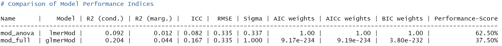

```{r}
stats::anova(mod_full, mod_anova)
```

]
]

---
#11.4 方法比较
## 交叉验证法(Cross-Validation)
```{r model prediction}
# 设置种子以确保结果的可重复性
set.seed(456)

# 随机选择70%的数据作为训练集，剩余的30%作为测试集
train_index <- caret::createDataPartition(df.match$Sub, p = 0.7, list = FALSE)
train_data <- df.match[train_index, ]
test_data <- df.match[-train_index, ]

# 根据训练集生成模型
model_full <- lme4::glmer(data = train_data,
                          formula = ACC ~ 1 + Identity * Valence + 
                            (1 + Identity * Valence | Sub), 
                          family = binomial)
model_anova <- lme4::lmer(data = train_data,
                          formula = ACC ~ 1 + Identity * Valence + 
                            (1 + Identity * Valence | Sub))

# 使用模型进行预测
pre_mod_full <- stats::predict(model_full, newdata = test_data, type = 'response')
pre_mod_anova <- stats::predict(model_anova, newdata = test_data)

```


---
#11.4 方法比较
## 留出法
.pull-left[
```{r}
# 计算模型的性能指标
performance_mod_full <- c(RMSE = sqrt(mean((test_data$ACC - pre_mod_full)^2)),
                R2 = cor(test_data$ACC, pre_mod_full)^2)
# 打印性能指标
print(performance_mod_full)
```
]
.pull-right[
```{r}
# 计算模型的性能指标
performance_mod_anova <- c(RMSE = sqrt(mean((test_data$ACC - pre_mod_anova)^2)),
                R2 = cor(test_data$ACC, pre_mod_anova)^2)

# 打印性能指标
print(performance_mod_anova)
```

]

---
#11.4 方法比较
## 留出法
```{r}
# 将预测概率转换为分类结果
predicted_classes <- ifelse(pre_mod_full > 0.5, 1, 0)
# 计算混淆矩阵
confusion_matrix <- caret::confusionMatrix(
  as.factor(predicted_classes), 
  as.factor(test_data$ACC))

```

---
#11.4 方法比较
## 留出法
```{r}
# 打印混淆矩阵和性能指标
print(confusion_matrix)
```

---
#11.4 方法比较
## 留出法
.pull-left[
```{r}
# 计算ROC曲线和AUC
roc_result <- pROC::roc(test_data$ACC, pre_mod_full)
print(roc_result)
```
]
.pull-right[
```{r}
# 绘制ROC曲线
plot(roc_result, main = "ROC Curve", col = "blue", lwd = 2)
abline(a = 0, b = 1, lty = 2) # 添加对角线
```

]
---
#11.4 方法比较
## 重复测量分析的不足
.bigfont[
- 会产生难以解释的结果
  - 假设在10个回答中，正确回答8次，错误回答2次
  - 此时95%CI为[0.52,1.08] ( = 0.8 ± 0.275)
- 方差不齐，不满足方差分析基本假设

$$\mu = np$$
$$𝜎 = √(𝑛𝑝𝑞 )$$
$$𝜎_p^2 = \frac{p(1-p)}{n}$$
]
Jaeger, T. F. (2008). Categorical data analysis: Away from ANOVAs (transformation or not) and towards logit mixed models. *Journal of Memory and Language, 59*(4), 434-446. doi:http://dx.doi.org/10.1016/j.jml.2007.11.007


---
#11.5 其他分布
##泊松分布(Poisson distribution)
.bigfont[
- 在固定时间间隔或空间区域内发生某种事件的次数的概率。
- 适用于事件以恒定平均速率独立发生的情况
- 例如电话呼叫、网站访问、机器故障等。
$$P(X = k) = \frac{e^{-\lambda} \lambda^k}{k!}$$
- λ:事件在给定时间或空间内的平均发生率（或平均数量）。
- k:可能的事件发生次数，可以是0, 1, 2, …
]
---
#11.5 其他分布
##泊松分布(Poisson distribution)

```{r}
set.seed(123) # 设置随机种子以获得可重复的结果
random_samples <- rpois(1000, lambda = 5)
hist(random_samples,col = 'white', border = 'black',)
```

---
#11.5 其他分布
##泊松分布(Poisson distribution)
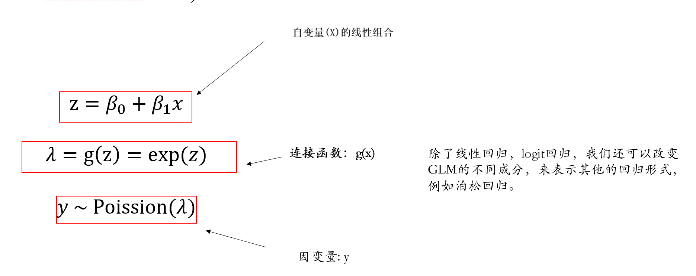
---
#11.5 其他分布
##伽马分布(Gamma distribution)
<br>
.bigfont[
- 伽马分布（Gamma Distribution）是统计学的一种连续概率函数，是概率统计中一种非常重要的分布。
- “指数分布”和“卡方分布”都是伽马分布的特例。
$$f(x | \alpha, \beta) = \frac{\beta^\alpha x^{\alpha-1} e^{-\beta x}}{\Gamma(\alpha)}$$
- α:形状参数（shape parameter），决定了分布的曲线形态，尤其是峰值的位置和曲线的尖峭程度。
- β:尺度参数（scale parameter），影响分布的宽度；当尺度参数增大时，分布会变得更宽且矮平；尺度参数减小时，分布会变得更窄且高耸。
]
---
#11.5 其他分布
##伽马分布(Gamma distribution)
```{r echo=FALSE, out.width='60%'}
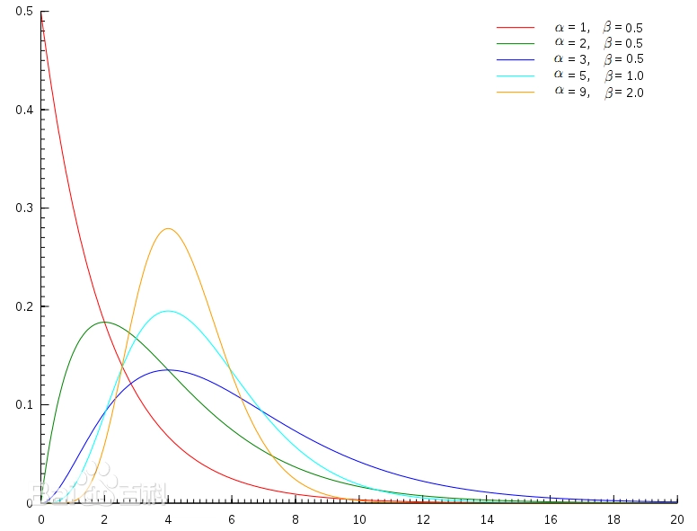
```

---

# 补充内容: easystats系统包的简介
```{r echo=FALSE, out.width='60%'}

```

<br>
<br>
<center>
https://www.bilibili.com/video/BV1rz421D7iJ/?spm_id_from=333.337.search-card.all.click
</center>

---

class: center, middle
.tit_font[
思考
]
<br>
<span style="font-size: 50px;">信号检测论是否可以用广义线性模型分析？</span> <br>

---

#11.6 课堂练习
## 共同框架：我们到底在建模什么？

.bigfont[
- 两种方法面对的是同一个核心问题：
  - “被试是否报告 `yes`？”
- 传统 SDT：
  - 先把数据压缩成 hit rate 和 false alarm rate。
  - 再把两个概率转换成 z 分数。
  - `d'` 反映 signal 和 noise 分布的可分性。
  - criterion 反映反应偏向。
- GLM：
  - 直接对 trial-level 的 `yes/no` 反应建模。
  - 使用二项分布：`family = binomial`。
  - 如果使用 probit link，模型可以和传统 SDT 的 z 分数表达联系起来。
- 传统 SDT 是先汇总再转换；GLM 是直接建模二分类反应。
]

---
#11.6 课堂练习
## 一个最小可执行的数据例子

```{r sdt-data-demo, echo=TRUE}
set.seed(123)

# 构造一个最小的信号检测数据
# stimulus: 0 = noise, 1 = signal
# response: 0 = no,    1 = yes

n_noise  <- 100
n_signal <- 100

sdt_data <- data.frame(
  stimulus = c(rep(0, n_noise), rep(1, n_signal)),
  response = c(
    rbinom(n_noise,  size = 1, prob = 0.20),
    rbinom(n_signal, size = 1, prob = 0.75)
  )
)

sdt_data$stimulus_label <- factor(
  sdt_data$stimulus,
  levels = c(0, 1),
  labels = c("noise", "signal")
)

sdt_data$response_label <- factor(
  sdt_data$response,
  levels = c(0, 1),
  labels = c("no", "yes")
)

head(sdt_data)

table(sdt_data$stimulus_label, sdt_data$response_label)
```

---
#11.6 课堂练习
## 方法一：传统 SDT 计算

```{r traditional-sdt-demo, echo=TRUE}
# hit rate: signal 出现时回答 yes 的比例
H <- mean(sdt_data$response[sdt_data$stimulus == 1])

# false alarm rate: noise 出现时回答 yes 的比例
FA <- mean(sdt_data$response[sdt_data$stimulus == 0])

# 避免 H 或 FA 恰好等于 0 或 1，导致 qnorm() 出现 Inf
adjust_rate <- function(p, n) {
  if (p == 0) return(0.5 / n)
  if (p == 1) return((n - 0.5) / n)
  return(p)
}

H_adj  <- adjust_rate(H,  n_signal)
FA_adj <- adjust_rate(FA, n_noise)

# 传统 SDT 指标
d_prime <- qnorm(H_adj) - qnorm(FA_adj)

criterion <- -0.5 * (qnorm(H_adj) + qnorm(FA_adj))

traditional_sdt <- data.frame(
  hit_rate = H,
  false_alarm_rate = FA,
  d_prime = d_prime,
  criterion = criterion
)

traditional_sdt
```

.size5[
- `hit rate` 是 signal 条件下回答 `yes` 的比例。
- `false alarm rate` 是 noise 条件下回答 `yes` 的比例。
- `d' = z(H) - z(FA)`
- `c = -\frac{1}{2}[z(H) + z(FA)]`
- `d'` 越大，说明 signal 和 noise 越容易区分。
- criterion 越大，说明被试越保守；criterion 越小，说明被试越倾向回答 `yes`。
]

---
#11.6 课堂练习
## 方法二：用 GLM 分析同一组数据

```{r glm-sdt-demo, echo=TRUE}
# 用 probit GLM 建模 yes/no 反应
# response 是 0/1，因此使用 binomial family

glm_sdt <- glm(
  response ~ stimulus,
  data = sdt_data,
  family = binomial(link = "probit")
)

coef(glm_sdt)
```

```{r compare-sdt-glm-demo, echo=TRUE}
beta0 <- coef(glm_sdt)[1]
beta1 <- coef(glm_sdt)[2]

comparison <- data.frame(
  method = c("Traditional SDT", "Probit GLM"),
  d_prime_or_stimulus_effect = c(d_prime, beta1),
  criterion_or_intercept_based_index = c(criterion, NA)
)

comparison
```

.size5[
- `response` 是 0/1 二分类变量，所以使用 `family = binomial`。
- `stimulus` 的 GLM 系数表示 signal 相对 noise 时，被试回答 `yes` 的潜在倾向增加了多少。
- 在 `link = "probit"` 下，模型系数是在标准正态 z 分数尺度上表达的。
- 传统 SDT 的 `d'` 来自 `qnorm(H) - qnorm(FA)`。
- probit GLM 的 `stimulus` 系数也是在标准正态尺度上表达 signal 与 noise 的差异。
- 在这个最简单的 `yes/no` 信号检测任务中，`stimulus` 系数可以和传统 SDT 的 `d'` 对照理解。
- 二者数值应当接近，但不一定完全相同。
]

---
#11.6 课堂练习
## 比较：两种方法的相同点与不同点

.pull-left[
.bigfont[
相同点：

- 都在分析被试是否报告 `yes`。
- 都可以描述 signal 与 noise 的可分性。
- 在简单 `yes/no` 任务中，probit GLM 的 `stimulus` 系数可以和 `d'` 对照理解。
]
]
