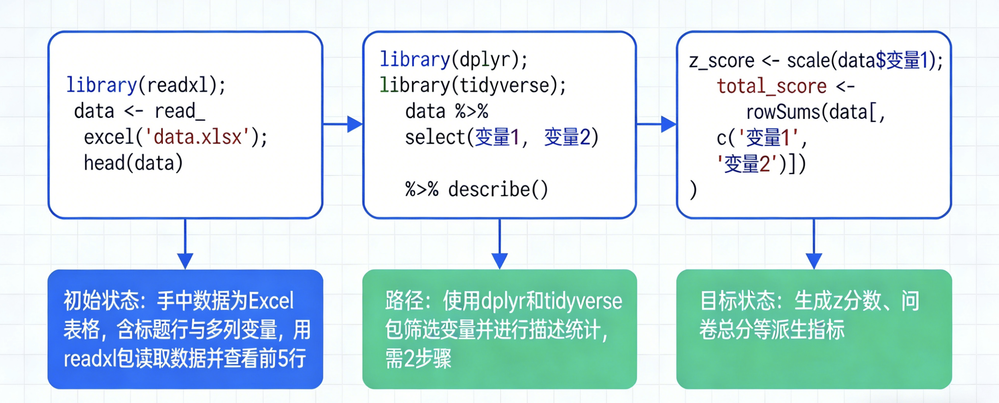

class: center, middle
<span style="font-size: 60px;">第六章</span> <br>
<span style="font-size: 45px;">从了解软件到基础统计分析——基于Tidyverse和dplyr的数据预处理</span> <br>
<br>
<span style="font-size: 30px;">胡传鹏</span> <br>
<span style="font-size: 25px;">2026-04-09</span>

---

class: center, middle
<span style="font-size: 50px;">回顾：R语言中的对象</span> <br>

---

# 1.1 数据类型

R语言中的基本数据类型：

.font-size-14[
| 类型 | 说明 | 示例 |
|------|------|------|
| 数值型 (numeric) | 整数或小数 | `1`, `3.14`, `10L` |
| 字符型 (character) | 文本，用引号 | `"男"`, `"hello"` |
| 逻辑型 (logical) | 真或假 | `TRUE`, `FALSE` |
]

.font-size-14[
```r
# 查看数据类型
class(x)
is.numeric(x); is.character(x); is.logical(x)
```
]

---

# 1.2 数据结构回顾

.font-size-14[
| 结构 | 说明 | 创建方式 |
|------|------|----------|
| 向量 (Vector) | 一维同类型数据 | `c()`, `1:10`, `seq()` |
| 矩阵 (Matrix) | 二维同类型数据 | `matrix()` |
| 数据框 (Data Frame) | 二维不同类型列 | `data.frame()` |
| data.table | 增强型数据框 | `data.table()` |
]

---

# 1.3 向量的基本操作

.font-size-14[
```r
# 创建向量
v <- c(1, 2, 3, 4, 5)
v <- 1:10
v <- seq(1, 10, by = 2)

# 索引
v[1]; v[1:3]; v[-1]; v[v > 3]

# 运算
v + 10; v * 2
sum(v); mean(v); sd(v)
```
]

---

# 1.4 数据框的基本操作

.font-size-14[
```r
# 创建数据框
df <- data.frame(id = 1:3, name = c("张三", "李四", "王五"), 
                 age = c(25, 30, 28))

# 访问
df$name; df[, "name"]; df[1, ]

# 编辑
df$age[df$age < 30] <- 29
df$pass <- TRUE
```
]


---

class: center, middle
<span style="font-size: 50px;">数据分析：从问题出发</span> <br>

---

# 2.1 从“问题解决”角度进行数据分析

.pull-left[
.font-size-14[
**初始状态（Initial State）**
- 我手中的数据是什么样子的？
- 数据结构如何？有哪些变量？

**路径（Path）**
- 有哪些包/函数可以使用？
- 需要几个步骤？

**目标状态（Goal State）**
- 派生指标有哪些？
- 我想要什么样的结果？
]
]

.pull-right[

]

---

# 2.2 初始状态：我有什么数据？

.font-size-14[
**常见数据格式与导入方式：**

| 数据格式 | R函数 | 示例 |
|----------|-------|------|
| CSV | `read.csv()`, `read_csv()`, `fread()` | `fread("data.csv")` |
| Excel | `readxl::read_excel()` | `read_excel("data.xlsx")` |
| SPSS | `haven::read_spss()` | `read_spss("data.sav")` |
| R格式 | `readRDS()` | `readRDS("data.rds")` |
]

.font-size-14[
```r
# 推荐：使用bruceR包一键导入
library(bruceR)
df <- bruceR::import(here::here("slides", "data", 
                 "penguin", "penguin_rawdata.csv"))
```
]

---

# 2.3 路径规划：常用R包

.font-size-14[
| 分析目的 | 核心R包 | 常用函数 |
|----------|---------|----------|
| 数据导入 | readr, data.table, haven | `read_csv()`, `fread()` |
| 数据清洗 | dplyr, tidyr | `filter()`, `select()`, `mutate()` |
| 数据汇总 | dplyr | `group_by()`, `summarise()` |
| 数据重塑 | tidyr | `pivot_wider()`, `pivot_longer()` |
| 数据可视化 | ggplot2 | `ggplot()` |
]

---

# 2.4 目标状态：常见派生指标

.font-size-14[
| 指标类型 | 计算方法 | R代码示例 |
|----------|----------|-----------|
| 问卷总分 | 各项求和 | `rowSums(across(starts_with("Q")))` |
| 问卷均分 | 各项求均值 | `rowMeans(across(starts_with("Q")))` |
| Z分数 | 标准化 | `(x - mean(x)) / sd(x)` |
| 反向计分 | 6 - 原始分 | `mutate(Q1 = 6 - Q1)` |
| 分组统计 | 按组计算 | `group_by(group) %>% summarise(mean(x))` |
]

---

class: center, middle
<span style="font-size: 50px;">理解数据的基本形态</span> <br>

---

# 3.1 单个数据

单个数据是最基本的R对象，可以是数值、字符或逻辑值。

.font-size-14[
```r
# 数值型
x <- 3.14
class(x)        # "numeric"
is.numeric(x)   # TRUE

# 字符型
name <- "张三"
class(name)     # "character"

# 逻辑型
is_adult <- TRUE
class(is_adult) # "logical"

# 基本运算
x + 10          # 数学运算
nchar(name)     # 字符长度
!is_adult       # 逻辑非
```
]

---

# 3.2 一组数据

向量是一组相同类型数据的集合，是R中最基本的数据结构。

.font-size-14[
```r
# 创建向量
scores <- c(85, 92, 78, 88, 90)
ages <- 20:30
seq(1, 10, by = 2)
rep("A", times = 3)

# 向量索引
scores[1]              # 第一个元素
scores[1:3]           # 前三个元素
scores[scores > 85]    # 条件索引

# 向量运算
scores + 10            # 每个元素加10
scores > 85           # 返回逻辑向量
sum(scores > 85)      # 计数

# 统计函数
mean(scores); sd(scores); summary(scores)
```
]

---

# 3.3 数据框

数据框是R中最重要的数据结构，用于存储表格数据（行为观测，列为变量）。

.font-size-14[
```r
# 创建数据框
df <- data.frame(
  id = 1:3,
  name = c("张三", "李四", "王五"),
  age = c(25, 30, 28),
  score = c(85, 92, 78)
)

# 查看结构
str(df)      # 数据结构
head(df)     # 前几行
summary(df)  # 描述统计

# 访问列
df$name      # 美元符号
df[, "name"] # 中括号
df[["name"]] # 双中括号
```
]

---

# 3.4 数据框的基本操作

.font-size-14[
```r
# 添加新列
df$pass <- df$score >= 85

# 修改数据
df$age[df$age < 30] <- 29

# 选择多列
df[, c("name", "score")]
```
]

---

# 3.4 数据框的基本操作（续）

.font-size-14[
```r
# 筛选行（条件）
df[df$age > 25, ]
df[df$name == "张三", ]

# 添加行
new_row <- data.frame(
  id = 4, name = "赵六", age = 27,
  score = 80, pass = TRUE
)
df <- rbind(df, new_row)
```
]

---

class: center, middle
<span style="font-size: 50px;">数据预处理第一步：了解数据</span> <br>

---

# 4.1 查看数据的基本信息

拿到数据后，首先需要了解数据的"长相"。

.font-size-14[
```r
# 查看数据维度
dim(df)          # 返回 c(行数, 列数)
nrow(df)         # 行数（观测数）
ncol(df)         # 列数（变量数）

# 查看变量名
names(df)        # 所有列名
colnames(df)     # 同上
```
]

---

# 4.1 查看数据的基本信息（续）

.font-size-14[
```r
# 查看数据类型
str(df)          # 每个变量的类型
glimpse(df)      # tidyverse风格

# 查看前几行
head(df)         # 默认前6行
head(df, 10)     # 前10行
tail(df)         # 后几行
```
]

---

# 4.2 查看数据的统计信息

.font-size-14[
```r
# 数值型变量的统计摘要
summary(df)

# 数值型变量的详细统计
mean(df$age)         # 均值
sd(df$age)           # 标准差
median(df$age)       # 中位数
range(df$age)        # 范围

# 查看唯一值
unique(df$name)      # 不重复的值
table(df$name)       # 频数统计
```
]

---

# 4.3 查看数据的缺失值

.font-size-14[
```r
# 检查缺失值
is.na(df)            # 返回逻辑矩阵
sum(is.na(df))       # 总缺失值个数
colSums(is.na(df))  # 每列缺失值个数

# 查看含缺失值的行
df[!complete.cases(df), ]

# 删除含缺失值的行
df_clean <- na.omit(df)
df_clean <- tidyr::drop_na(df)
```
]

---

# 4.4 查看单个变量的信息

.font-size-14[
```r
# 查看某列的数据类型
class(df$age)
typeof(df$age)

# 查看某列的唯一值
unique(df$sex)
levels(df$sex)      # 因子型变量的水平

# 查看某列的分布
table(df$sex)       # 频数
prop.table(table(df$sex))  # 比例
```
]

---

class: center, middle
<span style="font-size: 50px;">实战一：问卷数据处理</span> <br>

---

# 5.1 什么是 tidyverse？

tidyverse 是目前最流行的R语言数据处理套件，由多个核心包组成。

.font-size-14[
| 核心包 | 功能 |
|--------|------|
| dplyr | 数据操作（筛选、选择、修改、分组汇总） |
| tidyr | 数据重塑（长宽转换、缺失值处理） |
| ggplot2 | 数据可视化 |
| readr | 数据导入 |
| stringr | 字符串处理 |
| forcats | 因子型变量处理 |
]

.font-size-14[
**tidyverse：**
- 所有函数的第一个参数都是数据框
- 管道操作符 `%>%` 连接各个步骤
- 语法高度一致，易于学习
]
]

---

# 5.2 dplyr 核心函数一览

dplyr 提供了六个核心函数，可以完成大部分数据操作：

.font-size-14[
| 函数 | 功能 | 类比 |
|------|------|------|
| `filter()` | 筛选行 | SQL的WHERE |
| `select()` | 选择列 | SQL的SELECT |
| `mutate()` | 创建/修改列 | SQL的AS |
| `arrange()` | 排序 | SQL的ORDER BY |
| `group_by()` | 分组 | SQL的GROUP BY |
| `summarise()` | 汇总 | SQL的聚合函数 |
]

.font-size-14[
```r
# 安装和加载
install.packages("tidyverse")
library(tidyverse)
```
]
]

---

# 5.3 管道操作符 %>%：嵌套写法

管道操作符将前一个函数的输出作为下一个函数的输入，使代码更易读。

.font-size-14[
```r
# 原始写法：逐层嵌套，阅读顺序与执行顺序相反
result <- summarise(
  group_by(mutate(df, new_col = old_col * 2), group_var),
  mean_col = mean(new_col),
  .groups = "drop"
)
```
]

---

# 5.3 管道操作符 %>%：管道写法

.font-size-14[
```r
# 管道写法：按执行顺序书写，从左到右阅读
result <- df %>%
  mutate(new_col = old_col * 2) %>%
  group_by(group_var) %>%
  summarise(mean_col = mean(new_col),
           .groups = "drop")
```

**快捷键：** Mac: `Cmd + Shift + M`，Windows: `Ctrl + Shift + M`
]

---

# 5.4 filter()：筛选行

filter() 用于根据条件筛选数据框中的行（观测）。

.font-size-14[
```r
df <- data.frame(
  name = c("张三", "李四", "王五", "赵六"),
  age = c(25, 30, 28, 35),
  score = c(85, 92, 78, 88)
)

# 单条件筛选
df %>% filter(age > 28)

# 多条件筛选（AND）
df %>% filter(age > 28 & score > 80)
df %>% filter(age > 28, score > 80)  # 逗号等价于 &
```
]

---

# 5.4 filter()：更多条件示例

.font-size-14[
```r
# 延续上一页的 df

# OR条件
df %>% filter(age > 30 | score > 85)

# 排除缺失值
df %>% filter(!is.na(age))
```
]

---

# 5.5 select()：选择列

select() 用于选取数据框中的特定列。

.font-size-14[
```r
df <- data.frame(
  id = 1:5,
  name = c("张三", "李四", "王五", "赵六", "钱七"),
  age = c(25, 30, 28, 35, 22),
  score = c(85, 92, 78, 88, 90)
)

# 选择指定列
df %>% select(name, age)

# 排除某些列
df %>% select(-id)

# 选择某范围内的列
df %>% select(name:score)

# 重命名并选择
df %>% select(姓名 = name, 年龄 = age)
```
]

---

# 5.5 select()：按模式选择列

.font-size-14[
```r
# 延续上一页的 df

# 选择列名包含某模式的列
df %>% select(starts_with("a"))    # 以a开头
df %>% select(ends_with("e"))      # 以e结尾
df %>% select(contains("sc"))      # 包含sc
```
]

---

# 5.6 mutate()：创建新变量

mutate() 用于创建新列或修改现有列。

.font-size-14[
```r
df <- data.frame(
  id = 1:3,
  weight = c(60, 70, 80),  # kg
  height = c(170, 165, 180) # cm
)

# 创建新列
df %>% mutate(bmi = weight / (height / 100)^2)

# 同时创建多列
df %>% mutate(
  height_m = height / 100,
  bmi = weight / height_m^2
)
```
]

---

# 5.6 mutate()：条件创建与删除

.font-size-14[
```r
# 延续上一页的 df

# 基于条件创建列
df %>% mutate(
  weight_level = ifelse(weight > 70, "重", "轻")
)

# 删除列
df %>% mutate(weight = NULL)
```
]

---

# 5.7 summarise() 和 group_by()：分组汇总

summarise() 用于计算汇总统计量，group_by() 用于定义分组。

.font-size-14[
```r
df <- data.frame(
  group = c("A", "A", "B", "B", "A"),
  score = c(85, 92, 78, 88, 90)
)

# 不分组汇总
df %>% summarise(mean_score = mean(score), n = n())
```
]

---

# 5.7 summarise() 和 group_by()：分组汇总（续）

.font-size-14[
```r
# 延续上一页的 df

# 分组汇总
df %>%
  group_by(group) %>%
  summarise(
    mean_score = mean(score),
    sd_score = sd(score),
    n = n(),
    .groups = "drop"
  )
```

**提示：** 在 dplyr 1.0+ 版本中，`summarise()` 支持 `.groups` 参数：
- `.groups = "drop"`：自动取消分组（推荐）
- `.groups = "keep"`：保留分组
- `.groups = "drop_last"`：取消最后一个分组
]
]

---

# 5.8 case_when()：条件赋值

case_when() 是 mutate() 的好搭档，用于处理多条件的变量赋值。

.font-size-14[
```r
df <- data.frame(
  score = c(95, 85, 75, 65, 55)
)

# 多条件赋值
df %>%
  mutate(
    grade = case_when(
      score >= 90 ~ "优秀",
      score >= 80 ~ "良好",
      score >= 60 ~ "及格",
      TRUE ~ "不及格"  # 以上都不满足时
    )
  )

# 反向计分示例（5点量表）
df %>%
  mutate(
    Q1_rev = case_when(TRUE ~ 6 - Q1)  # 等价于 6 - Q1
  )
```
]

---

# 5.9 问卷数据处理概述

问卷数据处理的常见步骤：

.font-size-14[
| 步骤 | 说明 | 常用函数 |
|------|------|----------|
| 1. 导入数据 | 读取CSV/Excel/SPSS文件 | `import()`, `fread()` |
| 2. 选择变量 | 选取需要的列 | `select()` |
| 3. 检查类型 | 确保数值型变量正确 | `str()`, `glimpse()` |
| 4. 处理缺失值 | 删除或填补 | `filter()`, `drop_na()` |
| 5. 反向计分 | 反向题目重新计分 | `mutate()`, `case_when()` |
| 6. 计算总分/均分 | 计算量表得分 | `rowSums()`, `rowMeans()` |
| 7. 分组统计 | 按组计算描述统计 | `group_by()`, `summarise()` |
]
]

---

# 5.10 数据导入与初步探索

.font-size-14[
```r
# 加载需要的包
if (!requireNamespace('pacman', quietly = TRUE)) {
    install.packages('pacman')
}
pacman::p_load(bruceR, tidyverse)

# 导入数据
df <- bruceR::import(
  here::here("slides", "data", "penguin", "penguin_rawdata.csv")
)

# 初步探索
dim(df)           # 数据维度
names(df)         # 变量名
head(df)          # 前几行
str(df)           # 数据结构
```
]

---

# 5.11 选择需要的变量

.font-size-14[
```r
# 选择指定列
df2 <- df %>%
  dplyr::select(Site, Sex, age, DEQ,
                ALEX1:ALEX16)

# 选择包含特定模式的列
df2 <- df %>%
  dplyr::select(starts_with("ALEX"))  # 以ALEX开头的列
df2 <- df %>%
  dplyr::select(contains("temp"))     # 包含temp的列

# 排除某些列
df2 <- df %>%
  dplyr::select(-starts_with("PSS"))  # 排除以PSS开头的列
```
]

---

# 5.12 检查和处理数据类型

.font-size-14[
```r
# 查看数据类型
str(df2)

# 转换数据类型
df2 <- df2 %>%
  dplyr::mutate(
    age = as.numeric(age),
    DEQ = as.numeric(DEQ)
  )

# 查看转换后的类型
str(df2)
```
]

---

# 5.13 处理缺失值

.font-size-14[
```r
# 查看每列的缺失值数量
colSums(is.na(df2))

# 删除含有缺失值的行
df2 <- df2 %>%
  tidyr::drop_na()

# 按条件删除缺失值
df2 <- df2 %>%
  dplyr::filter(!is.na(age) & !is.na(DEQ))

# 处理前后的行数对比
nrow(df); nrow(df2)
```
]

---

# 5.14 反向计分

反向计分是问卷处理中的常见操作，需要先确认哪些题目需要反向计分。

.font-size-14[
```r
# 例如：ALEX量表第4, 12, 14, 16题需要反向计分
# 假设是5点量表：1 -> 5, 2 -> 4, 3 -> 3, 4 -> 2, 5 -> 1
# 公式：反向计分 = (最大选项 + 1) - 原始得分

df2 <- df2 %>%
  dplyr::mutate(
    ALEX4 = 6 - ALEX4,
    ALEX12 = 6 - ALEX12,
    ALEX14 = 6 - ALEX14,
    ALEX16 = 6 - ALEX16
  )
```

**提示：** 也可以使用 `case_when()`，但本质上仍是 `6 - 原始分`。
]

---

# 5.15 计算量表总分和均分

.font-size-14[
```r
# 计算总分（所有题目求和）
df2 <- df2 %>%
  dplyr::mutate(
    ALEX_total = rowSums(
      dplyr::select(., starts_with("ALEX"))
    )
  )

# 计算均分
df2 <- df2 %>%
  dplyr::mutate(
    ALEX_mean = rowMeans(
      dplyr::select(., starts_with("ALEX"))
    )
  )
```
]

---

# 5.15 计算量表总分和均分（续）

.font-size-14[
```r
# 使用 across 进行批量操作
df2 <- df2 %>%
  dplyr::mutate(
    ALEX_total = rowSums(dplyr::across(starts_with("ALEX")))
  )

# 查看结果
summary(df2$ALEX_total)
```
]

---

# 5.16 分组统计

.font-size-14[
```r
# 按Site分组计算描述统计
df_summary <- df2 %>%
  dplyr::group_by(Site) %>%
  dplyr::summarise(
    n = dplyr::n(),
    mean_age = mean(age, na.rm = TRUE),
    sd_age = sd(age, na.rm = TRUE),
    mean_ALEX = mean(ALEX_total, na.rm = TRUE),
    sd_ALEX = sd(ALEX_total, na.rm = TRUE),
    .groups = "drop"
  )

# 查看结果
df_summary
```
]

---

# 5.17 完整的问卷数据处理流程（1/3）

.font-size-14[
```r
# 第一步：选择变量并删除缺失值
df_result <- df %>%
  dplyr::select(Site, Sex, age, DEQ,
                ALEX1:ALEX16) %>%
  tidyr::drop_na()
```
]

---

# 5.17 完整的问卷数据处理流程（2/3）

.font-size-14[
```r
# 第二步：反向计分并计算总分
df_result <- df_result %>%
  dplyr::mutate(
    ALEX4 = 6 - ALEX4,
    ALEX12 = 6 - ALEX12,
    ALEX14 = 6 - ALEX14,
    ALEX16 = 6 - ALEX16,
    ALEX_total = rowSums(
      dplyr::across(starts_with("ALEX"))
    )
  )
```
]

---

# 5.17 完整的问卷数据处理流程（3/3）

.font-size-14[
```r
# 第三步：按 Site 分组汇总
df_result <- df_result %>%
  dplyr::group_by(Site) %>%
  dplyr::summarise(
    n = dplyr::n(),
    mean_age = mean(age),
    mean_ALEX = mean(ALEX_total),
    .groups = "drop"
  )

df_result
```
]

---

class: center, middle
<span style="font-size: 50px;">实战二：实验数据处理(RT)</span> <br>

---

# 6.1 实验数据处理概述

实验数据（如反应时数据）的处理与问卷数据有所不同：

.font-size-14[
| 步骤 | 说明 | 常用函数 |
|------|------|----------|
| 1. 批量读取数据 | 多个被试文件合并 | `for loop`, `lapply`, `bind_rows` |
| 2. 数据清洗 | 排除无效试次 | `filter()` |
| 3. 计算变量 | 按条件计算均值 | `group_by()`, `summarise()` |
| 4. 数据重塑 | 长宽数据转换 | `pivot_wider()`, `pivot_longer()` |
| 5. 计算指标 | 如自我优势效应SPE | `mutate()` |
]
]

---

# 6.2 读取单个文件

.font-size-14[
```r
# 读取单个被试的反应时数据
# .out文件通常是以空格或制表符分隔的文本文件

# 查看数据目录
list.files(here::here("slides", "data", "match"))

# 读取单个文件
p1 <- read.table(
  here::here("slides", "data", "match", "data_exp7_rep_match_7302.out"),
  header = TRUE
)

# 查看数据结构
str(p1)
head(p1)
```
]

---

# 6.3 批量读取数据：使用 for loop

当有多个被试的数据文件时，需要批量读取并合并。

.font-size-14[
```r
# 第一步：找到所有要读取的文件
files <- list.files(
  here::here("slides", "data", "match"),
  pattern = "data_exp7_rep_match_.*\\.out$",
  full.names = TRUE
)

# 查看找到的文件
head(files, 5)
length(files)  # 文件数量
```
]

---

# 6.4 for loop 的基本语法

.font-size-14[
```r
# for loop 语法
# for (变量 in 序列) {
#   执行代码
# }

# 示例：打印1到10
for (i in 1:10) {
  print(i)
}

# 示例：对向量中的每个元素操作
my_vector <- c("A", "B", "C")
for (item in my_vector) {
  print(item)
}
```
]

---

# 6.5 使用 for loop 批量读取文件

.font-size-14[
```r
# 创建空数据框
df_all <- data.frame()

# 逐个读取并合并
for (i in seq_along(files)) {
  df_temp <- read.table(files[i], header = TRUE)
  df_temp <- dplyr::filter(df_temp, Date != "Date")
  df_all <- dplyr::bind_rows(df_all, df_temp)
}

# 查看结果
dim(df_all)
head(df_all)
```
]

---

# 6.6 使用 lapply 批量读取（更简洁）

.font-size-14[
```r
# lapply(列表/向量, 函数)

df_all <- lapply(files, function(file) {
  df <- read.table(file, header = TRUE)
  df <- dplyr::filter(df, Date != "Date")
  return(df)
}) %>%
  dplyr::bind_rows()

# 查看结果
dim(df_all)
head(df_all)
```
]

---

# 6.7 处理实验数据：排除无效试次

.font-size-14[
```r
# 查看原始数据量
nrow(df_all)

# 第一步：按 Hand 和 ACC 过滤
df_clean <- df_all %>%
  dplyr::filter(Hand == "R") %>%
  dplyr::filter(ACC == 0 | ACC == 1)
```
]

---

# 6.7 处理实验数据：排除无效试次（续）

.font-size-14[
```r
# 第二步：限制 RT 范围并删除缺失值
df_clean <- df_clean %>%
  dplyr::filter(RT >= 0.2 & RT <= 1.5) %>%
  tidyr::drop_na()

# 查看处理后的数据量
nrow(df_clean)
```
]

---

# 6.8 按条件计算均值

.font-size-14[
```r
# 按被试和实验条件计算平均反应时和正确率
df_means <- df_clean %>%
  dplyr::group_by(Sub, Shape, Label, Match) %>%
  dplyr::summarise(
    mean_RT = mean(RT),
    mean_ACC = mean(ACC),
    .groups = "drop"
  )

head(df_means)
```
]

---

# 6.9 拆分变量：extract

有时需要从一个变量中拆出两个新的信息字段。

.font-size-14[
```r
# Shape变量包含多个信息，如 "moralSelf", "immoralOther"
# 需要拆分为 Valence 和 Identity 两个变量

df_means <- df_means %>%
  tidyr::extract(
    col = Shape,
    into = c("Valence", "Identity"),
    regex = "(moral|immoral)(Self|Other)",
    remove = FALSE
  )

head(df_means)
```
]

---

# 6.10 长宽数据转换：pivot_wider

.font-size-14[
```r
# pivot_wider: 长数据 -> 宽数据

df_wide <- df_means %>%
  dplyr::filter(Match == "match" & Valence == "moral") %>%
  dplyr::select(Sub, Identity, mean_RT) %>%
  tidyr::pivot_wider(
    names_from = "Identity",
    values_from = "mean_RT"
  )

head(df_wide)
```
]

---

# 6.11 计算派生指标

.font-size-14[
```r
# 计算自我优势效应 (Self-Positivity Effect)
# SPE = 自我条件RT - 他人条件RT
# 负值表示自我优势（反应更快）

df_spe <- df_wide %>%
  dplyr::mutate(
    moral_SPE = Self - Other
  ) %>%
  dplyr::select(Sub, moral_SPE)

summary(df_spe$moral_SPE)
```
]

---

# 6.12 完整的实验数据处理流程（1/3）

.font-size-14[
```r
# 第一步：读取并清洗原始数据
df_spe <- files %>%
  lapply(function(file) {
    df <- read.table(file, header = TRUE)
    dplyr::filter(df, Date != "Date")
  }) %>%
  bind_rows() %>%
  dplyr::filter(
    Hand == "R",
    ACC == 0 | ACC == 1,
    RT >= 0.2 & RT <= 1.5
  ) %>%
  tidyr::drop_na()
```
]

---

# 6.12 完整的实验数据处理流程（2/3）

.font-size-14[
```r
# 第二步：分组计算均值，并拆分 Shape
df_spe <- df_spe %>%
  dplyr::group_by(Sub, Shape, Label, Match) %>%
  dplyr::summarise(
    mean_RT = mean(RT),
    .groups = "drop"
  ) %>%
  tidyr::extract(
    Shape,
    into = c("Valence", "Identity"),
    regex = "(moral|immoral)(Self|Other)"
  )
```
]

---

# 6.12 完整的实验数据处理流程（3/3）

.font-size-14[
```r
# 第三步：长转宽并计算 SPE
df_spe <- df_spe %>%
  dplyr::filter(Match == "match",
                Valence == "moral") %>%
  dplyr::select(Sub, Identity, mean_RT) %>%
  tidyr::pivot_wider(
    names_from = "Identity",
    values_from = "mean_RT"
  ) %>%
  dplyr::mutate(moral_SPE = Self - Other)

head(df_spe)
```
]

---

# 6.13 常用tidyr函数总结

.font-size-14[
| 函数 | 功能 | 示例 |
|------|------|------|
| `pivot_wider()` | 长转宽 | `pivot_wider(names_from, values_from)` |
| `pivot_longer()` | 宽转长 | `pivot_longer(cols, names_to, values_to)` |
| `extract()` | 提取字符 | `extract(col, into, regex)` |
| `separate()` | 分列 | `separate(col, into, sep)` |
| `unite()` | 合列 | `unite(col, ...)` |
| `drop_na()` | 删除缺失值 | `drop_na()` |
]

---

# 6.14 常用dplyr函数总结

.font-size-14[
| 函数 | 功能 | 示例 |
|------|------|------|
| `select()` | 选择列 | `select(df, col1, col2)` |
| `filter()` | 筛选行 | `filter(df, condition)` |
| `mutate()` | 创建/修改列 | `mutate(df, new = old + 1)` |
| `group_by()` | 分组 | `group_by(df, group_var)` |
| `summarise()` | 汇总 | `summarise(df, mean(x), .groups = "drop")` |
| `arrange()` | 排序 | `arrange(df, desc(x))` |
| `bind_rows()` | 合并行 | `bind_rows(df1, df2)` |
]

**提示：** dplyr 1.0+ 中，`summarise(.groups = "drop")` 可自动取消分组，无需额外 `ungroup()`。
]

---

class: center, middle
<span style="font-size: 50px;">与大语言模型互动的问题解决</span> <br>

---

# 6.15 为什么要先把问题说清楚？

.pull-left[
.font-size-14[
本章的数据预处理，本质上也是一个**问题解决（problem solving）**过程。

**初始状态（Initial State）**
- 我当前有什么数据？
- 变量、类型、缺失值是否清楚？

**路径（Path）**
- 需要哪些步骤、函数或包？
- 哪些前提还不能直接假设？

**目标状态（Goal State）**
- 我最后要得到什么结果？
- 是清洗后的数据，还是汇总表？
]
]

.pull-right[
.font-size-14[
**先把问题说清楚：**

已有数据  
变量 / 类型 / 缺失值  
`↓`

目标结果  
清洗数据 / 派生指标 / 汇总表  
`↓`

实现约束  
包 / 路径 / 缺失值处理 / 输出格式  
`↓`

**再向 LLM 提问**

<br>

**一句话版本：**  
现状 → 目标 → 约束 → 提问
]
]

.font-size-14[
💡 提问时，先说清**现状、目标、约束**。
]

---

# 6.16 Prompt 1：先澄清问题，再开始规划（1/2）

.font-size-14[
**核心原则：先在Planning模式下消灭假设，再开始写代码。**

**可直接使用的prompt：**
```
我正在做数据预处理任务。在写任何代码之前，请先在 Planning 模式下持续追问并澄清我的需求。
不要擅自做未说明的假设。请一直问到关键前提都被澄清。

请你重点澄清：
1. 我当前的数据是什么，包含哪些关键变量；
2. 我的目标结果是什么；
3. 中间需要哪些步骤；
```
]

---

# 6.16 Prompt 1：先澄清问题，再开始规划（2/2）

.font-size-14[
```
4. 哪些约束会影响实现（如包、路径、缺失值、输出格式）；
5. 我还没有说明但必须确认的信息。

在你确认关键前提都已澄清之前，不要开始写代码。
```

**坏提问：** “帮我把这个数据处理一下。”

**更好的提问：** 先要求模型追问你的目标、数据和限制条件，再进入方案设计。

💡 复制时，请把本 prompt 的多页代码块合并后再使用。
]

---

# 6.17 Prompt 2：先帮我理顺问题解决思路（1/3）

.font-size-14[
**当你还没想清楚“该怎么做”时，不要急着要代码，可以先让LLM帮你把思路理顺。**

**可直接使用的prompt：**
```
我现在想解决一个问题，但我还没有完全想清楚思路。
请不要直接给我答案，
而是先帮助我理顺
从初始状态到目标状态的过程。

请按下面顺序引导我：
```
]

---

# 6.17 Prompt 2：先帮我理顺问题解决思路（2/3）

.font-size-14[
```
1. 帮我界定当前的初始状态：
   我现在已有的信息、数据、条件分别是什么？
2. 帮我界定目标状态：
   我最终想得到的结果是什么？怎样算完成？
3. 帮我识别中间路径：
   从现在到目标之间，通常需要拆成哪几个步骤？
```
]

---

# 6.17 Prompt 2：先帮我理顺问题解决思路（3/3）

.font-size-14[
```
4. 帮我找出缺失信息：
   哪些关键前提还不清楚，不能直接假设？
5. 请用简洁结构总结：
   当前状态、目标状态、关键约束、可行步骤，
   以及我下一步最应该先确认的问题。

在关键前提没有澄清之前，
不要直接进入代码或最终方案。
```

**适用场景：** 知道自己“卡住了”，
但还说不清是卡在数据、方法、步骤还是约束时。

💡 复制时，请把本 prompt 的多页代码块合并后再使用。
]

---

# 6.18 Prompt 3：把小而具体的目标讲清楚（1/3）

.font-size-14[
**当任务已经明确时，把一个小目标单独说清楚，LLM更容易理解你的意图。**

**推荐模板：背景 / 数据 / 需求 / 约束（通用模板）**
```
背景：我正在学习第6章的数据预处理。

数据：我已经加载了 penguin 数据集，数据框叫 df，包含 Site、age、weight_kg、height_cm、sex。
```
]

---

# 6.18 Prompt 3：把小而具体的目标讲清楚（2/3）

.font-size-14[
```
需求：
1. 筛选出 Site 为 "Tsinghua" 且 age > 25 的被试；
2. 计算这些被试的 BMI；
3. 按 sex 输出 BMI 的均值和标准差。
```
]

---

# 6.18 Prompt 3：把小而具体的目标讲清楚（3/3）

.font-size-14[
```
约束：
- 请使用 dplyr；
- 正确处理缺失值；
- 每一步添加注释；
- 先解释思路，再给完整代码。
```

**要点：** 说清楚输入是什么、输出是什么、用什么方法、有哪些限制，而不是一次把很多目标混在一起。

💡 复制时，请把本 prompt 的多页代码块合并后再使用。
]

---

# 6.19 用OpenCode把方案设计变成coding（1/3）

.font-size-14[
**最小工作流：先 plan，再 /start-work。**

这里的 **Planning 模式**，指的是先澄清需求并形成执行计划，而不是立刻生成代码。

1. **先进入 plan / Planning 模式**
   - 让 OpenCode 先问问题、澄清需求、生成方案；
2. **查看生成的计划**
   - 通常会保存在 `.sisyphus/plans/`；
]

---

# 6.19 用OpenCode把方案设计变成coding（2/3）

.font-size-14[
3. **确认方案足够清楚之后，再执行**
   - 使用 `/start-work` 把已经确认的计划交给系统实施。

**最小示例：**
```
请先进入 Planning 模式，不要直接写代码。
先问我问题，直到关键前提都被澄清。
然后给出一个清晰的实现计划，说明每一步要做什么、预期输出是什么。
```
]

---

# 6.19 用OpenCode把方案设计变成coding（3/3）

.font-size-14[
**什么时候不要直接 `/start-work`？**
- 当你的目标还很模糊；
- 当任务包含多个步骤或多个文件；
- 当你还不确定数据结构、变量名或输出形式；
- 当你还没有看懂计划，无法判断它是否合理。
]

---

# 6.20 从模糊需求到清晰执行（1/3）

.font-size-14[
**完整示例：从模糊需求到清晰执行**

**模糊说法：**
```
帮我处理一下 penguin 数据。
```
]

---

# 6.20 从模糊需求到清晰执行（2/3）

.font-size-14[
**更清晰的说法：**
```
我正在学习第6章的数据预处理。请先不要写代码。
先在 Planning 模式下问我问题，直到关键前提都被澄清。

我的数据框叫 df，至少包含 Site、age、weight_kg、height_cm、sex。
我的目标是：
1. 筛选 Site == "Tsinghua" 且 age > 25 的被试；
2. 计算 BMI；
3. 按 sex 汇总 BMI 的均值和标准差。
```
]

---

# 6.20 从模糊需求到清晰执行（3/3）

.font-size-14[
```
请先给出实现思路和步骤说明；确认后，我再让你开始写代码。
```

**记住：** 好的问题解决，不是一次把全部答案“要出来”，而是先澄清，再规划，再执行，再迭代优化。
]

---

class: center, middle
<span style="font-size: 50px;">实操演练</span> <br>

---

# 练习1：问卷数据处理

任务：处理penguin数据，按Site分组计算age和ALEX的均值

.font-size-14[
1. 导入数据
2. 选择需要的变量
3. 反向计分（第4, 12, 14, 16题）
4. 计算ALEX总分
5. 按Site分组计算均值
]

---

# 练习1：问卷数据处理（代码骨架）

.font-size-14[
```r
# df_result <- df %>%
#   dplyr::select(Site, age, ALEX1:ALEX16) %>%
#   tidyr::drop_na() %>%
#   dplyr::mutate(
#     ALEX4 = 6 - ALEX4,
#     *** = 6 - ALEX12,
#     ALEX14 = ***,
#     ALEX16 = ***,
#     ALEX_total = rowSums(
#       dplyr::across(starts_with("ALEX"))
#     )
#   ) %>%
#   dplyr::group_by(***) %>%
#   dplyr::summarise(
#     mean_age = mean(age),
#     mean_ALEX = mean(***),
#     .groups = "drop"
#   )
```
]

---

# 练习2：实验数据处理

任务：计算match-moral条件下的自我优势效应SPE

.font-size-14[
1. 批量读取所有被试数据
2. 筛选有效试次（ACC, RT范围）
3. 按被试和条件计算均值
4. 拆分Shape变量
5. 筛选match-moral条件
6. 长转宽，计算SPE
]

---

# 练习2：实验数据处理（代码骨架）

.font-size-14[
```r
# df_spe <- files %>%
#   lapply(function(f) {
#     read.table(f, header = TRUE) %>%
#       filter(Date != "Date")
#   }) %>%
#   bind_rows() %>%
#   filter(***, 
#          ACC == 0 | ACC == 1,
#          RT >= 0.2 & RT <= 1.5) %>%
#   drop_na() %>%
#   group_by(Sub, Shape, Label, Match) %>%
#   summarise(mean_RT = ***, .groups = "drop") %>%
#   extract(Shape,
#           into = c("Valence", "Identity"),
#           regex = "(moral|immoral)(Self|Other)") %>%
#   filter(Match == "match",
#          Valence == "moral") %>%
#   select(Sub, Identity, ***) %>%
#   pivot_wider(names_from = "Identity",
#                values_from = "***") %>%
#   mutate(moral_SPE = *** - ***)
```
]

---

class: center, middle
<span style="font-size: 60px;">Any questions?</span> <br>
