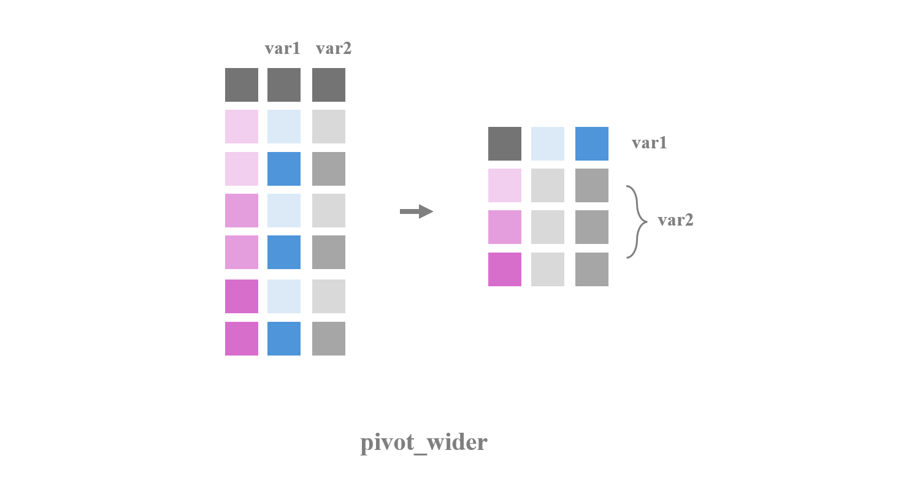
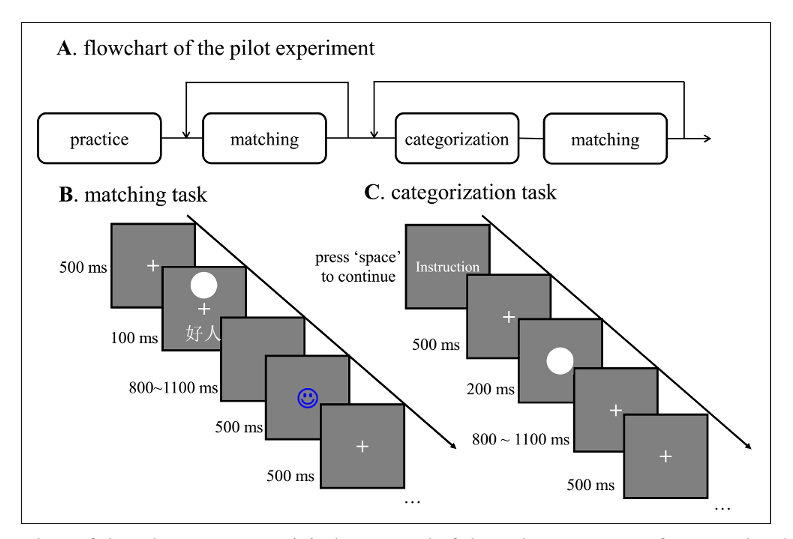
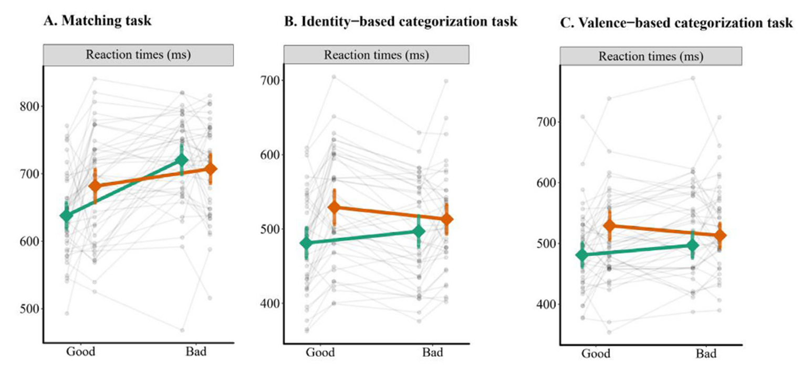
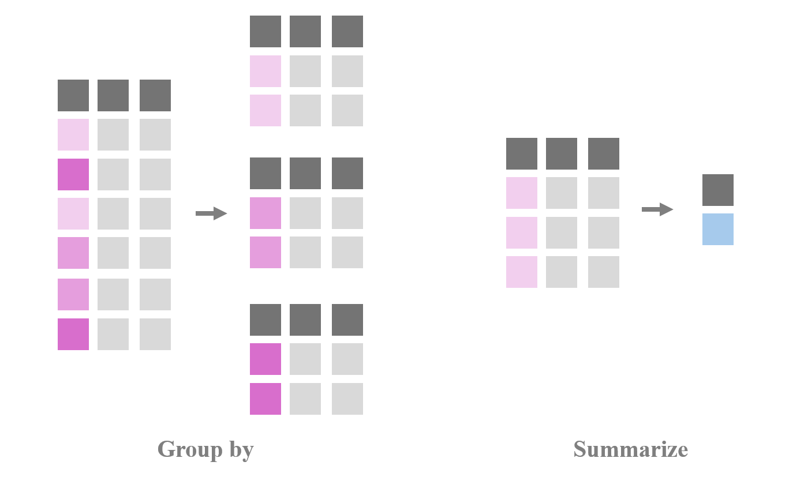
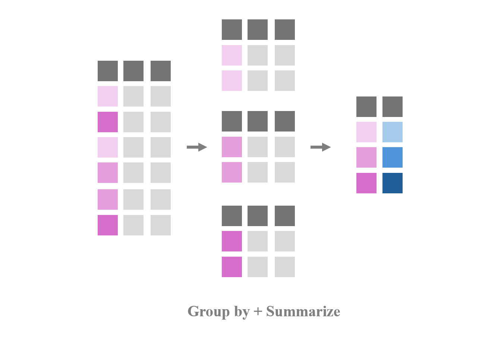
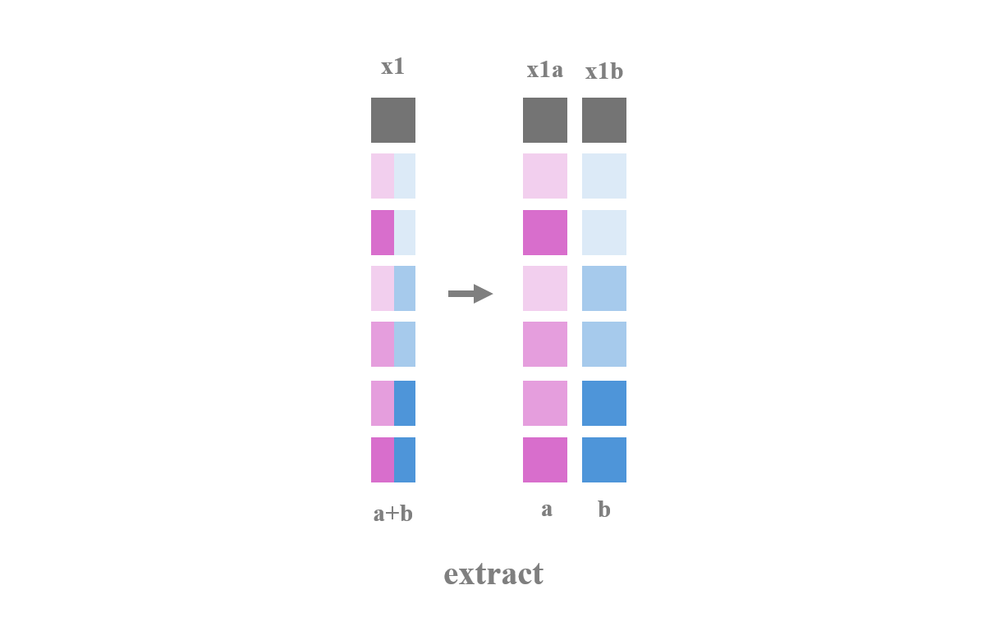

class: center, middle
<span style="font-size: 60px;">第七讲</span> <br>
<span style="font-size: 50px;">Tidyverse数据预处理</span> <br>
<br>
<br>
<span style="font-size: 30px;">胡传鹏</span> <br>
<span style="font-size: 30px;">2025/04/16</span> <br>
<br>
<br>
<br>
<br>
---
<br>
<span style="font-size: 35px;">回顾：问卷数据的处理</span></center> <br>
<br>
.font-size-14[
- Step1：选择变量[select]
- Step2：检查数据类型[glimpse, as族函数]
- Step3：处理缺失值[filter, is.na]
- Step4：反向计分[mutate, case_when]
- Step5：计算所需变量[mutate]
- Step6：分组求统计量 [group_by, summarise]
]

---

<br>
<span style="font-size: 35px;">上节课我们讲到了：实验数据导入——for loop</span></center> <br>
<br>
.font-size-14[
- (1) 找到所有要读取的文件名
- (2) 使用for loop逐个文件进行操作
- (3) 合并每次循环中读取的数据
- (4) 循环直到全部读取完成
]

---

# <h1 lang="en" style="font-size: 50px;">本节课我们继续：</h1>
<br>
.font-size-14[
- 7.1 基于Tidyverse的数据预处理
  - 7.1.1 研究问题 & 数据情况回顾
  - 7.1.2 操作步骤 (tidyr)
  - 7.1.3 小结
- 7.2 基于LLM和OpenCode的实操演练
  - 7.2.1 如何利用LLM和OpenCode解决问题
  - 7.2.2 用OpenCode把方案设计变成coding
  - 7.2.3 实操演练
]

---

# 加载所需R包
```{r 5.1 R package}
# 可以将清华的镜像设置为下载的镜像
# options(repos =c(CRAN = "https://mirrors.tuna.tsinghua.edu.cn/CRAN/"))
# 导入所需R包
library(tidyverse)
```

---

# 找到要读取的文件
```{r for loop list.files, error=FALSE}
# 找到所有要读取的文件名
# 使用 full.names 参数获取完整路径的文件列表
files <- list.files(here::here("slides", "data", "match"), pattern = "data_exp7_rep_match_.*\\.out$", full.names = TRUE)
```
*P.S.尽管函数叫list.files，但它得到的变量的属性是value，而不是list*

---

# 实验数据的导入 - 定义数据类型转换函数

```{r df.mt.out.fl}
# 定义函数用于数据类型转换
convert_data_types = function(df) {
  df <- df %>%
    dplyr::mutate(
      Date = as.character(Date),
      Prac = as.character(Prac),
      Sub = as.numeric(Sub),
      Age = as.numeric(Age),
      Sex = as.character(Sex),
      Hand = as.character(Hand),
      Block = as.numeric(Block),
      Bin = as.numeric(Bin),
      Trial = as.numeric(Trial),
      Shape = as.character(Shape),
      Label = as.character(Label),
      Match = as.character(Match),
      CorrResp = as.character(CorrResp),
      Resp = as.character(Resp),
      ACC = as.numeric(ACC),
      RT = as.numeric(RT)
    )
  return(df)
}
```

---

# 实验数据的导入 - 使用 for loop 批量导入
```{r}
# 创建一个空的数据框来存储读取的数据
df3 <- data.frame()

# 循环读取每个文件，处理数据并添加到数据框中
for (i in seq_along(files)) {
  # 读取数据文件
  df <- read.table(files[i], header = TRUE) 
  # 使用 filter 函数过滤掉 Date 列值为 "Date" 的行
  df <- dplyr::filter(df, Date != "Date") 
  # 调用函数进行数据类型转换
  df <- convert_data_types(df)
  # 使用 bind_rows() 函数将当前数据框与之前的数据框合并
  df3 <- dplyr::bind_rows(df3, df)
}

# 清除中间变量
rm(df, files, i)
```

---


# <h1 lang="en">7.1 基于Tidyverse处理反应时数据</h1>
<span style="font-size: 28px;">7.1.2 操作步骤 | Step0: 实验数据处理概述</span></center><br>
.font-size-14[
实验数据（如反应时数据）的处理与问卷数据有所不同：
]

| 步骤 | 说明 | 常用函数 |
|------|------|----------|
| 1. 批量读取数据 | 多个被试文件合并 | `for loop`, `lapply`, `bind_rows` |
| 2. 数据清洗 | 排除无效试次 | `filter()` |

---

# <h1 lang="en">7.1 基于Tidyverse处理反应时数据</h1>
<span style="font-size: 28px;">7.1.2 操作步骤 | Step0: 实验数据处理概述（续）</span></center><br>

| 步骤 | 说明 | 常用函数 |
|------|------|----------|
| 3. 计算变量 | 按条件计算均值 | `group_by()`, `summarise()` |
| 4. 数据重塑 | 长宽数据转换 | `pivot_wider()`, `pivot_longer()` |
| 5. 计算指标 | 如自我优势效应SPE | `mutate()` |

---

# <h1 lang="en">7.1 基于Tidyverse处理反应时数据</h1>
<span style="font-size: 28px;">7.1.2 操作步骤 | Step1: 读取单个文件</span></center><br>
.font-size-14[
- 读取单个被试的反应时数据
- .out文件通常是以空格或制表符分隔的文本文件
]

```{r read_single_file}
# 查看数据目录
list.files(here::here("slides", "data", "match"))

# 读取单个文件
p1 <- read.table(
  here::here("slides", "data", "match", "data_exp7_rep_match_7302.out"),
  header = TRUE
)

# 查看数据结构
str(p1)
head(p1)
```

---

# <h1 lang="en">7.1 基于Tidyverse处理反应时数据</h1>
<span style="font-size: 28px;">7.1.2 操作步骤 | Step1: 批量读取数据 - for loop</span></center><br>
.font-size-14[
当有多个被试的数据文件时，需要批量读取并合并。
第一步：找到所有要读取的文件
]

```{r list_files}
files <- list.files(
  here::here("slides", "data", "match"),
  pattern = "data_exp7_rep_match_.*\\.out$",
  full.names = TRUE
)

# 查看找到的文件
head(files, 5)
length(files)  # 文件数量
```

---

# <h1 lang="en">7.1 基于Tidyverse处理反应时数据</h1>
<span style="font-size: 28px;">7.1.2 操作步骤 | for loop 的基本语法</span></center><br>
.font-size-14[
**for loop 语法：**
```
for (变量 in 序列) {
  执行代码
}
```

**示例：打印1到10**
]

```{r for_loop_example}
for (i in 1:10) {
  print(i)
}
```

---

# <h1 lang="en">7.1 基于Tidyverse处理反应时数据</h1>
<span style="font-size: 28px;">7.1.2 操作步骤 | Step1: 使用 for loop 批量读取文件</span></center><br>

```{r for_loop_read}
# 创建空数据框
df_all <- data.frame()

# 逐个读取并合并
for (i in seq_along(files)) {
  df_temp <- read.table(files[i], header = TRUE)
  df_temp <- dplyr::filter(df_temp, Date != "Date")
  df_temp <- convert_data_types(df_temp)  # 统一数据类型
  df_all <- dplyr::bind_rows(df_all, df_temp)
}

# 查看结果
dim(df_all)
head(df_all)
```

---

# <h1 lang="en">7.1 基于Tidyverse处理反应时数据</h1>
<span style="font-size: 28px;">7.1.2 操作步骤 | Step1: 使用 lapply 批量读取</span></center><br>
.font-size-14[
**lapply(列表/向量, 函数)** - 更简洁的写法
]

```{r lapply_read}
df_all <- lapply(files, function(file) {
  df <- read.table(file, header = TRUE)
  df <- dplyr::filter(df, Date != "Date")
  df <- convert_data_types(df)  # 统一数据类型
  return(df)
}) %>%
  dplyr::bind_rows()

# 查看结果
dim(df_all)
head(df_all)
```

---

# <h1 lang="en">7.1 基于Tidyverse处理反应时数据</h1>
<span style="font-size: 28px;">7.1.2 操作步骤 | Step2: 排除无效试次</span></center><br>
.font-size-14[
实验数据清洗：排除无效试次
]

```{r clean_invalid_trials}
# 查看原始数据量
nrow(df_all)

# 第一步：按 Hand 和 ACC 过滤
df_clean <- df_all %>%
  dplyr::filter(Hand == "R") %>%
  dplyr::filter(ACC == 0 | ACC == 1)
```

---

# <h1 lang="en">7.1 基于Tidyverse处理反应时数据</h1>
<span style="font-size: 28px;">7.1.2 操作步骤 | Step2: 排除无效试次 </span></center><br>

```{r clean_invalid_trials2}
# 第二步：限制 RT 范围并删除缺失值
df_clean <- df_clean %>%
  dplyr::filter(RT >= 0.2 & RT <= 1.5) %>%
  tidyr::drop_na()

# 查看处理后的数据量
nrow(df_clean)
```

---

# <h1 lang="en">7.1 基于Tidyverse处理反应时数据</h1>
<span style="font-size: 28px;">7.1.2 操作步骤 | Step3: 按条件计算均值</span></center><br>
.font-size-14[
按被试和实验条件计算平均反应时和正确率
]

```{r calc_means}
df_means <- df_clean %>%
  dplyr::group_by(Sub, Shape, Label, Match) %>%
  dplyr::summarise(
    mean_RT = mean(RT),
    mean_ACC = mean(ACC),
    .groups = "drop"
  )

head(df_means)
```

---

# <h1 lang="en">7.1 基于Tidyverse处理反应时数据</h1>
<span style="font-size: 28px;">7.1.2 操作步骤 | Step4: 拆分变量 - extract</span></center><br>
.font-size-14[
有时需要从一个变量中拆出两个新的信息字段。
Shape变量包含多个信息，如 "moralSelf", "immoralOther"
需要拆分为 Valence 和 Identity 两个变量
]

```{r extract_shape}
df_means <- df_means %>%
  tidyr::extract(
    col = Shape,
    into = c("Valence", "Identity"),
    regex = "(moral|immoral)(Self|Other)",
    remove = FALSE
  )

head(df_means)
```

---

# <h1 lang="en">7.1 基于Tidyverse处理反应时数据</h1>
<span style="font-size: 28px;">7.1.2 操作步骤 | Step5: 长宽数据转换 - pivot_wider</span></center><br>
.font-size-14[
pivot_wider: 长数据 -> 宽数据
]

```{r pivot_wider_example}
df_wide <- df_means %>%
  dplyr::filter(Match == "match" & Valence == "moral") %>%
  dplyr::select(Sub, Identity, mean_RT) %>%
  tidyr::pivot_wider(
    names_from = "Identity",
    values_from = "mean_RT"
  )

head(df_wide)
```

---

# <h1 lang="en">7.1 基于Tidyverse处理反应时数据</h1>
<span style="font-size: 28px;">7.1.2 操作步骤 | Step5: pivot_wider 函数说明</span></center><br>
.font-size-14[
- pivot_wider(names_from = var1, values_from = var2)
- names_from：其值将用作列名称的列
- values_from：其值将用作单元格值的列
]


---

# <h1 lang="en">7.1 基于Tidyverse处理反应时数据</h1>
<span style="font-size: 28px;">7.1.2 操作步骤 | Step6: 计算派生指标 - SPE</span></center><br>
.font-size-14[
计算自我优势效应 (Self-Positivity Effect)
SPE = 自我条件RT - 他人条件RT
负值表示自我优势（反应更快）
]

```{r calc_spe}
df_spe <- df_wide %>%
  dplyr::mutate(
    moral_SPE = Self - Other
  ) %>%
  dplyr::select(Sub, moral_SPE)

summary(df_spe$moral_SPE)
```

---

# <h1 lang="en">7.1 基于Tidyverse处理反应时数据</h1>
<span style="font-size: 30px;">7.1.2 操作步骤 | 完整流程1 </span></center><br>
**读取并清洗原始数据（1/2）**

```{r full_pipeline_1}
df_spe <- files %>%
  lapply(function(file) {
    df <- read.table(file, header = TRUE)
    df <- dplyr::filter(df, Date != "Date")
    df <- convert_data_types(df)  # 统一数据类型
    return(df)
  }) %>%
  bind_rows()
```

---

# <h1 lang="en">7.1 基于Tidyverse处理反应时数据</h1>
<span style="font-size: 30px;">7.1.2 操作步骤 | 完整流程2 </span></center><br>
**读取并清洗原始数据（2/2）**

```{r full_pipeline_1_2}
# 筛选有效试次
df_spe <- df_spe %>%
  dplyr::filter(
    Hand == "R",
    ACC == 0 | ACC == 1,
    RT >= 0.2 & RT <= 1.5
  ) %>%
  tidyr::drop_na()
```

---

# <h1 lang="en">7.1 基于Tidyverse处理反应时数据</h1>
<span style="font-size: 30px;">7.1.2 操作步骤 | 完整流程3 </span></center><br>
**分组计算均值，并拆分 Shape**

```{r full_pipeline_2}
df_spe <- df_spe %>%
  dplyr::group_by(Sub, Shape, Label, Match) %>%
  dplyr::summarise(
    mean_RT = mean(RT),
    .groups = "drop"
  ) %>%
  tidyr::extract(
    Shape,
    into = c("Valence", "Identity"),
    regex = "(moral|immoral)(Self|Other)"
  )
```

---

# <h1 lang="en">7.1 基于Tidyverse处理反应时数据</h1>
<span style="font-size: 30px;">7.1.2 操作步骤 | 完整流程4 </span></center><br>
**长转宽并计算 SPE**

```{r full_pipeline_3}
df_spe <- df_spe %>%
  dplyr::filter(Match == "match",
                Valence == "moral") %>%
  dplyr::select(Sub, Identity, mean_RT) %>%
  tidyr::pivot_wider(
    names_from = "Identity",
    values_from = "mean_RT"
  ) %>%
  dplyr::mutate(moral_SPE = Self - Other)

head(df_spe)
```

<br>
<br>

---
# <h1 lang="en">7.1 基于Tidyverse处理反应时数据</h1>
<span style="font-size: 30px;">7.1.1 问题 & 数据</span></center> <br>
- 以[Hu et al.,2020](https://doi.org/10.1525/collabra.301)中的反应时数据作为示例<br>
<br>
- **研究问题**：探究人们对自我相关刺激的优先加工是否仅在某些条件下发生<br>
- **研究假设**：无论参与何种任务，与积极概念（好我）建立联结的自我形状会在反应时间和准确性上表现更快更准确<br>


---
# <h1 lang="en">7.1 基于Tidyverse处理反应时数据</h1>
<span style="font-size: 30px;">7.1.1 问题 & 数据</span></center> <br>
- **研究结果**：<br>
<br>


---
# <h1 lang="en">7.1 基于Tidyverse处理反应时数据</h1>
<span style="font-size: 30px;">7.1.1 问题 & 数据</span></center> <br>
- 主要变量：<br>
Shape/Label: 屏幕呈现的图形代表的概念<br>
Match: 图形与呈现的标签是否匹配<br>
ACC: 被试的判断是否正确，1 = "正确", 0 = "错误", -1, 2表示未按键或按了两个键的情况，属于无效作答<br>
RT: 被试做出判断的反应时，[200,1500]的反应时纳入分析<br>

```{r example of singal rawdata_matchtask DT, echo=FALSE}
a1 <- utils::read.table("data/match/data_exp7_rep_match_7302.out", header = TRUE)
DT::datatable(head(a1),
              fillContainer = TRUE, options = list(pageLength = 4))
```

---
# <h1 lang="en">7.1 基于Tidyverse处理反应时数据</h1>
<span style="font-size: 30px;">7.1.2 操作步骤</span></center><br>
- **本课数据预处理目标**：计算Match-Moral条件下时RT的自我优势效应(SPE)。<br>

&emsp;&emsp; **Step0: 实验数据处理概述**<br>
&emsp;&emsp; **Step1: 批量读取并合并数据[for loop, lapply]**<br>
&emsp;&emsp; Step2: 选择变量[select]<br>
&emsp;&emsp; Step3: 处理缺失值[drop_na, filter]<br>
&emsp;&emsp; **Step4: 分实验条件计算变量[group_by, summarise]**<br>
&emsp;&emsp; **Step5: 拆分变量[extract, filter]**<br>
&emsp;&emsp; **Step6: 将长数据转为宽数据[pivot_wide]**<br>
&emsp;&emsp; Step7: 计算实验条件为Match-Moral时RT的自我优势效应[mutate, select]<br>

---
# <h1 lang="en">7.1 反应时数据</h1>
<span style="font-size: 30px;">7.1.2 操作步骤 | Step2: 选择变量[select]</span></center><br>

```{r example of total part1 rawdata_matchtask,message=FALSE}
# 选择我们需要的变量
df4 <- dplyr::select(df3,
                     Sub, Age, Sex, Hand, #人口统计学
                     Block, Bin, Trial,   # 试次
                     Shape, Label, Match, # 刺激
                     Resp, ACC, RT)       # 反应结果
```

```{r example of total part1 rawdata_matchtask DT, echo=FALSE}
DT::datatable(head(df4, 10),
              fillContainer = TRUE, options = list(pageLength = 5))
```

---
# <h1 lang="en">7.1 反应时数据</h1>
<span style="font-size: 30px;">7.1.2 操作步骤 | Step3: 处理缺失值[drop_na, filter]</span></center><br>

```{r example of total part2 rawdata_matchtask,message=FALSE}
# 删除缺失值，选择符合标准的被试
df4 <- tidyr::drop_na(df4) # 删除含有缺失值的行
df4 <- dplyr::filter(df4, Hand == "R",      # 选择右利手被试
                    ACC == 0 | ACC == 1 ,   # 排除无效应答（ACC = -1 OR 2)
                    RT >= 0.2 & RT <= 1.5)  # 选择RT属于[200,1500]
```

```{r example of total part2 rawdata_matchtask DT, echo=FALSE}
DT::datatable(head(df4, 24),
              fillContainer = TRUE, options = list(pageLength = 5))
```
---
# <h1 lang="en">7.1 反应时数据</h1>
<span style="font-size: 30px;">7.1.2 操作步骤 | Step4: 分条件描述[group_by, summarise]</span></center><br>

```{r example of total part3 rawdata_matchtask,message=FALSE}
# 分实验条件计算
df4 <- dplyr::group_by(df4, Sub, Shape, Label, Match)
df4 <- dplyr::summarise(df4, mean_ACC = mean(ACC), mean_RT = mean(RT))
df4 <- dplyr::ungroup(df4)
```

```{r example of total part3 rawdata_matchtask DT, echo=FALSE}
DT::datatable(head(df4, 24),
              fillContainer = TRUE, options = list(pageLength = 5))
```

---
# <h1 lang="en">7.1 反应时数据</h1>
<span style="font-size: 30px;">7.1.2 操作步骤 | Step4: 分条件描述[group_by, summarise]</span></center><br>
- group_by和summarise函数<br>
&emsp;group_by：定义分组变量<br>
&emsp;summarise：通过与mean、median等函数协作，对变量进行汇总<br>


---
# <h1 lang="en">7.1 反应时数据</h1>
<span style="font-size: 30px;">7.1.2 操作步骤 | Step4: 分条件描述[group_by, summarise]</span></center><br>
- group_by和summarise函数<br>
&emsp;group_by+summarise：对各组变量进行汇总<br>


---
# <h1 lang="en">7.1 反应时数据</h1>
<span style="font-size: 30px;">7.1.2 操作步骤 | Step5: 拆分变量[extract, filter]</span></center><br>

```{r example of total part4 rawdata_matchtask}
# 将Shape变量拆分
df4 <- tidyr::extract(df4, Shape, into = c("Valence", "Identity"),
                      regex = "(moral|immoral)(Self|Other)", remove = FALSE)
df4 <- dplyr::filter(df4, Match == "match" & Valence == "moral") 
```

```{r example of total part4 rawdata_matchtask DT, echo=FALSE}
DT::datatable(head(df4, 24),
              fillContainer = TRUE, options = list(pageLength = 5))
```

---
# <h1 lang="en">7.1 反应时数据</h1>
<span style="font-size: 30px;">7.1.2 操作步骤 | Step5: 拆分变量[extract, filter]</span></center><br>
- extract函数<br>
&emsp; extract(data = data, col = x1, into = c("x1a", "x1b"),regex = "([[:alnum:]]+)-([[:alnum:]]+)")


---
# <h1 lang="en">7.1 反应时数据</h1>
<span style="font-size: 30px;">7.1.2 操作步骤 | Step6: 将数据长转宽[pivot_wide]</span></center><br>
```{r example of total part5 rawdata_matchtask}
# 将长数据转为宽数据
df4 <- dplyr::select(df4, Sub, Identity, mean_RT)
df4 <- tidyr::pivot_wider(df4, names_from = "Identity", values_from = "mean_RT")
```

```{r example of total part5 rawdata_matchtask DT, echo=FALSE}
DT::datatable(head(df4, 24),
              fillContainer = TRUE, options = list(pageLength = 5))
```

---
# <h1 lang="en">7.1 反应时数据</h1>
<span style="font-size: 30px;">7.1.2 操作步骤 | Step6: 将数据长转宽[pivot_wide]</span></center><br>
- pivot_wide函数<br>
&emsp; pivot_wider(names_from = var1, values_from = var2)<br>
&emsp; names_from：其值将用作列名称的列<br>
&emsp; values_from：其值将用作单元格值的列<br>


---
# <h1 lang="en">7.1 反应时数据</h1>
<span style="font-size: 30px;">7.1.2 操作步骤 </span></center><br>
```{r example of total part6 rawdata_matchtask}
# 计算SPE
df4 <- dplyr::mutate(df4, moral_SPE = Self - Other)
df4 <- dplyr::select(df4, Sub, moral_SPE) 
```

```{r example of total part6 rawdata_matchtask DT, echo=FALSE}
DT::datatable(head(df4, 24),
              fillContainer = TRUE, options = list(pageLength = 5))
```

---
# <h1 lang="en">7.1 反应时数据</h1>
<span style="font-size: 30px;">7.1.2 操作步骤 | 完整管道流程（第一部分）</span></center><br>

```{r example of total rawdata_matchtask_p1, message=FALSE}
# 用管道操作符合并以上代码
df4 <- df3 %>%
  dplyr::select(Sub, Age, Sex, Hand,
                Block, Bin, Trial,
                Shape, Label, Match,
                Resp, ACC, RT) %>%
  tidyr::drop_na() %>%
  dplyr::filter(Hand == "R",
                ACC == 0 | ACC == 1,
                RT >= 0.2 & RT <= 1.5)
```

---

# <h1 lang="en">7.1 反应时数据</h1>
<span style="font-size: 30px;">7.1.2 操作步骤 | 完整管道流程（第二部分）</span></center><br>

```{r example of total rawdata_matchtask_p2, message=FALSE}
# 继续分组汇总
df4 <- df4 %>%
  dplyr::group_by(Sub, Shape, Label, Match) %>%
  dplyr::summarise(mean_ACC = mean(ACC), mean_RT = mean(RT)) %>%
  dplyr::ungroup()
```

---

# <h1 lang="en">7.1 反应时数据</h1>
<span style="font-size: 30px;">7.1.2 操作步骤 | 完整管道流程（第三部分）</span></center><br>

```{r example of total rawdata_matchtask_p3, message=FALSE}
# 拆分变量并计算SPE
df4 <- df4 %>%
  tidyr::extract(Shape, 
                 into = c("Valence", "Identity"),
                 regex = "(moral|immoral)(Self|Other)", 
                 remove = FALSE) %>%
  dplyr::filter(Match == "match" & Valence == "moral") %>%
  dplyr::select(Sub, Identity, mean_RT) %>%
  tidyr::pivot_wider(names_from = "Identity", 
                     values_from = "mean_RT") %>%
  dplyr::mutate(moral_SPE = Self - Other)
```
---
# <h1 lang="en">7.1 反应时数据</h1>
<span style="font-size: 30px;">7.1.3 小结</span></center><br>
<br>

---

# <h1 lang="en">7.1 基于Tidyverse处理反应时数据</h1>
<span style="font-size: 30px;">7.1.3 小结 | 常用 tidyr 函数总结</span></center><br>

| 函数 | 功能 | 示例 |
|------|------|------|
| `pivot_wider()` | 长转宽 | `pivot_wider(names_from, values_from)` |
| `pivot_longer()` | 宽转长 | `pivot_longer(cols, names_to, values_to)` |
| `extract()` | 提取字符 | `extract(col, into, regex)` |
| `separate()` | 分列 | `separate(col, into, sep)` |
| `unite()` | 合列 | `unite(col, ...)` |
| `drop_na()` | 删除缺失值 | `drop_na()` |

---

# <h1 lang="en">7.1 基于Tidyverse处理反应时数据</h1>
<span style="font-size: 30px;">7.1.3 小结 | 常用 dplyr 函数总结</span></center><br>

| 函数 | 功能 | 示例 |
|------|------|------|
| `select()` | 选择列 | `select(df, col1, col2)` |
| `filter()` | 筛选行 | `filter(df, condition)` |
| `mutate()` | 创建/修改列 | `mutate(df, new = old + 1)` |
| `group_by()` | 分组 | `group_by(df, group_var)` |
| `summarise()` | 汇总 | `summarise(df, mean(x), .groups = "drop")` |
| `arrange()` | 排序 | `arrange(df, desc(x))` |
| `bind_rows()` | 合并行 | `bind_rows(df1, df2)` |

**提示：** dplyr 1.0+ 中，`summarise(.groups = "drop")` 可自动取消分组，无需额外 `ungroup()`。

---

# <h1 lang="en">7.1 反应时数据</h1>
<span style="font-size: 30px;">7.1.3 小结 </span></center><br>
<br>
- separate() 把一个变量的单元格内的字符串拆成两份，变成两个变量 <br>
  **更适合用于按固定分隔符分割字符串，如将"2022-02-25"分成"2022"、"02"和"25"三列** <br>
  
- extract() 类似于separate <br>
  **更适合用于从字符串中提取特定的信息，如将"John Smith"分成"John"和"Smith"两列** <br>
  
- unite() 把多个列（字符串）整合为一列 <br>

- pivot_longer() 把宽数据转化为长数据 <br>

- pivot_wider() 把长数据转化为宽数据 <br>   
  
- drop_na() 删除缺失值


---
# 7.2 基于LLM和OpenCode的实操演练


.pull-left[
.font-size-14[
为什么要先把问题说清楚？

本章的数据预处理，本质上也是一个**问题解决（problem solving）**过程。

**初始状态（Initial State）**
- 我当前有什么数据？
- 变量、类型、缺失值是否清楚？

**路径（Path）**
- 需要哪些步骤、函数或包？
- 哪些前提还不能直接假设？

**目标状态（Goal State）**
- 我最后要得到什么结果？
- 是清洗后的数据，还是汇总表？
]
]

.pull-right[
.font-size-14[
**先把问题说清楚：**

已有数据  
变量 / 类型 / 缺失值  
`↓`

目标结果  
清洗数据 / 派生指标 / 汇总表  
`↓`

实现约束  
包 / 路径 / 缺失值处理 / 输出格式  
`↓`

**再向 LLM 提问**

<br>

**一句话版本：**  
现状 → 目标 → 约束 → 提问
]
]

.font-size-14[
💡 提问时，先说清**现状、目标、约束**。
]

---

# 7.2.1 Prompt 1：先澄清问题，再开始规划（1/2）

.font-size-14[
**核心原则：先在Planning模式下消灭假设，再开始写代码。**

**可直接使用的prompt：**
```
我正在做数据预处理任务。在写任何代码之前，请先在 Planning 模式下持续追问并澄清我的需求。
不要擅自做未说明的假设。请一直问到关键前提都被澄清。

请你重点澄清：
1. 我当前的数据是什么，包含哪些关键变量；
2. 我的目标结果是什么；
3. 中间需要哪些步骤；
```
]

---

# 7.2.1 Prompt 1：先澄清问题，再开始规划（2/2）

.font-size-14[
```
4. 哪些约束会影响实现（如包、路径、缺失值、输出格式）；
5. 我还没有说明但必须确认的信息。

在你确认关键前提都已澄清之前，不要开始写代码。
```

**坏提问：** “帮我把这个数据处理一下。”

**更好的提问：** 先要求模型追问你的目标、数据和限制条件，再进入方案设计。

💡 复制时，请把本 prompt 的多页代码块合并后再使用。
]

---

# 7.2.1 Prompt 2：先帮我理顺问题解决思路（1/3）

.font-size-14[
**当你还没想清楚“该怎么做”时，不要急着要代码，可以先让LLM帮你把思路理顺。**

**可直接使用的prompt：**
```
我现在想解决一个问题，但我还没有完全想清楚思路。
请不要直接给我答案，
而是先帮助我理顺
从初始状态到目标状态的过程。

请按下面顺序引导我：
```
]

---

# 7.2.1 Prompt 2：先帮我理顺问题解决思路（2/3）

.font-size-14[
```
1. 帮我界定当前的初始状态：
   我现在已有的信息、数据、条件分别是什么？
2. 帮我界定目标状态：
   我最终想得到的结果是什么？怎样算完成？
3. 帮我识别中间路径：
   从现在到目标之间，通常需要拆成哪几个步骤？
```
]

---

# 7.2.1 Prompt 2：先帮我理顺问题解决思路（3/3）

.font-size-14[
```
4. 帮我找出缺失信息：
   哪些关键前提还不清楚，不能直接假设？
5. 请用简洁结构总结：
   当前状态、目标状态、关键约束、可行步骤，
   以及我下一步最应该先确认的问题。

在关键前提没有澄清之前，
不要直接进入代码或最终方案。
```

**适用场景：** 知道自己“卡住了”，
但还说不清是卡在数据、方法、步骤还是约束时。

💡 复制时，请把本 prompt 的多页代码块合并后再使用。
]

---

# 7.2.1 Prompt 3：把小而具体的目标讲清楚（1/3）

.font-size-14[
**当任务已经明确时，把一个小目标单独说清楚，LLM更容易理解你的意图。**

**推荐模板：背景 / 数据 / 需求 / 约束（通用模板）**
```
背景：我正在学习第6章的数据预处理。

数据：我已经加载了 penguin 数据集，数据框叫 df，包含 Site、age、weight_kg、height_cm、sex。
```
]

---

# 7.2.1 Prompt 3：把小而具体的目标讲清楚（2/3）

.font-size-14[
```
需求：
1. 筛选出 Site 为 "Tsinghua" 且 age > 25 的被试；
2. 计算这些被试的 BMI；
3. 按 sex 输出 BMI 的均值和标准差。
```
]

---

# 7.2.1 Prompt 3：把小而具体的目标讲清楚（3/3）

.font-size-14[
```
约束：
- 请使用 dplyr；
- 正确处理缺失值；
- 每一步添加注释；
- 先解释思路，再给完整代码。
```

**要点：** 说清楚输入是什么、输出是什么、用什么方法、有哪些限制，而不是一次把很多目标混在一起。

💡 复制时，请把本 prompt 的多页代码块合并后再使用。
]

---

# 7.2.2 用OpenCode把方案设计变成coding（1/3）

.font-size-14[
**最小工作流：先 plan，再 /start-work。**

这里的 **Planning 模式**，指的是先澄清需求并形成执行计划，而不是立刻生成代码。

1. **先进入 plan / Planning 模式**
   - 让 OpenCode 先问问题、澄清需求、生成方案；
2. **查看生成的计划**
   - 通常会保存在 `.sisyphus/plans/`；
]

---

# 7.2.2 用OpenCode把方案设计变成coding（2/3）

.font-size-14[
3. **确认方案足够清楚之后，再执行**
   - 使用 `/start-work` 把已经确认的计划交给系统实施。

**最小示例：**
```
请先进入 Planning 模式，不要直接写代码。
先问我问题，直到关键前提都被澄清。
然后给出一个清晰的实现计划，说明每一步要做什么、预期输出是什么。
```
]

---

# 7.2.2 用OpenCode把方案设计变成coding（3/3）

.font-size-14[
**什么时候不要直接 `/start-work`？**
- 当你的目标还很模糊；
- 当任务包含多个步骤或多个文件；
- 当你还不确定数据结构、变量名或输出形式；
- 当你还没有看懂计划，无法判断它是否合理。
]

---

# 7.2.2 从模糊需求到清晰执行（1/3）

.font-size-14[
**完整示例：从模糊需求到清晰执行**

**模糊说法：**
```
帮我处理一下 penguin 数据。
```
]

---

# 7.2.2 从模糊需求到清晰执行（2/3）

.font-size-14[
**更清晰的说法：**
```
我正在学习第6章的数据预处理。请先不要写代码。
先在 Planning 模式下问我问题，直到关键前提都被澄清。

我的数据框叫 df，至少包含 Site、age、weight_kg、height_cm、sex。
我的目标是：
1. 筛选 Site == "Tsinghua" 且 age > 25 的被试；
2. 计算 BMI；
3. 按 sex 汇总 BMI 的均值和标准差。
```
]

---

# 7.2.2 从模糊需求到清晰执行（3/3）

.font-size-14[
```
请先给出实现思路和步骤说明；确认后，我再让你开始写代码。
```

**记住：** 好的问题解决，不是一次把全部答案“要出来”，而是先澄清，再规划，再执行，再迭代优化。
]

---

class: center, middle
<span style="font-size: 50px;">实操演练</span> <br>

---

# 7.2.3 实验数据处理

.font-size-14[
**任务：计算match-moral条件下的自我优势效应SPE**

1. 批量读取所有被试数据
2. 筛选有效试次（ACC, RT范围）
3. 按被试和条件计算均值
4. 拆分Shape变量
5. 筛选match-moral条件
6. 长转宽，计算SPE
]

---

# 练习：实验数据处理（代码骨架）

.font-size-14[
```r
# df_spe <- files %>%
#   lapply(function(f) {
#     read.table(f, header = TRUE) %>%
#       filter(Date != "Date")
#   }) %>%
#   bind_rows() %>%
#   filter(***, 
#          ACC == 0 | ACC == 1,
#          RT >= 0.2 & RT <= 1.5) %>%
#   drop_na() %>%
#   group_by(Sub, Shape, Label, Match) %>%
#   summarise(mean_RT = ***, .groups = "drop") %>%
#   extract(Shape,
#           into = c("Valence", "Identity"),
#           regex = "(moral|immoral)(Self|Other)") %>%
#   filter(Match == "match",
#          Valence == "moral") %>%
#   select(Sub, Identity, ***) %>%
#   pivot_wider(names_from = "Identity",
#                values_from = "***") %>%
#   mutate(moral_SPE = *** - ***)
```
]

---

class: center, middle
<span style="font-size: 60px;">Any questions?</span> <br>
