class: center, middle
<span style="font-size: 50px;">**第九章**</span> <br>
<span style="font-size: 50px;">回归模型(一)</span> <br>
<span style="font-size: 30px;">胡传鹏</span> <br>
<span style="font-size: 20px;"> </span> <br>
<span style="font-size: 30px;">`r Sys.Date()`</span> <br>
<span style="font-size: 20px;"> Made with Rmarkdown</span> <br>

```{r setup, include=FALSE}
knitr::opts_chunk$set(
  message = FALSE,
  warning = F
)
```

```{css extra.css, echo=FALSE}
/* ---- extra.css ---- */
.bigfont {
  font-size: 30px;
}
.size5{
font-size: 20px;
}
.tit_font{
font-size: 60px;
}

```

```{r xaringan-panelset, echo=FALSE}
xaringanExtra::use_panelset()
```

```{r, echo=FALSE}
# Packages
if (!requireNamespace('pacman', quietly = TRUE)) {
    install.packages('pacman')
}

pacman::p_load(
  # 本节课需要用到的 packages
  here, tidyverse, bruceR, DT, car,
  # 生成课件
  xaringan, xaringanthemer, xaringanExtra)
```

```{r, echo=FALSE}
# 改变R在显示大数字和小数字时是选择常规格式还是科学计数法的倾向
options(scipen=999)

# 还原设置 options(scipen = 0)
```

---
<h1 lang="zh-CN" style="font-size: 60px;"> </h1>
<br>
<br>
## 纯粹的R代码学习 → 使用R语言来实现**统计知识** <br>
<br>
## (1) R: 更灵活的统计分析方法，与统计知识结合更加紧密<br>
<br>
## (2) 心理学/社会科学中常用的统计检验均是回归模型<br>

---
<h1 lang="zh-CN" style="font-size: 60px;">研究问题</h1>

<br>
## 在Human Penguin Project数据中，第一次体温能否预测第二次体温？
<br>

<br>
## 在Human Penguin Project数据中，不同恋爱状态(romantic)下被试核心体温(Temperature)是否有差异？
<br>
<br>
## 在Human Penguin Project数据中，不同距赤道距离(DEQ)和恋爱状态(romantic)条件下被试核心体温(Temperature)是否有差异？
<br>
<br>

---
<h1 lang="en" style="font-size: 60px;">Contents</h1>
<br>
<span style="font-size: 35px;">8.0 简单线性回归</span></center> <br>
<span style="font-size: 20px;">&emsp;8.0.1 线性回归模型回顾</span></center> <br>
<span style="font-size: 20px;">&emsp;8.0.2 线性回归在R中的实现</span></center> <br>
<span style="font-size: 20px;">&emsp;8.0.3 bruceR::regress</span></center> <br>
<br>
<span style="font-size: 35px;">8.1 *t*-test & linear regression</span></center> <br>
<span style="font-size: 20px;">&emsp;8.1.1 独立样本*t*检验</span></center> <br>
<span style="font-size: 20px;">&emsp;8.1.2 线性回归的表达</span></center> <br>
<span style="font-size: 20px;">&emsp;8.1.3 单样本*t*检验</span></center> <br>
<span style="font-size: 20px;">&emsp;8.1.4 配对样本*t*检验</span></center> <br>
<span style="font-size: 20px;">&emsp;8.1.5 bruceR::TTEST</span></center> <br>
<br>
<span style="font-size: 35px;">8.2 ANOVA & linear regression</span></center> <br>
<span style="font-size: 20px;">&emsp;8.2.1 研究问题</span></center> <br>
<span style="font-size: 20px;">&emsp;8.2.2 代码实操</span></center> <br>
<span style="font-size: 20px;">&emsp;8.2.3 线性回归的表达</span></center> <br>
<span style="font-size: 20px;">&emsp;8.2.4 知识延申</span></center> <br>

---
class: left, middle
<span style="font-size: 60px;">8.0 线性回归回顾</span> <br>

<br>
<span style="font-size: 35px;">Q: 第一次体温测量是否与第二体温测量的关系？</span> <br>
<br>
<span style="font-size: 40px;">A: 简单线性回归</span> <br>

---

## 线性回归表达式

</br>

$y = a + bX + \epsilon$

</br>

-   y -- Data

-   a+bX -- model

-   $\epsilon$ -- error

---

## 线性回归表达式
<span style="font-size: 30px;">
</br>

$$y = a + bX + \epsilon$$

-   y -- 因变量，Dependent variable

-   x -- 自变量，Independent (explanatory) variable

-   a -- 截距，Intercept

-   b -- 斜率，Slope

-   $\epsilon$ -- 残差，Residual (error)
</span>
---
## 线性回归表达式

</br>

$$y_i = a + bx_i + \epsilon $$

$$\downarrow$$

$$Y_1 = \alpha + \beta_1 X_1 + \epsilon_1$$

$$Y_2=\alpha + \beta_1 X_2 + \epsilon_2$$

$$...$$

$$Y_n = \alpha + \beta_1 X_n + \epsilon_n$$
---
## 矩阵表达

$$Y_{n×1} =X_{n×2} \beta_{2×1} + \epsilon_{n×1}$$

$$Y = X \beta + \epsilon$$

<div style="margin-top: 1em;">
<table style="width: 100%; table-layout: fixed; border-collapse: separate; border-spacing: 1.2rem 0.8rem;">
<tr>
<td style="width: 50%; vertical-align: top; text-align: center;">

$$Y_{n×1}=\begin{bmatrix}
  y_1 \\
  y_2 \\
  ... \\
  y_n
\end{bmatrix}$$

</td>
<td style="width: 50%; vertical-align: top; text-align: center;">

$$X_{n×2}=\begin{bmatrix}
  1&x_{12} \\
  1&x_{22} \\
  ...&... \\
  1&x_{n2}
\end{bmatrix}$$

</td>
</tr>
<tr>
<td style="vertical-align: top; text-align: center;">

$$\beta_{2×1}=\begin{bmatrix}
 \alpha\\
 \beta_1
\end{bmatrix}$$

</td>
<td style="vertical-align: top; text-align: center;">

$$\epsilon_{n×1}=\begin{bmatrix}
 \epsilon_1\\
  \epsilon_2\\
  ...\\
  \epsilon_n
\end{bmatrix}$$

</td>
</tr>
</table>
</div>

---
## 代码表达(`r`)

</br>

"Formula = Y ~ X"

</br>

- $Y$: 因变量 
- $X$: 自变量

---
# 8.0 线性回归回顾
## 8.0.2 一个简单的线性回归的R代码

.panelset[

.panel[
.panel-name[基础知识]

<br>
**X是否能够“预测”Y**
<br>
**前提条件**
1.  模型设定假定(线性预设);

2.  正交预设(误差项𝝐和x不相关; 误差项𝝐的期望值为0);

3.  残差方差齐性预设;

4.  残差正态分布预设(残差项𝝐独立且同分布).<br>
<br>

**假设**
* $H_0$: X不能显著地预测Y，即 $\beta$ = 0
* $H_1$: X能显著地预测Y，即 $\beta$ ≠ 0
<br>

]

.panel[
.panel-name[数据清理]

```{r preprocessing for lm}
df.penguin <- bruceR::import(here::here('slides', 'data', 'penguin', 'penguin_rawdata.csv')) %>%
  dplyr::mutate(subjID = row_number()) %>%
  dplyr::select(subjID,Temperature_t1, Temperature_t2) %>%         # 选择变量
  dplyr::filter(!is.na(Temperature_t1) & !is.na(Temperature_t2)) 
```

```{r, echo=FALSE}
DT::datatable(head(df.penguin),
              fillContainer = TRUE, options = list(pageLength = 4))
```

]

.panel[
.panel-name[初步可视化]

```{r visualization for lm, fig.width=6, fig.height=4}
df.penguin %>%
      ggplot2::ggplot(aes(x = Temperature_t1, y = Temperature_t2)) +
      geom_point() +
      geom_smooth(method = "lm", se = TRUE) +
      theme_classic()
```

]

.panel[
.panel-name[代码实操]

```{r lm in stats}
m1 <- stats::lm(Temperature_t2 ~ Temperature_t1,  # 公式
          data = df.penguin,                # 数据框
          )

# 使用 broom 包的 glance() 函数来提取模型摘要信息
m1_summary <- broom::tidy(m1)

# 使用 knitr 包的 kable() 函数来创建一个格式化的表格
knitr::kable(m1_summary, caption = "Model Summary")
```

]

.panel[
.panel-name[bruceR::model_summary]


```{r summary using bruceR}
bruceR::model_summary(m1)
```
]
]
---
# 8.0 线性回归回顾
## 8.0.3 bruceR::regress | 代码

```{r lm in bruceR, results='hide'}
m2_out <- capture.output(
  bruceR::regress(Temperature_t2 ~ Temperature_t1,  # 公式
                  data = df.penguin) # 数据
)
```


---
# 8.0 线性回归回顾
## 8.0.3 bruceR::regress | 输出（1/2）

```{r echo=FALSE, results='asis'}
cat(
  sprintf(
    '<pre style="font-size: 20px; line-height: 1.35; white-space: pre-wrap;">%s</pre>',
    htmltools::htmlEscape(paste(m2_out[1:min(13, length(m2_out))], collapse = "\n"))
  )
)
```

---
# 8.0 线性回归回顾
## 8.0.3 bruceR::regress | 输出（2/2）

```{r echo=FALSE, results='asis'}
cat(
  sprintf(
    '<pre style="font-size: 20px; line-height: 1.35; white-space: pre-wrap;">%s</pre>',
    htmltools::htmlEscape(paste(m2_out[14:length(m2_out)], collapse = "\n"))
  )
)
```

---
class: center, middle
<span style="font-size: 60px;">8.1 *t*-test & linear regression</span> <br>

---

class: left, top
<span style="font-size: 52px;">8.1  *t*检验作为回归模型的特例</span>

.pull-left[

<p align="center">
  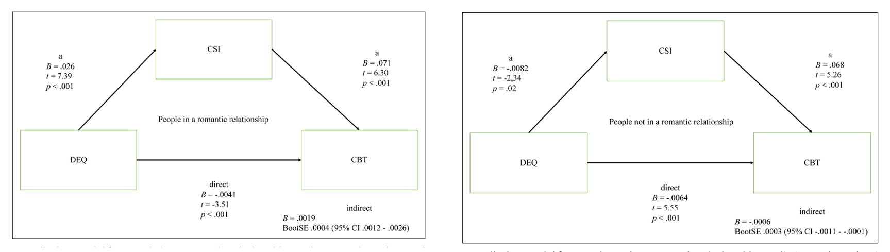
</p>

<div style="font-size: 16px; line-height: 1.4; text-align: center;">
  引自 <a href="https://doi.org/10.1525/collabra.165">IJzerman et al., 2018</a>
</div>

<p align="center" style="margin-top: 18px;">
  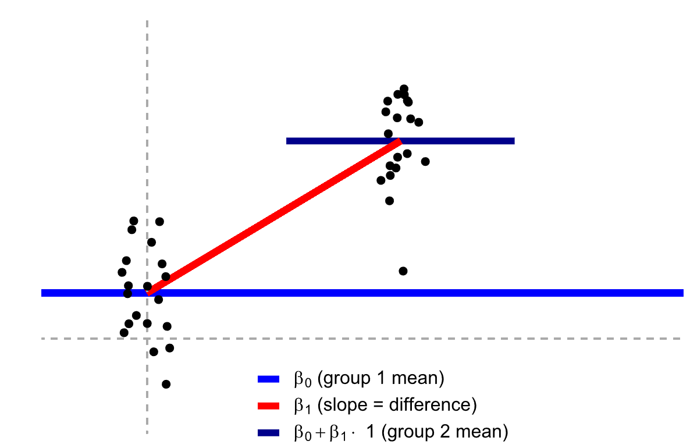
</p>

]

.pull-right[

<div style="font-size: 28px; line-height: 1.65; margin-top: 50px;">
<strong>研究问题</strong><br>
Q: 不同恋爱状态 (romantic) 下，人们的核心体温 (Temperature) 是否有差异？

<br><br>

<strong>统计回答</strong><br>
A: 可以先用<strong>独立样本 <em>t</em> 检验</strong>比较两组均值，随后再把它写成<strong>二分自变量的线性回归模型</strong>。
</div>

]

---
# 8.1 *t*-test
## 8.1.1 独立样本*t*检验(independent *t*-test)

.panelset[
.panel[.panel-name[基础知识]

<br>
**比较两个独立样本群体的均值是否有显著差异。**
<br>
**前提条件**
* 正态性：两个样本数据都应该来自正态分布的总体。样本量足够大时，即使不严格服从正态分布，结果也是稳健的。
* 同方差性：两个样本的方差应该是相等的。
* 独立性：两个样本应该是独立的，即一个样本的观测值不应影响另一个样本的观测值。<br>
<br>

**假设**
* $H_0$: 两个独立样本群体的均值没有显著差异，即 $μ_1$ = $μ_2$
* $H_1$: 两个独立样本群体的均值有显著差异，即 $μ_1$ ≠ $μ_2$
<br>
$$t = \frac{\bar{X}_1 - \bar{X}_2}{\sqrt{\frac{s_1^2}{n_1} + \frac{s_2^2}{n_2}}}$$

.panel[.panel-name[数据清理]

```{r preprocessing}
df.penguin <- bruceR::import(here::here('slides', 'data', 'penguin', 'penguin_rawdata.csv')) %>%
  dplyr::mutate(subjID = row_number()) %>%
  dplyr::select(subjID,Temperature_t1, Temperature_t2, socialdiversity, 
                Site, DEQ, romantic, ALEX1:ALEX16) %>%                                     # 选择变量
  dplyr::filter(!is.na(Temperature_t1) & !is.na(Temperature_t2) & !is.na(DEQ)) %>%         # 处理缺失值
  dplyr::mutate(romantic = factor(romantic, levels = c(1,2), labels = c("恋爱", "单身")),  # 转化为因子
                Temperature = rowMeans(select(., starts_with("Temperature"))),             # 计算两次核心温度的均值
                ALEX4  = case_when(TRUE ~ 6 - ALEX4),
                ALEX12 = case_when(TRUE ~ 6 - ALEX12),
                ALEX14 = case_when(TRUE ~ 6 - ALEX14),
                ALEX16 = case_when(TRUE ~ 6 - ALEX16),
                ALEX   = rowSums(select(., starts_with("ALEX")))) # 反向计分后计算总分
```

```{r, echo=FALSE}
DT::datatable(head(df.penguin),
              fillContainer = TRUE, options = list(pageLength = 4))
```

.panel[.panel-name[代码实操]

```{r ttest in stats}
stats::t.test(data = df.penguin,      # 数据框
              Temperature ~ romantic, # 因变量~自变量
              var.equal = TRUE) %>%
  capture.output()                    # 将输出变整齐
```


]]]]

---
# 8.1 *t*-test作为回归模型的特例
## 8.1.2 线性回归(linear regression)
<br>
* 独立样本*t*检验是线性模型的特殊形式(自变量为二分变量）
--
<p align="center">
  
</p>


---
# 8.1 *t*-test & linear regression

.pull-left[
```{r ttest, results='hide'}
# t检验
stats::t.test(data = df.penguin,
              Temperature ~ romantic,
              var.equal = TRUE) %>%
      capture.output()                    # 将输出变整齐
```

<p align="center">
  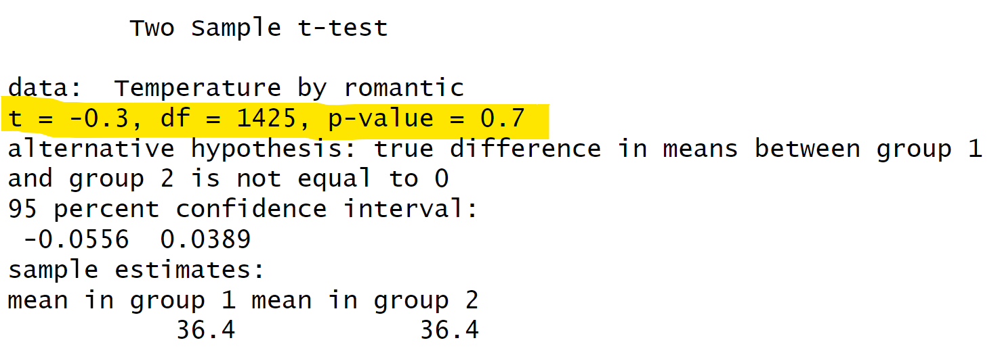
</p>
]

.pull-right[
```{r ttest in lm,results='hide'}
# 线性回归
model.inde <- stats::lm(
  data = df.penguin,
  formula = Temperature ~ 1 + romantic
  )
summary(model.inde)
```

<p align="center">
  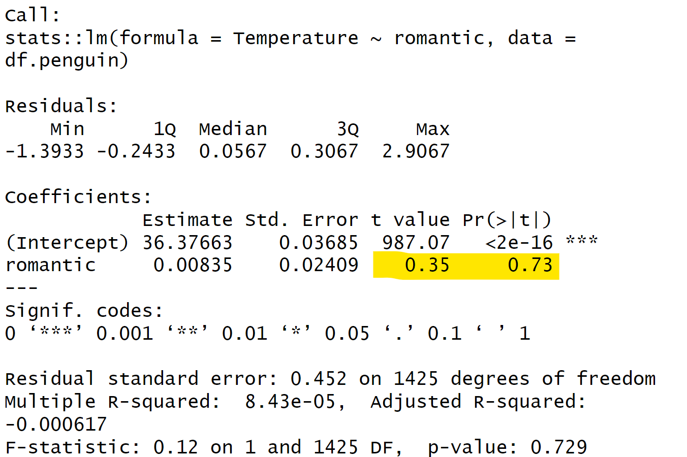
</p>

]


---
# 8.1 *t*-test系列均为回归模型的特例
## 8.1.3 单样本*t*检验(one sample *t*-test)
* 例如：在penguin数据中，全体被试的核心体温(Temperature)是否等于36.6？<br>
<br>
--
<br>
**比较单个样本的平均值(m)与已知的总体平均值(μ)之间是否存在显著差异**<br>
<br>

**前提条件**
* 正态性：样本数据应来自正态分布的总体。样本量足够大时，即使不严格服从正态分布，结果也是稳健的。
* 独立性：样本中的观测值必须是独立的，即一个观测值不应影响另一个观测值。<br>
<br>

**假设**
* $H_0$: 样本的均值(m)与给定的总体均值或假设的总体均值(μ)之间没有显著差异。
* $H_1$: 样本的均值(m)与给定的总体均值或假设的总体均值(μ)之间有显著差异。
<br>

$$t = \frac{\bar{X} - \mu}{s / \sqrt{n}}$$

---
# 8.1 *t*-test系列均为回归模型的特例
## 8.1.3 单样本*t*检验(one sample *t*-test)
.pull-left[
<br>
<br>

$$y = \beta_0 + \beta_1 x_1 + \beta_2 x_2 + ... + \beta_p x_p + \epsilon$$

单样本*t*检验中，仅截距不为0。此时公式为：<br>
--
$$y = \beta_0$$
$$H_0: \beta_0 = 0$$
]
.pull-right[
<p align="center">
  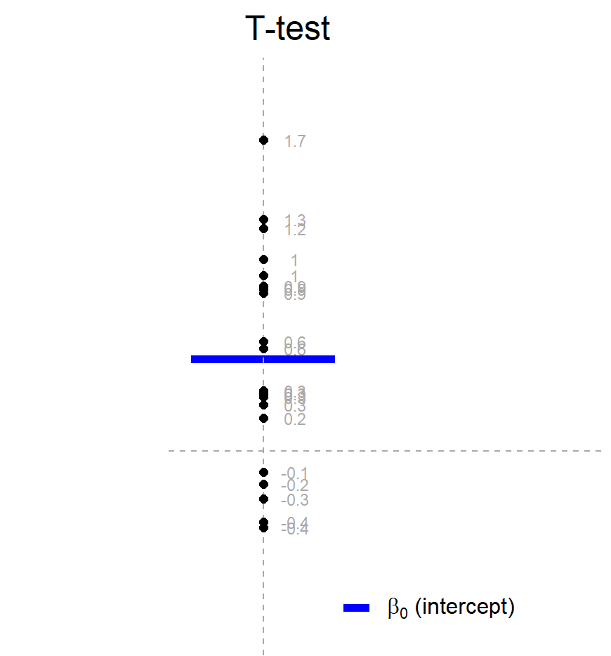
</p>
]
---
# 8.1 *t*-test系列均为回归模型的特例
## 8.1.3 单样本*t*检验(one sample *t*-test)

.pull-left[
```{r,results='hide'}
stats::t.test(
  x = df.penguin$Temperature, # 核心体温均值
  mu = 36.6) 
  
```

<br>
<br>
<p align="center">
  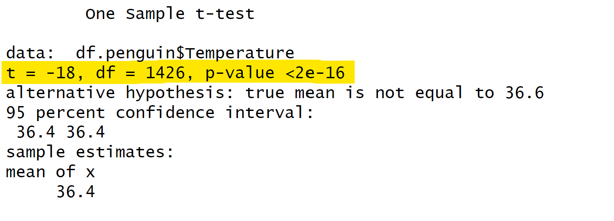
</p>

]
.pull-right[
```{r,results='hide'}
model.single <- lm(
  data = df.penguin,
  formula = Temperature - 36.6 ~ 1
  ) 
summary(model.single) 
```

<br>
<br>
<p align="center">
  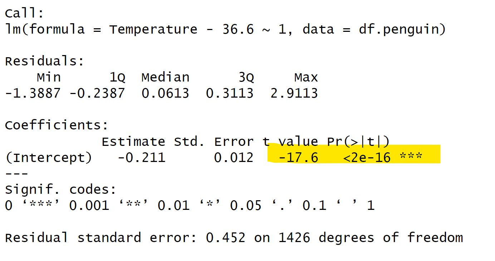
</p>

]

---
# 8.1 *t*-test系列均为回归模型的特例
## 8.1.4 配对样本*t*检验(paired *t*-test)
* 例如，在penguin数据中，被试报告的两次核心温度(Temperature_t1, Temperature_t2)是否有显著差异？<br>
<br>
--
**比较两个相关的样本组（例如，同一组受试者在不同条件下的测量）的平均值是否存在显著差异。**<br>
<br>
**前提条件**
* 正态性：样本数据应来自正态分布的总体。样本量足够大时，即使不严格服从正态分布，结果也是稳健的。
* 独立性：配对样本中的观测值必须是独立的，即每一对观测值不应影响其他对的观测值。
* 配对设计：数据必须是以配对形式收集的。<br>
<br>
**假设**
* $H_0$: 配对样本的总体平均差与零没有显著差异（两个配对样本的均值没有显著差异）。
* $H_1$: 配对样本的总体平均差与零有显著差异（两个配对样本的均值存在显著差异）。
<br>

$$t = \frac{\bar{X} - \mu}{s / \sqrt{n}}$$
---
# 8.1 *t*-test系列均为回归模型的特例
## 8.1.4 配对样本*t*检验(paired *t*-test)

$$y_1 - y_2 = \beta_0 $$
$$H_0: \beta_0 = 0 $$
--
可以将配对样本*t*检验理解为对差值进行的单样本*t*检验，即单独用一个数字来预测对应的差值（见图的右半部分）。<br>
也可以认为这些组间之差是斜率（见图的左半部分）。<br>

<p align="center">
  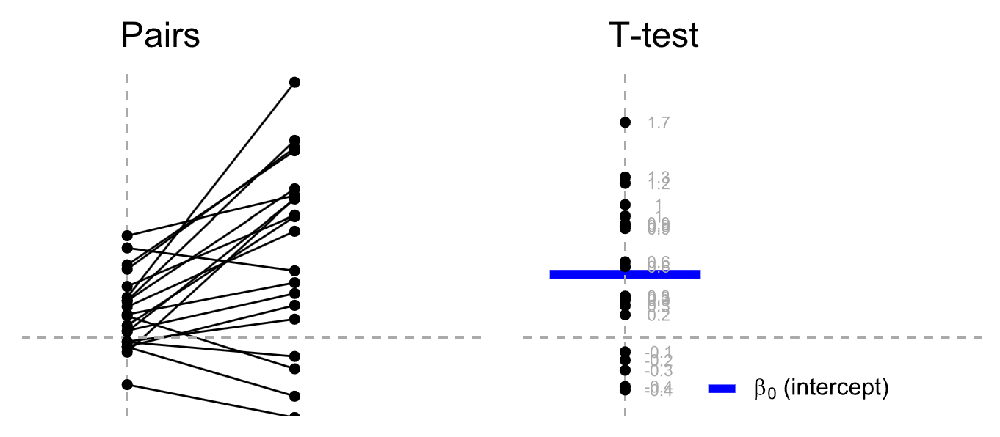
</p>

---
# 8.1 *t*-test系列均为回归模型的特例
## 8.1.4 配对样本*t*检验(paired *t*-test)
.pull-left[

```{r,results='hide'}
stats::t.test(
  x = df.penguin$Temperature_t1, 
  y = df.penguin$Temperature_t2, 
  paired = TRUE
  )
```

<br>
<br>
<p align="center">
  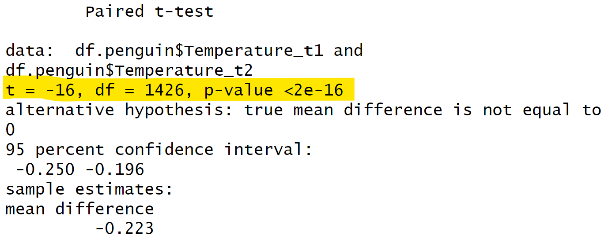
</p>

]
.pull-right[

```{r,results='hide'}
model.paired <- lm(
  Temperature_t1 - Temperature_t2 ~ 1,
  data = df.penguin
  )
summary(model.paired)
```

<br>
<br>
<p align="center">
  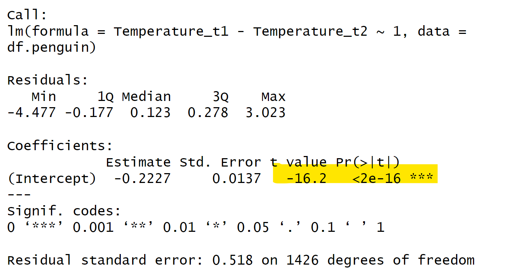
</p>

]

---
# 8.1 *t*-test
## 8.1.5 bruceR::TTEST
* 如果偏好按传统方式使用*t*检验，推荐`bruceR::TTEST`函数

<p align="center">
  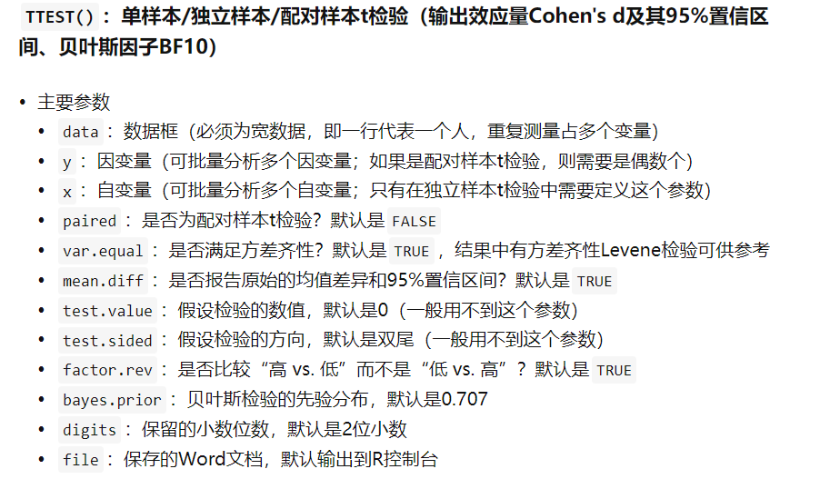
</p>

中文帮助文档：https://zhuanlan.zhihu.com/p/281150493
---
# 8.1 *t*-test
## 8.1.5 bruceR::TTEST
.panelset[
.panel[.panel-name[独立样本t检验]
.pull-left[

```{r,results='hide'}
stats::t.test(
  data = df.penguin, 
  Temperature ~ romantic,
  var.equal = TRUE
  ) 
```


<br>
<p align="center">
  
</p>
]
.pull-right[

```{r,results='hide'}
bruceR::TTEST(
  data = df.penguin, # 数据
  y = "Temperature", # 因变量
  x = "romantic"     # 自变量
) 
```

<br>
<p align="center">
  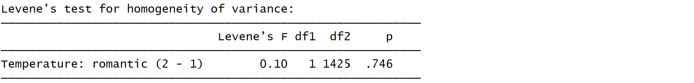
</p>


]
.panel[.panel-name[单样本t检验]
.pull-left[

```{r, results='hide'}
stats::t.test(
  x = df.penguin$Temperature, 
  mu = 36.6
  )

```


<br>
<p align="center">
  
</p>
]
.pull-right[

```{r,results='hide'}
bruceR::TTEST(
  data = df.penguin, # 数据
  y = "Temperature", # 确定变量
  test.value = 36.6, # 固定值
  test.sided = "=")  # 假设的方向

```

<br>
<p align="center">
  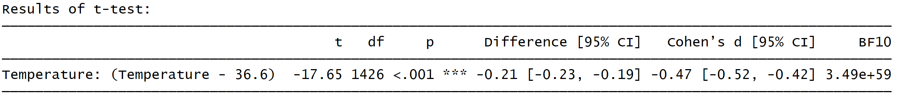
</p>

]
.panel[.panel-name[配对样本t检验]

.pull-left[

```{r,results='hide'}
stats::t.test(
  x = df.penguin$Temperature_t1, #第1次
  y = df.penguin$Temperature_t2, #第2次
  paired = TRUE) 
  
```


<br>
<p align="center">
  
</p>
]
.pull-right[

```{r, results='hide'}
bruceR::TTEST(
  data = df.penguin, # 数据
  y = c("Temperature_t1",  
        "Temperature_t2"), # 变量为两次核心体温
  paired = T)  # 配对数据，默认是FALSE
```

<br>
<p align="center">
  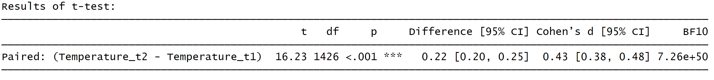
</p>
]
]]]]

---
# 8.1 *t*-test系列均为回归模型的特例
<br>
<br>

|       | R自带函数 | 线性模型 | 解释 |
|-------|-------|-------|-------|
| 单样本*t* | t.test(y, mu = 0) | lm(y ~ 1)| 仅有截距的回归模型 |
| 独立样本*t* | t.test($y_1$, $y_2$) | lm(y ~ 1 + $G_2$)| 自变量为二分变量的回归模型 |
| 配对样本*t* | t.test($y_1$, $y_2$, paired=T)  | lm($y_1$ - $y_2$ ~ 1)| 仅有截距的回归模型)|


---
class: center, middle
<span style="font-size: 60px;">8.2  ANOVA & linear regression</span> <br>


---
class: left, middle
<span style="font-size: 60px;">8.2.1  研究问题</span> <br>

<br>
<span style="font-size: 35px;">Q: 如何同时比较不同赤道距离(DEQ)和不同恋爱状态(romantic)下被试体温的差异</span> <br>
<br>
<span style="font-size: 40px;">A: 双因素被试间方差分析</span> <br>


---
# 8.2  ANOVA & linear regression
## 8.2.2 代码实操 & 知识回顾
.pull-left[
<br>
**方法简介：**

当研究者想要比较两个或多个组之间的均值差异时，可使用方差分析(Analysis of Variance，简称ANOVA)。<br>
<br>
它由英国统计学家R.A.Fisher提出，基本思想是，在**实验**研究中，将测量数据的总变异（即总方差）按照变异来源分为处理（组间）效应和误差（组内）效应，并作出其数量估计，从而确定实验处理对研究结果影响力的大小。

**假设：**
* $H_0$: 各因素各个水平下，因变量的均值完全相同
* $H_1$: 各因素各个水平下，因变量的均值不完全相同
]

.pull-right[
<br>
<br>
<br>
<br>
**前提条件：**

* 可加性：各效应可加，即观测值是由各主效应，交互作用以及误差通过相加得到的<br>
* 随机性：各样本（观测值）是随机样本<br>
* 正态性：各样本来自于正态分布的总体<br>
* 独立性：各样本观测值互相独立<br>
* 方差齐性：各样本来自的总体方差相同<br>
* 因变量应为连续变量<br>

]

---
# 8.2  ANOVA 
## 8.2.2 代码实操|数据预处理
.panelset[
.panel[.panel-name[DEQ 分布]

```{r}
summary(df.penguin$DEQ)
```

]

.panel[.panel-name[climate 分组]

```{r, results='hide'}
# 设定分割点
# [0-23.5 热带， 23.5-35 亚热带]， [35-40 暖温带， 40-50 中温带]， [50-66.5 寒温带]
breaks <- c(0, 35, 50, 66.5)

# 设定相应的标签
labels <- c('热带', '温带', '寒温带')

# 创建新的变量
df.penguin$climate <- cut(df.penguin$DEQ, 
                          breaks = breaks, 
                          labels = labels)
```

```{r, echo=FALSE}
summary(df.penguin$climate)
```

]

.panel[.panel-name[tidy data]

```{r}
df <- df.penguin %>% 
  select(subjID, climate, romantic, Temperature) 
  
```

```{r example of df, echo=FALSE}
DT::datatable(head(df), fillContainer = TRUE)
```

]]


---
# 8.2  ANOVA & linear regression
## 8.2.2 代码实操|正态性检验
.panelset[
.panel[.panel-name[KS检验]

```{r}
# 正态性检验-Kolmogorov-Smirnov检验
# 若p >.05，不能拒绝数据符合正态分布的零假设
ks.test(df$Temperature, 'pnorm')
```

```{r}
# 进行数据转换，转换后仍非正态分布
df$Temperature_log <- log(df$Temperature)
ks.test(df$Temperature_log, 'pnorm')
```

.panel[.panel-name[qq图]
```{r, fig.width=7, fig.height=5}
# 正态性检验-qq图
qqnorm(df$Temperature)
qqline(df$Temperature, col = "red") # 添加理论正态分布线
```

.panel[.panel-name[直方图]
```{r, fig.width=7, fig.height=5}
ggplot(df, aes(Temperature)) +
    geom_histogram(aes(y =..density..), color='black', fill='white', bins=30) +
    geom_density(alpha=.5, fill='red')
```

]]]]


---
# 8.2  ANOVA & linear regression
## 8.2.2 代码实操|双因素被试间方差分析
.panelset[
.panel[.panel-name[stats::aov()]

```{r}
aov1 <- stats::aov(Temperature ~ climate * romantic, data = df)
summary(aov1)
```

.panel[.panel-name[SPSS]
```{r, echo = FALSE, fig.width = 4.5, fig.height = 3}
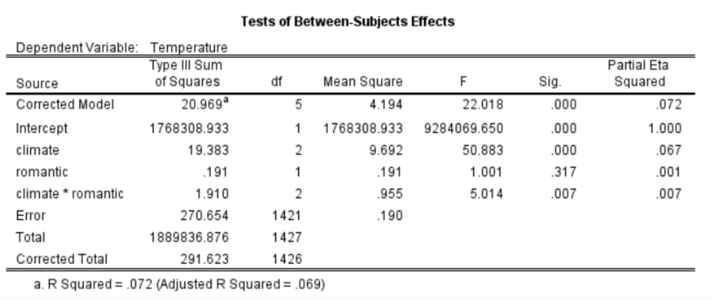
```

]]]


---
class: center, middle
<span style="font-size: 60px;">结果为什么不相同？</span> <br>


---
# 8.2  ANOVA & linear regression
## 8.2.2 代码实操|平方和(SS)的计算
<br>
在平衡设计中，三种类型的平方和的结果会很清晰，并且方差分析的结果独立于平方和的类型；<br>
而在非平衡设计中，尤其是当各组样本量差距较大时，三种类型的平方和计算结果可能会不同，此时需要根据具体研究设计和问题来选择使用哪一种类型的平方和。<br>
<br>
对于 Y ~ A + B + A * B<br>
<br>
.panelset[
.panel[.panel-name[Type I SS]
<br>
解释变量的顺序会影响到类型I平方和的计算结果，通常用于顺序重要的模型。<br>
效应根据表达式中先出现的效应做调整。A不做调整，B根据A调整，A:B交互项根据A和B调整。<br>
<br>
**stats::aov()函数默认采用的就是Type I SS，它逐步将每一个因子引入模型进行计算。**<br>

.panel[.panel-name[Type II SS]
<br>
忽略了因子之间可能存在的交互作用，适用于所有主效应不涉及交互效应的情况。<br>
假定所有的因子都是同时进入模型的，并且它们都是等价的。<br>
效应根据同水平或低水平的效应做调整。A根据B调整，B依据A调整，A:B交互项同时根据A和B调整。<br>
<br>
**car::Anova()函数默认计算Type II SS，可以通过type = 3调整为Type III SS。**<br>

.panel[.panel-name[Type III SS]
<br>
更全面，假定所有因子（以及它们的交互项）都是重要的，并考虑所有因素。<br>
每个效应根据模型其他各效应做相应调整。A根据B和A:B做调整，A:B交互项根据A和B调整。<br>
<br>
**SPSS默认采用Type III SS。**<br>
**bruceR::MANOVA*()函数也默认采用Type III SS，可以通过ss.type = 2调整为Type II SS。**<br>

]]]]


---
# 8.2  ANOVA & linear regression
## 8.2.2 代码实操|双因素被试间方差分析
.panelset[
.panel[.panel-name[car::Anova()]
```{r}
# 结果不一致，原因PPT显示不全，请回到rmd文档查看
aov1 <- car::Anova(stats::aov(Temperature ~ climate * romantic, data = df))
aov1
```

```{r}
# 原因debug
# 查看R的默认对比设置
options("contrasts")
# 从输出结果可知，无序默认为contr.treatment()，有序默认为contr.poly()
# factor()函数来创建无序因子，ordered()函数创建有序因子

is.factor(df$climate)
is.ordered(df$climate)
# climate是无序因子

# 创建一个3水平的因子的基准对比
c1 <- contr.treatment(3)

# 创建一个新的对比，这个编码假设分类水平之间的差异被等分，每一个水平与总均值的差异等于1/3
my.coding <- matrix(rep(1/3, 6), ncol=2)
# 将对比调整为每个水平与第一个水平的振幅减去1/3
# 可能的原因：除了关心每个水平对应的效果，同时也关心水平与水平之间的效果
my.simple <- c1-my.coding
my.simple

# 更改climate的对比
contrasts(df$climate) <- my.simple

# 将数据集df的romantic列的对比设为等距对比，它假设分类水平之间的差异为等距离
contrasts(df$romantic) <- contr.sum(2)/2

# 方差分析
aov1 <- car::Anova(lm(Temperature ~ climate * romantic, data = df),
                   type = 3)
aov1
```

.panel[.panel-name[afex::aov_ez()]
```{r}
afex::aov_ez(id = "subjID", 
             dv = "Temperature", 
             data = df, 
             between = c("climate", "romantic"), 
             type = 3)
```

```{r,results='hide'}
# afex中的其他函数可以得到同样的结果
afex::aov_car(Temperature ~ climate * romantic + Error(subjID), data = df, type = 3)
afex::aov_4(Temperature ~ climate * romantic + (1|subjID), data = df)
```


]]]

---
# 8.2  ANOVA & linear regression
## 8.2.3 线性回归

.pull-left[

<br>
<br>
<br>
这里的ANOVA仍然是线性回归模型的特例，即自变量是离散变量的情况。
<br>
如果使用哑变量（dummy coding）对自变量进行编码后进入回归方程，线性模型中的斜率即是对组间差异的估计。<br>
<br>
**双因素方差分析可以看作是一种特殊的线性回归模型，自变量为两个分类变量。**<br>

]

.pull-right[
<br>
<br>
```{r, echo = FALSE, fig.width = 3.5, fig.height = 2}
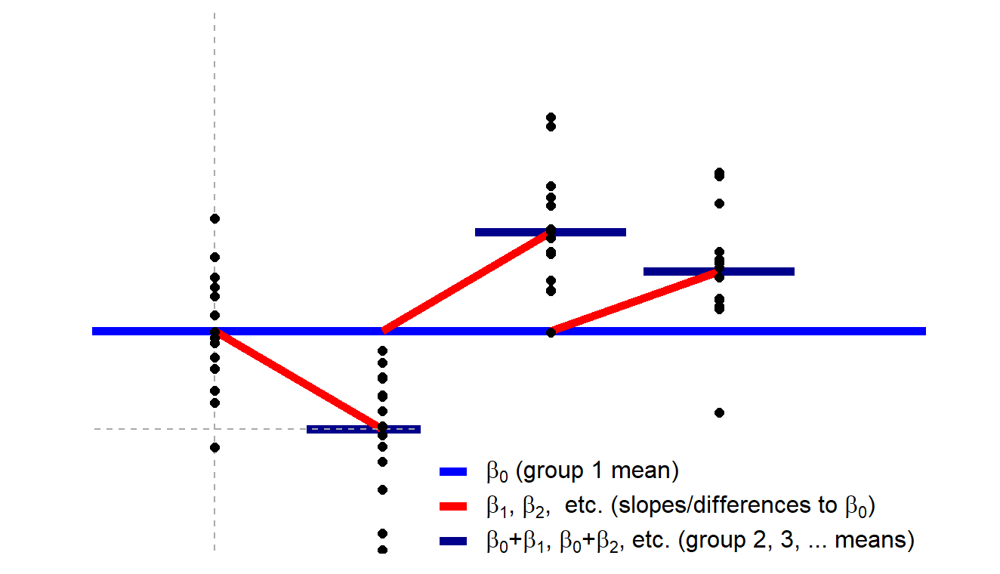
```
]

---
# 8.2  ANOVA & linear regression
## 8.2.3 线性回归
.pull-left[

```{r,results='hide'}
aov1 <- car::Anova(
  aov(Temperature ~ climate * romantic, 
      data = df), 
  type = 3
  )
aov1
```
<br>
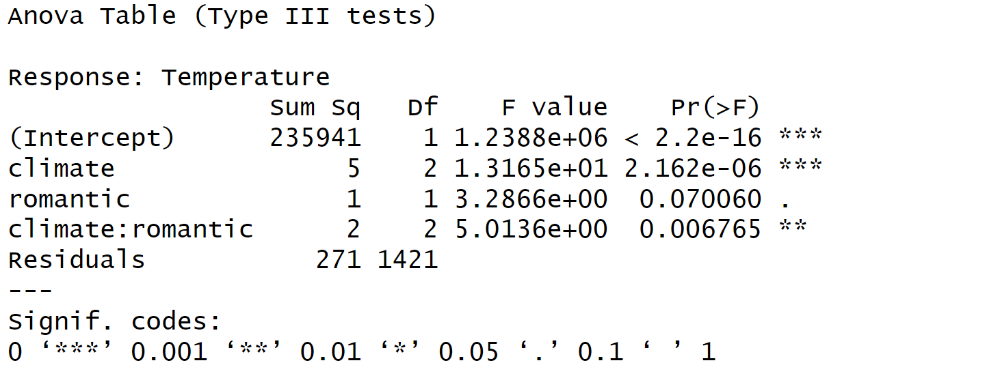
]


.pull-right[

```{r,results='hide'}
lm1 <- car::Anova(
  lm(Temperature ~ climate * romantic, 
     data = df), 
  type = 3
  )
lm1
```
<br>
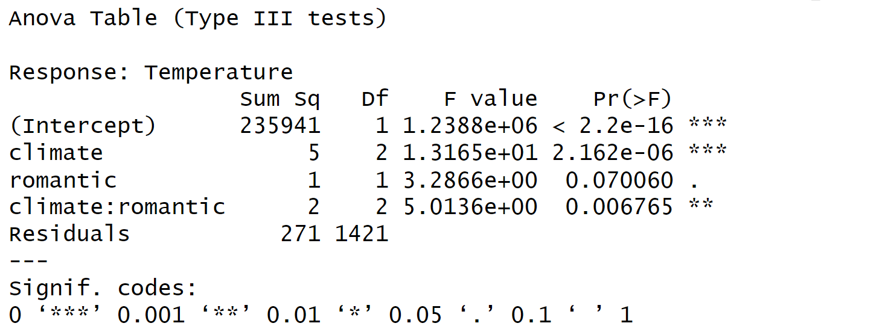

]


---
# 8.2  ANOVA & linear regression
## 8.2.2 代码实操: `bruceR`
* 使用`bruceR`可以更简单地实现心理学中习惯的ANOVA，但要注意数据格式
<p align="center">
  
</p>


---
# 8.2  ANOVA & linear regression
## 8.2.2 代码实操: `bruceR::MANOVA`
<p align="center">
  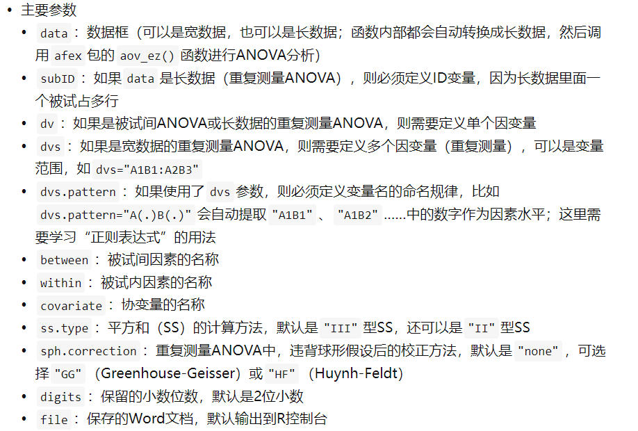
</p>


---
# 8.2  ANOVA & linear regression
## 8.2.2 代码实操: `bruceR::MANOVA`
```{r,results='hide'}
res1 <- bruceR::MANOVA(data = df, 
                       dv = "Temperature", 
                       between = c("climate", "romantic"))
```
```{r,echo=FALSE}
res1 %>%
  capture.output()
```


---
# 8.2  ANOVA & linear regression
## 8.2.2 代码实操: `bruceR::EMMEANS`
更进一步进行简单效应分析与多重比较
<p align="center">
  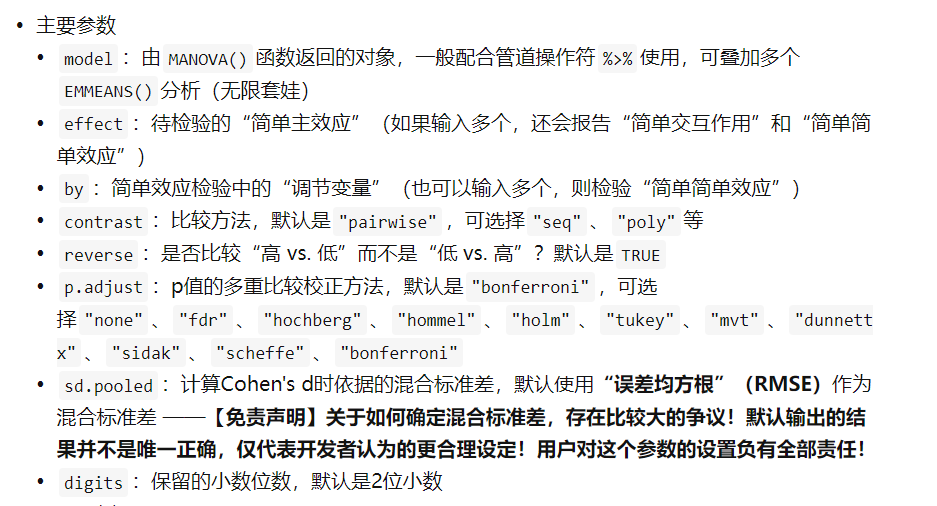
</p>


---
# 8.2  ANOVA & linear regression
## 8.2.2 代码实操: `bruceR::EMMEANS` | 代码
```{r, results='hide'}
sim_eff_out1 <- capture.output(
  res1 %>% bruceR::EMMEANS("climate", by = "romantic")
)

sim_eff_out2 <- capture.output(
  res1 %>% bruceR::EMMEANS("romantic", by = "climate")
)
```

---
# 8.2  ANOVA & linear regression
## 8.2.2 代码实操: `bruceR::EMMEANS` | 输出（climate by romantic）

```{r echo=FALSE, results='asis'}
cat(
  sprintf(
    '<pre style="font-size: 18px; line-height: 1.3; white-space: pre-wrap;">%s</pre>',
    htmltools::htmlEscape(paste(sim_eff_out1, collapse = "\n"))
  )
)
```

---
# 8.2  ANOVA & linear regression
## 8.2.2 代码实操: `bruceR::EMMEANS` | 输出（romantic by climate）

```{r echo=FALSE, results='asis'}
cat(
  sprintf(
    '<pre style="font-size: 18px; line-height: 1.3; white-space: pre-wrap;">%s</pre>',
    htmltools::htmlEscape(paste(sim_eff_out2, collapse = "\n"))
  )
)
```

---
# 8.2  ANOVA & linear regression
## 8.2.4 知识延申|单因素方差分析示例 | 代码
```{r, results='hide'}
# DEQ对Temperature的影响
res2_out <- capture.output(
  bruceR::MANOVA(
    data = df,
    dv = "Temperature",
    between = "climate")
)
```


---
# 8.2  ANOVA & linear regression
## 8.2.4 知识延申|单因素方差分析示例 | 输出（1/2）

```{r echo=FALSE, results='asis'}
cat(
  sprintf(
    '<pre style="font-size: 18px; line-height: 1.3; white-space: pre-wrap;">%s</pre>',
    htmltools::htmlEscape(paste(res2_out[1:min(18, length(res2_out))], collapse = "\n"))
  )
)
```

---
# 8.2  ANOVA & linear regression
## 8.2.4 知识延申|单因素方差分析示例 | 输出（2/2）

```{r echo=FALSE, results='asis'}
cat(
  sprintf(
    '<pre style="font-size: 18px; line-height: 1.3; white-space: pre-wrap;">%s</pre>',
    htmltools::htmlEscape(paste(res2_out[19:length(res2_out)], collapse = "\n"))
  )
)
```


---
# 8.2  ANOVA & linear regression
## 8.2.4 知识延申|总结
<br>
<br>

|       | R自带函数 | 线性模型 | 解释 |
|-------|-------|-------|-------|
| 单因素ANOVA | aov(y ~ G) | lm(y ~ 1 + $G_1$ + $G_2$ + ...)| 一个离散自变量的回归模型 |
| 多因素ANOVA | aovt(y ~ G * S) | lm(y ~ $G_1$ + $G_2$ + ... + $S_1$ + $S_2$ + ...)| 多个离散自变量的回归模型 |


---
<h1 lang="zh-CN" style="font-size: 60px;">课堂总结</h1>

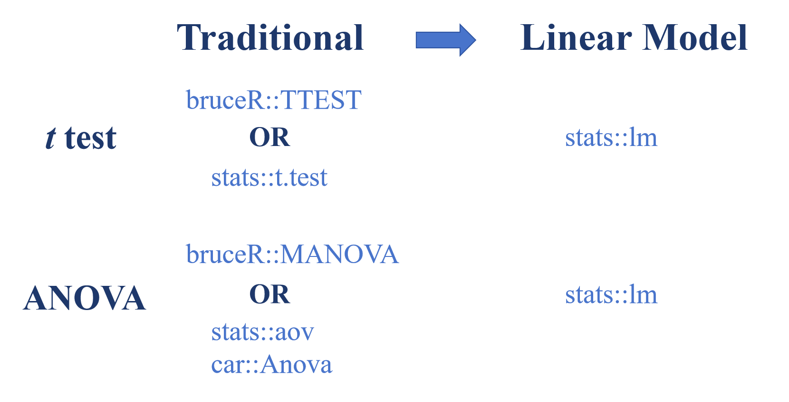


---
<h1 lang="zh-CN" style="font-size: 60px;">课堂总结</h1>

|       | R自带函数 | 线性模型 | 解释 |
|-------|-------|-------|-------|
| 单样本*t* | t.test(y, mu = 0) | lm(y ~ 1)| 仅有截距的回归模型 |
| 独立样本*t* | t.test($y_1$, $y_2$) | lm(y ~ 1 + $G_2$)| 自变量为二分变量的回归模型 |
| 配对样本*t* | t.test($y_1$, $y_2$, paired=T)  | lm($y_1$ - $y_2$ ~ 1)| 仅有截距的回归模型)|
| 单因素ANOVA | aov(y ~ G) | lm(y ~ 1 + $G_1$ + $G_2$ + ...)| 一个离散自变量的回归模型 |
| 多因素ANOVA | aovt(y ~ G * S) | lm(y ~ $G_1$ + $G_2$ + ... + $S_1$ + $S_2$ + ...)| 多个离散自变量的回归模型 |

参考：https://lindeloev.github.io/tests-as-linear/#61_one-way_anova_and_kruskal-wallis


---
class: center, middle
<span style="font-size: 60px;">思考</span> <br>
<span style="font-size: 55px;">如何从回归模型的角度理解重复测量方差分析呢？</span> <br>


---
<h1 lang="zh-CN" style="font-size: 60px;">课堂练习</h1>
<br>
<br>
<br>
<h2 lang="zh-CN">1. 在Penguin数据中，处在不同恋爱状态下(romantic)的被试在社交复杂度(socialdiversity)上是否有显著差异？</h2>
<br>
<br>
<h2 lang="zh-CN">2. 在Penguin数据中，不同气候带(DEQ)与恋爱状态(romantic)对被试社交复杂度(socialdiversity)的影响.</h2>

---

class: center, middle
<span style="font-size: 60px;">如何使用大语言模型进行分析</span> <br>

---

# 分析笔记文件：

.font-size-14[
**目的：** 为了避免在对话框中插入过多内容，把分析思路整理到一个文件中。

**作用：**
- 记录你的分析思路
- 记录指标定义
- 记录变量结构
- 记录计算逻辑

**AI 每次只要读取这个文件，就能理解你的逻辑。**
]

---

# 分析笔记文件：

.font-size-14[
**推荐使用 .md 文件：**

- 结构清晰
- 可读性高
- AI 解析好

**使用示例：**
```
Please read analysis_notes.md first.
This file describes my analysis logic.
Based on this analysis logic, help me write R code.
```
]


---

# 分析笔记文件：

.font-size-14[
**好处：**

1. **减少重复输入**
   - 不用每次都解释数据结构
   - 不用每次都写计算逻辑

2. **便于迭代优化**
   - 思路可以随时查看和修改
   - AI 可以基于现有逻辑改进

3. **便于团队协作**
   - 分析逻辑文档化
   - 其他人也能理解你的思路

**建议：** 把 analysis_notes.md 放在数据文件夹或项目根目录中。
]

---

# 问卷类 Prompt 使用指南

.font-size-14[
参考 `slides/pure_agent_prompt/questionnaire_example_AGENTs.md`：
- 问卷数据清洗与量表计分
- 问卷数据分组汇总
- 问卷类 EDA 与可视化
- 问卷类 ggplot / 数据探索报错排查
]

---

# 实验类 Prompt 使用指南

.font-size-14[
参考 `slides/pure_agent_prompt/experiment_example_AGENTs.md`：
- 批量导入与清洗实验数据
- 分条件汇总、长宽转换与效应指标
- 实验类 EDA 与可视化
- 实验类报错排查
- 使用 analysis_notes.md 约束实验分析逻辑
]

---

# 提交前自检

.font-size-14[
**检查清单：**
1. 路径是否与仓库一致（优先 here::here("slides", "data", ...)）
2. 包是否与课件一致（问卷优先 bruceR + tidyverse，实验优先 tidyverse）
3. 变量名、分组变量、缺失值处理要求是否已明确写入 prompt
4. 是否要求模型先澄清再写代码；多步骤任务是否要求先给计划
5. 是否把解释性内容压缩到注释中，而不是散落在正文
]
